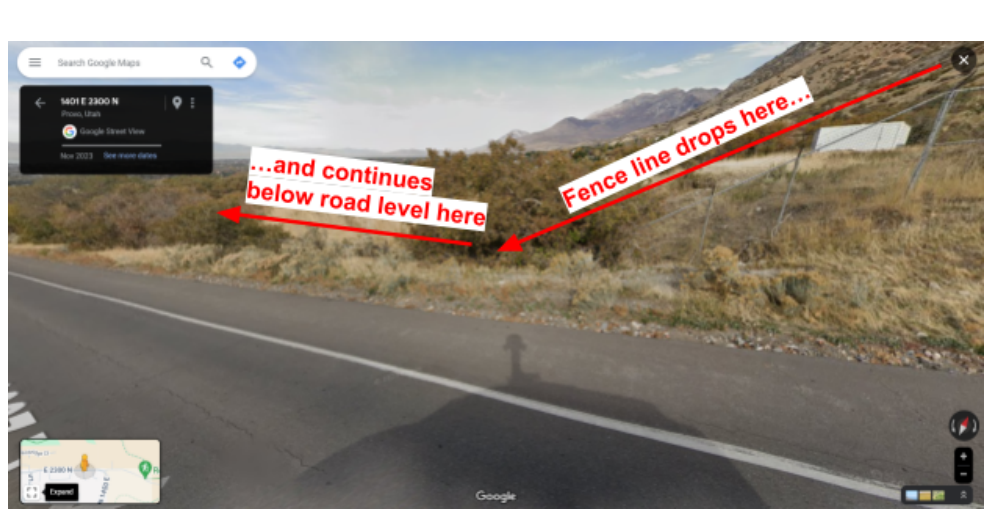
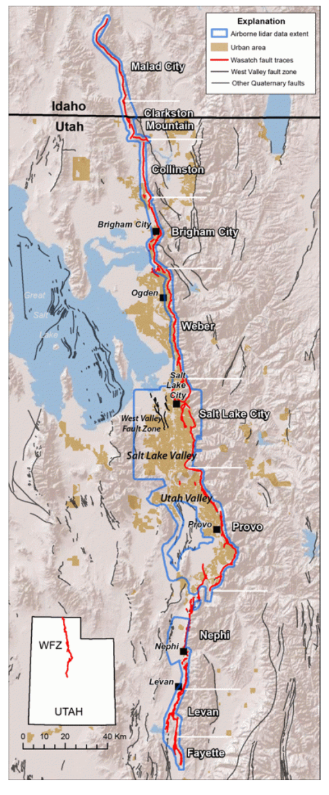
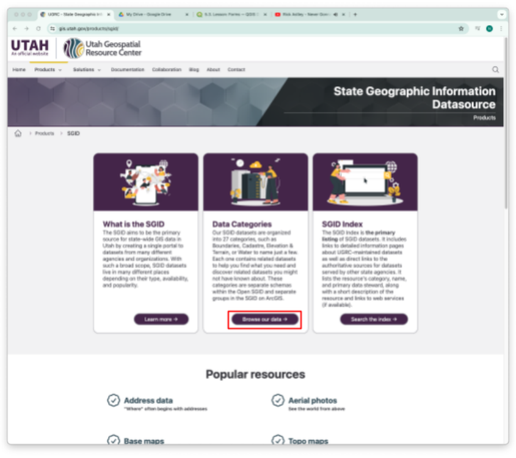
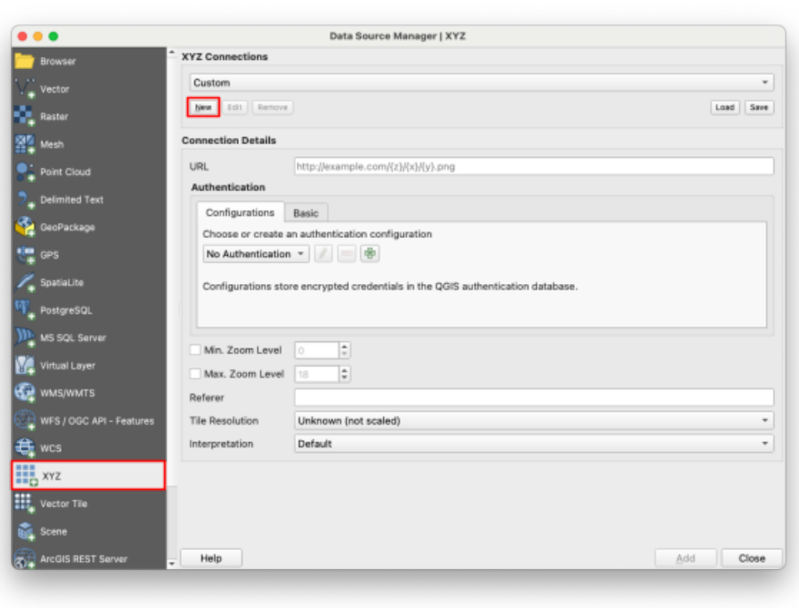
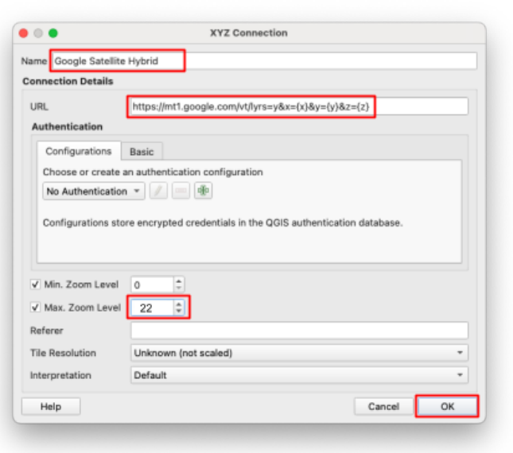
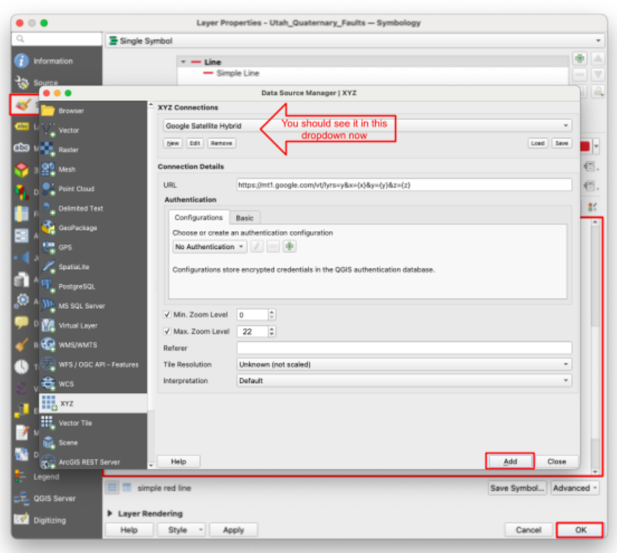
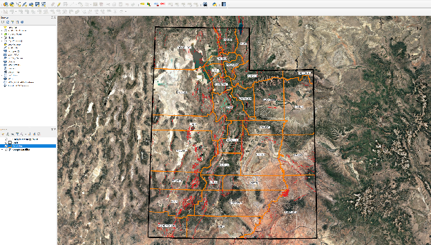

# Lab 1: Getting Started with Geographic Information Systems

**Civil and Construction Engineering 114 — Geomatics**

Winter 2026 · Dr. Dan Ames

*Lab assignment developed by Nathan Godfrey and Dr. Ames*

## **Background**

Fault lines are a real issue in Utah, especially along the highly active Wasatch Front. As you may know, a fault is “a break in the earth’s crust along which movement can take place” ([Utah Geological Survey](https://geology.utah.gov/hazards/earthquakes/utah-faults/#:~:text=A%20fault%20is%20a%20break,take%20place%20causing%20an%20earthquake.)). Around here in Utah Valley, that movement can generally range from light shaking to dozens of feet of displacement. It’s crucial for civil engineers to be aware of fault lines because they can jeopardize the safety of buildings, roads, bridges, dams, and more.

Just north of BYU, we can find evidence of very recent tectonic movement. Well, recent in geologic time. On your way out of Rock Canyon on 2300 N, the fence follows a sharp drop in the ground level. According to the [BYU Geology Department](https://geology.byu.edu/fault-scarp), this was a major seismic event that happened only 400 years ago. That’s basically “last week” in geologic time. During this event, a whopping 3 meters (9.8 feet) of offset occurred.

**Figure 1\.** Seismic activity visible in Provo, Utah (*from Google street view*).   
The ground here still moves in human time, too, not just geologic time. On the morning of March 18, 2020, a magnitude 5.7 earthquake centered near Magna rattled the entire Wasatch Front. It was Utah's largest earthquake since 1992, and it famously knocked the trumpet out of the Angel Moroni statue's hand atop the Salt Lake Temple. Seismologists who studied the quake concluded it likely occurred on the Wasatch fault system, the same fault system you will be mapping today. You can read more at https://earthquakes.utah.gov/magna-quake/

Engineers, geologists, and lawmakers have evolved their approach to handling faults over time. As standards have significantly changed, the Utah Geological Survey (UGS) even recommends that buyers of homes built before 1985 personally check fault maps of the area to determine if the home is near a fault ([link](https://geology.utah.gov/hazards/earthquakes/utah-faults/#toggle-id-4)). Your task today is to do something similar.

Think about different ways to make a map of fault lines in Utah. Can you do it in Google Maps? Go ahead and try. What happens? Try a Google web search for “Provo fault lines.” That brings up a link to the UGS website, where you can find this image of the Wasatch Fault (*below*). Would it be okay to use this map to check if your house is on a fault? Why or why not?

Now that you realize why and how we might want to use GIS software to solve such a problem, let’s get to it.

**Figure 2\.** Wasatch area fault map (*from the Utah Geological Survey*).

## **Problem Statement**

You are a seismic engineer working for BYU, and you’ve been asked to identify locations that might be susceptible to shifting fault lines. As an engineer, you know that building on a fault line is a massive risk, and so you should **check for quaternary fault lines that might run through the BYU campus.**

This is an easy task in QGIS that you can accomplish by downloading an existing shapefile of Utah’s fault lines and putting a satellite basemap behind it. Sometimes simple viewing like this is all that’s needed, but only possible in GIS software.

## **Learning Objectives**

* Learn how to open and interact with QGIS software  
* Learn how to discover and download from an online source  
* Learn how to add data and XYZ tile basemaps to a QGIS project  
* Learn how to visualize GIS data with simple symbology  
* Discover and consider uses of GIS in civil and construction engineering

## **Software and Data**

* For this lab we will use the GIS software application, QGIS (also known as Quantum GIS). This is a free/open source GIS package that runs on Windows, Mac, and Linux operating systems. The software is pre-installed in the Clyde Building 234 computer lab. You can also download it and install it on your own computer from this website: [https://www.qgis.org/](https://www.qgis.org/). We will be using this version throughout the course: *“Long Term Version 3.44 (LTR)”.*   
* There are no custom data downloads for this lab. Follow the instructions to download data from the State of Utah GIS website: [https://gis.utah.gov/products/sgid/](https://gis.utah.gov/products/sgid/)

## **Instructions**

### **Downloading Data from UGRC**

1. Google “Utah GIS data”  
2. Click one of the Utah.gov links  
3. If you don’t see this page, go to the “Products\>\>SGID” page at the top (State Geographic Info Datasource)  

4. Click “Browse our data”  
5. Find the Geoscience category  
6. Scroll down to find “Utah Quaternary Faults”  
7. Click the first link under “Explore and Download.”  
8. Click “Download”  
9. Select the “Shapefile” download  
10. Open your downloads folder and **unzip the file you just downloaded (it will have a name like “Utah\_Quaternary\_Faults.zip”)**  
11. Repeat steps 4-10. Go to the Boundaries category instead of Geoscience and find “Utah County Boundaries” and “Utah State Boundary”

### **Creating the Map**

12. Open QGIS  
13. Create a new project by clicking the blank page in the upper left corner  
14. Drag and drop the unzipped “Utah\_Quaternary\_Faults”, “Utah”, and “Counties” folders onto the blank map space  
15. You should see a bunch of lines running mostly north-south, as well as outlines of Utah and its counties. If not, find the layers panel, right-click the faults layer, and select “Zoom to Layer(s)”  
16. **SAVE** your project\! (Do this frequently\!)  
17. Now let’s add the basemap. There are two ways to do this. **Option 1:**   
    1. Open the Data Source Manager by clicking this symbol   in the top left. Find and select the “XYZ” tab on the left side of the DSM window, click “New”  

    2. Insert the following information in the pop-up window:  

       1. Name \= Google Satellite Hybrid  
       2. URL \= https://mt1.google.com/vt/lyrs=y\&x={x}\&y={y}\&z={z}  
       3. Max. Zoom Level \= 22  
    3. Press OK  

    4. You should now see “Google Satellite Hybrid” in the dropdown at the top. It will also be available here in future projects when you use the same computer. Click “Add” and close the DSM window.  
    5. You should now see a second layer on your map that looks like Google Maps’ satellite view. That’s because this layer is using the same data as your Google Maps app.

    **Option 2:** Use the QuickMapServices Plugin. Go to the Plugins menu and Plugin Manager, and search for this plugin. Install it. Then, open it from the toolbar and use its search function to find the Google (or other base maps) you want to use in your map.

    

18. **SAVE** your project  
19. Find the Layers Panel on the main QGIS window.  
20. You’ll probably see that the Google layer is above the Utah Quaternary Faults layer. Swap them by clicking and dragging one so that the faults layer is on top. This is how you rearrange layers to appear above or below each other in the display.

### **Changing Symbology**

21. Double-click on the Utah\_Quaternary\_Faults layer in the Layers Panel  
22. Find the Symbology tab on the left side of the window that opens  
23. Review the listed default options in the large box and select one that is clearly visible over the satellite map. Increase the width if needed, and press OK. (Keep it simple this time, we’ll do more with symbology in the future)  

24.  Follow the same steps for the Counties and Utah boundary layers. Find any “Project Style” that is an outline.   
25. Add labels to the Counties layer. Double-click on the Counties layer and find “Labels” on the left side (It should be under “Symbology”). On the top, you’ll see a drop-down menu that says “No Labels”. Select “Single Label” then mess around with the settings until you get something you’re happy with.   
26. Now the faults and boundaries should be easier to see, and your map should look something like this:

27. Click and drag while holding the Shift key to draw a rectangle around Utah Lake and Provo. This is a quick way to zoom in on a selected area. Otherwise, you can navigate QGIS maps by panning/zooming with the mouse.  
28. On your new map, locate the BYU campus and observe the local fault lines to answer the question posed in the problem statement  
29. Grab a screenshot of your entire QGIS window, showing that you’ve zoomed in on the BYU campus.  
30. **SAVE** your project

## **Deliverables**

Submit a PDF file that contains:

1. Your QGIS screenshot  
2. The answer to these questions:  
   1. What is GIS?  
   2. What is QGIS?  
   3. Do any fault lines run through the BYU campus? If so, where?  
3. Search online for an article about a real-life engineering project/study that used GIS and that is interesting to you. Paste the link, then write a short paragraph explaining the project, how GIS was used, and why you found it interesting.  
   1. [This page](https://www.esri.com/about/newsroom/esri-blog/all-articles/) at ESRI is a good place to look  
   2. Or [this page](https://www.esri.com/en-us/arcgis/products/arcgis-storymaps/contest/gallery/2023-winners), also at ESRI (contest winners for their StoryMaps software)  
   3. Or alternatively, research John Snow’s cholera map (John Snow, not Jon Snow from GoT). His work was one of the most significant uses of GIS-like methods before computers or GIS existed. Write a short paragraph to explain what he did and how it relates to GIS.  
4. The grading rubric

## **Grading Rubric**

The following rubric will be used to evaluate your lab assignment. Use this as a guide to ensure that you include all the required elements for this lab. Shown under “Score” is the maximum possible points you can receive for each item. 

Sometimes, points are awarded on a "yes or no" basis, giving full points if something is present and none if it is not. At other times, points are awarded on a scale, depending on how well you complete the task. Please keep this in mind. For example, if there is a written answer required, grading will be based on a scale of points, depending on the quality and completeness of your written answer.

Copy the rubric and paste it into your lab report. Fill in your self-evaluation of the rubric, showing how many points you feel you have earned for each item.

| Requirement | Score |
| ----- | ----- |
| Include a screenshot of your QGIS window, showing the following: A visible fault line layer *(2 pts)* Counties are visible *(1 pt)* Utah Shape Boundary is visible *(1 pt)* Labels are included *(1 pt)* The Google Satellite Hybrid basemap layer *(5 pts)* | /10 |
| Provide complete, thoughtful, and correct answers to the 3 questions given in the deliverables section: What is GIS? *(4 pts)* What is QGIS? *(3 pts)* Do any fault lines run through the BYU campus? If so, where? *(3 pts)* | /10 |
| Provide a complete, thoughtful article discussion: Article link *(2 pts)* Project explanation, including how GIS was likely used *(5 pts)* Why did you find it interesting *(3 pts)* | /10 |
| **Total** | **/30** |

## **Using AI on This Lab**

AI tools like ChatGPT and Gemini can be genuinely useful on this lab if you use them to learn, not to skip the learning. Ask them what a shapefile actually is, why a satellite basemap is called an XYZ tile layer, or what a cryptic QGIS error means when a layer refuses to load. You can also have an AI quiz you on GIS basics before you write your answers, or help you brainstorm search terms for finding an interesting GIS article. What is not okay: pasting the deliverable questions into an AI and copying out its answers, having it write your article paragraph for you, or describing a map you never actually made. If you use AI on this lab, say so in your report, and be ready to explain and defend every answer in your own words.

* Good: "QGIS says my layer has no CRS. What does that mean?"  
* Good: "Quiz me on the difference between GIS data and a basemap."  
* Not okay: "Write a paragraph about an engineering project that used GIS."

The screenshot must come from your own QGIS window, and every written answer should reflect your own understanding. If you cannot defend it, it is not your answer yet.

