# Lab 3: GPS Data Collection and Importing Into QGIS

**Civil and Construction Engineering 114 — Geomatics**

Winter 2026 · Dr. Dan Ames

*Lab assignment developed by Nathan Godfrey and Dr. Dan Ames*

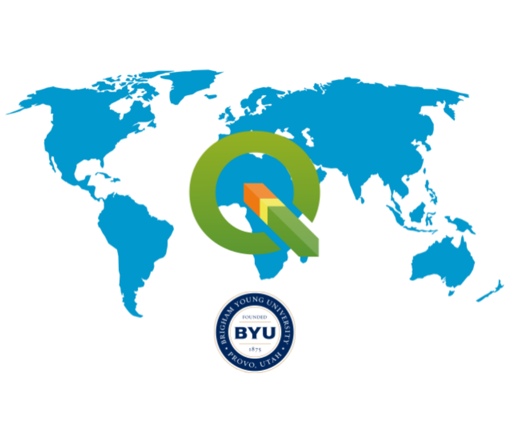

## **Background**

Now that you are starting to gain some experience with GIS, it is time to apply that knowledge to real data obtained from the outside world. Be prepared to get out and obtain some real GPS data by performing your own basic GPS survey. 

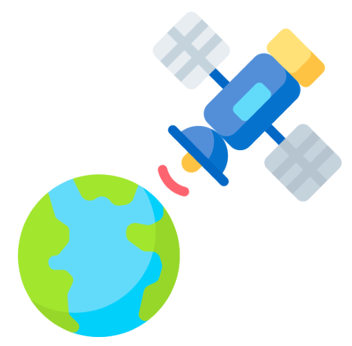

Points collected via GPS can be uploaded, visualized, and eventually analyzed as spatial data in GIS software such as QGIS. In this lab, you will collect GPS data around campus.   
Fun fact: through the 1990s the US government intentionally scrambled the civilian GPS signal (a policy called Selective Availability), so even a good receiver could be off by the length of a football field. President Clinton ordered the scrambling turned off in May 2000, and civilian accuracy improved tenfold overnight. Today a phone under open sky typically gets within about 5 meters (16 feet) of the true position — and in this lab you get to measure that error yourself. Sources: https://www.gps.gov/gps-modernization and https://archive.gps.gov/systems/gps/performance/accuracy/

This lab includes 2 parts. Part one requires you to collect some data using the GPS on your phone. Part two requires you to import the data to QGIS and make a map using it. 

## **Problem Statement**

It’s time for a scavenger hunt. Gather some GPS data and find some coordinates. You’ll visit 10 locations in total. Go try some Graham Canyon ice cream with your team after you’re done (And don’t forget to buy some for your favorite TAs)\!

After collecting data, you will learn how to create and edit your own vector data, and we’ll use point layers of your collected GPS data to discuss measurement error. You will also create a polygon layer to find the area of the BYU campus.

Next, you will need to verify the accuracy of the coordinates you converted in Part 1. You need to create a layout showing both your collected data points and their corrected positions. You also need to compute the area of the main section of the BYU campus (in acres), and show your polygon on the same map.

## **Learning Objectives**

* Learn how to gather GPS coordinates  
* Learn how to locate given GPS coordinates  
* Consider sources of error in a real-life situation  
* Learn how to create a .csv file  
* Learn how to import coordinates as a .csv file into QGIS  
* Learn how to create and edit vector data in QGIS  
* Learn how to use the field calculator tool in QGIS

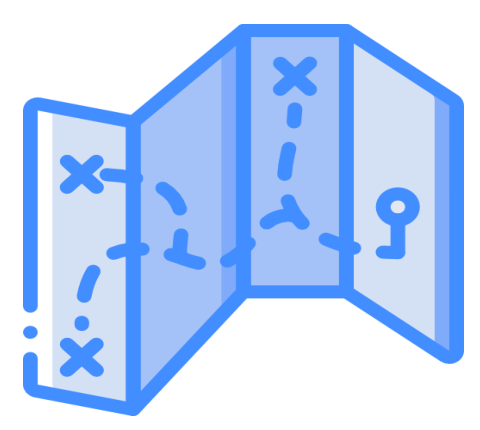

## **Software and Data**

* You will use the GPS functionality on your smartphone.   
* We will also use QGIS as in past labs.   
* There are no custom data downloads for this lab, just the data you collect as part of the assignment.   
* Google imagery will also be used as a base layer. 

**REVIEW THE deliverables section at the end of the document before continuing. You should always do this before starting any of your labs. It will help you make sense of the lab and not waste time.** 

## **Part 1 \- Data Collection (Group Effort)**

### **Gathering GPS Coordinates**

1. Form groups of 2-3. Each member needs either a handheld GPS unit or a cell phone with GPS capabilities and an appropriate GPS app that is not Google/Apple Maps. You can find many such apps in the Apple App Store or the Google Play Store.  
2. Go to 7 of the places listed here and **collect** the Latitude and Longitude information using your phone/GPS. Each team member needs to collect their own Latitude and Longitude data at each location you visit (unless someone doesn’t have access to a GPS device or smartphone).  
   1. JSB\_Joseph – Statue of Joseph in the JSB grove area.  
   2. Tree\_Of\_Life – Tree of Life statue in front of the JSB.  
   3. Pit\_Of\_Despair – The center of the bottom floor lobby of the Testing Center.  
   4. BroMaeser – Statue in front of the Maeser building.  
   5. TheBigPi – Tau Beta Pi statue in front of the Clyde.  
   6. Crossing\_the\_Rubicon – The center of the bridge to the life science building.   
   7. Pendulum – Pendulum in the ESC entrance.  
   8. Buried\_Treasure – Underneath the X of the glass windows above the entrance to the library (on the stairs going down to the Periodicals).  
   9. Pool\_Party – JFSB fountain.  
   10. Bikes – Highest rated bike rack on campus, in between Talmage and JFSB.   
   11. BroBrigham – Brigham Young statue south of the ASB.  
   12. Busted – Bust in the 4th floor entrance to the TNRB.  
   13. MOArt – Entrance to the MOA.  
   14. Winner – Victory Bell south of the Marriott Center.  
   15. Cosmo – The Cosmo statue inside the Bookstore by the bank.  

> [!IMPORTANT]
> Use **every digit** that you get from the phone/GPS! You want to be as precise as possible with these measurements.

3. Once each team member has recorded all their latitude and longitude data points on their phone or on paper, calculate the group average latitude and longitude for each location.  
4. Using this [**online converter**](https://tagis.dep.wv.gov/convert/) (https://tagis.dep.wv.gov/convert/), convert all 7 of your averaged latitude and longitude data points into XY coordinates (in meters). In the converter, leave the input set to “Lat/Lon WGS 1984” (what your phone reports), and change the output dropdown from its “Zone 17N” default (the tool lives in West Virginia) to “UTM NAD83 Zone 12N” — the zone Provo sits in. Sanity check: for campus, your X values should land near 444,000–445,000 and your Y values near 4,455,000–4,456,000. Write or save these in a safe place to access in Part 2\. (In class, you’ll understand why this conversion is important. For now, just know that our map in Part 2 will be set up for a different coordinate system than the one that GPS devices use.)

### **Reverse Surveying, aka Geocaching**

5. This kind of treasure hunt is older than you might think — but not much older. The day after the GPS scrambling ended in May 2000, a GPS enthusiast named Dave Ulmer buried a bucket of prizes near Portland, Oregon, posted its coordinates online, and challenged people to find it. That first "stash" grew into geocaching, with millions of caches now hidden worldwide (https://www.geocaching.com/about/history.aspx). Today you get to do the same thing, minus the bucket.  
6. Next, **go to** 3 of the following locations, record what/where each object is, and take a picture of your group at each place. These are either statues or large grates on the ground.  
   1. 40°14'52.00"N, 111°38'55.36"W (a statue)  
   2. 40°14'53.75"N, 111°38'59.34"W (a statue)  
   3. 40°14'49.73"N, 111°39'3.05"W (a vent in the ground)  
   4. 40°14'56.30"N, 111°38'54.70"W (a drain cover)  
   5. 40°14'59.03"N, 111°38'57.34"W (center of a walkway)  

> [!NOTE]
> You may be tempted to use Google Maps or a similar app to find these locations, but first try to find them manually by walking with your GPS or smartphone app.

7. Do you notice that the item you’re looking for is not at the exact location we provided? How far off is your target from the exact location? Walk to the exact spot where your GPS reads these coordinates and record an estimate of the error between the supposed object location and your manual measurement. (This should be a linear distance, e.g., “I was approximately 5 ft. away from the statue.”)  

> [!TIP]
> Use the linked site to convert from “Lat/Lon WGS 1984” to “UTM NAD83 Zone 12N”.

8. Write a short conclusion where you give your estimated error for each of these points and discuss why there might be an error. You should reference the types of GPS-related errors discussed in the readings and lecture.  
9. Read through the deliverables for this part of the assignment and add them to a PDF that you will submit on Learning Suite after completing Part 2\.

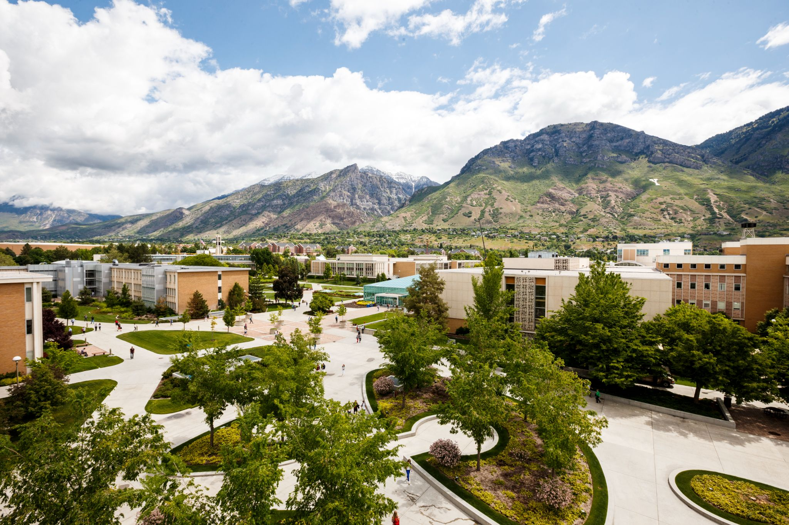

**Figure 1\.** BYU campus. Source: Brigham Young University

## **Part 2 \- Data Importing (Individual Effort)** 

### **Importing GPS Data into QGIS**

1. From your list of coordinates in Part 1, and on your own, make a table that **exactly duplicates the following row/column layout** in Excel or Google Sheets (use the names from the list in Part 1):

   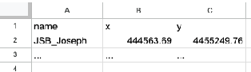

   | name | x | y |
   | ----- | ----- | ----- |
   | JSB\_Joseph | 444563.69 | 4455249.76 |
   | … | … | … |

> [!WARNING]
> Duplicate the layout only! The location x,y points in the examples are different from what you will have.

2. Save this table as a **CSV** (comma-delimited) file named “points.csv”   

> [!TIP]
> How to save as a CSV file:
> 1. **Google Sheets**: *File\>\>Download\>\>Comma Separated Values (.csv)*
> 2. **Excel**: *File\>\>Save As...* then in the Save As dialog box, choose CSV (Comma delimited) and save

3. Open a new project in QGIS   
4. Open the Data Source Manager  and find the “Delimited Text” tab on the left side of the window (CSV files **cannot** be drag-and-dropped into the map)  
5. Click the ellipses “...” next to the File name field. Locate your “points.csv” file and click “Open.”  
6. Leave all the defaults except for “Geometry CRS.” Make sure this is set to our usual “EPSG:26912 \- NAD83 / UTM zone 12N” and click “Add” and close the window.  

   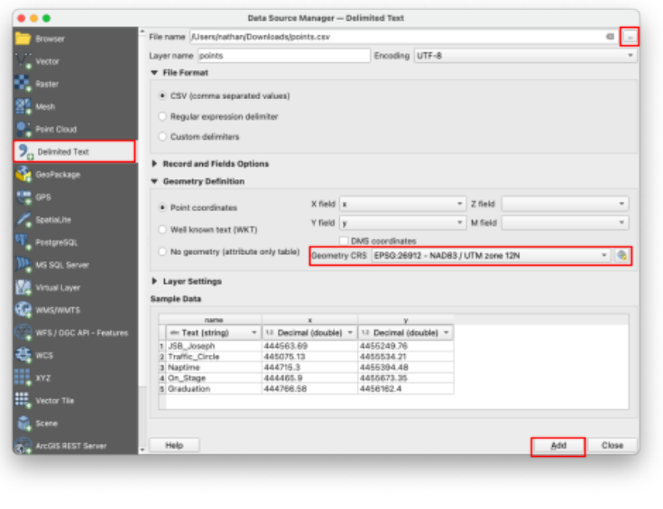

7. If the “Select Transformation” window appears, simply ignore it and click OK.   

   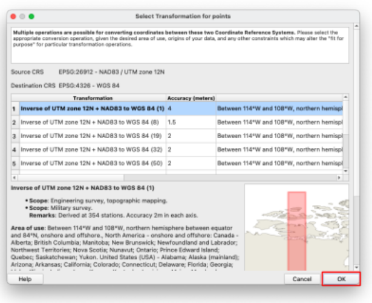

8. **SAVE** your project\!  
9. Add a “Google Satellite” basemap as taught in class and as shown in an earlier lab assignment.  
10. If the “Select Transformation” window appears again, simply press OK. **For this class, disregard it every time it appears and simply let it proceed by clicking OK.**

### **Adding Vector Data**

11. To edit your point data, we need to convert it to a vector layer. Right-click on the points layer, and navigate to *Export\>\>Save Feature As…*   

    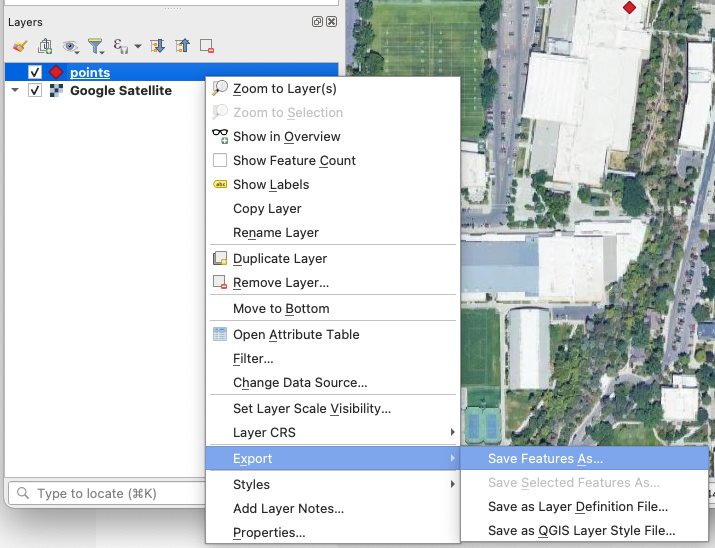

12. Input the following settings:  
    1. Format: “ESRI Shapefile”  
    2. CRS: “EPSG:26912 \- NAD83 / UTM zone 12N” ← this is a common projection for Utah that minimizes measurement errors in our region.  
    3. And use the ellipses “...” next to the “File name” box to save the file in the same folder as your project, with the name “pts\_corrected.shp”  
13. Press OK. There should now be two point layers on your map.

### **Editing Vector Data**

14. Right-click anywhere on the toolbars at the top of the QGIS window. Check the “Advanced Digitizing Toolbar” option if it isn’t already. A whole new row of tools should appear at the top of the window.    

    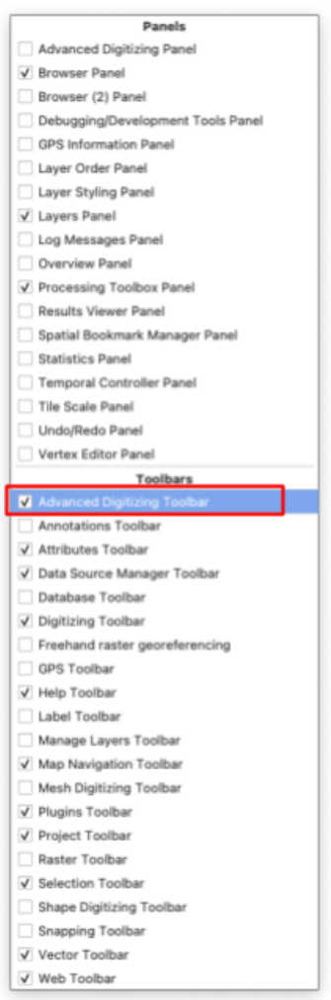

15. Single-click on the new “pts\_corrected” layer in the Layers panel to select that layer.  
16. Click the yellow pencil icon in the toolbar to toggle editing. This enters an “edit mode” where you can change your vector data.  
17. Click the  “Move Feature” button. Now your cursor can pick up your vector points with a click and drop them somewhere else with another click. Try moving one. You can undo any edits with the “Undo” button in the toolbar until you click Save, which locks in your changes permanently.  

    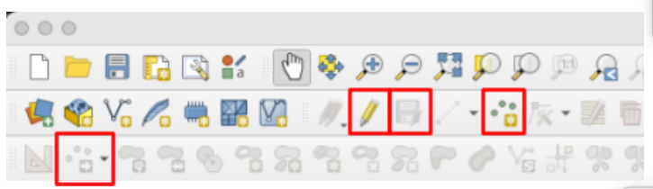

18. Using the satellite view, move each of the points in “pts\_corrected” to be positioned exactly on the location they represent. With indoor objects, your best guess is fine.  
19. Use the 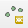 “Add Point Feature” button to add a new point to this layer. Place it on your favorite campus building (and please don’t say it’s the MARB). When it asks you to put in attributes, set the name as “favorite” and leave the X and Y fields blank.

    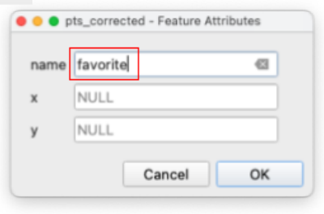

20. Be sure to **save** your changes (with the save button next to the yellow pencil) and toggle off editing (with the yellow pencil) when you’re done. You may also need to select the panning tool (the white hand) in the toolbar again to pan/zoom as normal.  
21. **SAVE** your project  
22. Now that you have two point layers, take a moment to compare the original GPS points with the edited layer. How far off are they? Do they all have the same amount of error?

### **Creating a Vector Layer**

23. Now, find the “New Shapefile Layer” button in the toolbar. Click it.  

    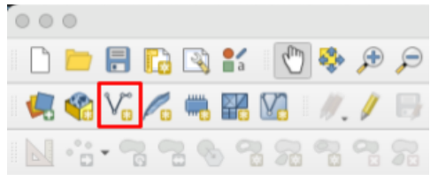

24. Use the following inputs:  
    1. File name: “campus” (click on the ellipses “...” to choose where to save this new file)  
    2. Geometry Type: “Polygon”  
    3. Set the CRS to EPSG:26912 (it should be an option in the dropdown as “Project CRS”)

    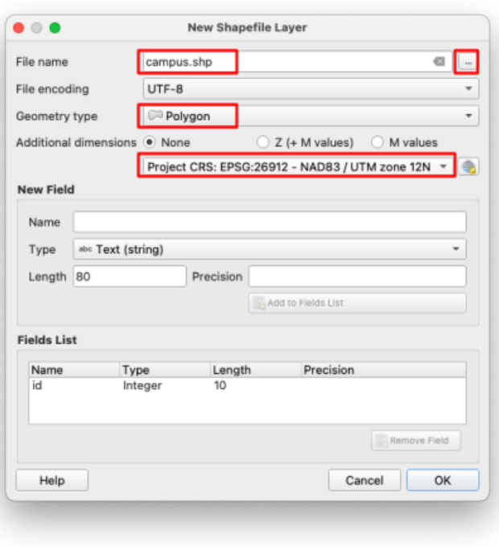

25. Click OK. You should now have a new layer called “campus” in the layers panel.  
26. With the new layer selected, toggle editing again (with the yellow pencil) and use the “Add Polygon Feature” 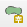 tool. Draw a polygon by left-clicking around the BYU campus with it, following the roads in this example:

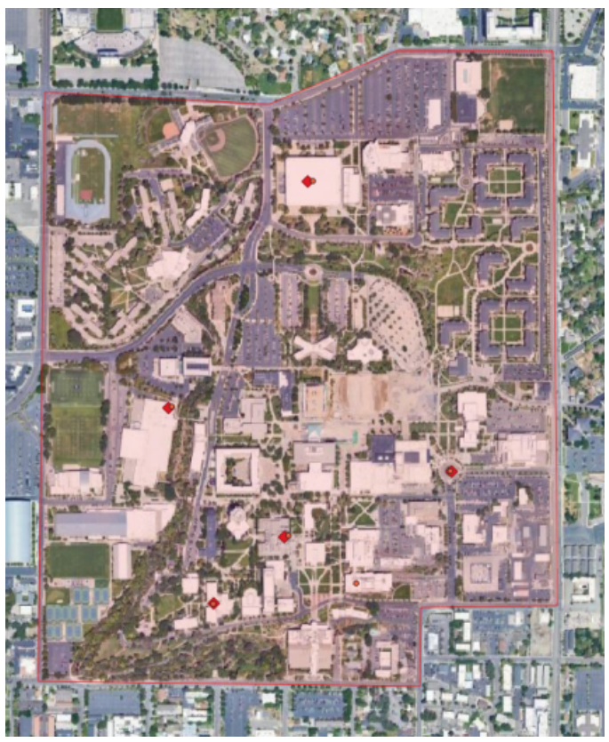

27. When you finish the polygon, right-click to finalize the shape. When it asks for an ID, enter any number and click OK.  
28. Again, use the save button next to the yellow editing pencil, and toggle edit mode off.  
29. Change the symbology of your “campus” layer to something transparent or outline-only.

### **The Field Calculator Tool**

30. With the campus layer still selected in the Layers panel, find the  “Open Field Calculator” button in the top toolbar. This button is a quick way to add fields to a layer's Attribute Table, such as dates, statistics, and calculations (like the area measurement you need).  

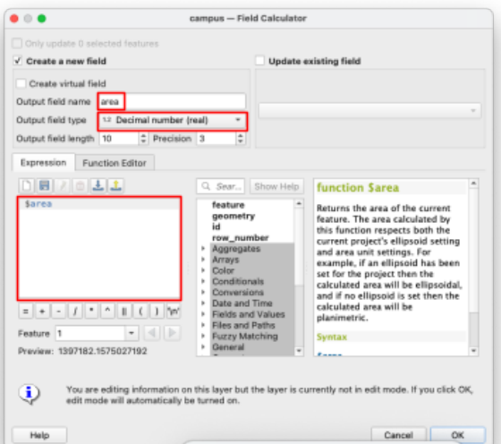

31. Insert the following information:  
    1. Output field name: “area”  
    2. Output field type: Decimal number (real)  
    3. Expression: “$area”  
32. Click OK. This automatically opened editing mode because it changed the attribute table. Click the Save button and turn off editing mode again to prevent accidental changes.  
33. Open the attribute table for the “campus” layer by right-clicking on it in the layer panel and selecting “Open Attribute Table.”  
34. You should see a new field with a number that is approximately 1.4 million. QGIS defaults to measuring in meters, so use Google to convert that area number from square meters to acres. You should end up with a number close to 350 acres.

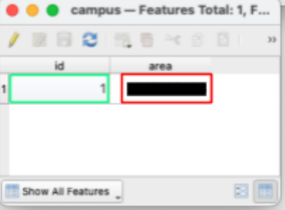

### **Layout**

35. Change the symbology of all layers to make the map easily readable, if you haven’t already done so.  
36. Create and export a layout that includes all the required cartographic elements (see Lab 2), displaying your data for this lab.  
37. Add a textbox to the layout that gives your final measurement for the area of campus **in acres**, and use your own name for the “Data” citation. Your layout should look something like this (with your own name, styling, and map view):

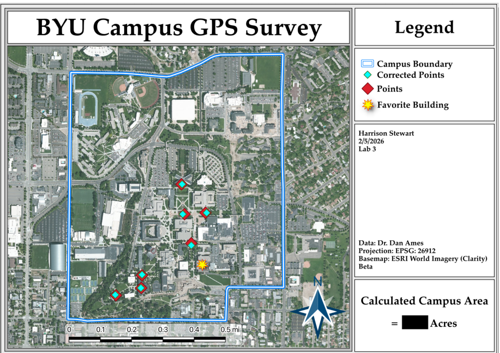

## **Deliverables**

Although Part 1 is a group effort, please create and submit your OWN report that includes all of the following in a single PDF: 

**Part 1:**

1. A table showing all the collected GPS locations from your group, the averaged values, and the converted GPS coordinates (converted to meters), for the 7 locations you chose to find.  
2. Your group photos at the 3 locations from the surveying/geocaching section  
3. Your error conclusion from the geocaching section  
4. **Using an AI tool of your choice, give the AI your table of data and your error conclusions, and ask the tool to prepare a brief report of the findings with special emphasis on GPS error. Read it, think about it, and add this report to a separate section.**   
   

**Part 2:**

5. Your final map layout with the converted campus area value  
6. Your responses to the following questions:  
   1. Acceptability of Error: Is the level of error seen in your map acceptable for placing the corners of a building foundation? Establishing a fence line between neighbors? Identifying the flow path of a major river? Marking the centroid of a major city? Why might your answer be different in some of these cases?  
   2. Error Reduction: Given the things we’ve learned in class and in this lab, what could you do to reduce the error in your data?  
7. The grading rubric, filled in with your self-evaluation

## **Grading Rubric**

The following rubric will be used to evaluate your lab assignment. Use this as a guide to ensure that you include all the required elements for this lab. Shown under “Score” is the maximum possible points you can receive for each item. 

Sometimes, points are awarded on a "yes or no" basis, giving full points if something is present and none if it is not. At other times, points are awarded on a scale, depending on how well you complete the task. Please keep this in mind. For example, if there is a written answer required, grading will be based on a scale of points, depending on the quality and completeness of your written answer.

Copy the rubric and paste it into your lab report. Fill in your self-evaluation of the rubric, showing how many points you feel you have earned for each item.

| Requirement | Score |
| ----- | ----- |
| Include your GPS coordinates: Averaged coordinates *(2 pts)* Properly converted to UTM NAD83 Zone 12N *(3 pts)* | /5 |
| Include your group photos: All 3 locations *(5 pts)* Funny pictures *(0 pts, just TA appreciation)* | /5 |
| Provide a complete, thoughtful conclusion: Estimated error for each of the 3 locations *(2 pts)* Discussion and proper application of error sources learned about in class lectures/readings, including AI report *(3 pts)* | /5 |
| Create and include the required map layout: Polygon around campus area *(2 pts)* Both GPS points and corrected points layers *(2 pts)* One extra point on your favorite campus building \[Add to legend\]     *(1 pt)* Area calculation within 10% *(1 pt)* Useful and clearly visible symbology *(1pt)* Includes all required cartographic elements: *(3 pts total)* Neatline *(0.5 pt)* Legend *(0.5 pt)* North Arrow *(0.5 pt)* Scale Bar *(0.5 pt)* Title *(0.5 pt)* Citations and name/date/lab \# *(0.5 pt)* | /10 |
| Provide complete, thoughtful, and correct answers to the questions given in the deliverables section: Acceptability of Error *(2 pts)* Error Reduction *(3 pts)* | /5 |
| **Total** | **/30** |

## **Using AI on This Lab**

This lab already asks you to use AI once on purpose: the Part 1 deliverables have you hand your data table and error conclusions to an AI tool and include the report it writes back, in its own clearly labeled section. That deliverable is the model for good AI use in this class — the AI reacts to real data you collected, and you read its output critically and decide what you think. Free ChatGPT or Gemini can help the same way elsewhere in the lab: explaining why we convert latitude/longitude to UTM Zone 12N, decoding a cryptic QGIS error, or quizzing you on GPS error sources before you write your conclusion. What AI cannot do is walk campus for you. Your coordinates, error estimates, group photos, and your own written answers (the error conclusion and the two questions in Part 2\) must come from you — never invented numbers, faked screenshots, or AI-written answers submitted as your own. If you use AI beyond the required report, say so in your submission, and be ready to explain and defend every answer as your own understanding.

* Good: "Explain the difference between lat/long in WGS84 and UTM NAD83 Zone 12N like I'm new to GIS."  
* Good: pasting a QGIS error message and asking what it means and how to fix it.  
* Not okay: asking AI to write your error conclusion, answer the Part 2 questions for you, or produce plausible-looking coordinates you never measured.
