# Lab 4: Changing, Editing, and Fixing GIS Data

**Civil and Construction Engineering 114 — Geomatics**

Winter 2026 · Dr. Dan Ames

*Developed with extensive help from Harrison, Isabel, and Kayden*

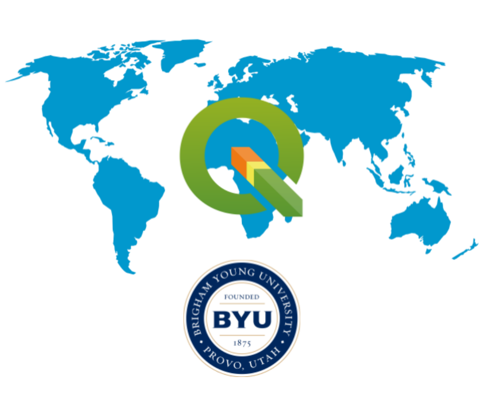

## **Background**

GIS skills allow you to assist in a wide variety of work, including civil engineering and religious land use planning. For example, the First Presidency of The Church of Jesus Christ of Latter-day Saints recently announced the site location for the **Spanish Fork, Utah Temple**. Plans for this site call for a multistory building of approximately 80,000 square feet to be built on an 8.7-acre site at the corner of 100 South and 2550 East in Spanish Fork, Utah.

The temple itself was announced in general conference on April 6, 2025, by President Russell M. Nelson — the last temple he announced before his death in September 2025 — and the First Presidency released the site location on January 12, 2026\. The project is currently in the planning and design stages. [Spanish Fork Temple Announcement](https://www.thechurchnews.com/temples/2026/01/12/temple-sites-announced-in-spanish-fork-utah-and-beira-mozambique/)

Here is what makes this one fun: the 8.7-acre site sits right across the street from Maple Mountain High School, near the mouth of Spanish Fork Canyon, and it is the ninth temple announced for Utah County. The aerial imagery you will digitize over in this lab shows the very field the Church's civil engineers and surveyors are studying right now — so treat this lab as a dress rehearsal for the real thing.

In this lab, you will move beyond simply adding existing data to **Vector Data Creation and Topological Integrity**, you will learn to differentiate between and use **point, line, and polygon vector data** to build infrastructure from scratch. You will use precision tools like **Snapping** and the **Vertex Tool** to ensure your map is topologically correct—meaning all features connect and relate to each other exactly as they do in the real world. Finally, you will organize these features using **Symbology** and **Labels** to produce a polished, professional map layout.

Just a quick reminder of the different types of vector data available…

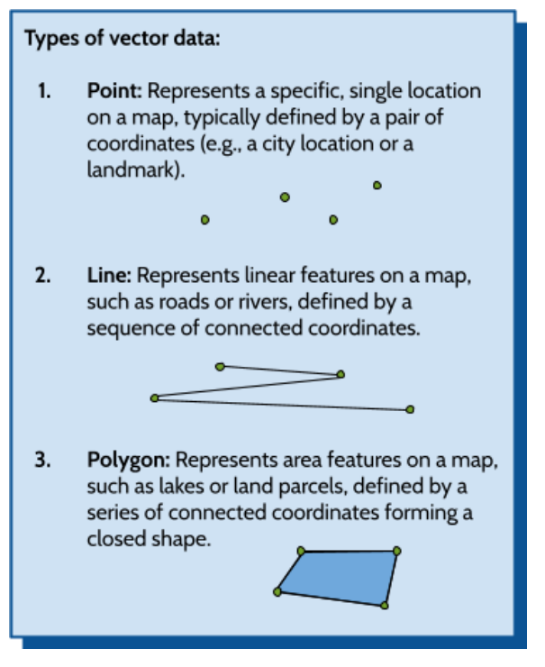

## **Problem Statement**

A local Public Works Department has approached you, a GIS professional, to assist in an urgent infrastructure rehabilitation project. Before the construction crews can proceed with excavation and the final design of the multistory building and its accompanying ancillary structures, they require an updated, highly accurate map of the underground utility network and above-ground infrastructure surrounding the 8.7-acre site.

The existing GIS datasets for this area are known to have significant technical issues. Specifically, the statewide canal and stream lines were digitized years ago from smaller-scale USGS maps, so in places they drift well off the actual channels you can see in high-resolution aerial imagery — and the culverts that carry those waterways under the roads have never been mapped at all. Because GIS organizes the world around you, these errors can lead to costly mistakes during the construction of the Spanish Fork temple.

Your objective is to rectify these errors. Using a high-resolution aerial basemap, you will:

1. Create new vector layers of all three geometry types (Point, Line, and Polygon) to represent street lights, curbs, buildings, and culverts.  
2. Pull real waterway data from Utah's SGID, realign it to match the aerial imagery, and map the culverts where waterways cross under roads.  
3. Produce a professional map layout that clearly communicates the location of these municipal assets to the department heads.

## **Learning Objectives**

* **Learn how to create** new GeoPackage vector layers for point, line, and polygon geometry types.  
* **Learn how to define and populate** an attribute schema (table structure) before and after data collection.  
* **Continue to utilize** the QuickMapServices plugin.  
* **Learn to master** the **Vertex Tool**, to move, add, and delete feature vertices.  
* **Learn how to use** the snapping tool, ensuring lines perfectly connect to points and polygons share common boundaries.  
* **Learn to create** a professional map layout.

## **Software and Data**

* For this lab, we will use the GIS software application QGIS (also known as Quantum GIS). This is a free and open-source GIS package that runs on Windows, Mac, and Linux operating systems. The software is pre-installed on the computers in the Clyde Building 234 computer lab. You can also download it and install it on your own computer from this website: [https://www.qgis.org/](https://www.qgis.org/). We will be using the latest Long Term Release version, QGIS 3.44 (LTR), in this course.   
* There are no custom data downloads for this lab. All of the vector data you will fix comes live from the Utah Geospatial Resource Center's State Geographic Information Datasource (SGID): https://gis.utah.gov/products/sgid/ — the Phase 3 instructions show you exactly how to grab it.  
* Imagery from Google will also be used as a base layer. 

## **Instructions**

### **Data and Map Setup**

1. Start a new QGIS project.  
2. Add a satellite image as your base layer. You can do this using the Data Source Manager or the QuickMapServices plugin, following the method from the previous lab.

**Note:** Observe the bottom right corner of the QGIS window. You will see a wireframe globe next to a short code of four letters and a number (EPSG:3857) or some similar number. This indicates the current **coordinate reference system** (CRS), a concept we will explore in more detail later. Click this indicator to view or change the CRS.

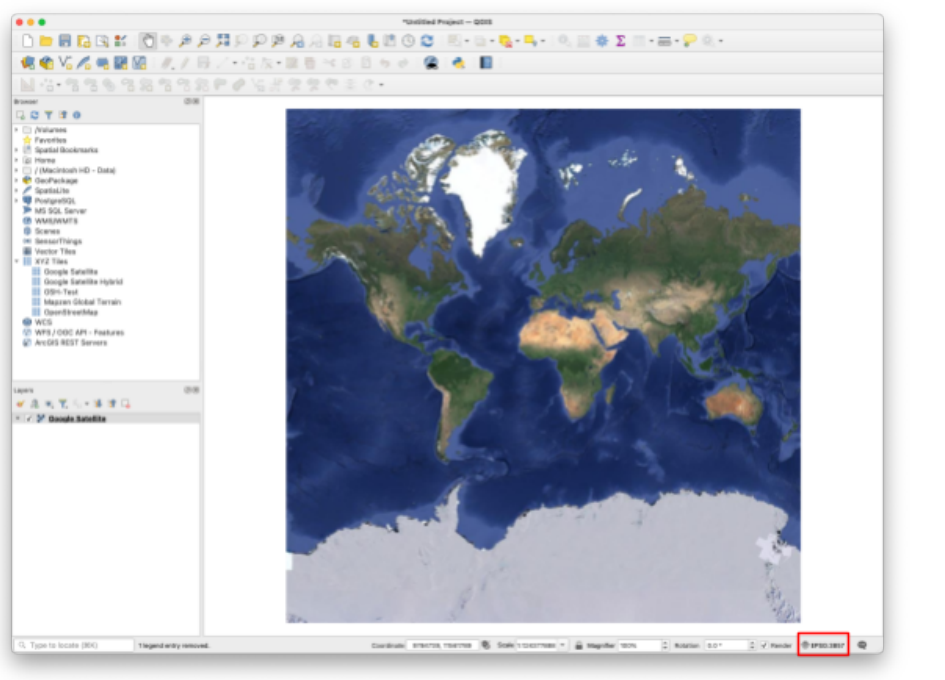

3. In the "Project CRS" window, filter for "26912." Select the "NAD83 / UTM zone 12N" projection. Click **OK**, then accept the default datum transformation options in any subsequent windows.

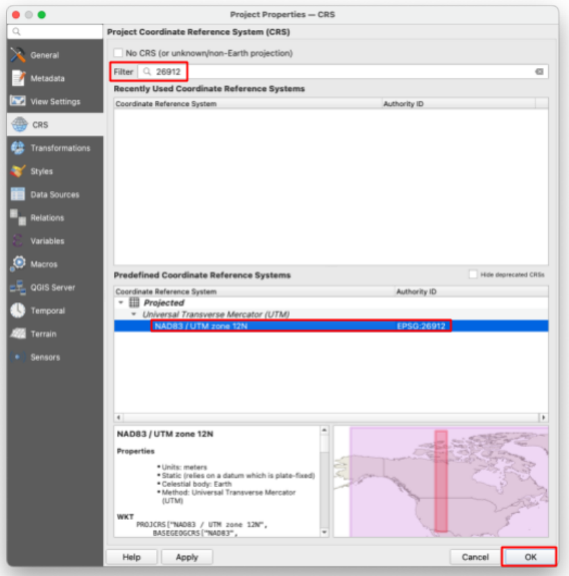

4. **SAVE** your project  

## **Phase 1: Project Setup and Data Preparation**

5. **Create New Layers (GeoPackage):** Navigate to Layer \> Create Layer \> New GeoPackage Layer... and create the following:  
6. **Name your first layer “Street\_Lights”. Set the Geometry Type dropdown to Point. Finally, add New Fields (the schema) to your layer — for example: ID (Whole Number), Fixture\_Type (Text), Voltage (Whole Number).**  
7. **Name your second layer “Curb\_Lines”. Set the Geometry Type dropdown to LineString. Finally, add fields — for example: ID (Whole Number), Material (Text), Condition (Text).**

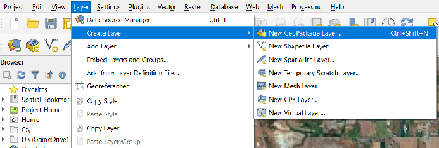

8. Make sure when creating each layer, you click the three dots next to Database and save the file into your lab folder (on the lab computers, your student folder on the D: drive) with the name required above. Otherwise, your GeoPackage Datasets won't save, losing all your progress. Pro Tip: Always make sure your project CRS is the same as your map\!  

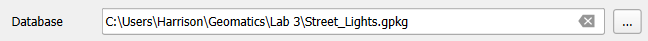

9. Once you have created both layers, Street\_Lights and Curb\_Lines should appear in your Layers panel like this. (look below) To add a Schema or a table structure, look at the example below, fill out the “New Field” section and make sure to click “Add to Fields List” before you click ok. Pay attention though as each layer has different schema attributes — use the field lists from the layer descriptions above.  

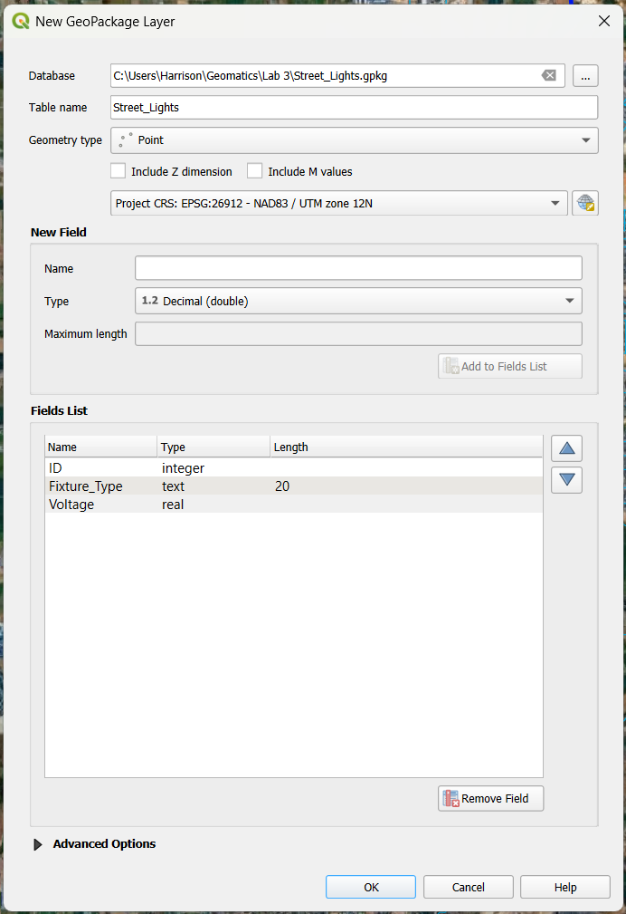

10. After Completing both Point and Linestring Geopackage layer creations, **SAVE** your project\!

> [!WARNING]
> If you're on a lab computer, do **NOT** save anything to your network drive. Instead, save it somewhere locally on the computer itself in a folder with your name. If you save files on a network drive, QGIS will be slower and have more bugs.

### **Phase 1, Part 2: Creating the Temple Footprint Layer**

There are several different techniques and algorithms for doing what we are trying to do. In this lab, you may take the approach detailed below. 

1. Find [100 South and 2550 East](https://maps.app.goo.gl/JHrj19fozCdnAq6g6), Spanish Fork, Utah, United States on your base map. This hyperlink should help. You should be looking at an area just south of Maple Mountain High School and just east of a Latter-Day Saint church. It is currently an empty lot (pictured below).  

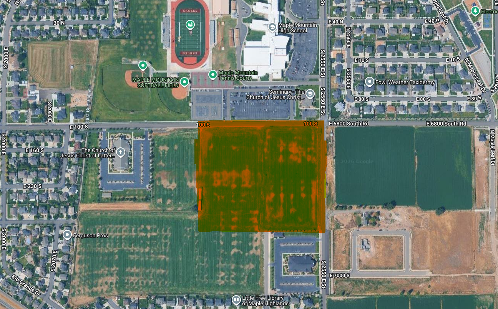

2. **Create a polygon layer** for the Spanish Fork Temple footprint in this area. The temple footprint itself should be about 30,000 square feet.  
3. Go to Layer \> Create Layer \> New GeoPackage Layer... — the same tool you used in Phase 1, so all of your layers stay in the same GeoPackage format.  
4. Next to “Database”, click the ellipses. Save it to your lab folder and name it “Temple\_Footprint”. Also add a Name field (Text type) — you will use it to label your buildings in the map layout later.  
5. For “Geometry Type”, change it to “Polygon”.  
6. Before you draw anything, skim ahead to the area-check steps near the end of Phase 2 — knowing the target square footage now will save you redraws later.  
7. Make sure your screen looks like this and hit “OK”  

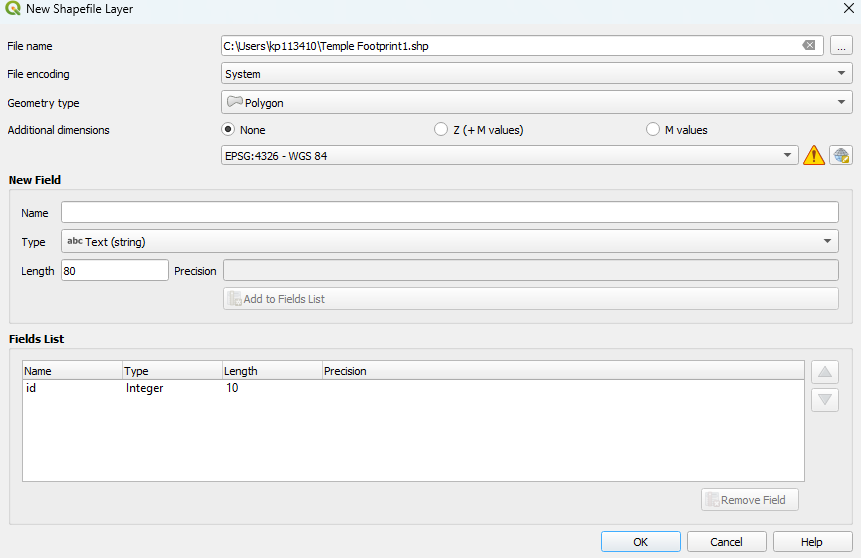

8. Before you continue\!\!\! **Configure your snapping options following the steps below:**  
   1. Navigate to **Project \> Snapping Options...** (or use the Snapping Toolbar).  
   2. Click the **"Enable Snapping"** icon (magnet).  
   3. Set the **Tolerance** to **12 Pixels**.  

      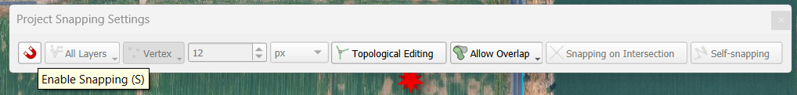

   4. Set the **Mode** to **Advanced Configuration**.  
   5. Ensure snapping is enabled for all of your vector layers.  
   6. Crucially, make sure to check the **"Avoid Overlap"** box for the **Temple\_Footprint** layer.

## **Phase 2: Data Creation and Digitizing**

9. **Digitize Curb Lines (Lines):** **Toggle Editing ** on the Curb\_Lines layer. Add a section of curb along a street and do your best to keep it in line with the road. Create both straight segments and curved segments (by using the "Digitize with Curve" tool). Make sure to add curbs from the indicated red dots between both church buildings. (see picture below)  

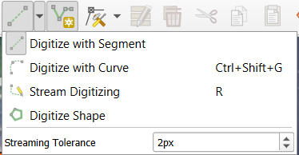

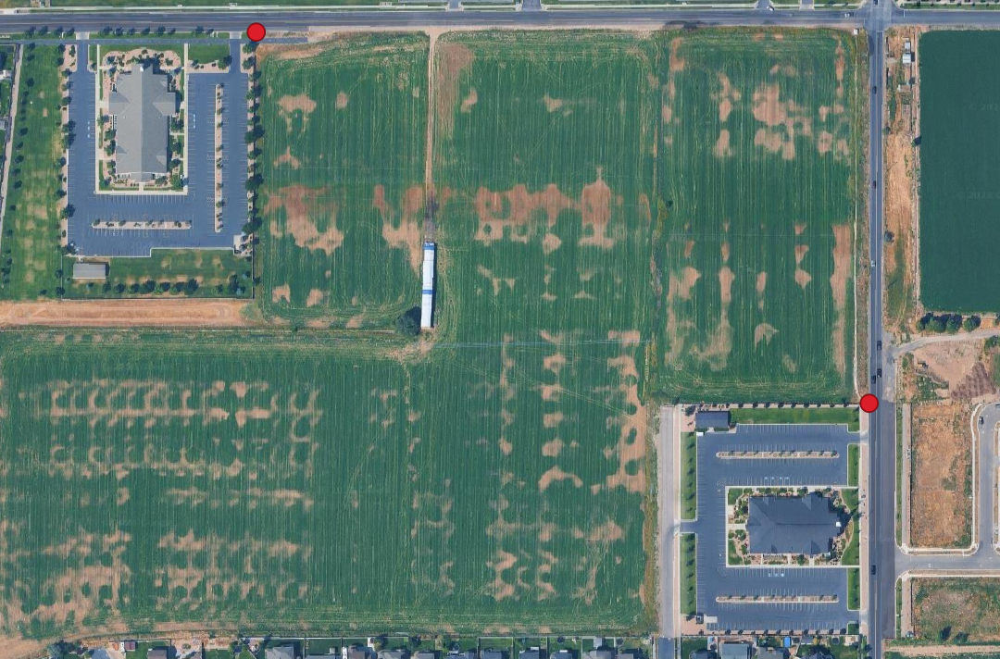

10. **Time to add street lights (Points):** **Toggle Editing ** on the Street\_Lights layer. Use the **Add Point Feature** tool to add 10 lights to the basemap around the temple but next to the curb. Fill in all attribute fields for each feature as you create it. You’re free to give whatever attribute data you please, just keep it relevant. Remember, yours will look different so avoid copying the example.   

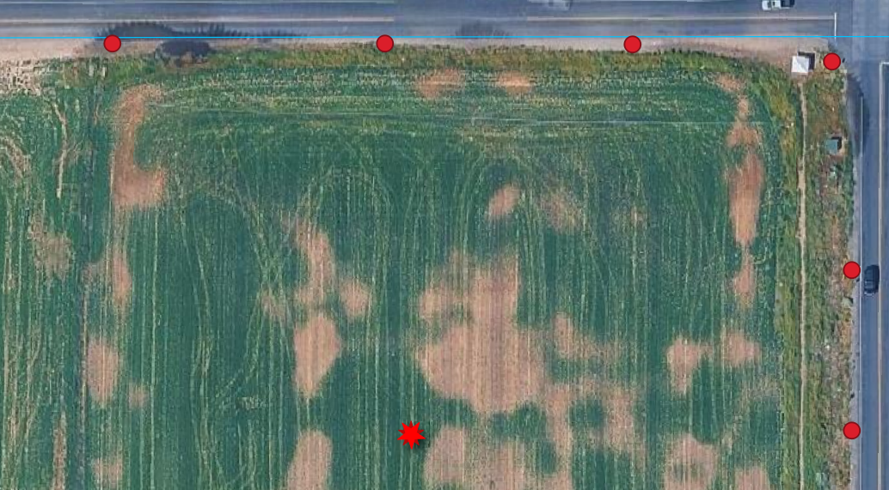

11. **Save Edits:** Click the **Save Layer Edits** button  for all layers and then **Toggle Editing** off (click the yellow pencil again)****.  
12. Now, With the “Temple\_Footprint” layer selected, click the “Toggle Editing” **** button near the top right of your screen (it looks like a little yellow pencil).  
13. Now, click the “Add Polygon Feature” button (it looks like a green blob to the right of the pencil.  
14. Left click to add the desired vertices to your temple footprint. When done, right-click to end, for “id” just put “1”, and hit “OK”. You should now have a polygon.  
15. Exit editing mode by clicking the “Toggle Editing” button again, and click “Save”. Next, right-click on your “Temple\_Footprint” layer and click “Open Attribute Table”.  
16. Click “Toggle editing mode” in your attribute table and then click “Open field calculator”.  
17. Change the expression to “$area \* 10.7639”. This will give us the area of our polygon. The computer wants to give us the area in square meters, so we must use 10.7639 to convert it to square feet. Change the “Output field name” to “area”. Change the “Output field type” to Decimal number (real).  
18. Once your screen looks like this, click “OK”.

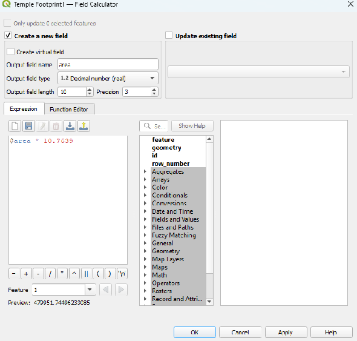

19. Click “Toggle editing mode” again and click “Save”.  
20. If your area is between 25,000 and 35,000, congratulations\! Your temple is reasonably sized for the plans. If not, click the “1” on the left (your polygon should change colors, exit the attribute table, click the “Toggle Editing” button again, click “Delete Selected” (a red garbage can), and click “Delete 1 Feature”.  
21. Your polygon is now deleted, and you can reattempt one of the correct size by repeating the drawing steps above (Toggle Editing, Add Polygon Feature, then the area calculation). One difference: when you rerun the Field Calculator, check the “Update existing field” box and choose your “area” field instead of creating a new one — your screen should look like this 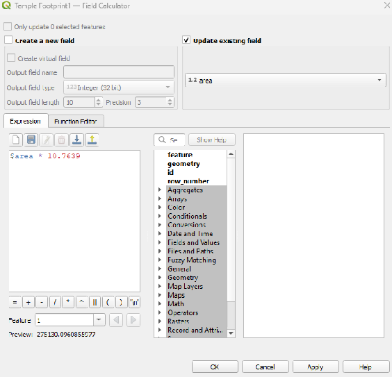  
22. Now that you have your temple footprint, repeat the whole process for a parking lot: create one more polygon GeoPackage layer named “Parking\_Lot” (with a Name field), digitize it, and check its area with the Field Calculator. The parking lot should be adjacent to the temple and have an area between 60,000 and 80,000 square feet.  
23. Your final lot should resemble this. This guide is designed to help you scale your parking lot and temple, so you don't have to redraw them multiple times. Please do not copy this exactly.

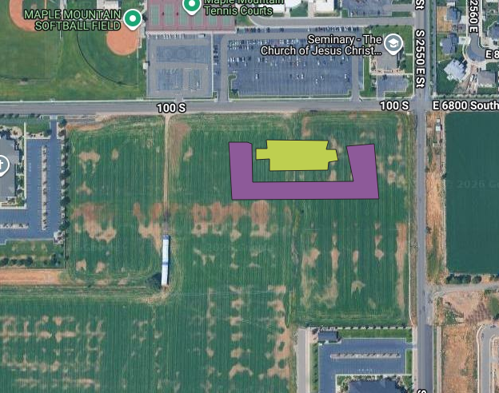

## **Phase 3: Advanced Precision Editing (Topological Correction)**

### **Culverts in GIS and Hydrology**

Culverts are enclosed conduits, acting as subterranean drains or tunnels, that pass *under* roads, railways, or embankments. Their essential function is to maintain the natural flow of water (e.g., streams, runoff) across the transportation barrier.

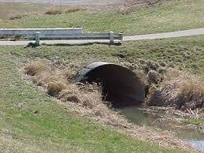

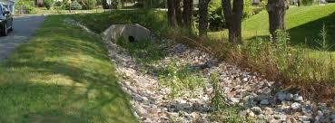

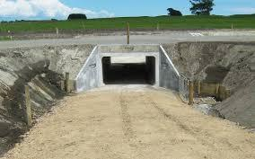

> [!NOTE]
> **Importance of Correct Digitization:** Accurate GIS representation of culverts is vital for:
> 1. **Flood and Erosion Prevention:** By ensuring continuous water flow, culverts prevent upstream water impoundment, mitigating flood risk and protecting the roadway from washout.
> 2. **Hydrologic Modeling:** Correctly mapped culverts are fundamental inputs for hydraulic models used by engineers to predict flow rates, analyze drainage, and design storm water management plans.
> 3. **Topological Accuracy:** Culvert features (often digitized as linear features) must maintain strict topological integrity in a GIS database. They must correctly connect upstream and downstream stream segments and exist logically *beneath* the road feature.

### **Getting the data**

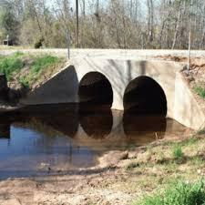

1. ~~Download and drag the Culverts in Spanish Fork.gpkg, River in Spanish Fork.gpkg, Fixed Spanish Fork.gpkg, and Utah\_Canals\_Broken.gpkg~~

Instead of a canned download, you are going to pull live data straight from UGRC's SGID server — the same source Utah's engineering firms use.

1\. Open the Data Source Manager (Layer \> Data Source Manager) and click the Vector tab. Set Source Type to "Protocol: HTTP(S), cloud, etc.", leave the Type as "GeoJSON", and paste the address below into the URI box. (That long address is simply a question we are asking UGRC's server: "please send just the streams and canals around Spanish Fork.")

```
https://services1.arcgis.com/99lidPhWCzftIe9K/arcgis/rest/services/UtahStreamsNHD/FeatureServer/0/query?where=FType+IN+(336,460)&geometry=-111.68,40.06,-111.56,40.15&geometryType=esriGeometryEnvelope&inSR=4326&spatialRel=esriSpatialRelIntersects&outFields=GNIS_Name,FType_Text,FCode_Text&f=geojson
```

2\. Click Add, then Close. A layer named "query" appears with about 98 waterway features, including the Spanish Fork River, the East Bench Canal, and the Mapleton Lateral.

3\. That layer lives on the internet and cannot be edited there. Right-click it, choose Export \> Save Features As..., set the Format to GeoPackage, save it in your lab folder as "SF\_Waterways.gpkg" with layer name "Waterways", and set the CRS to EPSG:26912. Click OK, then remove the temporary "query" layer so only Waterways remains.

4\. Give the Waterways layer a bright blue line symbol so it stands out against the imagery, and SAVE your project.

### **Finding the mistakes**

~~Import the culverts layer along with the spanish fork and rivers layer. Look around at the culvert layer. You’ll notice that there are 15 points, but none of the points are actually on culverts. It will be your job to locate the culvert and move the point so your project can be more precise~~

> [!TIP]
> Look at points where the River and Canals connect\!

These waterway lines were originally digitized from older, smaller-scale USGS maps. Zoom in and follow the East Bench Canal, which runs a few hundred meters west of the temple site. In places, the blue line drifts noticeably off the actual canal you can see in the aerial imagery. Your job is to fix a piece of it: pick a stretch of canal at least 300 meters (about 1,000 feet) long where the line and the imagery disagree, and take a BEFORE screenshot of it — you will need this screenshot for your deliverables.

### **Fixing the lines with the Vertex Tool**

2. Click on the Waterways layer so that it is highlighted and toggle the yellow pencil in the toolbar. Your layer is now in editing mode.  
3. If you do not see the editing tools, right click on the toolbar ribbons at the top and make sure both “Digitizing Toolbar” and “Advanced Digitizing Toolbar” are checked   
4. Now select the Vertex Tool on the Digitizing Toolbar. Hover over your chosen stretch of canal: click a vertex to grab it, then click again to drop it right on the canal centerline you see in the imagery. Double-click on a segment to add a new vertex where the line needs to bend, and click a vertex and press Delete to remove one that should not be there  
5. ~~(There is only one point for each waterway/intersection.)~~

Work down the whole stretch until your blue line follows the real canal, then take your AFTER screenshot from the same zoom level. Click Save Layer Edits and toggle editing off.

### **Mapping the culverts**

6. First, create one last GeoPackage point layer named "Culverts" (Layer \> Create Layer \> New GeoPackage Layer..., Geometry Type: Point) with two fields: Waterway (Text) and Road (Text). Then open Project \> Snapping Options and make sure snapping to the Waterways layer is turned on — every culvert point should land exactly on the waterway line it belongs to. Finally, toggle editing on the Culverts layer.  
7. Now it is up to you to figure out where the culverts should go. To add a point, toggle this button (Add Point Feature). Everywhere you click, there will be a new point — and thanks to snapping, points placed near a waterway will lock right onto the line. Fill in the Waterway and Road attributes for each culvert as you go.   
8. When you click, there will be a pop-up. Hit ok or enter if you want to keep that point, or cancel if you want to delete it.  
9. You should map a minimum of 10 culverts. (Hint: look at where canals and streams cross under roads — every crossing without a visible bridge needs a culvert.)

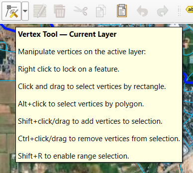

10. Once Finished, press the pencil over the save icon 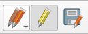(far right) and then click the yellow pencil to deactivate editing mode.   
11. **SAVE** your project

## **Phase 4: The Map Layout**

Time to show off. Using the layout skills from the previous labs (Project \> New Print Layout), build a map centered on the temple site that shows the satellite imagery, your five created layers (Street\_Lights, Curb\_Lines, Temple\_Footprint, Parking\_Lot, and Culverts), and the corrected Waterways layer.

* Give every layer custom symbology that makes sense: lights as point symbols, curbs and waterways as clearly different line styles, and semi-transparent fills for the two footprints so the imagery shows through.  
* Label the Temple\_Footprint and Parking\_Lot polygons using their Name field.  
* Include all the required cartographic elements from previous labs: title, legend, scale bar, north arrow, your name, and the date.  
* Export the layout as a PDF.

## **Deliverables**

To complete this lab, you must submit a **PDF file** that contains the following items:

* **Student Information:** Your name, date, class section, and lab assignment number.  
* **Map Layout:** Your final, polished map layout exported as a PDF. Ensure it displays the corrected municipal assets and meets the Public Works Department's goals.  
* **Screenshots: Your BEFORE and AFTER screenshots of the canal stretch you realigned with the Vertex Tool.**  
* **Self-Evaluation:** The grading rubric provided below, filled in with your own point assessment.

## **Grading Rubric**

| Requirement | Score |
| ----- | ----- |
| *Required Map Layout Content:* Satellite imagery base layer is clearly visible (2pts) BEFORE and AFTER screenshots of the canal stretch you realigned with the Vertex Tool (5pts) Proper custom symbology for all 5 created vector layers plus the Waterways layer (5pts) At least 10 culvert points, each snapped exactly onto a waterway where it crosses a road (4pts) Temple and parking lot footprints are semi-transparent, meet the target areas, and do not overlap (4pts) | /20 |
| *Cartographic Elements:* Professional Title (e.g., "Temple Location Layout") (2pts) Labels for building footprints (2pts) All required cartographic elements *(6 pts \- see previous labs for details)* | /10 |
| **Total** | **/30** |

## **Using AI on This Lab**

AI tools like ChatGPT and Gemini can be genuinely useful in this lab, and you are welcome to use them the way a professional would. If QGIS throws a cryptic error while you are creating a GeoPackage layer, or the Vertex Tool is not behaving the way you expect, pasting the error or describing the behavior to an AI is a fast way to get unstuck. They are also good for checking your understanding — ask one to explain the difference between snapping tolerance in pixels versus map units, or why topological errors like unsnapped culverts cause real problems on construction projects, and see if the answer matches what you learned here. What is not okay: having AI write your deliverable answers for you, or fabricating screenshots, areas, or results you did not actually produce in QGIS. Every vertex you move and every culvert you place needs to be your own work on your own map.

* Good: "QGIS says 'the layer is not editable' when I click Add Point Feature — what did I forget?"  
* Good: "Quiz me on point, line, and polygon vector data types."  
* Not okay: asking AI to write your self-evaluation or invent attribute data descriptions for work you did not do.

If you do use AI, say so in your submission, and be ready to defend every answer as your own understanding.
