# Lab 5: Working with Raster Data

**Civil and Construction Engineering 114 — Geomatics**

Winter 2026 · Dr. Dan Ames

*Lab assignment developed by Nathan Godfrey and Dr. Ames*

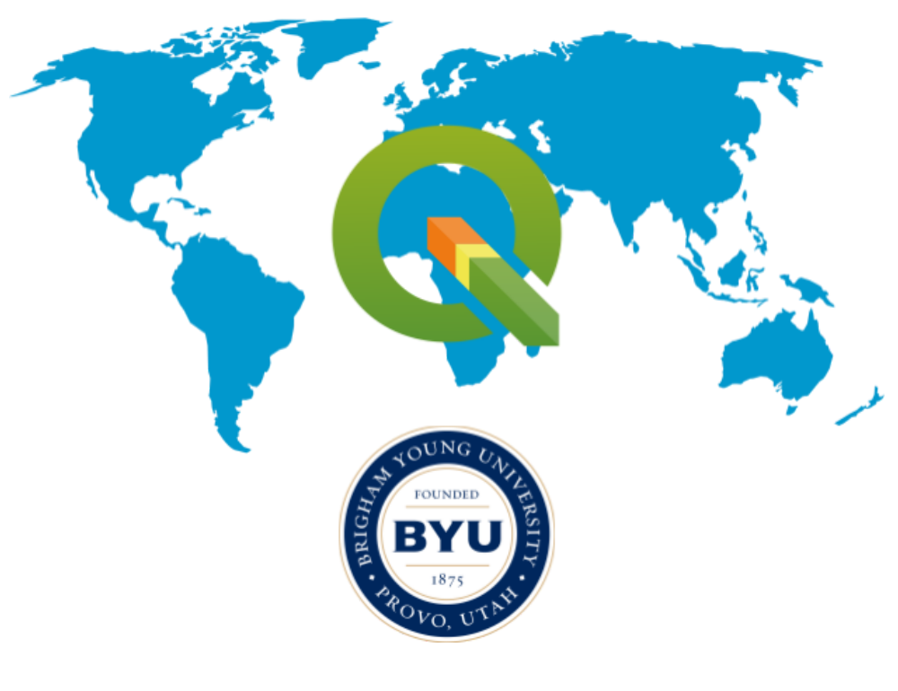

## **Background**

Raster is another powerful Data Model that is commonly used in GIS. As discussed in class, rasters help us analyze elevations, climate and weather events, scanned physical maps, and more. You’re much more familiar with rasters than you think, and in fact, you’ve been using raster data each time you add a basemap to your projects, too, since those images are rasters.

Think about the three types of vector data: **point, line, and polygon**. While you can outline a building or show cities on a map with vector data, imagine how hard it would be to show **detailed elevation**, like in this elevation map of the moon. Consider how many polygons it would take to map even a small section of the moon’s surface elevation.  
Want numbers? Each DEM tile you will download in this lab unzips to a 4,000 x 4,000 grid of 5-meter cells, so your six tiles together hold roughly 96 million elevation values for Utah Valley. Try drawing that with polygons.

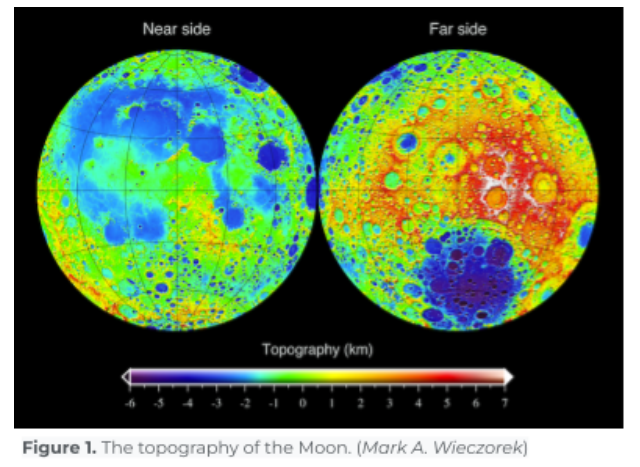

On a similar note, think of the last photo you took with your phone (photos are also stored using the raster data model\!). Consider how difficult it would be to recreate it with polygons representing one specific color. Using thousands of vertices, lines, and polygons to perform even simple functions at these scales takes too much processing power. That’s why we use rasters.

**The “raster data model” is simply a “regularly spaced grid of numeric values”.** 

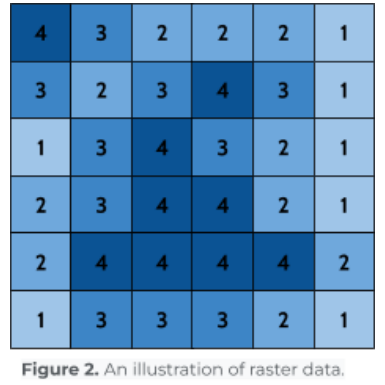

Rasters excel at storing data that changes continuously across a surface, making them much more usable for tasks like elevation mapping and storing images. Their simple grid-like structure allows for quick calculations and efficient image displays, making them indispensable in GIS and countless other software applications.

## **Problem Statement**

You are an intern at an engineering firm here in Utah Valley. The firm is looking for locations to build a small solar farm, and your boss has asked you to create the initial files so that they can run some analyses. Solar farms require a flat, uninterrupted area to get as much sun as possible, so they requested that you make a raster file of the Utah Valley area with slope values. *You need to create the slope file for them to use, along with a nice layout that shows the elevation with a hillshade layer for the client.*  
This scenario is less hypothetical than you might think. The 80 MW Elektron Solar farm in Tooele County came online in April 2024 and now sells power to Salt Lake City, Summit County, two ski resorts, and Utah Valley University (https://www.slc.gov/sustainability/climate-positive/elektron-solar/). Developers screening land for projects like that generally want ground sloping about 5 degrees or less, since steeper terrain means expensive grading (https://www.transect.com/insights/solar-farm-land-requirements) — exactly the question your slope raster will answer.

## **Learning Objectives**

* Repeat skills from the previous labs  
* Learn how to open raster files in QGIS  
* Learn essential processing tools (merge and slope) in QGIS  
* Learn how to edit raster symbology  
* Learn how to export a layer from QGIS to share

## **Software and Data**

* For this lab, we will use the GIS software application, QGIS. This free/open-source GIS package runs on Windows, Mac, and Linux operating systems. The software is pre-installed in the Clyde Building 234 computer lab. You can also download and install it on your computer from this website: [https://www.qgis.org/](https://www.qgis.org/). We will use this version throughout the course: *“Long Term Version 3.44 (LTR)”.*   
* There are no custom data downloads for this lab. Follow the instructions to download data from the State of Utah GIS website: [https://gis.utah.gov/products/sgid/](https://gis.utah.gov/products/sgid/)  
* Imagery from Google will also be used as a base layer.

**REVIEW THE deliverables section at the end of the document before continuing. You should always do this before starting any of your labs. It will help you make sense of the lab and not waste time.**

## **Instructions**

### **Adding a Raster to the Project**

1. Using the Utah GIS website from past labs, find the “Elevation” category  
   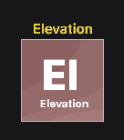  
2. Click on the “AUTO-CORRELATED DEMS” and follow the link under “Get the data”  
3. You should see an interface with a map of Utah on it. Use the “Draw Polygon” tool on the left side (under “Step 2 \- Define Area of Interest”) to draw a shape encompassing Utah Lake, Provo, and Y Mountain, double-clicking to finish the shape. (Zoom to this area before drawing your polygon.)

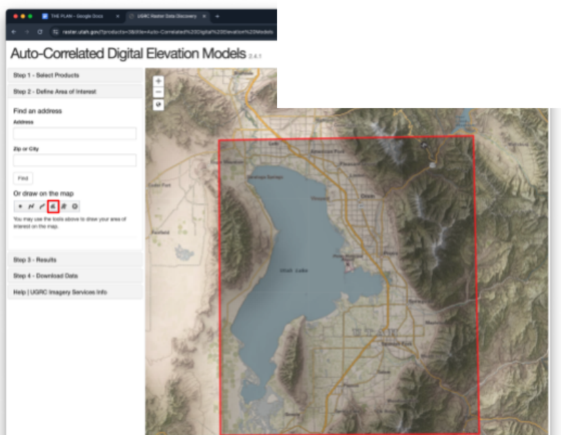

4. Under “Step 3 \- Results,” select the “5 Meter” DEM and click the Download button.

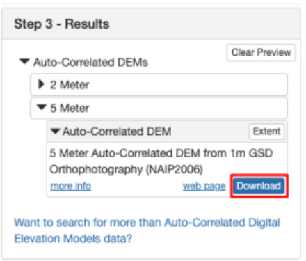

5. Under “Step 4 \- Download,” use the “.zip” links to download only the 6 DEMs that cover Utah Lake and Provo/Orem/Spanish Fork. (You can also click a tile right on the map to download it.) Each zip holds one “.asc” raster file  

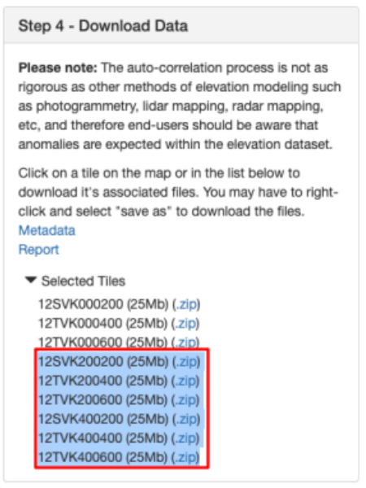

6. Unzip the files and save them where you save your lab files  
7. Open a new QGIS project and add a Google Satellite layer basemap as we’ve done in previous labs.  
8. Like in lab 2, use the “Current CRS” button on the bottom right of your screen to change the projection. Click on it, type “26912” into the Filter, select “NAD83 / UTM zone 12N” and press OK.  
9. Once you’re in the correct projection, open the 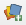 “Data Source Manager”  
10. Use the “Raster” tab, and click the “...” to browse to the raster files that you just downloaded.  
11. Select all 6, then click “Open,” then “Add.”  
12. Zoom in on Utah Lake and you should be able to see the rasters like this:

### **Merging Raster Layers**

13. Right-click on the toolbar. Find and check the “Processing Toolbox Panel”  
14. You will be using a lot of this toolbox later, but for now, search for “merge raster” and open the “Merge” tool under GDAL by double-clicking on it.  

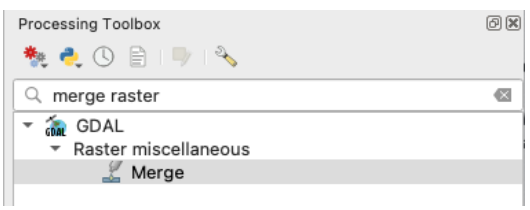

15. Use the ellipses “...” by “Input layers” to select all 6 DEM rasters and click OK.  
16. Use the **ellipses** by “Merged” to designate where the merged file should be saved, and give it a name like “merged\_dem”  

> [!WARNING]
> If your Merge tool window disappears after selecting the save destination, **check behind your QGIS window**. Sometimes QGIS does this with tools, so it’s worth checking behind your open windows if one that you’re using vanishes unexpectedly.

17. Leave the remaining options as default and press “Run”  

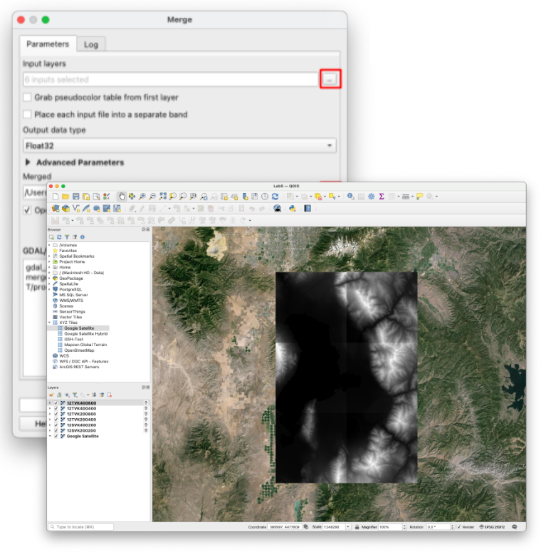

18. There should be a new layer in the Layers panel with your chosen name. This means it worked, and you can close the Merge tool window.  
19. To speed up QGIS, remove the unneeded raster layers by right-clicking each and selecting “Remove Layer”. The only DEM that you need now is the merged layer. You may also close the Processing Toolbox if you wish.

### **Editing Raster Symbology**

20. Double-click on the merged raster layer in the Layers panel and find the “Symbology” tab.  
21. Change the “Render type” dropdown to “Hillshade” and click “Apply.” Notice the change it makes on your map. Try the contour option and see how it’s different.   
22. Next, choose the “Singleband pseudocolor” render type and click “Apply”  
23. Change the “Color ramp” to any color scheme you like and press OK.  
24. Your map should look something like this (with the color scheme that you chose):  

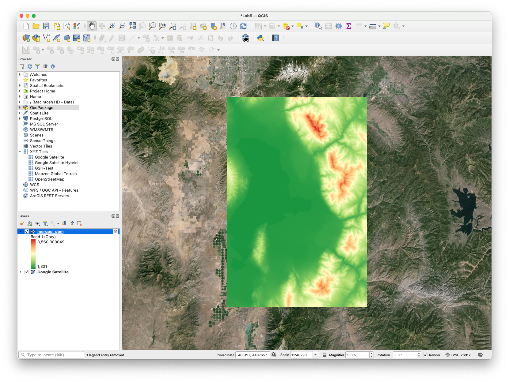

25. Right-click on your raster layer in the Layers panel, and select “Duplicate Layer”  
26. Change the duplicate layer to the “Hillshade” render type in the Symbology menu. Press OK and make sure it is underneath your original “Singleband pseudocolor” layer  
27. Double click on the singleband pseudocolor layer, and go to the “Transparency” tab instead of “Symbology” on the left side of the Layer Properties window.

28. Change the transparency to 40-50%, click OK, and watch the magic of combining the two layer types:

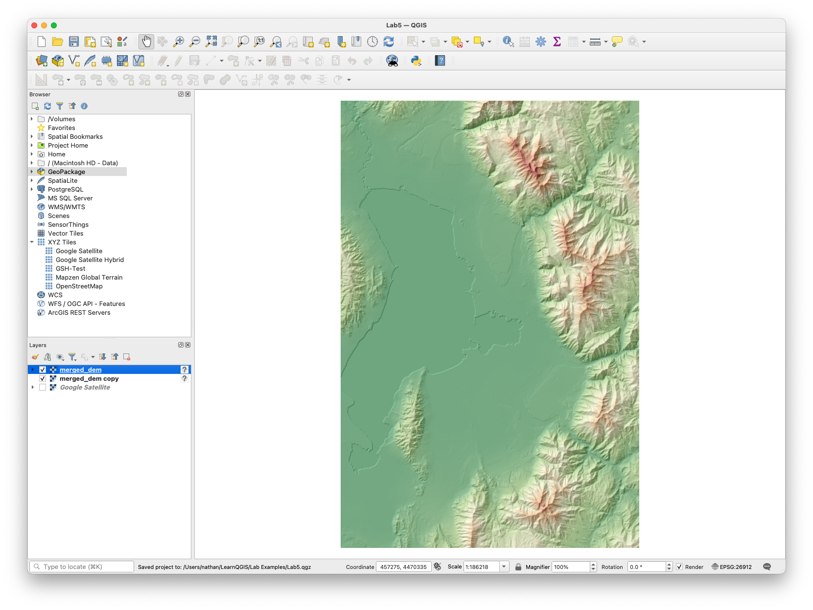

> [!TIP]
> **This example** shows how one might display data with useful symbology that is also easy to intuitively understand. While you may need only one layer for specific purposes, this creative visualization can provide a clearer perspective of the area’s elevation than any one layer, even satellite imagery. Take a moment to check and uncheck various layers in the Layers panel, and see how this new combination improves your understanding. Without the elevation colors, can you tell if one peak is higher than another? Without the hillshade or satellite imagery, how easy is it to see Utah Lake?

### **Adding City Names**

29. To add city names to the map, follow this link: [https://opendata.gis.utah.gov/datasets/utah-city-and-town-locations/about](https://opendata.gis.utah.gov/datasets/utah-city-and-town-locations/about) and download the shapefile data.  
30. Add it to your project  
31. Change the symbology of these points to “No Symbols”  
32. Add labels instead, with text/buffer settings that make the city names easy to read  
33. Prepare and export a layout with all the required elements, showing the full elevation view (color and hillshade layers) with the city names on top. It should look something like this:

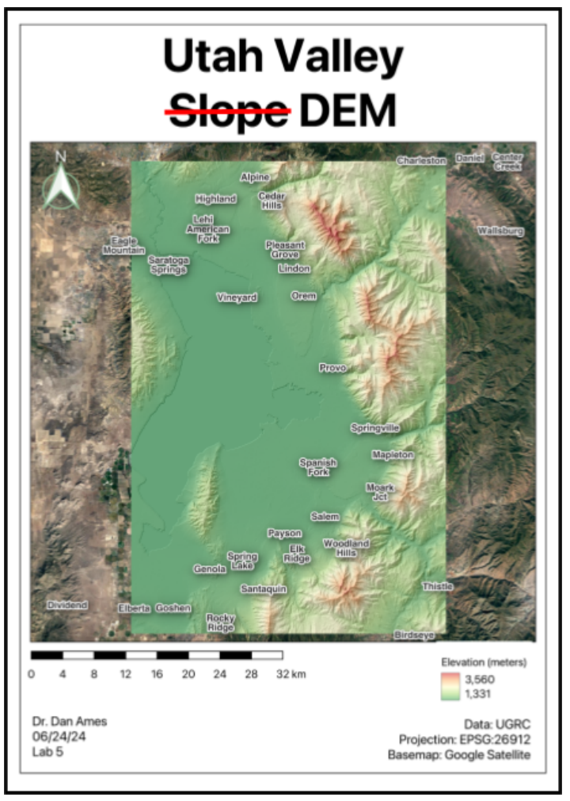

### **Finding Altitude/Elevation from a DEM**

34. Click on the 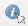 “Identify Features” tool in the top toolbar. This tool lets you click on the map for information about an item. Use it to **explore** the map.  

> [!TIP]
> You can still use the **scroll wheel** to zoom, and press the **middle mouse** to pan while using this tool.

35. A side panel should appear with a number value labeled “Band 1.” This is the elevation in meters (that's the unit UGRC publishes these DEMs in — QGIS just reports the cell value).  
36. Write down the elevation of Utah Lake.  
37. (Heads up: if you Google Utah Lake's elevation you'll get about 1,368 m / 4,489 ft, and your DEM will probably disagree. Auto-correlated DEMs are built by matching overlapping aerial photos, which works poorly over open water — UGRC even warns that anomalies are expected in this dataset. Write down what your DEM says, and don't panic.)  
38. Uncheck the hillshade layer in the Layers panel, and use the transparent elevation raster over the satellite map to find BYU. (You may want to swap out the Google Satellite layer for the Google Satellite Hybrid layer from Lab 1, to help you find locations)  
39. Write down the elevation of the Clyde/EB.  
40. Pan over to the Y on the mountain (directly east of campus) and write down the elevation at the top of the Y.

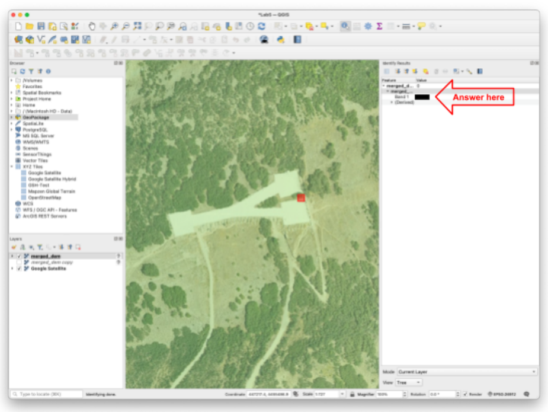

### **Using the Slope Tool**

41. Reselect the “Pan Map” tool (white hand) and close the “Identify Results” panel  
42. Right-click on the toolbar, and check the “Processing Toolbox Panel” from earlier  
43. Search for “slope” in the tools and double-click the 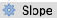 “Slope” tool under “Raster terrain analysis”  
44. Select your merged DEM in the dropdown (either one \- original or copy)  

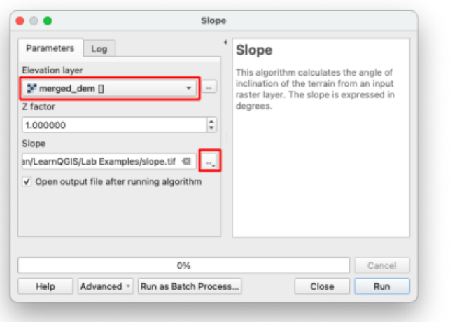

45. Use the ellipses next to the “Slope” box to “Save to File…” and **save** this new file in the same location as the rest of your project files. Name it “slope” and click “Run”  

> [!WARNING]
> If the tool window disappears, remember to check behind your other windows that you have open\!

46. Close the Slope tool window when it finishes. You should now have another layer, which shows slope instead of elevation. It should look something like this:

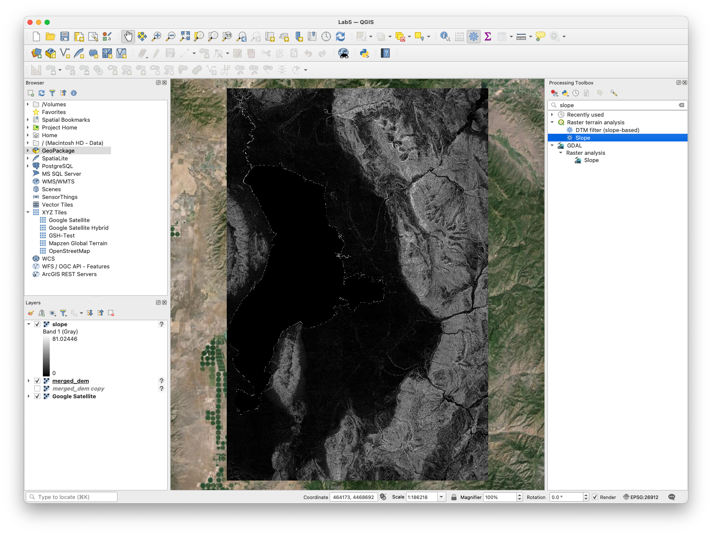

### **Exporting a Raster Layer**

47. You’ve now prepared the slope file that your boss asked for\! Right-click on the slope layer in the Layers panel, and navigate to *Export\>\>Save As…*  

> [!NOTE]
> **Exporting** any layer has a similar process. You won’t be doing much of it in this class, but in the professional world it is important to know how to export and share files.

48. Name the file “UV\_slope” and choose a save location that you can easily find (you will need to find it in a moment)  
49. Uncheck “Add saved file to map” and set the following settings:  
    1. Format \= “GeoTIFF”  
    2. CRS \= “EPSG:26912 \- NAD83/UTM zone 12N”  
50. Press OK to **export** the file.

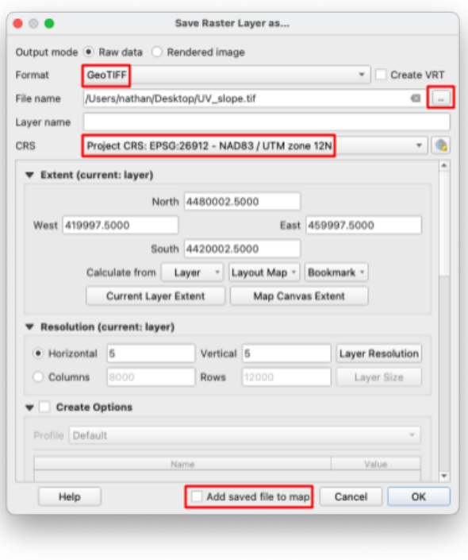

51. Find and open the exported GeoTIFF (“.tif” file) on your computer. By default, it opens in an image viewer since it is, in fact, an image (with some extra information). **Take a screenshot of your computer screen, showing that you’ve exported and opened this .tif file.**  
52. With only the slope, cities, and Google Satellite layers visible (uncheck all others in the layers panel), reopen your layout from earlier by navigating to *Project\>\>Layouts\>\>\[Layout Name\]*  
53. Use the refresh button  to refresh the layout. It should now show your slope instead of the elevation rasters.  
54. Select the legend and click “Update All” to refresh its contents  
55. Use the editing tools (the red minus button and the yellow pencil) in this panel to remove everything but the slope, and edit the label text for the slope legend to say “Slope (degrees),” like in this image (*below*)  

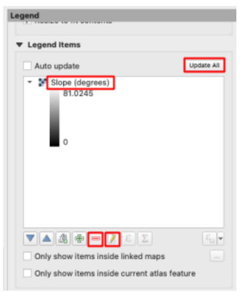

56. Change the title to something appropriate, and export this second layout 

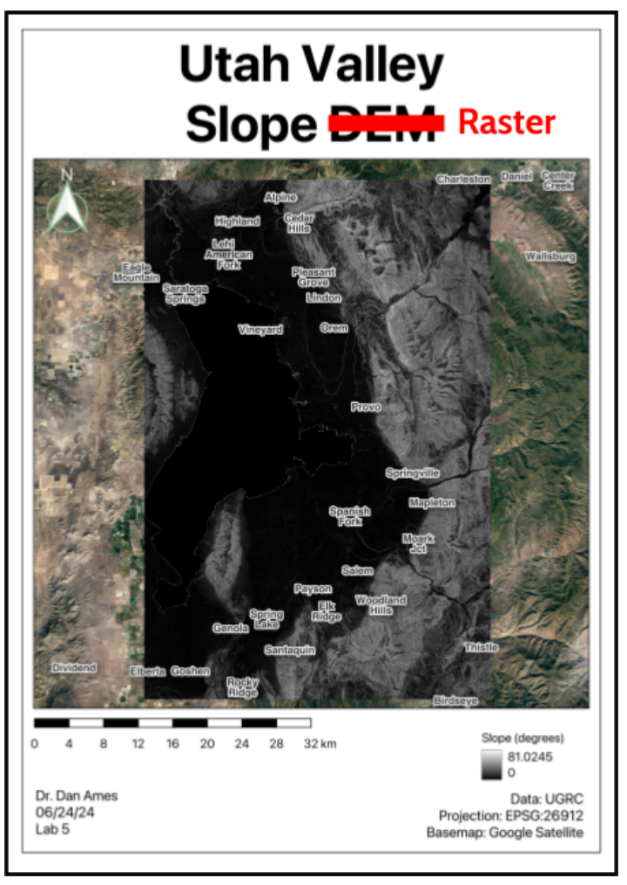

## **Deliverables**

Submit a PDF file that contains the following:

1. Your two map layouts, with all required elements and layers shown  
2. Your screenshot of the exported slope file  
3. Your elevation values of Utah Lake, the EB, and the Y  
4. The grading rubric, filled in with your self-evaluation

## **Grading Rubric**

The following rubric will be used to evaluate your lab assignment. Use this as a guide to ensure you include all the required elements for this lab. Under “Score” is the maximum possible points you can receive for each item. 

Sometimes, points are awarded on a "yes or no" basis, giving full points if something is present and none if it is not. Other times, points are given on a scale, depending on how well you complete the task. Please keep this in mind. For example, if there is a written answer required, grading will be based on a scale of points, depending on the quality and completeness of your written answer.

Copy the rubric and paste it into your lab report. Fill in your self-evaluation of the rubric, showing how many points you feel you have earned for each item.

| Requirement | Score |
| ----- | ----- |
| Create and include the required map layouts: Raster layers shown have been merged *(1 pt)* Google Satellite basemap layer is visible *(1 pt)* Hillshade and singleband pseudocolor layers visible in Elevation layout *(5 pts)* Legible city labels *(1 pt)* Slope raster shows proper tool results in Slope Layout *(5 pts)* Each includes all required cartographic elements *(6 pts \- see previous labs for details)* | /19 |
| Include a screenshot of your exported slope file: Screenshot shows that the slope layer has been exported as a .tif file and opened in an image viewer *(5 pts)* | /5 |
| Include your elevation values (in meters) for the following locations: Utah Lake *(2 pts)* The Engineering Building *(2 pts)* The Y *(2 pts)* | /6 |
| **Total** | **/30** |

## **Using AI on This Lab**

AI tools like ChatGPT and Gemini can be genuinely useful here, if you use them the right way. Good uses: asking why a hillshade makes terrain pop, what "slope in degrees" actually measures, or what a cryptic QGIS or GDAL error message means when the Merge tool refuses to run. You can also have an AI quiz you: ask it to test whether you can explain the difference between a raster and a vector data model, or why the DEM's elevation of Utah Lake might not match the number Google gives you. What is not okay: having AI write your deliverable answers, invent elevation values you never clicked, or fake a screenshot of a layout you never built — your maps and numbers must come from your own QGIS session. If you use AI, say so in your submission, and be ready to defend every answer as your own understanding.

* Good: "Explain what a hillshade layer is doing, like I'm a first-year engineering student."  
* Good: pasting a QGIS error message and asking what it means before you flag down a TA.  
* Not okay: "What elevation should I write down for the Y?" — click the map yourself.
