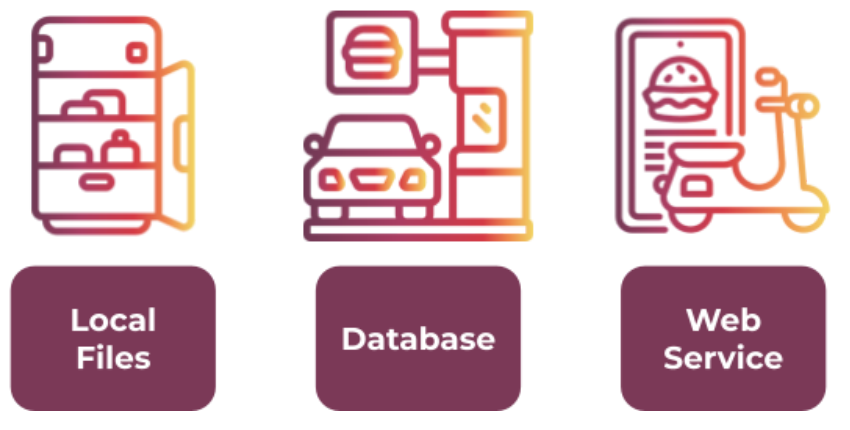
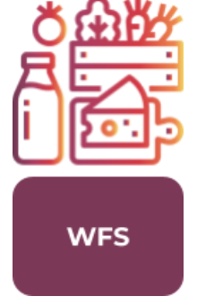
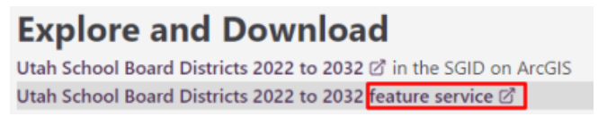
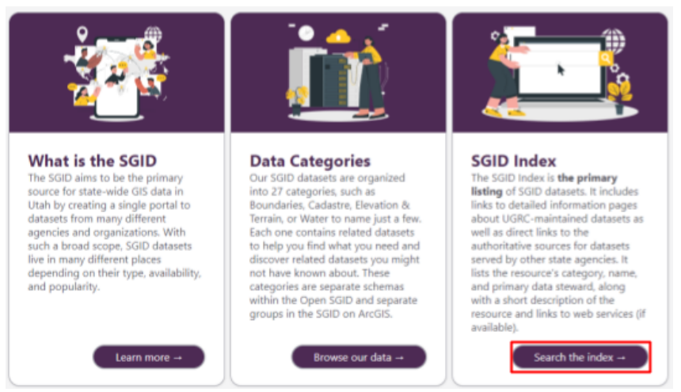
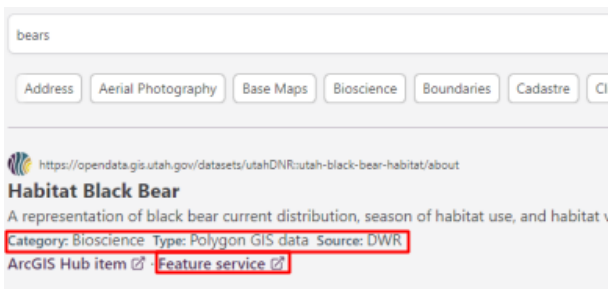
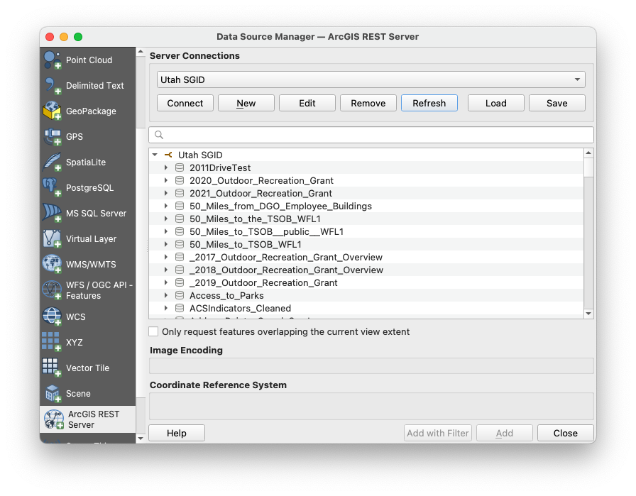
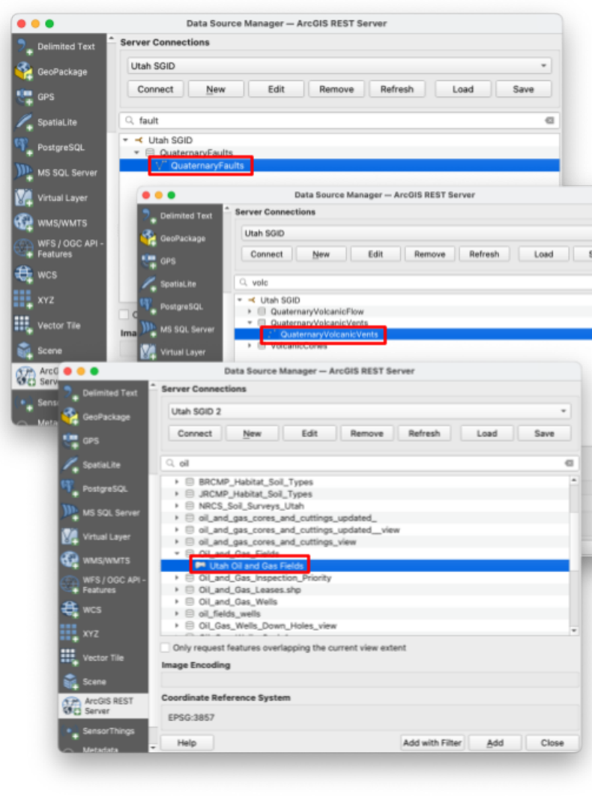
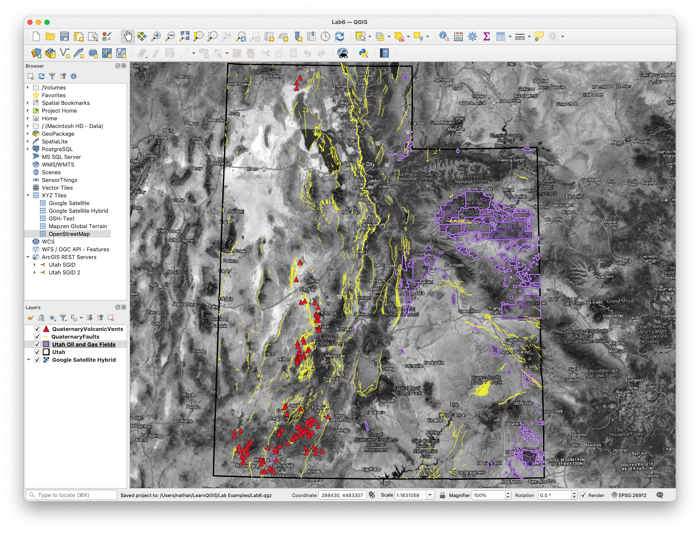
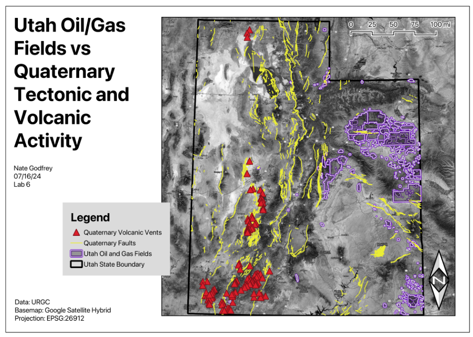

# Lab 6: Spatial Data Web Services

**Civil and Construction Engineering 114 — Geomatics**

Winter 2026 · Dr. Dan Ames

*Lab assignment developed by Nathan Godfrey and Dr. Ames*

## **Background**

### **Data Source Types**

We’ve used the Data Source Manager several times now in QGIS. It’s the interface that allows you to add data to your projects, and as you’ve seen on the left side of the manager window, there are many ways to do that. They all fall into 3 categories:

1. Local Files  
2. Databases  
3. Web Services

So far, we’ve used many **files** to insert data. Most of those files came from **databases** that you can link to directly by using methods like the PostgreSQL option. You can also use a **web service** that will retrieve the data for you from a database. Databases and web services look similar on our end, but think of it this way:

1. Using a local file is like eating the food in your fridge.  
2. Using a database is like getting takeout at a restaurant.  
3. Web services are like DoorDash, Uber Eats, and other delivery services.

Both **databases** and **web services** are great solutions for handling large amounts of data without using up your computer storage (fridge space). They also both allow data to be updated frequently without the need for re-downloading files with each update (fresh food, the moment it’s ready). On top of the convenience of data ready to go, **web services** offer better security and are easier on database servers (no crowded restaurant, many orders picked up by one delivery person).

Web services also matter when the data itself won’t hold still. During wildfire season, the National Interagency Fire Center publishes live fire perimeters as a public ArcGIS feature service that refreshes as often as every five minutes, and it’s the same feed behind the fire maps you see in the news. Nobody is downloading and unzipping a shapefile while the fire is still moving (https://data-nifc.opendata.arcgis.com/).

### **Web Services in QGIS**

The Open Geospatial Consortium (OGC) has published several standards for sharing GIS data on the web. Just as a standard USB cord enables various types of connections, an OGC standard allows different map and GIS applications to connect to the same data sources. QGIS uses some of these OGC standards, and you can find them near the bottom of the list in the Data Source Manager:  

* Web Map Service (**WMS**): A web service that provides georeferenced (attached to coordinates) map *images* to the client over the internet based on a request.  
* Web Map Tile Service (**WMTS**): A fast type of WMS that provides pre-rendered *image* “tiles” to the client based on need (panning and zoom level) instead of loading a full map image.

* Web Feature Service (**WFS**): Instead of returning images, a WFS provides *vector data* (points, lines, and polygons) that your computer creates images from. To continue the food analogy, it’s like getting raw ingredients rather than a prepared meal. WFS is much slower, but more analysis can be done because you have raw data, not just an image. WFS also has a modern successor called OGC API \- Features (it started life as “WFS 3.0” before being renamed): the same idea rebuilt on plain web URLs and GeoJSON, so even your web browser can read the data directly. QGIS handles both through the same “WFS / OGC API \- Features” entry in the Data Source Manager.  
* Web Coverage Service (**WCS**): Similar to a WFS, but provides *raster data* rather than discrete geometries/features.

  
There are a couple of other web services in the Data Source Manager that exist outside the OGC standards:

* **XYZ**: A less standardized version of WMTS, used by Google and others.  
* **Vector Tile**: A fast type of WFS that provides vector data in tiles, similar to how WMTS is a faster WMS.  
* **ArcGIS REST Server**: Provides either vector or raster data hosted on ArcGIS servers through a web service developed by ESRI (another GIS software company).

## **Problem Statement**

In this lab, you will write your own problem statement. You’ll need to explore the data in the State of Utah GIS web portal, and **write one question** that you want to **answer using 3 datasets**. You will practice loading the data into your map via **web service** rather than downloading and unzipping it. You may choose any three different datasets (e.g., roads, county boundaries, cities) and use them to create a map layout that helps answer your question. If you want to find other online data sources for other states/countries to complete this lab, you may, but you’re on your own to find the data, and you must still meet all requirements in the rubric.

Treat this lab as a mini project. To reiterate: your final layout will consist of three mapped datasets that help you answer some kind of GIS question (ex. “Where might I find more hiking trails at lower elevations?” or “Is there a correlation between the locations of Utah’s ghost towns and water sources?”) Remember that you have learned to use symbology to create, view, and compare points, lines, or polygons. You can review raster data this way as well. You’ve calculated lengths and areas, and found elevations at specific points; you can do it again if any of those skills are relevant to your question.

Be creative, and if you want to do something ridiculous like answer the question: “Are there any public libraries near black bear habitats, so that the bears can check out a book if they get bored?” then do it well\! This lab consists mostly of things you’ve already done, so use it to be creative and consider real-world applications of your growing GIS skills.

## **Learning Objectives**

* Repeat skills from the previous labs  
* Combine experiences from previous labs  
* Learn how to use web services in QGIS  
* Identify whether a question or problem can be solved through GIS  
* Learn independent problem-solving using GIS/QGIS

## **Software and Data**

* For this lab, we will use the GIS software application, QGIS (also known as Quantum GIS). This is a free/open source GIS package that runs on Windows, Mac, and Linux. The software is pre-installed on the computers in the Clyde Building 234 computer lab. You can also download it and install it on your own computer from this website: [https://www.qgis.org/](https://www.qgis.org/).  
* There are no custom data downloads for this lab. Follow the instructions to load data directly from the State of Utah GIS website via web services: [https://gis.utah.gov/products/sgid/](https://gis.utah.gov/products/sgid/)  
* Imagery from Google will also be used as a base layer (or a different base layer of your choice).

**REVIEW THE deliverables section at the end of the document before continuing. You should always do this before starting any of your labs. It will help you make sense of the lab and not waste time.**

## **Instructions**

### **Exploring UGRC Datasets**

1. Go to the UGRC site we’ve been using: [https://gis.utah.gov/products/sgid/](https://gis.utah.gov/products/sgid/)   
2. Click the "Browse Our Data" link to view available GIS data for the State of Utah.  
3. Browse the data offerings by category. You can find download links to most of the data we’ve used in other labs. Can you tell which of the web services listed above the SGID most often uses? (Hint: read the URL that opens when you click on any of their “feature service” links.)

> [!NOTE]
> At the top of the categories page, you can see that this collection of data is called the **State Geographic Information Datasource (SGID)**. The part that we can browse is the open (public) section. Most of the open data has both a **download link** and a **web service link**.

4. Now go back to the SGID homepage (linked in step 1\) and select “Search the Index”

5. Type “bears” in the search bar for an example. Note how each search result includes a category, data type, source, and a “feature service” link. Most results will also have a download option on their individual pages.

> [!NOTE]
> This index lets you search a larger collection of data that also includes items from the DWR, UDOT, and other state agencies. As long as you can still find the required information and files, feel free to use any of these datasets for this assignment.

### **Data Summary Table**

6. Choose your 3 datasets and a question they help answer, and create a table with them  
7. Include in your table:  
   1. The name of the dataset  
   2. The size of the file download  
   3. The data type (point, line, polygon, or raster)  
   4. The data’s source (usually an organization such as UGS, DWR, UDOT, etc.).  
   5. The methods available for accessing the data  
8. Write an introductory paragraph explaining your question and chosen datasets. What is the question you are trying to answer? How will you use each dataset in answering your question?

### **Connecting to and Adding Data via Web Service**

> [!TIP]
> In the following steps, I’m going to make a map that answers the question “Is there a correlation between Utah’s oil/gas field locations and recent geologic activity?” **In your project, find and use different data to answer your own question.**

9. Open QGIS and start a **new project**  
10. Open the Data Source Manager  
11. Select “ArcGIS REST Server” and click New  
12. Name the connection “Utah SGID.”  
13. Paste this UGRC services link into the URL field (this is the web service that hosts the SGID data you browsed in the index): [https://services1.arcgis.com/99lidPhWCzftIe9K/ArcGIS/rest/services](https://services1.arcgis.com/99lidPhWCzftIe9K/ArcGIS/rest/services)  
14. In “Authentication,” select the “Basic” tab, and enter “ugrc” as both the username and password (these services are actually public, so if your connection fails later, try again leaving this set to “No Authentication”)  
15. Click “OK” and then “Connect” (remember that sometimes the Data Source Manager can drop behind the main QGIS window, check there if it disappears)  
16. You should now have a new item under ArcGIS Rest Servers in the Data Source Manager. Expand the dropdown to see the full list of datasets that you’ve connected to — as of this writing, nearly 900 of them, all served live from UGRC’s servers.

17. Find three useful datasets and add them to your map by using the “Add” button. I added data on oil/gas fields in Utah, quaternary faults, and quaternary volcanic vents.  

> [!WARNING]
> Most of the data in the UGRC library will be under the first link, but it is not all stored under that connection. **If you have more trouble** with finding the data that you want through the web service connection, do not just download it, **ask a TA** or Dr. Ames for help instead\!

18. If a dataset you found by searching the index is **not appearing in this list**, it may be stored in a different place (in testing this lab, this happened with the Utah Oil and Gas Fields data). To get around this, repeat steps 10-15 with this link ([https://services.arcgis.com/ZzrwjTRez6FJiOq4/ArcGIS/rest/services](https://services.arcgis.com/ZzrwjTRez6FJiOq4/ArcGIS/rest/services)) and a different connection name like “Utah SGID 2”  
19. Also, select a basemap that is useful to your project’s purpose. For this example, I chose the Google Satellite Hybrid.  

20. You may add more layers, but only 3 are necessary to get full points. I ended up adding Utah’s state boundaries in the example (easily found by typing “bound” in the search bar). 

### **Designing a Useful Map and Layout**

21. Modify the symbology from the default colors and outlines to symbols that make sense for the data layers you have added, ensuring the map is clearly readable.

22. Create a layout for your map and include all required map elements (e.g., map legend, scale bar, title).

### **Writing a Conclusion**

23. Write a brief conclusion paragraph indicating which datasets you used and **what purpose your final map serves** (e.g., emergency response, recreation planning, real estate development, environmental analysis).

## **Deliverables**

Submit a PDF file that contains:

1. Your name, date, and lab number  
2. Your data table  
3. Your introductory paragraph (see step 8\)  
4. Your layout shows all 3 of your datasets, including modified symbology and all required map elements  
5. Your conclusion paragraph (see step 23\)  
6. The grading rubric, filled in with your self-evaluation

## **Grading Rubric**

The following rubric will be used to evaluate your lab assignment. Use this as a guide to ensure you include all required elements for this lab. Shown under “Score” is the maximum possible points you can receive for each item. 

Sometimes, points are awarded on a "yes or no" basis, giving full points if something is present and none if it is not. Other times, points are awarded on a scale based on how well you complete the task. Please keep this in mind. For example, if there is a written answer required, grading will be based on a scale of points, depending on the quality and completeness of your written answer.

Copy the rubric and paste it into your lab report. Fill in your self-evaluation of the rubric, showing how many points you feel you have earned for each item.

| Requirement | Score |
| ----- | ----- |
| Provide the requested data table: Table with your 3 chosen datasets and each required point of information *(3 pts)* | /3 |
| Present a complete and thoughtful introductory paragraph: Your complete question *(5 pts)* A brief explanation of how each dataset is relevant and will be used *(2 pts)* | /7 |
| Create and include the required map layout: Basemap layer is visible *(1 pt)* All three datasets are clearly displayed *(6 pts)* All required cartographic elements *(6 pts \- see previous labs for details)* | /13 |
| Provide a complete and thoughtful conclusion paragraph: Your process sufficiently answers your question, and/or produces a hypothesis for further analysis *(7 pts)* | /7 |
| **Total** | **/30** |

## **Using AI on This Lab**

This lab asks you to invent your own GIS question, and that is exactly where AI tools like ChatGPT or Gemini can be a useful thinking partner. Use them to brainstorm candidate questions ("here are three Utah datasets I found, what could they answer together?"), to check whether your question is actually answerable with the data you picked, to explain what a feature service or REST URL really is, or to decode a cryptic QGIS error when a connection refuses to load. What they should not do is your work: don't have AI write your introductory or conclusion paragraphs, invent claims about a map it has never seen, or fill in your self-evaluation for you. The written parts of this lab are graded on your reasoning about your map, so AI-written filler is easy to spot and earns you nothing.

* Good: pasting an exact QGIS or connection error message and asking what it means.  
* Good: asking AI to quiz you on the difference between WMS, WFS, and a feature service.  
* Not okay: submitting AI-written paragraphs or "results" about a map you didn't actually make.

If you do use AI anywhere in this lab, say so in your report, and be ready to explain and defend every answer as your own understanding.
