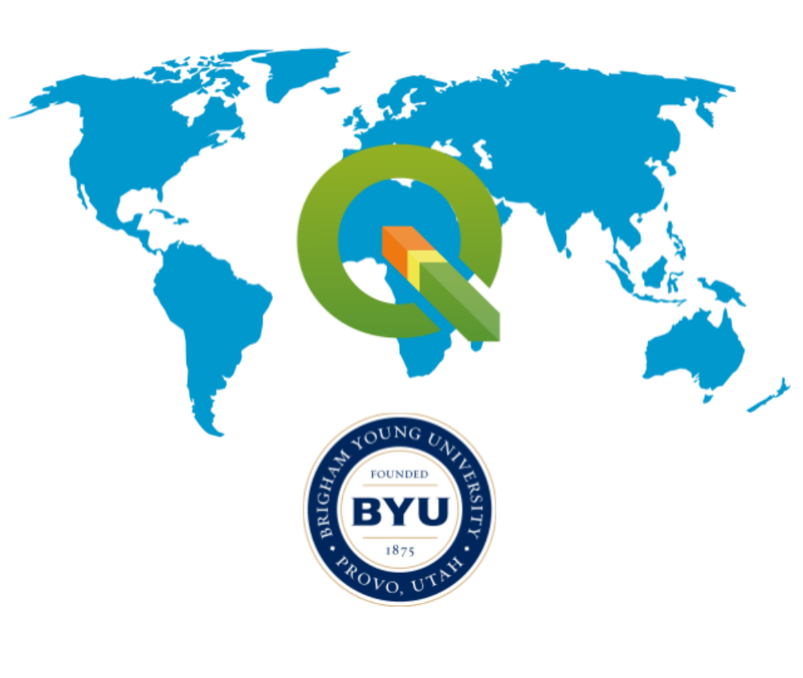
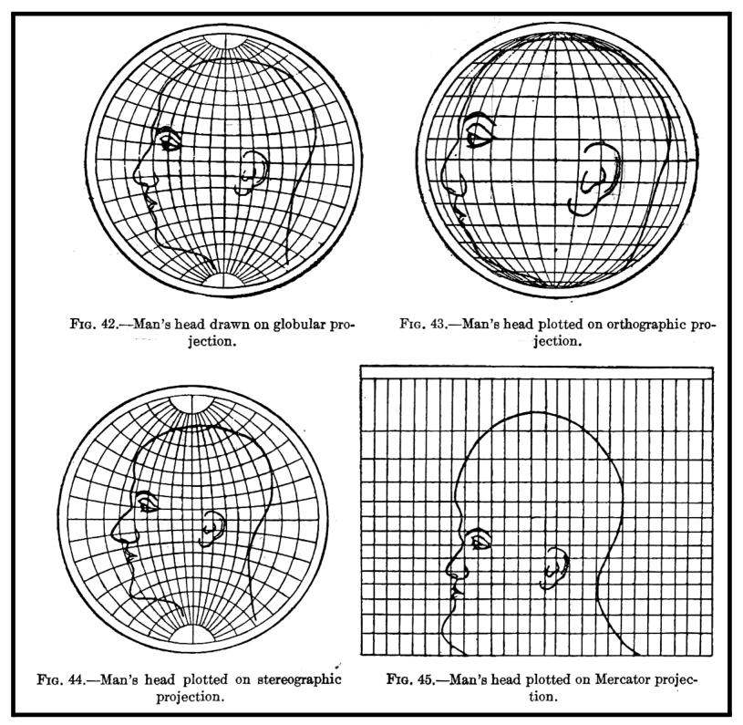
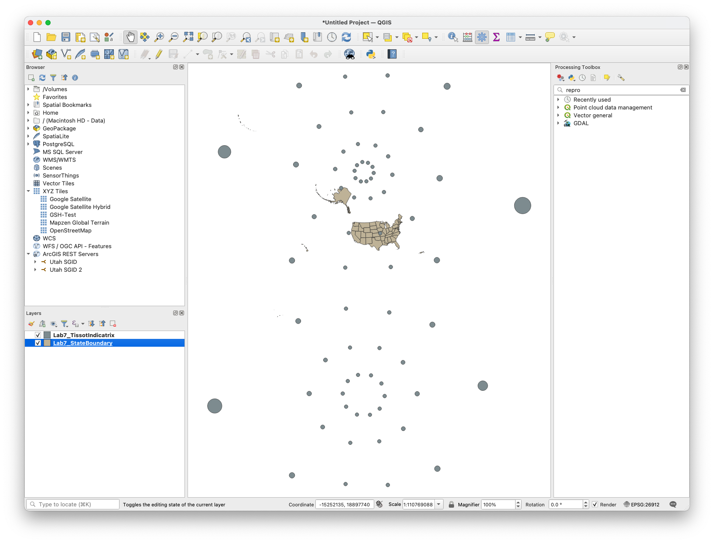
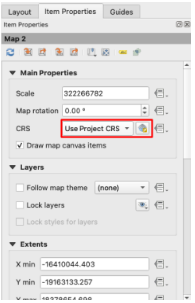
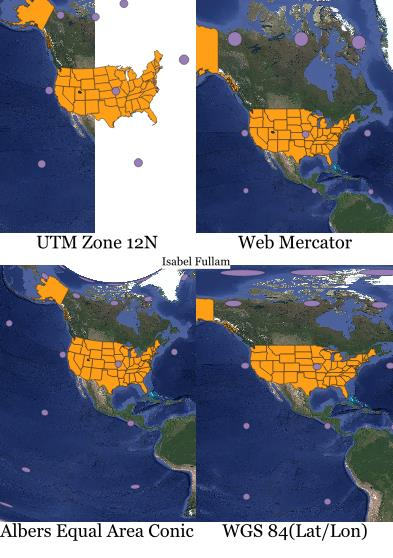
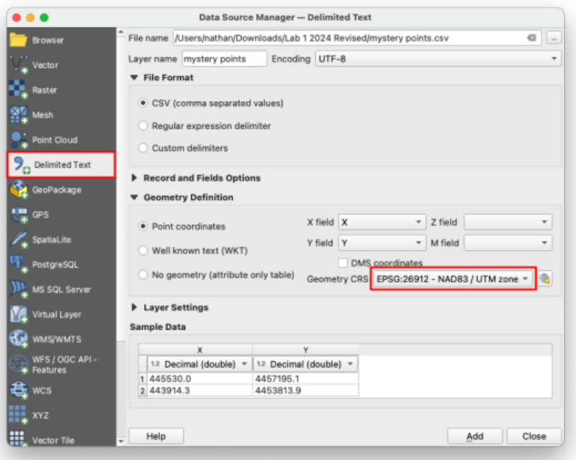
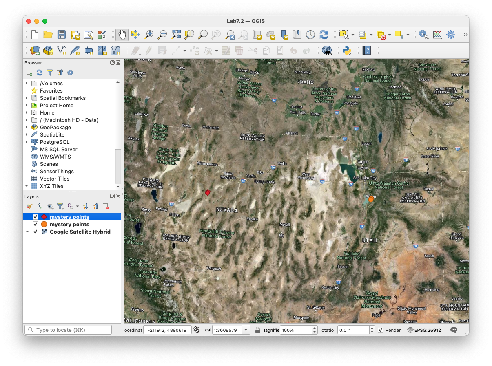
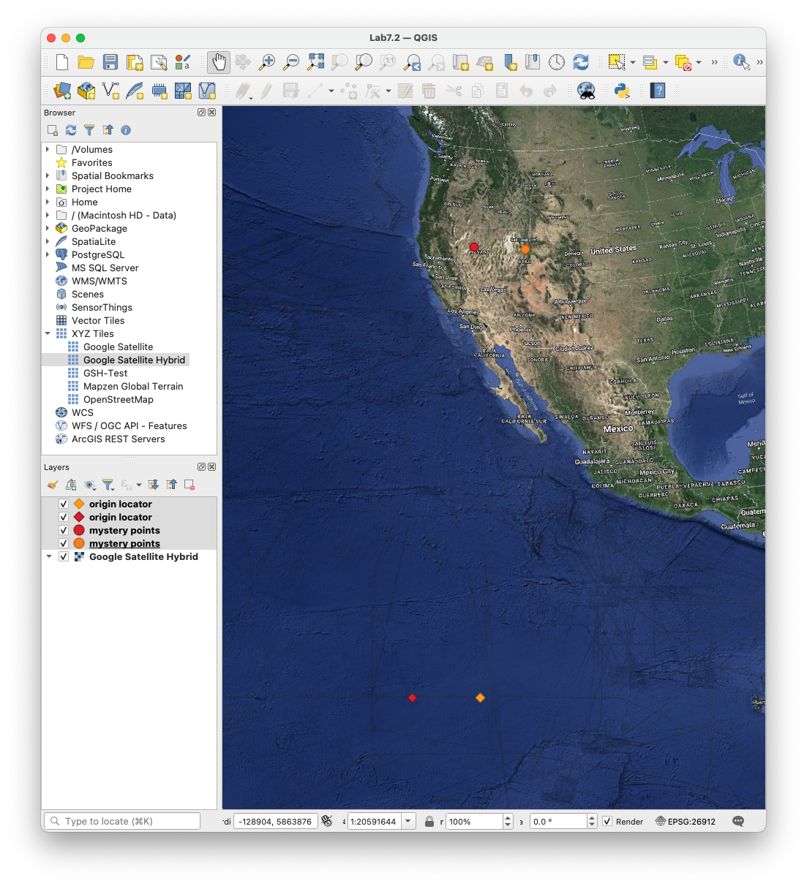

# Lab 7: Projections and Coordinate Systems

**Civil and Construction Engineering 114 — Geomatics**

Winter 2026 · Dr. Dan Ames

*Lab assignment developed by Nathan Godfrey and Dr. Ames*

## **Background**

**Figure 1\.** From Charles H. Deetz, *Elements of Map Projection With Applications to Map and Chart Construction* (Washington: Government Printing Office, 1921): 51\. HathiTrust/Cornell

### **Projections**

The study of the shape of the Earth is called geodesy. From this field of science, we learn that the shape of the Earth is an ellipsoid, a slightly smashed sphere that bulges at the equator. However, most of the time, engineers, earth scientists, and builders work at such a small scale that the earth’s surface can be assumed to be flat. Similarly, for most navigation and reckoning purposes, people find it much easier to use flat paper maps than to use spherical (or ellipsoidal) globes. How can we take a curved Earth and represent it on a flat map? It can be done in many ways. This is the purpose of map projections.  
We use map projections to give realistic approximations of the size, shape, and position of things on the earth, as represented in 2 dimensions instead of a 3D globe. The word “projections” comes from the idea of shining a light inside the globe, and “projecting” the image of the earth’s surface out onto a flat piece of paper, like projecting an image on a movie screen. These projections always create distortion in one or more ways. The goal is to find and use projections best suited to the type of work you need to do.  
Distortion is not a small effect. On the Mercator map hanging on your friend's wall, Greenland looks about the same size as Africa. In reality, Africa is about 14 times larger (roughly 30.4 million square km versus Greenland's 2.2 million). Mercator published his projection in 1569 so sailors could steer straight compass courses; it was never meant to compare sizes, but it became the default wall map anyway.

### **Coordinate Systems**

Coordinate systems are a way to tell us where things are located on the Earth. The coordinate systems that we use can be broken down into two main categories: **geographic** and **projected**.

* **Geographic coordinates** are based on the 3-dimensional shape of the Earth, and are measured in angular units (degrees). Latitude and longitude lines are a system of geographic coordinates.  
* **Projected coordinates**, as the name implies, are based on a 2-dimensional projection. Measured in distances like feet, miles, and kilometers, projected coordinate systems are generally more useful for analysis that involves such measurements. The CRS that our labs have used (UTM Zone 12N) is a projected coordinate system.

In short, **geographic** coordinate systems are the round grids on a globe, and **projected** coordinate systems are the flat grids on a map. They are measured in different units, and GIS software does calculations in one or the other, not both at once. In this course, we will only use **projected** coordinate systems.  
One more reason to respect your coordinates: when software gets missing or broken location data, it often defaults to (0,0). In WGS84 that spot is in the Gulf of Guinea, off the coast of West Africa, and so much buggy GPS data "lands" there that GIS professionals jokingly named it Null Island. For years, NOAA even kept a real weather buoy moored at 0°N, 0°E (Station 13010, nicknamed "Soul"). Later in this lab, you will plot a (0,0) point yourself and see where UTM thinks it is.

> [!NOTE]
> When you set a **CRS** in QGIS (or another GIS software), you are essentially selecting a pair of **projection** (so that the map can be displayed on your flat monitor) and **coordinate system** (so that your computer can process measurements).

This lab will introduce you to changing your CRS in QGIS and illustrate what you might look for in selecting one. You will be required to add data to a map, change the CRS, and examine the results. You will use data layers as normal, but when creating the layout, you will add multiple map frames and change the CRS of each.

## **Problem Statement**

It’s a year from now. You see a world map (Mercator Projection) on your friend’s wall, and it reminds you of your CCE 114 class. Recalling Dr. Ames’s lecture on projections, you tell your friend: “Did you know that all world maps are wrong in some way?” They don’t believe you. You try to explain map projections, but it would be a lot easier if you could make a map to show them. You still have QGIS on your laptop, and you decide to make a layout to help them understand projections (you really miss CCE 114).

## **Learning Objectives**

* Repeat skills from the previous labs  
* Learn how to change the CRS in QGIS, and what it means  
* Learn how to select a CRS for a given project  
* Examine different types of distortion present in map projections

## **Software and Data**

* For this lab, we will use the GIS software application, QGIS (also known as Quantum GIS). This is a free/open source GIS package that runs on Windows, Mac, and Linux operating systems. The software is pre-installed in the Clyde Building 234 computer lab. You can also download it and install it on your own computer from this website: [https://www.qgis.org/](https://www.qgis.org/). We will be using this version throughout the course: “Long Term Version” 3.44 (LTR)*.*   
* There are custom data downloads for this lab. Follow the instructions to download data from Learning Suite. This data comes from past lab assignments.  
* Imagery from Google will also be used as a base layer. 

**REVIEW THE deliverables section at the end of the document before continuing. You should always do this before starting any of your labs. It will help you make sense of the lab and not waste time.**

## **Instructions**

### **Projections**

1. First, open a new QGIS project and change the CRS to the usual EPSG:26912 using the button in the bottom right corner.  
2. Download the data folder for the lab from the Lab 7 assignment on Learning Suite. Remember not to use a network drive (NO J: DRIVE\!), but save the file locally.  
3. Extract (unzip) the folder and add the new files to your project. Do this by dragging the entire unzipped folder into the layers panel. Click “OK” on any of the “Select Transformation” windows that pop up.  
4. Your map should look something like this, with US state boundaries and **Tissot circles.**

> [!NOTE]
> The **Tissot Indicatrix** contains circles that visually represent how the projection has distorted a map. If there was zero distortion, each of the circles would appear as a perfect circle, perfectly spaced, and equal in size to the others. Projections that *preserve area* will have circles of identical area but not necessarily shape or spacing. An *equidistant* projection keeps the relative distances constant. A projection that *preserves shape* doesn’t necessarily preserve size, spacing, etc. A Tissot Indicator for a projection that does not get distorted is called a standard circle.

5. Add the Google Satellite basemap  
6. SAVE your project\! (At this point, we’ve mostly stopped reminding you, but it is IMPORTANT)  
7. Create a new print layout.  
8. Use the “Add Map” tool 4 times to create 4 map frames of equal size on the page. Leave room for a title near each. *In this lab, you will not need to leave room for map elements or other text besides your name, and a title for each of the 4 maps (see example below).*  
9. Use “Select/Move Item” on the left to select one of the map frames.  
10. On the right panel, in “Item Properties” **change the CRS** to “**EPSG:3857 \- WGS 84 / Pseudo-Mercator**”

> [!NOTE]
> Gerardus Mercator created a projection in the 1500s that was expertly crafted for sailing the seas, as it preserves compass directions and angles for navigation. It became so popular that it is often used in geographic education today, despite the heavy distortion of area, shape, and distance the further you get from the equator. **This slight variant we're using \- called “Web Mercator” \- is by far the most common projection you'll see today, being the go-to for web applications like Google Maps, Apple Maps, Google Earth, ArcGIS, etc.**

> [!WARNING]
> **IMPORTANT NOTE:** In this lab, **we are not reprojecting any of the data sets**. There is a reprojection tool to do this in the Geoprocessing Toolbox. At times it is necessary, like in situations where you have multiple datasets in different projections. However, in this lab, *we are only changing the CRS of the display*. The difference is massively important when using data for calculations and analysis\!

11. Repeat this twice more, changing two more map frames to:  
    1. “**ESRI:102003 \- USA\_Contiguous\_Albers\_Equal\_Area\_Conic**”  
    2. “**EPSG:4326 \- WGS 84**”

> [!NOTE]
> The Albers Equal Area Conic projection **keeps areas proportional, but shapes and distances are distorted**. However, all distortion is minimal within the central focus of the map.

> [!NOTE]
> The WGS 84 CRS is considered “unprojected” since **it uses latitude/longitude coordinates** and not physical distances. It turns longitude into straight vertical lines, and latitude into straight horizontal lines, all equally spaced to create a grid of perfect squares.

12. Zoom each map in closer to the United States and observe how sizes and shapes change in these various projections, and how each distorts them in a different way. Your layout should look something like this:

13. Add a title by each map frame that says which projection is being used (see example above for the title text), and another with your name  
14. Export the layout as an image or PDF, save your project, and close it

### **Projected Coordinate Systems**

15. Create a new project, and set the CRS to the usual EPSG:26912 projection  
16. Set a basemap  
17. Download the “mystery points” CSV (from the Lab 7 info on Learning Suite), and use the “Delimited Text” tab in the Data Source Manager to add it to the map. Leave all the default options, just ensure it is using our usual “EPSG:26912” for the “Geometry CRS” (see below).  
18. Then, add it again but change the “Geometry CRS” to “EPSG:26911 \- NAD83 / UTM zone 11N”

19. Your map should look like this:  

20. As you can see, although the coordinate numbers remain the same, they can mean something completely different in another CRS. For UTM zones, the origin of the coordinate system is on the equator, in the bottom left corner of the UTM zone. Create a new CSV file that contains only the coordinates (0,0). In Notepad (or any plain text editor), make a file with a header line X,Y and a single data line 0,0 and save it as origin.csv. Name the layer “Origin Locator”.  

> [!TIP]
> If you don’t remember how to create and add csv files to QGIS, **look back at the instructions for lab 3 or make a copy of the mystery points file.**

21. Add this new CSV file to your project in the 12N zone, and again in the 11N zone by repeating steps 17-18  
22. You should end up with something like this.

23. Change the symbology to something easily visible, zoom/pan until all these points are visible, and take a screenshot of your QGIS window.  
24. Save this project and close it

### **True Size**

25. Open a browser and go to maps.google.com  
26. The basemap for this site is the Web Mercator projection, which distorts area and distance. Let’s prove that now.  
27. Just by visual inspection of Google Maps, write your best-guess answers to the following questions:  
    1. How many whole Australias can fit inside of Russia?  
    2. Which is larger, Alaska or Brazil?  
    3. Which continent(s) are closest in size to Antarctica?  
    4. Which is larger, Greenland or India?  
    5. Which of the following countries could all fit together in Argentina? Norway, Sweden, Finland, Denmark, Iceland, Ireland, the United Kingdom, Belgium, and the Netherlands?  
28. It turns out there’s a website that allows you to answer these questions very easily. Go to thetruesize.com  
29. Now use this site to re-answer the questions above. You can zoom/pan with the mouse, add a movable country/state to the map by typing it in the search bar, and rotate them with the compass in the bottom left corner. Right-clicking a shape will **delete it.**

> [!WARNING]
> You will need to turn in a screenshot that shows your work on this map, so **don’t remove your work yet\!**

30. Take a screenshot of the browser showing your work on at least questions a-d (we won’t make you complete the puzzle that is question e, you’ll get the idea just by attempting it)  
31. Compare your answers with the following solutions; you will not be graded on how correct you were (open each dropdown to see the answer):  
    1. 

Spoiler
 About two whole Australias fit inside Russia (with a bit of room to spare).<!-- reconstructed answer: Dan, compare with your Doc's dropdown wording -->
  
    2. 

Spoiler
 Brazil — by a lot. It is roughly five times the area of Alaska, even though Web Mercator makes Alaska look comparable.<!-- reconstructed answer: Dan, compare with your Doc's dropdown wording -->
  
    3. 

Spoiler
 Antarctica sits between Europe and South America in size — far smaller than the giant white band Web Mercator shows.<!-- reconstructed answer: Dan, compare with your Doc's dropdown wording -->
  
    4. 

Spoiler
 India — nearly four times the area of Greenland, despite how the map makes Greenland look.<!-- reconstructed answer: Dan, compare with your Doc's dropdown wording -->
  
    5. 

Spoiler
 Yes — all nine countries can be packed inside Argentina.<!-- reconstructed answer: Dan, compare with your Doc's dropdown wording -->
 and here’s a link to the solution if you want to see it ([answer](https://drive.google.com/file/d/1ZesMv7uGwfIKyGwtXmWU7k93komtoV_o/view?usp=sharing))

## **Deliverables**

Submit a PDF file that contains:

1. The layout of the 4 different projections, states, and Tissot circles is included  
2. A screenshot of the QGIS window with the mystery coordinate points in different projections  
3. A screenshot of your work on thetruesize.com and your answers to each of the questions  
4. Answers to the following questions:  
   1. What kind of distortion do you see in each different projection? (Area, shape, distances, etc.)  
   2. WGS84 (EPSG:4326) is the default CRS for GPS receivers, Google Earth, and many other mapping tools. Why can’t we just use that CRS for everything everywhere?  
5. The grading rubric, filled in with your self-evaluation

## **Grading Rubric**

The following rubric will be used to evaluate your lab assignment. You should use this as a guide to ensure you include all the required elements for this lab. Shown under “Score” is the maximum possible points you can receive for each item. 

Sometimes, points are awarded on a "yes or no" basis, giving full points if something is present and none if it is not. Other times, points are given on a scale, depending on how well you complete the task. Please keep this in mind. For example, if there is a written answer required, grading will be based on a scale of points, depending on the quality and completeness of your written answer.

Copy the rubric and paste it into your lab report. Fill in your self-evaluation of the rubric, showing how many points you feel you have earned for each item.

| Requirement | Score |
| ----- | ----- |
| Create and include the required 4-projection map layout: Basemap layer is visible *(1 pt)* States, Tissot circles, and name are visible *(6 pts)* Layout is neat and provides a view of all 4 required projections *(8 pts)* | /15 |
| Include a screenshot of mystery points: Your screenshot shows all 4 required point layers (6 points in all) in their proper locations *(5 pts)* | /5 |
| Include a screenshot of thetruesize.com work: Your work is clearly visible in the screenshot *(2 pts)* Your answers (correct or incorrect) from the first attempt at questions a-e *(3 pts)* | /5 |
| Provide correct and thoughtful answers to the questions in the deliverables: Your responses sufficiently answer each question *(5 pts)* | /5 |
| **Total** | **/30** |

## **Extra Links**

[https://www.leventhalmap.org/digital-exhibitions/bending-lines/interactives/projection-face/](https://www.leventhalmap.org/digital-exhibitions/bending-lines/interactives/projection-face/) \- Live reprojection tool on the human head  
[https://xkcd.com/977/](https://xkcd.com/977/) \- xkcd comic  
[https://github.andrewt.net/mercator-rotator/](https://github.andrewt.net/mercator-rotator/) \- Mercator Rotator  
[https://mrgris.com/projects/merc-extreme/\#40.23384,-111.65853](https://mrgris.com/projects/merc-extreme/#40.23384,-111.65853) \- Mercator Extreme

## **Using AI on This Lab**

AI tools like ChatGPT and Gemini can be genuinely useful on this lab if you use them to learn rather than to skip the learning. Good uses: asking why the same easting/northing pair lands in Nevada when you read it as Zone 11N instead of 12N, having AI explain what a Tissot circle actually measures, decoding a confusing "Select Transformation" dialog or a cryptic CRS warning in QGIS, or quizzing yourself on which projections preserve area versus shape before you answer the deliverable questions. What is not okay: having AI write your answers to the distortion questions, inventing results, or describing a map you never actually made. Your screenshots must come from your own QGIS session and your own browser. If you use AI, say so in your submission, and be ready to explain and defend every answer as your own understanding \- that is the standard you will be held to in this class and in engineering practice.
