# Lab 9: Geoprocessing — The Yellowstone Disaster

**Civil and Construction Engineering 114 — Geomatics**

Winter 2026 · Dr. Dan Ames

*Lab assignment developed by Nathan Godfrey and Dr. Ames*

## **Background**

Geoprocessing is the use of various techniques and tools to analyze and manage geographic data. It takes input data, transforms/analyzes it in some way, and gives output data, and its purpose is to **solve spatial problems** and support decision-making. It’s a fairly broad term, and it is safe to say that you’ve already done some simple geoprocessing in this class.

In GIS software, geoprocessing “tools” are specialized functions and algorithms used to manipulate, analyze, and manage spatial data. These tools enable the transformation of raw data into actionable insights, supporting decision-making and problem-solving in various fields. In QGIS, you find them in the “Processing Toolbox.”

## **Problem Statement**

WARNING\! Yellowstone Disaster is imminent\! Unprecedented climate change and natural disasters have destabilized much of Yellowstone National Park. The National Park Service has tasked you with using your GIS skills to analyze areas most in need of attention as this disaster unfolds. You will evaluate 3 scenarios to find areas that need the most attention. No data will be provided to you. Any data you need should come from the National Map website or be created by you.  
If this scenario sounds far-fetched, consider this: in June 2022, record flooding really did close every entrance to Yellowstone and forced about 10,000 visitors to evacuate in a single day. Rivers rerouted themselves and whole sections of the north entrance road washed away. You can read the story here: https://www.nps.gov/articles/000/yell-flooding.htm

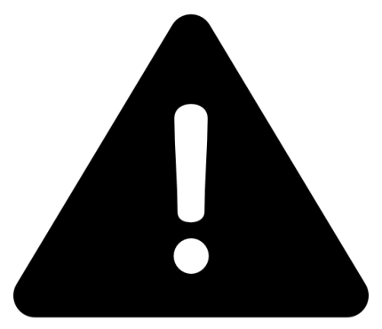

## **Learning Objectives**

* Repeat skills from the previous labs  
* Learn how to use the National Map system  
* Learn how to use GIS processing tools  
  * This lab uses the following tools: Reclassify by Table, Buffer, Reproject Layer, Select by Attribute, Clip, Fix Geometries, and Difference  
* Learn practical application of shapefiles and GIS methods

**REVIEW THE deliverables section at the end of the document before continuing. You should always do this before starting any of your labs. It will help you make sense of the lab and not waste time.**

## **Instructions**

### **Part 1: Floods**

Yellowstone Lake is about to spill into the rest of the park\! The Continental Divide is disappearing in a series of unexplainable earthquakes and landslides of biblical proportions. Find the areas of the park that are lower than the lake, and therefore the most prone to flooding if that happens.

1. Go to this link: [https://apps.nationalmap.gov/viewer/](https://apps.nationalmap.gov/viewer/) and click the “Data Download” tab  
2. Under “Data” in the Datasets tab, check the “Elevation Products” category and choose **only** the current ⅓ arc-second DEM  
3. Zoom in on Yellowstone National Park and use the search options at the top of the sidebar (extent, polygon, point, etc.) on Yellowstone Lake, creating either a point on the lake or a polygon around it.  
4. Click  (the “Search Products” button) to bring up a list of elevation datasets that include your markers. Find the one elevation dataset that covers the northwest section of Wyoming (most of the park, including the lake). Make sure you have the correct Yellowstone Lake (the one inside Yellowstone Park)\! The search results should look like the image below.  
5. Click on “Download Link (TIF)” and wait for the file to download. Remember to store it in a local computer drive, not the student network.

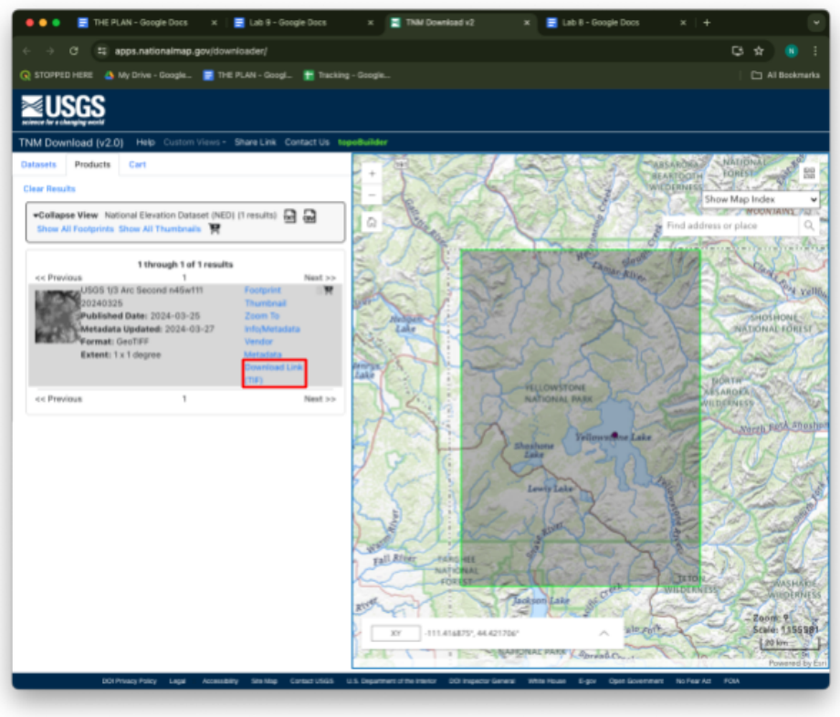

6. Open QGIS and add the raster to a new project  
7. Remember to use the CRS button in the bottom left to change your projection to NAD83 zone 12N (AKA EPSG:26912). In this case, you can do it either before or after you add the raster by dragging the downloaded file onto the map.  
8. Add a basemap like Google Satellite Hybrid, OpenStreetMap, or Google Terrain  
9. Right click on the top toolbar and check the “Processing Toolbox Panel” to open the geoprocessing tools  
10. Search “reclass” and, with the DEM layer selected, double click on “Reclassify by table”  
11. Set the “Raster layer” to your elevation DEM  
12. Click on the ellipses next to “Reclassified raster” and choose “Save to file..” Give the file a name and save it with the rest of your project files.

> [!TIP]
> If the reclassify tool **disappears** after you click save, **check behind your QGIS window**. Tools tend to do this.

13. Click on the ellipses next to “Reclassification table”  
14. Add 2 rows with the following values to reclassify the elevation into 2 categories: above the lake (1) and below the lake (0). Use 2356 meters as the lake elevation (this would be a massive flood).   
    1. Minimum \= 0, Maximum \= 2356, Value \= 0  
    2. Minimum \= 2356, Maximum \= 3500, Value \= 1

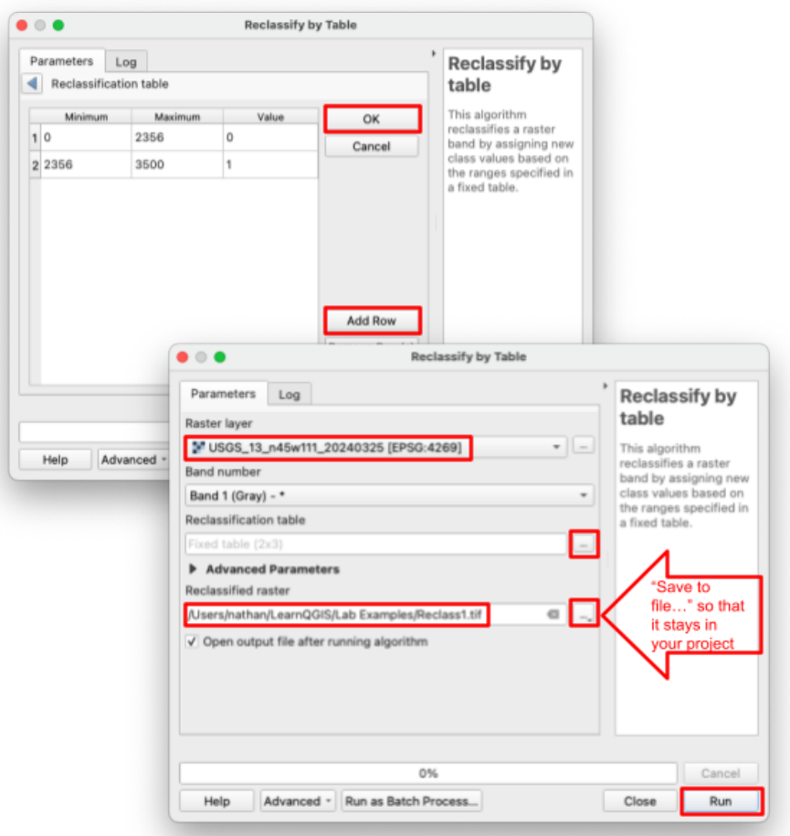

15. Click OK, then hit run. Your map should look something like this: 

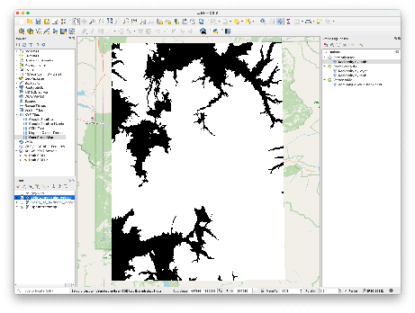

16. Change the symbology as you see fit to symbolize areas of flood risk in a useful way (Hint: use the render type named “Paletted/Unique values”)  
17. Create a map layout. Include all the required cartographic elements including legends, titles, scale bars, neatlines, etc. Export your layout before moving on.  
18. Add context by adding a text box to the layout explaining what this map represents.

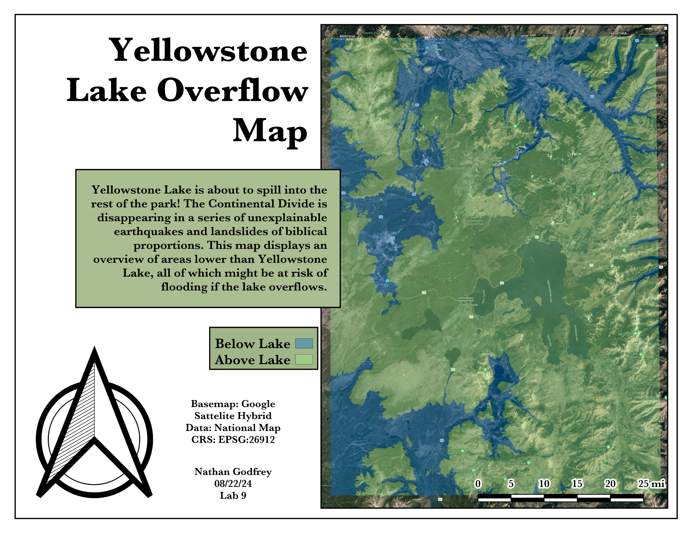

### **Part 2: Noxious Gas**

Old Faithful and some of the surrounding geysers were all contaminated and are about to erupt with noxious gas\! Find any hotels, lodges, or other buildings within a one-kilometer radius of the geysers that need to be evacuated.  
This part is not pure fiction either. When the magnitude 7.3 Hebgen Lake earthquake struck just west of the park in 1959, at least 289 hot springs erupted as geysers within a day, about 160 of them for the first time ever. Details here: https://www.usgs.gov/news/60-years-1959-m73-hebgen-lake-earthquake-its-history-and-effects-yellowstone-region

19. Use Google Maps or other resources to help you find the location of Old Faithful and 3 other geysers. You’ll want them fairly close to each other so that you can see some buildings within the scale of the map.  
20. Use your past lab experience to create a new shapefile layer, and add a point at each of the 4 geysers (use Lab 4 if you get stuck) and give each point a name in the attribute table. Here’s a hint: 

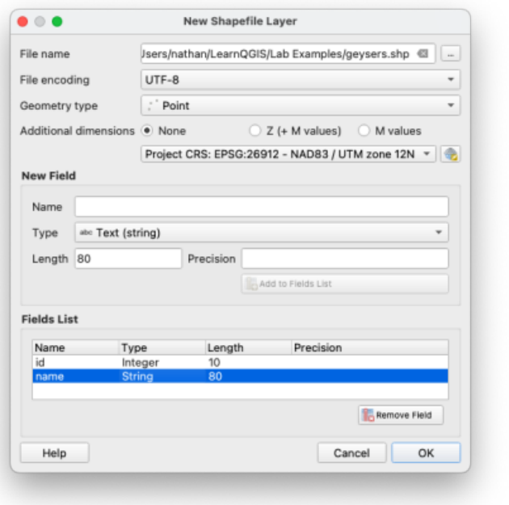

> [!WARNING]
> Make sure to **SAVE** and toggle off edit mode after you’ve added the 4 points.

21. **Once** you have your points, find the “Buffer” tool in the Processing Toolbox.  
22. Set the input layer to your geyser points, distance to 1 km, and “Segments” to 32\.  
23. Check “Dissolve result” so that the resulting shape is combined.  
24. Click the ellipses next to “Buffered” and choose “Save to File” so that your buffer layer isn’t temporary (in case you need to save and come back later). Click run.

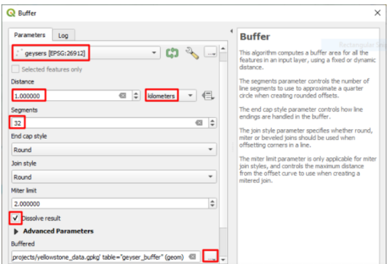

25. Your result should look like this: 

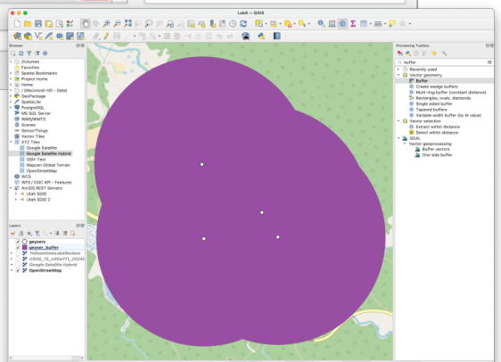

26. Edit the symbology of the points and buffers, and add labels to the points. You can find this in the “Labels” tab next to where you find the symbology options. 

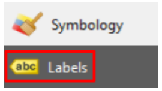

27. Visually explore your map and use the basemap to determine if there are any buildings that need to be evacuated.  
28. Create a second map layout showing your basemap, buffer polygons, and four geysers with readable labels. Include all the appropriate cartographic elements including labels, titles, scale bar, neatline, etc. Add context by adding a text box to the map explaining what this map represents. Export your layout before moving on.

### **Part 3: Search and Rescue**

Experts from the state of Idaho have requested assistance. Since only a small portion of Yellowstone is within Idaho's boundaries, Idaho is only responsible for a very small part of the disaster zone. Fish Creek Road (aka Forest Road 082\) is the highway that ground teams will be searching from, and they will cover anything up to 5km from the road. Helicopters will need to search anything further than that. Find the helicopter search area that is within the National Park, within the State of Idaho, and over 5 kilometers from Fish Creek Road.

*Retrieving the Shapefiles*

29. Go to this page: https://irma.nps.gov/DataStore/Reference/Profile/2224545?lnv=True and download the file labeled “Geodatabase” (Administrative\_Boundaries\_of\_National\_Park\_System\_Units.gdb.zip, about 13 MB). The NPS now publishes this dataset as a geodatabase instead of a shapefile, so don’t panic when you don’t see a .shp file.  
30. Unzip it, then drag the folder ending in “.gdb” onto your QGIS map. It holds a single layer called nps\_boundary with every national park unit in the country, and QGIS reads it just like a shapefile.  
31. Now search the National Map’s “Boundaries” category for a shapefile of the state of Idaho. To do this, use the same method as steps 1-4 but place a point in Idaho before clicking “Search Products.” (You should find “USGS National Boundary Dataset (NBD) in Idaho State or Territory” offered in a few formats — download the Shapefile one.)  
32. Within the downloaded zip folder, find the “Shape” folder and the “GU\_StateOrTerritory.shp” file within it. Add that file to your project.  
33. Go back to the national map website and use the same search method to search for and download the “USGS National Transportation Dataset (NTD) for Idaho” shapefile (again, choose the Shapefile format). It’s under the “Transportation” category. Fair warning: this one is nearly 200 MB, so it may take a few minutes.  
34. Within this next downloaded zip folder, there will again be a “Shape” folder. Find the “Trans\_RoadSegment.shp” layer and add it to your project.  
35. After adding the road segment data to your project, you will need to run the **“Reproject layer”** tool on it in order to do further analysis. In the Processing Toolbox, open the “Reproject Layer” tool.  
36. Select the road layer as the input, and use our standard EPSG:26912 as the Target CRS  
37. Use the ellipses by “Reprojected” to save the reprojected roads with your files, run the tool, and delete the original road layer from your project

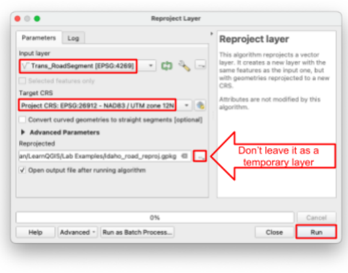

*Selecting the Highways*

38. Open the “Select by attribute” tool in the Processing Toolbox. The road data that we downloaded has a helpful “name” column in the attribute table to select by.  
39. Use these parameters:  
    1. Input layer \= your reprojected roads layer  
    2. Selection attribute \= “name”  
    3. Value \= “FISH CREEK”

*Buffering the Selected Roads*

40. Check the map to see if the yellow selection is a road near Yellowstone National Park, and SAVE your project before going any further. An error in the next steps could crash QGIS, and you don’t want to lose your work if that happens. Also, Idaho has several roads named Fish Creek, so don’t worry if a few selected segments show up far from the park — everything outside the park boundary gets trimmed away in the next steps.  
41. Open the buffer tool. **Check “Selected features only”** and set the distance to 5 kilometers. Set “Segments” to 32, and check the “Dissolve result” box.

> [!WARNING]
> Be **sure** to check the “Selected features only” box in the buffer tool, or QGIS will try to run a buffer on every road in Idaho and probably crash.

42. Click the ellipses under “Buffered” to save your resulting layer to a file (Remember to check behind your QGIS windows if the Buffer tool disappears). Click run, then close the tool.

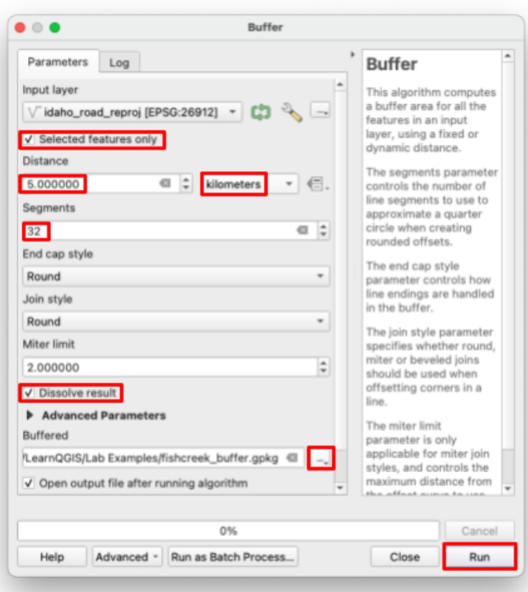

43. Now you have every shape that you need, and your project should now look something like this:

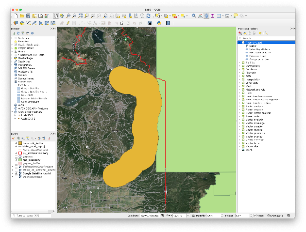

*Processing the Polygons*

44. Start by shaving down the Yellowstone (National Parks) polygon to only the park within Idaho. Search for “clip” in the Processing Toolbox, and open the “Clip” tool under the “Vector overlay” category (a search for “clip” turns up several tools — you want the plain “Clip”).  
45. Set the “Input layer” to the national parks polygon(s), and “Overlay layer” should be the Idaho state boundary polygon.

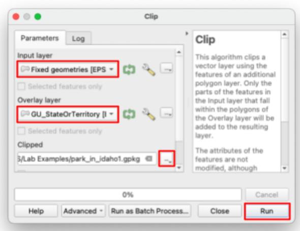

46. You will probably get an error saying that the national parks boundary layer has “invalid geometry”. Run the “Fix geometries” tool on the trouble dataset with all the default settings.  
47. Try running the clip tool again with all the same inputs, except now use the new “Fixed geometries” layer as the “Input Layer”. Zoom to the southwest corner of the park to see your result — the clip also keeps the other NPS units in Idaho, like Craters of the Moon, but you can ignore those.  
48. You should now have a tall, thin polygon like this: 

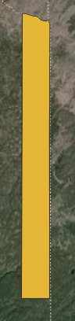

49. Find and open the “Difference” tool. The “Input layer” is your last result (the tall thin polygon that represents the Idaho side of Yellowstone). For the “Overlay layer” use the highway buffer that you made. Name the output file “search\_area” since this will be the final result.

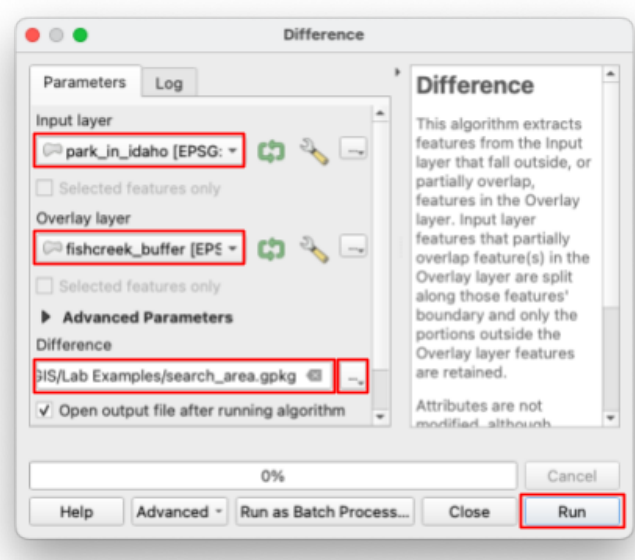

50. Your search area should look something like this: (if the highway isn’t highlighted in yellow that’s okay, it just means that you deselected it at some point)  

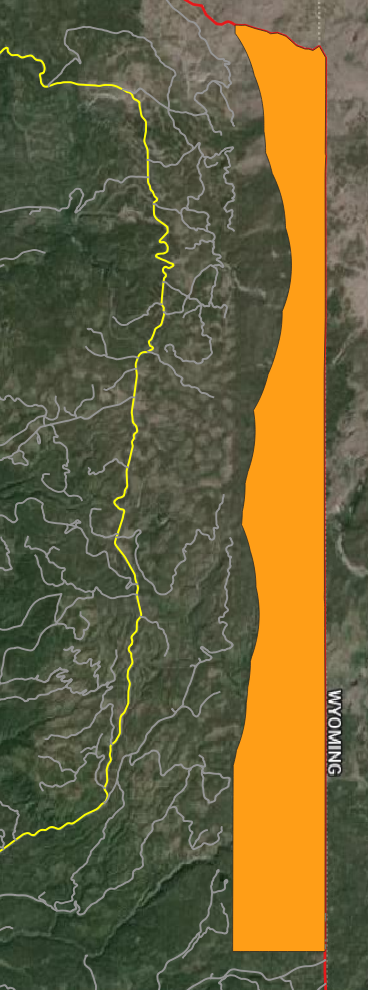

51. Your final map needs Fish Creek Road as its own layer, not just a yellow selection buried in the giant roads layer. Open the “Extract by attribute” tool (it works just like Select by attribute, except it saves the matching features as a new layer) and use the same parameters as before: your reprojected roads layer, the “name” attribute, and the value “FISH CREEK”.  
52. Change the symbology of your results as necessary  
53. Create a third map layout showing the search area, Fish Creek Road, and the Idaho state border. Include all the required cartographic elements including legends, titles, scale bars, neatlines, etc.  
54. Add context by adding a text box to the layout explaining what this map represents.  
55. Export your final layout

## **Deliverables**

Submit a pdf file that contains:

1. Your name, date, class section, and lab assignment number  
2. All three layouts \- each on their own full page  
3. The grading rubric, filled in with your self evaluation

## **Grading Rubric**

The following rubric will be used to evaluate your lab assignment. You should use this as a guide to make sure that you include all the required elements for this lab. Shown under “Score” is the maximum possible points you can receive for each item. 

Sometimes, points are awarded on a "yes or no" basis, giving full points if something is present and none if it is not. Other times, points are given on a scale, depending on how well you complete the task. Please keep this in mind. For example, if there is a written answer required, grading will be based on a scale of points, depending on the quality and completeness of your written answer.

Copy the rubric and paste it into your lab report. Fill in your self evaluation of the rubric, showing how many points you feel you have earned for each item.

| Requirement | Score |
| ----- | ----- |
| Create and include the required map layout for Part 1: Context textbox *(2 pt)* Clearly shows elevations above/below Yellowstone Lake *(5 pts)* Includes all required cartographic elements *(3 pts \- see previous labs for details)* | /10 |
| Create and include the required map layout for Part 2: Context textbox *(1 pt)* Labels *(1 pts)* Clearly shows geysers and their 1km radius *(5 pt)* Includes all required cartographic elements *(3 pts \- see previous labs for details)* | /10 |
| Create and include the required map layout for Part 3: Context textbox *(2 pt)* Clearly shows correct search area, Fish Creek Road, and state borders *(5 pts)* Includes all required cartographic elements *(3 pts \- see previous labs for details)* | /10 |
| **Total** | **/30** |

## **Using AI on This Lab**

AI tools like ChatGPT and Gemini can be genuinely useful on this lab, and you are welcome to use them the right way. This lab has a lot of moving parts: three downloaded datasets, seven geoprocessing tools, and at least one spot where QGIS throws an error at you on purpose. If you get stuck, ask an AI to explain what a tool actually does (why do we dissolve a buffer? what does Difference keep, and what does it throw away?), to decode a cryptic error message like the invalid geometry one in Part 3, or to quiz you on when you would reach for Clip versus Difference. What is not okay: having AI write the text-box explanations on your maps, or asking it to describe results you never actually produced. Your three layouts must come from data you downloaded and processed yourself. If you use AI, say so in your report, and be ready to defend every answer and every map as your own understanding. If you cannot explain it without the chatbot, you are not done learning it yet.
