# Lab 10: Geoplanning — Domes for Mozambique

**Civil and Construction Engineering 114 — Geomatics**

Winter 2026 · Dr. Dan Ames

*Lab assignment developed by Nathan Godfrey and Dr. Ames*

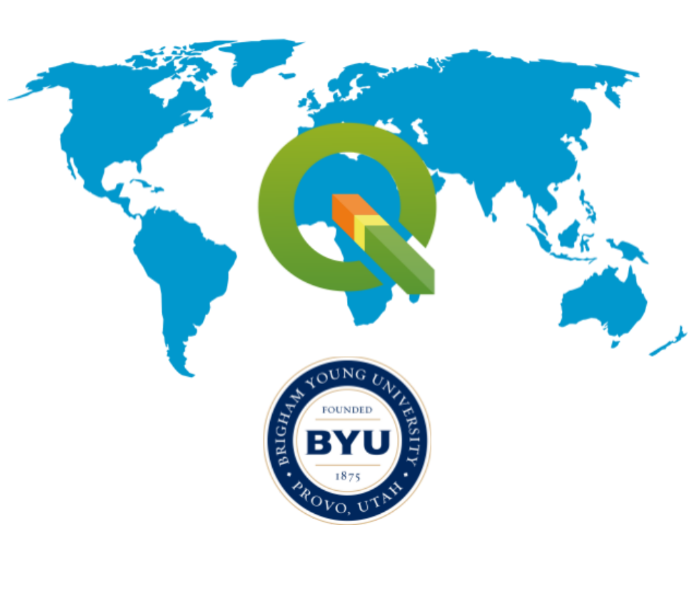

## **Background**

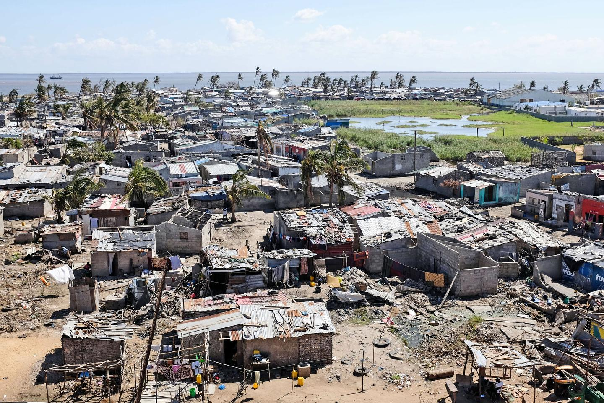  
**Figure 1\.** A view of Beira city, in the aftermath of Cyclone Idai. Photo: Lusa

### **The Storms**

Mozambique is one of the countries most vulnerable to climate change and natural disasters ([IOM](https://www.iom.int/news/tropical-storm-filipo-increasing-displacement-and-humanitarian-needs-mozambique#:~:text=Mozambique%20is%20amongst%20the%20ten%20countries%20that%20are%20most%20vulnerable%20to%20climate%20change%20and%20natural%20hazards.)). They frequently suffer major tropical storms and cyclones, having had 10 hurricane-equivalent storms between 2019 and 2024 (including multiple category 4s). Each new storm destroys thousands – or sometimes tens of thousands – of homes. In 2019, Cyclone Idai left flooding so vast that the water could be seen from space ([CNN](https://www.cnn.com/2019/03/22/africa/cyclone-idai-1-week-later-intl/index.html)). In 2023, Cyclone Freddy was the longest-lasting tropical cyclone ever recorded. It became equivalent to a category 5 hurricane and made landfall in Mozambique not once but twice. Millions of people were affected, and hundreds of thousands of homes were damaged or destroyed ([World Bank](https://blogs.worldbank.org/en/nasikiliza/faster-mozambique-afe-rebuilds-after-cyclones-better-it-limits-their-devastating-impact#:~:text=The%20cyclone%20affected%20a%20staggering,schools%2C%20affecting%20about%20230%2C000%20students.)). More information [here](https://www.thenewhumanitarian.org/analysis/2021/11/1/four-ways-Mozambique-is-adapting-to-the-climate-crisis).  
The World Meteorological Organization has since certified Freddy as the longest-lived tropical cyclone ever recorded: 36 days and nearly 13,000 km, all the way across the Indian Ocean from Australia to Mozambique (https://wmo.int/news/media-centre/tropical-cyclone-freddy-longest-tropical-cyclone-record-36-days-wmo). And the storms keep coming. In a single season between December 2024 and March 2025, three more cyclones (Chido, Dikeledi, and Jude) struck Mozambique, affecting about 1.4 million people (https://www.unocha.org/publications/report/mozambique/mozambique-2025-tropical-cyclones-chido-dikeledi-and-jude-humanitarian-response-31-may-2025).

A past TA, Nathan Godfrey, shares this personal note on Mozambique: 

“I lived there for two years, traveling the country and experiencing both urban and rural areas. In most parts of the country, a family is lucky if they can afford to build their house from concrete blocks (less than ⅓ of families end up in concrete housing). In many neighborhoods, having enough money to paint your concrete home just one time is synonymous with wealth, which most never achieve. I was taught how to build and maintain woven stick-and-mud houses, and saw many more built from even less sturdy materials. Due to a lack of access to stronger construction methods, families that I became friends with have had their homes collapse or wash away in recent storms. I’ve seen firsthand that housing is an insurmountable issue to many Mozambicans during and after these disasters.”

### **Humanitarian Projects \- Domes for the World**

A 2017 population and housing census found that over 50% of Mozambican homes are “palhotas” or huts with roofs made of thatch or palm fronds. Another 44% of roofs are made from thin sheet metal. As for walls, 22% of Mozambican homes are made from “pau a pique,” which is a woven stick-and-mud method, and another 13% are made from reeds, sticks, bamboo, and palm fronds ([Instituto Nacional de Estatística](https://www.ine.gov.mz/web/guest/censo-2017/-/document_library/pfpz/view/44355?_com_liferay_document_library_web_portlet_DLPortlet_INSTANCE_pfpz_redirect=https%3A%2F%2Fwww.ine.gov.mz%2Fweb%2Fguest%2Fcenso-2017%3Fp_p_id%3Dcom_liferay_document_library_web_portlet_DLPortlet_INSTANCE_pfpz%26p_p_lifecycle%3D0%26p_p_state%3Dnormal%26p_p_mode%3Dview)). While sturdy construction techniques for these materials do exist, after a cyclone, many homes made from these are found to…no longer exist.

With 2 out of every 3 Mozambicans living below the national poverty line (62.9% of the population as of 2022\), the country of Mozambique is heavily reliant on foreign aid and humanitarian organizations to help address this problem ([World Bank](https://www.worldbank.org/en/country/mozambique/overview#:~:text=The%20national%20poverty%20rate%20surged,in%20poverty%20in%20urban%20areas.)). One such organization is Domes for the World (DFTW). Although DFTW hasn’t planned any projects in Mozambique yet, they’ve created dome communities in Ethiopia, Haiti, Indonesia, India, and Sri Lanka. Using a simple and relatively cheap process, DFTW provides safe, sustainable, and maintainable shelter while training locals in their construction techniques and sourcing materials locally. View an interesting video showing dome construction in Ngelepen, Indonesia: [https://www.youtube.com/watch?v=x1ao3SbEiY0](https://www.youtube.com/watch?v=x1ao3SbEiY0).  You can explore [New Ngelepen here](https://www.google.com/maps/@-7.8133188,110.5027392,372m/data=!3m1!1e3?entry=ttu&g_ep=EgoyMDI0MTExMC4wIKXMDSoASAFQAw%3D%3D).  
By the way, the village in that video was DFTW’s first big project: 71 dome homes, plus a mosque, a medical clinic, and a kindergarten (https://www.monolithic.org/press-releases/may-2007-dftw-completes-first-major-project-71-homes-in-indonesia). Sound familiar? That’s nearly the same program you’re about to plan yourself.

### **BYU’s Opportunities**

Professor Andrew South (of the CCE department here at BYU) is actively involved in DFTW. Thanks to him and other professors and students in the department, you have opportunities to learn more about sustainable solutions at BYU. Opportunities include:

1. Multiple courses, such as CCE 102 *Sustainable Infrastructure*, CFM 333 *Sustainable Design and Architecture*, and CFM 580 *Sustainable Community Development*, and more  
2. Multiple [study abroad programs](https://kennedy.byu.edu/find-your-program), including Dr. Ames’s own *International Water Resources and Sustainability*  
3. The [Sustainability Lab](https://sustainabilitylab.byu.edu/about-the-sustainability-lab), which uses GIS (among other techniques) to address some of society’s complex challenges at the intersection of the built environment, natural environment, and human-social environment. Learn more about BYU’s own triple dome home: [https://news.byu.edu/byu-student-built-solar-powered-triple-dome-home-makes-cut-for-parade-of-homes](https://news.byu.edu/byu-student-built-solar-powered-triple-dome-home-makes-cut-for-parade-of-homes)   
4. The [Hydroinformatics Lab](https://hydroinformatics.byu.edu/), which uses advanced GIS to do research in flood forecasting and hydroinformatics

## **Problem Statement**

You are in charge of planning a large DFTW project in Mozambique. You’ll need to design a community with the following items:

- [ ] 80 homes (each 8 meters in diameter)  
- [ ] 1 of each: a church, mosque, and a school (each 20 meters in diameter)  
- [ ] Open space for a market (at least 4000 m², any shape)  
- [ ] A single recreational area large enough to fit 2-4 football fields (not American football)

The area has a history of flooding, which you’ll need to account for by using some simple GIS tools. You will also need to plan for paths/roads, and some protection of the existing natural environment.

> [!TIP]
> TA Note: A study abroad is some of the **cheapest and most fun** travel you’ll ever have, and is good for your resume too. Keep an eye out for them and **plan on doing one\!**

Have you ever questioned how realistic these labs are? Well, here’s a project that an organization called Reall has done in the past few years ([link](https://reall.net/data-dashboard/mozambique/inhamizua-phase-2/)). It’s a similar idea to this DFTW lab, and was built on a similar site about 5 miles down the street from our chosen location.

## **Learning Objectives**

* Repeat skills from the previous labs  
* Learn how to edit and move polygons  
* Learn how to measure and plan on a project site in GIS  
* Develop site/situational awareness skills  
* Utilize learned skills in a practical application of GIS planning  
* Utilize learned GIS principles to consider project impacts and sustainability

## **Software and Data**

* For this lab, we will use the GIS software application, QGIS (also known as Quantum GIS). This is a free/open source GIS package that runs on Windows, Mac, and Linux operating systems. The software is pre-installed in the Clyde Building 234 computer lab. You can also download it and install it on your own computer from this website: [https://www.qgis.org/](https://www.qgis.org/). We will be using this version throughout the course: *“Long Term Version 3.44 (LTR)”.*   
* There are custom data downloads for this lab. Follow the instructions to download data from Learning Suite. There is also data from the Mozambique Instituto Nacional de Estatistica (INE), also posted on Learning Suite for convenience.  
* Imagery from Google will also be used as a base layer. 

**REVIEW THE deliverables section at the end of the document before continuing. You should always do this before starting any of your labs. It will help you make sense of the lab and not waste time.**

## **Instructions:**

### **Selecting a New CRS**

1. Open a new project in QGIS  
2. Apply the Google Satellite Hybrid basemap   
3. Locate and zoom to the country of Mozambique  
4. Open the “Project Properties” menu and change the CRS to **EPSG:2736, “Tete / UTM zone 36S”** 

> [!NOTE]
> Notice that this is also a **UTM zone projection**, like the one that we’ve been using for Utah. This one is **centered near Mozambique**, and gives us less distortion there. Zoom out for a second, and reflect on which locations and purposes this projection might not be useful for. *Is it a good projection for global navigation? Would it be useful for measurements in Provo? Does it give a good representation of the relative sizes of countries?*

### **The Context**

5. Copy these coordinates (694911.607, 7815141.831) and paste them into the “Coordinate” textbox at the bottom of the main QGIS window  
6. Use the “Scale” dropdown next to it to zoom to a 1:1000 scale  
7. Welcome to the Manga Chapel\! Manga means mango in Portuguese, and it’s the town’s name. This building is a stake center for the Church of Jesus Christ of Latter-day Saints. Now, zoom out slowly and observe the area. Consider the structures nearby and the large-scale geographic features near this city. Note the proximity of the ocean and the large river delta that make the area a prime candidate for massive floods. The west side of this bay, as seen in the image below, is where flooding from Idai was at its worst.

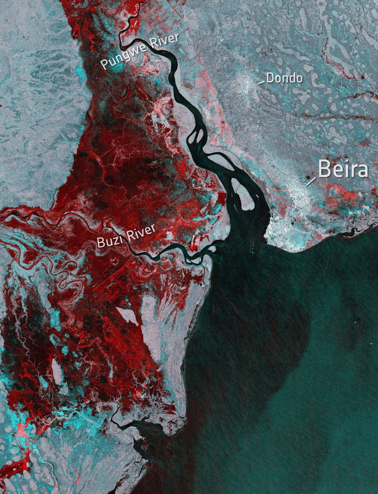

**Figure 2\.** Satellite imagery showing where the flooding after Idai can be seen from space (areas in red are flooded), March 19, 2019 \- European Space Agency

8. Open the following link and download the PDF by clicking on “Download Map”:  
   1. [https://reliefweb.int/map/mozambique/mozambique-beira-city-chingussura-structural-damage-construction-typology-26-march](https://reliefweb.int/map/mozambique/mozambique-beira-city-chingussura-structural-damage-construction-typology-26-march)  
9. Open the PDF. Each red square on this map layout represents a structure that was damaged by Cyclone Idai in 2019\. The Manga chapel is located just left of the number “3” and you can see that parts of the roof are missing. Notice how this map layout includes all the cartographic elements that we require in this class? You’ll even do a locator map in this lab, like the ones they have on the right side.

### **The Site**

10. Now download the zip folder from Learning Suite, unzip it, and add the “project\_boundary1” file to the map.  
11. Right-click on the boundary layer in the Layers Panel, and select “Zoom to Layer(s)”. Our site is about 2.5 km NNE of the Manga Chapel.  
12. There are a couple of things to consider before we start laying out the plans for this community. First, visually inspect the area. Write your answers to the following questions:  
    1. Is there any human activity already taking place in the area? Or is it just wild, natural land? Zoom in. Are there any structures or farmland that might have to be bought or moved?  
13. Visually identify the canals that outline the property, and the one bisecting it in the middle.  
14. Create a new polyline layer, and digitize a rough centerline down each of the canals (Hint: you’ll need to use the following buttons from your toolbar. Look back at earlier labs if you need to, and don’t forget that you can right-click to stop drawing a line/polygon.)   

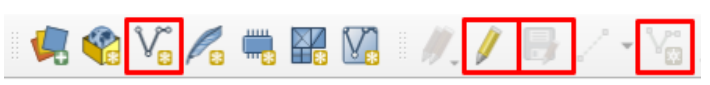

> [!WARNING]
> Remember to press the **“Save Layer Edits”** button after you draw the vector data\!

15. Heads up: whenever you create a new layer in this lab, make sure its CRS is set to EPSG:2736 (matching the project). If a layer sneaks in as WGS 84 (EPSG:4326), your buffer distances will come out in degrees instead of meters and nothing will look right.  
16. Use the buffer tool to create a 25m buffer of the canals. We’ll consider this our flood hazard zone, with room for some flood control measures to be constructed. Call the buffer layer “flood\_hazard”  

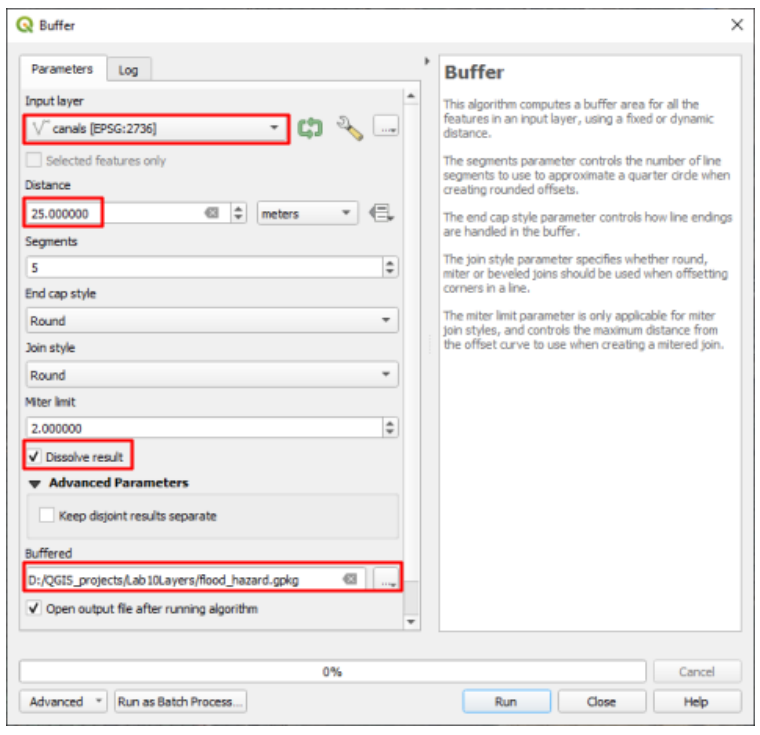

> [!WARNING]
> Remember to **save your buffers as files.** Don’t use temporary layers here, they won’t save.

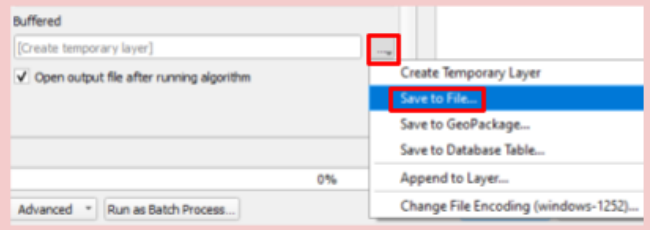

17. Next, create a new point layer  
18. As ethical engineers, it is important to preserve the natural environment where possible. Most of this land was developed for farming, but some nature remains between plots, which you want to preserve. Create 15 points on top of large trees or clusters of vegetation. Choose any trees you wish within the project site boundaries.  
19. Consider these ecologically significant; you cannot pave over or build on them. To illustrate this, create a 15m buffer around these points and name the buffer layer “protected\_areas”  
20. Your site might now look approximately like this:

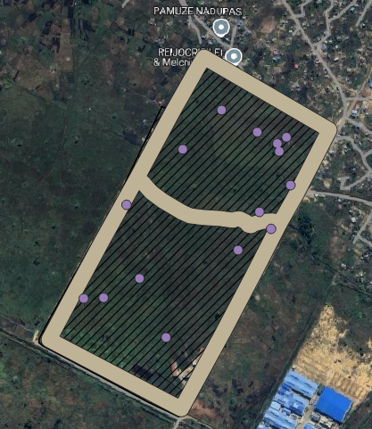

### **(Geo)Planning**

Homes:

21. Create another point layer; we’ll use this one to place 80 homes. You have plenty of space, so don’t worry about squeezing everything into a corner. Keep in mind 3 things while you place the homes around the site:  
    1. Each home will need a space 8m in diameter (you’ll create an 8m buffer around each that cannot overlap)  
    2. Avoid flood hazard zones and protected nature areas  
    3. You’ll also need space for 3 large structures, roads, a recreational area, and a market. Re-read the space requirements in the Problem Statement if needed. (You can create these in any order you wish, if it would be easier for you.)  
22. Now buffer these points at a distance that will create a circle with a diameter of 8m (Hint: think about what the buffer tool does with the distance that you input).  
    1. Name it “homes\_buffer”  
    2. Do not check the “Dissolve result” box \- we want to be able to move some if needed.  
    3. Raise the “segments” value to 20 to output more circular circles  

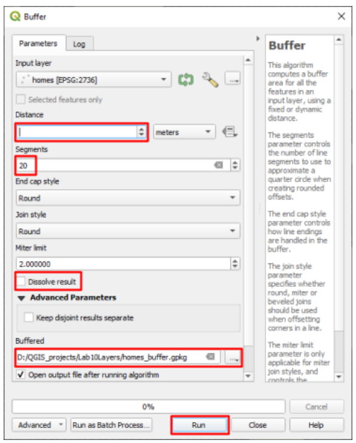

23. To move features, activate and use the “Advanced Digitizing Toolbar” (see Lab 4, steps 14-17)

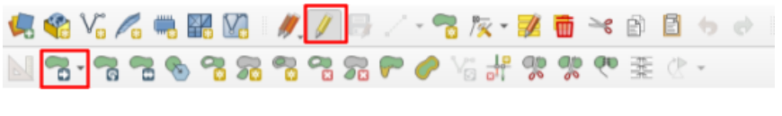

Large Structures:

24. Create another point layer. This time, add a new field either upon creating the layer (see image below), or by editing its Attribute Table.  

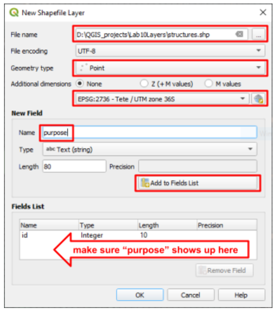

25. Name the attribute field “purpose” and as you place each point, fill in the “purpose” with either church, mosque, or school (see image below, or edit the attribute table)  

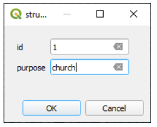

26. Once all 3 structures are in place, buffer them to create circles with a diameter of 20 meters. Like the homes, raise the “Segments” to 20 and do not check “dissolve result”.  
    
Roads:

27. Create a new polyline layer, and digitize a rough centerline of each road you’d like to plan. Keep in mind:  
    1. All homes and large structures must have close access to at least one road  
    2. All roads must eventually connect to the existing intersection at the southernmost corner of the project boundary (this can be via the existing roads on the edges of the project boundary)  
    3. Roads can cross flood hazard zones, but may not cross protected nature areas  
28. Buffer this road layer at the proper distance to create roads that are 12m across

Recreational Area

29. Use the internet to find the dimensions of a soccer field  
30. Use the line and area measurement tools (in the top toolbar) to determine an area where 2-4 soccer fields will fit. This will be the recreational area. It can be any size/shape as long as it fits 2-4 soccer fields. (Knowing Mozambicans, this recreational area will get 90% of its use from soccer. That’s why we’re determining the space based on it.)  
31. Create a new polygon layer, and draw a polygon that encompasses this area  
    1. No buffer is needed here  
    2. You may use flood hazard zones for this space

Open Air Market

32. Use the area measurement tool again to find an area for an open-air market of at least 4000 m². These markets are made up of various stalls and stands, and they’re a daily source of food and income for many Mozambicans. Because of their flexible layout, it can be any shape as long as there’s enough space and access from the road(s).  
33. Create a new polygon layer, and draw a polygon that encompasses this area. No buffer is needed here.  
34. Before moving on, add any additional roads and adjust the plan if needed. Your plan should now include all of the elements in the problem statement, similar to this image:

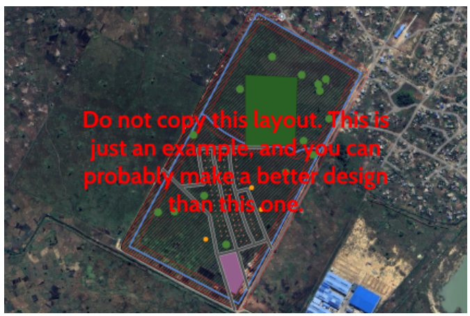

### **Labels, Symbology, and Layouts**

35. Add appropriate labels to the market, recreation area, church, mosque, and school.  
    1. Unless you did so upon creating the layer, you’ll need to open the attribute table and add a new field for each location that you need to label.

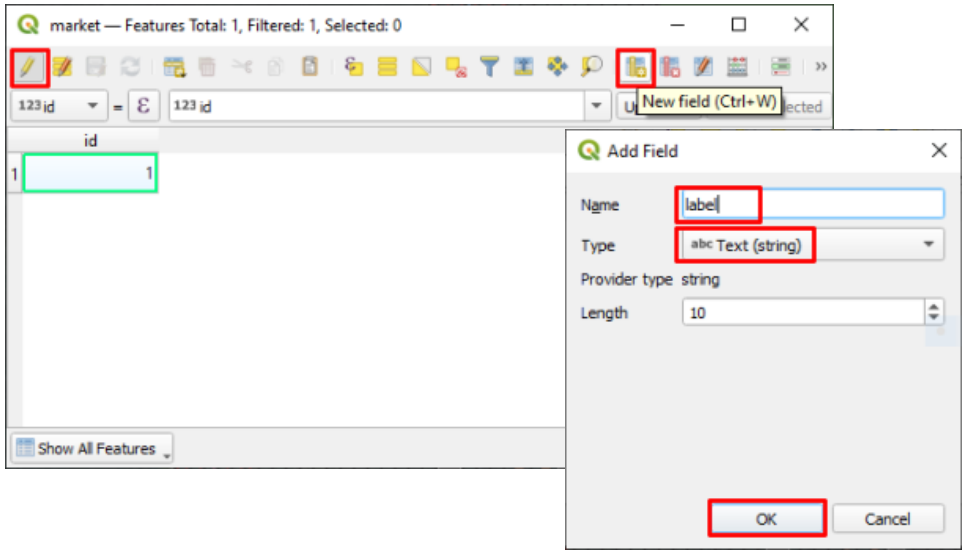

36. Change the symbology for each layer as you feel appropriate and useful  
37. Create a new map layout that includes all required map elements. Leave room for a locator map on the page.  
38. To save space, rotate the main map view by adjusting the “Map rotation” in the Item Properties Panel  

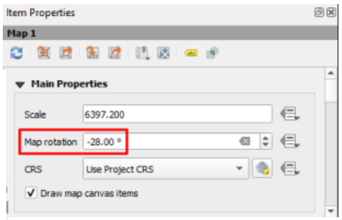

39. Once your layout is set up, select the map and check the “Lock Layers” and “Lock styles for layers” boxes in the Layers Panel (see the image below)  

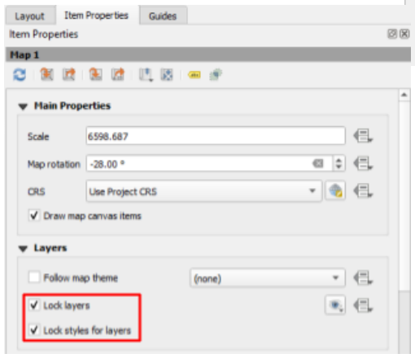

40. Return to the main window and uncheck all of your layers besides the project boundary  
41. Use the same attribute table method to create a label titled “Manga Project” on the project site boundary  
42. Add the second zip folder from Learning Suite, titled “moz\_adm” to the project. Right-click on the moz\_adm layer in the Layers Panel and click “Zoom to Layer(s)”  
43. Your main QGIS window should now only show the province borders of Mozambique and a label pointing to the location of our project (see the image below)  

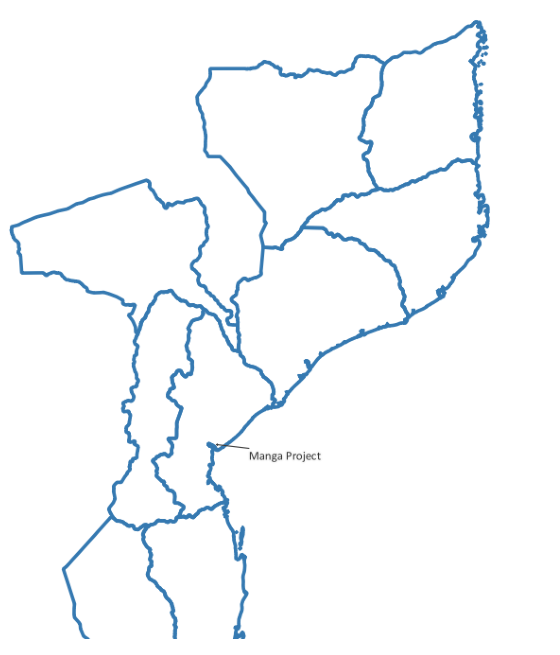

44. Now return to your layout and add a new map. This should become your inset/locator map.  
45. Your layout should now look somewhat like the image below. Keep it neat and professional.

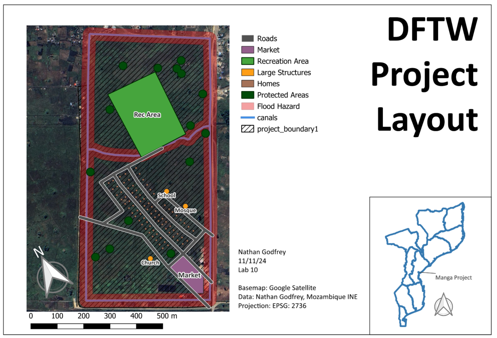

### **Final Discussion Questions**

46. Write your answers to the following questions:  
    1. What additional geospatial data/info would help you with this project if you were actually doing it? What potential sources are there for this data?  
    2. Are there any existing structures that will need to be removed? What impact might our new project have on anyone currently using the property, and what do you think should be done about them?  
    3. What is the total surface area of your roads? (There are multiple ways to find this) Roads take a certain amount of money and maintenance for each square meter, so how does the sustainability of your road design compare to the example above?  
    4. Why do you think the recreational area can include flood hazard space, when none of the other layers can? Are there other sustainable uses of flood-prone space that you can think of? (Think of what it’s already being used for)  
47. Write a brief reflection on this assignment and consider how you, as a BYU CCE graduate, can make a difference in the world using these kinds of tools.

## **Deliverables**

Submit a PDF file that contains:

1. Your exported layout (a full page), complete with all cartographic elements and the locator map  
2. Your responses to the questions from step 12 and the final discussion questions  
3. The grading rubric, filled in with your self-evaluation

## **Grading Rubric**

The following rubric will be used to evaluate your lab assignment. You should use this as a guide to make sure that you include all the required elements for this lab. Shown under “Score” is the maximum possible points you can receive for each item. 

Sometimes, points are awarded on a “yes or no” basis, giving full points if something is present and none if it is not. Other times, points are given on a scale, depending on how well you complete the task. Please keep this in mind. For example, if there is a written answer required, grading will be based on a scale of points, depending on the quality and completeness of your written answer.

Copy the rubric and paste it into your lab report. Fill in your self-evaluation of the rubric, showing how many points you feel you have earned for each item.

| Requirement | Score |
| ----- | ----- |
| Create and include the required map layout: Includes all required site elements, with clear symbology *(14 pts)* Labels for the rec area, market, church, mosque, and school *(1 pt)* Locator map, with its own separate north arrow *(2 pts)* Includes all required cartographic elements *(3 pts)* | /20 |
| Provide complete, thoughtful, and correct answers to the questions given in the lab instructions: Questions from Step \#12 \- The Site *(5 pts)* Final Discussion Questions *(5 pts)* | /10 |
| **Total** | **/30** |

## **Using AI on This Lab**

AI tools like ChatGPT and Gemini can be genuinely useful in this lab if you use them the right way. Good uses: asking why a buffer distance of 4 m gives you an 8 m circle, decoding a cryptic QGIS error, figuring out why your buffer came out as a giant blob covering half of Africa (hint: check your layer’s CRS), or quizzing yourself on what a locator map needs before you build one. What is not okay: having AI write your answers to the site-assessment or discussion questions, or inventing measurements, road areas, or screenshots you did not actually produce in QGIS. The planning judgments here (where the homes go, how the roads connect, what happens to the people already farming this land) are the whole point of the lab, and they have to be yours. If you do use AI, say so in your report, and be ready to explain and defend every answer as your own understanding.

* Good: "QGIS says 'invalid geometry' when I run the buffer tool. What does that mean and how do I fix it?"  
* Good: "Explain what a CRS is like I’m new to GIS, and why EPSG:2736 fits Mozambique."  
* Not okay: pasting the discussion questions in and copying out the answers.
