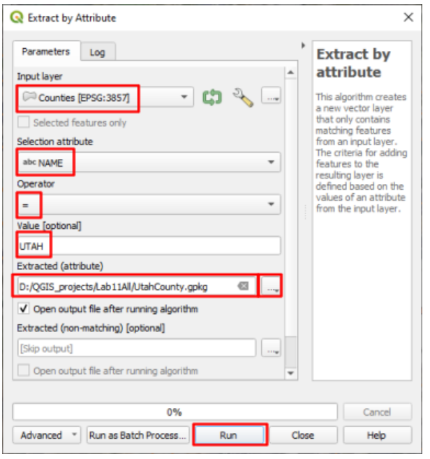
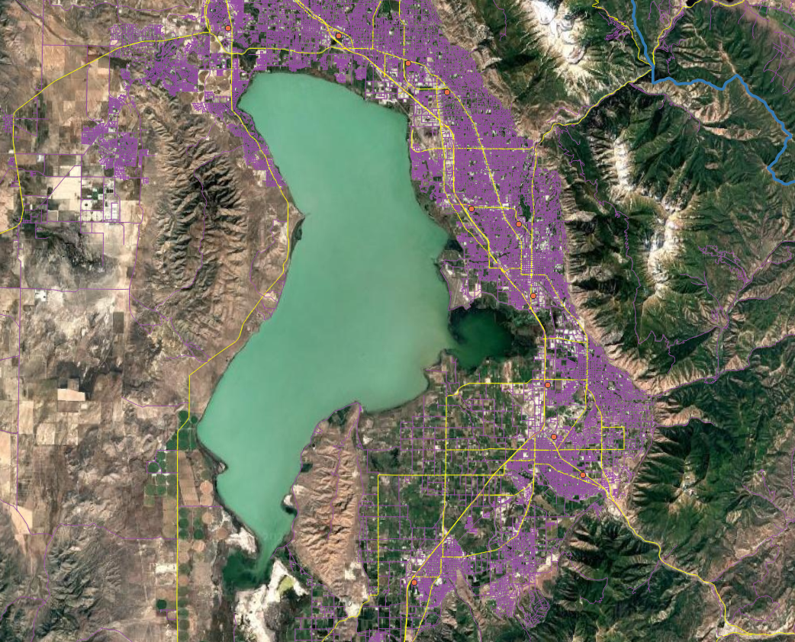
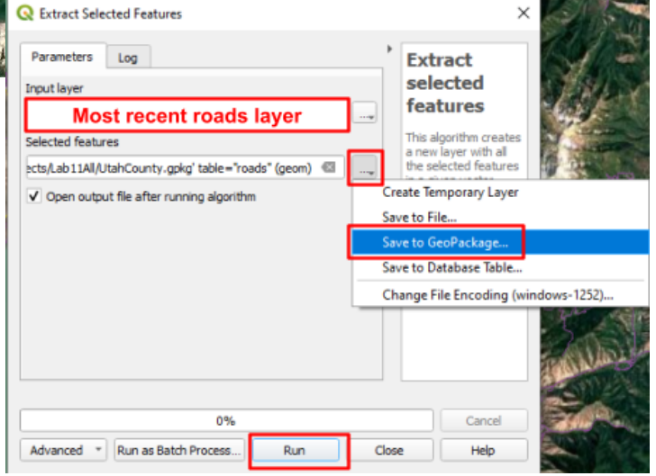
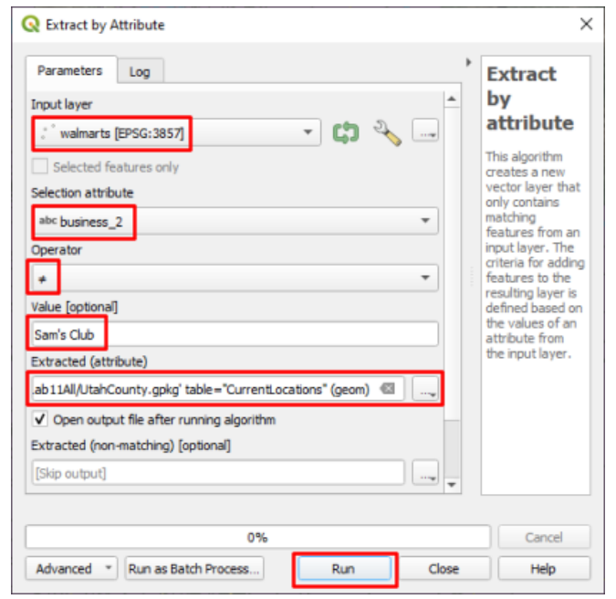
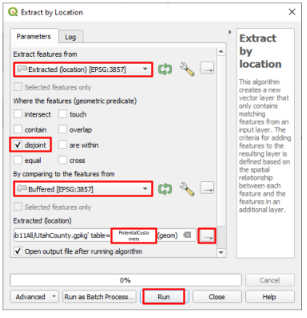
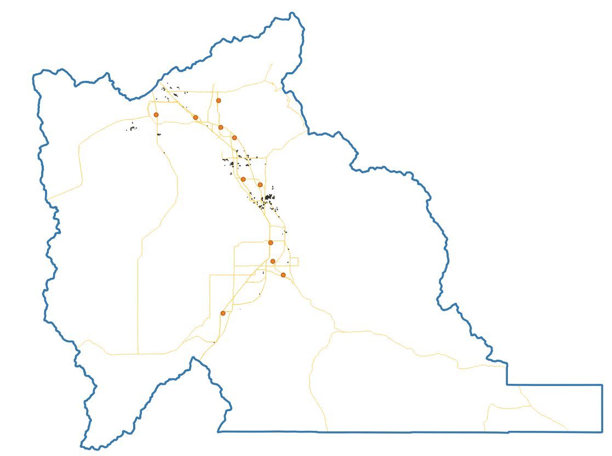

# Lab 11: Workflows — Walmart Site Selection

**Civil and Construction Engineering 114 — Geomatics**

Winter 2026 · Dr. Dan Ames

*Lab assignment developed by Nathan Godfrey and Dr. Ames*

## **Background**

When expanding into new areas, companies like Walmart employ Geographic Information Systems (GIS) to identify optimal locations for new stores. This process involves gathering and analyzing data layers that represent critical site selection criteria, such as demographics, accessibility, and competition. By leveraging spatial analysis tools, businesses can combine these layers to evaluate potential sites and create maps that highlight the most suitable locations based on predefined priorities. Choosing a store location involves a meticulous balancing act, considering various factors that can be broadly categorized into:

* Market Factors: Demographics, income levels, competitor analysis, shopping patterns.  
* Site Suitability: Land availability, zoning regulations, accessibility (roads, highways), infrastructure (utilities).

Why GIS? Major corporations like Walmart rely on Geographic Information Systems (GIS) to make informed decisions for various aspects of their business, including expansion. GIS allows us to analyze and visualize vast amounts of spatial data, providing valuable insights into factors like demographics, competition, and accessibility. There are even some GIS programs built specifically for business decisions like this, such as [ArcGIS Business Analyst](https://www.esri.com/en-us/arcgis/products/arcgis-business-analyst/overview), and many sales/marketing softwares include GIS analysis options.  
And the approach works: about 90% of Americans now live within 10 miles of a Walmart, a footprint the company leans on to compete with Amazon on fast delivery (see https://fortune.com/2026/05/16/walmarts-upper-hand-over-amazon-in-the-1-trillion-e-commerce-race-90-of-americans-live-within-10-miles-of-a-superstore/). In this lab you get to try the same kind of analysis for yourself.

## **Problem Statement**

As a site selection specialist at Walmart, you're tasked with finding the optimal location for a new store in Utah County, Utah. This decision plays a crucial role in Walmart's mission of providing convenient access to affordable products for its customers.  
Utah County is a good place to practice. Utah was the fastest-growing state in the nation from 2010 to 2020 (https://www.census.gov/library/stories/state-by-state/utah.html), and Utah County leads the state's growth, with 659,399 residents counted in the 2020 Census. Fun fact: the census blocks you download in this lab add up to exactly that number, so you can check the count yourself.

For the purposes of this exercise, we will arbitrarily limit the factors with which you are concerned to the following:

* Proximity to other Walmart locations: You are to find locations at least 2 miles away from any existing Walmart.  
* Proximity to major roads: Specifically, you are to find locations that are within 2 miles of the I-15 freeway or a highway.  
* Population Density: Optimally, the new Walmart should be located in a high-density population area. Using [2020 Census data](https://opendata.gis.utah.gov/datasets/2caf01e704614114868a3d801b82def6/about), ensure that your new Walmart is located in an area with over 5000 people per square mile.

You’ll also save all of your data layers for this project in a GeoPackage.

## **Learning Objectives**

* Repeat skills from previous labs  
* Learn to create and use a GeoPackage  
* Learn to use the tools in QGIS to perform various operations on vector data  
* Learn practical evaluation of factors at play in site selection  
* Apply GIS principles to real-world business scenario, contributing to strategic planning and community development

## **Software and Data**

* For this lab we will use the GIS software application, QGIS (also known as Quantum GIS). This is a free/open source GIS package that runs on Windows, Mac, and Linux operating systems. The software is pre-installed in the Clyde Building 234 computer lab. You can also download it and install it on your own computer from this website: [https://www.qgis.org/](https://www.qgis.org/). We will be using this version throughout the course: *“Long Term Version 3.44 (LTR)”.*   
* There are no custom data downloads for this lab. Follow the instructions to download data from  
  * The State of Utah GIS web site: [https://gis.utah.gov/products/sgid/](https://gis.utah.gov/products/sgid/)  
  * And the Walmart Open Data Hub on ArcGIS: [link](https://walmart-open-data-walmarttech.opendata.arcgis.com/datasets/39ce1c357bd2424ca481db84aed29464_0/explore?location=40.219229%2C-111.585158%2C10.61)  
* Imagery from Google will also be used as a base layer. 

**REVIEW THE deliverables section at the end of the document before continuing. You should always do this before starting any of your labs. It will help you make sense of the lab and not waste time.**

## **Instructions**

### **Workflow Diagram**

1. As you work through this lab, create a workflow diagram that shows the exact steps you took to complete this lab. Your workflow should be detailed enough that someone else could replicate your work with just your workflow. This includes every dataset and every step (aka tool) that you use.  
   1. You’re welcome to do this on paper or find a convenient computer program, as long as it is legible (no tiny unreadable text) when you turn it in with your lab.

### **Add the Data**

2. Open a new QGIS project and set the XYZ base layer to the “Google Satellite” layer (not the “Satellite Hybrid” imagery)  
3. Change the CRS to EPSG: 26912, our usual CRS for Utah  
4. Use the Data Source Manager to connect to the Utah SGID web service via “ArcGIS REST Servers”. Look back at Lab 6, steps \#9-15 if you don’t remember how to do this. It may also still be connected if you are on the same computer that you used for Lab 6\.  
5. Add the UtahCountyBoundaries layer (not the similarly named Utah\_County\_Boundaries) to the map, using the web service connection.   
   1. If the ArcGIS REST servers aren't working, go to the Utah SGID website to download instead.  

> [!WARNING]
> **We will not be using the web service to access the larger datasets**, even though it is possible. There's over 400,000 lines in just the roads dataset, and **tools take much longer to run on files that aren't located locally** on your computer. If you're using tools on large datasets, sometimes it can be beneficial to download a large dataset and save the time.

6. Go to the UGRC website (gis.utah.gov). Find and **download** the same “Utah Roads” dataset that we used in Lab 2 (see step 11), and another one in the Demographics category called “Census 2020 Blocks”  
   1. If the shapefile download isn’t working, use the “File Geodatabase” instead and treat it like a shapefile  
7. Follow this [link](https://walmart-open-data-walmarttech.opendata.arcgis.com/datasets/39ce1c357bd2424ca481db84aed29464_0/explore?location=40.218329%2C-111.585158%2C10.61) to the Walmart Open Data Hub and download the shapefile of their store locations. Add it to the map too. This is Walmart’s own public data \- every operating US store and Sam’s Club, about 5,200 points, kept current by the company.

### **Build a GeoPackage**

8. Open the Processing Toolbox Panel and find the “Extract by Attribute” tool  
9. Open it, and use this tool to extract the borders of Utah County to a new layer called, “UtahCounty”  
   1. Under the “Extracted (attribute)” option, choose “Save to File…” and name the file “UtahCounty”  

10. This new layer just saved as a “.gpkg” file. This is a GeoPackage, and you can store multiple layers within one GeoPackage. (If you have used Esri software, this plays the same role as a geodatabase \- GeoPackage is the open format that works everywhere.) For all the rest of the layers that we create in this lab, store them here in this same UtahCounty GeoPackage unless otherwise stated.  
11. Remove the County Boundaries layer from your map and change the symbology of your new layer to an outline with no fill  
12. Select the Roads layer and open the “Clip” tool under “Vector Overlay”, not the clip tool under “Point cloud data management”. With the input layer as the roads layer, and the “Overlay layer” set to your Utah County layer, run the tool. It does not matter if you save the output to the GeoPackage or create a temporary layer for this step.  
13. Repeat step 12 with the Walmart locations layer  
14. Select your clipped roads layer and open the “Select by Attribute” tool. Use this tool to select all roads with a “CARTOCODE” value of 1-5 (Hint: Use the “Modify current selection by” dropdown, and some combination of the AND/OR/NOT logic that we learned in class. One warning: CARTOCODE is stored as text, not as a number, so a “between 1 and 5” comparison will also catch codes like 11 \- match each value individually.) It should have the same roads selected as the following image (roads in yellow):  

15. With these roads selected, open the “Extract selected features” tool, and use it to create a new layer from them. Be sure to save it to the same “UtahCounty.gpkg” GeoPackage. (See image below)  

16. Remove the full Utah Roads dataset from your project  
17. The Census Blocks 2020 dataset may have geometry errors in it, so run the tool called “Fix Geometries” on it. It does not matter if you save the output or create a temporary layer.  
18. Select your fixed Census Block dataset, and open the “Extract by Location” tool. Use this to create a new layer that contains the census blocks that intersect Utah County. (To see what each **option** does, use [this helpful page](https://docs.qgis.org/3.44/en/docs/user_manual/processing_algs/qgis/vectorselection.html#extract-by-location))  
    1. “Extract features from”: your census layer  
    2. “By comparing…”: UtahCounty  
    3. Select the proper checkbox from the list  
    4. save it to the same “UtahCounty.gpkg” GeoPackage  

> [!TIP]
> **There are many ways to use the Extract by Location tool.** Each checkbox (intersect, touch, contain, etc...) will return different results, so be aware of which one(s) you need to use.

19. Remove any other census blocks layers from your project besides the output  
20. Next, our Walmart dataset also has Sam’s Club locations and we don’t want them included in our work. Use the “Extract by Attribute” tool on your most recent Walmart locations layer to create a new layer with all the points that are not Sam’s Club locations. (Hint: see image) Save this to the same “UtahCounty.gpkg” GeoPackage.  

21. Remove any other Walmart locations layers from your project, just keeping your most recent output. You should now only have 4 vector layers \- store locations, freeway/highways, census blocks, and the boundaries of Utah County.

### **Analysis**

22. In the new census block layer, you will need to create a new attribute table column called “Density” and calculate it as the population divided by the area. To do this, open the layer’s attribute table, toggle editing mode on, and click the “Open Field Calculator” button.  
    1. Create a new field: TRUE (checkbox)  
    2. Output field name: Density  
    3. Output field type: Decimal number  
    4. Expression: “PP\_TOTAL / $area \* 2589988” \- This is the mathematical expression to divide the PP\_TOTAL field by the area, and multiply by the conversion factor of the default square meters to square miles. This results in a population density per square mile for each polygon.  
23. Save the edits, and toggle the editing tool off. You can check the last column in the attribute table to ensure that it worked properly.  
24. Use the Extract by Attribute tool to create a new layer that only contains the census blocks with a population density over 5000 people/mile². Be sure to save this new layer to the UtahCounty GeoPackage.  
25. Create a 2 mile buffer around the major roads polyline using the Buffer tool. Set the units dropdown next to the Distance box to “miles” (or enter 3218.69 meters).  We will be interested in the areas inside this buffer.  
    1. Segments: 12 or more  
    2. Dissolve result: TRUE (checked)  
26. Create a 2 mile buffer around the existing Walmarts, using the same settings as the previous step. We will be interested in the areas outside this buffer.  
27. Now use the Extract by Location tool to create a new layer that contains all of the high-density census blocks that are within the major road’s 2 mile buffer  
28. Use the Extract by Location tool again to create a new layer from the previous output, erasing all of the polygons that are within 2 miles of the existing Walmart locations. (Hint: this time you want the checkbox that keeps features disjoint from the Walmart buffer.) Save this layer to the UtahCounty GeoPackage that you created, and name it “PotentialCustomers”.  

29. The final result will be some small polygons scattered throughout Utah County \- similar to the following image (you should have noticeably more resulting polygons \- this example map was made with a stricter cutoff of \>4000 people/km2, which works out to over 10,000 people/mi2):  

30. Finally, you will need to decide on where you think the best locations for a Walmart would be. If you uncheck all of the intermediate layers you will be able to see the best areas to build a new Walmart. Ideal locations might be an empty field surrounded by the resulting polygons, which represent the ideal population that is not “served” by a nearby Walmart. Non-ideal locations would be parks, school playgrounds, and cemeteries. You will need to find two locations. Show them on your map and justify in your report why these locations are the best. You’ll have to create a new point layer to mark these points on your final map (a shapefile is fine, or add it to your GeoPackage). Use the digitizing steps outlined in previous labs to do this.

### **Layout**

31. Create a layout that shows the following:  
    1. A zoomed-out view showing your final “PotentialCustomers” layer, and two points for potential locations  
    2. Inset maps of your chosen locations

## **Deliverables**

Submit a pdf file that contains:

1. Your name, date, class section, and lab assignment number  
2. Your layout, including all 3 views required in step \#31  
3. Your workflow diagram  
4. Your justification of the 2 locations that you selected  
5. The grading rubric, filled in with your self evaluation

## **Grading Rubric**

The following rubric will be used to evaluate your lab assignment. You should use this as a guide to make sure that you include all the required elements for this lab. Shown under “Score” is the maximum possible points you can receive for each item. 

Sometimes, points are awarded on a "yes or no" basis, giving full points if something is present and none if it is not. Other times, points are given on a scale, depending on how well you complete the task. Please keep this in mind. For example, if there is a written answer required, grading will be based on a scale of points, depending on the quality and completeness of your written answer.

Copy the rubric and paste it into your lab report. Fill in your self evaluation of the rubric, showing how many points you feel you have earned for each item.

| Requirement | Score |
| ----- | ----- |
| Create and include the required map layout: Includes 1 view of Utah County, showing correct final “PotentialCustomers” output *(4 pts)* Includes 2 inset maps of the selected sites *(3 pts)* Includes all required cartographic elements *(3 pts)* | /10 |
| Create and include your workflow diagram: Includes all steps taken in this lab *(6 pts)* Layout is neat and legible *(4 pts)* | /10 |
| Provide complete, thoughtful justification of your site selections: Final sites are valid locations \- see step 30 for criteria *(5 pts)* Includes justification of both selected sites *(5 pts)* | /10 |
| **Total** | **/30** |

## **Using AI on This Lab**

AI tools like ChatGPT or Gemini can be genuinely useful here, if you use them the right way. This lab chains a lot of tools together, so good uses include asking an AI to explain what a tool actually does (why do we dissolve a buffer? what does "disjoint" mean in Extract by Location?), decoding a cryptic QGIS error message, or quizzing yourself on the difference between Select, Extract, and Clip before the exam. What is not okay: having AI write your site justifications for you, inventing a workflow diagram for steps you did not actually run, or faking results and screenshots. Your two site picks and the reasoning behind them are the whole point of this lab, and they have to be yours \- AI has never driven past that empty field on State Street; you have.

* Good: "My Extract by Location output has zero features \- here are the settings I used, what did I do wrong?"  
* Good: "Explain why population density needs a unit conversion when my layers are in EPSG:26912."  
* Not okay: pasting the assignment in and submitting whatever comes back as your justification.

If you do use AI, say so in your report, and be ready to explain and defend every answer as your own understanding.
