# Lab 2: Map Symbology and Layouts

**Lab**{ .badge .badge-lab } · Due Saturday of Week 3, 11:59 pm · Prepared for by the [Week 3 hands-on session](../../handson/week-03.md)

**Civil and Construction Engineering 114 — Geomatics**

Dr. Dan Ames · Brigham Young University

*Lab assignment developed by Nathan Godfrey and Dr. Ames*

## **Background**

Your GIS skills will allow you to assist in a wide variety of work, not just engineering. GIS is used in various fields, including banking, public health, and national defense. It helps produce the food you eat (irrigation, pest control, weather forecasting, soil/crop analysis, shipping routes), takes you to school (Google/Apple Maps, traffic control, snowplows), and powers your life (electricity, internet, cell coverage). GIS organizes the world around you, and the more creatively you can use it, the more opportunities you’ll find in any field. 

The situation in this problem statement doesn’t reflect a full-time job, but is a genuine application of GIS in the film industry. As you complete this lab, consider where else your GIS skills could be applied.

Utah has a serious film resume, by the way. Kanab, down in the state's red rock country, hosted so many Westerns (more than 100 productions have been shot in Kane County since Tom Mix's Deadwood Coach in 1924) that director William Wellman nicknamed it "Little Hollywood" while filming Buffalo Bill there in the 1940s. Today's location scouts still do their first pass the way you're about to: with satellite imagery and GIS layers, long before anyone drives out for a look. Source: https://www.visitutah.com/places-to-go/cities-and-towns/kanab/little-hollywood-museum

In this lab, you’ll repeat the previous skills of finding, downloading, and adding data to QGIS. Then, you will customize the symbology (how the data is displayed on the map). Many datasets include more than just a **point**, **line**, or **polygon**. They’ll also include names, reference codes, dates, and other data, which we can use symbology to visualize. Last, you’ll create a map layout, essentially a polished arrangement of your map and various cartographic elements on a page. 

## **Problem Statement**

You, a GIS pro, have been approached by a film production company to help scout locations for an upcoming movie. Although they haven't provided any plot-specific details, they have asked for assistance in identifying locations that meet the following criteria:

1. A location within the city limits of a small town (let’s say a population significantly less than anything in the Provo/Orem/Springville area). The smaller the better.  
2. There must be an airport within the city/town limits  
3. There must be a major highway/freeway that runs through the town

Given these requirements, you think the project might be an action film. It could also be a documentary on transportation engineering in small towns… Huh. Regardless, you need to create a map according to their specifications.

## **Learning Objectives**

* Repeat skills from the previous lab  
* Learn how to differentiate between and use point, line, and polygon vector data  
* Learn how to customize symbology in QGIS  
* Learn how to use symbology to represent data attributes  
* Learn how to create and use labels for your data in QGIS  
* Learn how to read a dataset critically enough to notice when it is telling you something false  
* Learn how to produce a professional map layout

## **Software and Data**

* For this lab, we will use the GIS software application QGIS. This is a free and open-source GIS package that runs on Windows, Mac, and Linux operating systems. The software is pre-installed on the computers in the Clyde Building 234 computer lab. You can also download it and install it on your own computer from this website: [https://www.qgis.org/](https://www.qgis.org/). We will be using this version throughout the course: *“Long Term Version 3.44 (LTR)”.*  
* There are no custom data downloads for this lab. Follow the instructions to download data from the State of Utah GIS website: [https://gis.utah.gov/products/sgid/](https://gis.utah.gov/products/sgid/)  
* Google imagery will also be used as a base layer. 

## **Step by Step Instructions**

### **Step 1: Set Up the Project and Download Data**

1. Open a new project  
2. Add a satellite image base layer using either the Data Source Manager or the QuickMapServices plugin as described in the previous lab.  
3. Look at the bottom right of your QGIS window for a wireframe globe next to 4 letters followed by a number. This shows the current **coordinate reference system** (a topic we’ll discuss further at another time). Click on that.  
4. In the “Project CRS” window that pops up, type “26912” into the Filter. Select the “NAD83 / UTM zone 12N” projection and click OK. Press OK on any other windows that pop up to choose default datum transformation options.

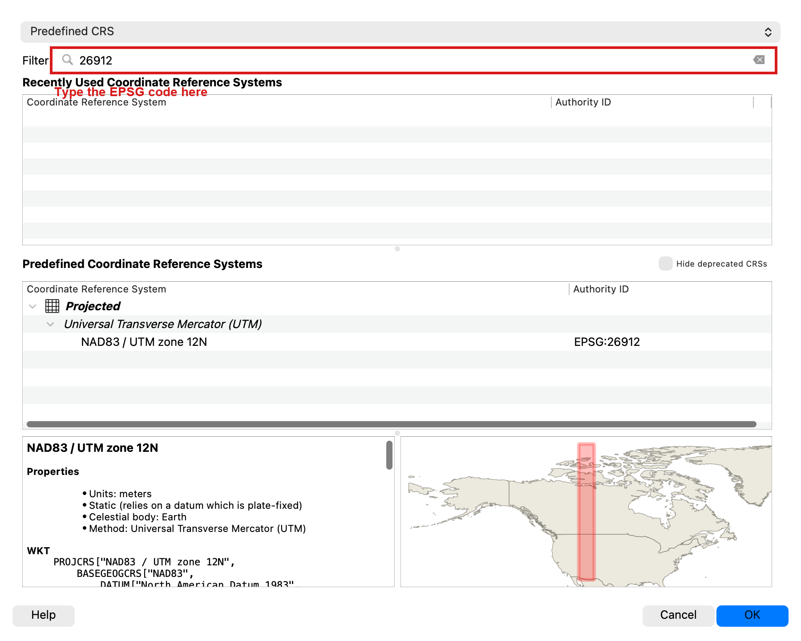

5. **SAVE** your project  
6. Use the UGRC website from last time to find the data you need for this lab. The Utah GIS website is here: [https://gis.utah.gov/products/sgid/categories/](https://gis.utah.gov/products/sgid/categories/)  
   1. Download the “Utah Roads” data in the Transportation category, “Utah Airports” also in the Transportation category, and “Utah Municipal Boundaries” in the Boundaries category.  
   2. **WARNING**: The Utah Roads dataset is very large (as you might imagine) — about 115 MB zipped and close to a gigabyte once unzipped, covering more than 400,000 road segments. It will likely take a LONG time to download over a slow dorm connection. If it doesn’t download completely, try doing it on a fast WIFI on campus.  
   3. **NOTE:** If the shapefiles for these datasets won’t download (i.e., the Utah server sometimes fails, or tells you the download is still being prepared and to check back later), you can also choose the GeoPackage download, which can be loaded into QGIS without needing to be unzipped. **It’s just another file format for the same data\!**  
7. Download and unzip the file for each, then drag and drop the folder for each onto your map.  
   1. **NOTE:** If you downloaded GeoPackage files, then you can literally just drag and drop the file into your map, or you can use the “Add Data” button to browse to the file and double-click it to open it. GeoPackage files don’t need to be unzipped.  
8. You should see 4 layers in the Layers Panel now. Three vector datasets (point, polyline, polygon) and your raster (image) basemap.

> [!NOTE]
> Your exact layer names will depend on the download format. You might see names like
> Utah\_Municipal\_Boundaries, Municipalities, Utah\_Roads, AirportLocations, or Airports. The
> steps below refer to the municipal boundaries, roads, and airports layers; use whatever
> spelling shows up in your Layers Panel.

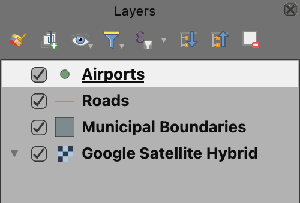

### **Step 2: Symbolize the Airports (Point Data)**

9. Double-click on the airports layer in the Layers Panel, and find the “Symbology” tab on the left side of the window that opens.  
10. You’ll see options to change the marker, adjust its color, and more. We want more options. Click on “Simple Marker” in the box at the top. This will bring up different options.  
11. Click the green \+ next to “Simple Marker” to add another layer to this symbol.

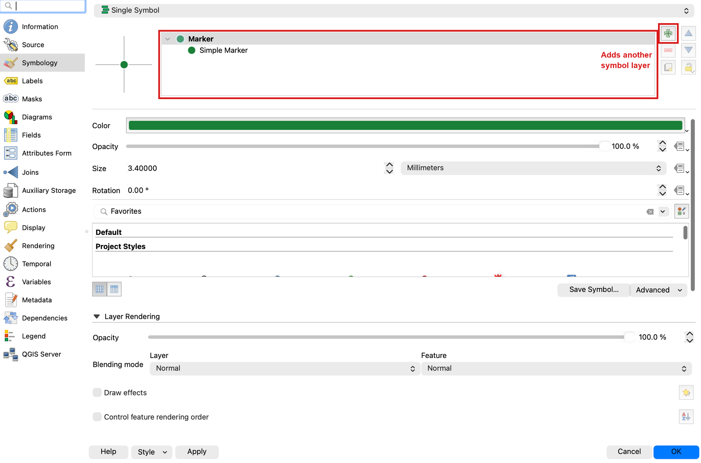

12. Change the “Symbol layer type” to SVG Marker, and choose an SVG image at the bottom of the window.

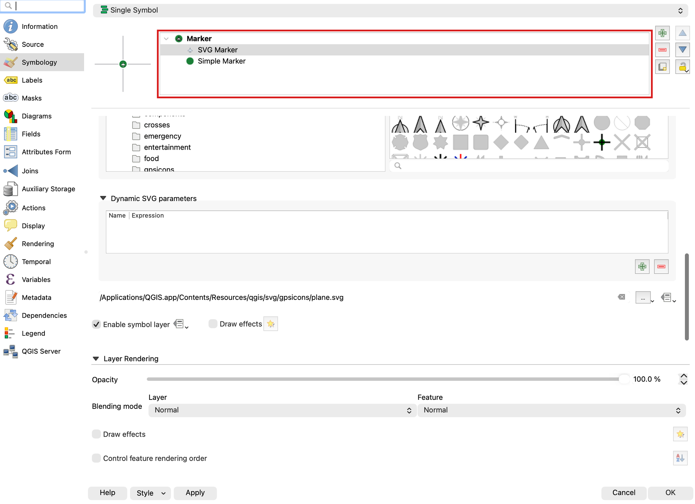

13. Adjust the colors, sizes, and other elements of both marker layers until you achieve a symbol you like. Click OK.  
14. **SAVE** your project

> [!WARNING]
> Not everything in this dataset is an airport. It is the FAA's facility list, and 55 of its 138
> points are **heliports** — mostly hospital helipads, plus a television station and a few private
> pads. The `LAN_FA_TY` field says which is which: `AIRPORT` or `HELIPORT`. A hospital helipad is
> not what a film crew means by "there must be an airport." Before you settle on a town, open the
> attribute table and check what its facility actually is. If you want the practice, symbolize the
> airports layer **Categorized** on `LAN_FA_TY` so the two kinds look different on the map — that
> is the same tool you are about to use on the roads.

### **Step 3: Symbolize the Roads (Line Data)**

15. Double-click on the roads layer in the Layers Panel, and again find the “Symbology” tab on the left side of the window that opens.  
16. For our roads, we need to distinguish highways/freeways from the rest. One way to do this is by using categorized symbology. At the very top, change the dropdown from “Single Symbol” to “Categorized.”  
17. Change the “Value” dropdown to “CARTOCODE” ([UGRC](https://docs.google.com/spreadsheets/d/1jQ_JuRIEtzxj60F0FAGmdu5JrFpfYBbSt3YzzCjxpfI/edit?gid=1856320934#gid=1856320934) link)  
18. Click “Classify” at the bottom of the window. You should now see the numbers 1 through 18, though not in numeric order — the codes are stored as text, so the list runs 1, 10, 11 … 18, 2, 3 … Below them QGIS adds one more row, in italics, called “all other values.”

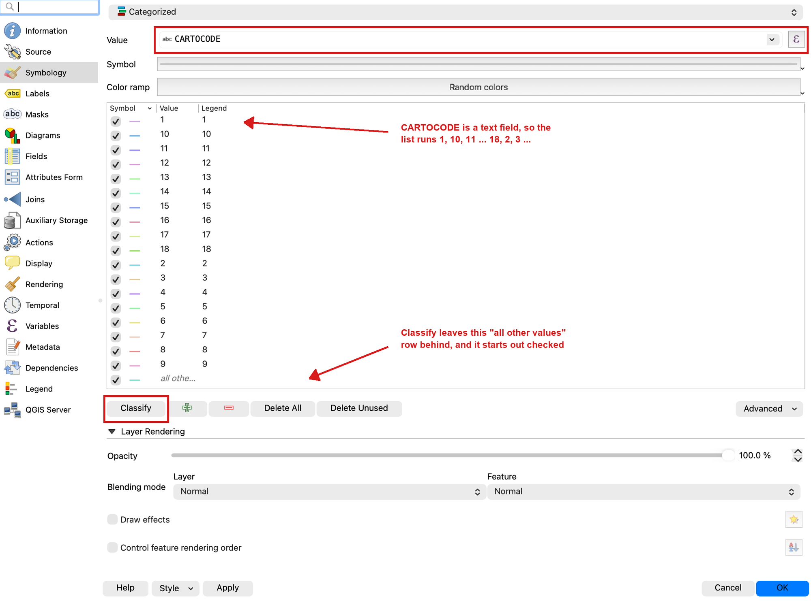

19. The numbered roads 1 through 5 are the interstates and major highways, and they are the only ones we want on this map. Select every other row — 6 through 18 **and** the italic “all other values” row — and remove them with the red minus button.

> [!IMPORTANT]
> Delete those rows rather than just unchecking them. An unchecked category still appears in your
> map legend later, and the “all other values” row is **checked** when QGIS creates it, so leaving
> it there quietly draws all 400,000 residential streets underneath your highways.

20. Now select the five rows that are left, right-click, and choose **Merge Categories**. The five collapse into a single row. Double-click its entry in the “Legend” column and rename it “Highway.” Double-click the short sample line next to it to set one color and line width for all of them — pick something clearly visible against satellite imagery.

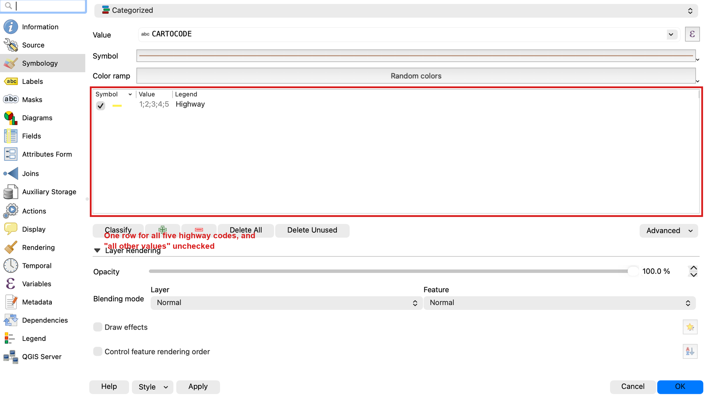

21. Press OK, then **SAVE** your project\!

### **Step 4: Symbolize the City Boundaries (Polygon Data)**

22. Next, we want to organize the symbology of city boundaries so it's easy to compare them and determine how their populations compare to those of other cities. **Graduated symbology** is a straightforward way to achieve this. Double click on the municipal boundaries layer and, in the symbology tab, change “Single Symbol” to “Graduated” in the dropdown at the top.  
23. Change “Value” to “POPLASTESTIMATE” so that QGIS organizes the cities by the latest population estimate. (If you downloaded shapefiles, this field shows up as “POPLASTEST” — shapefile field names are capped at 10 characters, a limit inherited from a 1980s database format.)  
24. Click “Classify.” You should now see ranges of numbers split into different colors.  
25. Set the “Classes” variable to 5\. You can play with this to see how it adds more or fewer color divisions to your range, but set it to 5 when you’re ready to move on.  
26. Choose a different color ramp (by clicking the dropdown arrow next to “Color ramp”) and invert it if you’d like. In the example below the cities with lower populations are greener, since that’s what the client is looking for.  
27. Look at the class labels. Straight out of QGIS they read “0.0000 - 357.0000”, which is not something you want on a finished map. On the “Legend format” row, set **Precision** to 0 so they read “0 - 357” instead.

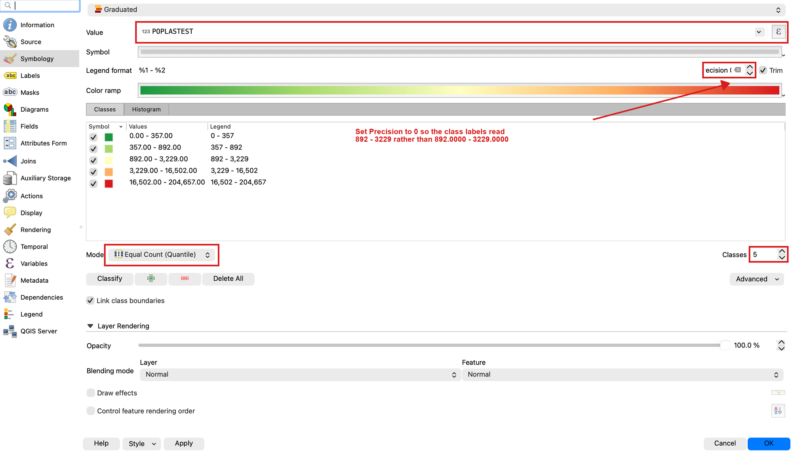

28. Let’s make these polygons transparent so that we can still see the terrain below. Click “Layer Rendering” at the bottom of the window, then set the opacity slider to 40-50%. Press OK.

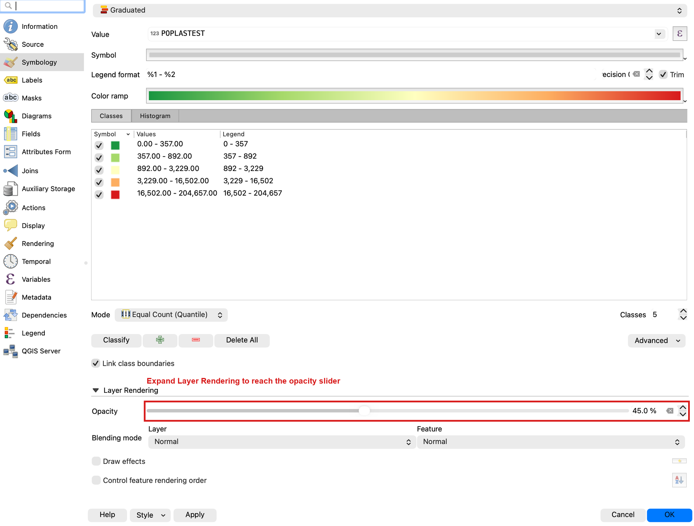

29. Your map should look something like this:

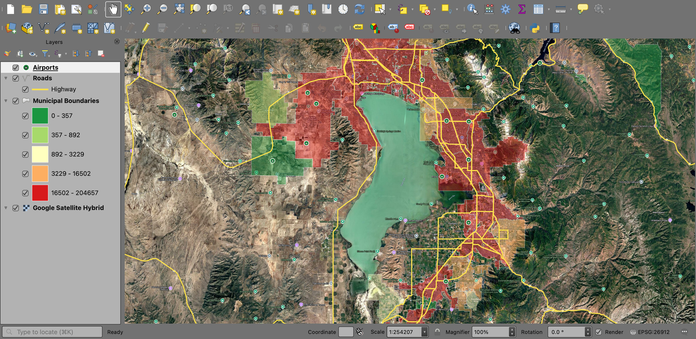

### **Step 5: Label the Cities**

30. If you know your Utah geography really well, this result might be fine. However, it would be best to add labels for each city. Double-click on the municipal boundaries layer again, and this time find the “Labels” tab on the left.  
31. Change “No Labels” to “Single Labels” and make sure “Value” is set to the field with the city names (NAME)  
32. Find “Buffer” in the left column and click on it. Check the box “Draw text buffer.” A buffer puts a halo of contrasting color behind each label so it stays readable over dark satellite imagery.

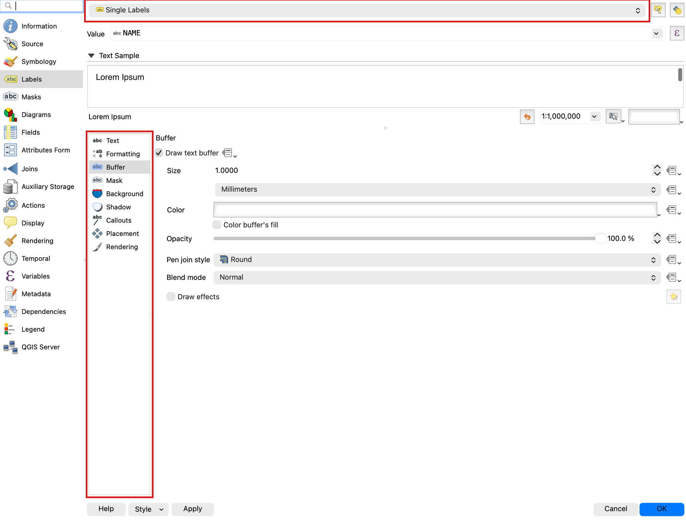

33. Experiment with the options for Text, Buffer, Background, and Shadow if desired. After clicking Apply or OK, you should see labels for each polygon on the map.

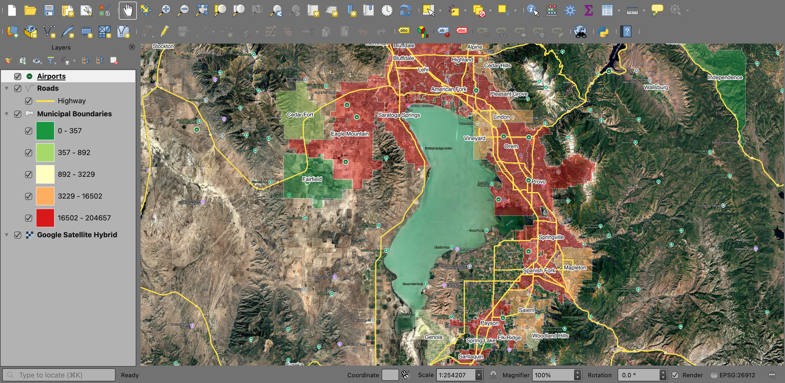

34. **SAVE** your project

### **Step 6: Find a Location That Meets the Criteria**

35. Identify a location that meets the criteria outlined in the problem statement. **Look for a small town — population in the low thousands or less — whose boundary contains both a highway and an airport.** Keep your map view zoomed in on this location, even though the examples from now on will show a different view (sorry, no free answers\!). If you have trouble with this step or need clarification, ask a classmate, a TA, or your instructor for help.

> [!WARNING]
> **Check the population before you trust the color.** Eight municipalities in this dataset have a
> population of **0**, which is not the same as being small. Some are newly incorporated and have
> not been counted yet; at least one is a plain data error. **Logan** is one of them — a city of
> roughly fifty thousand people, with an airport and highways, that the graduated symbology drops
> into the smallest class and colors like a village. Click a candidate town with the Identify tool
> and read its attributes before you commit to it. Noticing this kind of thing is a real part of
> the job: the map will happily show you something false if you let it.

### **Step 7: Build the Map Layout**

##### New Layout

36. Navigate to *Project\>\>New Print Layout…* and a new window will open for you to design a Layout (basically a print-view)  
37. Go back up to the top of your screen and navigate to *View\>\>Show Grid*. Ensure *that "Show Grid"* and *"Snap to Grid"* are checked. This will make your life much easier.

##### Adding a Map

38. Click the “Add Map” button,  then draw a box where your map will be located.  
39. Use the  “Move item content” tool to zoom and pan around on this new layout map. Have this layout display the city/town you found that meets the film company’s criteria.

##### Neatline

40. Use  “Add Shape” to create a rectangle around the entire page that will act as your neatline.

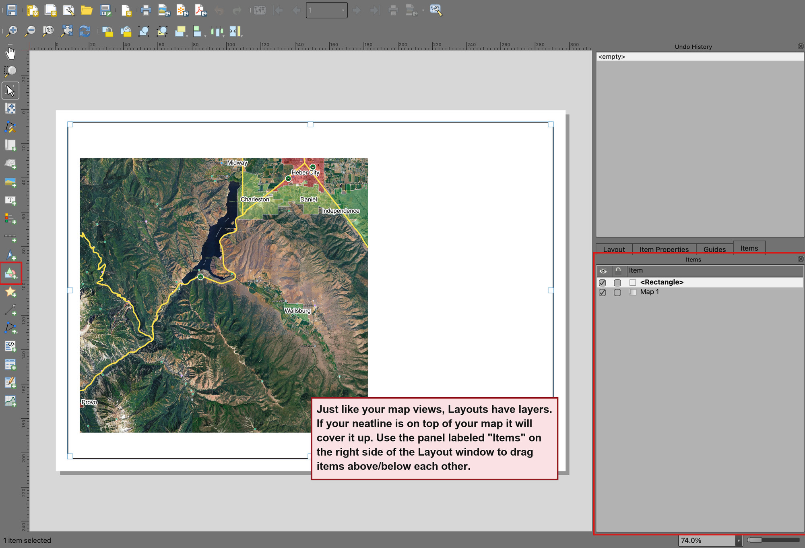

##### Legend

41. Now use the  “Add Legend” button and draw a box for the legend. You’ll notice that it doesn’t follow the boundaries you drew. We’ll have to edit its content to fit our layout.  
42. Go to the “Item Properties” tab in the bottom right panel. Uncheck “Auto update” under “Legend Items” so that we can freely edit the contents.  
43. Select your basemap (e.g., “Google Satellite”) from this list, then click the red minus “-” button to **remove** it from the legend. Do the same for each layer that isn’t included in this layout.  
44. Double-click on any legend item in the panel to change the text. Do this to change confusing file/layer names to something that helps the viewer understand your layout.  
45. Add a legend background if needed by scrolling down in the “Item Properties” and expanding the “Background” section. Choose a color that makes each legend item clearly visible.

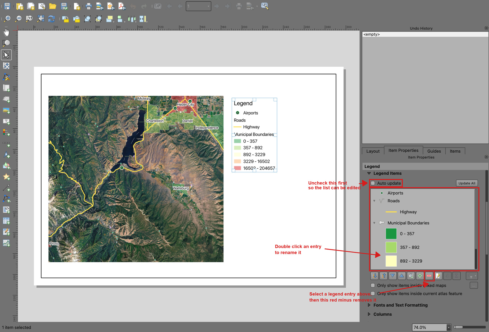

##### North Arrow and Scale Bar

46. Use  and  to add a north arrow and a scale bar to your layout.  
47. For the north arrow, use the “Item Properties” panel to select an **arrow**, and scroll down in the same panel to “SVG Parameters” to change the colors.  
48. For the scale bar, use the “Style” and other options to change its look. Use the “Units” and “Segments” sections to change the bar units and length to be useful.

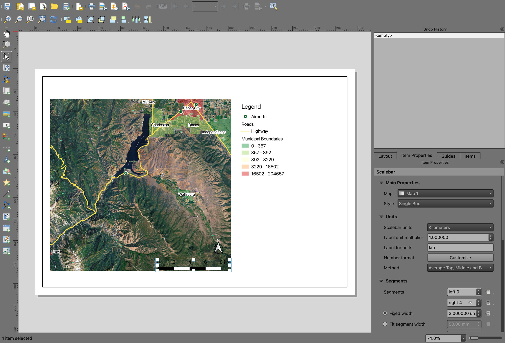

##### Title and Citation

49. Use  “Add Label” to add a title to your layout. Draw the rectangle, then use the “Item Properties” panel on the right side to edit the text.  
50. Adjust the text size and alignment under “Appearance” in the same panel to fit your layout.

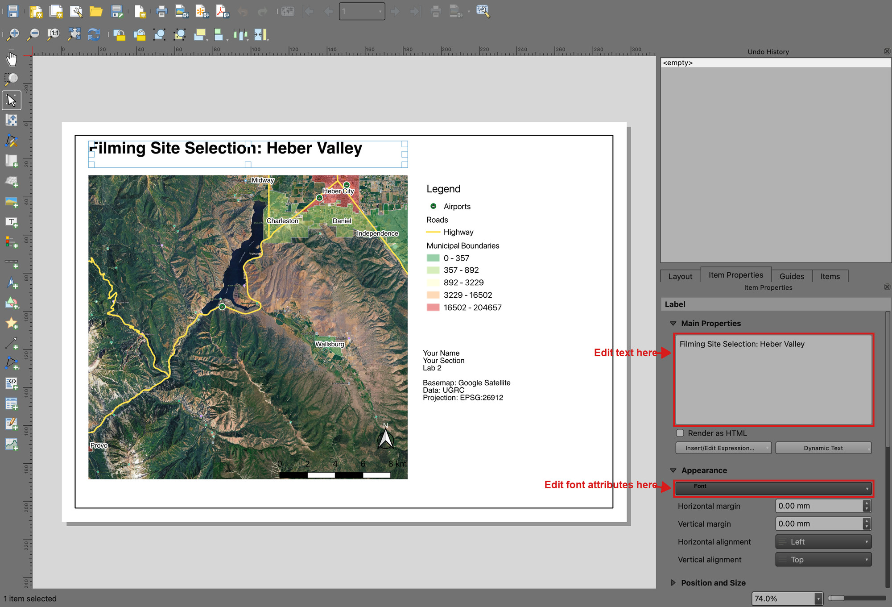

51. Use “Add Label” again. This time, we’ll use it to add the necessary citations to the layout.  
52. In one text box/label, write your name, class section, and lab number  
53. In the same text box or a new one, add the following data citations and projection information (adjust these for each lab):  
    1. “Basemap: Google Satellite”  
    2. “Data: UGRC”  
    3. “Projection: EPSG:26912”

##### Export Layout

54. **SAVE** your project  
55. For this class, you’ll want to export your layouts as a PDF. With the layout open, in the top menu, navigate to *Layout\>\>Export as PDF…*  
56. Give your layout a name and leave all of the export options at their defaults.  
57. Save it anywhere, but keep track of where you saved it in case Learning Suite loses your submission or something else happens. Your final PDF should resemble this (with your own name, information, and map view). Your map will feature your own styling, colors, icons, and more. Just ensure they meet the project's goals. In other words, you’re not recreating this map exactly; make your own map that meets the project goals. 

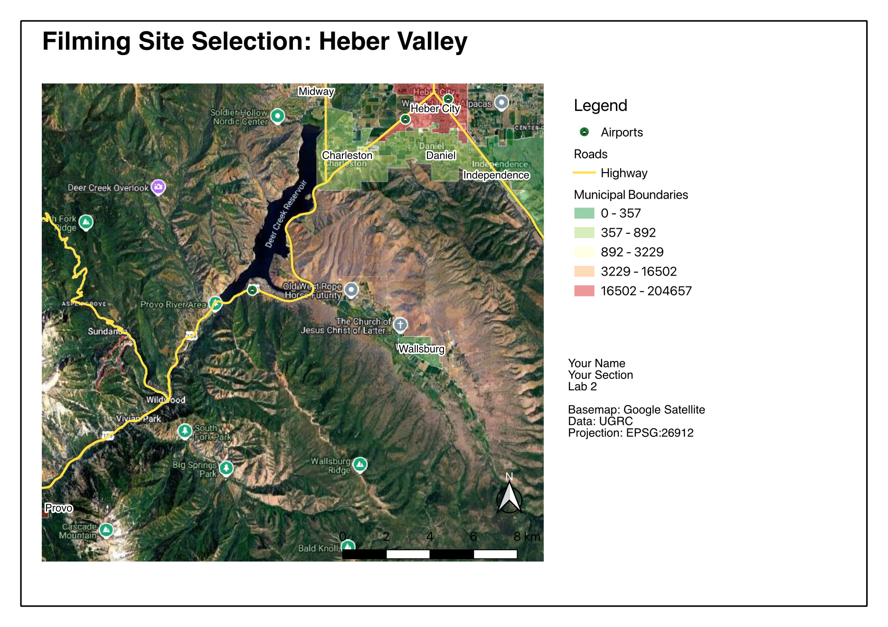

### **Important Points**

- For optimal readability, it is generally best not to overlap items on the map. The north arrow and scale bar are the exceptions. To improve their readability, you may add backgrounds or font buffers to them and position them over the map in less important positions.  
- To edit a cartographic element after it has been placed, select it and use the “Item Properties” tab. You can change almost anything about each map element.  
- “Lab 2” is not a suitable title for a map layout. Pick something that describes the content, such as “Filming Site Selection” or “Fault Lines Near BYU Campus.”  
- Legends should show all the layers used on the map, regardless of whether they are labeled. This is referred to as an “exhaustive legend.” The reverse is also true: a legend should not list anything the map does not draw. As you’ve seen, editing the legend is doable. Also, the labels in a legend should be descriptive and professional; capitalize layer names, be descriptive, and avoid underscores or unprofessional symbols.  
- Often, satellite imagery is the standard basemap of choice. Depending on the purpose, different basemaps may be acceptable if they enhance the visual presentation and clarity of a map or if the lab specifies a basemap to use.  
- If necessary, you can also use blank space on a layout to accommodate additional maps, images, and text. Some maps need more explanation than a simple legend, though it is best to keep your maps simple so that they can be better understood.  
- **You may design your map in any way you wish, provided it contains the proper data sets, is professionally presented, and incorporates the necessary cartographic elements.**

## **Deliverables**

Submit a PDF file that contains:

1. Your name, date, class section, and lab assignment number  
2. Your map layout  
3. The name of your chosen city location  
4. Short answers to these three questions:  
   1. In step 4 you set the project's coordinate reference system to EPSG:26912 instead of leaving it at the default. Why does a map of Utah use that one?  
   2. You used categorized symbology for the roads and graduated symbology for the cities. What does graduated symbology show a reader that categorized symbology cannot, and why was each the right choice for its layer?  
   3. Name one thing in this data that could have led you to a wrong answer, and say how a reader of your map would (or would not) be able to tell.  
5. The grading rubric, filled in with your self-evaluation

## **Grading Rubric**

The following rubric will be used to evaluate your lab assignment. Use this as a guide to ensure that you include all the required elements for this lab. Shown under “Score” is the maximum possible points you can receive for each item. 

In some cases, points are awarded on a "yes or no" basis, giving full points if something is present and none if it is not. In other cases, points are awarded on a scale, depending on how well you complete the task. Please keep this in mind. For example, if there is a written answer required, grading will be based on a scale of points, depending on the quality and completeness of your written answer.

Copy the rubric and paste it into your lab report. Fill in your self-evaluation of the rubric, showing how many points you feel you have earned for each item. 

| Requirement | Score |
| ----- | ----- |
| Symbology on the three data layers: Google Satellite basemap layer is visible *(1 pt)* Custom point symbol with more than one symbol layer *(3 pts)* Roads show only the highways, cartocodes 1-5 *(3 pts)* City boundaries use graduated symbology on population, with readable class labels *(3 pts)* Boundaries are transparent enough to see the terrain *(1 pt)* Cities are clearly labeled with their names *(1 pt)* | /12 |
| Chosen location: Meets all three of the film company's criteria *(3 pts)* Zoomed to a level that clearly shows which town you chose *(2 pts)* | /5 |
| Cartographic elements, 1 pt each: Neatline, Legend, North Arrow, Scale Bar, Title, Citations and name/section/lab number | /6 |
| Written answers, in your own words: Why EPSG:26912 *(2 pts)* Graduated versus categorized symbology *(3 pts)* A way this data could mislead a reader *(2 pts)* | /7 |
| **Total** | **/30** |

## **Using AI on This Lab**

AI tools like ChatGPT and Gemini can be genuinely useful here, if you use them to learn rather than to skip the learning. Good uses: asking what a "cartocode" or graduated symbology actually is, decoding a cryptic QGIS error message, asking why your labels or legend aren't showing what you expect, or quizzing yourself on the difference between point, line, and polygon data before the exam. What's not okay: having AI pick your city for you, write your self-evaluation or your written answers, or generate a map or screenshot you pass off as your own work. The whole point of this lab is that YOU can drive the symbology and layout tools — a skill you only get by clicking through them yourself. If you do use AI along the way, say so in your submission, and make sure you can explain and defend every part of your map as your own understanding.

* OK: "Explain what a graduated color ramp does in QGIS" or "What does this error mean: ..."  
* OK: "Quiz me on map layout elements and what each one is for"  
* Not OK: "Which Utah town has an airport and a highway and a small population?" — that's the deliverable, and finding it yourself is the fun part.
