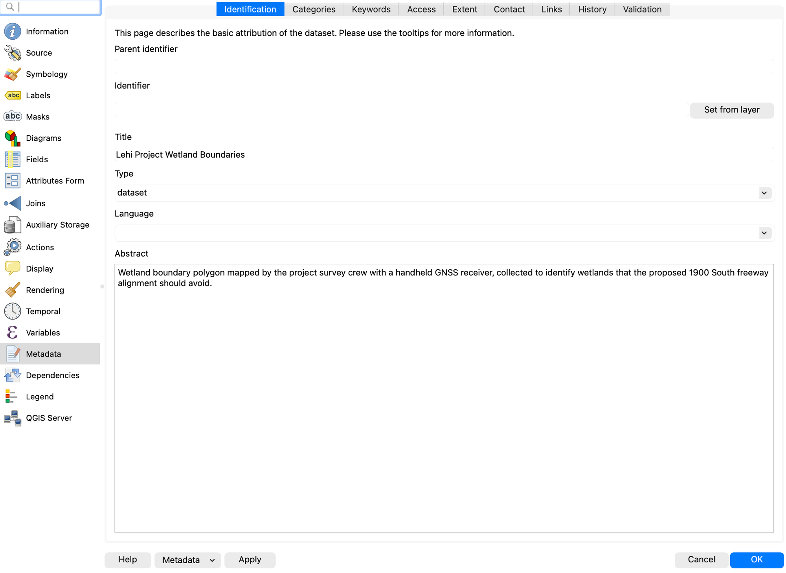
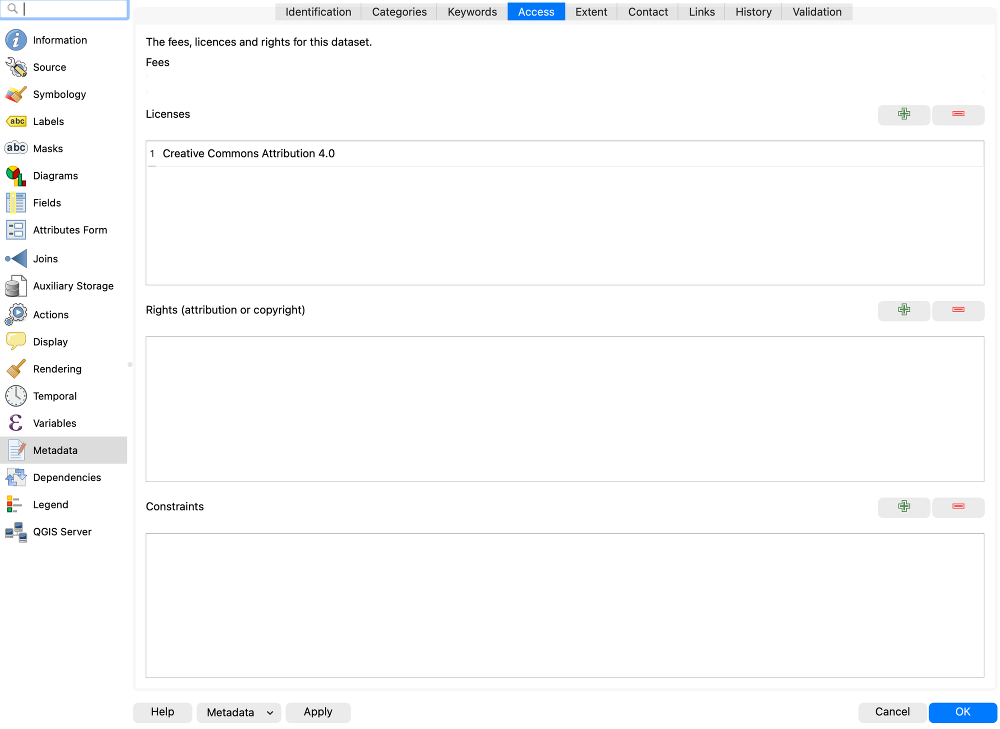
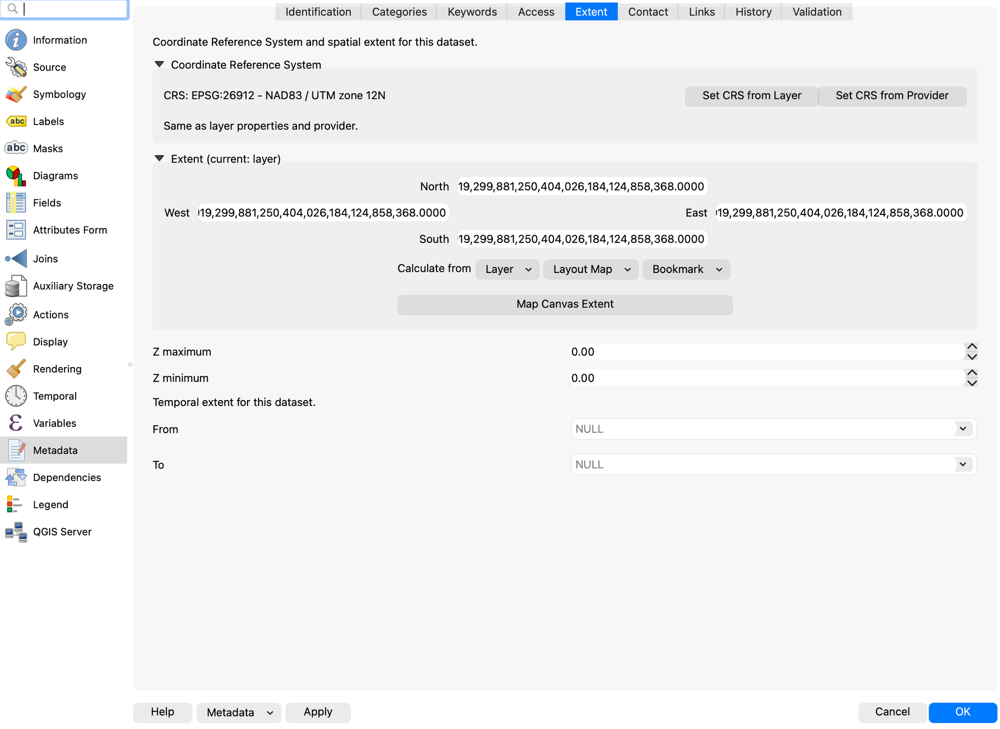
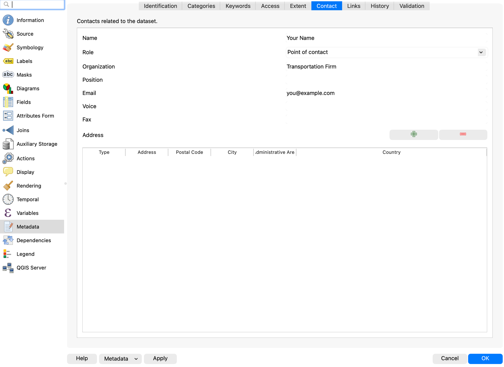
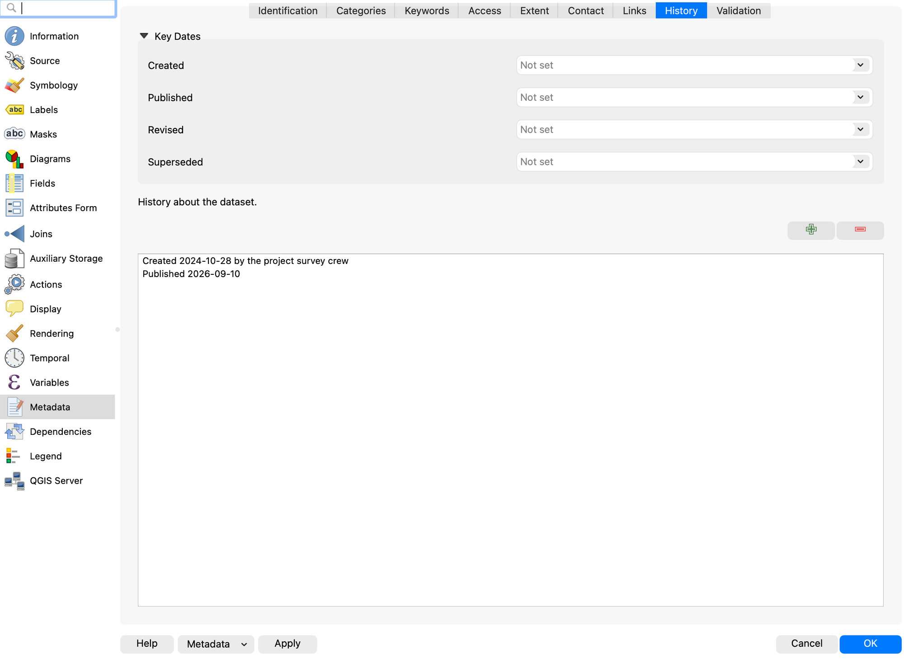

# Lab 8: Metadata

**Lab**{ .badge .badge-lab } · Due Saturday of Week 9, 11:59 pm · Prepared for by the [Week 9 hands-on session](../../handson/week-09.md)

**Civil and Construction Engineering 114 — Geomatics**

Dr. Dan Ames · Brigham Young University

*Lab assignment developed by Nathan Godfrey and Dr. Ames*

## **Background**

Utah County is experiencing rapid growth: the Kem C. Gardner Policy Institute projects the county will roughly double by 2065, adding more than 750,000 people—more than any other county in Utah—and nearly catching Salt Lake County as the state’s largest (https://gardner.utah.edu/news/utahs-population-projected-to-reach-5-6-million-by-2065/). This growth requires significant new infrastructure, and cities like Lehi have published their plans to accommodate it. [Lehi's Master Transportation Plan](https://media-002-us.cdn.govstack.com/lehi-ut-us/media/m5xd103k/master_transportation_planpdf.pdf) shows the locations of 1900 S and a proposed offshore freeway, both key elements of this lab. (If that link ever moves, the plan is listed on Lehi's [Studies and Master Plans](https://www.lehi-ut.gov/business-development/studies-and-master-plans/) page.) And the freeway is less hypothetical than it sounds: in October 2023, Lehi’s planning commission recommended that UDOT study an off-shore freeway skirting the north edge of Utah Lake, after the city’s traffic engineer reported that Pioneer Crossing carries about double the traffic it was designed for (https://www.ksl.com/article/50766825/lehi-officials-recommend-utah-lake-north-shore-freeway-as-traffic-solution).

A critical part of planning new infrastructure is understanding metadata. Metadata is essentially information about a dataset, including details such as “who, what, when, where, and how.” In GIS, key metadata elements include the coordinate reference system (CRS), data sources, creation date, update frequency, scale, and any transformations the data has undergone. By understanding metadata, we can use datasets more effectively and make accurate decisions.  
If metadata sounds like boring paperwork, remember the Mars Climate Orbiter: in 1999, NASA lost the $125 million spacecraft because ground software delivered thruster data in English units while the onboard software expected metric. One undocumented detail about a dataset can sink a project, whether it flies to Mars or paves a freeway (https://science.nasa.gov/mission/mars-climate-orbiter/).

Unfortunately, different GIS software developers have used different methods for saving and transferring metadata. The files we have been downloading from Utah’s GIS portal, for example, all use the **standard metadata file format (.xml)**, which automatically imports into ArcGIS Pro and other GIS programs, but not QGIS. QGIS stores metadata in the project file itself, or it can use the .qmd file format to store metadata manually. For this course, this variety of file formats gives us an opportunity to learn to create metadata manually, which is necessary anyway if you create your own datasets. Despite the incompatibilities, the .xml and .qmd formats look very similar and can be interpreted as plain text if needed.

## **Problem Statement**

This assignment consists of two parts. In part one, there are straightforward introductory instructions and a metadata table that you will need to complete.

In part two, you are part of a team responsible for designing a new highway running west out to Saratoga Springs. As the team’s metadata expert, you’ll prepare for the next meeting by looking over some of the datasets to be used in the project, as well as creating some new metadata for a surveying crew.

## **Learning Objectives**

* Repeat skills from the previous labs  
* Learn to read and interpret metadata in real-world scenarios  
* Learn to create and export metadata in QGIS

## **Software and Data**

* For this lab, we will use the GIS software application, QGIS (also known as Quantum GIS). This is a free/open source GIS package that runs on Windows, Mac, and Linux. The software is pre-installed in the Clyde Building 234 computer lab. You can also download it and install it on your own computer from this website: [https://www.qgis.org/](https://www.qgis.org/). We will be using this version throughout the course: *“Long Term Version 3.44 (LTR)”.*   
* This lab has one small data download, linked from the steps below and hosted with the course site. Everything else comes from the State of Utah GIS website: [https://gis.utah.gov/products/sgid/](https://gis.utah.gov/products/sgid/)  
* Imagery from Google will also be used as a base layer. 

**REVIEW THE deliverables section at the end of the document before continuing. You should always do this before starting any of your labs. It will help you make sense of the lab and not waste time.**

## **Step by Step Instructions**

### **Step 1: Read a Real Metadata File**

1. On the UGRC website, find the “Utah County Boundaries” dataset from the Boundaries category  
2. Download the shapefile data  
3. Unzip the folder, and open the XML file, which should open as a plain text file in an internet browser  

> [!NOTE]
> When you download the shapefile for this data, an **XML file** comes with it that contains the metadata that you can view as plain text.

4. Use the metadata to fill out the following table. (In other files, you’ll see that the amount of information in the metadata can vary widely. This file in particular has everything you need to fill out 1-2 points on each row of the table.)  
   1. Hint: Try using Ctrl+f to search the text for keywords: “UGRC” for who (check the keywords list and the use constraints paragraph), “pubdate” and “ModDate” for when (both are written as YYYYMMDD; `pubdate` is when the data was published and `ModDate` is when the file was last modified), and “bounding” for where. Different UGRC downloads tag their dates differently — some use `metd` instead — so if one search comes up empty, try the others before deciding the date is missing.

| Dataset name | Utah County Boundaries |
| :---- | :---- |
| **Who**? (Authors, origin, organizations, dataset credit) |  |
| **What**? (Briefly summarize the abstract, keywords) |  |
| **When**? (Date published and/or date updated) |  |
| **Where? (Extents, “bounding coordinates”; the CRS isn’t in this XML—it lives in the .prj file that came in the same download)** |  |
| **Why**? (Purpose, if stated) |  |

5. Now press Ctrl+f again in the metadata XML and search for “license”. This will take you to a paragraph that almost every professional dataset includes—the usage limits for the data. Say, for example, that your spouse is a digital artist. They get excited about the maps you’re making, and they want to create and sell cool map art on Etsy.com. This section of the metadata can tell you if they could legally use the dataset for that purpose.  
   1. To avoid diving into copyright law, yes, the Utah County Boundaries dataset’s licensing allows people to make and sell art from it. If this interests you, research the license listed in the metadata.

### **Step 2: Answer the Project Team's Questions**

Utah County is experiencing rapid growth, necessitating a new freeway extension from I-15 to Saratoga Springs. The existing road closest to the lake, currently known as 1900 S in Lehi (or Saratoga Road), will be transformed into a freeway. Your transportation firm has access to several datasets that will guide the planning of the off-ramp and the new route. With a meeting coming up soon, your boss has sent you a list of metadata-related questions to review and prepare answers for before the team discussion. Use the metadata from the UGRC datasets mentioned below as you consider the answers to the following questions/situations:

* \#1: There have been some significant changes in a housing development along 1900 S over the past 2 years. Your firm wants to use the “Utah Buildings” dataset to determine whether any buildings are in the way of the project. When was this dataset last updated? Is this dataset likely to be up to date? (Search the XML for “ModDate”, written as YYYYMMDD. Not every UGRC download uses the same tag — some carry `metd` instead — so if one is missing, search for the other.)

* \#2: Your firm wants to make sure it cites sources and gives credit wherever possible. What person/company/organization is responsible for the creation of the “Utah Buildings” dataset? (Hint: it’s not the UGRC)

* \#3: There is a small slice of federal land in the way that the new freeway might need to be built over. To avoid more paperwork, the firm hopes to plan around it, using the “Land Ownership” dataset from the UGRC (listed under the Cadastre category). Check the metadata for use constraints (this file uses a different metadata style than the others—try searching for “constraints”). Is this shapefile usable for legal, engineering, and surveying purposes?

* \#4: A second plan has come up as well: to just build the freeway out over the water in the north end of Utah Lake. To obtain initial measurements, your firm wants to use both the “Utah Major Lakes” and “Utah Roads” datasets. For each file, what is the coordinate reference system (CRS) used? (The XML metadata doesn’t record the CRS—open the .prj file that came in each download, or add the layers to QGIS and check Layer Properties → Information. Note the map units while you’re there.) Why might it be important to *compare* these when using files to plan specific road measurements? Note that finding they **match** is a perfectly good answer — the point is that you checked rather than assumed, and that you can say what would have gone wrong if they had not.

* \#5: On the topic of this secondary plan, how recent is the data in the “Utah Major Lakes” dataset? (search for the “metd” date like before) Would this data be usable for the precise, current waterline of Utah Lake?

* \#6: You notice a problem; it looks like there’s a nonexistent island in the Utah Lake dataset. Who can you contact about this? Search the XML for “cntinfo” and see what contact details the file itself carries, then compare them with the Contact page on the distributor’s website, gis.utah.gov. Record the organization, phone number and email address you would actually use, and say why you chose that one over the other.

Now that you’ve got answers to your metadata questions, there’s one thing left to do before the meeting. Your boss is very environmentally conscious and noticed some wetlands in the project area. He sent out a surveying crew to map one wetland in particular that could be avoided, and he needs you to create metadata for the polygon shapefile the crew created.

6. Download [Lehi\_wetland01.zip](data/Lehi_wetland01.zip) and unzip it. Note the singular “wetland” in the name.  
7. Create a new QGIS project with a Google Satellite Hybrid basemap  
8. Add the “Lehi\_wetland01” shapefile to the project  
9. Right-click on the “Lehi\_wetland01” layer in the Layers Panel, and click “Properties…”  
10. Find the “Metadata” tab on the left.  
11. Fill out the following information in the “Identification” tab of the metadata:  
    1. Title: Lehi Project Wetland Boundaries  
    2. Abstract: *Write a brief abstract, including the data collection method and purpose*  

12. Fill out the following information in the “Access” tab of the metadata:  
    1. Click the green \+ to add a new license, and select “Creative Commons Attribution 4.0” from the dropdown  

13. In the “Extent” tab, note the CRS is visible (no need to change it for this lab, just know where to find it)  

14. Fill out the following information in the “Contact” tab of the metadata:  
    1. Name: your name  
    2. Organization: Transportation Firm  
    3. Email: your email  

15. Fill out the following information in the “History” tab of the metadata:  
    1. Created: October 28th, 2024  
    2. Published: the date that you complete this lab (time doesn’t matter)  

16. Then click “Apply” at the bottom of the window, but keep the window open  
17. On the bottom left, click the dropdown that says “Metadata” and select “Save Metadata to File…”  
18. Name the file “Lehi\_wetland01” and save it where you can easily find it  
19. Open your new metadata file as plain text, and take a screenshot of it that shows *at least* the first 25 lines (for grading purposes)

There is no layout to create for this lab. If any of the metadata tabs look different from the figures above, check that you are on the **Metadata** page of Layer Properties and not the **Information** page, which looks similar and is read-only. Ask a TA if you get stuck, we’re available\!

## **Deliverables**

Submit a PDF file that contains:

1. Your name, date, class section, and lab assignment number  
2. Your completed metadata table from Part 1  
3. Complete, thoughtful answers to questions 1-6 in Part 2  
4. A screenshot of your metadata  
5. The grading rubric, filled in with your self-evaluation

## **Grading Rubric**

The following rubric will be used to evaluate your lab assignment. Use this as a guide to ensure you include all required elements for this lab. Shown under “Score” is the maximum possible points you can receive for each item. 

Sometimes, points are awarded on a "yes or no" basis, giving full points if something is present and none if it is not. Other times, points are awarded on a scale based on how well you complete the task. Please keep this in mind. For example, if there is a written answer required, grading will be based on a scale of points, depending on the quality and completeness of your written answer.

Copy the rubric and paste it into your lab report. Fill in your self-evaluation of the rubric, showing how many points you feel you have earned for each item.

| Requirement | Score |
| ----- | ----- |
| Provide the requested metadata table: Table with each required point of information *(5 pts)* | /5 |
| Provide correct and thoughtful answers to each of the 6 questions in Part 2: Each question is answered correctly using information from the metadata, and open-ended questions have a complete, thoughtful response *(18 pts)* | /18 |
| Provide a screenshot of your metadata: Screenshot shows that the metadata was correctly created and exported *(7 pts)* | /7 |
| **Total** | **/30** |

## **Using AI on This Lab**

AI tools like ChatGPT and Gemini can be genuinely useful on a metadata lab, and just as genuinely useless if you let them do your thinking. Good uses: paste in a confusing chunk of XML and ask what a tag like \<metd\> or \<useconst\> means, ask why a CRS measured in degrees is a bad choice for measuring road lengths, decode a cryptic QGIS error, or have it quiz you on the who/what/when/where/why of a dataset until you can rattle them off. What is not okay: pasting in the six questions and copying out answers, or trusting dates, contact info, or license terms an AI never actually saw—chatbots will cheerfully invent a plausible-looking ModDate. Every answer in this lab comes from a real file that the AI cannot see unless you show it, and even then you should check its reading against the file yourself. If you use AI, say so in your report, and be ready to explain and defend every answer as your own understanding.
