# Week 3 Hands-On — Symbology, Labels, and a First Layout

**Hands-On Practice**{ .badge .badge-handson } · *Day 5 · Thursday of [Week 3 — Maps, Symbology, and Cartography](../weeks/week-03.md)*

### Topics

- Follow along: make a map of the United States
- Practice point, line, and polygon symbology
- Explore the attribute table
- Add labels

### Materials

- United States shapefiles (posted on Learning Suite)

<!-- runsheet -->
**Feeds** [Lab 2](../assignments/lab-02/README.md) and the BYU Belonging Map.

### At a glance

| | |
| --- | --- |
| **Goal** | Students style points, lines, and polygons three different ways, add labels, use the attribute table to drive symbology, and export a layout with the required map elements. |
| **Why this week** | Tuesday covered map design: what every map needs and how symbols carry meaning. Today they make a map that has all of it. Lab 2 is a symbology and layout lab, and the Belonging Map (due Week 6) is a layout with one point on it. |
| **Students bring** | Laptop with QGIS 3.44. **United States Shapefiles.zip** from the Week 3 Thursday entry on Learning Suite, unzipped. |
| **Graded item** | *In Class Activity: Playing with Symbology* (5 points). Upload a screenshot of a colorful map. |

### Practice run before class

> [!TIP]
> About thirty minutes on your own laptop. This is the longest walkthrough of the semester, so a
> rehearsal is worth more here than anywhere else.

**What you need.** QGIS 3.44 LTR and **United States Shapefiles.zip** from the Week 3 Thursday
entry on Learning Suite, unzipped. The zip holds more than the three layers this session uses: `states`,
`counties`, `cities`, `roads`, `rivers`, `lakes`, and a 10,769-feature `RiversInt`. Load
`states.shp`, `cities.shp` and `roads.shp` and ignore the rest. The field names you need are
`STATE_NAME` and `SUB_REGION` on states, `CITY_NAME` on cities, and `POP1990` for population on
both. The `.mwprj`, `.mwsr`, `.mwsymb` and `.lbl` files are MapWindow leftovers; QGIS ignores
them, as it does `testline.shp`.

<!-- TODO: publish United States Shapefiles.zip on this site the way UtahCountyData.zip is
published, so this session can be rehearsed without hunting through Learning Suite. -->

> [!NOTE]
> **Three things about this data that students notice.** `states.shp` holds **49 features — the
> lower 48 plus the District of Columbia**. Alaska and Hawaii are not in it, so "a map of the
> United States" here is the contiguous one, and zooming to full extent frames the lower 48.
> Population is **`POP1990`** (with a `POP1997` estimate alongside), so every number on screen is
> a 1990 census figure. And every layer is **EPSG:4326, unprojected lat/long**, which is why the
> country looks horizontally stretched — worth naming out loud in step 6, where the layout has to
> carry the projection as one of its required elements.

If you cannot reach the zip, the free [Natural Earth](https://www.naturalearthdata.com/downloads/)
1:10m *Admin 1 States and Provinces*, *Populated Places* and *Rivers and Lake Centerlines* layers
work for practice. Do not hand those to students; they should use the class data.

**Do this, in order.**

1. Style each layer with a **Single Symbol**: a fill and stroke for states, 0.6 mm blue for the
   line layer, a size 2 marker for cities.
2. States > **Categorized** on `SUB_REGION`, click **Classify**, pick a ramp. Then switch to
   **Graduated** on `POP1990`, **Natural Breaks (Jenks)**, 5 classes.
3. Cities > **Graduated** on `POP1990` with **Method = Size**, range 1 to 6 mm.
4. **Labels > Single Labels** on `STATE_NAME`, font 8, **Buffer** on, white, 1 mm. Then label
   cities with the expression `CASE WHEN "POP1990" > 500000 THEN "CITY_NAME" END`. That leaves
   23 cities labelled.
5. Attribute table: sort a column, **Select Features by Expression** with `"POP1990" > 1000000` (8 cities), then
   **Field Calculator** to add a decimal field `pop_k` as `"POP1990" / 1000`.
6. **Project > New Print Layout**. Add a map, a legend with **Auto update** unticked, a scale bar,
   a north arrow, a title, and a small label with author, date, data source and projection.
   **Layout > Export as Image**.

**You are ready when** you have a PNG on disk that carries all six required map elements, and you
know which field name to type in step 4 without looking it up.

**The one that bites.** Exporting from **Project > Import/Export > Export Map to Image** gives the
bare canvas, not the layout. Export from inside the layout window.

### Before class

- [ ] The US shapefiles unzipped and `states.shp`, `cities.shp`, `roads.shp` loaded in a fresh project on the projector machine.
- [ ] The "What's In A Map" article from the Learning Suite **GIS Help** page open, for the required-elements list.
- [ ] Adriene (who grades the Belonging Map) ready for the ten-minute pitch at the end, or you give it.
- [ ] Learning Suite open to the *Playing with Symbology* activity.

### Plan (50 minutes)

| Time | Segment |
| --- | --- |
| 0:00 | Mini-devotional |
| 0:03 | Load the US data; single symbol for each layer |
| 0:08 | Polygons: categorized by region, then graduated by population |
| 0:16 | Lines and points: width, color, markers, size by attribute |
| 0:22 | Labels: states by name, cities filtered by population |
| 0:28 | Attribute table: sort, select by expression, field calculator |
| 0:33 | Print Layout: title, legend, scale bar, north arrow, export |
| 0:38 | Students: make it colorful, screenshot, upload |
| 0:44 | BYU Belonging Map pitch and mini-demo |

### Walkthrough

#### 1. Single symbols

Right-click the states layer > **Properties > Symbology**. The default is **Single Symbol**. Change the fill color and the stroke width; click **Apply** and keep the dialog open. Do the same for the line layer (width 0.6 mm, a blue) and the cities (a simple marker, size 2). This is where Lab 2 begins.

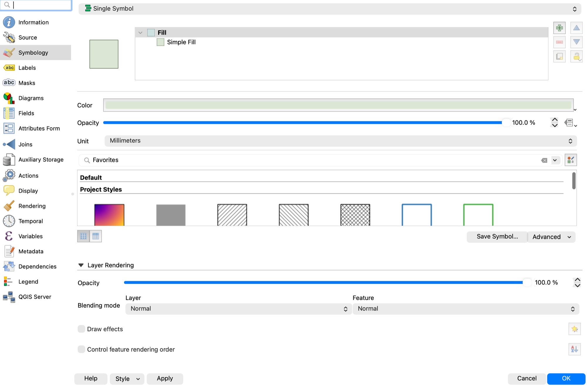

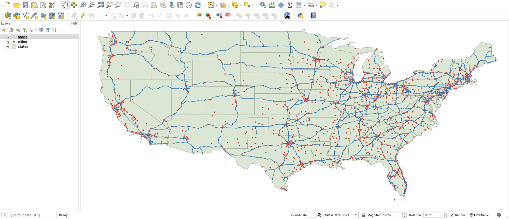

#### 2. Polygons that carry data

1. Switch states to **Categorized**, Value = **`SUB_REGION`**, click **Classify**. The nine values are terse (`E N Cen`, `Mtn`, `Pacific`, `S Atl`…), so rename them in the legend if you want them readable. Pick a color ramp. Every distinct value gets a color; delete the "all other values" row if it is empty.
2. Switch to **Graduated**, Value = `POP1990`, Mode = **Natural Breaks (Jenks)**, 5 classes, a sequential ramp (light to dark). Show the class boundaries in the legend and change the **Legend format** to `%1 – %2`.
3. Ask: which of the two maps answers "where are people?" and which answers "where is the South?" Same layer, different question, different symbology.

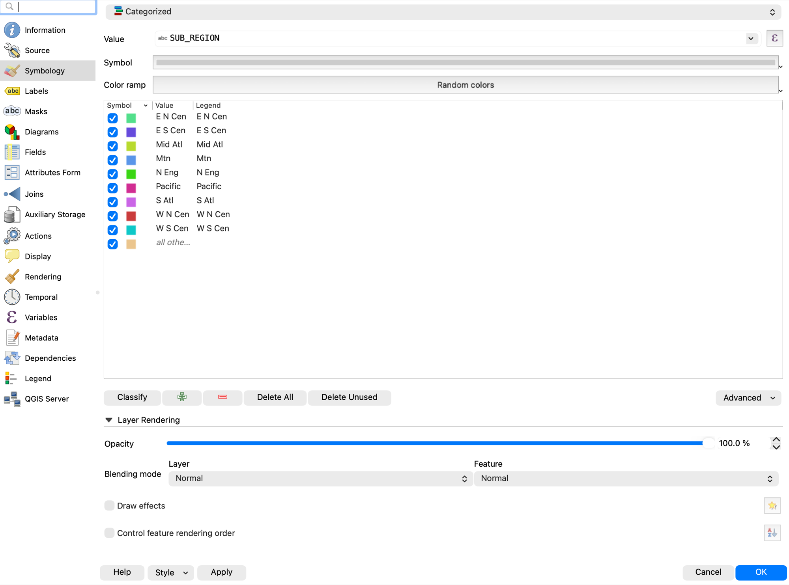

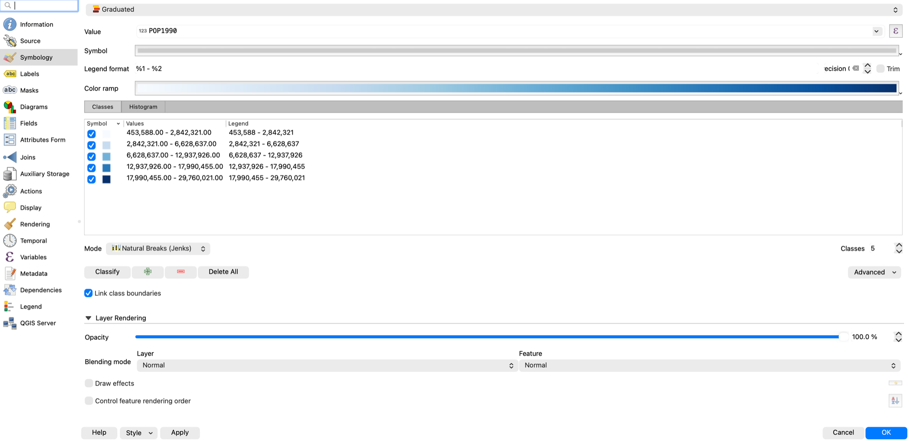

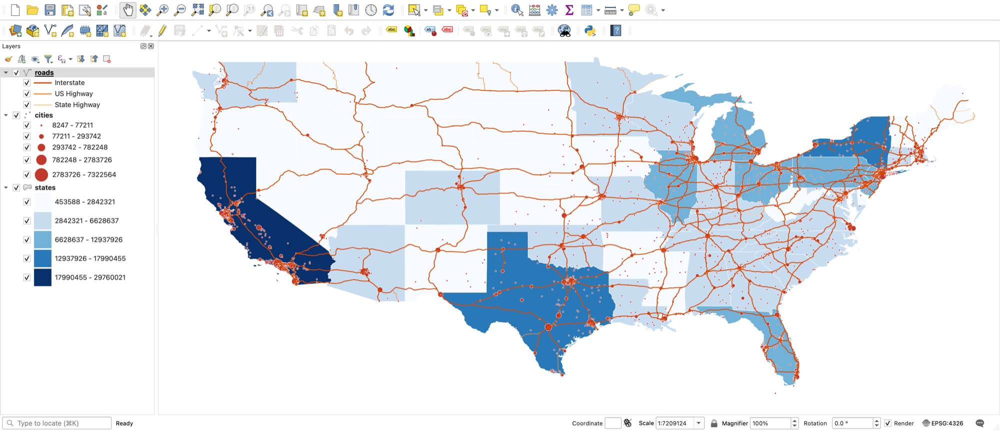

#### 3. Lines and points

- Lines: **Categorized** on `ADMN_CLASS` (Interstate, US Highway, State Highway) is the one that reads well here, or use **Symbol layer type > Simple Line** with a wider casing underneath (add a second symbol layer, wider and darker, and move it down).
- Points: **Graduated** on `POP1990` with **Method = Size** instead of Color. Cities now scale with population. Set a sensible size range (1 to 6 mm).

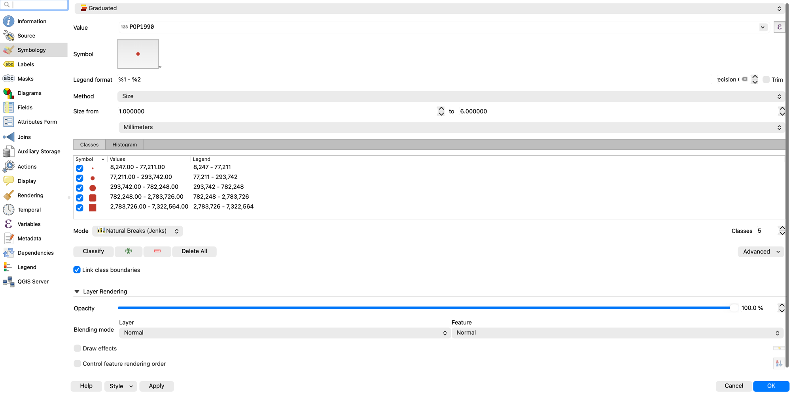

#### 4. Labels

1. Properties > **Labels** > **Single Labels**, Value = `STATE_NAME`. Set font size 8, **Buffer** on (white, 1 mm). Placement for polygons: **Horizontal**.
2. For cities, label by name but only the big ones: in the Value box switch to the expression editor and use `CASE WHEN "POP1990" > 500000 THEN "CITY_NAME" END`. Empty results draw no label.

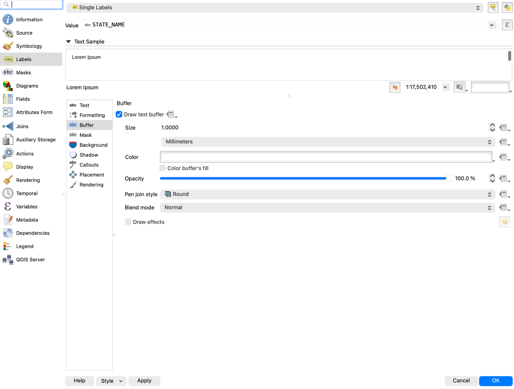

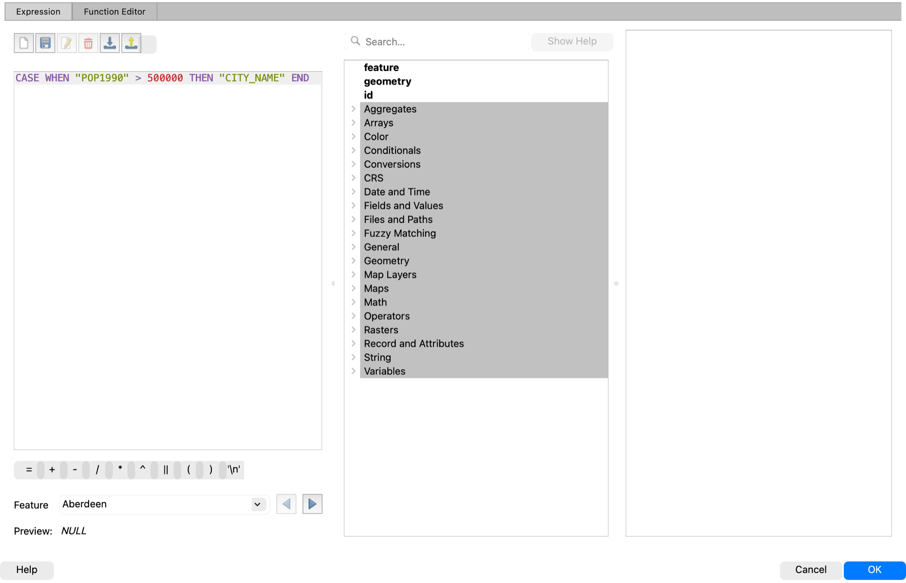

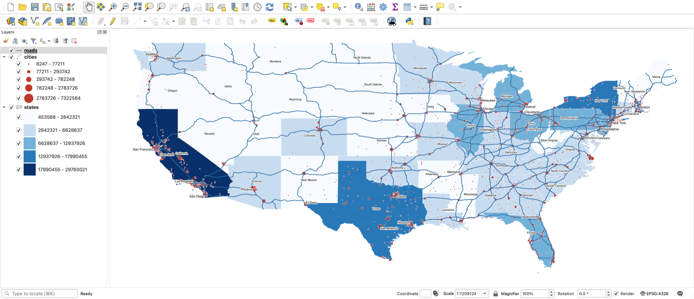

#### 5. The attribute table drives everything

1. Open the cities **Attribute Table**. Click a column header to sort. Selected rows highlight on the map and the reverse.
2. **Select Features by Expression**: `"POP1990" > 1000000`. Eight cities match; the count shows in the status bar.
3. **Field Calculator**: create a new decimal field `pop_k` with expression `"POP1990" / 1000`. New fields need editing on; QGIS toggles it for you. Save.

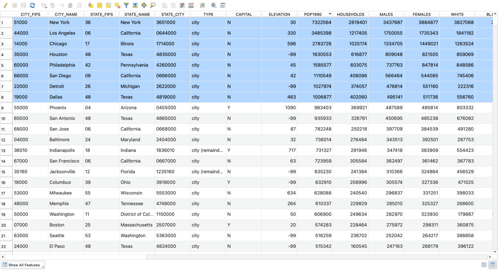

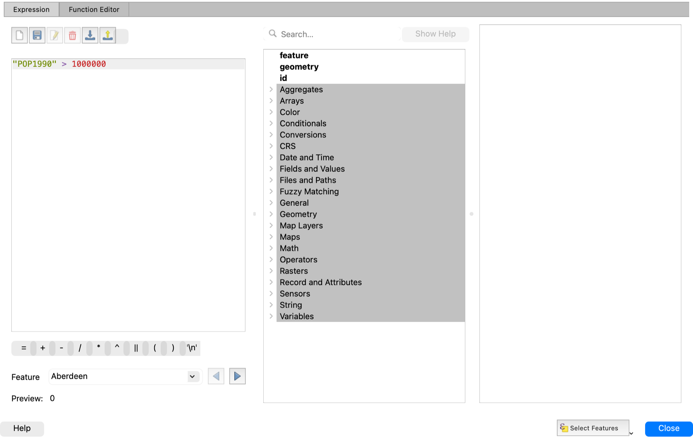

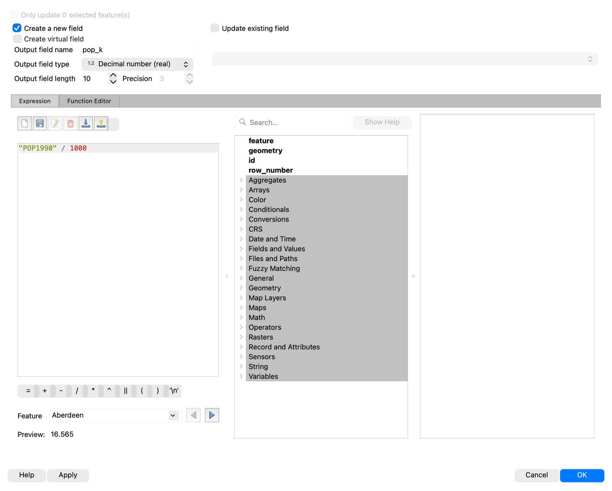

#### 6. A layout with the required elements

1. **Project > New Print Layout**, name it. **Add Item > Add Map**, drag a rectangle. Set the map scale in the Item Properties panel.
2. **Add Item > Add Legend**. Untick **Auto update** to rename entries.
3. **Add Item > Add Scale Bar**, **Add North Arrow**, **Add Label** for the title, and a small label for author, date, data source, and projection. That is the required list from "What's In A Map."
4. **Layout > Export as Image** (PNG) or **Export as PDF**.

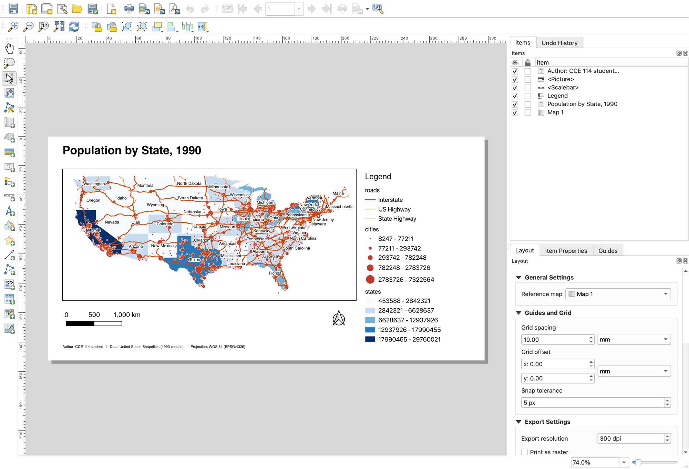

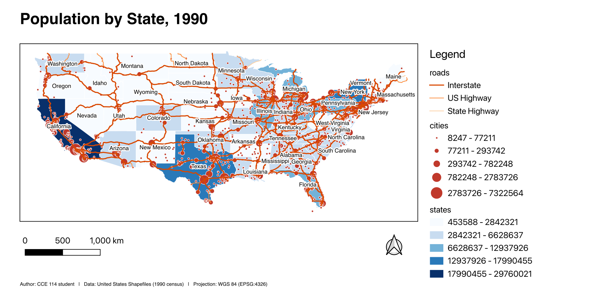

### Student activity

Students make their own version: any categorized or graduated states, sized cities, labels, and the layout with all the elements. A screenshot of the map canvas or the exported image goes to **In Class Activity: Playing with Symbology** on Learning Suite. Full credit for a visibly styled map with labels.

### BYU Belonging Map pitch (last 6 minutes)

The Belonging Map is due Wednesday of Week 6. It is one layout: where the event was, a photo of the group, and anything else mappable. Show the shortest path so nobody is scared of it:

1. Find the venue's latitude and longitude in Google Maps (right-click the spot; the coordinates copy).
2. Make a one-line CSV in any text editor: `name,lat,lon` on line one and `Marriott Center,40.2578,-111.6487` on line two. Save as `event.csv`.
3. **Layer > Add Layer > Add Delimited Text Layer...**, choose the file, X field = lon, Y field = lat, Geometry CRS EPSG:4326. Add.
4. Add the Google satellite basemap from XYZ Tiles, style the point, add a label.
5. **Project > New Print Layout**, add the map, a title, legend, scale bar, north arrow, and **Add Item > Add Picture** for the group photo. **Export as PDF**. That PDF is the submission.

Week 4 uses the same CSV trick for the class GPS points, so this is not wasted.

### Common snags

- **Categorized shows one color for everything.** They forgot **Classify**, or the Value field is not chosen.
- **Labels do not appear.** Labels are on but the layer's rendering scale is off, or the font is white on white. Turn the buffer on.
- **Legend is a mess.** Untick Auto update, then remove or rename entries.
- **Export looks nothing like the layout.** They exported the map canvas with **Project > Import/Export > Export Map to Image** instead of exporting from the layout window.
- **Field Calculator is greyed out.** The layer is a read-only format or is not in edit mode; tick **Create a new field** and QGIS will start editing.
