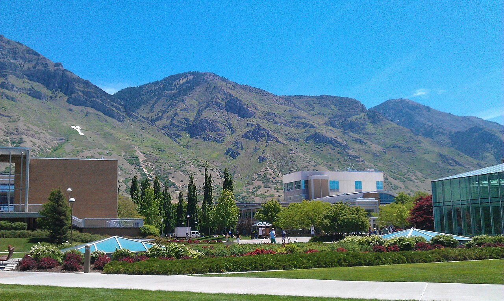

# Week 4 Hands-On Campus Field Trip

**Hands-On Practice**{ .badge .badge-handson } · *Day 7 · Thursday of [Week 4 — The Global Positioning System](../weeks/week-04.md)*

### Topics

- Collect phone GPS readings on campus
- Import them into QGIS and convert to UTM meters
- Compare readings from the same site

<!-- runsheet -->
Collect GPS readings at three campus sites, map them in QGIS, and compare their spread.
This prepares you for [Lab 3](../assignments/lab-03/README.md).



*BYU main quad. Photo: [Ricardo630 / Wikimedia Commons](https://commons.wikimedia.org/wiki/File:Byu_campus_in_summer.jpg),
[CC BY-SA 3.0](https://creativecommons.org/licenses/by-sa/3.0/); resized.*

### What you need

- **QGIS 3.44 LTR** and a folder named `Week04_GPS`.
- A phone app showing **latitude and longitude in decimal degrees**, preferably five or more
  decimal places. Keep every digit; more digits do not guarantee better accuracy.
- The **GPS activity** spreadsheet on Learning Suite and the
  [Lab 3 site list](../assignments/lab-03/README.md#step-1-gather-gps-coordinates-in-the-field-group-effort).

**Practice files:** [CSV](data/week-04/practice_gps.csv) ·
[Completed QGIS project](data/week-04/week04-practice.zip).
These contain **nine simulated readings at three demo sites**, not real field observations.
Do not submit them as fieldwork. To open the project, unzip it and open `week04-practice.qgz`;
keep its CSV and GeoPackage beside it. No online basemap is needed.

**Use the pictures:** pause at each checkpoint. Click a QGIS screenshot to enlarge it.
Screenshots show QGIS 3.44 on macOS; Windows borders and shortcuts may differ.

### The trip your coordinates take


The **project CRS** controls the map display. The **layer CRS** describes its stored coordinates.
Changing the project badge does not convert degrees to meters; **exporting to a new CRS does**.

### 1. Collect three positions outdoors

1. Form groups of two or three. Choose **three sites** from the Lab 3 list and agree on the
   exact spot at each. Be back at the instructor's return time.
2. Each person records their own reading at each site. Arrange a shared device if needed.
3. Enter your **name, site, latitude, and longitude** in the class sheet. Keep every digit.
   BYU latitude is about **40.25**; longitude is about **−111.65**. Keep the minus sign;
   leave out `N`, `W`, and degree symbols.
4. Enter all three rows before returning. Note buildings, trees, or indoor locations that may
   affect reception. Report a missing position rather than inventing one.

**Check your sheet:** one row per person per site. Use consistent site names and keep your
original readings, even when they look surprising.

### 2. Download and check the CSV

Select the **GPS activity** sheet tab > **File > Download > Comma Separated Values (.csv)**.
Save as `class_gps.csv` in `Week04_GPS`. Or use the practice CSV, which begins:

```csv
name,site,lat,lon
A,Demo_A,40.24632328,-111.65018666
B,Demo_A,40.24639575,-111.65011681
C,Demo_A,40.24635004,-111.65023394
```

Keep the original download. In a working copy, remove blank/example rows and fix formatting
such as `W` suffixes. Check typos against the original readings; don't move points to tidy the map.
Longer column headings in the class sheet are fine.

### 3. Import the phone coordinates

1. In QGIS, choose **Layer > Add Layer > Add Delimited Text Layer…**.
2. Browse to your CSV. Choose **CSV (comma separated values)** and check **First record has field names**.
3. Under **Geometry Definition**, choose **Point coordinates**:

    | Setting | Practice file | Class spreadsheet |
    | --- | --- | --- |
    | **X field** | `lon` | Longitude (Decimal Degrees) |
    | **Y field** | `lat` | Latitude (Decimal Degrees) |
    | **Geometry CRS** | **EPSG:4326 — WGS 84** | **EPSG:4326 — WGS 84** |

4. Leave **DMS coordinates** unchecked. Check the preview, then click **Add** and **Close**.
5. Right-click the point layer > **Zoom to Layer**.

[](images/w4-import.png)

**Check your screen:** the practice file has **nine features in three clusters**.
Open the attribute table to check the count; zoom in to separate nearby readings.

For campus context, add your satellite basemap **below the points**. See
[Lab 1](../assignments/lab-01/README.md) if you need setup instructions.
The coordinate calculations work without a basemap.

> [!WARNING]
> **Match the CRS to the file's numbers.** Today's raw `lat,lon` values use **EPSG:4326**.
> Lab 3 Part 2's `points.csv` already contains UTM meters, so it uses **EPSG:26912**.

### 4. Save a new layer in meters

1. Click QGIS's **bottom-right CRS badge**. Search `26912`, select **NAD83 / UTM zone 12N**,
   and click **OK**. This sets the display CRS.
2. Right-click the **imported point layer** > **Export > Save Features As…**.
3. Choose **GeoPackage**, save as `Week04_GPS/class_gps.gpkg`, and name the layer `class_utm`.
   For practice, use `practice_gps.gpkg` and `practice_utm`.
4. Set **CRS = EPSG:26912 — NAD83 / UTM zone 12N**. Check **Add saved file to map** and leave
   **Save only selected features** unchecked. Click **OK**.
5. Uncheck the original CSV layer. Select the new UTM layer, then open
   **Properties > Information** to check its CRS.

[](images/w4-export.png)

*Use **Export** to convert coordinates. **Set Layer CRS** only relabels the existing numbers.*

[](images/w4-overview.png)

*The practice sites use different colors and a plain background. Your default symbol is fine.*

**Check your screen:** the points stay in place, and the **new layer** says `EPSG:26912`.
Check Layer Properties, not just the project badge.

### 5. Add easting and northing

1. Right-click the **UTM layer** > **Open Attribute Table**. Click the **pencil** to edit,
   then **Field Calculator** (the abacus).
2. Check **Create a new field**. Name it **`easting`**, choose **Decimal number (real)**,
   and enter **`$x`** without quotes. If enabled, use length 12 and precision 2.
3. The preview should be in the hundreds of thousands, not −111.65. Click **OK**.
4. Repeat for **`northing`**, using **`$y`**.
5. **Save Edits**, turn the pencil off, and scroll right to see the new columns.

[](images/w4-calculator.png)

*Easting = `$x`; northing = `$y`. Both use the layer's stored geometry.*

[](images/w4-table.png)

**Check your table:** at `Demo_A`, expect these approximate values:

| Receiver | Easting (m) | Northing (m) |
| --- | ---: | ---: |
| A | 444700.00 | 4455300.00 |
| B | 444706.00 | 4455308.00 |

Tiny rounding differences are fine. Your field readings will differ.
The copied `lat` and `lon` columns remain in degrees.

> [!TIP]
> **If `$x` gives −111.65:** select the exported **UTM layer** and try again.
> Changing the project badge won't fix a calculation on the degree layer.

**Cross-check:** enter one reading in the [Lab 3 converter](https://tagis.dep.wv.gov/convert/).
Input: **Lat/Lon WGS 1984**. Output: **UTM NAD83 Zone 12N**, not its Zone 17N default.
For large differences, check zone, signs, coordinate order, and units. Datum transformations
can affect the last digits; this is a phone-GPS exercise, not a survey-grade conversion.

### 6. Measure the spread

1. Zoom in on readings from **one site** (`Demo_A` in the practice file).
2. For labels, open **Layer Properties > Labels > Single Labels**, set **Value = name**,
   and click **OK**. The screenshot also uses the layer filter `"site" = 'Demo_A'`.
3. Choose **View > Measure > Measure Line**, or the ruler button. Set units to **meters**.
   Click two point centers; right-click to finish. Zoom closer if needed.
4. Practice receivers **A and B are about 10 m apart**: 6 m east and 8 m north gives
   √(6² + 8²) = **10 m**. QGIS's ellipsoidal measurement may differ slightly from this UTM check.

[](images/w4-scatter.png)

*Compare readings taken at the same spot.*


**Discuss:** How might buildings, reflections, sky view, or slightly different standing positions
explain the spread? A tight cluster shows agreement, not necessarily the true position.
Satellite imagery is context, not a surveyed reference.

**Optional mean:** search **Mean coordinate(s)** in the **Processing Toolbox**. Input = the
UTM layer; **Unique ID field = site**; leave weights blank. This gives one mean per site.
Averaging may reduce random variation, but not a shared bias. Lab 3 instead asks you to
average latitude/longitude **before** converting to UTM.

### What to turn in

For **5 points**, enter **three real readings** in the class sheet. On Learning Suite, open
**In Class Activity: GPS Class Activity**, record completion, and enter your three site names.
Practice data and screenshots do not replace field readings.

**Save your work:** **Project > Save As…** in `Week04_GPS`. Keep the CSV and GeoPackage there
too; the `.qgz` does not contain the source data.

**Next: Lab 3.** Collect its **seven sites**, calculate group averages, and follow its conversion
and mapping steps, including corrected positions, a campus polygon, and a layout.
Today's activity is practice, not a substitute for the lab.

### If your screen looks different

| Problem | Fix |
| --- | --- |
| CSV is a table with no points | Use **Add Delimited Text Layer > Point coordinates** and set X/Y. |
| Add is disabled or rows are missing | Check numeric values, blanks, delimiters, and `N`/`W` suffixes. Read the import message. |
| Points are outside Utah or missing | Check **X = longitude**, **Y = latitude**, negative longitude, and source CRS **4326**. Swapping BYU coordinates can produce an invalid latitude. |
| Three dots instead of nine | Zoom in; each cluster contains three readings. Check the table count. |
| `$x` is around −111 | Select the exported **26912** layer. |
| Calculations are blank or partial | Clear the selection, calculate all rows, and save edits. |
| Points jump after export | Check the original CRS. Convert with **Export > Save Features As**, not **Set Layer CRS**. |
| No satellite imagery | Check internet access and layer order, or continue without it. |

*Controls: [QGIS 3.44 manual](https://docs.qgis.org/3.44/en/docs/user_manual/managing_data_source/opening_data.html).
Screenshots and practice results were produced in QGIS 3.44.*
