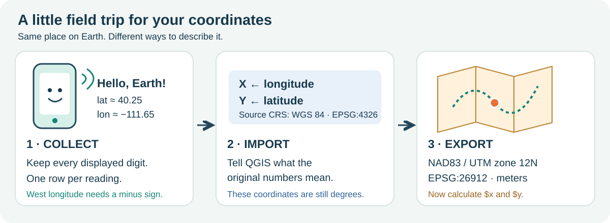
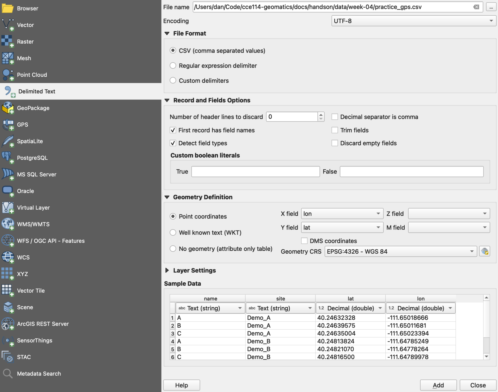
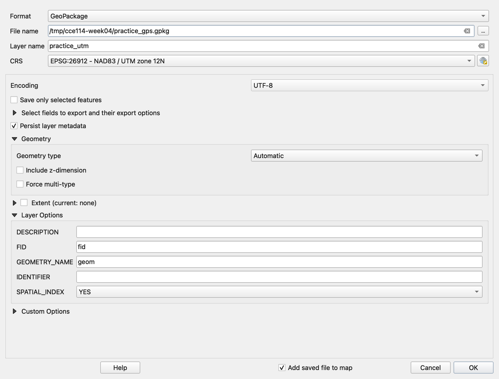
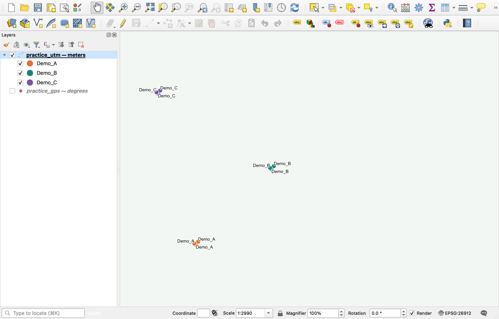
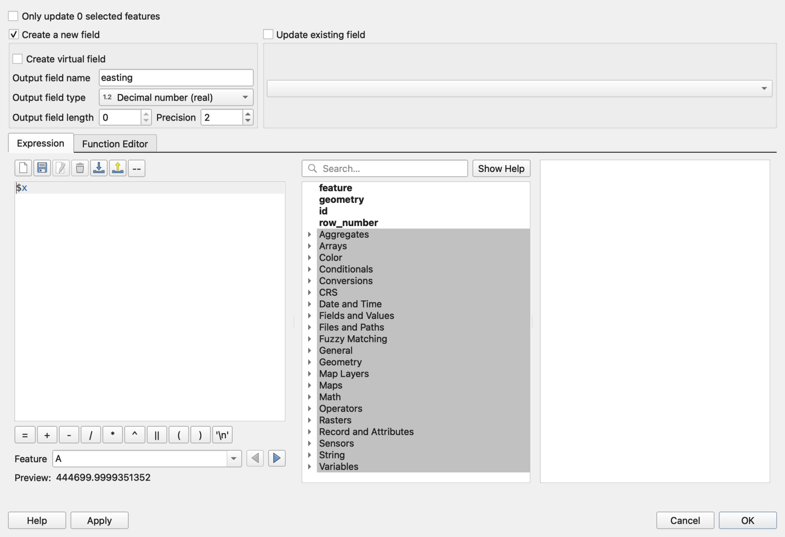
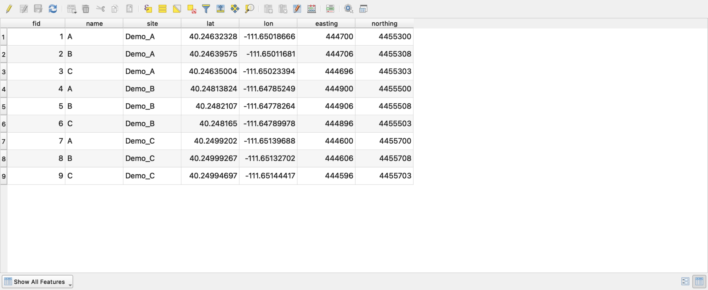
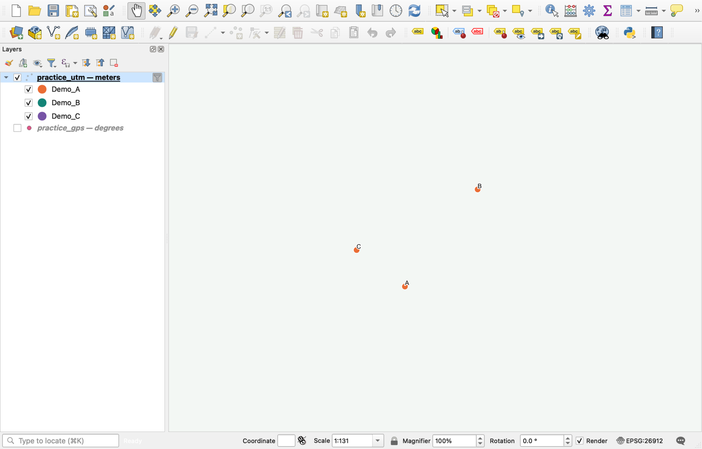
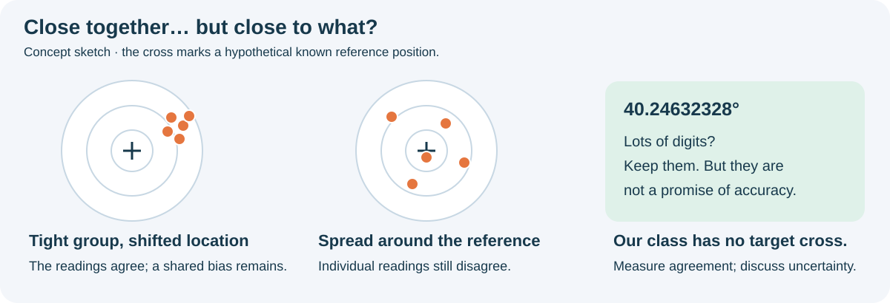

# Week 4 Hands-On — GPS Field Collection and Importing the Class Data

**Hands-On Practice**{ .badge .badge-handson } · *Day 7 · Thursday of [Week 4 — The Global Positioning System](../weeks/week-04.md)*

### Topics

- Twenty minutes on campus collecting positions with your phone
- Importing the class points into QGIS from a CSV, assigning the CRS, and reprojecting to UTM
- Comparing the spread of GPS readings taken at the same site

<!-- runsheet -->
This session gets you ready for [Lab 3](../assignments/lab-03/README.md). Collect three
phone positions, turn the class spreadsheet into a map, and measure how much readings at the
same place disagree. Follow along with the pictures; pause at each **Check your screen**. Click any QGIS screenshot
to open the full-size image.

### What you need

- **QGIS 3.44 LTR** and a folder called `Week04_GPS` where you can keep your files together.
- A phone app that displays **latitude and longitude in decimal degrees**. Keep every digit it
  provides; five or more decimal places are useful for this exercise. More displayed digits
  do **not** guarantee a more accurate position.
- The **GPS activity** class spreadsheet, linked from Learning Suite. Use the location list in
  [Lab 3, Step 1](../assignments/lab-03/README.md#step-1-gather-gps-coordinates-in-the-field-group-effort).
- For a rehearsal: **[download practice_gps.csv](data/week-04/practice_gps.csv)**.
  It has nine **synthetic** readings: three fictional receivers at each of three demo sites
  around campus. These are teaching examples, not observations or surveyed landmarks. Do not
  submit them as fieldwork.

If you need to catch up, **[download the completed practice project](data/week-04/week04-practice.zip)**,
unzip it, and open `week04-practice.qgz`. Keep the CSV and GeoPackage beside the project.
The checkpoint works without an internet basemap. Start with the CSV if you want to practice
all the clicks yourself.

### The trip your coordinates take



The **project CRS** controls how QGIS displays your map. The **layer CRS** describes the
coordinates stored in a particular dataset. Changing the bottom-right project badge does not
rewrite the CSV or turn its degree values into meters. **Exporting to a new CRS does.**

### 1. Collect three positions outdoors

1. Work in groups of two or three. Choose **three sites** from the Lab 3 list and agree on the
   exact spot at each site. Follow the instructor's return time.
2. Each person records their own reading at each site, even when standing together. If someone
   has no GPS device, arrange a shared device with the instructor.
3. Copy every displayed digit into the class sheet: your name, a consistent site name,
   latitude, longitude. Around BYU, latitude is about **40.25** and longitude about **−111.65**.
   Use a minus sign for west; do not append `N`, `W`, or a degree symbol to the numeric cells.
4. Enter all three rows before you return. Note buildings, tree cover, or an indoor location
   that might affect reception. If a phone cannot obtain a position, report that; do not invent one.

**Check your sheet:** one row is one person's reading at one site. Use the same site name for
readings you want to compare. Preserve your original readings even if they look surprising.

### 2. Download and inspect the CSV

In the class sheet, select the **GPS activity** tab, then **File > Download > Comma Separated
Values (.csv)**. Save it as `class_gps.csv` in `Week04_GPS`. For the rehearsal, use the practice
CSV instead. Its first three rows look like this:

```csv
name,site,lat,lon
A,Demo_A,40.24632328,-111.65018666
B,Demo_A,40.24639575,-111.65011681
C,Demo_A,40.24635004,-111.65023394
```

*The exact practice values are shown in the download and the QGIS screenshots below.*

Keep a copy of the original class download. In a working copy, remove demonstration rows and
empty rows; correct obvious formatting problems such as a `W` suffix. Verify suspected typos
against the original reading rather than moving points just to make the map look tidy.
The class sheet's longer column headings are fine: choose the equivalent columns in step 3.

### 3. Import the phone coordinates

1. Open QGIS. Choose **Layer > Add Layer > Add Delimited Text Layer…**.
2. Beside **File name**, browse to your CSV. Choose **CSV (comma separated values)** and make
   sure the first record supplies the field names.
3. Under **Geometry Definition**, choose **Point coordinates** and use these settings:

    | Setting | Practice file | Class spreadsheet |
    | --- | --- | --- |
    | **X field** | `lon` | Longitude (Decimal Degrees) |
    | **Y field** | `lat` | Latitude (Decimal Degrees) |
    | **Geometry CRS** | **EPSG:4326 — WGS 84** | **EPSG:4326 — WGS 84** |

4. Leave **DMS coordinates** unchecked; these numbers are decimal degrees. Check the data
   preview, then click **Add** and **Close**.
5. Right-click the point layer in the **Layers** panel > **Zoom to Layer**.

[](images/w4-import.png)

*Read the three settings together: **X = lon**, **Y = lat**, **Geometry CRS = 4326**.
The filename will be different on your computer.*

**Check your screen:** the practice file imports **nine features**. At campus scale they look
like **three clusters**, because the three readings at each site are close together. Open the
attribute table to check the count; three visible dots does not mean six readings disappeared.

For geographic context, add your satellite basemap from the earlier labs and keep it **below**
the points in the Layers panel. If you have not set one up, follow
[Lab 1's basemap instructions](../assignments/lab-01/README.md). A basemap is helpful for checking
that the class points land around campus, but is not required to calculate coordinates.

> [!WARNING]
> **Today's CSV and Lab 3's CSV start at different stages.** Today you are importing raw phone
> `lat,lon` values, so use **EPSG:4326**. In Lab 3 Part 2, `points.csv` contains the X/Y coordinates
> you already converted to UTM meters, so its import CRS is **EPSG:26912**. Choose the CRS that
> describes the numbers in the file, not whichever CRS the project happens to use.

### 4. Save a new layer in meters

1. Click the **CRS badge at the bottom right** of QGIS. Search for `26912`, select
   **NAD83 / UTM zone 12N**, and click **OK**. This sets the project's display CRS.
2. Right-click your **imported point layer** > **Export > Save Features As…**.
3. Set **Format = GeoPackage**. Browse to `Week04_GPS` and name the file `class_gps.gpkg`
   (or `practice_gps.gpkg` for the rehearsal). Set **Layer name = class_utm**
   (or `practice_utm`).
4. Set **CRS = EPSG:26912 — NAD83 / UTM zone 12N**. Keep **Add saved file to map** checked.
   Export all readings, not just selected features. Click **OK**.
5. Uncheck the original CSV layer so you only see the exported points. Click the new UTM
   layer to make it active. Right-click it > **Properties > Information** to verify its CRS.

[](images/w4-export.png)

*The output CRS is the essential change. This creates new geometry coordinates in meters;
merely using “Set Layer CRS” would relabel the old numbers and put them in the wrong place.*

[](images/w4-overview.png)

*The example map uses a plain background so the layer names and points are easy to see.
The three demo sites use different colors; your default point symbol is fine.*

**Check your screen:** the points remain in the same geographic locations after export. In
Layer Properties, the **new layer** says `EPSG:26912`. The project badge alone is not this check.

### 5. Add easting and northing to the table

1. Right-click the **new UTM layer** > **Open Attribute Table**. Click the **pencil** to toggle
   editing, then the **Field Calculator** button (the abacus icon).
2. Check **Create a new field**. Set **Output field name = easting** and
   **Output field type = Decimal number (real)**. In the expression box, type **`$x`**.
   If length/precision controls are enabled, use length 12 and precision 2.
3. Check the preview: it should be a number in the hundreds of thousands, not −111.65.
   Click **OK**.
4. Open the calculator again. Create a decimal field **`northing`** with expression **`$y`**.
5. Click **Save Edits**, then turn the pencil off. Scroll right to find the new columns.

[](images/w4-calculator.png)

*Repeat this screen once: change `easting` to `northing`, and `$x` to `$y`.
Do not put quotation marks around `$x` or `$y`.*

[](images/w4-table.png)

**Check your table:** for **receiver A at Demo_A**, easting is approximately **444700.00 m**
and northing **4455300.00 m**. Receiver B at that site is approximately **444706.00 m** and
**4455308.00 m**. Small last-decimal differences are harmless. Your actual class readings will
have different values. The old `lat` and `lon` columns stay in degrees; they are copied
attributes, not a second conversion of the geometry.

> [!TIP]
> **If `$x` gives −111.65, stop here.** Close the calculator, select the exported UTM layer,
> and try again. `$x` and `$y` use the layer's geometry CRS. Changing the project badge cannot
> fix a calculation on the original degree layer.

For an independent check, enter one latitude/longitude pair into the
[coordinate converter used in Lab 3](https://tagis.dep.wv.gov/convert/). Input is
**Lat/Lon WGS 1984**; output is **UTM NAD83 Zone 12N**, not the default Zone 17N.
Compare the result with the new table fields. Large differences mean you should check the
zone, signs, input order, and units. Datum transformation choices can also affect the last
few digits; this phone exercise is not a survey-grade datum transformation.

### 6. Zoom in and measure the spread

1. Pick a site with several readings. Zoom in with the mouse wheel until the points separate.
   For the practice file, use `Demo_A`.
2. If you want the example's letters beside the points, open **Layer Properties > Labels**,
   choose **Single Labels**, set **Value = name**, and click **OK**. In the screenshot only
   Demo_A is displayed, using the layer filter `"site" = 'Demo_A'`.
3. Choose **View > Measure > Measure Line** (also available from the ruler toolbar button).
   Set the measurement units to **meters**. Click the center of one reading, then the center
   of another; right-click to finish. Zoom further if it is difficult to hit the centers.
4. Compare receivers **A and B** in the practice data: their separation is about **10 m**.
   You can check this without mouse placement: √(6² + 8²) = **10 m** from the table values.
   QGIS may measure on the project ellipsoid; the planar UTM check is sufficient at this scale.

[](images/w4-scatter.png)

*All three simulated receivers represent readings at the same demo site. A and B differ by
6 m east and 8 m north. In your class dataset, compare only readings taken at the same spot.*



**Discuss:** Do the readings agree? What might buildings, reflections, sky view, or taking
readings at slightly different spots explain? A tight cluster tells you the readings agree
with one another. It does **not** prove that the cluster is at the true location. Imagery is
useful context, but it is not a surveyed reference either.

**Optional:** in the **Processing Toolbox**, search **Mean coordinate(s)**. Use the **UTM
layer** as input, choose `site` as **Unique ID field**, and leave the weight field empty.
Run it to get one mean point per site. The mean can reduce some random variation, but it
cannot guarantee removal of a shared bias. Today's projected-coordinate mean also differs
in method from Lab 3's requested mean latitude/longitude before conversion.

### What to turn in

Enter **three readings of your own** in the GPS activity class sheet. On Learning Suite, open
**In Class Activity: GPS Class Activity**, record completion, and type the three site names.
The activity is worth **5 points**. Practice data and a screenshot do not replace those readings.

Save your QGIS project with **Project > Save As…** in `Week04_GPS`; keep the CSV and GeoPackage
in that folder. The `.qgz` remembers your map setup, but it does not contain all your source data.

For **Lab 3**, collect the required **seven sites** with your group, calculate the requested
averages, and follow its conversion and mapping steps. Today's three-site activity is rehearsal;
it does not replace the lab's field observations, corrected positions, campus polygon, or layout.

### If your screen looks different

| What you see | What to check next |
| --- | --- |
| CSV appears as a table with no points | Add it through **Add Delimited Text Layer**, choose **Point coordinates**, and set X/Y. |
| Add is disabled, or some rows do not import | Check numeric values, missing cells, delimiter, and `N`/`W` suffixes. Read QGIS's import message; don't assume every row loaded. |
| Points are far from Utah, or none draw | Check **X = longitude**, **Y = latitude**, western longitude is negative, and source CRS is **4326**. Swapped BYU latitude/longitude can give an invalid latitude. |
| Three dots instead of nine in the practice map | Zoom in: each dot is a cluster of three. Check the attribute-table feature count. |
| `$x` is negative and around −111 | You are calculating on the degree layer. Select the exported **26912** layer. |
| New coordinate fields are blank or only a few rows changed | Clear any feature selection and calculate for all rows; check that you saved edits. |
| Exported points jump to a new location | Check the original layer's source CRS. Use **Export > Save Features As** to transform coordinates; do not relabel degrees as UTM with **Set Layer CRS**. |
| No satellite imagery | Check connectivity and layer order. Continue with the plain map and table; the computations work offline. |

### Instructor rehearsal and timing

Before class, run steps 2–6 with the practice CSV. You are ready when you have **nine rows**,
**three clusters**, the two expected coordinate columns, and an A-to-B distance near **10 m**.
The finished project is a recovery point if the demo gets stuck.

- Open the shared sheet and verify the current class has access. Keep historical responses
  separate from today's working copy. Display the site list and a firm return time.
- Arrange supervision of belongings while students are outdoors. Choose a manageable group of
  sites for the available field time; the complete Lab 3 list is longer than today's activity.
- Keep the CSV download and this page open. Screenshots are from **QGIS 3.44.14 on macOS**;
  the classroom's Windows window borders and shortcuts differ, but the named settings match.

| Minutes | Lead the class through | Pause and ask |
| --- | --- | --- |
| 0–6 | Opening and field instructions | “Which coordinate needs the minus sign here?” |
| 6–26 | Collect three sites; enter readings | “Did each person record their own values?” |
| 26–33 | Download CSV and import | “Which number is X? What units are in this file?” |
| 33–40 | Export to UTM; calculate fields | “Did we change the view, or create new coordinates?” |
| 40–46 | Measure same-site spread | “Do we know the true position from this cluster alone?” |
| 46–50 | Record completion; connect to Lab 3 | “Which CRS will Lab 3's already-converted CSV need?” |

If time runs short, demonstrate one complete conversion and one measurement using the practice
project, then let students finish the walkthrough after class. Preserve the real fieldwork and
completion requirements.

*Reference for the import controls: [QGIS 3.44 manual — importing delimited text](https://docs.qgis.org/3.44/en/docs/user_manual/managing_data_source/opening_data.html).
The screenshots and practice results were produced in the installed QGIS 3.44 application.*
