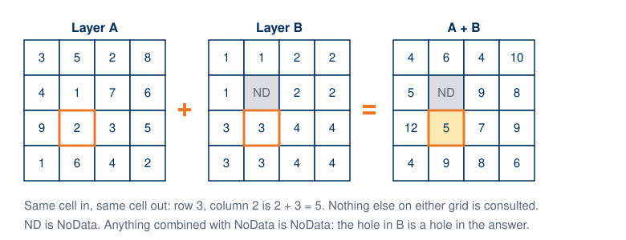
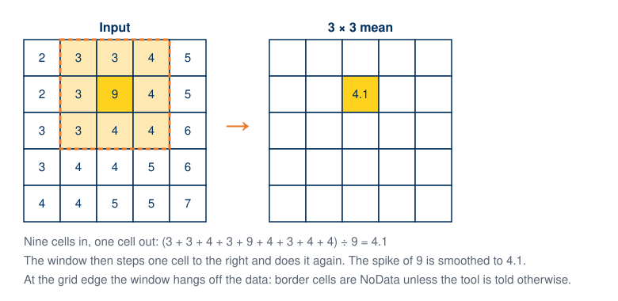

# Week 6 Hands-On — Raster Data in QGIS and an Elevation Profile

**Hands-On Practice**{ .badge .badge-handson } · *Day 11 · Thursday of [Week 6 — Working with Raster Data](../weeks/week-06.md)*

### Topics

- Load a GeoTIFF in QGIS and read the Information and Source tabs (data type, rows and columns, cell size, units, projection)
- Raster symbology: render types, singleband pseudocolor, color ramps, classification
- Elevation surfaces and cross-section profiles (View > Elevation Profile, or the Profile Tool plugin)
- Exam 1 review Kahoot in the last fifteen minutes

<!-- runsheet -->
**Feeds** [Lab 5](../assignments/lab-05/README.md) · ends with the Exam 1 Kahoot.

### At a glance

| | |
| --- | --- |
| **Goal** | Students read a raster's properties, style a DEM three ways, pull an elevation profile across a valley, and run one local and one focal raster tool. |
| **Why this week** | On Tuesday students did raster analysis by hand on engineering paper, then saw the same ideas named: cells, cell size, extent, no-data, and map algebra as *same cell in, same cell out*. Today the same ideas run on a real DEM. Lab 5 merges DEM tiles, styles them, reads elevations, and computes slope. Concepts Exam 1 is in the Testing Center next week, so the last 15 minutes are the review Kahoot. |
| **Students bring** | QGIS 3.44 (lab machines or their own laptop) and `UtahCountyDEM.tif` from [UtahCountyData.zip](https://github.com/BYU-Hydroinformatics/cce114-geomatics/releases/download/course-data-2026/UtahCountyData.zip) (they downloaded it in Week 2). A phone for Kahoot. |
| **Graded item** | *In Class Activity: DEM Profile* (5 points). Upload a screenshot showing a pseudocolor DEM with an elevation profile. |
| **Feeds** | Lab 5: Working with Raster Data. Due Saturday. |

### Practice run before class

> [!TIP]
> Twenty minutes. The elevation profile is the part worth rehearsing; the rest is symbology.

**What you need.** QGIS 3.44 LTR and `UtahCountyDEM.tif` plus `UtahCountyBoundary.shp` from
[UtahCountyData.zip](https://github.com/BYU-Hydroinformatics/cce114-geomatics/releases/download/course-data-2026/UtahCountyData.zip).
Put the boundary on top with no fill, as an outline.

**Do this, in order.**

1. Add the DEM. Right-click **Properties > Information** and check the numbers against the table in
   walkthrough step 1. Be able to say what each one means without notes; that reading is the first
   six minutes of class.
2. **Symbology > Render type: Singleband gray**, then **Singleband pseudocolor** with a terrain
   ramp, **Equal Interval**, 8 classes, **Classify**. Then try **Continuous**.
3. Duplicate the layer, set the lower copy to **Hillshade** with azimuth 315 and altitude 45, and
   drop the pseudocolor copy to about 60 percent opacity on top.
4. **Identify Features** on the DEM to see a single elevation value in meters.
5. **Properties > Elevation**, tick **Represents Elevation Surface**, Apply. This step is what
   makes the next one work.
6. **View > Elevation Profile**, click **Capture Curve**, draw a line from Utah Lake east across
   Provo to the Wasatch, right-click to finish.
7. **Raster > Raster Calculator** with `"UtahCountyDEM@1" > 1500` for a 1/0 raster, then the same
   with `2000`. Then **Raster > Analysis > Slope** on the DEM, ratio of vertical to horizontal
   units left at 1.

**You are ready when** one screenshot shows the pseudocolor DEM and the profile panel together,
with the rise from the lake to the mountains clearly readable.

**The one that bites.** The Elevation Profile panel stays stubbornly empty until the layer is
flagged as an elevation surface in step 5. If the panel misbehaves anyway, the **Profile Tool**
plugin does the same job.

### Before class

- [ ] QGIS open with the DEM loaded and the county boundary on top as an outline.
- [ ] The Exam 1 Kahoot from the Learning Suite **Kahoot** content page (*Geomatics Exam 1 Prep*) open in a second browser tab and started to the lobby screen.
- [ ] Learning Suite open to the *DEM Profile* activity.
- [ ] This page open on the projector or a second screen: the two figures in step 4 are worth showing.

### Plan (50 minutes)

| Time | Segment |
| --- | --- |
| 0:00 | Mini-devotional |
| 0:03 | Layer Properties: Information and Source; what the numbers mean |
| 0:09 | Symbology: singleband gray, pseudocolor with classes, hillshade |
| 0:17 | Identify a cell; Elevation tab; View > Elevation Profile across Utah Lake to the Wasatch |
| 0:25 | One local tool (Raster Calculator, two thresholds) and one focal tool (Slope) |
| 0:30 | Students: pseudocolor plus a profile; screenshot; upload |
| 0:35 | Kahoot: Exam 1 prep |
| 0:48 | Lab 5 pointer; Exam 1 is in the Testing Center next week |

### Walkthrough

#### 1. What is in the file

Right-click the DEM > **Properties > Information**. Read each line out loud and ask what it means.
These are the values in the course copy of `UtahCountyDEM.tif`:

| Line | Value | What to say |
| --- | --- | --- |
| **Dimensions** | 3874 columns × 2991 rows | About 11.6 million numbers, and nothing else. |
| **Pixel size** | 30, −30 | Cell size in meters, because the CRS is in meters. The −30 is only the row direction: rows count downward. |
| **CRS** | NAD83 / UTM zone 12N (EPSG:26912) | Same CRS as the county boundary, so they line up with no reprojection. |
| **Extent** | about 116 km east–west × 90 km north–south | A rectangle a bit bigger than the county; the county outline sits inside it. |
| **Data type** | Float32 | Decimal elevations, in meters. |
| **No-data value** | −3.4028235e+38 | The smallest Float32 number, used as a flag. A no-data cell is not zero; zero is an elevation. |

Elevations run from about **1,313 m** to **3,636 m**. Ask what is at each end before you say it.
The highest cell is **Mount Nebo**, at the south end of the county. The lowest is not Utah Lake: it
is on the **north edge of the DEM, where the Jordan River leaves the valley**, because the river
keeps dropping after it drains the lake.

The **Source** tab shows the file path and lets you rename the layer. Renaming changes nothing on
disk, **but it does change the name the Raster Calculator uses in step 4**, so leave it as
`UtahCountyDEM` today.

#### 2. Three ways to see one grid

1. **Symbology > Render type: Singleband gray**. Min and max stretch. Dark is low.
2. **Singleband pseudocolor**. Pick a terrain color ramp, **Mode: Equal Interval**, 8 classes, **Classify**, Apply. Then try **Continuous**. Say what "pseudo" means: the cells are elevations, not colors; the ramp is a lookup table you chose. This is the right half of Tuesday's elevation-grid slide: change the classes or the colors and you get a new picture of the same numbers.
3. **Hillshade**. Azimuth 315, altitude 45. Duplicate the layer, keep one as pseudocolor with 60 percent opacity on top of the hillshade. That pair is how most published relief maps are built.

#### 3. Reading elevations

1. **Identify Features** on the DEM: one band, one value, in meters.
2. **Properties > Elevation**: tick **Represents Elevation Surface**. Apply.
3. **View > Elevation Profile**. Click the **Capture Curve** tool, draw a line from Utah Lake east across Provo to the Wasatch, right-click to finish. The profile appears below the map. Ask where campus is on it, and what the vertical exaggeration is doing.
4. If the profile panel misbehaves on someone's laptop, the **Profile Tool** plugin (Plugins > Manage and Install) does the same job.

#### 4. One local tool, one focal tool

Tuesday's map algebra was **local**: every output cell comes from the same cell in each input, and
nothing else is consulted. That is the rule students saw on the slide:

1. **Raster > Raster Calculator**. Double-click `UtahCountyDEM@1` in the band list so the quotes
   are right, then type `> 1500`. The expression is `"UtahCountyDEM@1" > 1500`. Run it: a 1/0
   raster of everything above 1,500 m. Tuesday's engineering-paper reclass was this, done by hand.
2. **Change the number once.** Run it again with `2000`. The threshold is a choice, and a raster
   tool makes it cheap to test. Measured on the course DEM:

    | Threshold | Area above it | Share of the DEM's cells |
    | --- | ---: | ---: |
    | 1,500 m | about 8,460 km² | 82 % |
    | 2,000 m | about 5,790 km² | 56 % |

    Ask what each one would mean as a building rule, and whose decision the number is.

Then show a tool that is **not** local. Slope cannot be computed from one cell: it needs the
neighbors. That makes it a **focal** tool. A 3 × 3 window steps across the grid and writes one
number at every stop:

The figure shows a mean, because the arithmetic fits on one line. Slope uses the same window with a
different formula: how fast elevation changes across those nine cells.

Now run it: **Raster > Analysis > Slope**. Input the DEM; leave **Ratio of vertical units to
horizontal** at 1, because both the elevations and the cell size are in meters. Run. Style the
result pseudocolor. Lab 5 asks for exactly this. Point at the outermost ring of cells: the window
hangs off the edge there, as in the figure.

### Student activity

Students style the DEM as singleband pseudocolor with at least five classes, draw an elevation profile across the county, and take one screenshot that shows the map and the profile panel together. Upload it to **In Class Activity: DEM Profile** on Learning Suite. Full credit for pseudocolor plus a profile.

### Kahoot (15 minutes)

Start the *Geomatics Exam 1 Prep* Kahoot from the Learning Suite Kahoot page. Students join with the PIN on their phones. Read the questions that get the most wrong answers twice; those are the ones to review before the exam. Remind them the Testing Center closes early on some days and the exam is closed book.

### Common snags

- **The DEM draws as a flat gray square.** Min and max are not set. Symbology > Min/Max Value Settings > **Cumulative count cut**, Apply.
- **"Represents Elevation Surface" is missing.** They are on an older QGIS. The Profile Tool plugin covers it.
- **Raster Calculator says the expression is invalid.** The layer has been renamed, or the name was typed by hand. Double-click the layer in the band list instead of typing, so the name and quotes are exactly what the dialog expects.
- **Slope output is nearly all 90° or nearly all 0°.** The DEM is not the course copy: someone downloaded a DEM in a geographic CRS (EPSG:4326), whose cell size is in degrees while the elevations are in meters. Reproject it to EPSG:26912 first with **Raster > Projections > Warp (Reproject)**. The course DEM is already in meters and does not have this problem.
- **Kahoot PIN will not join.** Refresh the lobby; the BYU network sometimes blocks the first attempt.

#### Links

- [Exams](../policies/exams.md)
- Tuesday's deck: [Raster Analysis and Map Algebra](https://byu-hydroinformatics.github.io/cce114-geomatics/slides/day-10/raster-analysis-and-map-algebra.html)

<!-- 2026-10-05: values in the step 1 table and the threshold table were read from the course copy of UtahCountyDEM.tif with GDAL (QGIS 3.44.14). The two figures in step 4 come from the CE 414 Week 3 decks (redrawn SVGs, no third-party source). The DEM is an unclipped rectangle, so the threshold shares are of the DEM's 11.43 million data cells, not of Utah County. -->
