<!-- _class: lead -->
<!-- _paginate: skip -->

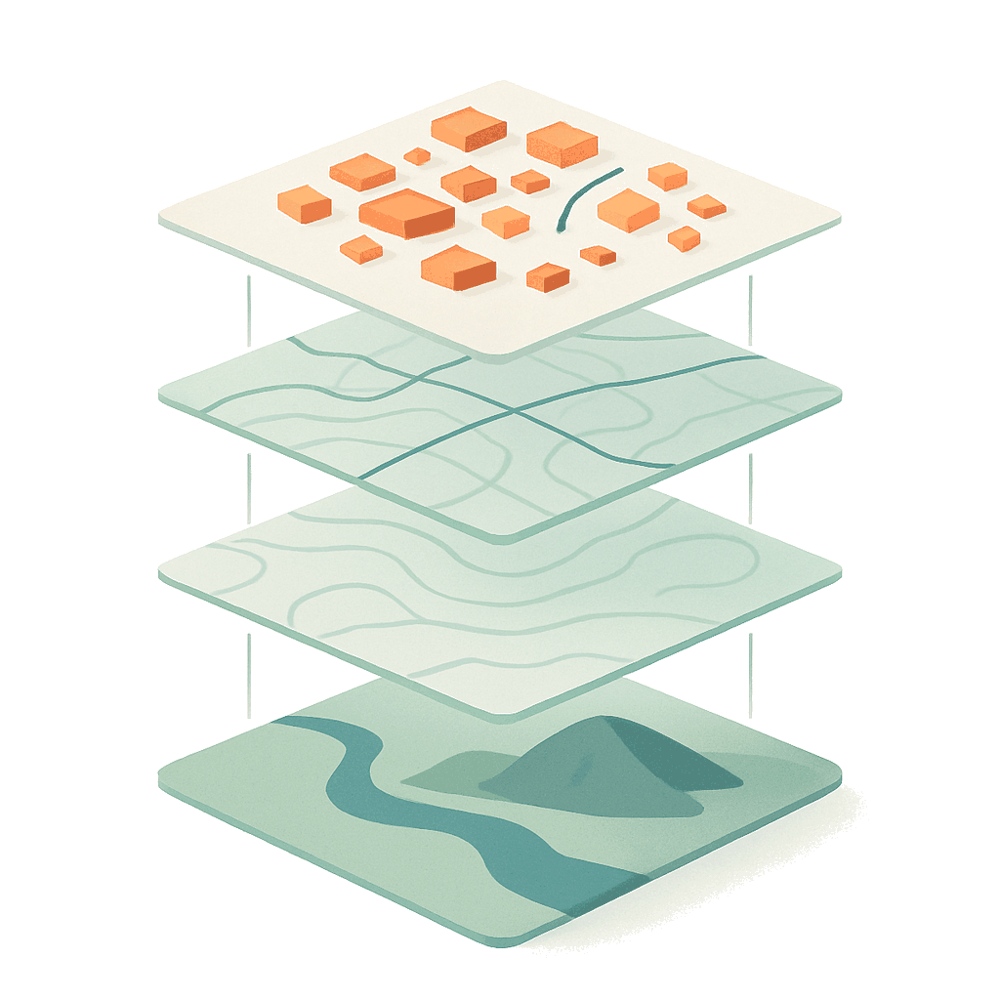

# Introduction to Geographic Information Systems

CCE 114 Geomatics
Dr. Dan Ames and Dr. James Halgren

---

# Today's Goals

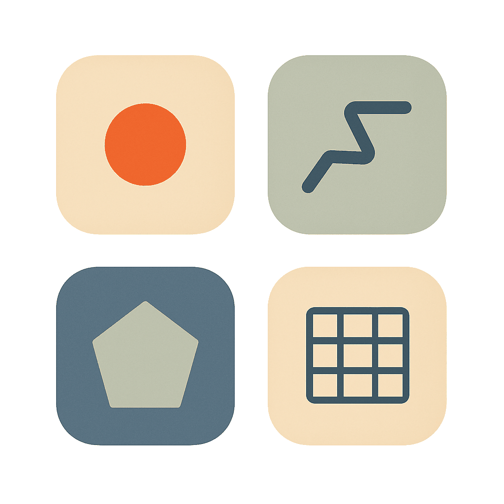

- By the end of class you should be able to:
  - Say what a GIS is — and what it is not
  - Identify the three vector feature types: points, polylines, polygons
  - Explain how an attribute table connects to features on a map
  - Name two ways a civil or environmental engineer uses GIS
- Software for this course: **QGIS** — free, open source, runs on Mac and Windows

<!-- Set expectations for the hour. Note the software change: this course now uses QGIS, not ArcGIS Pro. QGIS is free and cross-platform, so students install it themselves rather than relying on a lab license. -->

---

<!-- _class: quiz -->

# What is GIS?

<ol type="A">
<li>Geographic Information System</li>
<li>Maps</li>
<li>A database</li>
<li>Hardware, software, and data</li>
<li>All of the above</li>
</ol>

<!-- Pre-assessment — take a show of hands before revealing. Answer is E: a GIS is all of these together. Don't correct wrong answers yet; slide 8 does the real definition. -->

---

<!-- _class: quiz -->

# Which would you NOT use GIS&nbsp;for?

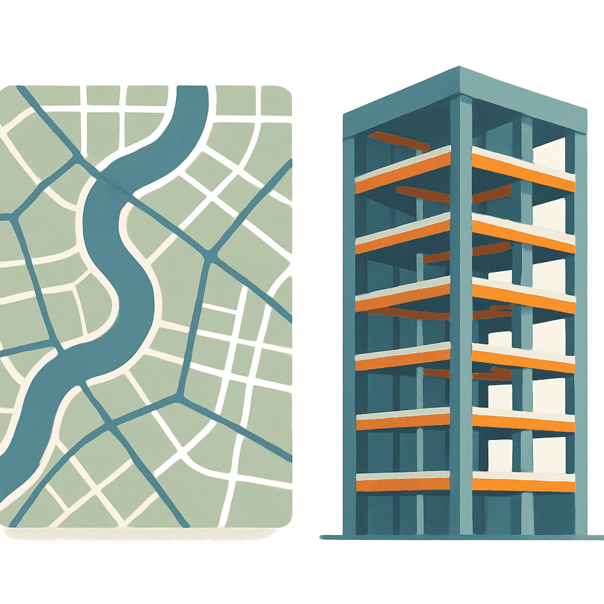

<ol type="A">
<li>Determining where to place an airport</li>
<li>Flooding after a hurricane in North Carolina</li>
<li>Designing a high rise building</li>
<li>Managing the city's infrastructure</li>
<li>Traveling to a friend's house with your smart phone</li>
</ol>

<!-- Answer is C, designing a high rise building — that's a CAD/BIM task. Worth acknowledging GIS still gets used for siting and context around a high rise, so the distinction is about the design work itself, not the project. -->

---

<!-- _class: quiz -->

# What is the name of the GIS software we will use in this class?

<ol type="A">
<li>Civil 3D</li>
<li>GRASS</li>
<li>QGIS</li>
<li>ArcGIS Pro</li>
<li>AutoCAD</li>
</ol>

<!-- Answer is C: QGIS. Most students will guess ArcGIS Pro if they've heard of GIS before, or Civil 3D from other CCE courses — that's the teachable moment. Mention it's free, open source, and theirs to keep after graduation. -->

---

<!-- _class: activity -->

# What is your "Spatial Identity"?

- Where were you born?
- Where did you grow up?
- Where have you travelled/served a mission?
- Where do you want to travel?
- What is your favorite foreign food?
- Where would be the best marriage proposal location?

How do these places contribute to who you are as a person?

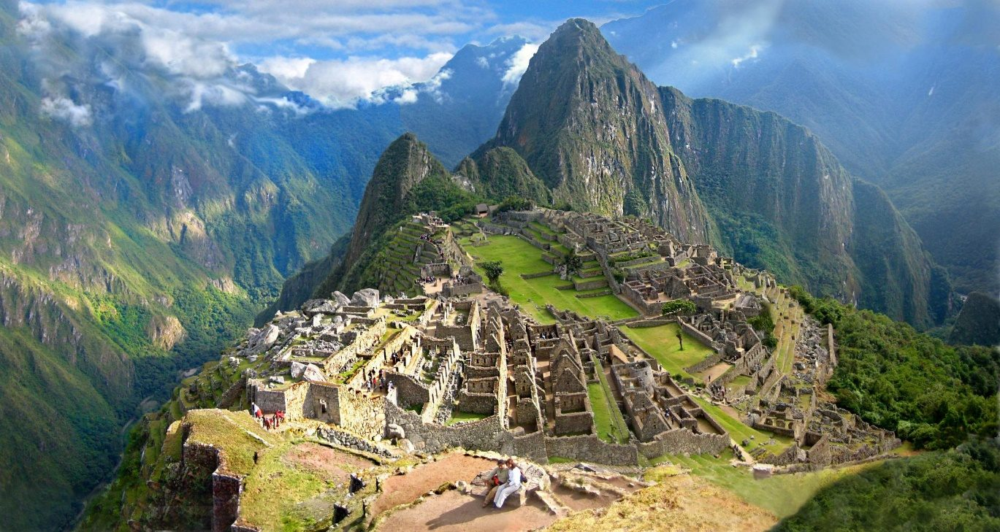

<!-- People are spatially oriented by nature. We think about where we've been, where we're at and where we're going all the time. This contributes to our "spatial identity" and is a major part of who we are as individuals. Let's play a little getting to know you game by answering these questions. -->

---

<!-- _class: activity -->

# A "Getting to Know You" Activity

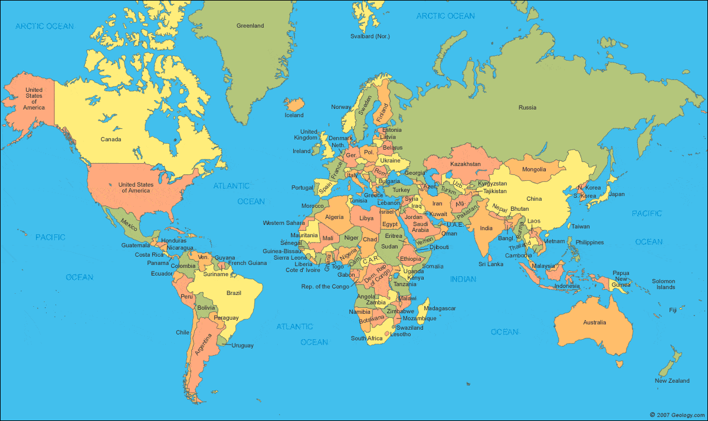

- How does your spatial identity contribute to who you are as a person?
- Take a minute to get to know the other students in the class and to understand their spatial identity and how it is similar/differs from yours.

<!-- Let's see what your answers look like spatially… Imagine this map projected onto the floor of our classroom with Greenland near the whiteboard and Australia at the back of the room. Now go stand in the places that match your answers to these questions: Where are your primary ancestors from? Where were you born? Where would you go on vacation this year if money was no object?

As you go to different parts of the room/world, take a minute to get to know the other students in the class and to understand their spatial identity and how it is similar/differs from yours. -->

---

# What is a Geographic Information System?

- Computer software and hardware for integrating
  - Spatial features
  - Attribute data
  - Analysis tools

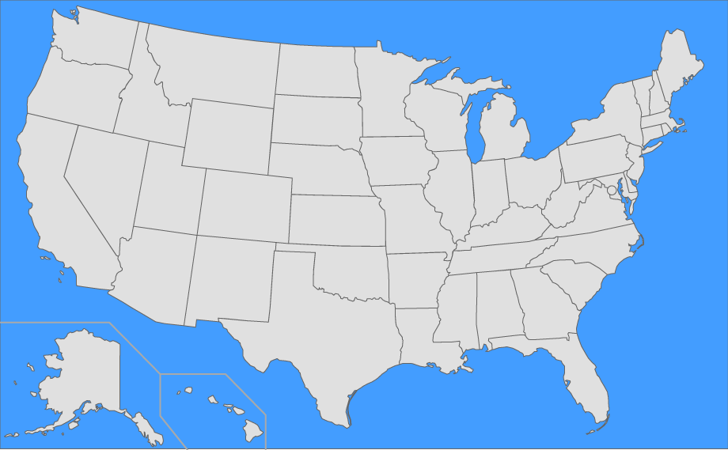

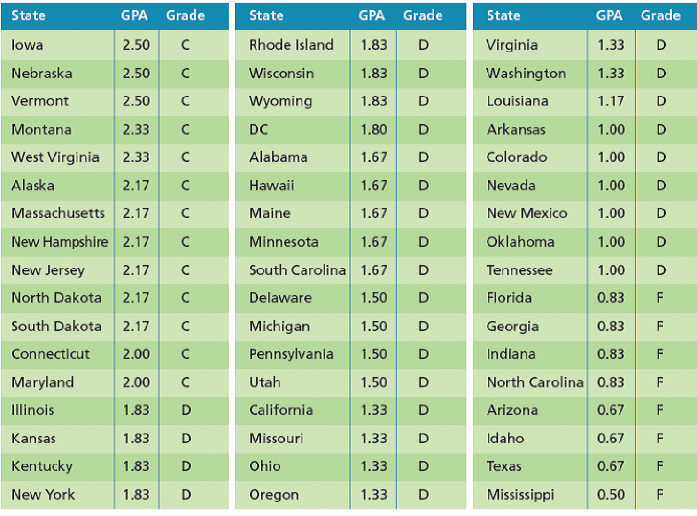

<!-- Spatial features (the state polygons) link to attribute data (the GPA table) — each state on the map has a row in the table. -->

---

# Polygon Features

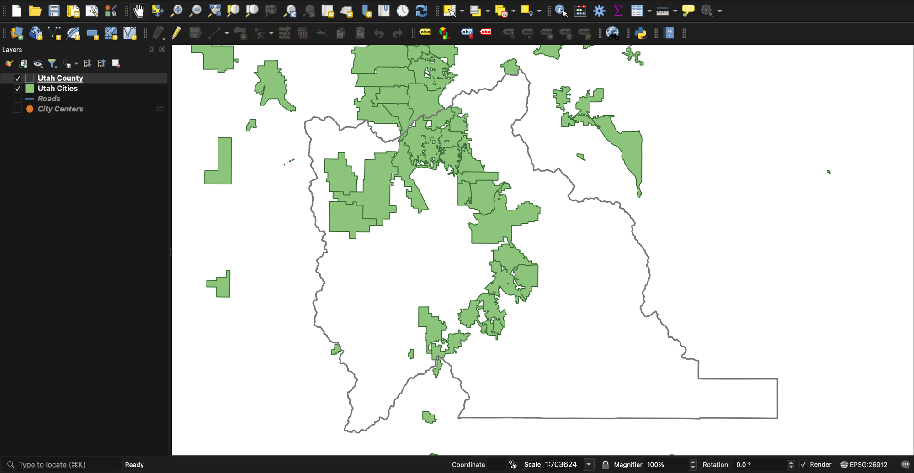

<!-- This is QGIS 4.2 — what students will see when they install it. Point at the Layers panel on the left: the checkbox controls visibility, and the order controls what draws on top. Polygons here are Utah city boundaries. -->

---

# Polyline Features

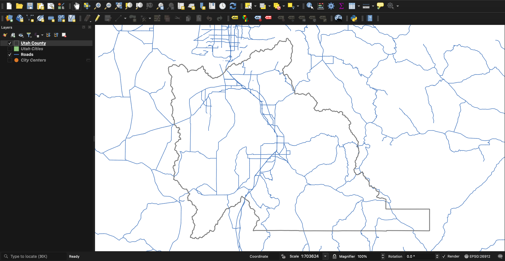

<!-- Same project, roads layer turned on instead. Polylines have length but no area. Ask: is a river a polyline or a polygon? (Depends on scale — good discussion.) -->

---

# Point Features

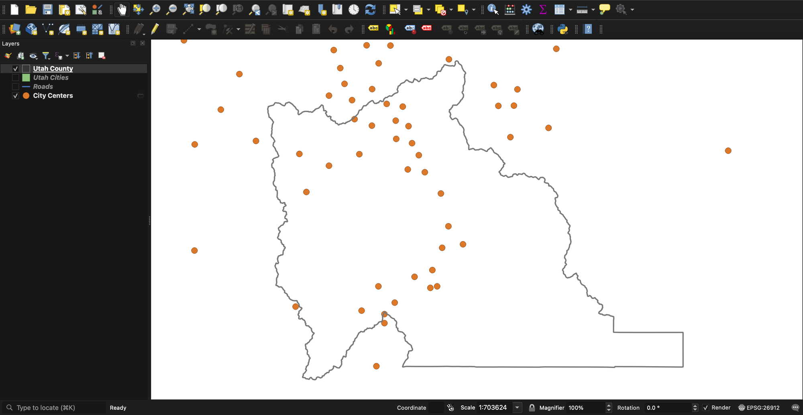

<!-- Points are city centers derived from the city polygons. Ask what a point loses compared to a polygon — area, shape, boundary. -->

---

# Attribute Table

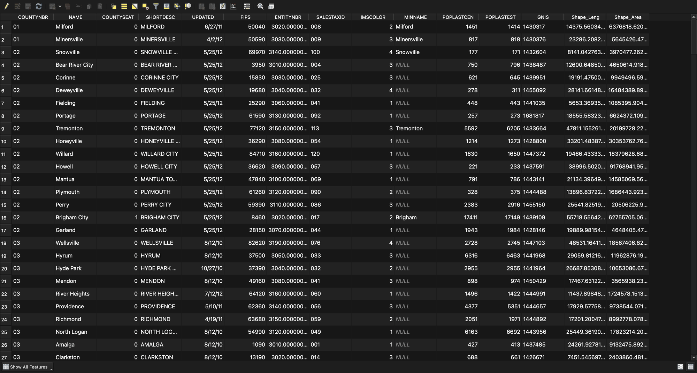

<!-- One row per feature, one column per attribute. Point out Shape_Leng and Shape_Area: QGIS carries geometry-derived fields too. Select a row in the live demo to show the map/table link. -->

---

# Bringing It All Together…

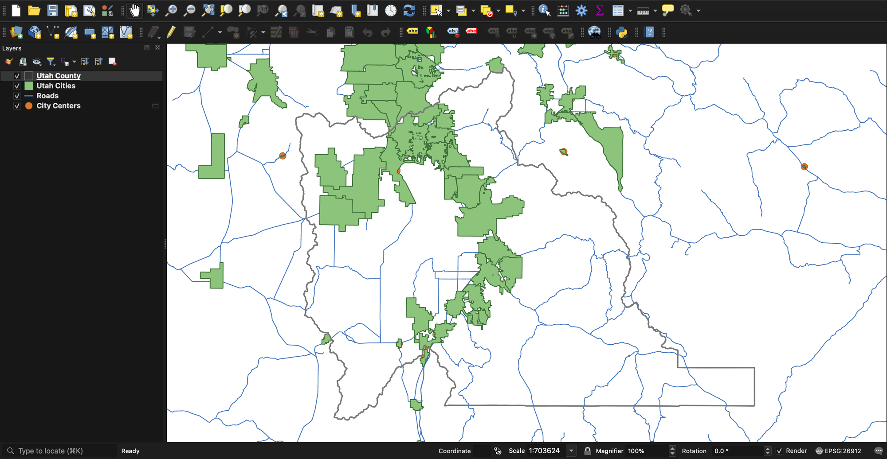

- Do you see points? Polylines? Polygons?
- Do you see the attribute table?
- QGIS live demo…

<!-- All three feature types plus the attribute table. This is the payoff slide — everything they'll do in Lab 1 is visible here. -->

---

# Analysis Tools

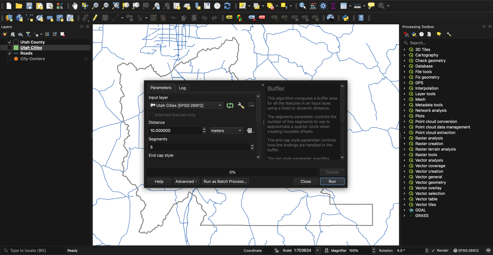

<!-- Processing Toolbox is the QGIS equivalent of ArcToolbox. Buffer is the classic first tool: it answers 'what is within X distance of this feature?' Don't run it here — save it for the live demo. -->

---

# Live Demo — QGIS

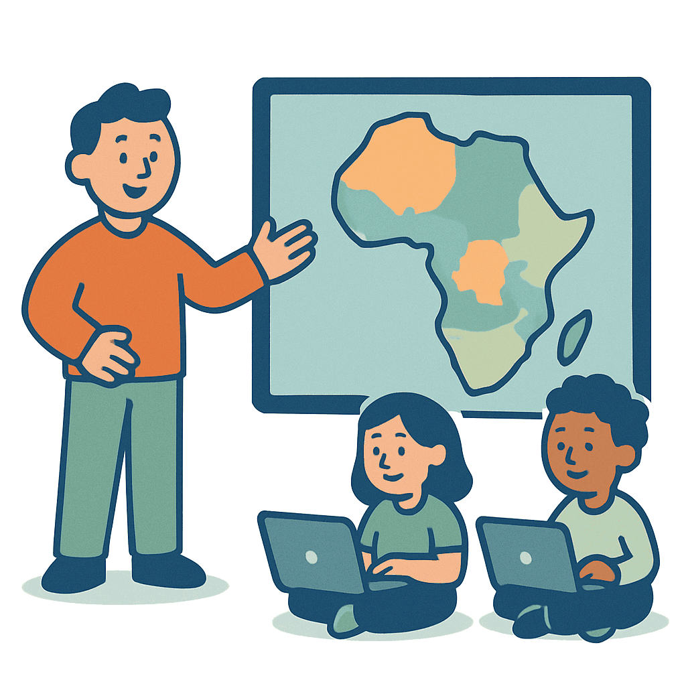

- Add the layers — counties, roads, cities
- Toggle each layer on and off in the Layers panel
- Identify a feature: click it and read its attributes
- Open the attribute table — select a row, watch it light up on the map
- Change the symbology: color, outline, point size
- Run one tool: Processing Toolbox → Vector geometry → Buffer
- Follow along on your own laptop if you already have QGIS installed.

<!-- Keep this to about ten minutes. If the projector or QGIS misbehaves, the screenshots on slides 9-14 cover the same ground. -->

---

# Why is Spatial Information Important to Civil/Environmental/Construction Engineers?

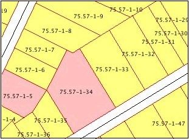

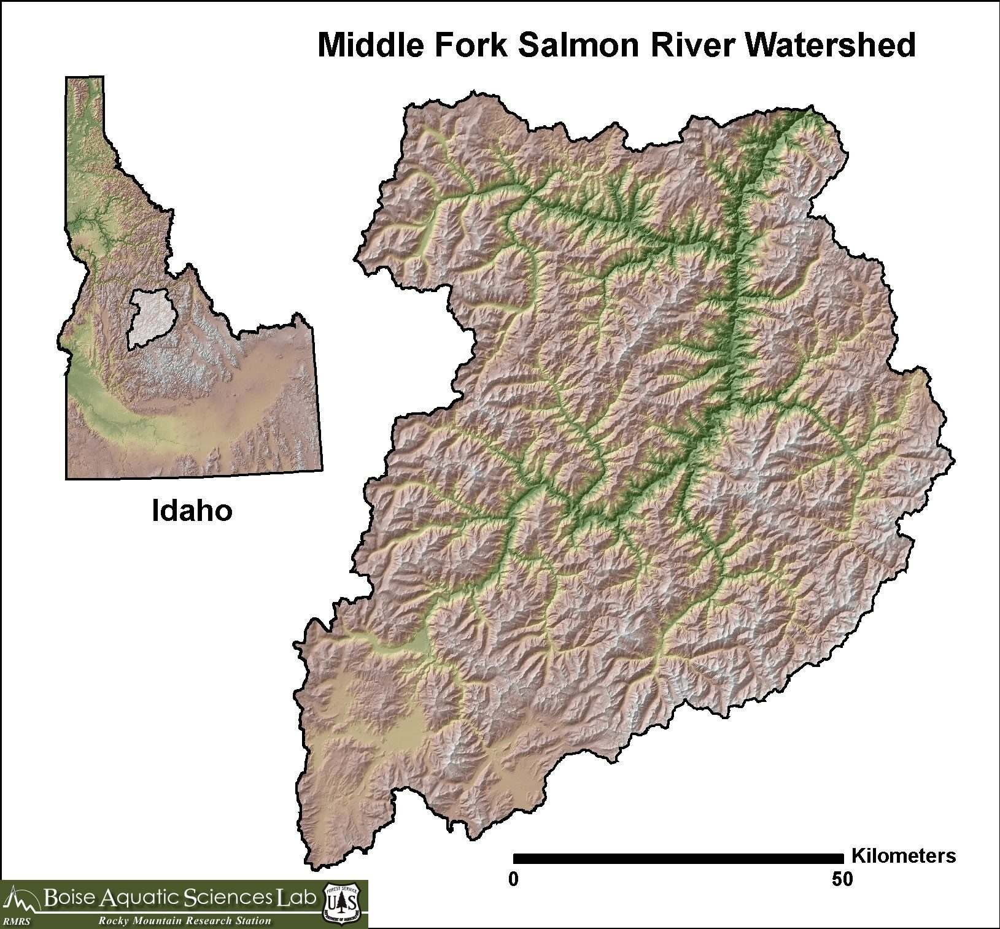

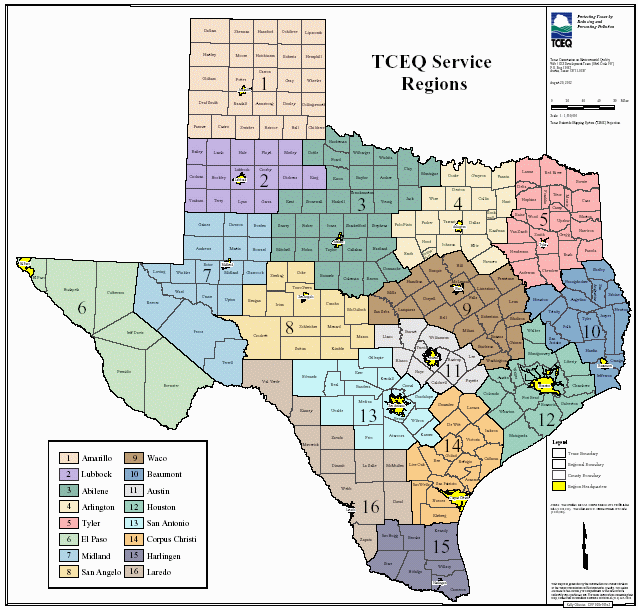

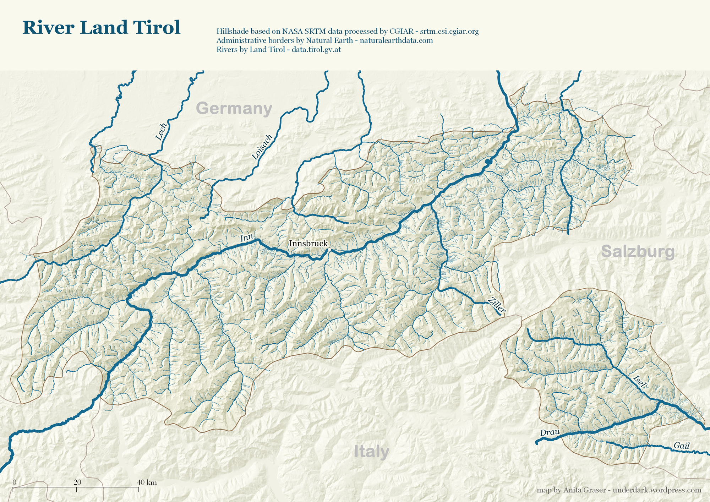

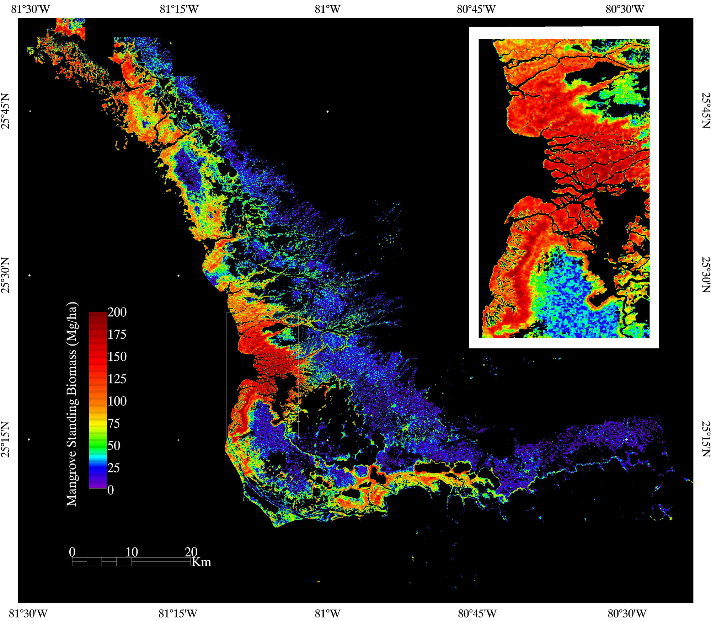

<!-- Examples left to right: land parcels (surveying/land development), Middle Fork Salmon River watershed (hydrology), TCEQ service regions (environmental regulation), River Land Tirol river network (water resources mapping), mangrove standing biomass from remote sensing (environmental monitoring). -->

---

<!-- _class: activity -->

# Activity

- Explore uses of GIS in Civil and Construction Engineering. Add what you find to the **class activity sheet** — scan the code or use the link on Learning Suite.

<strong>Class activity sheet</strong>

    

<!-- Give students a few minutes to search for real GIS applications in civil and construction engineering and add them to the shared activity sheet. -->

---

# Before Next Class

- Read the assigned pages in *GIS Fundamentals* (Bolstad & Manson, 7th ed.)
- Take the open-book quiz on Learning Suite — due Friday at midnight
- Install QGIS on your own computer (free: [qgis.org/download](https://qgis.org/download))
- [Lab 1](https://byu-hydroinformatics.github.io/cce114-geomatics/assignments/lab-01/) is assigned Tuesday and due Saturday night
- Questions? Office hours: [calendly.com/dan-ames/office-hours](https://calendly.com/dan-ames/office-hours)

<!-- Emphasise installing QGIS before Tuesday — Lab 1 assumes it's working on their own machine. -->
