<!-- _class: lead -->
<!-- _paginate: skip -->

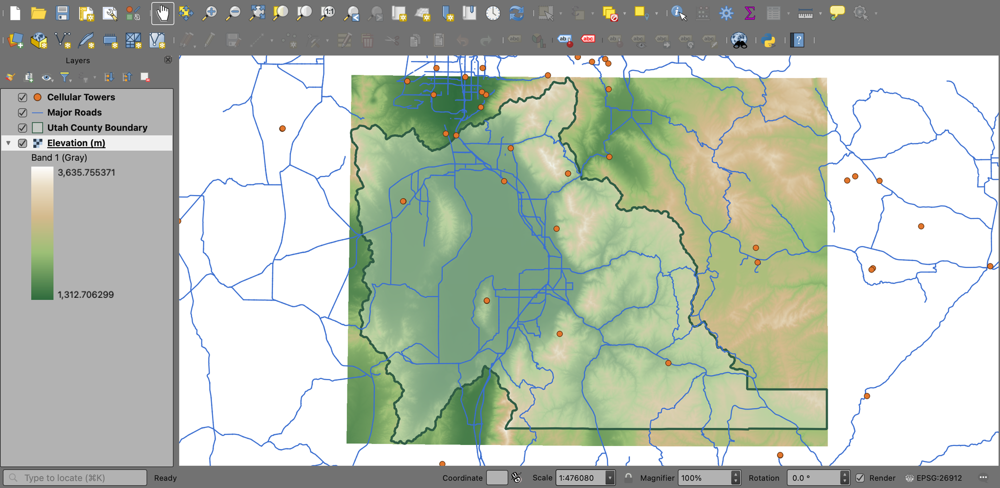

# GIS Data Models & File Formats

CCE 114 Geomatics
Dr. Dan Ames and Dr. James Halgren

<!-- Tuesday concept lecture. Thursday is the hands-on session, where students build and edit these layers themselves in QGIS. -->

---

# Today's Goals

- By the end of class you should be able to:
  - Explain what a *model* is, and why a map is one
  - Tell a **data model** from a **file format**
  - Name the five things every GIS is built from
  - Encode the same shape three ways: **vector**, **raster**, **TIN**
  - Pick the right data model for a dataset, and say why
- Thursday, in the hands-on session, you build and edit these layers yourself in QGIS

<!-- Set expectations. This is the concepts day; the hands-on work happens Thursday. Reading is Bolstad & Manson chapter 2, Data Models, which this lecture follows closely. -->

---

# See it first, then name it

- We start in QGIS with real **Utah County** data, the same software you installed for Lab 1
- You will see, on screen, the five things every GIS is built from:
  - a **point**, a **polyline**, a **polygon**, an **attribute table**, and a **raster**
- Then we back up and ask the harder question: what is a "model," and why is a map one?
- Everything after that refers back to what you saw

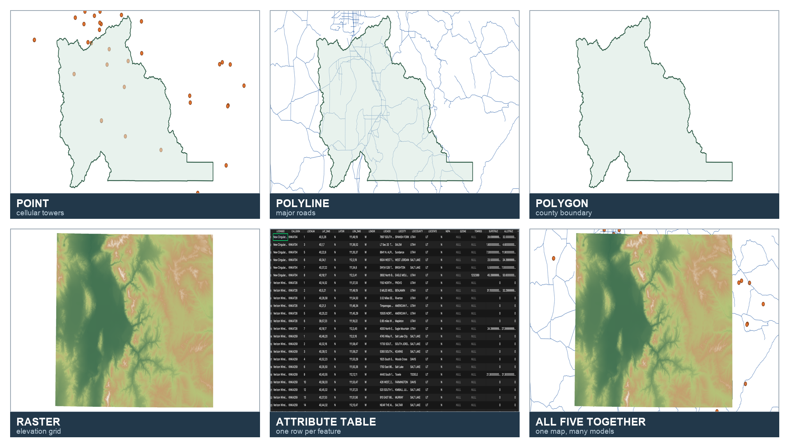

<!-- Set up the hour: we look before we name things. Have UtahCountyData.zip already unzipped on the presentation machine if you plan to show it live; otherwise the next six slides are the same walkthrough as screenshots. -->

---

# A Quick Look: Utah County in QGIS

- Download and unzip [UtahCountyData.zip](https://byu-hydroinformatics.github.io/cce114-geomatics/lectures/data/UtahCountyData.zip), then drag each layer into QGIS:
  - **UtahCountyBoundary**: one polygon. Where does the county end?
  - **UtahCountyMajorRoads**: polylines. Length, but no area.
  - **UtahCountyCellularTowers**: points. A location, nothing more.
  - Open the towers **attribute table**: one row per tower, one column per fact
  - **UtahCountyDEM.tif**: a raster. Every cell holds an elevation.
- Click a feature with **Identify**. Ask each time: *what did the computer have to store?*

<!-- Keep this to about five minutes as a look, not a tutorial; students do the full version Thursday in the Thursday hands-on session. Drag layers in one at a time and ask the same question after each: what did the computer have to store to draw that? The next six slides are backups of every step in case the projector or QGIS misbehaves. -->

---

# Polygon: county boundary

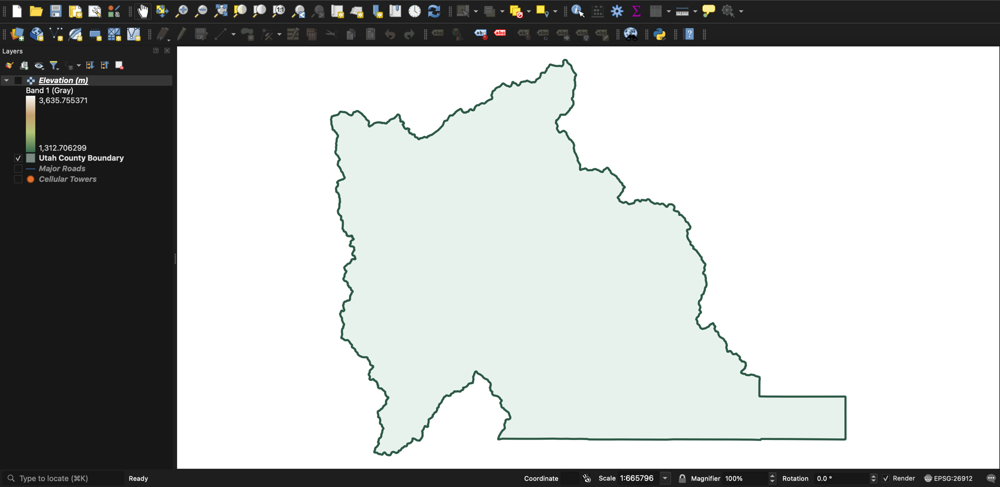

<!-- One feature. The computer stored an ordered list of coordinate pairs that closes back on itself. -->

---

# Polyline: major roads

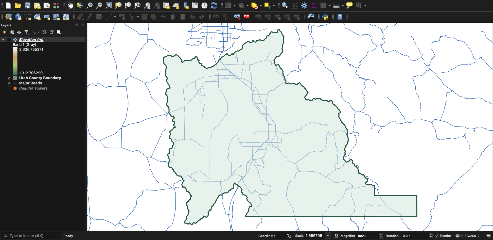

<!-- Ordered lists of coordinate pairs that do not close. Length, but no area. -->

---

# Point: cellular towers

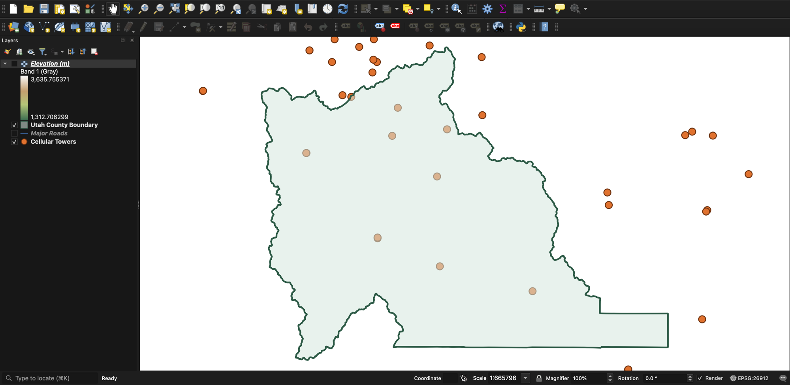

<!-- One coordinate pair per tower. Ask what a point cannot tell you: size, shape, orientation. -->

---

# Attribute table: one row per feature

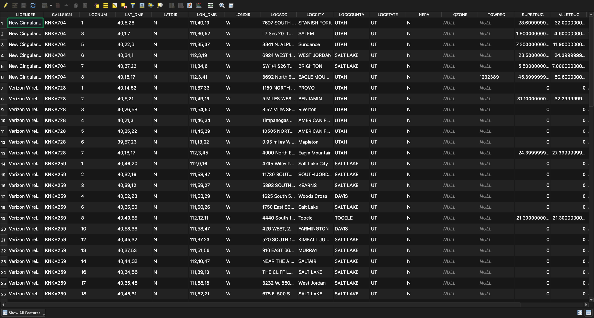

<!-- One row per tower, one column per fact. Select a row and the tower lights up on the map: the geometry and the attributes are linked by that row. -->

---

# Raster: elevation, one value per cell

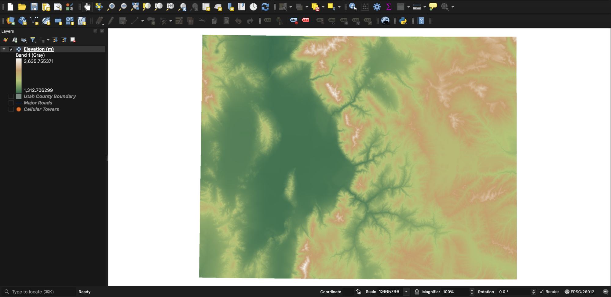

<!-- A regular grid. Every cell holds a number, here elevation in meters. There are no features to click on, just cells. -->

---

# All five together

<!-- This is the payoff view. Points, polylines, polygons, a table, and a raster in one project. -->

---

# The five things you just saw

<!-- Leave this slide up while you move into the abstract material. Every later section, the airplane, the river, Colorado, can point back at these five panels. -->

---

<!-- _class: quiz -->

# Data Models

What are the **geometry characteristics** of each of these feature types?

- Points
- Polylines
- Polygons

<!-- Ask them to picture the cellular towers layer from the demo. What did QGIS actually have to store for each tower? Just a coordinate pair. -->

---

# Data Models

- **Point** data model: `(x, y)`
- **Polyline** data model: `(x0,y0), (x1,y1), (x2,y2), …`
- **Polygon** data model: `(x0,y0), (x1,y1), (x2,y2), … (x0,y0)`
- How can you store this data?
- What is the file format?

<!-- Roads = an ordered list of coordinate pairs. Boundary = the same, but the last pair repeats the first to close the ring. Point back at the demo screenshots if anyone needs to see it again. -->

---

# Data Model vs. File Format

- **Data Model** = the *conceptual* organization of the data
- **File Format** = how data are *stored* on the computer

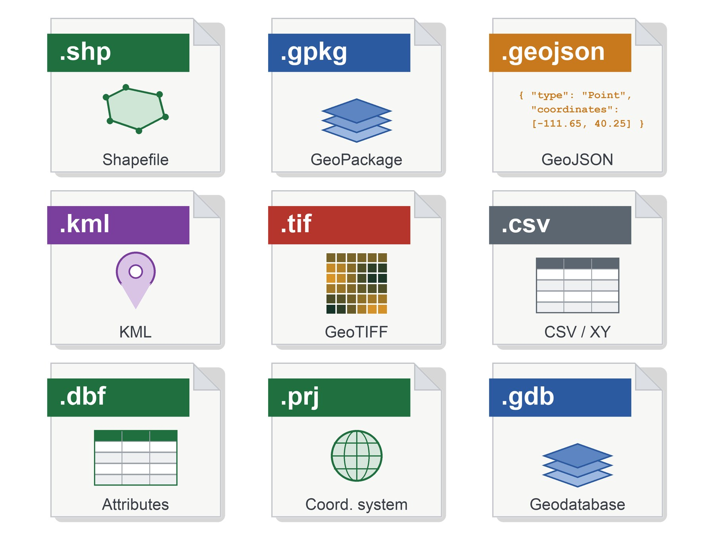

<!-- The demo file names make this concrete: UtahCountyMajorRoads.shp is the file format; "polyline" is the data model. The same roads could be stored as .gpkg or .geojson and still be polylines. -->

---

# What is a model?

Model = Abstraction of Reality

Concept, Idea, Notion, Generalization
Reality

<!-- Refer straight back to the demo: they have already seen a point, a polyline, a polygon, a table and a raster on screen. Now ask what those five things have in common: each is a simplification of Utah County, not Utah County itself. -->

---

<!-- _class: lead -->

# Consider a model airplane

---

# Vultee P-66 Vanguard

<!-- The Vultee P-66 Vanguard was a United States Army Air Forces fighter aircraft. It was initially ordered by Sweden, but by the time the aircraft were ready for delivery in 1941, the United States would not allow them to be exported, designating them as P-66s and retaining them for defensive and training purposes. Eventually, a large number were sent to China where they were pressed into service as combat aircraft with indifferent results. But it is still a cool looking airplane that is interesting to consider from a "modeling" point of view. -->

---

# The real thing: Vultee factory footage

<a href="https://youtu.be/g0lePaHC2aI" target="_blank">

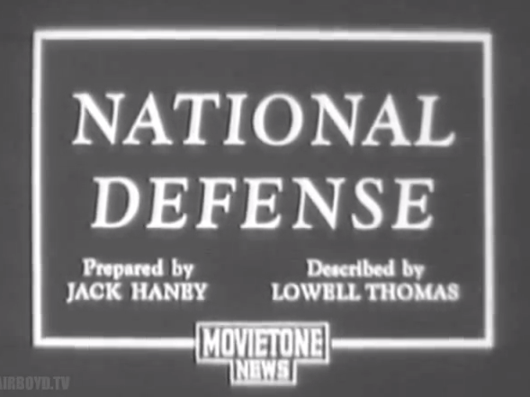

</a>

<a href="https://youtu.be/g0lePaHC2aI" target="_blank">youtu.be/g0lePaHC2aI</a>

<!-- Vultee airplane factory video. Click the thumbnail to open it in a new tab. -->

---

# Models of the Vanguard

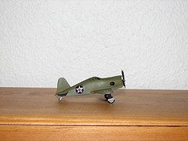

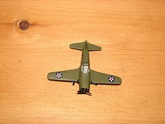

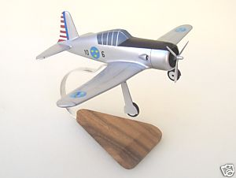

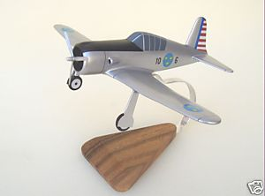

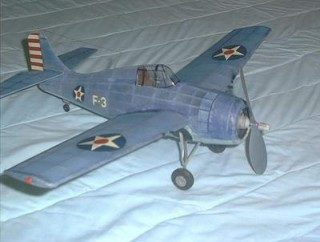

<!-- What information can you gain from each model of the Vanguard P-66? What is left out? -->

---

<!-- _class: quiz -->

# Which is the best model, and why?

<a href="https://youtu.be/74PdV0MteS8?t=47s" target="_blank">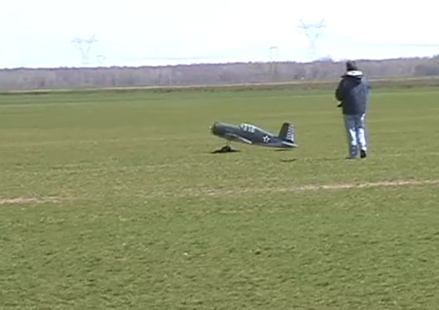</a> <strong>A</strong> (video)

 <strong>B</strong>

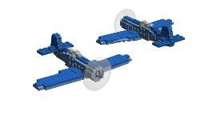 <strong>C</strong>

<strong>D</strong> — It depends

<!-- Answer is D. A flying model tells you about aerodynamics, the display model about proportions and paint, the toy about almost nothing. The best model depends on the question you are asking. Option A links to a video of a model airplane flying. -->

---

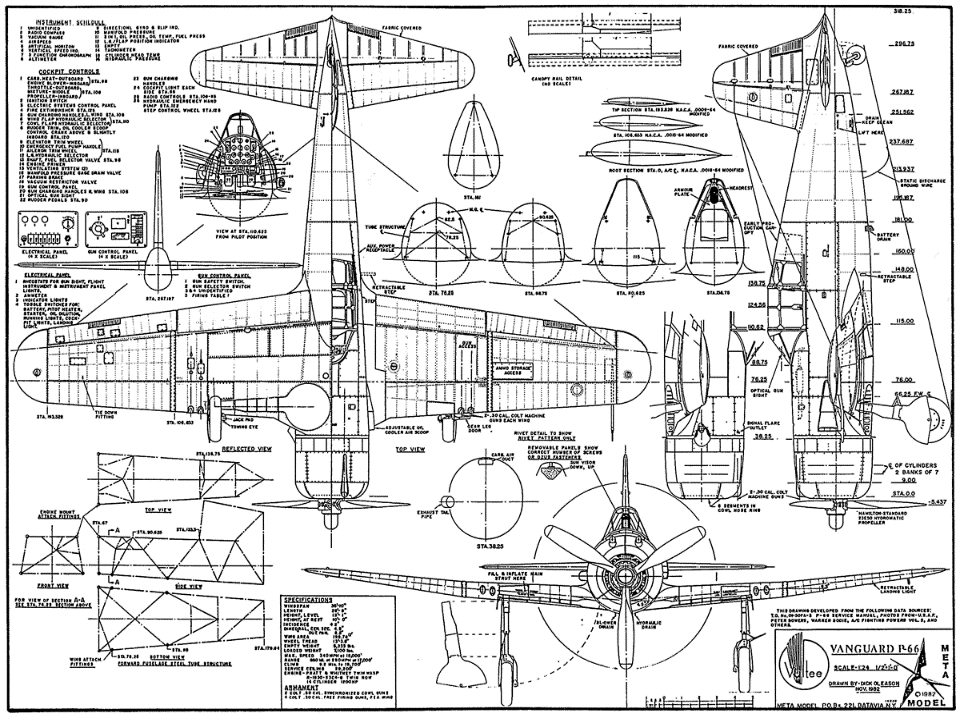

<!-- How is this a "model" of a Vanguard P-66 airplane? Is it an abstraction of reality? Could it be considered a model? What information can you gain from this model that the photos and toys cannot give you? -->

---

<!-- _class: lead -->

# What "models" can we use to represent a river?

---

<!-- _class: quiz -->

# Is this a data model, or reality?

<a href="https://youtu.be/wSWY0Mq3zFU" target="_blank">

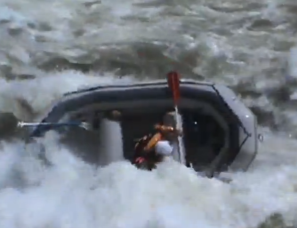

</a>

<ol type="A">
<li>Data model</li>
<li>Reality</li>
<li>Neither</li>
</ol>

<a href="https://youtu.be/wSWY0Mq3zFU" target="_blank">youtu.be/wSWY0Mq3zFU</a>

<!-- This is a rafting ride on the Lochsa River in Idaho on Memorial Day weekend 2013 (May 28, 2013). Is this video "reality" or a "model"? It is a video of reality, but it is actually a model: a representation of reality. -->

---

<!-- _class: quiz -->

# What is this?

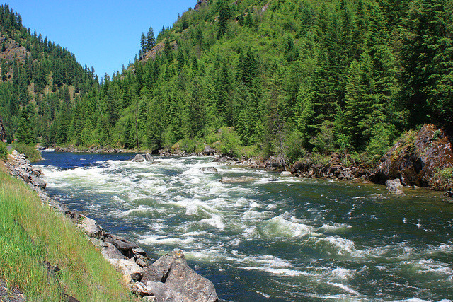

<ol type="A">
<li>Raster data model</li>
<li>Vector data model</li>
<li>Triangulated data model</li>
<li>Reality</li>
<li>None of the above</li>
</ol>

<!-- This is the Lochsa River in northern Idaho. A photo is a raster: a grid of pixels, each holding a color. -->

---

<!-- _class: quiz -->

# What is this?

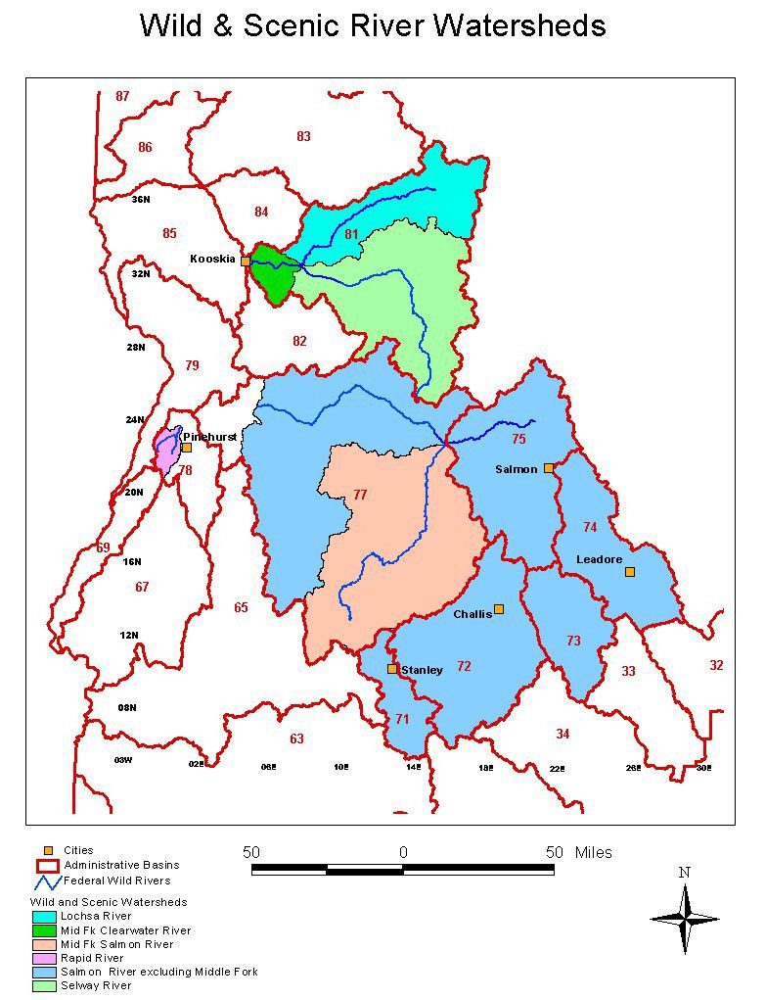

Lochsa River, northern Idaho

<ol type="A">
<li>Raster data model</li>
<li>Vector data model</li>
<li>Triangulated data model</li>
<li>Reality</li>
<li>None of the above</li>
</ol>

<!-- Watershed boundaries and stream lines: vector polygons and polylines. -->

---

<!-- _class: quiz -->

# Which data model best represents the Lochsa River?

<ol type="A">
<li>The photo</li>
<li>The video</li>
<li>The map</li>
<li>The time series table</li>
<li>The graph</li>
</ol>

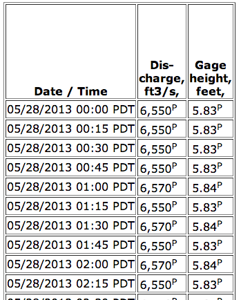
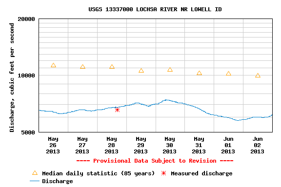

<!-- Here is another representation of the streamflow in the Lochsa River at the same time: the USGS gage table and hydrograph. Which "model" gives you more information, the video or the plot? What kind of information is provided in both? What is not communicated in each? -->

---

<!-- _class: lead -->

# Part 2

## Encoding the world with numbers: vector, raster, TIN

---

<!-- _class: lead -->

# Consider a U.S. State

---

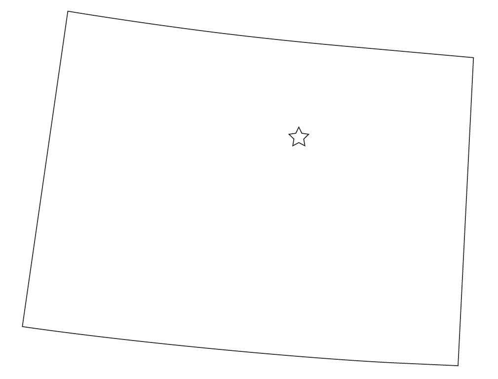

<!-- Look at this state outline. Anyone know which state it is? Right, Colorado. How did you know? Spatial reasoning based on the shape and the location of Denver.

How can we represent this state shape using the fewest bytes of memory possible? Let's digitize the corners. I have to measure them from some point of origin; for this example I measured distances from an origin at the exact center of the image. We also need to know the units. Here the units are inches, so we would need to scale them up to kilometers to make this "geolocatable". -->

---

# "I'll Sue Ya" (Weird Al Yankovic)

<a href="https://youtu.be/MeXQBHLIPcw?t=2m6s" target="_blank">

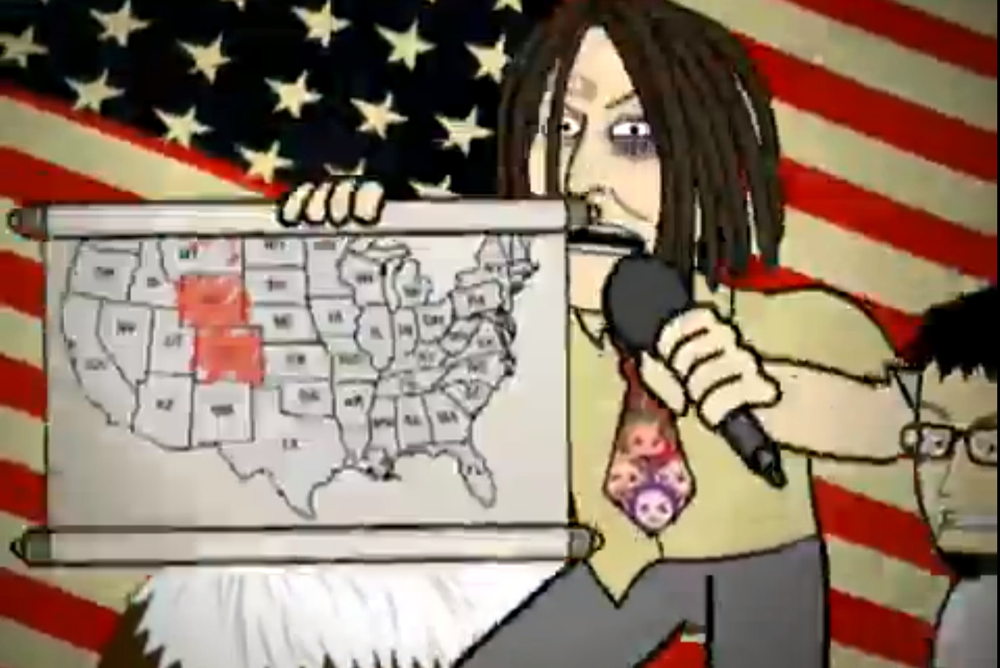

</a>

- Weird Al sues the state of Colorado for looking a little too much like Wyoming
- Play from 2:06 to about 2:30
- <a href="https://youtu.be/MeXQBHLIPcw?t=2m6s" target="_blank">youtu.be/MeXQBHLIPcw?t=2m6s</a>

<!-- We are going to look at the state of Colorado. Play the audio from 2:06 to 2:30 and stop there; some later scenes are a little dodgy to show in class. -->

---

<!-- _class: activity -->

# Polygon Data Model Activity

- Choose a state
- Look at the state and figure out a good way to represent it using **ONLY numbers**
- Think about the data encoding models from the book: **raster**, **vector**, **TIN**
- Feel free to invent your own
- **RULE:** no symbols, colors, or letters. Just numbers…

**Discussion:** Which data model did you use to encode your state?

<ol type="A">
<li>Vector</li>
<li>Raster</li>
<li>Triangulated (TIN)</li>
<li>Other</li>
</ol>

<!-- Give students five minutes in pairs. Have a few groups show their encoding on the board before revealing the next slides. -->

---

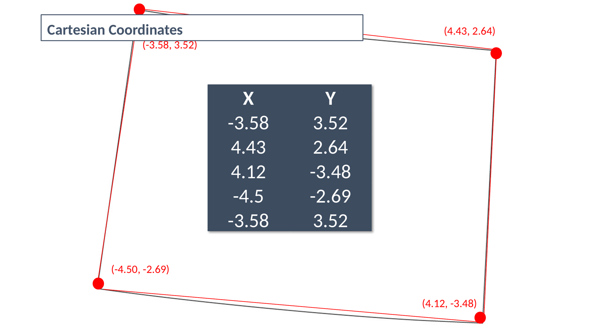

<!-- Given just these coordinates, we can come up with a numeric representation of the shape. Why are there five rows in the table? Because we need to "close" the polygon. This is typical of spatial data representation in most data models.

It takes 8 bytes (64 bits) of memory to hold a single double-precision real number, so how much memory is required to store this polygon? 80 bytes.

How accurate is this representation of Colorado? Not very. The red lines are straight and the black lines are curved. But isn't Colorado a rectangle? The data are projected. We learn about projection systems and distortion in a later week. -->

---

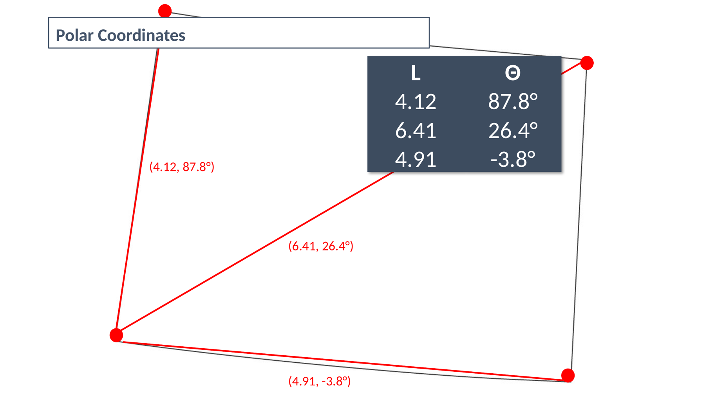

<!-- Here is another way to represent the geometry of the state. What method is this? A polar (radial) coordinate system: we assume one point at an origin and measure the distance and angle to each of the other points in sequential order. L is the length and theta is the angle measured from due east. -->

---

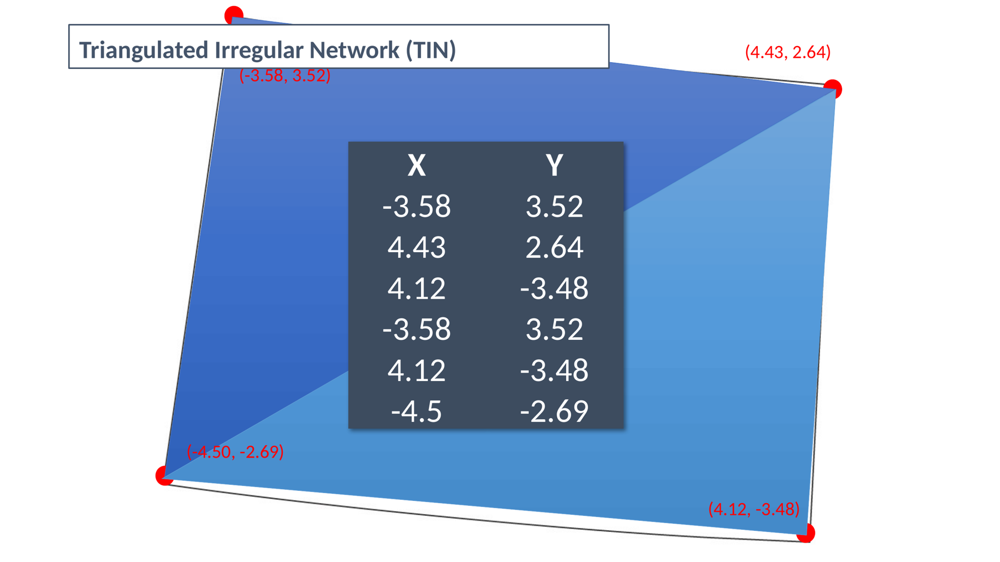

<!-- Another way: triangles. In what case would this be a very efficient method for representing data? You can use triangles to represent 3D objects like an elevation surface really efficiently, because it uses fewer triangles in large flat areas and more triangles in rough, highly varying areas. For a video game, for example, it is most efficient to represent objects and terrain as triangles with textured images on the faces. -->

---

# Triangulated Irregular Network (TIN)

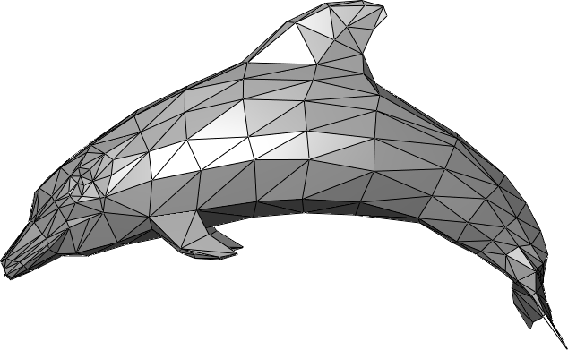

<!-- A mesh of triangles. Big triangles where the surface is flat, small ones where it curves. -->

---

# TIN: more triangles where it matters

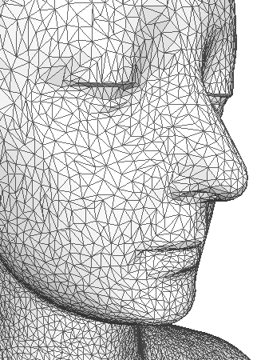

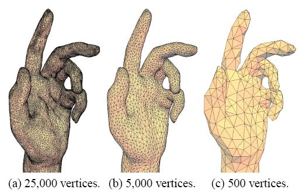

<!-- The three hands are the same shape at 25,000, 5,000 and 500 vertices. Ask which one you would choose for a video game versus a surgical simulator. -->

---

# TIN terrain

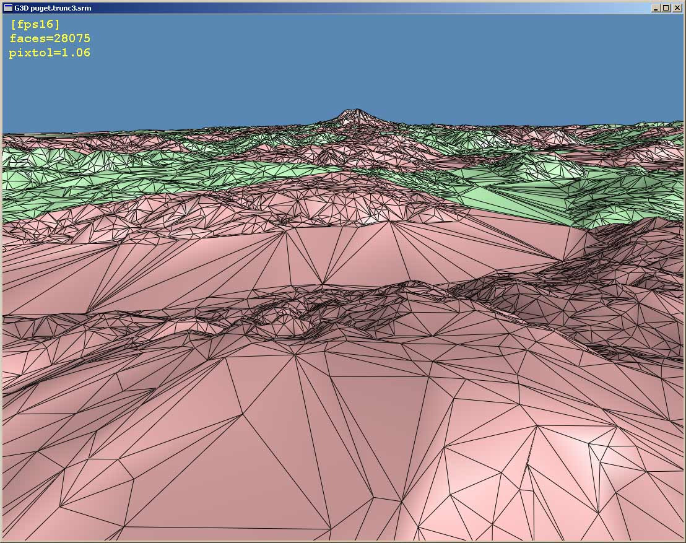

<!-- Terrain as a TIN: exactly how game engines and many engineering surface models store elevation. -->

---

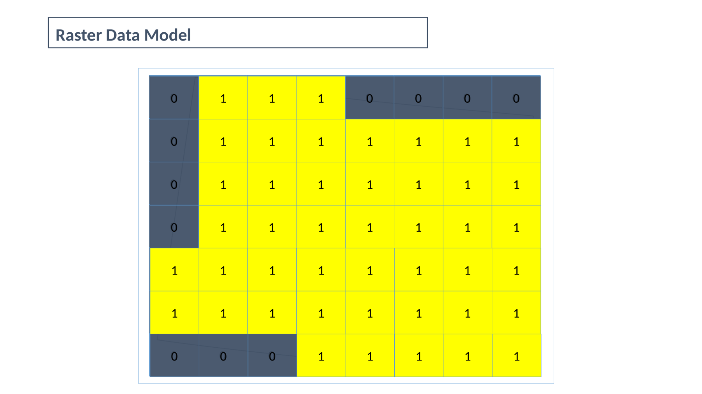

<!-- Another way to represent Colorado: a raster. A raster is a regularly spaced grid of values. The raster has to be completely filled in, so you need to specify which value means "no data". Here 0 means no data and 1 marks the state.

What is good about it? Fast, easy to fill in. What is bad? Pixelated borders and a lot of memory. How many bytes? 360 here. Is this a "better" data model? Does the additional storage result in more accuracy? No. -->

---

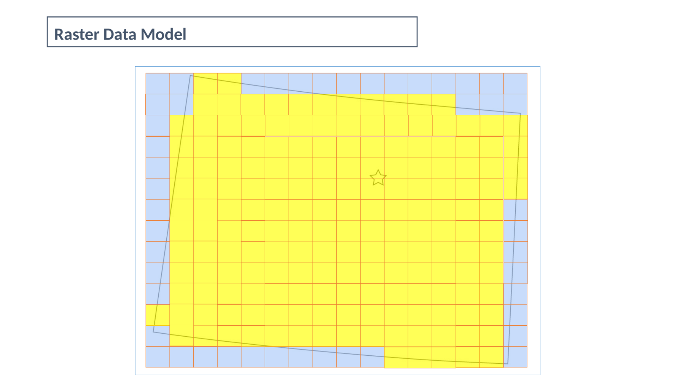

<!-- What do you think of the higher-resolution raster? Does it make sense to represent a polygon with a raster data model? No? Then what kind of data would it make sense to represent with a raster? -->

---

# Each pixel is a number

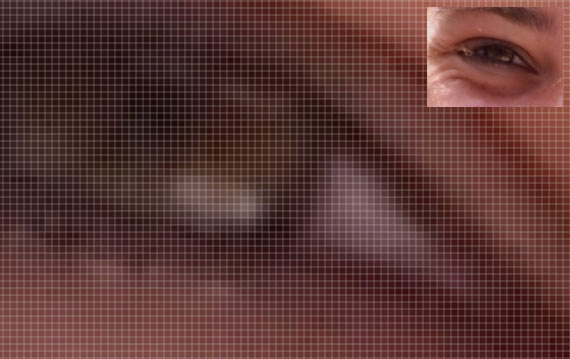

Each pixel (raster cell) is stored as a hexadecimal number that tells the screen which color to display.

<!-- Digital photos are raster images. Each pixel has a different value from the one next to it, representing a different color. Raster works really well for digital photos. -->

---

<!-- _class: quiz -->

# Which data model for air temperature?

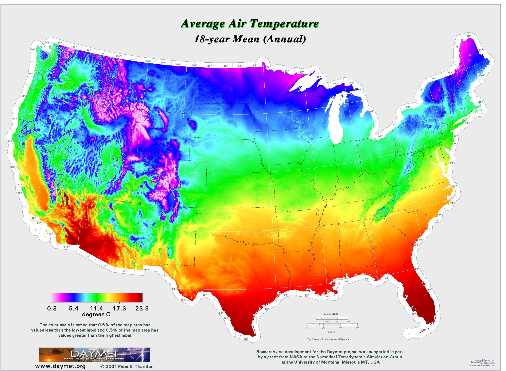

- Point?
- Line?
- Polygon?
- Raster?

<!-- Raster. Each cell contains a temperature value; the colors are drawn by the GIS software based on the value. Temperature is continuous: it has a value everywhere, which is exactly what a raster stores. -->

---

# Raster: tsunami wave heights

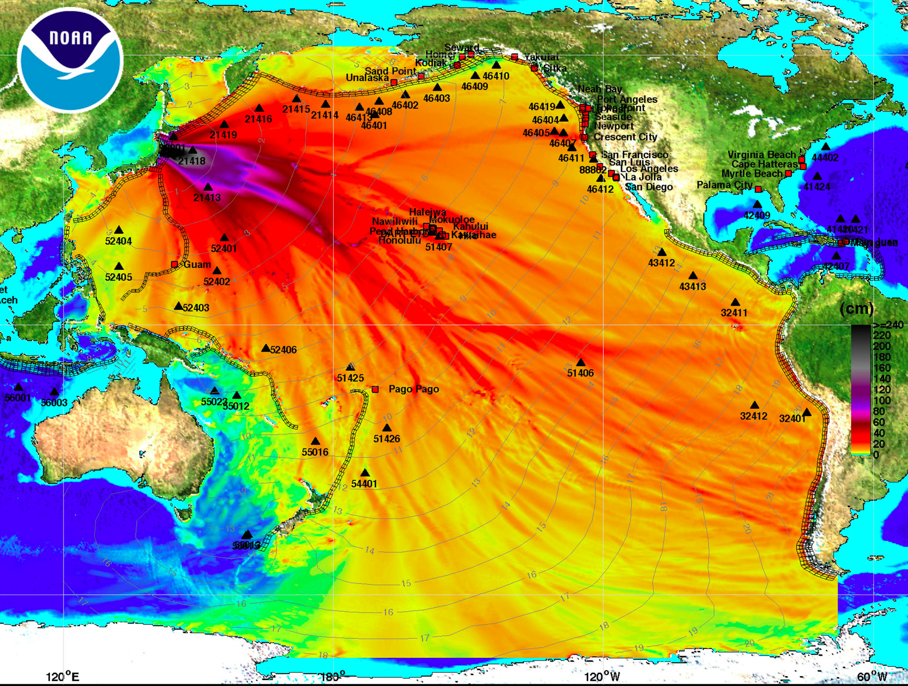

<!-- Predicted wave heights and propagation times for the 2011 Fukushima earthquake, from NOAA. Another continuous surface: every cell of ocean has a value. -->

---

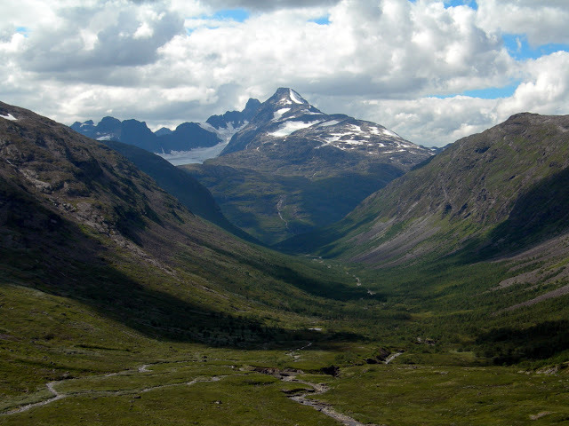

<!-- How about terrain? Ask students what they would need to store to describe this valley to a computer, then go to the next slide. -->

---

<!-- _class: quiz -->

# What data model represents the terrain here?

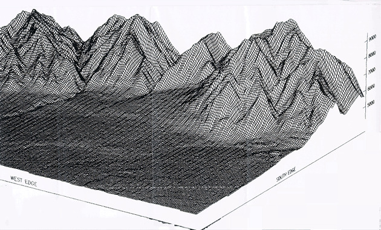

<ol type="A">
<li>Vector</li>
<li>Raster</li>
<li>Triangulated (TIN)</li>
<li>Other</li>
</ol>

<!-- Raster: a regular grid of elevation values drawn as a wireframe surface. Compare with the TIN terrain slide: the grid here is regular, the TIN was not. -->

---

# When to use each data model

- **Vector**
  - Fewer distinct values
  - Discrete features
- **Raster**
  - Highly variable
  - Continuous surfaces
- **TIN**
  - 3D rendering
  - High data compression

<!-- The summary slide. Discrete things you can count (towers, roads, parcels) are vector. Things that vary everywhere (elevation, temperature, imagery) are raster. TINs are a compact way to store surfaces for 3D work. -->

---

<!-- _class: activity -->

# Thursday: hands-on in QGIS

- Create a map in QGIS with the [Utah County data](https://byu-hydroinformatics.github.io/cce114-geomatics/lectures/data/UtahCountyData.zip)
- Create a new **vector layer**, choosing the right geometry type
- Use the editing toolbar to add points and edit vertices
- Note the vocabulary: a *vector layer* is a **feature class** in a geodatabase, or a **shapefile** in a folder

<!-- Preview of Thursday. The Thursday session students create and edit vector layers with the data from today's demo. -->

---

# Before Next Class

- Read Chapter 2, *Data Models*, in *GIS Fundamentals* (Bolstad & Manson)
- Take the open-book quiz on Learning Suite
- Bring your laptop with QGIS installed on Thursday, and download [UtahCountyData.zip](https://byu-hydroinformatics.github.io/cce114-geomatics/lectures/data/UtahCountyData.zip) beforehand
- Current lab: see the [Assignments page](https://byu-hydroinformatics.github.io/cce114-geomatics/assignments/)
- Questions? Office hours: [calendly.com/dan-ames/office-hours](https://calendly.com/dan-ames/office-hours)

<!-- Fill in the quiz due date and the current lab before class. -->
