<!-- _class: lead -->
<!-- _paginate: skip -->

# Maps, Symbology, and Cartography

## Part 1

CCE 114 Geomatics
Dr. Dan Ames and Dr. James Halgren

<!-- Tuesday concept lecture. Thursday is the hands-on session, where students build a map of the United States in QGIS and change symbology themselves. -->

---

# Today's Goals

- By the end of class you should be able to:
  - Name the **layout elements** every technical map needs, and spot the one that is missing
  - Choose **symbology** for points, lines, polygons, and rasters on purpose
  - Use **labels, legends, and scale bars** so a reader can use your map without you
  - Recognize how a map can mislead through **obfuscation, omission, or dramatic symbology**
- Thursday, in the hands-on session, you build a map of the United States in QGIS and play with symbology

<!-- Set expectations. This is the concepts day; the hands-on symbology work happens Thursday. Reading is the map design sections of chapter 4 in Bolstad and Manson. Lab 2 and Quiz 2 are both due Saturday. -->

---

# Let's talk about cartography…

Vermeer's "The Cartographer," 1669

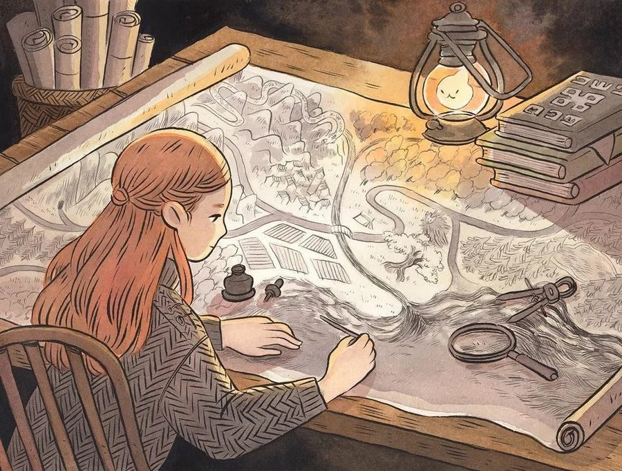

Heikala's "Cozy Cartography," r/litrpg 2019

I am not a <em>cartographer</em>, and I don't expect you to be one…

<!-- Open with a disclaimer. Cartography is its own discipline with centuries of craft behind it. We are engineers borrowing the useful parts. -->

---

# …but your maps still have to work

- As engineers, scientists, and builders we mainly use GIS for **data analysis** to solve problems, so **data visualization** can feel secondary
- BUT it is still important to make **clear, complete, easily readable** maps for your project reports, now and in your profession
- More for the analyst's report ⬆ than for the trailhead ⬇

<!-- The maps you make in this course are figures in an engineering report, not wall art. The standard is: can a reviewer who was not in the room read it correctly? -->

---

# Example ugly maps

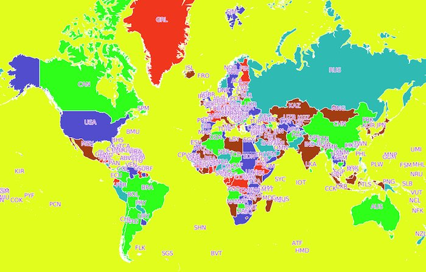

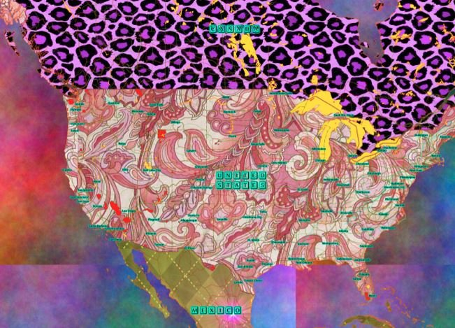

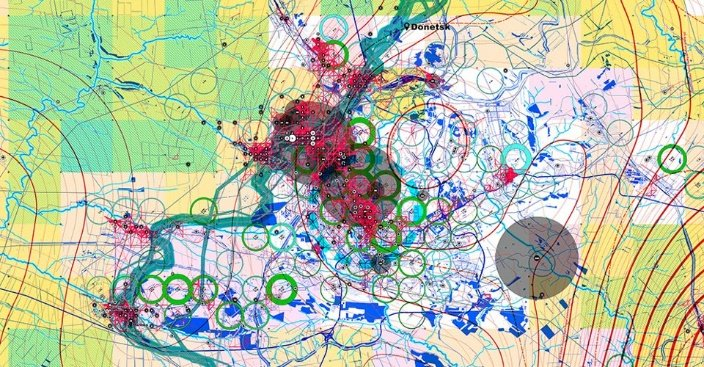

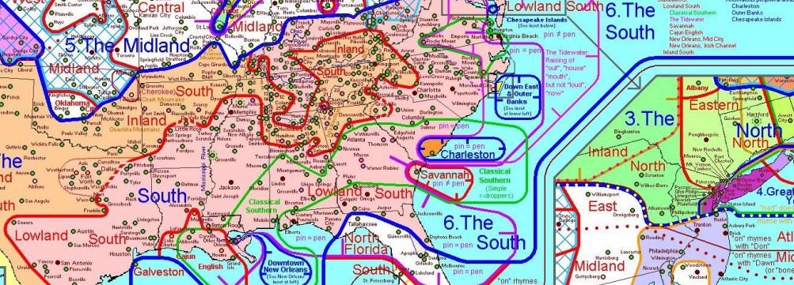

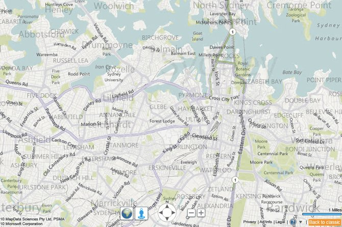

<!-- Discuss: what are the problems and issues with each of these maps? Clutter, unreadable text, colors that fight each other, no clear subject, missing legend. Take them one at a time and let students name the failure. -->

---

# Look at maps critically

- The internet is full of examples of good and bad cartography
- Use your search skills to look at maps **critically**
- Ask yourself: what is this map for? Who is the reader? What did the mapmaker decide to leave out?
- Notice which visualizations you are drawn to, and ask **why**

<!-- Fortunately the internet is full of examples of good and bad cartography, and we encourage you to look at maps critically and think about what makes a good map, why you are drawn to certain types of visualization and not others, and so on. -->

---

<!-- _class: lead -->

# What goes in every map?

## For this course we will not grade the aesthetics, but every map must be readable and complete

<!-- We will not judge your work on the aesthetics of your maps, but we will expect every map to be readable and to include some specific components that we will discuss now. -->

---

<!-- _class: quiz -->

# What is your generic name for soft drinks?

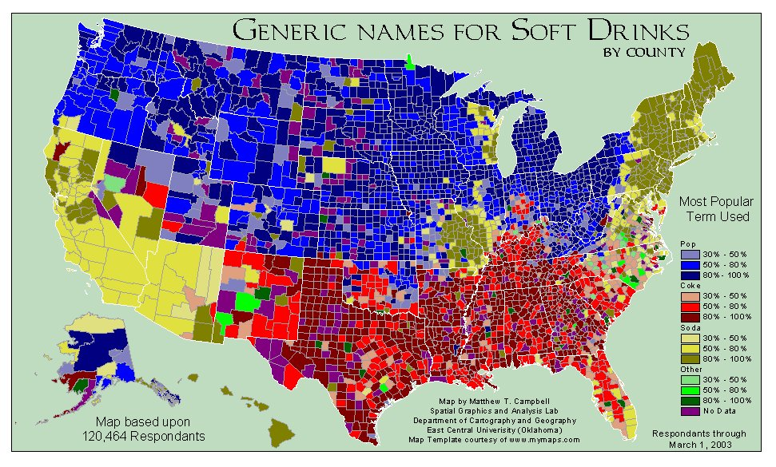

<ol type="A">
<li>Pop</li>
<li>Coke</li>
<li>Soda</li>
<li>Other</li>
</ol>

<!-- Warm-up poll, and an excuse to put a real thematic map on the screen. Map by Matthew T. Campbell, Spatial Graphics and Analysis Lab, East Central University, Oklahoma; based on 120,464 respondents through March 1, 2003. Take the vote, then go to the next slide and use the same map to name the layout elements. -->

---

<!-- _footer: "" -->

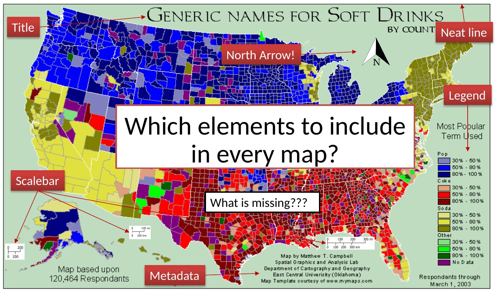

<!-- Same map, now labeled. Walk the callouts one at a time: title, north arrow, legend, scale bar, neat line, metadata. Then ask the question in the white box: what is missing? Nothing on this one, which is the point. Note that this map carries three scale bars because Alaska and Hawaii are at different scales than the lower 48. -->

---

# The checklist for every map you turn in

- **Title** — what is this a map of?
- **Legend** — what does each color and symbol mean?
- **Scale bar** — how big is what I am looking at?
- **North arrow** — which way is up?

- **Neat line** — a border that frames the map
- **Metadata** — who made it, when, from what data, in what coordinate system
- **Legible text** and **distinct colors**

If a reader has to ask you a question to use the map, the map is not finished.

<!-- This is the list we will grade against in Lab 2 and in every lab after it. Point out that "metadata" on a map layout usually means a short credit block: data source, date, projection, and author. -->

---

<!-- _class: quiz -->

# Two questions about map elements

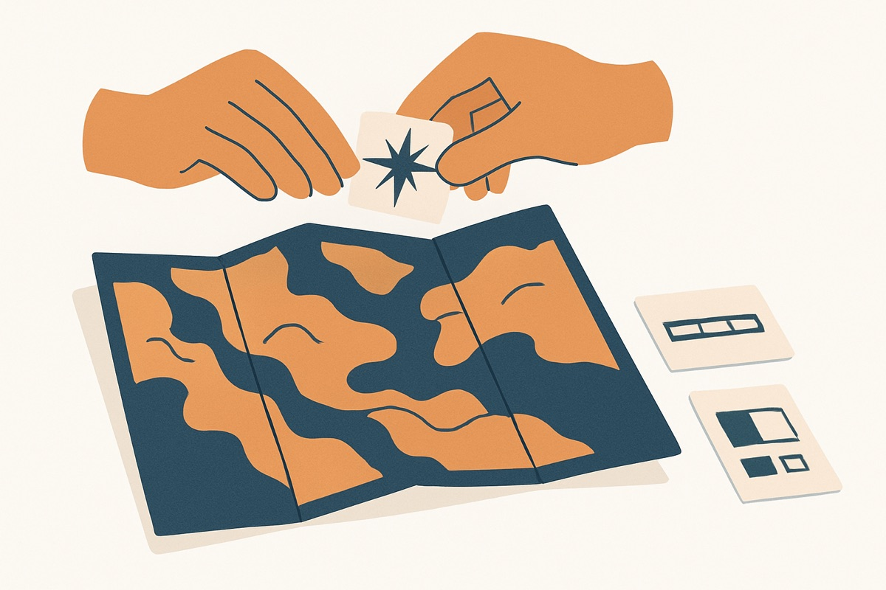

**Which element is NOT required for every technical map?**

<ol type="A">
<li>Title</li>
<li>North arrow</li>
<li>Metadata</li>
<li>Legend</li>
<li>None of the above</li>
</ol>

**Which elements should you include in every map?**

<ol type="A">
<li>Scale bar</li>
<li>Neat line</li>
<li>Legible text</li>
<li>Distinct colors</li>
<li>None of the above</li>
</ol>

<!-- Both are "none of the above" questions in disguise: everything on both lists belongs on a technical map. Let students argue about the north arrow on a small-scale world map before you land the point. -->

---

<!-- _class: quiz -->

# What is missing on this map?

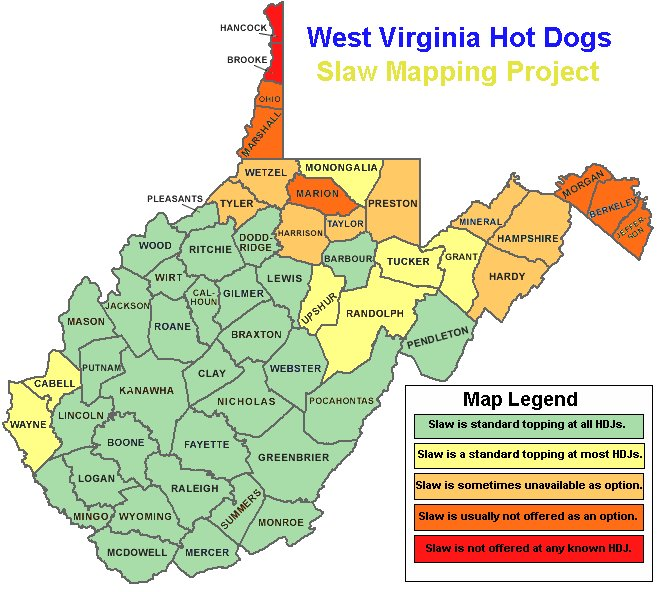

Also, for the record:

**Do you prefer your hot dog topped with coleslaw?**

<ol type="A">
<li>Yes</li>
<li>No</li>
</ol>

<!-- From the West Virginia Hot Dog Blog slaw mapping project: while the vast majority of West Virginians prefer hot dogs topped with coleslaw, it is not a standard topping everywhere in the state. Counties shaded light green have hot dog joints that include slaw on a hot dog with "everything"; yellow, usually offered; orange, sometimes; red, unheard of. Missing: no scale bar, no north arrow, no metadata block. It does have a title and a legend. Source: wvhotdogblog.blogspot.com -->

---

<!-- _class: quiz -->

# What is missing on this map?

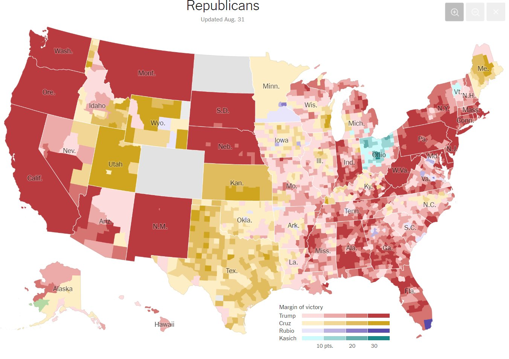

<!-- New York Times 2016 national results map. Missing: no scale bar, no north arrow, and the legend is a tiny "margin of victory" ramp in the corner. It is also a county-area map of a person-based quantity, which we come back to in a few slides. Source: nytimes.com/elections/2016/national-results-map -->

---

<!-- _class: lead -->

# Using symbology to tell a story

## Symbology is the fill and outline colors, the line and fill patterns, and the icons you choose

<!-- Think about how to use symbology to tell a story. Symbology includes the fill and outline colors you choose, the line and fill patterns, and also icons, or in the next case emoji, that you use to identify features on a map. -->

---

# One symbol per state: emoji

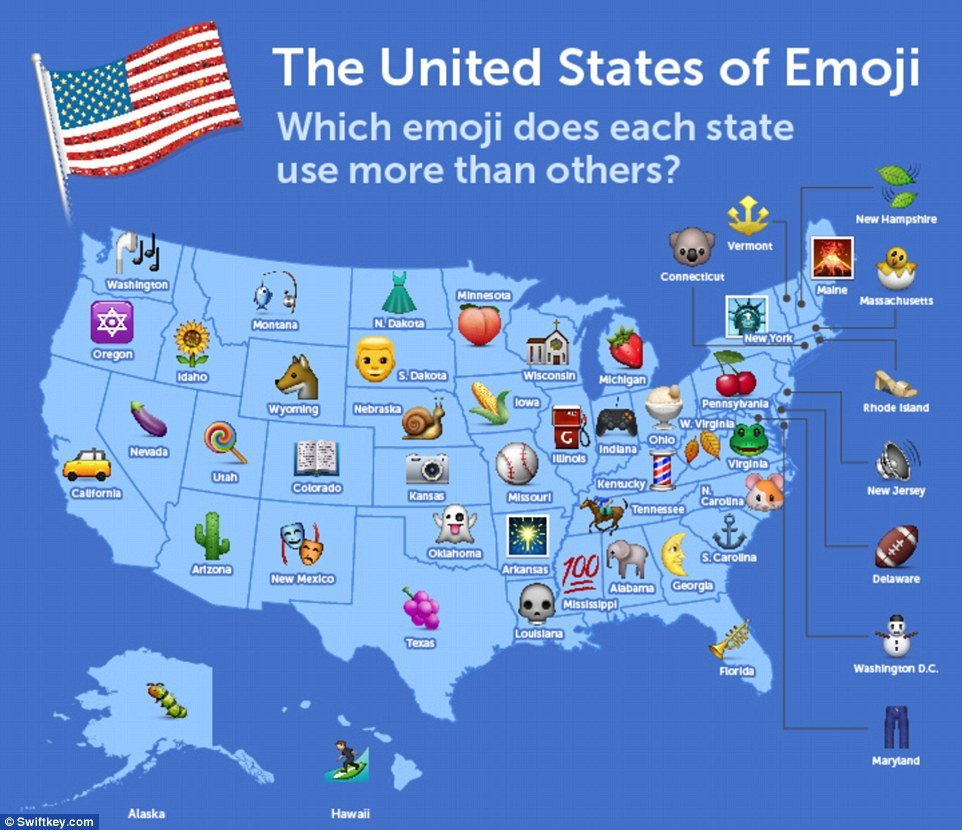

<!-- Keyboard firm SwiftKey analyzed a billion emoji from its users and worked out which are used more in each state than elsewhere. The geometry is trivial; the whole message is carried by the point symbol. Ask what this map would look like as a choropleth instead. -->

---

# One symbol per state: Pokémon

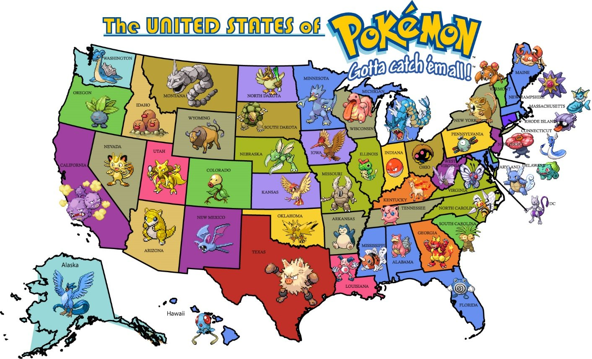

<!-- Map by Landon Kinney, a student in this course in Fall 2015, who picked a Pokémon for each state: ferries for Washington, potatoes for Idaho, Mt. Rushmore for South Dakota, lobsters for Maine, and so on. Same idea as the emoji map, made by hand. Good moment to say that student work ends up in this deck. -->

---

# Type as symbology

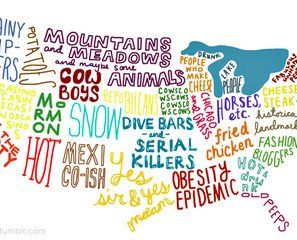

<!-- Here the "symbol" is the lettering itself: size, weight, color, and hand-drawn style carry the message, with the state outlines only barely present. Labels are symbology too, which is the transition to the next slide. -->

---

<!-- _footer: "" -->

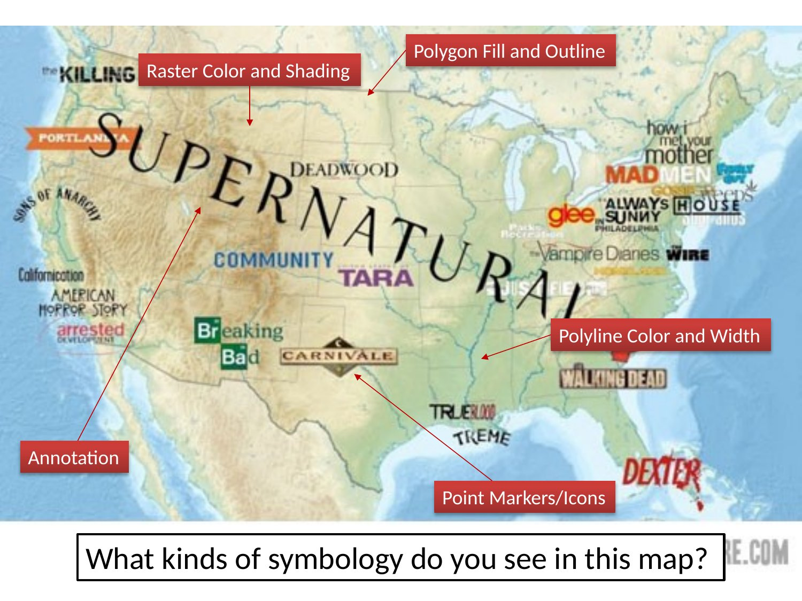

<!-- Ask the question on the slide before revealing the callouts: what kinds of symbology do you see in this map? Answers: annotation, point markers and icons, polyline color and width, polygon fill and outline, and raster color and shading. Every one of those is a setting you will change in the QGIS layer properties on Thursday. -->

---

# Symbology by geometry type

- **Points** — marker shape, size, color, rotation, or a picture icon
- **Lines** — color, width, dash pattern, casing for roads
- **Polygons** — fill color, fill pattern, outline color and width, transparency

- **Rasters** — color ramp, stretch, shading, transparency
- **Labels / annotation** — font, size, color, halo, placement

Every choice should answer a question the reader has. If it does not, it is decoration.

<!-- This is the vocabulary list for Lab 2 and for Thursday. All of these live in the layer properties in QGIS, under Symbology and Labels. In QGIS these are Layer Properties, then the Symbology tab and the Labels tab; single symbol, categorized, and graduated renderers are the three you will use most. -->

---

<!-- _class: lead -->

# How to lie with maps

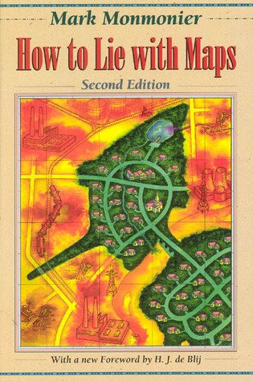

## Mark Monmonier, *How to Lie with Maps*

<!-- Monmonier's book is the classic short read on this. The next few slides are three of his categories: obfuscation, omission, and symbology chosen for effect. -->

---

<!-- _footer: "" -->

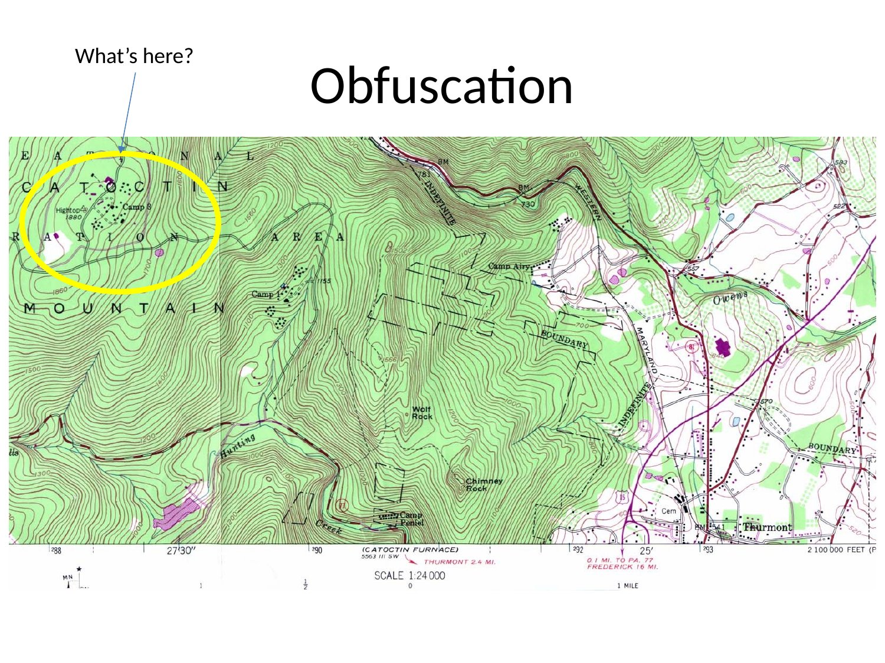

<!-- "Camp 3" on this USGS quad map is actually Camp David, the Presidential retreat. The features are drawn, but they are labeled so as to hide what they are. -->

---

<!-- _footer: "" -->

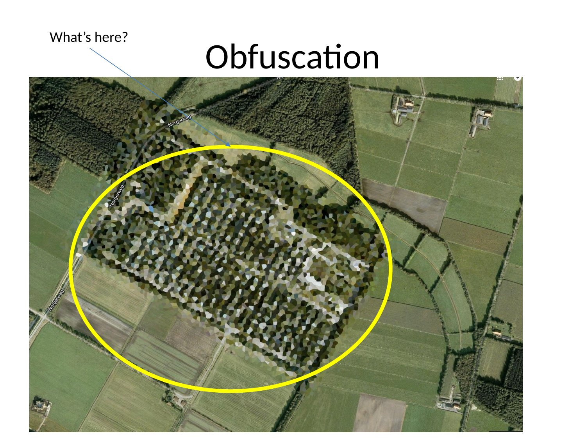

<!-- The Netherlands again: this area has been masked with a pixelated pattern because it is an ammunition depot, Munitiecomplex Veenhuizen. The imagery is there, but deliberately degraded. -->

---

<!-- _footer: "" -->

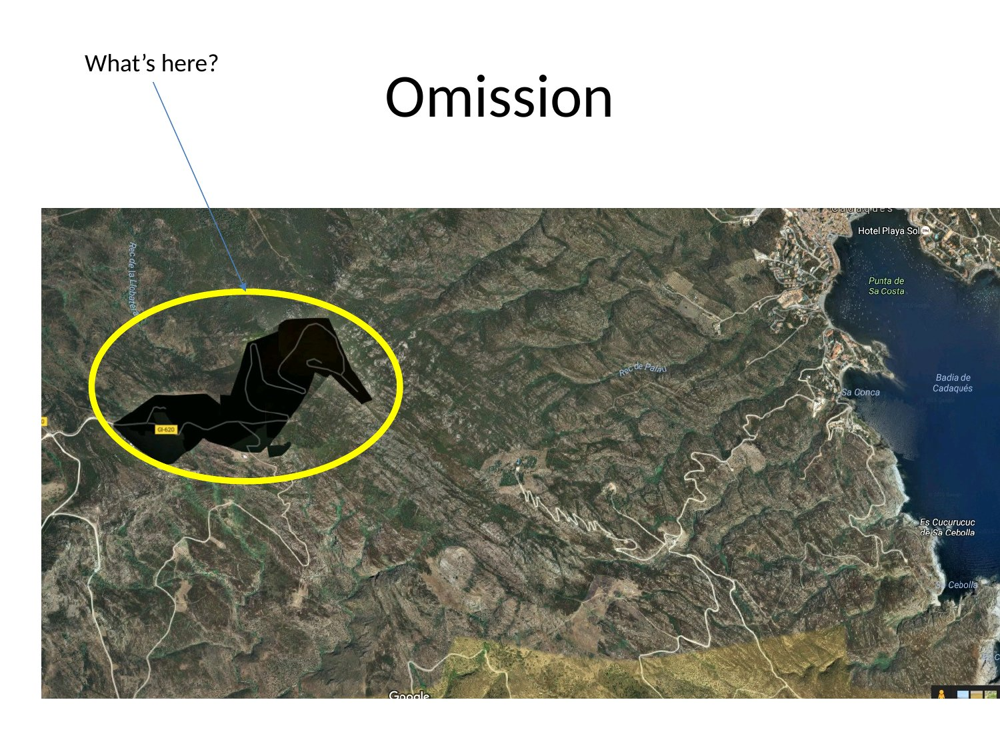

<!-- Something is very obviously hidden in the northeastern Spanish city of Girona. It is not clear what is beneath the black block, but the standard map view shows roads and a hotel there. Obfuscation hides what a thing is; omission removes it entirely. -->

---

<!-- _footer: "" -->

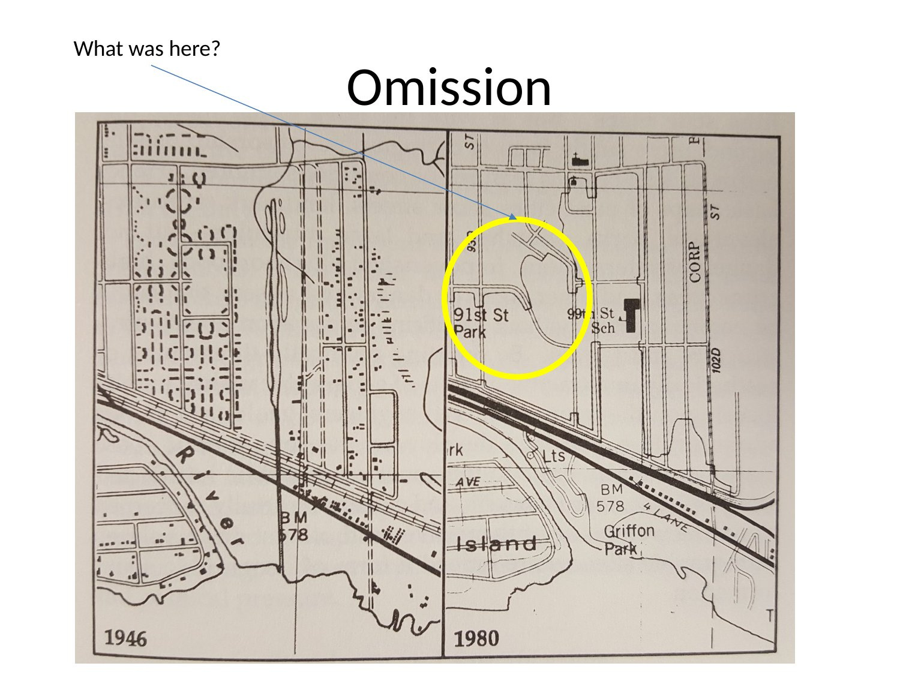

<!-- Large-scale topographic maps of the Love Canal area, 1946 and 1980. Note that the later map gives no indication that there were ever chemical factories here; the site had become the 91st Street Park. What a map leaves out is an editorial decision. -->

---

<!-- _footer: "" -->

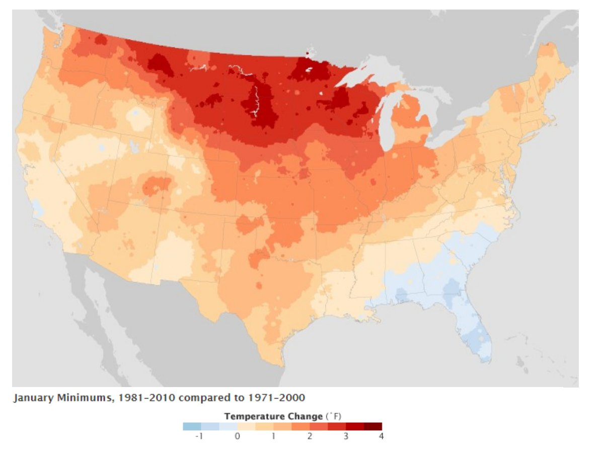

<!-- Symbology for dramatic effect. What is the red indicating here? It looks HOT. But this is only the increase in January minimum temperatures, 1981-2010 compared to 1971-2000. Minnesota is going from extremely cold in January to slightly less extremely cold in January. The color ramp does the arguing, not the data. -->

---

<!-- _class: quiz -->

# Did "most" of America vote Republican or Democrat in 2012?

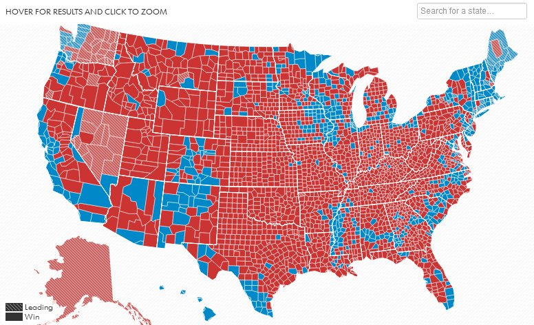

<!-- Let them answer from the map, then go to the next slide. The map shades area, but people vote, and area is a terrible proxy for population. -->

---

# The red counties hold more people than the gray

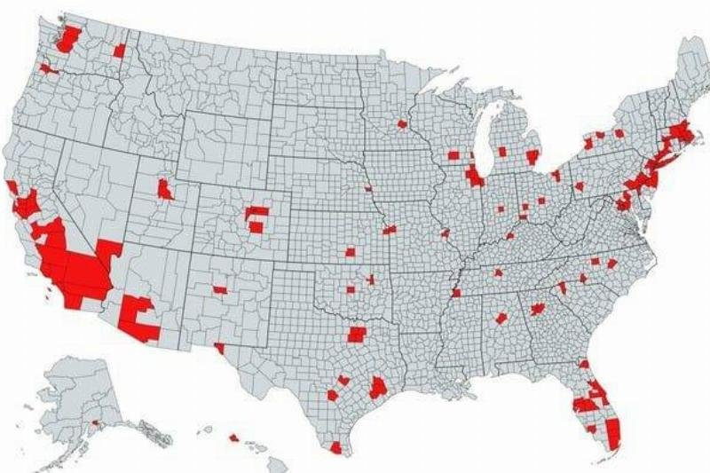

<!-- Same country, opposite impression. The red counties on this map contain a larger total population than all of the gray combined. Any choropleth of a person-based quantity has this problem: the reader's eye adds up area, not people. Fixes include cartograms, dot-density maps, and normalizing by population. -->

---

<!-- _class: lead -->

# Fun with maps

<!-- Lighten up for the last few minutes. These are here to make the point that a map is an argument, and sometimes a joke. -->

---

<!-- _class: quiz -->

# These proposed state boundaries are based on what?

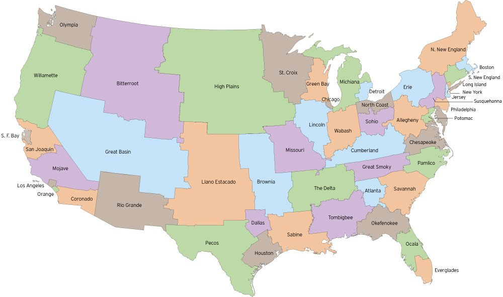

<ol type="A">
<li>Language/dialect</li>
<li>Population size</li>
<li>Voting patterns</li>
<li>Emigration history</li>
</ol>

<!-- Answer: B, population. Fifty states of roughly equal population, named after landscape features and cities rather than the historical boundaries. -->

---

# The world according to Ronald Reagan

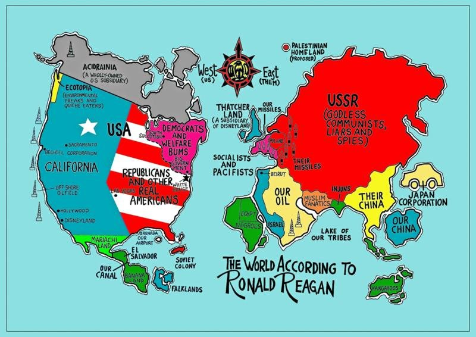

<!-- A persuasive map, not an accurate one: country sizes, labels, and colors are all chosen to make a political argument. Ask students to name the cartographic tricks in play, size distortion, loaded annotation, and a legend that does not exist. -->

---

# Point symbols can be anything

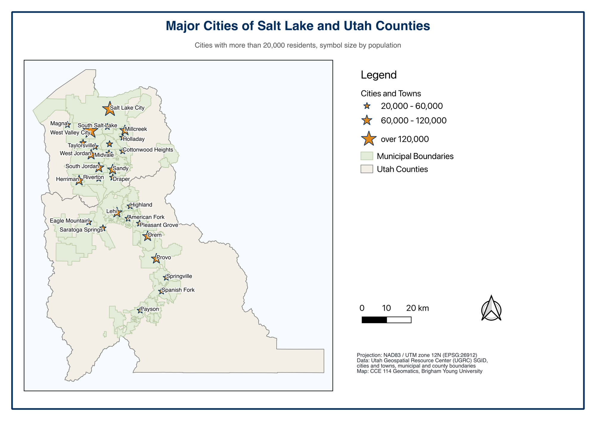

- A QGIS **Print Layout** of the major cities of Salt Lake and Utah counties
- It has a **title**, a **legend**, a **north arrow**, a **scale bar**, a **neat line**, and a **spatial reference** block
- The marker is a star sized by population — but it could be any shape, an SVG, or a picture

<!-- Made in QGIS 3.44 Print Layout from UGRC SGID data (cities and towns, municipal and county boundaries; cities over 20,000 people). Use it as the checklist slide in reverse: every required element is present. The original student map (David Shill, 2019) used a picture marker that was too large and too detailed for the scale of the map: the icons collided and the labels had to be pushed away with leader lines. Worth describing as the cautionary tale, and the photo marker in that student version happened to be a man named Dan Ames, probably not related to Dr. Ames. -->

---

# Light pollution across the continental U.S.

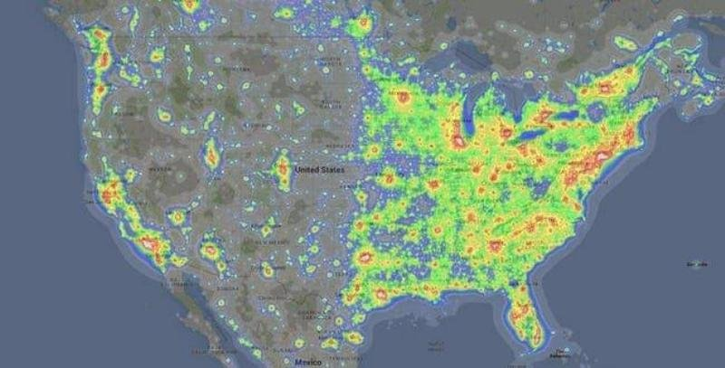

<!-- A raster color ramp doing all the work. If you like star gazing, head for the middle and northwest of the country; a 2016 study estimated that about 80 percent of North Americans cannot see the Milky Way. Geographer Tim Wallace has noted that scattered bright spots in places like North Dakota come from shale oil extraction and large facilities such as airports and power stations. Source: exploredplanet.com -->

---

# Land use across the United States

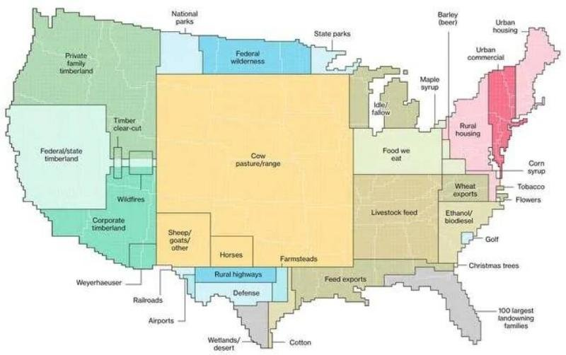

<!-- A cartogram-flavored land use map: the categories are drawn in proportion to the area they occupy. Much of the west is forest and timber, the middle of the country is pasture and cropland, and the small parcels, national parks, golf courses, Christmas trees, still show up. Ask what the legend would have to look like if this were a normal choropleth. Source: exploredplanet.com -->

---

# Air traffic control zones look nothing like the country

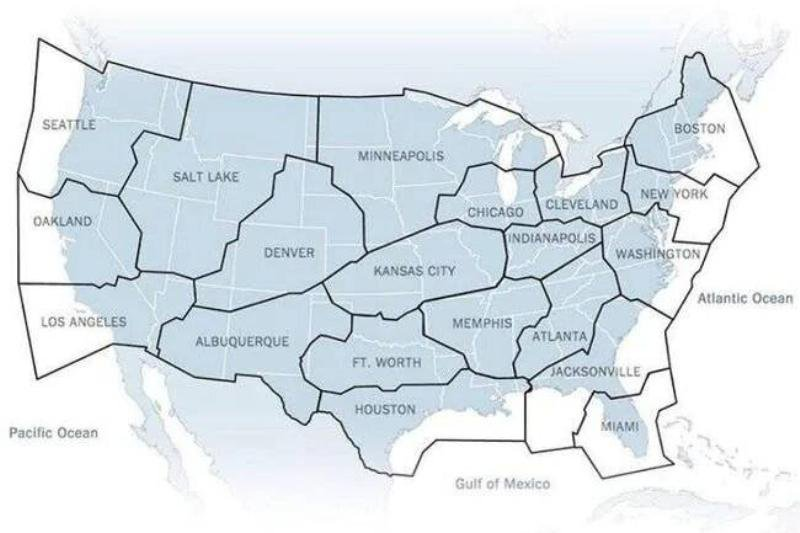

<!-- U.S. air traffic control is not divided by state but into 21 zones across the continental U.S., each centered on a major city such as Houston, New York, or Washington, D.C. Within each zone are sectors of airspace, and within those, each airport holds a five-mile radius. A reminder that useful boundaries often have nothing to do with the ones you already know. Source: exploredplanet.com -->

---

# More fun maps…

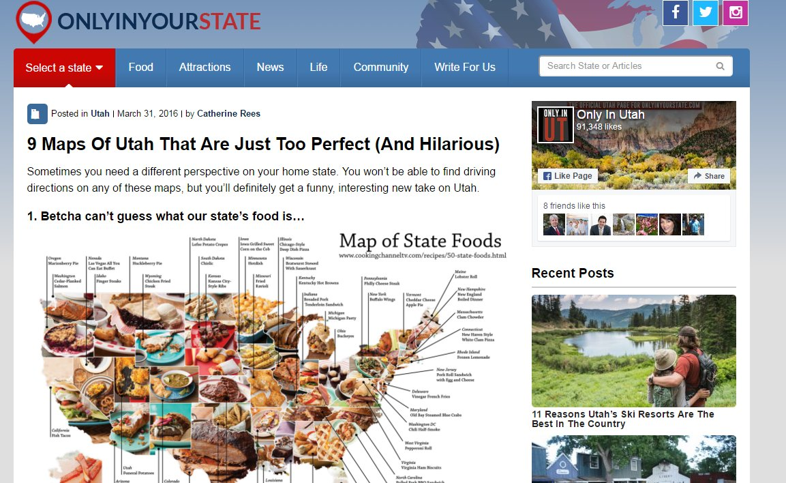

- <a href="http://www.onlyinyourstate.com/utah/9-funny-maps-of-ut/" target="_blank">9 Funny Maps of Utah</a>
- Visit at your own risk
- Bring a good or bad map you find to class and we will pick it apart

<!-- Light closer. The linked page includes a "map of state foods" and several other joke maps of Utah. -->

---

<!-- _class: activity -->

# Thursday: hands-on in QGIS, Playing with Symbology

- Follow along and make a **map of the United States** in QGIS
- Practice **point, line, and polygon symbology** in the layer properties
- Explore the **attribute table** and see how attributes drive symbology
- **Add labels** to your features
- In-class activity: make a colorful map and upload a screenshot

<!-- Preview of Thursday. The Thursday session Students bring laptops with QGIS installed. The "Playing with Symbology" activity is graded on participation: make a colorful map and upload a screenshot. -->

---

# Before Next Class

- Read the **map design** sections of Chapter 4 in *GIS Fundamentals* (Bolstad & Manson)
- **Quiz 2 — Spatial Data Models and File Types**, open book on Learning Suite, due **Saturday**
- **Lab 2 — Map Symbology and Layouts**, due **Saturday**: [assignments/lab-02](https://byu-hydroinformatics.github.io/cce114-geomatics/assignments/lab-02/)
- Bring your laptop with QGIS installed on Thursday
- Questions? Office hours: [calendly.com/dan-ames/office-hours](https://calendly.com/dan-ames/office-hours)

<!-- Confirm the Saturday due dates on Learning Suite before class. Lab 2 uses the checklist from the middle of this lecture, so point back at it. -->

<!-- Conversion notes (2026-09-02): source deck "Maps and Cartography.pptx" (2021 archive, 28 slides), plus four slides from "Interesting Map Perspectives.pptx" (red-vs-gray population, light pollution, land use, air traffic control zones). Source slide 28 ("Live Demo on Friday — Adjusting symbology in ArcGIS Pro") was replaced with the Thursday-with-Dr.-Halgren preview and rewritten for QGIS; no other source slide was dropped. Section-header slides 6, 11, and 23 became lead slides. Slides built from PowerPoint callout shapes (source slides 8, 15, 17-21) were re-rendered from the PDF at 150 dpi rather than rebuilt. The "Major Cities of Salt Lake and Utah Counties" student layout (mc-major-cities-icon-map.jpg) is an ArcMap/ArcGIS-produced layout; it is kept because the point is the layout checklist, but a QGIS-made replacement would be better. No other ArcGIS screenshots remain. Two slides were added that are not in the source: "The checklist for every map you turn in" and "Symbology by geometry type", both assembled from the callouts and poll options on source slide 8 and source slide 15. Course number corrected from CCE 214 to CCE 114 on the title slide. -->

<!-- Update 2026-09-02: ArcGIS-era screenshots replaced with QGIS 3.44 captures made by tools/qgis_reshoot_screens.py: mc-major-cities-qgis-layout.png replaces the ArcMap student layout. -->
