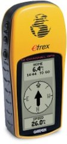
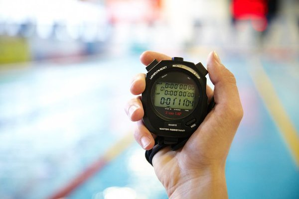
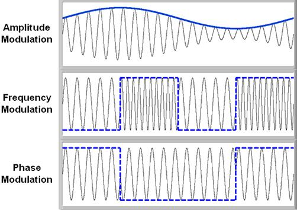
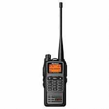
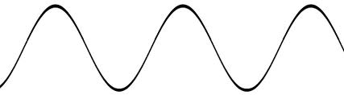
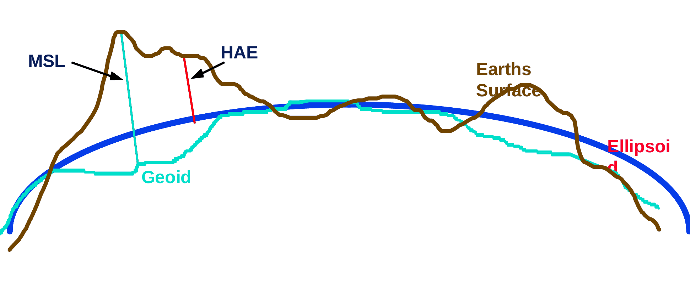
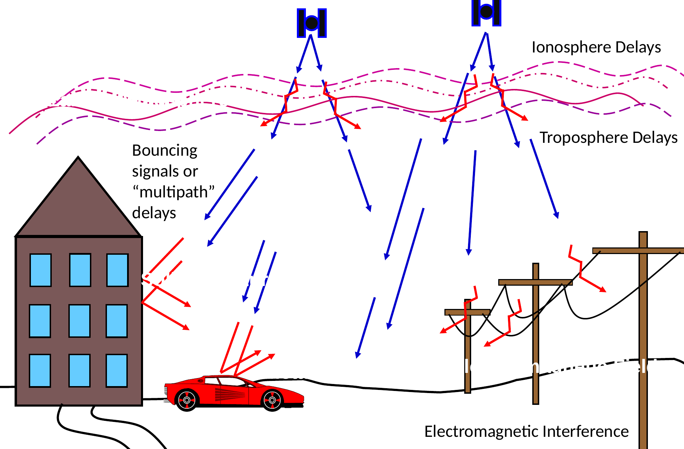
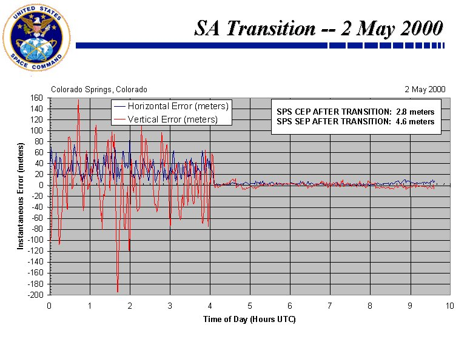
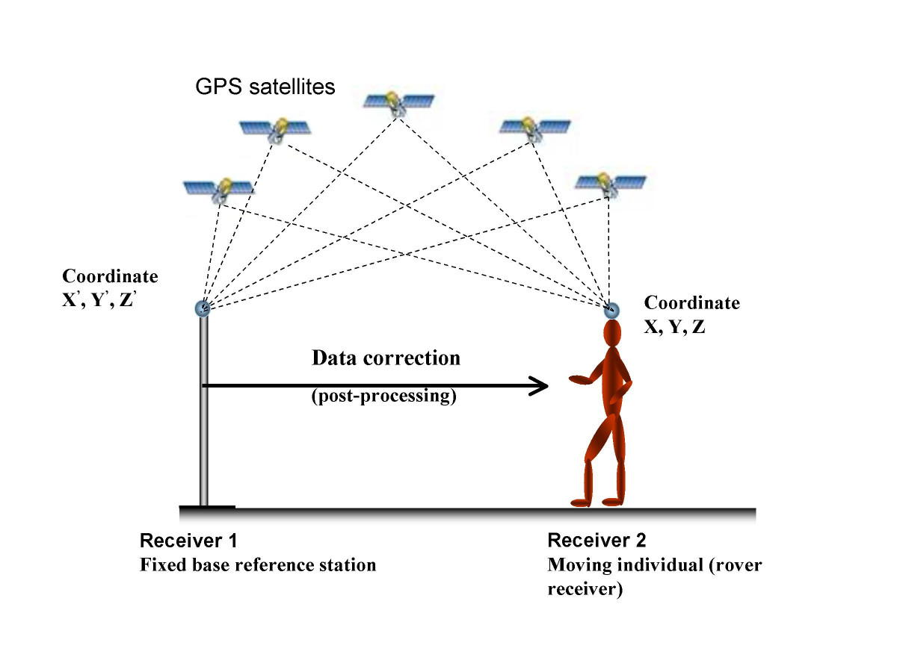
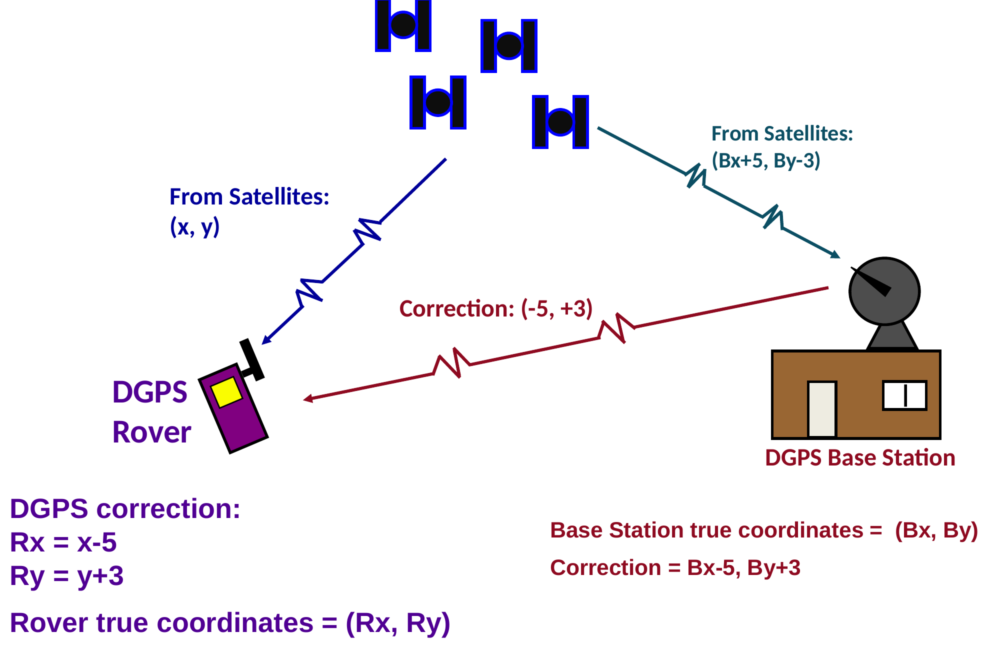

<!-- _class: lead -->
<!-- _paginate: skip -->

# The Global Positioning System

## Part 1

CCE 114 Geomatics
Dr. Dan Ames

<!-- Tuesday concept lecture. Thursday is the hands-on session with Dr. Halgren: trilateration by hand, computing positional error, and converting latitude/longitude to meters. Today we build the ideas those exercises rest on. -->

---

# Today's Goals

By the end of class you should be able to:

- Explain how a GPS receiver turns a **radio signal delay** into a **distance**, and distances into a **position**
- Say what **latitude and longitude** actually measure, and what a decimal place is worth in metres
- Name the main **sources of GPS error** and say roughly how large each one is
- Explain why converting **lat/long to metres** is not a single multiplication
- Collect a position with the receiver in your pocket and know how much to trust it

<!-- Set expectations: today is the concepts day. Thursday students trilaterate on paper and do the lat/long-to-metres conversion with Dr. Halgren. The reading is GIS Fundamentals chapter 5, GNSS and Coordinate Surveying, which this lecture follows. -->

---

# Where GPS fits: the 3 D's of map data

- **Download** — from where? What does the metadata say?
- **Digitize** — clicking on the map to create data by "drawing". How good can it possibly be?
- **DGPS** — differential GPS field data collection. Why *differential*? That is most of today
- Modern surveying fits in here too

<!-- Recall the three ways to get vector data into a GIS. Weeks 1 to 3 covered download and digitize. This week is the third: going out and measuring positions yourself. Everything students collect for Lab 3 comes from this third route. -->

---

# Four critical concepts

- **A. Pseudorandom noise** — *how long ago?*
- **B. Range** — *how far away?*
- **C. Trilateration** — *where am I?*
- **D. Differential GPS** — *no, really, where am I?*

Each one answers the question the one before it left open.

<!-- This is the roadmap for the next two class periods. A and B are today. C we set up today and work by hand Thursday. D closes out today. Keep pointing back at this list so students know where they are. -->

---

# GPS is one of several GNSS constellations

- **GNSS** = Global Navigation Satellite System; **GPS** is the U.S. one
- GPS: nominal **24 satellite slots**, usually about **31** healthy satellites
- Orbit altitude about **20,200 km**, roughly one revolution every **12 hours**
- Chosen for accuracy, survivability, and worldwide coverage
- Other constellations: **GLONASS** (Russia), **Galileo** (EU), **BeiDou** (China)
- Your phone listens to several at once, which is why it locks on so fast

<!-- Students often say "GPS" for any satellite positioning. Worth naming the difference once. The physics for the rest of the hour is the same for every constellation: a satellite broadcasts a coded signal, the receiver measures how late it arrived, and turns that into a distance. -->

---

<!-- _class: lead -->

# A. Pseudorandom noise

## *How long ago?*

---

# You are the U.S. Government

- You need to track military assets, anywhere on Earth
- Satellites can do it… but so many questions:
  - How do you **transmit** the information? AM? FM? PM?
  - What do you **include** in the radio message?
  - How do you **compute distance** from a satellite you cannot see?
- Everything about the GPS signal is an answer to one of these three questions

<!-- Frame the design problem the way the original engineers saw it in the early 1970s. GPS is a merger of two military programs, NAVSTAR, run by the Department of Defense; first test satellites in 1978, operational satellites from 1989. -->

---

# Radio wave transmission methods

- A **carrier signal** is modulated by a **message signal**
- **Amplitude**, **frequency**, or **phase** modulation
- GPS modulates the *phase* of the carrier with a digital code
- <a href="https://youtu.be/Iyzpt3bKTTI?t=85" target="_blank">Video explanation (youtu.be/Iyzpt3bKTTI)</a>

<!-- One minute of review from physics. The important idea: the satellite is not broadcasting its position in plain language, it is broadcasting a long digital code stamped onto the carrier wave. Play the linked video from 1:25 if the class needs the refresher. -->

---

# Computing radio wave travel time

<!-- This is the clever trick at the heart of GPS. The satellite and the receiver generate the SAME pseudorandom code at the SAME time. The receiver slides its own copy (green) along until it lines up with the copy that arrived from space (red). How far it had to slide IS the travel time. Nothing here requires an atomic clock in the receiver, only a code generator. -->

---

<!-- _class: quiz -->

# How far away is that satellite?

A GPS satellite's code arrives at your receiver **0.067 seconds** after it was sent. The speed of light is **299,792,458 m/s**.

<ol type="A">
<li>About 200 km</li>
<li>About 2,000 km</li>
<li>About 20,000 km</li>
<li>About 200,000 km</li>
</ol>

<!-- Answer C. 0.067 s x 299,792,458 m/s = 20,086,094 m, about 20,100 km. That is the real order of magnitude for a GPS satellite, which orbits at roughly 20,200 km. Ask them to notice how sensitive this is: an error of one microsecond in the clock is 300 m of position error. -->

---

<!-- _class: lead -->

# B. Range

## *How far away?*

---

# Distance = Rate × Time

- **D = R × T**
- **R** = the speed of light, 299,792,458 m/s
- **T** = travel time of the message, from the signal delay we just measured
- **D** = how far away the sender is

This is the same arithmetic as timing a thunderclap — only the rate is a million times larger.

<!-- Nothing exotic here. The whole system rests on this one line of algebra; everything else is about measuring T well and knowing where the satellite was when it sent the message. -->

---

# A worked example

- Signal travel time = **0.674 seconds**
- Speed of light = **299,792,458 m/s**
- Distance = **202,060,116 m**
- &nbsp;&nbsp;&nbsp;&nbsp;&nbsp;&nbsp;&nbsp; = **202,060 km**

Sanity check: a real GPS satellite is about <strong>20,200 km</strong> up, so its signal takes about <strong>0.067 s</strong>. Whatever sent this one is ten times further away.

<!-- The 0.674 s example is from the original lecture and the arithmetic is right, but the number is not a GPS satellite. Use it to make the point that the distance falls straight out of the delay, then use the callout to put students back at the real scale. -->

---

# C. From ranges to a position

- One range puts you somewhere on a **sphere** around that satellite
- Two ranges narrow it to a **circle**
- Three narrow it to **two points** — one of which is absurd
- A fourth solves for the **receiver clock error**
- Four unknowns — latitude, longitude, height, time — so you need four equations

<!-- Set the idea up today; Thursday students solve one of these by hand on paper with Dr. Halgren. Note the vocabulary: the original lecture calls this triangulation, but measuring distances rather than angles is properly TRILATERATION. Dr. Halgren will make that distinction again. -->

---

<!-- _class: lead -->

# Latitude, longitude, and precision

## What are those numbers on your phone?

---

# What latitude and longitude actually are

- GPS solves first in **Cartesian coordinates** *(X, Y, Z)*, centred on the Earth's centre of mass
  - Z along the mean rotational axis, X through 0° longitude, both X and Y in the plane of the equator
- Those are converted to **ellipsoidal coordinates** *(φ, λ, H)*
- **Latitude and longitude are angles, not distances**

<!-- The key sentence is the last bullet, and it is the reason for the whole "converting to metres" discussion later. An angle only becomes a distance once you say which ellipsoid you are measuring on and where on it you are standing. -->

---

# Angles need a datum

- A **datum** is an oriented reference ellipsoid: where it sits, how it is turned, and how big and flat it is
- Common ones in surveying:

| Ellipsoid | Datum | a (m) | 1/f |
|---|---|---|---|
| WGS-84 | WGS-84 | 6,378,137.000 | 298.257223563 |
| GRS-80 | NAD83 | 6,378,137.000 | 298.257222101 |
| Clarke 1866 | NAD27 | 6,378,206.400 | 294.978698200 |

- **One point can have different coordinates depending on the datum used**
- GPS works natively in **WGS-84**; most U.S. data is in **NAD83**; the two agree to about a metre

<!-- Note how nearly identical WGS-84 and GRS-80 are: the difference is in the tenth decimal place of the flattening. NAD27 is a different animal and can be hundreds of metres off. This is why QGIS asks you for a CRS every time you add a layer. -->

---

# Height is even messier

- The **ellipsoid** is a smooth mathematical model of the Earth's surface
- The **geoid** is a surface of equal gravitational pull, roughly mean sea level
- GPS gives you **height above the ellipsoid (HAE)**; your survey elevations are above the **geoid (MSL)**
- Orthometric height = ellipsoidal height − geoid separation

<!-- Beware: the letters h and H are used inconsistently across geodetic and GPS literature. Know what you are looking at. In the continental U.S. the separation is on the order of tens of metres, so a raw GPS elevation is not a usable elevation without a geoid model. -->

---

# Reading a coordinate

Three ways to write the same point:

- **Decimal degrees (DD)**
  `40.25000, -111.65000`
- **Degrees, minutes, seconds (DMS)**
  `40°15'00" N, 111°39'00" W`
- **Degrees, decimal minutes (DDM)**
  `40°15.000' N, 111°39.000' W`

Negative longitude = west. Negative latitude = south.

- Your phone and QGIS both prefer **decimal degrees**
- Mixing formats is the single most common way to put a point in the wrong hemisphere
- <a href="https://tagis.dep.wv.gov/convert/" target="_blank">tagis.dep.wv.gov/convert</a> converts between them

<!-- Have a student read their own current coordinates out loud in each of the three formats. The minus sign matters: dropping it puts Provo in China. -->

---

# What is a decimal place worth?

| Decimal places | Latitude changes by |
|---|---|
| 1.0° | ≈ 111 km |
| 0.1° | ≈ 11 km |
| 0.01° | ≈ 1.1 km |
| 0.001° | ≈ 111 m |
| 0.0001° | ≈ 11 m |
| 0.00001° | ≈ 1.1 m |
| 0.000001° | ≈ 11 cm |

- Rounding is **throwing away accuracy you paid for**
- A phone fix is good to a few metres, so it deserves **five decimal places**
- Four decimals cannot resolve a building; two cannot resolve a city block
- **Record the full precision your phone gives you** in today's activity

<!-- This table is the practical takeaway of the whole lecture. Students routinely copy 40.25, -111.65 into a spreadsheet and then wonder why their point lands in a field. Make them write down all the digits. -->

---

<!-- _class: quiz -->

# Precision or accuracy?

Your phone reports `40.2496612, -111.6493388` while sitting on a desk. The true position of the desk is 8 m away.

<ol type="A">
<li>Precise and accurate</li>
<li>Precise but not accurate</li>
<li>Accurate but not precise</li>
<li>Neither</li>
</ol>

<!-- Answer B. Seven decimal places is about a centimetre of PRECISION; being 8 m from the truth is poor ACCURACY. The receiver reports every digit it computed, not the digits it can defend. This distinction is on the quiz. -->

---

# Why lat/long to metres is not one multiplication

- **Latitude** is nearly uniform: about **111 km per degree**, but it still varies from 110,574 m at the equator to 111,694 m at the poles because the Earth is an ellipsoid
- **Longitude shrinks toward the poles**: one degree spans 111 km at the equator and **zero** at the pole
- The meridians converge; a degree is not a fixed length in the east–west direction

$$\Delta x \approx 111{,}320 \times \cos(\varphi)\ \text{m per degree}$$

At Provo, φ ≈ 40.25°:

- 1° of latitude ≈ **111,000 m**
- 1° of longitude ≈ **84,960 m**
- 0.00001° of longitude ≈ **0.85 m**

<!-- Do the cosine on the board: cos(40.25 degrees) = 0.763, times 111,320 m, gives about 85 km. Ask what happens at 60 degrees north (half). Ask what happens at the pole (zero). This is the reason you cannot compute a distance or an area in degrees. -->

---

# So what do you do instead?

1. **Never** compute length or area in degrees
2. **Project** the data into a coordinate system whose units are metres
   - **UTM Zone 12N** (EPSG:32612) covers Utah
   - or **Utah State Plane Central (NAD83)**
3. In QGIS: set the project CRS, or right-click a layer → **Export → Save Features As…** and pick the target CRS
4. Then, and only then, use the measure tool or a field calculator

- For a single point, <a href="https://tagis.dep.wv.gov/convert/" target="_blank">tagis.dep.wv.gov/convert</a> converts lat/long to UTM and back
- Thursday you will import real phone positions into QGIS with Dr. Halgren and watch this conversion happen

<!-- The habit to build: degrees for storing and sharing, projected metres for measuring. QGIS will happily let you measure in degrees and hand you a meaningless number. This is Step 4 of Lab 3. -->

---

<!-- _class: lead -->

# D. Differential GPS

## *No, really, where am I?*

---

# But first: why do we need correction at all?

GPS measurements have ERRORS in them

Every range you measure is slightly wrong. The next few slides are a tour of *why*.

<!-- Transition slide. Ask the class to guess the sources before you show them: atmosphere, buildings, trees, the receiver itself, the satellites themselves, and the user. -->

---

# Error source: signal interference

<!-- The signal has to cross the ionosphere and the troposphere, both of which slow it down and bend it, and it can bounce off buildings, metal, and terrain before it reaches you. Every one of those adds delay, and delay reads as extra distance. -->

---

# Error source: multipath

- The signal arrives **twice**: once directly, once bounced off a wall
- The bounced copy travelled further, so it reads as a longer range
- **Stay away from buildings and other structures** when using a GPS receiver
- Reflective surfaces are the worst: glass, metal siding, wet pavement

<!-- Practical advice for today's activity: standing against the Clyde Building will give a worse fix than standing on the lawn. Tell students to notice whether their reported accuracy changes when they step into the open. -->

---

# Error source: bad coverage

- GPS has worldwide coverage, **however…**
- You can lose satellites, or receive degraded signals, in
  - areas with **dense foliage**
  - **urban canyons**
  - **deep valleys and gorges**
- Fewer satellites, or badly placed satellites, means a worse fix

<!-- Ask who has watched their phone's blue dot jump around downtown between tall buildings. That is coverage plus multipath together. -->

---

# Error source: selective availability

- The Defense Department deliberately **dithered the satellite time message**, degrading accuracy for civilian users
- Intended to keep adversaries from using GPS against the U.S. and its allies
- **May 2000:** the Pentagon reduced SA to zero
- It could in principle be reactivated

<!-- The chart is the actual transition on 2 May 2000: horizontal error collapses from about 45 m to a few metres in one step. Anyone using GPS before that date remembers it. Modern GPS satellites are not built with the SA capability. -->

---

# Error sources: the budget

Standard Positioning Service, civilian users:

| Source | Amount of error |
|---|---|
| Satellite clocks | 1.5 – 3.6 m |
| Orbital errors | < 1 m |
| Ionosphere | 5.0 – 7.0 m |
| Troposphere | 0.5 – 0.7 m |
| Receiver noise | 0.3 – 1.5 m |
| Multipath | 0.6 – 1.2 m |
| User error | up to a kilometre or more |

- The atmosphere is the biggest instrument error
- **User error dwarfs all of it**: wrong datum, wrong units, wrong point, fat fingers
- Errors are **cumulative**, and they are **multiplied by PDOP**
- Thursday you will see this error as the scatter between phones at the same spot

<!-- Selective availability used to sit in this table at about 100 m; it is zero now. Point out that the row students control is the last one. -->

---

# Receiver errors are cumulative

<!-- The picture: system and other flaws are under about 9 metres, while user error can be plus or minus a kilometre. Ask what kind of user error puts you a kilometre off. Answer: reading the coordinate in the wrong format, entering the wrong datum, or recording the wrong point. -->

---

# Error source: dilution of precision

- It is better for your receiver to get a fix on **widely distributed** satellites than on satellites bunched together
- Same range measurements, same range errors — but a much bigger area of uncertainty
- This multiplier is the **Positional Dilution of Precision (PDOP)**
- **Lower PDOP is better.** Under about 7 is usable; under 3 is good

<!-- DOP is pure geometry: it is the magnification factor that turns measurement noise into position noise. It changes minute by minute as the constellation moves overhead, which is why the same spot can give different accuracy an hour later. -->

---

# High PDOP versus low PDOP

Satellites close together → a **large** area of uncertainty. Satellites widely spaced → a **small** one.

<!-- Left: high PDOP, satellites clustered, the intersection of the fuzzy range bands is a long thin region. Right: low PDOP, satellites spread across the sky, the intersection is compact. Thursday we put a number on this. -->

---

# Differential GPS helps us deal with these errors

<!-- The idea in one line: put a second receiver on a point whose coordinates you already know. Whatever error it sees right now, the receiver a few kilometres away is seeing almost the same error at the same moment. -->

---

# How a base station corrects a rover

1. The exact position is already **known** at the base station
2. Take the satellite-derived x and y **at the base**, and compute the **dx and dy errors** in the signal
3. Apply those corrections to the **moving receiver's** x and y measurements

<a href="https://www.youtube.com/watch?v=Xj3LBNBecnM" target="_blank">youtube.com/watch?v=Xj3LBNBecnM</a>

<!-- The linked video walks through the same idea if you want to show it. Real-time DGPS needs a radio link between base and rover; post-processed DGPS applies the same corrections later in the office from a logged file. -->

---

# The arithmetic of a differential correction

<!-- Work it on the board. The base knows it is at (Bx, By). The satellites tell it (Bx+5, By-3). So the correction is (-5, +3). Apply that same correction to the rover: Rx = x-5, Ry = y+3. That is all DGPS is. Modern equivalents are RTK, WAAS, and network corrections such as UNAVCO or the Utah reference network. -->

---

<!-- _class: activity -->

# In-class activity: collect three positions

1. Leave the classroom and **walk campus for about 10 minutes**
2. Find **three interesting locations** — a landmark, a bench, a favourite tree
3. At each one, record the **latitude and longitude from your phone**, at **full precision** (every digit it gives you)
4. Enter your **name, location, latitude, longitude** in the shared **"GPS activity"** tab of the Google Sheet linked on Learning Suite
5. Record completion on **Learning Suite**

- Stand in the open, away from buildings — remember multipath
- Note whether your phone reports an accuracy figure
- <a href="https://tagis.dep.wv.gov/convert/" target="_blank">tagis.dep.wv.gov/convert</a> if you need to convert formats

<!-- Ten minutes out, five minutes back, five minutes to look at the sheet together. Project the sheet when they return and paste the points into QGIS if there is time: the spread of the class's readings for the same landmark is the best possible illustration of GPS error. Watch for rows with only two or three decimal places and for missing minus signs on longitude. -->

---

# Thursday: hands-on with Dr. Halgren

- **Twenty minutes on campus:** collect three positions with your phone, full precision, into the shared **"GPS activity"** sheet
- **Live demo:** the class points imported into QGIS from a CSV, given a CRS, and reprojected to UTM metres
- **See the error:** how far apart two phones put the same statue
- Bring a **phone with a GPS app** that shows five decimal places, and a **laptop with QGIS**

<!-- Preview of Thursday. Dr. Halgren runs the session: field collection first, then the import demo. The "GPS Class Activity" item on Learning Suite is recorded that day. Run sheet: byu-hydroinformatics.github.io/cce114-geomatics/hands-on/week-04/ -->

---

# Before Next Class

- Read **Chapter 5, GNSS and Coordinate Surveying**, in *GIS Fundamentals* (Bolstad & Manson)
- Take **Quiz 3 (GPS Part 1)**, open book, on Learning Suite — **due Saturday**
- **Lab 3: GPS Data Collection and Importing Into QGIS** — [assignments page](https://byu-hydroinformatics.github.io/cce114-geomatics/assignments/lab-03/) — **due Saturday**
- Upload your **"Where Am I"** solution photo to Learning Suite today
- Bring your phone with a GPS app and your laptop with QGIS on Thursday
- Questions? Office hours: [calendly.com/dan-ames/office-hours](https://calendly.com/dan-ames/office-hours)

<!-- Confirm the Saturday due dates against Learning Suite before class. -->

<!-- Conversion notes (2026-09-02): sources were "GPS and Triangulation.pptx" (2025) and, for the position-fixing and geoid/ellipsoid figures, the older "GPS basics.pptx" (2024, a legacy Trimble real-time-surveying deck whose pale blue slide background was whitened when the figures were extracted). Source slides used here: 6-12, 14, 16-23, 25-30 of GPS and Triangulation, plus slides 16 and 17 of GPS basics. Slides 1-5, 13, 15, 24 of GPS and Triangulation moved to the Day 7 deck (Air Force One, the Prague "Where am I" activity, the sphere/trilateration figures, and the range-uncertainty sketches). Nothing was dropped as unusable except the hidden slide 13 ("d1 d2 d3", a bare shape overlay with no context). No ArcGIS screenshots appear in either source deck, so no QGIS re-shoots are needed; the only software text is the QGIS reprojection workflow on the "So what do you do instead?" slide, which was written for this deck. New material not in the sources, written to cover the assigned topics: the GNSS constellations slide, the three coordinate-format slide, the decimal-places-to-metres table, the precision-versus-accuracy quiz, and the "why lat/long to metres is not one multiplication" pair of slides. The worked range example (0.674 s) is the original's number and the arithmetic is correct, but it is not a GPS-scale distance, so a sanity-check callout was added. -->
