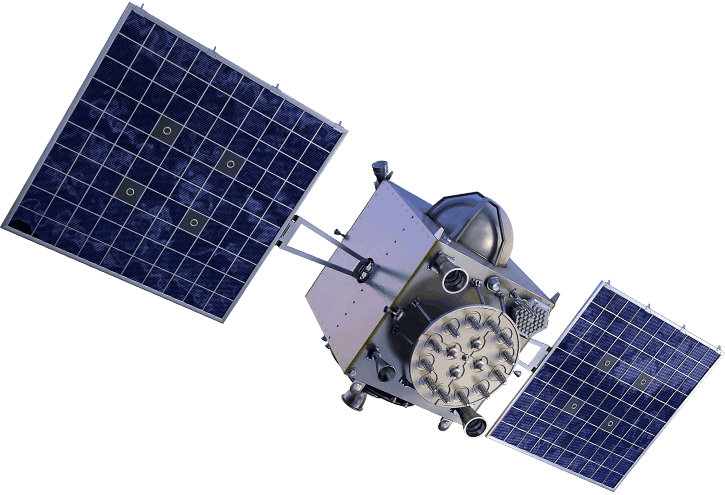
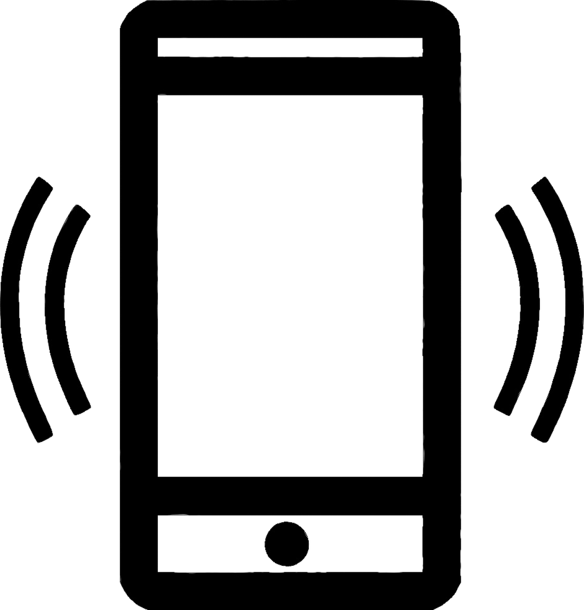
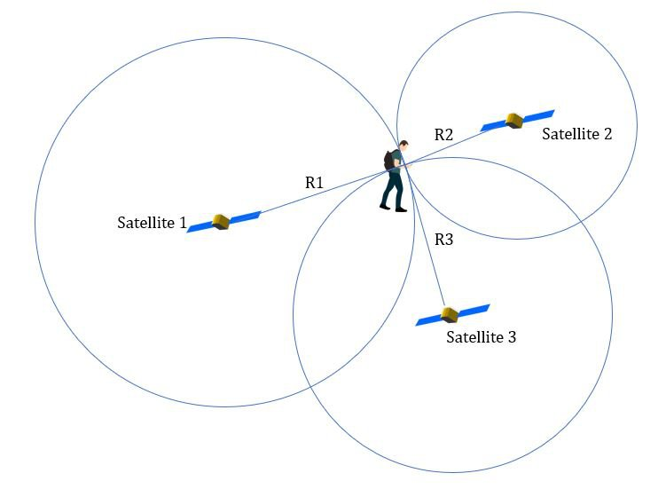
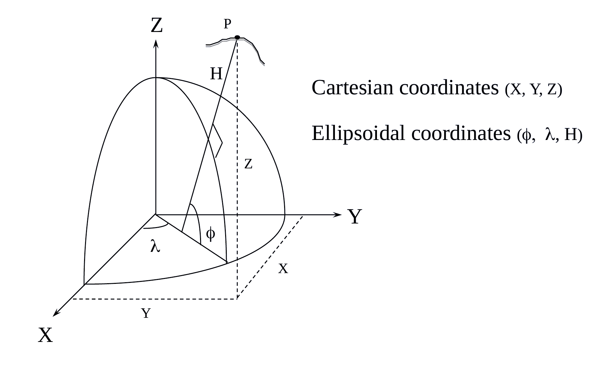
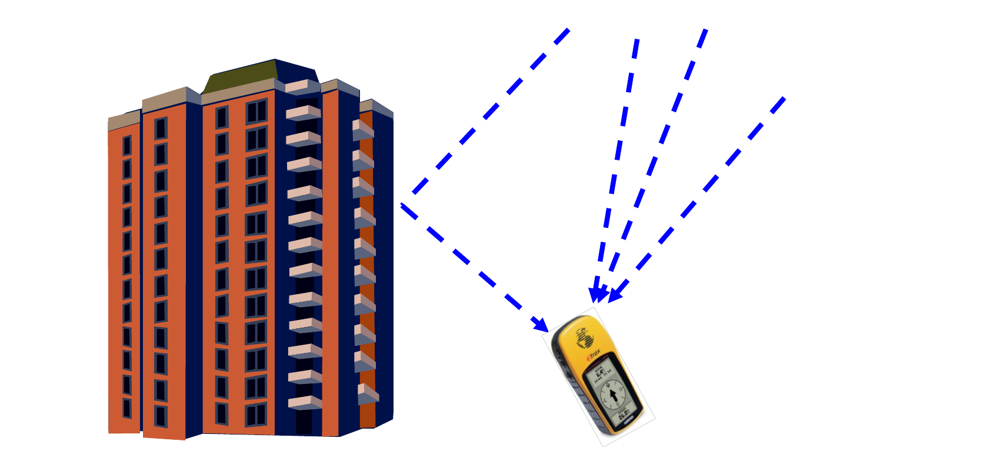
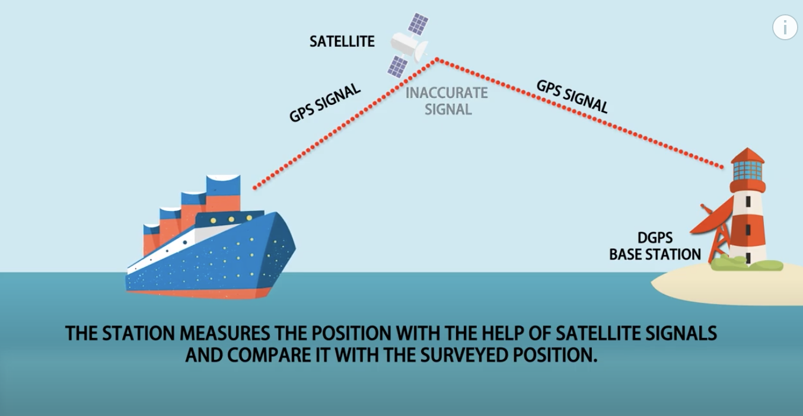

<!-- _class: lead -->
<!-- _paginate: skip -->

# The Global Positioning System

## How the receiver in your pocket knows where it is

CCE 114 Geomatics
Dr. Dan Ames

<!-- Tuesday concept lecture, Week 4, simplified for a 50-minute hour that also holds two activities. Order: Air Force One warm-up (5 min), the Prague "Where Am I" activity (15 min), then the short explanation of how GPS does the same thing (about 25 min). Thursday is field collection on campus and the QGIS import in the Thursday hands-on session. The longer version of this material (four-step position fix, error budget arithmetic, the meters demo) is in the extended deck linked from the Day 6 page. -->

---

# Today's Goals

By the end of class you should be able to:

- **Find a hidden object from three distances**, first in this room, then on a map of Europe
- Explain how a GPS receiver turns a **signal delay** into a **distance**, and distances into a **position**
- Read a **latitude and longitude** and say what a decimal place is worth in meters
- Name the **big sources of GPS error** and the one you control

<!-- Set expectations: two activities first, explanation second. Students will have done trilateration with their own hands before anyone says the word. The reading is GIS Fundamentals chapter 5, GNSS and Coordinate Surveying. -->

---

<!-- _class: activity -->

# Warm-up: find Air Force One

A photo of Air Force One is hidden somewhere in this room. Three "satellites" have been marked. Your ranges:

- **___ inches** from Satellite 1
- **___ inches** from Satellite 2
- **___ inches** from Satellite 3

Find it. You have five minutes.

<!-- Instructor setup, before class: tape the Air Force One picture somewhere in the room, mark three fixed points as satellites 1, 2, and 3 (sticky notes on a light, a door frame, the lectern corner), measure the straight-line distance from each to the photo with a tape, and write the three numbers on this slide. The 2021 numbers (169, 216, 151 inches) belonged to a different room. Hand out tape measures or string and let them swing arcs. The point: three ranges from three known points fix a position. -->

---

<!-- _class: activity -->

# Activity: "Where Am I?"

I visited Europe and got lost.

I heard three radio stations announcing the time, but each was off from the actual time. The difference is the **time the signal took to travel** from that station to me:

- **Amsterdam:** 2.37 × 10⁻³ seconds
- **Paris:** 2.95 × 10⁻³ seconds
- **London:** 3.45 × 10⁻³ seconds

**Where am I?**

**To turn in (graded, 5 points):**

1. Convert each delay to a distance (**D = R × T**, R = 299,792 km/s)
2. Draw the three circles on a map of Europe
3. Write your **name** and your **answer** on the paper
4. **Photograph it** and upload to the **Where Am I** item on Learning Suite

<!-- Printed maps of Europe with a scale bar, one per student, or a web map with the measure tool. Compasses or string. Twelve to fifteen minutes. Circulate and check that they converted seconds to kilometers before drawing; the usual mistake is a circle in meters on a map scaled in kilometers. Reveal the answer only after they commit. -->

---

# The answer: Prague

- **711 km** from Amsterdam, **884 km** from Paris, **1,034 km** from London
- Three distances from three known points, and the location falls out
- **You just did what a GPS receiver does**, with radio stations instead of satellites and milliseconds instead of nanoseconds
- A millisecond of error here is **300 km**; GPS needs nanoseconds

<!-- Check the arithmetic: 0.00237 s x 299,792 km/s = 710.5 km. Ask what a fourth station would add (a check on your own clock) and what would go wrong if all three stations were in a line (the circles meet at a shallow angle and the answer smears out). Both come back in the error slides. -->

---

<!-- _class: lead -->

# So how does the receiver in your pocket do that?

## Three questions: how long ago, how far, where

---

# GPS is one of several GNSS constellations

- **GNSS** = Global Navigation Satellite System; **GPS** is the U.S. one
- About **31** working satellites, **20,200 km** up, each circling the Earth twice a day
- Other constellations: **GLONASS** (Russia), **Galileo** (EU), **BeiDou** (China)
- Your phone listens to several at once, which is why it locks on so fast
- Every satellite does the same thing: **broadcast a coded time signal**

<!-- Students say "GPS" for any satellite positioning; name the difference once. Everything for the rest of the hour is the same for every constellation: the satellite broadcasts a code, the receiver measures how late it arrived, and turns that into a distance. -->

---

# How long ago? Measuring the delay

The satellite and your receiver generate the **same code at the same time**. The receiver slides its copy until it lines up with the copy from space. **How far it had to slide is the travel time.**

<!-- This is the clever trick at the heart of GPS. No atomic clock needed in the receiver, only a code generator. The radio stations in the Prague problem did the same job by announcing the time. -->

---

<!-- _class: quiz -->

# How far away? Distance = Rate × Time

A GPS satellite's code arrives **0.067 seconds** after it was sent. The speed of light is **299,792,458 m/s**. How far away is the satellite?

<ol type="A">
<li>About 200 km</li>
<li>About 2,000 km</li>
<li>About 20,000 km</li>
<li>About 200,000 km</li>
</ol>

<!-- Answer C: 0.067 x 299,792,458 = 20,086,094 m, about 20,100 km, which is the real orbit height. Same arithmetic as Prague, same arithmetic as timing a thunderclap. Point out the sensitivity: one microsecond of clock error is 300 m of position error. -->

---

# Where? From ranges to a position

- One range puts you somewhere on a **sphere** around that satellite
- Two ranges narrow it to a **circle**
- Three narrow it to **two points**, one of them absurd
- A **fourth** solves for your receiver's clock error
- Four unknowns (latitude, longitude, height, time), four satellites

<!-- This is Prague in three dimensions. Vocabulary: measuring distances is TRILATERATION; triangulation measures angles. The extended deck builds this one sphere at a time if anyone wants it. -->

---

<!-- _class: lead -->

# What are those numbers on your phone?

## Latitude, longitude, and precision

---

# Latitude and longitude are angles, not distances

- The receiver solves in **X, Y, Z** from the center of the Earth, then converts to **latitude, longitude, height** on an ellipsoid
- An angle only becomes a distance once you say **which ellipsoid** (the datum) you are standing on
- GPS uses **WGS-84**; most U.S. data is **NAD83**; the two agree to about a meter
- Height is above the ellipsoid, **not** above sea level; more on that in Week 8

<!-- The key sentence is the title. It is the reason converting to meters, two slides from now, is not one multiplication, and it is why QGIS asks for a CRS every time you add a layer. Datums and the geoid get their own day in Week 8. -->

---

# Reading a coordinate

Three ways to write the same point:

- **Decimal degrees (DD)**
  `40.25000, -111.65000`
- **Degrees, minutes, seconds (DMS)**
  `40°15'00" N, 111°39'00" W`
- **Degrees, decimal minutes (DDM)**
  `40°15.000' N, 111°39.000' W`

Negative longitude = west. Negative latitude = south.

- Your phone and QGIS both prefer **decimal degrees**
- Dropping the minus sign is the most common way to put Provo in China
- <a href="https://tagis.dep.wv.gov/convert/" target="_blank">tagis.dep.wv.gov/convert</a> converts between formats

<!-- Have a student read their current coordinates out loud in each format. Thursday's field collection asks for decimal degrees with the minus sign. -->

---

# What is a decimal place worth?

| Decimal places | Latitude changes by |
|---|---|
| 1.0° | ≈ 111 km |
| 0.1° | ≈ 11 km |
| 0.01° | ≈ 1.1 km |
| 0.001° | ≈ 111 m |
| 0.0001° | ≈ 11 m |
| 0.00001° | ≈ 1.1 m |
| 0.000001° | ≈ 11 cm |

- Rounding is **throwing away accuracy you paid for**
- A phone fix is good to a few meters, so it deserves **five decimal places**
- Four decimals cannot resolve a building; two cannot resolve a city block
- **Record every digit your phone gives you** on Thursday

<!-- The practical takeaway of the hour. Students copy 40.25, -111.65 into a spreadsheet and wonder why the point lands in a field. -->

---

<!-- _class: quiz -->

# Precision or accuracy?

Your phone reports `40.2496612, -111.6493388` while sitting on a desk. The true position of the desk is 8 m away.

<ol type="A">
<li>Precise and accurate</li>
<li>Precise but not accurate</li>
<li>Accurate but not precise</li>
<li>Neither</li>
</ol>

<!-- Answer B. Seven decimal places is about a centimeter of precision; being 8 m from the truth is poor accuracy. The receiver reports every digit it computed, not the digits it can defend. On the quiz. -->

---

# Why lat/long to meters is not one multiplication

- **Latitude:** about **111 km per degree** everywhere
- **Longitude shrinks toward the poles:** 111 km per degree at the equator, **zero** at the pole
- At Provo (φ ≈ 40.25°): 1° of longitude ≈ 111,320 × cos φ ≈ **85 km**

**So, the rule:**

1. **Never** measure length or area in degrees
2. **Project** into meters first: **UTM Zone 12N** (EPSG:26912) for Utah
3. Then measure

Thursday, we will do exactly this with the points you collect.

<!-- Do cos(40.25) = 0.763 on the board. Ask what happens at 60 degrees north (half) and at the pole (zero). Degrees for storing and sharing, projected meters for measuring; QGIS will happily hand you a meaningless number in degrees. -->

---

<!-- _class: lead -->

# GPS measurements have errors in them

## Where they come from, and which one is yours

---

# The error budget

| Source | Typical error |
|---|---|
| Satellite clocks and orbits | 1 – 4 m |
| Ionosphere and troposphere | 5 – 8 m |
| Multipath (bounced signals) | 0.5 – 1 m |
| Receiver noise | 0.3 – 1.5 m |
| **User error** | **up to a kilometer or more** |

The row you control is the last one: wrong sign, wrong datum, wrong point, rounding.

- **Stay away from buildings**: a bounced signal reads as a longer range
- Trees, urban canyons, and deep valleys cost you satellites

<!-- The atmosphere is the biggest instrument error; user error dwarfs all of it. Practical advice for Thursday: the lawn gives a better fix than the wall of the Clyde. Selective availability (deliberate military degradation, ~100 m) was switched off in May 2000, which is why the table no longer has that row. -->

---

# Geometry matters: dilution of precision

Satellites bunched together → a **large** area of uncertainty. Satellites spread across the sky → a **small** one. The multiplier is called **PDOP**; lower is better, under 3 is good.

<!-- Same range errors, different geometry. This is the "three stations in a line" question from Prague. It changes minute by minute as the constellation moves, which is why the same spot can read differently an hour later. -->

---

# Fixing the errors: differential GPS

- Put a second receiver on a point whose position is **already known** (a base station)
- Whatever error it sees right now, a receiver a few kilometers away sees **almost the same error at the same moment**
- Compute the base's **dx, dy** correction and apply it to the moving receiver
- Today's versions: **WAAS** in your phone, **RTK** on a survey rover, the **Utah reference network**

<!-- One idea, one slide. Work the arithmetic on the board if there is time: base knows it is at (Bx, By), satellites say (Bx+5, By-3), correction is (-5, +3), apply it to the rover. Survey-grade receivers reach centimeters this way. -->

---

# Thursday: hands-on in QGIS

- **Twenty minutes on campus:** collect three positions with your phone, full precision, into the shared **"GPS activity"** sheet
- **Live demo:** the class points imported into QGIS from a CSV, given a CRS, and reprojected to UTM meters
- **See the error:** how far apart two phones put the same statue
- Bring a **phone with a GPS app** that shows five decimal places, and a **laptop with QGIS**

<!-- Preview of Thursday. The Thursday session field collection first, then the import demo. The "GPS Class Activity" item on Learning Suite is recorded that day. Run sheet: byu-hydroinformatics.github.io/cce114-geomatics/hands-on/week-04/ -->

---

# Before Next Class

- Upload your **"Where Am I"** solution photo to Learning Suite today
- Read **Chapter 5, GNSS and Coordinate Surveying**, in *GIS Fundamentals* (Bolstad & Manson)
- Take **Quiz 3 (GPS Part 1)**, open book, on Learning Suite — **due Saturday**
- **Lab 3: GPS Data Collection and Importing Into QGIS** — [assignments page](https://byu-hydroinformatics.github.io/cce114-geomatics/assignments/lab-03/) — **due Saturday**
- Bring your phone with a GPS app and your laptop with QGIS on Thursday
- Questions? Office hours: [calendly.com/dan-ames/office-hours](https://calendly.com/dan-ames/office-hours)

<!-- Confirm the Saturday due dates against Learning Suite before class. -->

<!-- Revision notes (2026-09-03): simplified from the 40-slide Part 1 deck at Dan's request so that Tuesday of Week 4 holds the Air Force One warm-up, the Prague activity, and a short GPS explanation in one 50-minute hour. Kept: constellations, the code-delay trick, the range quiz, ranges-to-position, angles-not-distances, coordinate formats, the decimal-place table, the precision/accuracy quiz, the lat/long-to-meters rule, a one-slide error budget, PDOP, and DGPS. Dropped or merged: the 3 D's of map data, the four-concepts roadmap, the U.S. Government framing, modulation methods, the 0.674 s worked example, the datum table, the geoid/ellipsoid slide (Week 8 covers it), the six separate error-source slides, the cumulative-error figure, the PDOP distribution figure, the DGPS post-processing and base/rover arithmetic figures, and the Tuesday campus-walk activity (now Thursday). The Air Force One and Prague slides came from the Part 2 deck, which is kept as the extended reference deck. Original sources: "GPS and Triangulation.pptx" (2025) and "GPS basics.pptx" (2024). -->
