<!-- _class: lead -->
<!-- _paginate: skip -->

# The Global Positioning System

## Part 2 — Trilateration, error, and metres

CCE 114 Geomatics
Dr. Dan Ames

<!-- Tuesday, second half of the GPS lecture (Fall 2026: Parts 1 and 2 are both given on Tuesday of Week 4; Thursday is field collection and the QGIS import with Dr. Halgren). One graded activity today: "Where Am I", solved on paper and uploaded to Learning Suite, after the Air Force One warm-up. -->

---

# Today's Goals

By the end of class you will have:

- **Trilaterated a position by hand** from three signal delays, on paper
- Explained the difference between **triangulation** and **trilateration**
- **Computed a positional error** by combining the error budget with PDOP
- **Converted a latitude/longitude to metres** and checked the answer in QGIS
- Turned in the **"Where Am I"** solution on Learning Suite

<!-- Say up front that they will be doing arithmetic today, not watching it. Have paper, calculators, rulers and a compass or a piece of string ready. -->

---

# Where we left off Tuesday

- The satellite and your receiver generate the **same pseudorandom code at the same time**
- The receiver slides its copy until the two line up — that slide **is** the travel time
- **D = R × T**, with R = 299,792,458 m/s
- Every satellite you can hear gives you **one distance**
- Today: turning those distances into a **position**

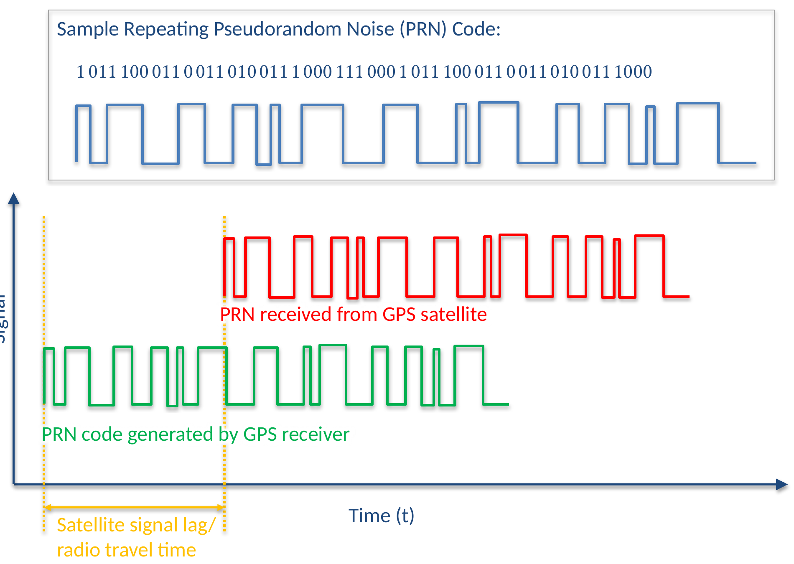

<!-- Two-minute recap. The one thing they need in hand for the next twenty minutes is D = R x T. -->

---

# Triangulation or trilateration?

- **Triangulation** measures **angles** from known points, and solves the triangle for the unknown position
  - This is what a total station does
- **Trilateration** measures **distances** from known points, and intersects circles or spheres
  - This is what GPS does
- The old lecture slides say "triangulation"; the honest word for GPS is **trilateration**

<!-- Worth thirty seconds because the vocabulary shows up on the quiz and in the reading. GPS never measures an angle to anything. -->

---

# One measurement: somewhere on a sphere

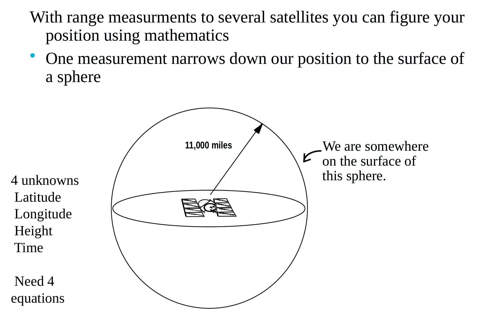

<!-- Four unknowns: latitude, longitude, height, and time. Four unknowns need four equations, which is why four satellites are the practical minimum. Start the build here and let it run through the next three slides. -->

---

# Two measurements: somewhere on a circle

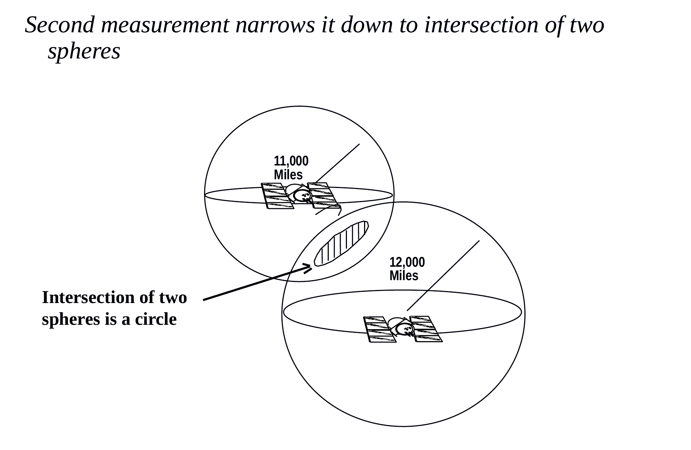

<!-- The intersection of two spheres is a circle. Still an infinite number of candidate positions, but a much smaller infinity. -->

---

# Three measurements: two points

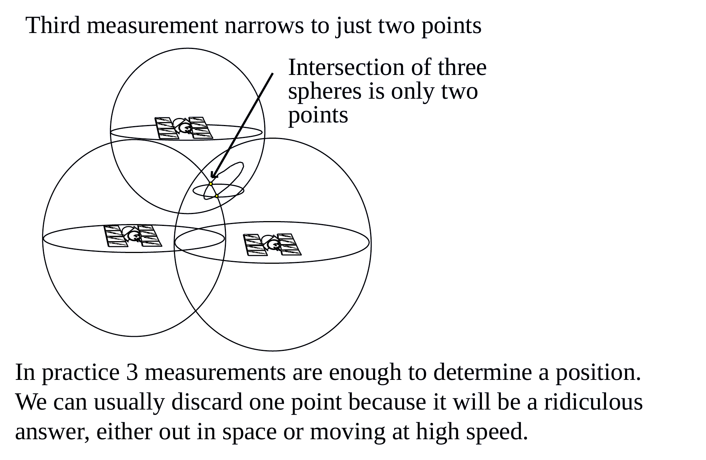

<!-- Three spheres intersect in exactly two points, and one of them is almost always absurd: out in space, or moving at an impossible speed. In practice three ranges are enough to fix a position. -->

---

# Four measurements: and the clock

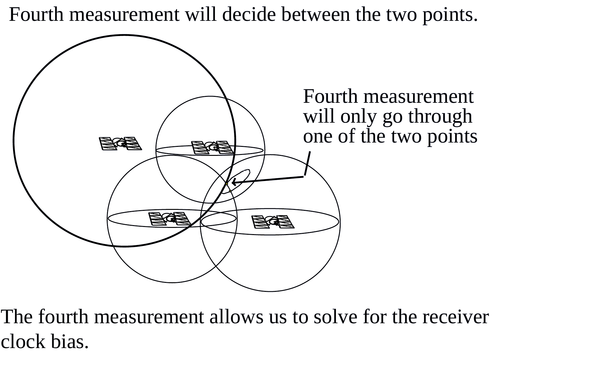

<!-- The fourth range is not really about geometry, it is about the clock. Your receiver has a cheap quartz clock, not an atomic one, so its clock bias is a fourth unknown. The fourth satellite is what lets the receiver solve for it. -->

---

# All four steps at once

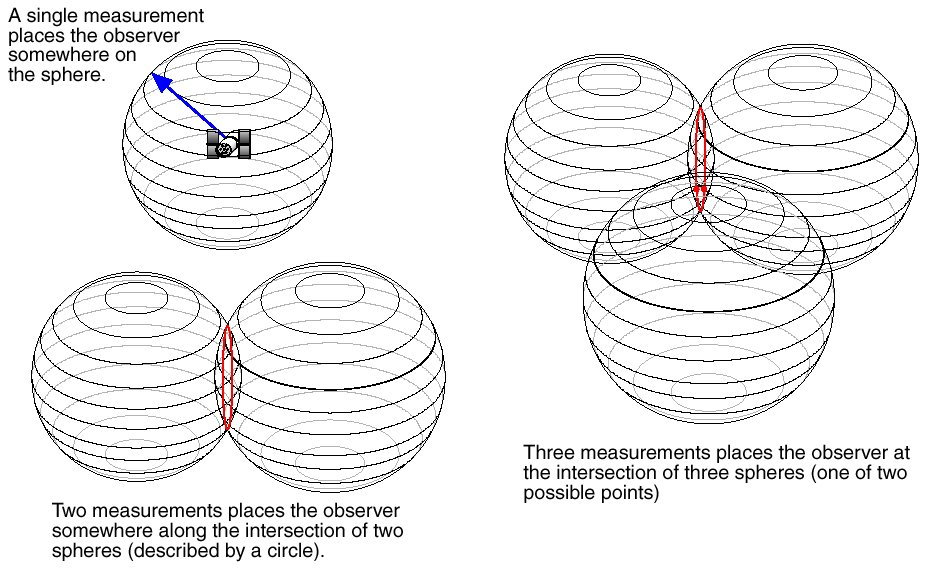

<!-- Leave this up while students work. A single measurement places the observer somewhere on the sphere; two place them on a circle; three place them at one of two points; knowing you are also on the surface of the Earth, a fourth sphere, kills one of them. Additional measurements remove clock error and atmospheric error. -->

---

<!-- _class: activity -->

# Warm-up: find Air Force One

A photo of Air Force One is hidden somewhere in this room. Three "satellites" have been marked. Your ranges:

- **169 inches** from Satellite 1
- **216 inches** from Satellite 2
- **151 inches** from Satellite 3

Find it. You have five minutes.

<!-- Instructor setup: tape the Air Force One picture somewhere in the room and mark three fixed reference points as satellites 1, 2 and 3, then measure the distances with a tape before class and put the real numbers on this slide. The numbers shown are from the 2021 running of this activity: Satellite 1 = the light on the zoom camera, Satellite 2 = the light above row 2 left, Satellite 3 = the BYU sticker on the front control panel. For Clyde 254 the recorded set was 221 inches from the projector lens on the ceiling, 260 inches from the screw on the bottom of the front left speaker, and 149 inches from the angled smoke detector. Hand out tape measures and let them swing arcs. The point is that they will physically do what three spheres do. -->

---

<!-- _class: activity -->

# Activity: "Where Am I?"

I visited Europe and got lost.

I heard three radio stations announcing the time, but each was off from the actual time. The difference is the **time the signal took to travel** from that station to me:

- **Amsterdam:** 2.37 × 10⁻³ seconds
- **Paris:** 2.95 × 10⁻³ seconds
- **London:** 3.45 × 10⁻³ seconds

**Where am I?**

**To turn in:**

1. Work it on paper — convert each delay to a distance, then draw the circles on a map of Europe
2. Write your **name** and your **solution** on the paper
3. **Photograph it** and upload the photo to **Learning Suite**

<!-- This is the graded activity. Give them a printed map of Europe with a scale bar, or let them use a web map. Twelve to fifteen minutes. Circulate and check that they converted seconds to kilometres before drawing anything. -->

---

# Step 1: delays become distances

**D = R × T**, R = 299,792 km/s

| Station | Delay (s) | Distance |
|---|---|---|
| Amsterdam | 0.00237 | **711 km** |
| Paris | 0.00295 | **884 km** |
| London | 0.00345 | **1,034 km** |

**Step 2:** draw a circle of that radius around each city.

**Step 3:** the three circles meet at one point. That point is the answer.

Note the scale: a millisecond of error here is **300 km**. GPS needs nanoseconds.

<!-- Check the arithmetic with them: 0.00237 s x 299,792 km/s = 710.5 km. The original speaker notes list 711, 885 and 1035 km, and label the first one "miles" by mistake; they are all kilometres. -->

---

# The answer: Prague

- Roughly **711 km** from Amsterdam, **884 km** from Paris, **1,034 km** from London
- Three distances from three known points, and the location falls out
- **You just did what a GPS receiver does**, with radio stations instead of satellites and milliseconds instead of nanoseconds

<!-- Reveal only after they have committed to an answer. Ask what a fourth station would have added: a check on their own clock. Ask what would happen if all three stations were in a line. -->

---

<!-- _class: lead -->

# How wrong is your position?

## Putting a number on GPS error

---

# The error budget, again

| Source | Typical error |
|---|---|
| Satellite clocks | 1.5 – 3.6 m |
| Orbital errors | < 1 m |
| Ionosphere | 5.0 – 7.0 m |
| Troposphere | 0.5 – 0.7 m |
| Receiver noise | 0.3 – 1.5 m |
| Multipath | 0.6 – 1.2 m |

- These are **independent** error sources
- Independent errors do **not** simply add — they combine as a **root sum of squares**
- The result is then **multiplied by PDOP**

$$\sigma = \sqrt{\textstyle\sum \sigma_i^2} \times \mathrm{PDOP}$$

<!-- Ask why they do not just add: because it would be extraordinarily unlucky for every source to be at its maximum, in the same direction, at the same instant. The root sum of squares is the standard way to combine independent uncertainties, and they have seen it in statics and in measurements courses. -->

---

# Worked example: expected horizontal error

Take the middle of each range:

| Source | σ (m) | σ² |
|---|---|---|
| Satellite clocks | 2.5 | 6.25 |
| Orbital | 0.8 | 0.64 |
| Ionosphere | 6.0 | 36.00 |
| Troposphere | 0.6 | 0.36 |
| Receiver noise | 0.9 | 0.81 |
| Multipath | 0.9 | 0.81 |
| **Sum** | | **44.87** |

- Root sum of squares: √44.87 = **6.7 m**
- With **PDOP = 2.5**: 6.7 × 2.5 = **16.7 m**
- With **PDOP = 6**: 6.7 × 6 = **40 m**

**Same receiver, same sky, same instant — the geometry alone nearly triples the error.**

Now redo it on your own paper with the *low* end of every range, and with PDOP = 1.5.

<!-- Give them three minutes to redo it with the low values: sqrt(1.5^2 + 0.5^2 + 5^2 + 0.5^2 + 0.3^2 + 0.6^2) is about 5.3 m, times 1.5 is about 8 m. That spread, 8 m to 40 m, is the honest answer to "how accurate is GPS?" -->

---

# Where PDOP comes from

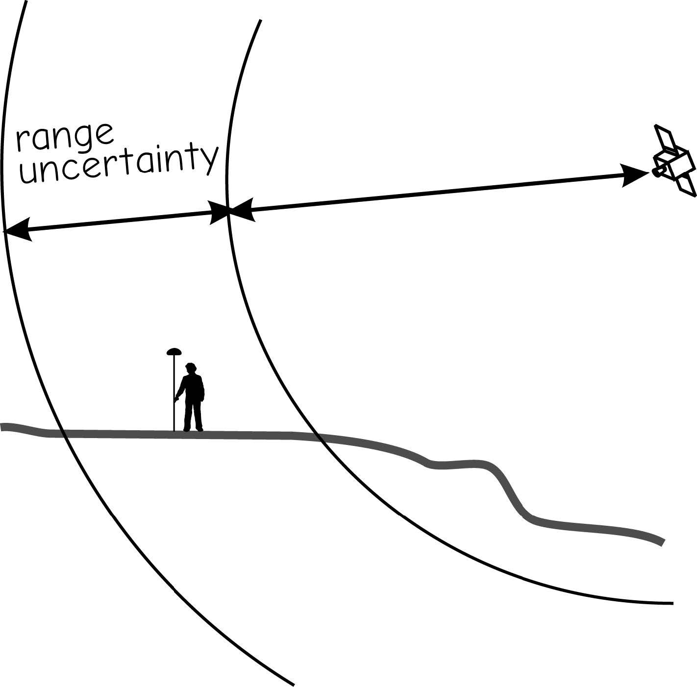

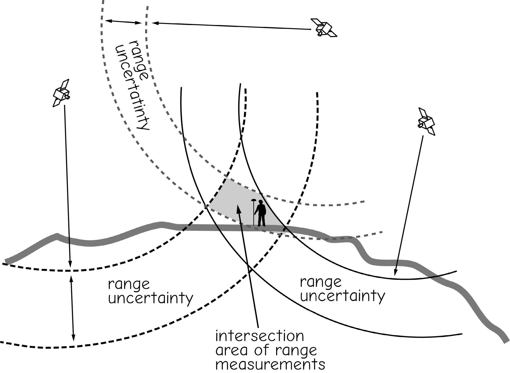

Each range is a **band**, not a line. Where the bands cross is your **area of uncertainty**.

<!-- Left: a single range is really a fuzzy band, because the measured time is uncertain. Right: two or more fuzzy bands intersect in a patch, not a point. The shape of that patch is set entirely by the angles between the satellites. -->

---

# Good geometry versus bad

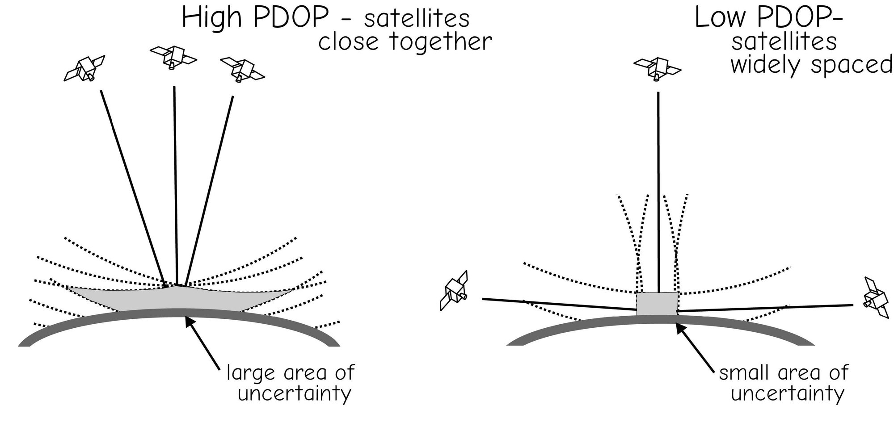

**High PDOP:** satellites bunched together, large area of uncertainty. **Low PDOP:** satellites widely spaced, small area.

<!-- Same range uncertainty in both pictures. The only difference is where the satellites are. This is why your fix improves if you wait ten minutes, and why it is bad in a canyon: you only see the strip of sky overhead. -->

---

<!-- _class: quiz -->

# Which fix would you trust?

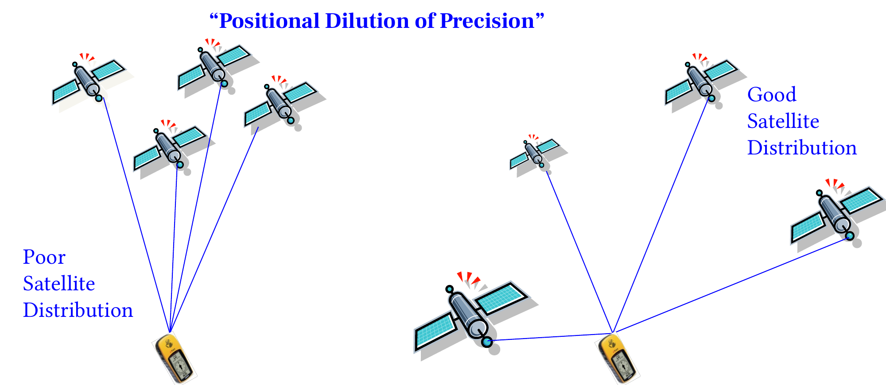

Two readings of the same point, one minute apart:

<ol type="A">
<li>7 satellites, PDOP 5.8</li>
<li>5 satellites, PDOP 1.9</li>
<li>They are equally good — more satellites always wins</li>
<li>Not enough information</li>
</ol>

<!-- Answer B. Satellite count matters only up to a point; geometry is what multiplies your error. Five well-spread satellites beat seven clustered ones. This is why field receivers report PDOP and why survey planning software predicts it hours ahead. -->

---

<!-- _class: lead -->

# Demo: from latitude/longitude to metres

---

# Degrees are angles, not distances

- Latitude and longitude are **angles** measured on an ellipsoid
- A degree of **latitude** is nearly constant: about **111 km**
- A degree of **longitude** shrinks toward the poles:

$$\Delta x \approx 111{,}320 \times \cos(\varphi)$$

- At Provo, φ ≈ 40.25°, so 1° of longitude ≈ **84,960 m**
- At the pole it is **zero**

<!-- Do the cosine live. Then ask the trap question: "what is the distance between 40.2500, -111.6500 and 40.2600, -111.6600?" If anyone answers using degrees, that is the lesson. -->

---

# Demo, step by step

1. Start with a point from Tuesday's activity, in decimal degrees, **full precision**
2. Paste it into <a href="https://tagis.dep.wv.gov/convert/" target="_blank">tagis.dep.wv.gov/convert</a> and read off the **UTM** easting and northing
3. Utah is **UTM Zone 12N**, **EPSG:32612**
4. Now do the same thing in QGIS: **Layer → Add Layer → Add Delimited Text Layer**, set the CRS of the incoming data to **EPSG:4326**
5. Right-click the layer → **Export → Save Features As…**, target CRS **EPSG:32612**
6. Open the attribute table, add geometry columns, and compare with step 2

- **EPSG:4326** = WGS 84 lat/long, the degrees your phone gives you
- **EPSG:32612** = UTM Zone 12N, metres
- Two different answers for the same place — same point, different units

<!-- Run this live and let them follow along. If the network is down, the tagis site is the only online piece; the QGIS half works offline. This is the same workflow they need for Lab 3. -->

---

# Now measure something

- With the project CRS set to **EPSG:32612**, use the **measure tool** between two of your points — the answer is in **metres**
- Switch the project CRS back to **EPSG:4326** and measure again
- QGIS will happily hand you a number in **degrees**. It is meaningless as a length
- **Rule of thumb:** degrees for storing and sharing, projected metres for measuring

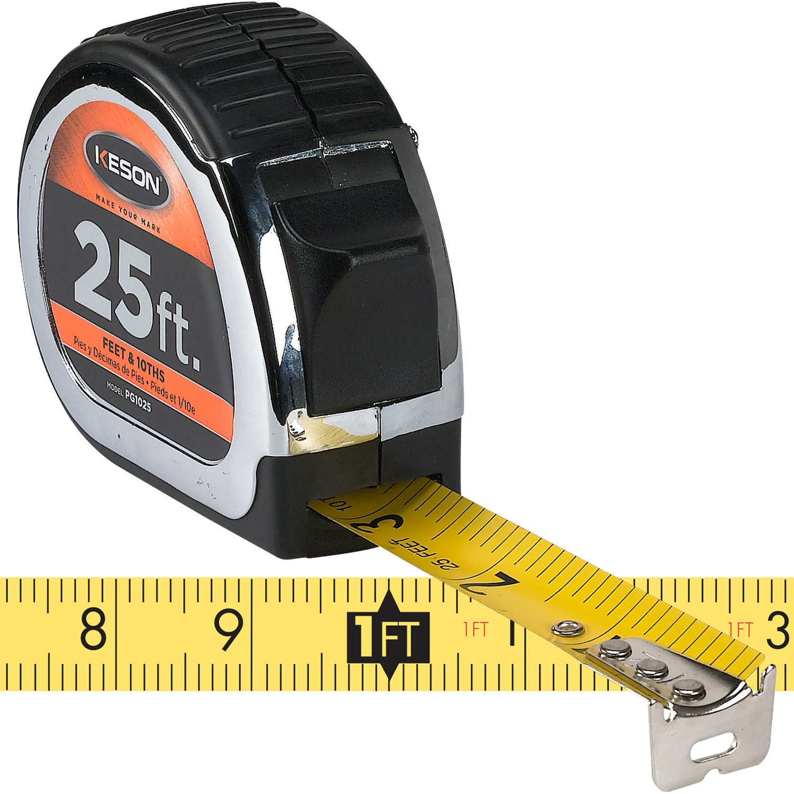

<!-- QGIS does apply an ellipsoidal correction when the project ellipsoid is set, so the measure tool may still give a sensible metre value in a geographic CRS. Show both, and make the point that the field calculator and most geoprocessing tools will not do that for you. -->

---

# Check your work

- Does the point land **where you stood**? Load a basemap and look
- Is the longitude **negative**? Utah is west of Greenwich
- Did you keep **all the decimal places**?
- Does the distance between two of your points match what you paced off?
- If the answer is off by a factor of about **1.3**, you probably mixed up a degree of latitude with a degree of longitude

<!-- 111,320 / 84,960 = 1.31, which is the signature of that particular mistake at this latitude. Worth naming so they recognise it in the lab. -->

---

# Errors are cumulative — including yours

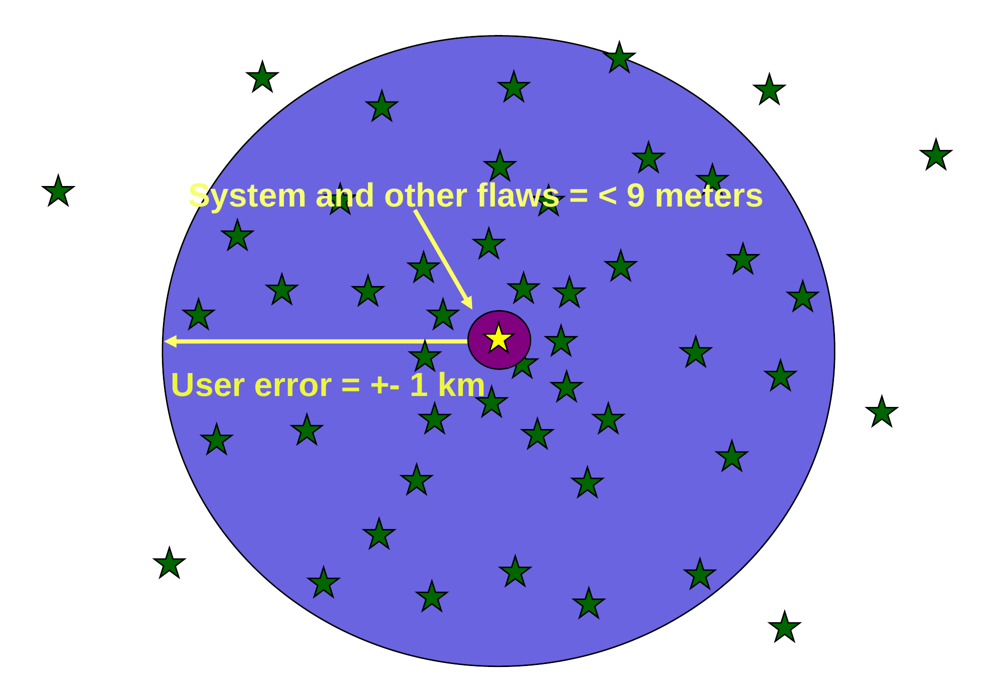

<!-- Close the loop on the instrument-versus-user point from Tuesday. System and other flaws are under about 9 metres; user error can be plus or minus a kilometre. Everything in today's checklist is about the second number. -->

---

# Before Next Class

- Upload your **"Where Am I"** paper solution — name and answer, photographed — to Learning Suite
- Read **Chapter 5, GNSS and Coordinate Surveying**, in *GIS Fundamentals* (Bolstad & Manson) if you have not already
- **Quiz 3 (GPS Part 1)**, open book on Learning Suite — **due Saturday**
- **Lab 3: GPS Data Collection and Importing Into QGIS** — [assignments page](https://byu-hydroinformatics.github.io/cce114-geomatics/assignments/lab-03/) — **due Saturday**
- Questions? Office hours: [calendly.com/dan-ames/office-hours](https://calendly.com/dan-ames/office-hours)

<!-- Confirm the Saturday due dates against Learning Suite before class. Remind them that Lab 3 uses the points they collected on Tuesday, so anyone who missed the activity needs to go collect three points. -->

<!-- Conversion notes (2026-09-02): sources were "GPS and Triangulation.pptx" (2025) slides 1-5, 13-15, 22, 24-26 and, for the four-step position-fixing build, "GPS basics.pptx" (2024) slides 33-36, a legacy Trimble real-time-surveying deck whose pale blue slide background was whitened when the figures were extracted. Hidden source slide 5 (the classroom distances for the Air Force One activity) was kept deliberately as an instructor backup: the three distances are on the activity slide and the 2021 satellite locations plus the Clyde 254 alternative are in its speaker notes — the instructor should re-measure for the actual room. Hidden slide 13 ("d1 d2 d3") was dropped as a bare shape overlay with no context. No ArcGIS screenshots appear in either source deck, so no QGIS re-shoots are needed; the QGIS workflow on the "Demo, step by step" and "Now measure something" slides was written for this deck. New material not in the sources, written to cover the assigned topics: the triangulation-versus-trilateration slide, the root-sum-of-squares error computation and its worked example, the PDOP quiz, and the whole latitude/longitude-to-metres demo section. The Prague distances are computed from the source delays and match the numbers in the original speaker notes; the original note labels the Amsterdam distance "miles", which is a typo for kilometres. -->
