<!-- _class: lead -->
<!-- _paginate: skip -->

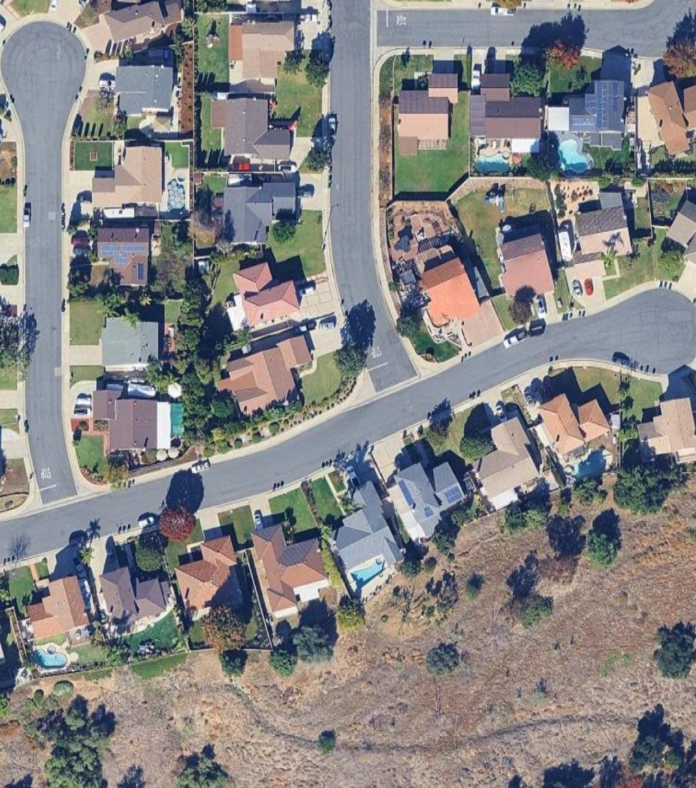

# Working with Vector Data

## Part 1: Creating, Digitizing, and Editing

CCE 114 Geomatics
Dr. Dan Ames and Dr. James Halgren

<!-- Tuesday concept lecture. Up to now students have only *added* data that somebody else made. Today they learn where vector data comes from and how it gets onto a disk. Thursday in the Thursday hands-on session they do it themselves in QGIS, digitizing their own home. -->

---

# Today's Goals

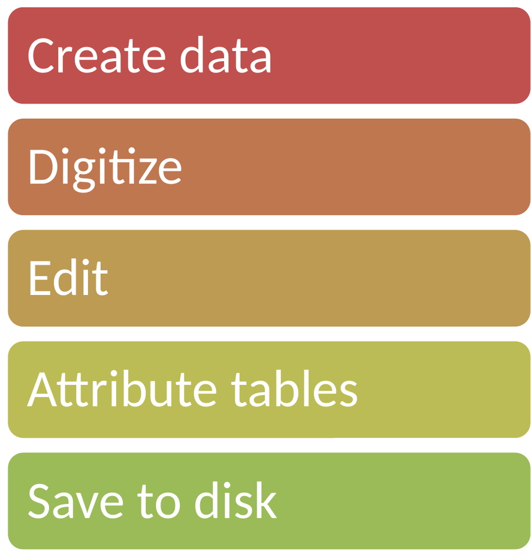

- By the end of class you should be able to:
  - **Create** a new empty vector layer, and make the three decisions it needs
  - **Digitize** points, lines, and polygons from imagery
  - **Edit** features that are already wrong, with the Vertex Tool
  - Design an **attribute table** and its schema
  - **Save to disk**, and say when to use a **GeoPackage** and when a **shapefile**
- Thursday, in the hands-on session, you do all five of these in QGIS

<!-- These five words are the shape of the whole hour: create, digitize, edit, attributes, save. Reading is Chapter 4, Maps, Data Entry, and Editing, in Bolstad & Manson. -->

---

# Where does vector data come from?

- So far in this course you have **added** data somebody else made: Utah County roads, SGID streams, a DEM
- Somebody had to make those. Sources:
  - **Digitizing** from imagery or scanned maps
  - **Field survey**: total station, GNSS, level loop
  - **Conversion** from CAD drawings or GPS tracks
  - **Derived** from other layers by analysis

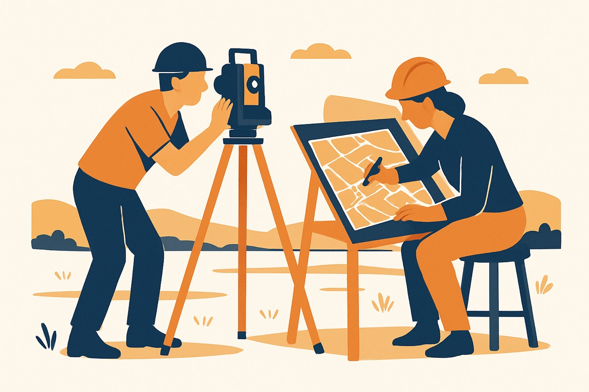

- Today is the first one: you are the somebody
- The engineering question is always the same: *how good does this have to be, and how will anyone know?*

<!-- Ask the class where the Utah County roads layer came from. Somebody digitized it, from aerial photography, at some scale, some years ago, with some accuracy. Every dataset has that history, and most of the time it is not written down. That is why metadata matters. -->

---

# Reminder: three geometry types

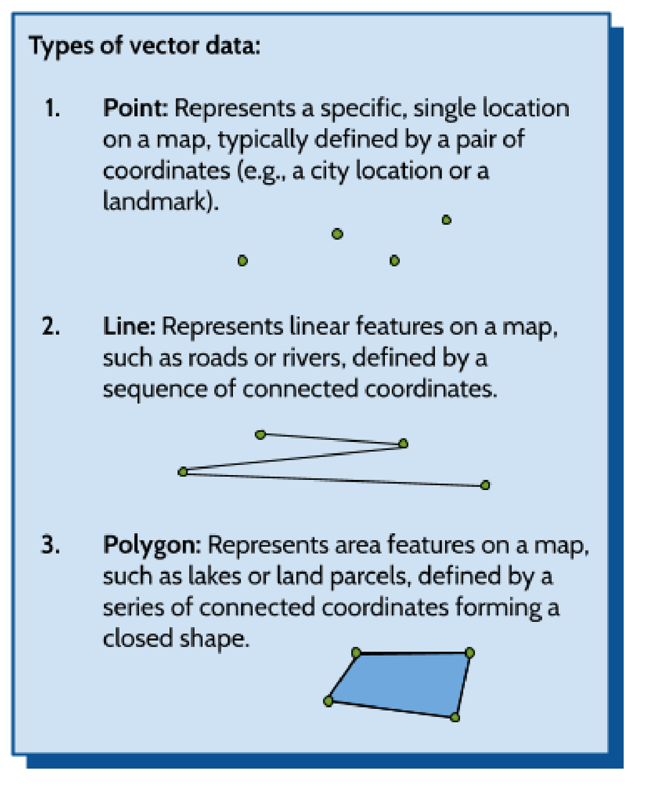

- **Point**: one coordinate pair. A street light, a well, a culvert
- **Line**: an ordered list of coordinate pairs. A curb, a canal, a road centerline
- **Polygon**: an ordered list that closes back on itself. A building footprint, a parcel, a lake
- One layer holds **one** geometry type. You cannot mix points and polygons in the same layer
- Pick the type from the **question you are answering**, not from the shape of the object

<!-- A building is a polygon on a site plan and a point on a statewide map. The object did not change; the question did. This comes back in the quiz two slides from now. -->

---

<!-- _class: lead -->

# Part 1 — Creating a layer

## An empty container, made on purpose

---

# Three decisions before you draw anything

1. **Geometry type** — point, line, or polygon. You cannot change it later without rebuilding the layer
2. **Coordinate reference system** — normally match the project CRS. In our labs that is EPSG:26912, NAD83 / UTM zone 12N
3. **Schema** — the columns of the attribute table, and the type of each one

- All three are locked in when you click **OK**
- Adding a field later is easy; changing geometry type is not
- Ten seconds of thinking here saves a redraw of forty features

<!-- Emphasize decision 2. If the layer CRS and the project CRS disagree, everything still draws, because QGIS reprojects on the fly, but area and length calculations will surprise them later. Pro tip from Lab 4: always make sure your project CRS matches your map. -->

---

# Making the layer in QGIS

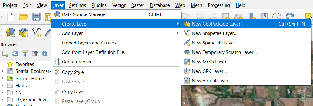

**Layer → Create Layer → New GeoPackage Layer…**

<!-- Show the menu. Note the sibling entries: New Shapefile Layer, New Temporary Scratch Layer. A scratch layer lives only in memory and disappears when the project closes, which is fine for a quick sketch and a disaster if you forget. We use GeoPackage. -->

---

# The New GeoPackage Layer dialog

- **File name** — click the **…** and save it into your own lab folder. This is the actual file on disk
- **Table name** — the layer name inside that file
- **Geometry type** — Point, LineString, Polygon
- **CRS** — leave it on *Project CRS*
- **New Field** — name, type, then **Add to Fields List**

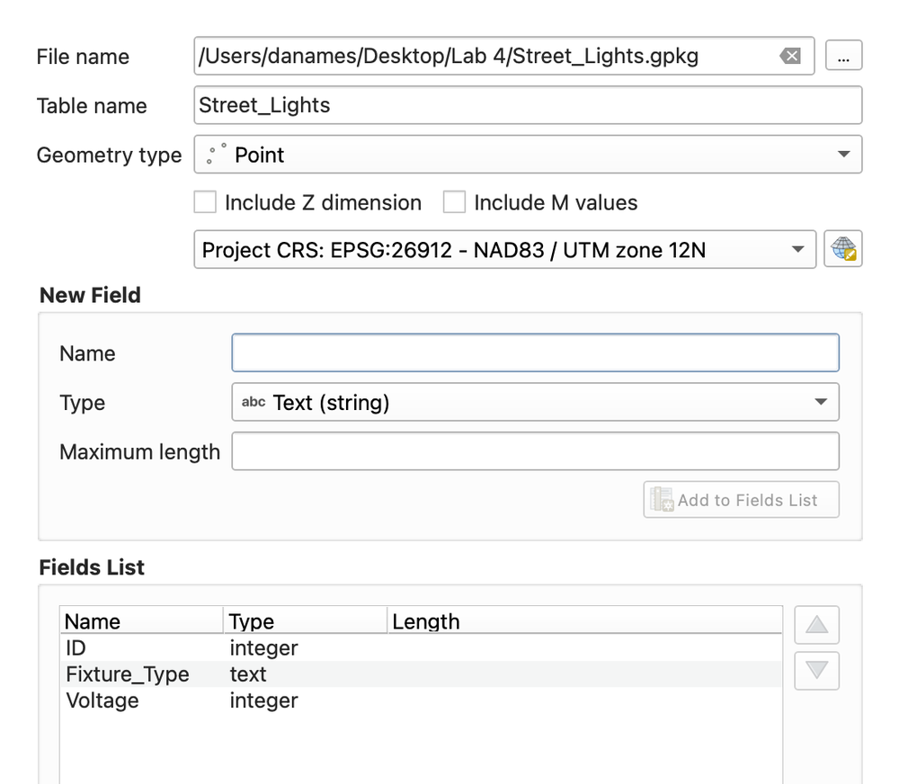

<!-- The single most common Lab 4 mistake: not clicking the three dots next to File name, so the layer never gets a home on disk and the work is lost. Second most common: typing a field name and clicking OK without clicking Add to Fields List first. -->

---

# Field types you will actually use

| Type | Use it for | Example |
| --- | --- | --- |
| **Text (string)** | names, categories, labels | `Fixture_Type` = "LED cobra head" |
| **Integer (32 bit)** | counts, ID numbers, whole units | `Voltage` = 240 |
| Decimal number | measurements, areas, rates | `Area_sqft` = 31842.7 |
| Date | when it was built or inspected | `Installed` = 2019-07-14 |

<!-- Two rules worth saying out loud. One: an ID is a label, not a quantity, so never average it. Two: if you might ever want to add, average, or sort numerically, do not store the value as text. "240 V" as text cannot be summed. -->

---

<!-- _class: quiz -->

# You are mapping a campus

Which geometry type for each, and why?

<ol type="A">
<li>Emergency call boxes</li>
<li>Sidewalks</li>
<li>Building footprints</li>
<li>The campus boundary</li>
<li>Fire hydrants and the water mains between them</li>
</ol>

<!-- A: point. B: line. C: polygon. D: polygon, one feature. E: two layers, points and lines, because a layer holds one geometry type. Push on E: students often want one "utilities" layer. Ask what the attribute table would look like if hydrants and mains shared it. Half the columns would be empty for every row. -->

---

<!-- _class: lead -->

# Part 2 — Digitizing

## Turning what you can see into coordinates

---

# What digitizing means

- **Digitizing** = tracing real-world features into coordinates the computer can store
- Historically: a paper map taped to a **digitizing tablet**, a puck with crosshairs, one click per vertex
- Today: **heads-up digitizing** — imagery on screen, you draw over the top of it
- Same idea, same errors, better coffee

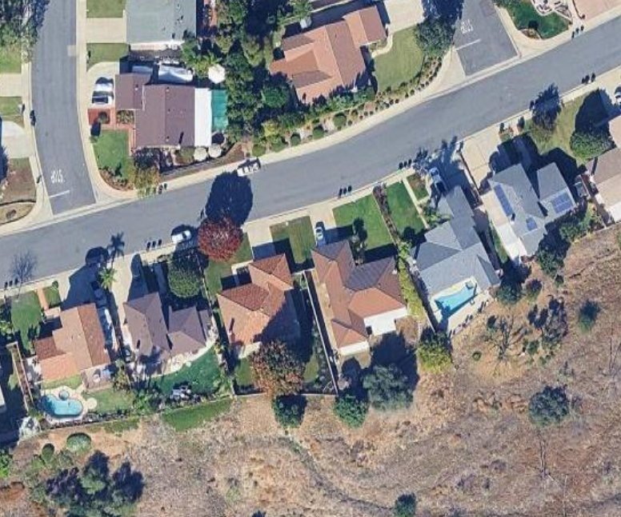

<!-- The name "heads-up" comes from the contrast with tablet digitizing, where your head was down over the table. The skill did not change: you are still deciding, feature by feature, where the line goes. -->

---

# Digitize at the scale you intend to use

- The imagery has a resolution; your eyes and mouse have a resolution too
- Zoom in far enough that one screen pixel is smaller than the accuracy you need
- Zoom in too far and you will spend all hour on one curb
- **Source scale limits the product.** A line traced from a 1:100,000 map does not become accurate by loading it into a project drawn at 1:1,000

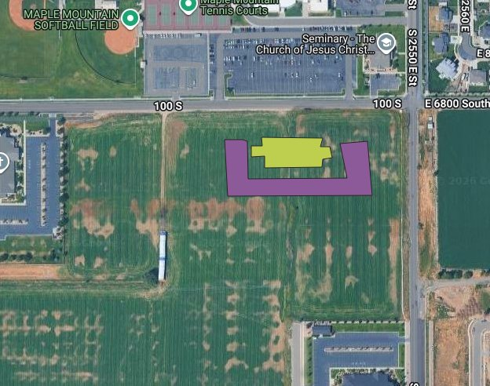

<!-- This is exactly the problem Lab 4 asks them to fix. The SGID canal lines were digitized years ago from smaller-scale USGS quads, so in high-resolution imagery they drift well off the real channel. The data are not "wrong"; they are being used at a scale they were never made for. -->

---

# The digitizing loop in QGIS

1. Select the layer in the **Layers** panel
2. **Toggle Editing** — the yellow pencil 
3. Pick **Add Point / Line / Polygon Feature**
4. Click each vertex; **right-click to finish** a line or polygon
5. Fill in the attribute form, click **OK**
6. **Save Layer Edits**, then toggle editing off

- Nothing is on disk until step 6
- The pencil is the switch for the whole layer: if a tool is greyed out, you almost certainly forgot step 2
- Digitizing and Advanced Digitizing toolbars: right-click the toolbar area to turn them on

<!-- Walk the loop out loud once. "The layer is not editable" is the error they will hit most, and it always means the pencil is off or the wrong layer is selected. -->

---

# Three ways to draw a line

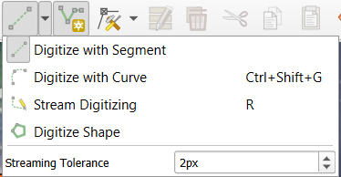

- **Digitize with Segment** — straight segments, one click per vertex. The default
- **Digitize with Curve** — true circular arcs, for cul-de-sacs and curved curbs
- **Stream Digitizing** — vertices dropped automatically as you drag, at a set tolerance
- Stream mode is fast and produces enormous files. Use it sparingly

<!-- Curves are worth showing: a cul-de-sac drawn as an arc is one geometry, drawn with segments it is twenty vertices that still look faceted. Note that not every format stores true curves; GeoPackage does, shapefile does not. -->

---

<!-- _class: quiz -->

# How many vertices does this road need?

<ol type="A">
<li>As few as possible</li>
<li>As many as possible</li>
<li>Enough that the line matches the imagery at the scale you will use it</li>
<li>One every 10 meters, evenly spaced</li>
</ol>

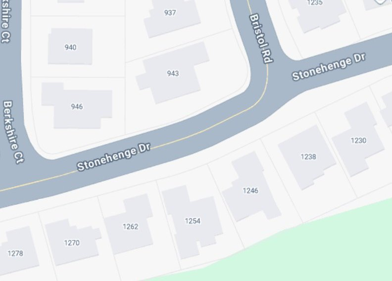

<!-- C. More vertices is not more accurate; it is only more data. A straight road needs two. A cul-de-sac needs many, or one arc. Ask what happens to file size, drawing speed, and every analysis downstream when someone streams a whole county at 2 px tolerance. -->

---

# Snapping: making features actually meet

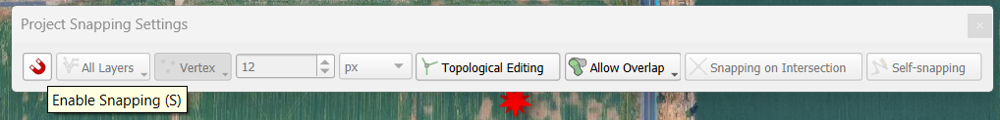

- Two lines that *look* joined but are 30 cm apart are **not** joined, and no analysis will treat them as joined
- **Snapping** forces new vertices onto existing ones within a **tolerance** (Lab 4 uses 12 pixels)
- **Project → Snapping Options…**, or the snapping toolbar. Turn it on before you draw, not after

<!-- Tolerance in pixels follows the zoom: the same 12 px is a big distance when zoomed out and a small one when zoomed in. Map units do not change with zoom. Neither is right; you just have to know which one you set. -->

---

# Topology: when "close enough" is wrong

- **Topology** is how features relate: connected, adjacent, contained
- Undershoots and overshoots at a junction break network analysis: water does not flow across a 30 cm gap
- Two parcels that overlap by a sliver mean the total area is wrong
- A culvert point that is *near* the stream instead of *on* it will not join to it

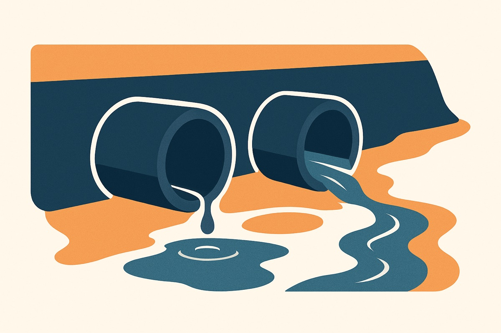

- QGIS tools that keep you honest:
  - **Enable Snapping** before you draw
  - **Topological Editing** — move a shared vertex once, both features follow
  - **Avoid Overlap** — new polygons get clipped to their neighbors

<!-- Snapping needs a sensible tolerance, as on the previous slide. Concrete stakes: an unsnapped culvert is invisible to a hydrologic model, so the model routes water over the road instead of under it, and the design storm comes out wrong. This is why Lab 4 makes them snap every culvert onto the waterway line. -->

---

<!-- _class: lead -->

# Part 3 — Editing

## Most GIS work is fixing data, not making it

---

# The Vertex Tool

- Click a vertex to grab it, click again to drop it where it belongs
- **Double-click a segment** to add a vertex
- Select a vertex and press **Delete** to remove one
- **Right-click to lock** onto a feature first, so you do not grab the neighbor by accident

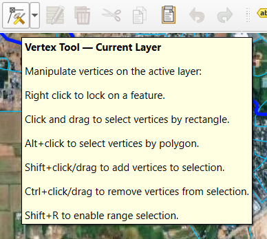

<!-- Live-demo worthy if the projector cooperates. The lock-on-feature trick saves a lot of grief in dense data. Everything here is still inside Toggle Editing, and still not saved until Save Layer Edits. -->

---

# Fixing data that arrives wrong

- Realistic workflow, and the one in Lab 4:
  1. Load authoritative data (UGRC SGID)
  2. Compare it against better imagery
  3. Screenshot the **before**
  4. Move vertices onto what you can actually see
  5. Screenshot the **after**, and save
- The before/after pair is the evidence that you changed something on purpose

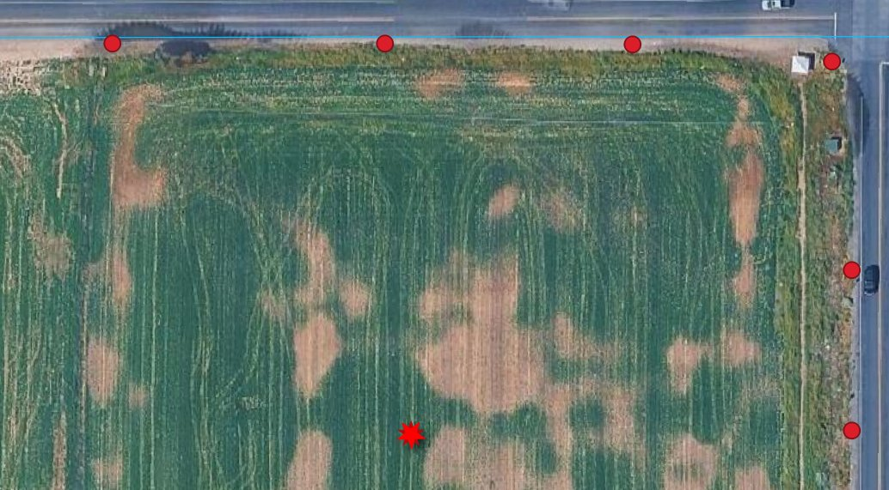

<!-- Professional habit worth naming: never silently improve somebody's data. Record what you changed, why, and against what source. On a real project that record is the difference between a correction and a liability. -->

---

<!-- _class: lead -->

# Part 4 — Attribute tables and schemas

## The other half of every vector layer

---

# Geometry is only half the layer

- Every vector layer is **geometry + a table**: one row per feature, one column per fact
- The row and the shape are the same feature. Select the row, the shape highlights
- Geometry answers *where*. Attributes answer *what*, *how big*, *how old*, *whose*
- Almost every question you will be asked is an attribute question with a spatial filter

- "Which street lights on 100 South are over 20 years old?"
  - *street lights* → the layer
  - *on 100 South* → geometry
  - *over 20 years old* → attributes

<!-- Tie back to Day 2, where they opened the cellular towers attribute table and watched a row light up a tower. Same idea, except now they are the ones deciding what the columns are. -->

---

# Designing a schema

- A **schema** is the table structure: field names, types, and lengths
- Ask before you draw:
  - What will I **label** these features with?
  - What will I **symbolize** or **filter** by?
  - What will somebody else need in five years?
- Name fields for humans: `Fixture_Type`, not `FT2`

**Example schemas from Lab 4**

`Street_Lights` (Point)
ID (integer) · Fixture_Type (text) · Voltage (integer)

`Temple_Footprint` (Polygon)
Name (text) · area (decimal)

<!-- Third Lab 4 schema, for the line layer: Curb_Lines (LineString) with ID (integer), Material (text), Condition (text). The labeling question is the one from the original deck and it is a good one: if you do not create a Name field, you have nothing to label the map with, and you will be re-typing attributes for forty features the night before it is due. -->

---

# Filling and calculating attributes

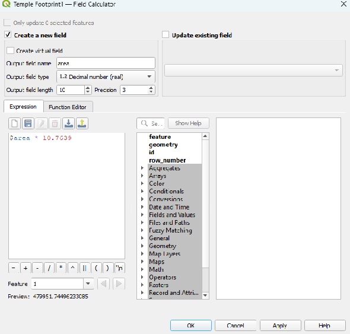

- Type values in the **attribute form** as you digitize each feature — far faster than going back later
- Or edit directly in the **attribute table**, in editing mode
- The **Field Calculator** computes a whole column at once from an expression
- Geometry is available to expressions: `$area`, `$length`, `$x`, `$y`
- Lab 4 area in square feet: `$area * 10.7639`

<!-- The Lab 4 expression is $area * 10.7639, because $area returns square meters in a projected CRS and the client wants square feet. Point out that $area is only meaningful because the layer is in UTM; in EPSG:4326 it would return square degrees, which is nonsense. -->

---

<!-- _class: quiz -->

# What is wrong with this schema?

A student builds a `Buildings` polygon layer with:

<ol type="A">
<li><code>name</code> — Text</li>
<li><code>height</code> — Text, e.g. "42 ft"</li>
<li><code>yr</code> — Text, e.g. "1994"</li>
<li><code>id</code> — Integer</li>
<li><code>notes</code> — Text, 10 characters</li>
</ol>

<!-- B and C should be numeric: as text you cannot sum, average, sort, or graduate symbology by them, and "42 ft" would have to be parsed. C is better still as a Date if the exact date is known. E is too short to be useful; a notes field needs room. D is fine, as long as nobody averages it. Ask what would break first if this layer went to a client. -->

---

<!-- _class: lead -->

# Part 5 — Saving to disk

## Where does the data actually live?

---

# Editing is in memory until you save

- Toggling editing on puts the layer's changes in an **edit buffer**, not on disk
- **Save Layer Edits** writes that buffer to the file
- Toggling editing off prompts you to save or discard
- **Saving the project is not saving the data.** The `.qgz` file stores where your layers are and how they are drawn — not the features themselves

- Two separate save habits: save **layer edits** often, and save the **project** often
- A temporary **scratch layer** never had a file at all, and vanishes when QGIS closes

<!-- This slide is worth a full minute. The single most common way students lose an hour of work is assuming Ctrl+S on the project saved their digitizing. It did not. -->

---

# GeoPackage vs. shapefile

**GeoPackage** — `.gpkg`

- One file, an open **SQLite** database
- Many layers in one file, plus styles
- Field names as long as you like
- Handles large data and true curves
- The QGIS default, and ours

**Shapefile** — `.shp` + friends

- Really 3 to 6 files that must travel together: `.shp`, `.shx`, `.dbf`, `.prj`, `.cpg`
- Field names limited to **10 characters**
- One geometry type per file, historic 2 GB limit

<!-- Shapefile is still everywhere, because it is 30 years old. The classic shapefile disaster: emailing somebody "the shapefile" meaning only the .shp, or losing the .prj and with it any record of the CRS. A GeoPackage is one file, so it cannot be half-sent. -->

---

# The New Shapefile Layer dialog

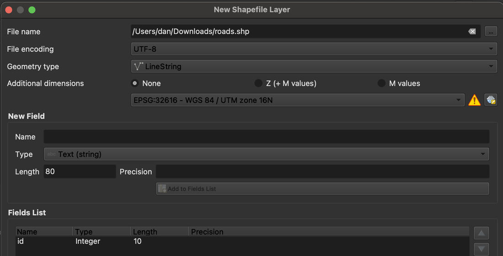

- Same three decisions, plus **File encoding** and **Length** / **Precision** on every field — leftovers from the dBase table underneath
- Need one for a client? Right-click a layer → **Export → Save Features As…**

<!-- Worth saying plainly: shapefile is not wrong, it is old, and its age shows in every row of this dialog. Students will absolutely be handed shapefiles in industry, so they should be comfortable in both. -->

---

# Five ways to lose an afternoon

- Digitizing into a **temporary scratch layer**, then closing QGIS
- Never clicking the **…** next to File name, so the layer has no home on disk
- Typing a field name and clicking **OK** without **Add to Fields List**
- Saving the **project** and assuming the **layer edits** were saved too
- Drawing forty features with **snapping off**, then discovering nothing connects

<!-- Read these out. Every one of them is a real thing that has happened in this class, and four of the five will happen Thursday if nobody says them first. -->

---

<!-- _class: activity -->

# Thursday: hands-on in QGIS

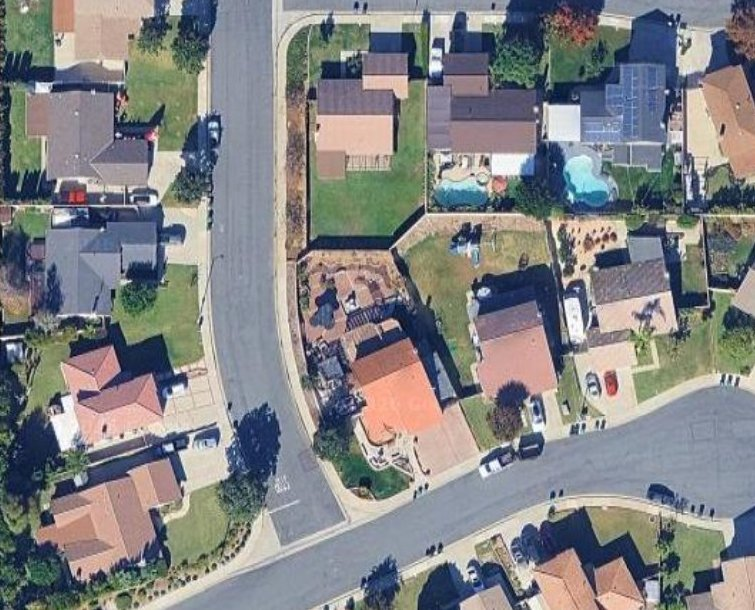

- **In-class activity: Creating and Editing Vector Data**
- Bring your laptop with **QGIS 3.44** installed
- Load a satellite basemap and zoom to **your own home**
- Create point, line, and polygon layers and digitize your house and your street
- Practise **snapping** and topology so your lines actually meet
- Turn in a **screenshot or PDF** of your digitized home

<!-- This is the activity from the original version of this lecture, now where it belongs: Thursday, hands-on. Tell them to think tonight about which home they will map and what attributes they would want. -->

---

# Before Next Class

- Read **Chapter 4, *Maps, Data Entry, and Editing***, in *GIS Fundamentals* (Bolstad & Manson)
- **Quiz 4 (GPS Part 2)** — open book, on Learning Suite, due **Saturday**
- **Lab 4: Changing, Editing, and Fixing GIS Data** — due **Saturday**
  [byu-hydroinformatics.github.io/cce114-geomatics/assignments/lab-04/](https://byu-hydroinformatics.github.io/cce114-geomatics/assignments/lab-04/)
- Bring your laptop with QGIS installed on Thursday
- Questions? Office hours: [calendly.com/dan-ames/office-hours](https://calendly.com/dan-ames/office-hours)

<!-- Lab 4 is the graded version of everything in today's lecture: creating GeoPackage layers, digitizing, snapping, the Vertex Tool, and a schema. Confirm the exact Saturday deadline on Learning Suite before class. -->

<!-- Conversion notes (2026-09-02): source deck "114 - Working with Vector Data.pptx" (Archived, 2026), 8 slides. The source was written as a Thursday hands-on walkthrough ("Make a Map of Your Childhood Home", steps 1-4 with New Shapefile Layer); that walkthrough has been moved to the Thursday preview slide, since Day 8 is the Tuesday concepts lecture, and the concept material (creating layers, digitizing, editing, schemas, saving to disk) has been expanded to fill the hour around the source deck's own Learning Goals list. Source slides not carried over as slides: slide 1 title (replaced by the standard title slide; its speaker note was a stale ArcGIS ModelBuilder workshop abstract, unrelated to this lecture, and was dropped), slides 4-8 (the step-by-step childhood-home walkthrough, now the Thursday preview). No ArcGIS screenshots are used: the only screenshot in the source deck is the QGIS New Shapefile Layer dialog, which is kept on the shapefile slide. QGIS 3.44 screenshots (Create Layer menu, New GeoPackage Layer dialog, digitizing tools, snapping toolbar, Vertex Tool, Field Calculator, example result) were reused from docs/assignments/lab-04/images so the deck matches the wording students see in Lab 4. TODO for the instructor: (1) confirm the Saturday due dates for Quiz 4 and Lab 4 on Learning Suite; (2) the Field Calculator screenshot (images/vec-field-calculator.png) is low resolution in the source and has been cropped to the expression panel — worth re-shooting at full resolution; (3) consider re-shooting the New GeoPackage Layer dialog with a Day 8 example instead of the Lab 4 Street_Lights example if you would rather the lecture not preview the lab. -->
