<!-- _class: lead -->
<!-- _paginate: skip -->

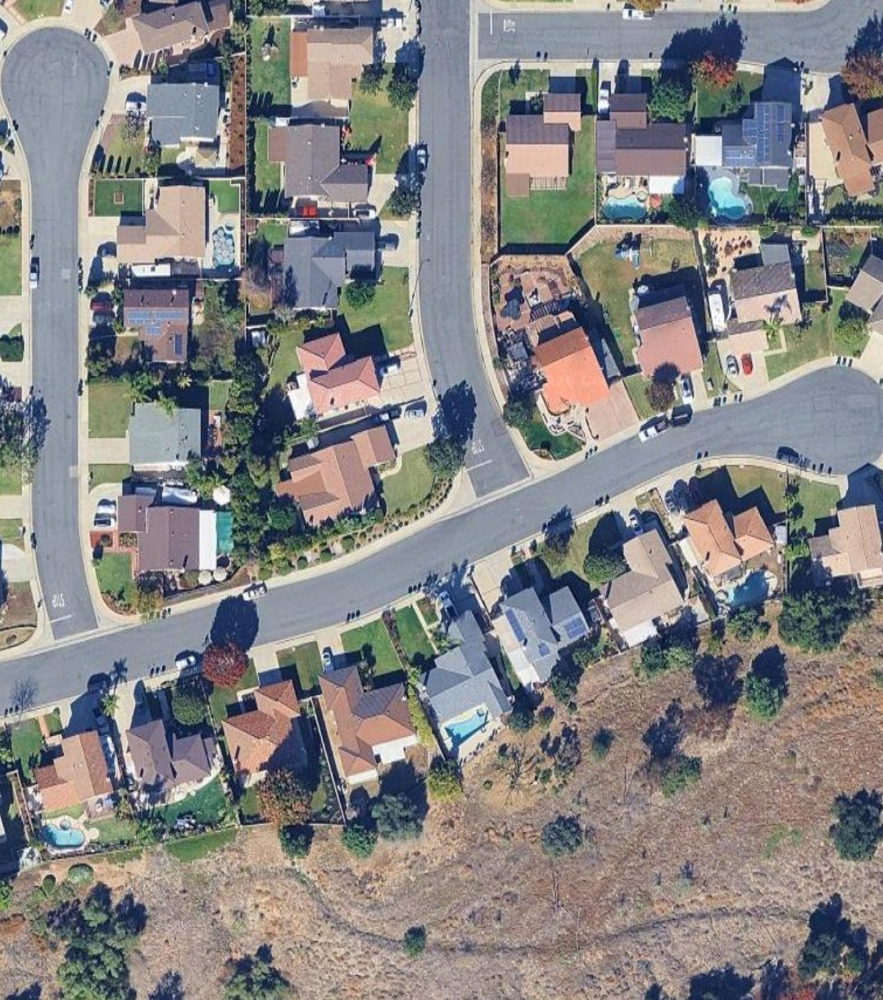

# Working with Vector Data

## Part 1: Creating, Digitizing, and Editing

CCE 114 Geomatics
Brigham Young University
Civil & Construction Engineering

Dr. Dan Ames and Dr. James Halgren

<!-- Tuesday concept lecture. Up to now students have only *added* data that somebody else made. Today they learn where vector data comes from and how it gets onto a disk. Thursday in the Thursday hands-on session they do it themselves in QGIS, digitizing their own home. -->

---

# This Week's Goals

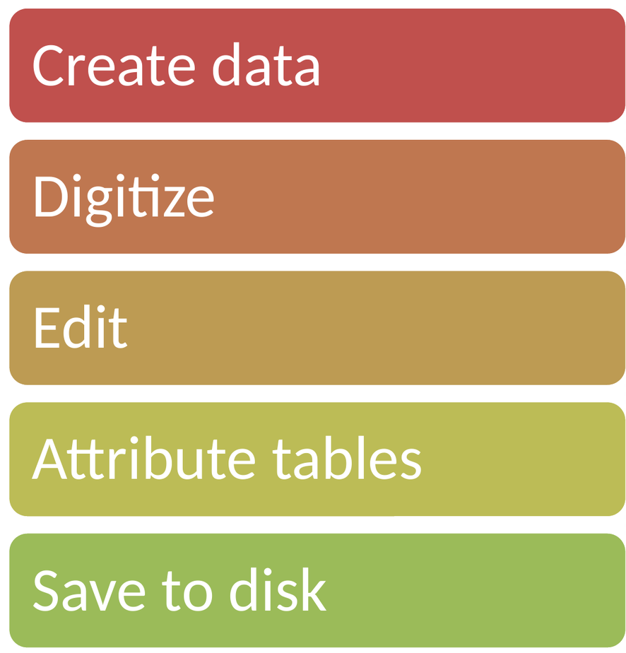

Today, Thursday, and Lab 4 all build toward these. By the end of the week you should be able to:

- **Understand** where vector data comes from, and why a layer holds only one **geometry type**
- **Create** a new empty vector layer, and make the three decisions it needs
- **Digitize** points, lines, and polygons from imagery
- **Edit** features that are already wrong, with the Vertex Tool
- Design an **attribute table** and its schema
- **Save to disk**, and say when to use a **GeoPackage** and when a **shapefile**

<!-- Today is the concepts: why each step exists and what goes wrong without it. Thursday, in the hands-on session, students do all of it in QGIS. Lab 4 is where they do it alone, on their own home. Reading is Chapter 4, Maps, Data Entry, and Editing, in Bolstad & Manson. -->

---

# Where does vector data come from?

- So far in this course you have added data somebody else made: Utah County roads, SGID streams, a DEM
- Somebody had to make those. Sources:
  - **Digitizing** from imagery or scanned maps
  - **Field survey**: total station, GNSS, level loop
  - **Conversion** from CAD drawings or GPS tracks
  - **Derived** from other layers by analysis

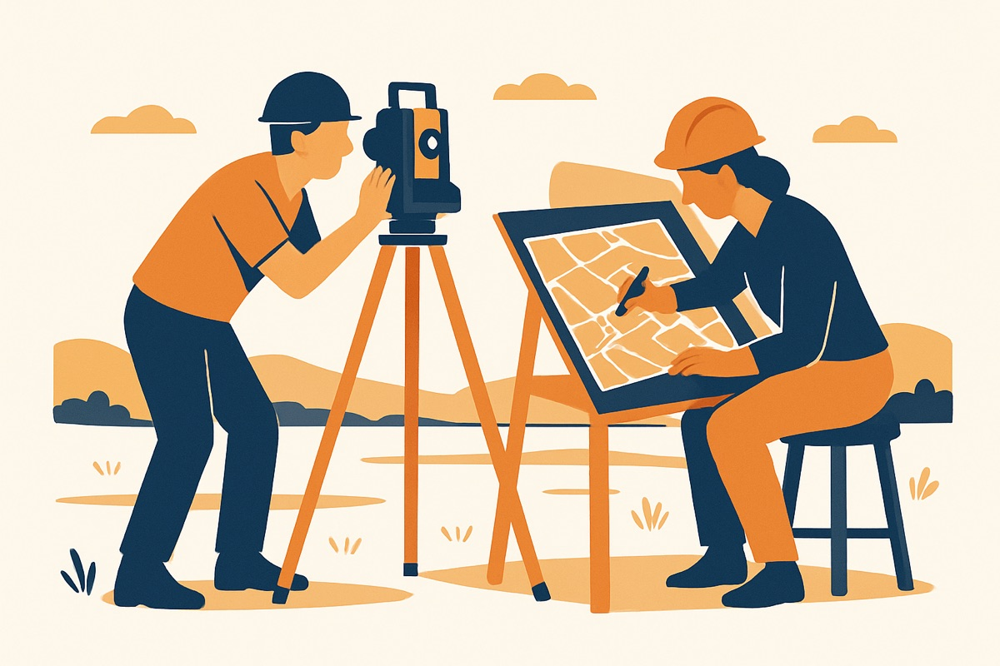

- Today is the first one: you are the somebody
- The engineering question is always the same: how good does this have to be, and how will anyone know?

<!-- Ask the class where the Utah County roads layer came from. Somebody digitized it, from aerial photography, at some scale, some years ago, with some accuracy. Every dataset has that history, and most of the time it is not written down. That is why metadata matters. -->

---

# Reminder: three geometry types

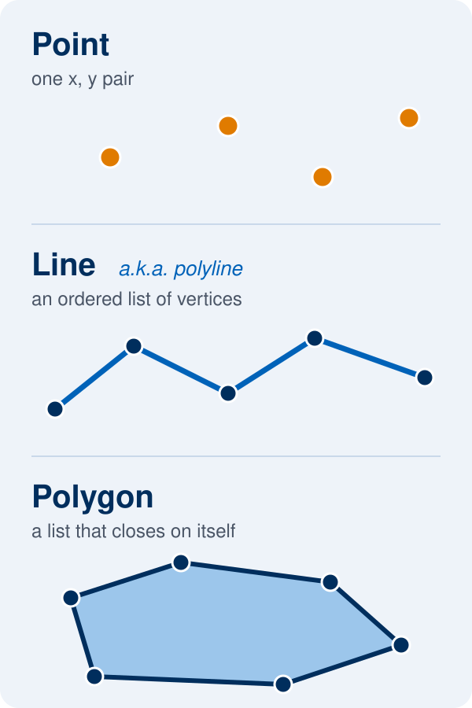

- **Point**: one coordinate pair. A well, a culvert, a street light
- **Line**: an ordered list of coordinate pairs. A curb, a canal, a centerline. You will hear **line** and **polyline** used interchangeably
- **Polygon**: a list that closes on itself. A parcel, a lake, a footprint
- One layer holds **one** type. Pick it from the **question**, not the object

* **Name a feature a point represents *perfectly*, at any scale**
* **Name a feature a line represents *perfectly*, at any scale**

<!-- "Polyline" is the same thing as a line in almost every GIS; ArcGIS and shapefile documentation say polyline, QGIS says LineString or Line. The two callouts reveal one at a time (arrow key). Let students answer before revealing the next. Good answers for a point: something with no size at all, like the center point of a parking lot, a survey monument, or Four Corners, where four states meet at one point. Good answers for a line: something with no width, like the Utah–Idaho state line or a property line. A well, a hydrant, or a road is NOT perfect: each has a real size, and the point or line is a scale decision. That is the limitation of each type: most real things have area, so a point or line is a simplification that only works at some scales. A building is a polygon on a site plan and a point on a statewide map. The object did not change; the question did. This comes back in the campus quiz at the end of Part 1. -->

---

<!-- _class: lead -->

# Part 1 — Creating a layer

## An empty container, made on purpose

---

# Three decisions before you draw anything

1. Geometry type — point, line, or polygon. You cannot change it later without rebuilding the layer
2. Coordinate reference system — normally match the **project CRS**. In our labs that is **EPSG:26912**, NAD83 / UTM zone 12N
3. Schema — the **columns** of the attribute table, and the **type** of each one

- All three are locked in when you click **OK**
- Adding a field later is **easy**; changing geometry type is **not**

Ten seconds of thinking here saves a redraw of forty features

<!-- Emphasize decision 2. If the layer CRS and the project CRS disagree, everything still draws, because QGIS reprojects on the fly, but area and length calculations will surprise them later. Pro tip from Lab 4: always make sure your project CRS matches your map. -->

---

<!-- _class: activity -->

# In-Class Activity: Create or download?

**Why would you need to *create* data instead of just downloading it?** Turn to your neighbor and discuss.

Then, together, write down **three datasets you probably can't download** and would have to create yourself, **one of each type**:

- a **point** layer, a **line** layer, a **polygon** layer
- for each: the **projection** you would use, if you know it
- for each: the **attribute fields** it would need

6 minutes, with a partner

<!-- Six minutes in pairs, then a few minutes of whole-class discussion: take one dataset of each type from different pairs and put it on the board. Push on the why: nobody has digitized the thing you care about, at the accuracy you need, with the attributes you need, recently enough. Push on projection: in Utah the default answer is NAD83 / UTM zone 12N (EPSG:26912), and for a small site a state plane zone also works; "I don't know" is a fine answer today and is Week 8's topic. Push on attributes: the fields decide what questions the data can answer later. Not on the slide: each pair photographs their written results and uploads the photo to Learning Suite as this class's in-class activity item. -->

---

# Making the layer in QGIS

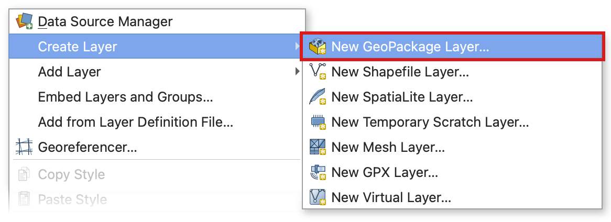

**Layer → Create Layer → New GeoPackage Layer…**

- You will do this yourself for **Lab 4** this week. We won't do it together right now
- More practice on **Thursday** in the hands-on session

<!-- Show the menu. Note the sibling entries: New Shapefile Layer, New Temporary Scratch Layer. A scratch layer lives only in memory and disappears when the project closes, which is fine for a quick sketch and a disaster if you forget. We use GeoPackage. Do not demo this live: it is Lab 4's first step and Thursday's hands-on session practices it. -->

---

# Shapefile or GeoPackage? You will see both

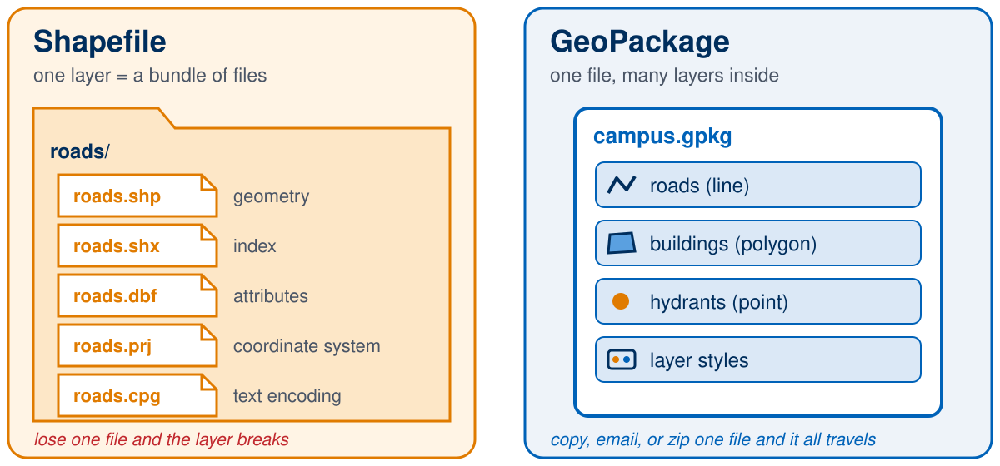

- You will **download** plenty of shapefiles: many portals still hand them out, and QGIS opens them fine
- When you **create** a layer in this class, make a GeoPackage

<!-- Same data inside either one: geometry plus an attribute table. The difference is packaging. A shapefile is a bundle of sibling files with the same name, and every one of them has to travel together; the .prj is the one people lose, and with it the coordinate system. A GeoPackage is a single file that can hold many layers, plus their styles. That is why today's instructions say New GeoPackage Layer even though half the data they have downloaded so far arrived as shapefiles. The details, if asked: a GeoPackage is an open SQLite database, holds many layers and their styles, allows long field names, handles large data, and stores true curves. A shapefile limits field names to 10 characters, holds one geometry type per file, has a historic 2 GB limit, and cannot store true curves. Need a shapefile for a client? Right-click the layer, Export, Save Features As. -->

---

# The New GeoPackage Layer dialog

- **File name** — click the **…** and save it into your own lab folder. This is the actual file on disk
- **Table name** — the layer name inside that file
- **Geometry type** — Point, LineString, Polygon
- **CRS** — leave it on *Project CRS*
- **New Field** — name, type, then **Add to Fields List**

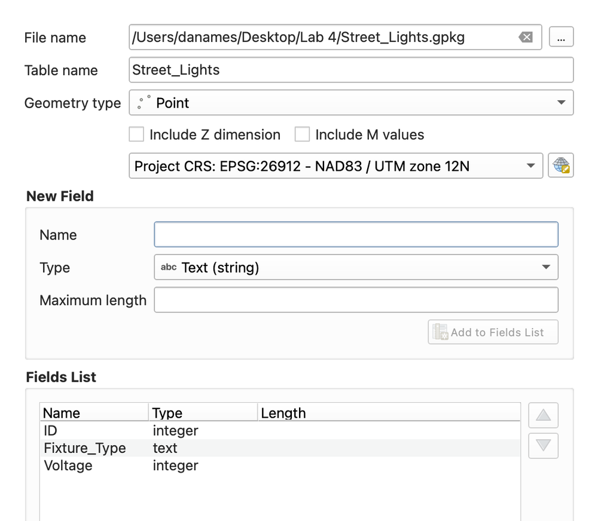

<!-- The single most common Lab 4 mistake: not clicking the three dots next to File name, so the layer never gets a home on disk and the work is lost. Second most common: typing a field name and clicking OK without clicking Add to Fields List first. -->

---

# Field types you will actually use

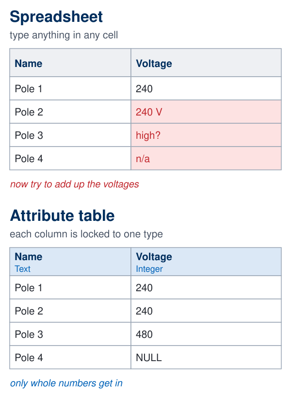

An attribute table looks like a <b>spreadsheet</b>: rows and columns. The difference: in a spreadsheet you can type <b>anything in any cell</b>. In an attribute table each column is hard-wired to one data type.

| Type | Use it for | Example |
| --- | --- | --- |
| **Text (string)** | names, categories, labels | `Fixture_Type` = "LED cobra head" |
| **Integer (32 bit)** | counts, ID numbers, whole units | `Voltage` = 240 |
| Decimal number | measurements, areas, rates | `Area_sqft` = 31842.7 |
| Date | when it was built or inspected | `Installed` = 2019-07-14 |

<!-- Two rules worth saying out loud. One: an ID is a label, not a quantity, so never average it. Two: if you might ever want to add, average, or sort numerically, do not store the value as text. "240 V" as text cannot be summed. The figure makes the spreadsheet point: in Excel, "240", "240 V", "high?" and "n/a" can all sit in one column, and SUM quietly skips the ones it cannot read. An Integer field refuses anything but a whole number, and an unknown value is NULL, not "n/a". That strictness is the point: the database guarantees every value in the column can be added, averaged, or sorted. -->

---

<!-- _class: quiz -->

# You are mapping a campus

Which geometry type for each, and why?

<ol type="A">
<li>Emergency call boxes</li>
<li>Sidewalks</li>
<li>Building footprints</li>
<li>The campus boundary</li>
<li>Fire hydrants and the water mains between them</li>
</ol>

* **Is there a case where sidewalks should be *polygons*?**
* **How about fire hydrants or call boxes?**

<!-- A: point. B: line. C: polygon. D: polygon, one feature. E: two layers, points and lines, because a layer holds one geometry type. Push on E: students often want one "utilities" layer. Ask what the attribute table would look like if hydrants and mains shared it. Half the columns would be empty for every row. Then reveal the two follow-ups one at a time (arrow key); both are about scale. Sidewalks as polygons: yes, whenever the question is about area or width, such as resurfacing or snow-removal quantities (square feet of concrete), ADA width checks, or a site plan. As lines they only give length. Hydrants or call boxes as polygons: at a site-design or as-built scale, the pad, the bollards, and the clearance zone around a hydrant have real footprints that matter. On a campus-wide map they are points. The object did not change; the question and the scale did. -->

---

<!-- _class: lead -->

# Part 2 — Digitizing

## Turning what you can see into coordinates

---

# What digitizing means

- **Digitizing** = tracing real-world features into coordinates the computer can store
- **Then:** a paper map taped to a **digitizing table**, a puck with crosshairs, one click per vertex
- **Now:** **heads-up digitizing** — imagery on screen, you draw over the top of it
- Same idea, same errors, better coffee

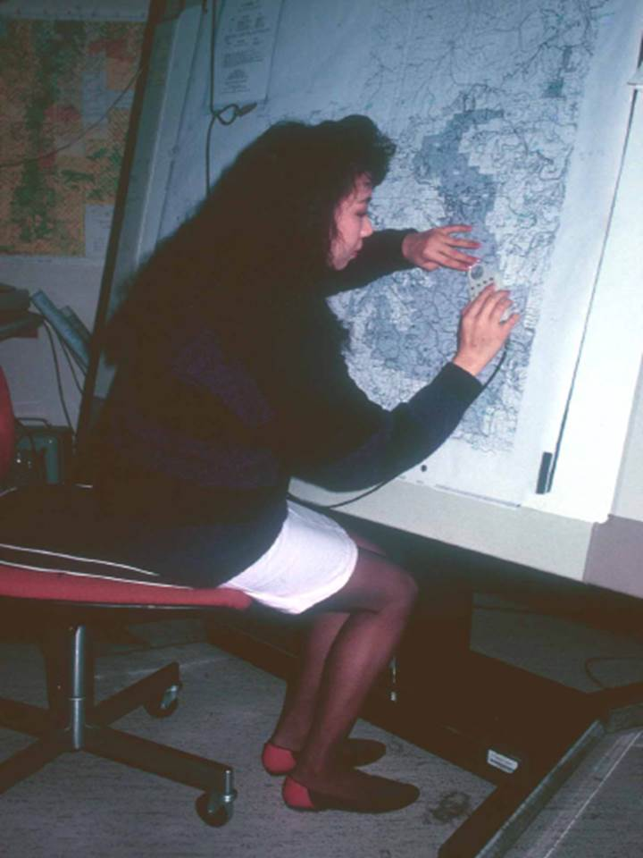
**Then:** digitizing table, 1988

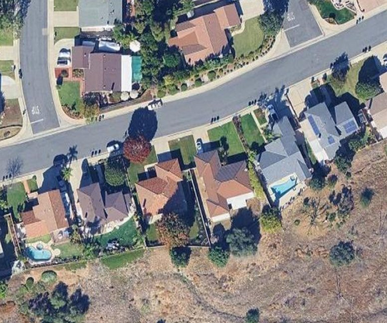
**Now:** imagery on screen

Photo: W. M. Ciesla, USDA Forest Service, 1988. Public domain, via Wikimedia Commons.

<!-- The photo is a USDA Forest Service Forest Pest Management office in Portland, Oregon, in 1988: a paper survey map fastened to a tilted digitizing table, and a corded puck with crosshairs. Every GIS lab had one of these; the operator clicked a button on the puck at each vertex, and the table's grid of wires under the surface turned the puck position into coordinates. Source: https://commons.wikimedia.org/wiki/File:1988._Early_aerial_survey_data_digitizing._Forest_Pest_Management._Regional_Office,_Portland,_Oregon._(39715078922).jpg (PD-USGov-USDA). The name "heads-up" comes from the contrast with tablet digitizing, where your head was down over the table. The skill did not change: you are still deciding, feature by feature, where the line goes. -->

---

# Digitize at the scale you intend to use

- The imagery has a resolution; your eyes and mouse have a resolution too
- Zoom in far enough that one screen pixel is smaller than the accuracy you need
- Zoom in too far and you will spend all hour on one curb
- **Source scale limits the product.** A line traced from a 1:100,000 map does not become accurate by loading it into a project drawn at 1:1,000



<!-- This is exactly the problem Lab 4 asks them to fix. The SGID canal lines were digitized years ago from smaller-scale USGS quads, so in high-resolution imagery they drift well off the real channel. The data are not "wrong"; they are being used at a scale they were never made for. The animation on the right loops on its own: click, click, click at each roof corner, then right-click to close the polygon. Point out that nine vertices is enough for this roof at this zoom; ninety would not make it more accurate. -->

---

# The digitizing loop in QGIS

1. Select the layer in the **Layers** panel
2. **Toggle Editing** — the yellow pencil 
3. Pick **Add Point / Line / Polygon Feature**
4. Click each vertex; **right-click to finish** a line or polygon
5. Fill in the attribute form, click **OK**
6. **Save Layer Edits**, then toggle editing off

- Nothing is on disk until step 6
- The pencil is the switch for the whole layer: if a tool is grayed out, you almost certainly forgot step 2

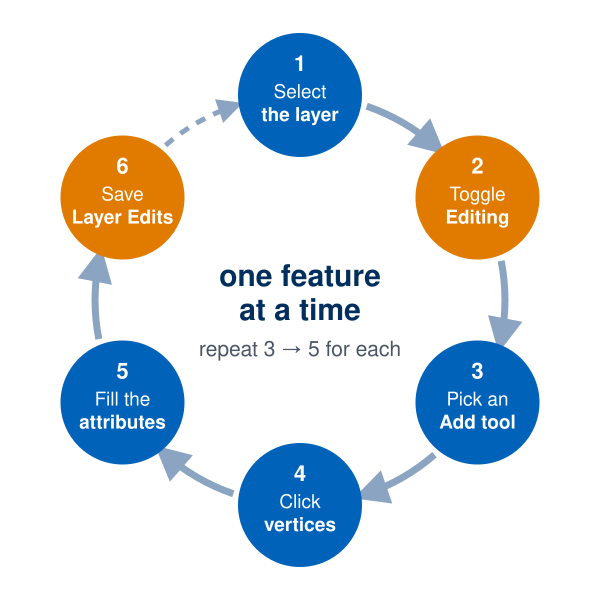

<!-- Concept only today; Thursday they run this loop for real. Toolbars: the Digitizing and Advanced Digitizing toolbars are turned on by right-clicking the toolbar area. Walk the loop out loud once. "The layer is not editable" is the error they will hit most, and it always means the pencil is off or the wrong layer is selected. -->

---

<!-- _class: quiz -->

# How many vertices does this road need?

<ol type="A">
<li>As few as possible</li>
<li>As many as possible</li>
<li>Enough that the line matches the imagery at the scale you will use it</li>
<li>One every 10 meters, evenly spaced</li>
</ol>

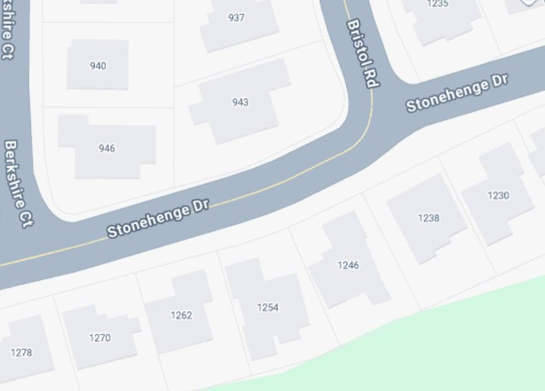

<!-- C. More vertices is not more accurate; it is only more data. A straight road needs two. A cul-de-sac needs many, or one arc. Ask what happens to file size, drawing speed, and every analysis downstream when someone streams a whole county at 2 px tolerance. -->

---

# Topology: when "close enough" is wrong

- **Topology** is how features relate: connected, adjacent, contained
- Undershoots and overshoots at a junction break network analysis: water does not flow across a 30 cm gap
- Two parcels that overlap by a sliver mean the total area is wrong
- A culvert point that is *near* the stream instead of *on* it will not join to it

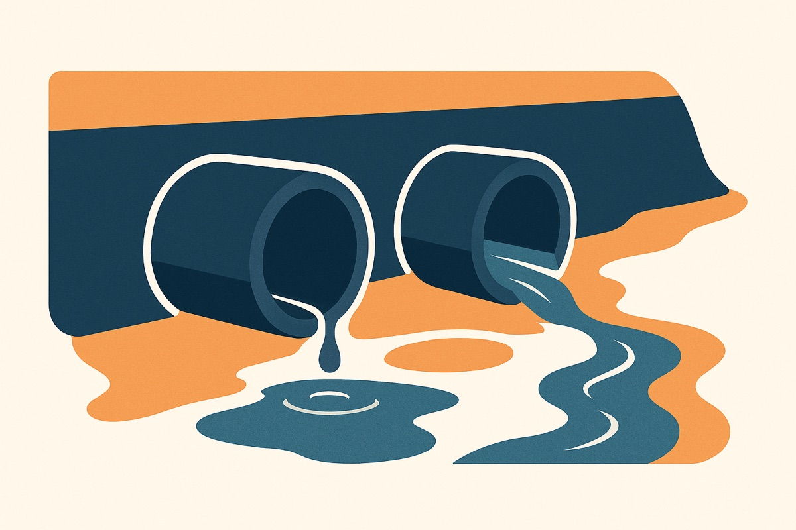

- QGIS tools that keep you honest:
  - **Enable Snapping** before you draw (Lab 4 uses a 12-pixel tolerance)
  - **Topological Editing** — move a shared vertex once, both features follow
  - **Avoid Overlap** — new polygons get clipped to their neighbors

<!-- Snapping tolerance: in pixels it follows the zoom (the same 12 px is a big distance zoomed out and a small one zoomed in); in map units it does not. Neither is right; you just have to know which one you set. Concrete stakes: an unsnapped culvert is invisible to a hydrologic model, so the model routes water over the road instead of under it, and the design storm comes out wrong. This is why Lab 4 makes them snap every culvert onto the waterway line. -->

---

<!-- _class: lead -->

# Part 3 — Editing

## Most GIS work is fixing data, not making it

---

# Fixing data that arrives wrong

- Realistic workflow, and the one in Lab 4:
  1. Load authoritative data (UGRC SGID)
  2. Compare it against better imagery
  3. Screenshot the **before**
  4. Move vertices onto what you can actually see, with the **Vertex Tool**
  5. Screenshot the **after**, and save
- The before/after pair is the evidence that you changed something on purpose

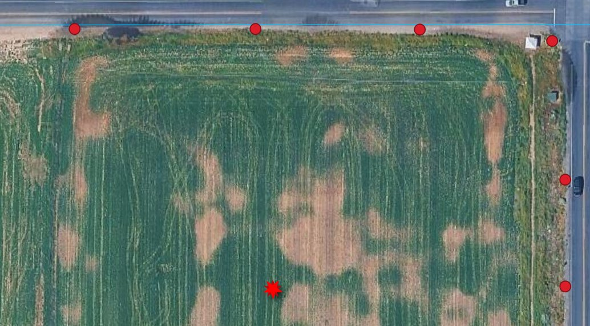

<!-- Professional habit worth naming: never silently improve somebody's data. Record what you changed, why, and against what source. On a real project that record is the difference between a correction and a liability. -->

---

<!-- _class: lead -->

# Part 4 — Attribute tables and schemas

## The other half of every vector layer

---

# Geometry is only half the layer

- Every vector layer is **geometry + a table**: one row per feature, one column per fact
- The row and the shape are the same feature. Select the row, the shape highlights
- Geometry answers *where*. Attributes answer *what*, *how big*, *how old*, *whose*
- Almost every question you will be asked is an attribute question with a spatial filter

- "Which street lights on 100 South are over 20 years old?"
  - *street lights* → the layer
  - *on 100 South* → geometry
  - *over 20 years old* → attributes

<!-- Tie back to Day 2, where they opened the cellular towers attribute table and watched a row light up a tower. Same idea, except now they are the ones deciding what the columns are. -->

---

# Designing a schema

- A **schema** is the table structure: field names, types, and lengths
- Ask before you draw:
  - What will I **label** these features with?
  - What will I **symbolize** or **filter** by?
  - What will somebody else need in five years?
- Name fields for humans: `Fixture_Type`, not `FT2`

**Example schemas from Lab 4**

`Street_Lights` (Point)
ID (integer) · Fixture_Type (text) · Voltage (integer)

`Temple_Footprint` (Polygon)
Name (text) · area (decimal)

<!-- Third Lab 4 schema, for the line layer: Curb_Lines (LineString) with ID (integer), Material (text), Condition (text). The labeling question is the one from the original deck and it is a good one: if you do not create a Name field, you have nothing to label the map with, and you will be re-typing attributes for forty features the night before it is due. -->

---

<!-- _class: quiz -->

# What is wrong with this schema?

A student builds a `Buildings` polygon layer with:

<ol type="A">
<li><code>name</code> — Text</li>
<li><code>height</code> — Text, e.g. "42 ft"</li>
<li><code>yr</code> — Text, e.g. "1994"</li>
<li><code>id</code> — Integer</li>
<li><code>notes</code> — Text, 10 characters</li>
</ol>

<!-- B and C should be numeric: as text you cannot sum, average, sort, or graduate symbology by them, and "42 ft" would have to be parsed. C is better still as a Date if the exact date is known. E is too short to be useful; a notes field needs room. D is fine, as long as nobody averages it. Ask what would break first if this layer went to a client. -->

---

<!-- _class: lead -->

# Part 5 — Saving to disk

## Where does the data actually live?

---

# Editing is in memory until you save

- Toggling editing on puts the layer's changes in an **edit buffer**, not on disk
- **Save Layer Edits** writes that buffer to the file
- Toggling editing off prompts you to save or discard
- **Saving the project is not saving the data.** The `.qgz` file stores where your layers are and how they are drawn — not the features themselves

- Two separate save habits: save **layer edits** often, and save the **project** often
- A temporary **scratch layer** never had a file at all, and vanishes when QGIS closes

<!-- This slide is worth a full minute. The single most common way students lose an hour of work is assuming Ctrl+S on the project saved their digitizing. It did not. -->

---

# Five ways to lose an afternoon

- Digitizing into a **temporary scratch layer**, then closing QGIS
- Never clicking the **…** next to File name, so the layer has no home on disk
- Typing a field name and clicking **OK** without **Add to Fields List**
- Saving the **project** and assuming the **layer edits** were saved too
- Drawing forty features with **snapping off**, then discovering nothing connects

<!-- Read these out. Every one of them is a real thing that has happened in this class, and four of the five will happen Thursday if nobody says them first. -->

---

<!-- _class: activity -->

# Thursday: hands-on in QGIS

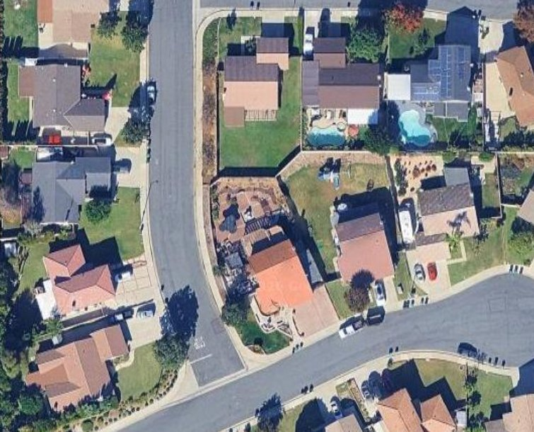

- **In-class activity: Creating and Editing Vector Data**
- Bring your laptop with **QGIS 3.44** installed
- Load a satellite basemap and zoom to **your own home**
- Create point, line, and polygon layers and digitize your house and your street
- Practise **snapping** and topology so your lines actually meet
- Turn in a **screenshot or PDF** of your digitized home

<!-- This is the activity from the original version of this lecture, now where it belongs: Thursday, hands-on. Tell them to think tonight about which home they will map and what attributes they would want. -->

---

# Before Next Class

- Read **Chapter 4, *Maps, Data Entry, and Editing***, in *GIS Fundamentals* (Bolstad & Manson)
- **Quiz 4 (GPS Part 2)** — open book, on Learning Suite, due **Saturday**
- **Lab 4: Changing, Editing, and Fixing GIS Data** — due **Saturday**
  [byu-hydroinformatics.github.io/cce114-geomatics/assignments/lab-04/](https://byu-hydroinformatics.github.io/cce114-geomatics/assignments/lab-04/)
- Bring your laptop with QGIS installed on Thursday
- Questions? Office hours: [calendly.com/dan-ames/office-hours](https://calendly.com/dan-ames/office-hours)

<!-- Lab 4 is the graded version of everything in today's lecture: creating GeoPackage layers, digitizing, snapping, the Vertex Tool, and a schema. Confirm the exact Saturday deadline on Learning Suite before class. -->

<!-- Conversion notes (2026-09-02): source deck "114 - Working with Vector Data.pptx" (Archived, 2026), 8 slides. The source was written as a Thursday hands-on walkthrough ("Make a Map of Your Childhood Home", steps 1-4 with New Shapefile Layer); that walkthrough has been moved to the Thursday preview slide, since Day 8 is the Tuesday concepts lecture, and the concept material (creating layers, digitizing, editing, schemas, saving to disk) has been expanded to fill the hour around the source deck's own Learning Goals list. Source slides not carried over as slides: slide 1 title (replaced by the standard title slide; its speaker note was a stale ArcGIS ModelBuilder workshop abstract, unrelated to this lecture, and was dropped), slides 4-8 (the step-by-step childhood-home walkthrough, now the Thursday preview). No ArcGIS screenshots are used: the only screenshot in the source deck is the QGIS New Shapefile Layer dialog, which is kept on the shapefile slide. QGIS 3.44 screenshots (Create Layer menu, New GeoPackage Layer dialog, digitizing tools, snapping toolbar, Vertex Tool, Field Calculator, example result) were reused from docs/assignments/lab-04/images so the deck matches the wording students see in Lab 4. TODO for the instructor: (1) confirm the Saturday due dates for Quiz 4 and Lab 4 on Learning Suite; (2) the Field Calculator screenshot (images/vec-field-calculator.png) is low resolution in the source and has been cropped to the expression panel — worth re-shooting at full resolution; (3) consider re-shooting the New GeoPackage Layer dialog with a Day 8 example instead of the Lab 4 Street_Lights example if you would rather the lecture not preview the lab. -->

---

<!-- _class: activity -->

# Your Turn — Who Drew That Line?

Eight questions on your phone:

- Before you **draw anything**
- Turning what you see into **coordinates**
- The **table**, and the save

Not graded, and every answer explains itself. Good practice for this week's open-book quiz.

byu-hydroinformatics.github.io/cce114-geomatics/quizzes/vector/

<!-- Five minutes, in pairs, then a show of hands on the two worth arguing about: hydrants and mains in one layer or two, and what Ctrl+S on the project actually saved. Both come back on Thursday. If the room has no signal, put the URL on the board. The page is linked from the Week 5 page too. -->
