<!-- _class: lead -->
<!-- _paginate: skip -->

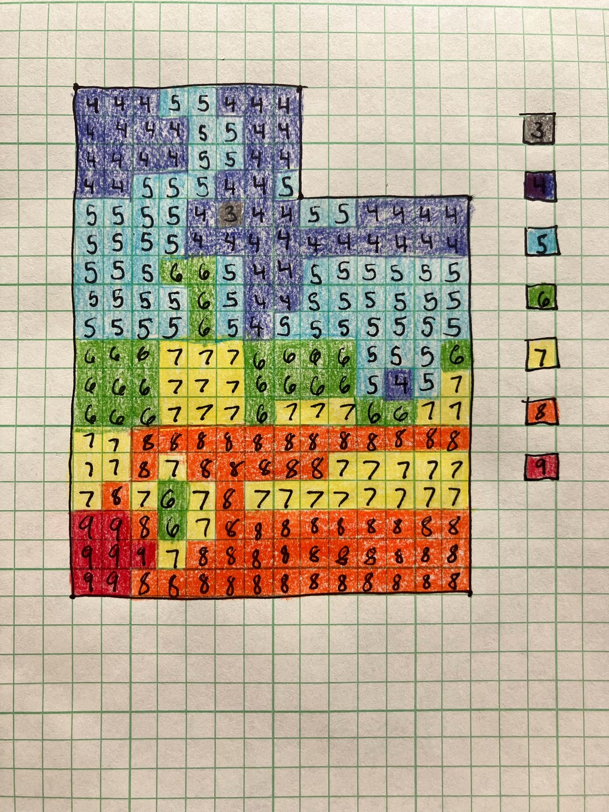

# Raster Analysis and Map Algebra

CCE 114 Geomatics
Dr. Dan Ames and Dr. James Halgren

<!-- Tuesday concept lecture, Week 6. Today is raster: what a grid of cells actually is, and what you can do by adding grids together. The image on the right is a student's finished engineering-paper suitability map from Winter 2025 (credit: Rachel Partington). We build one of those in the first half of class. Thursday is the QGIS session in the Thursday hands-on session. -->

---

# Today's Goals

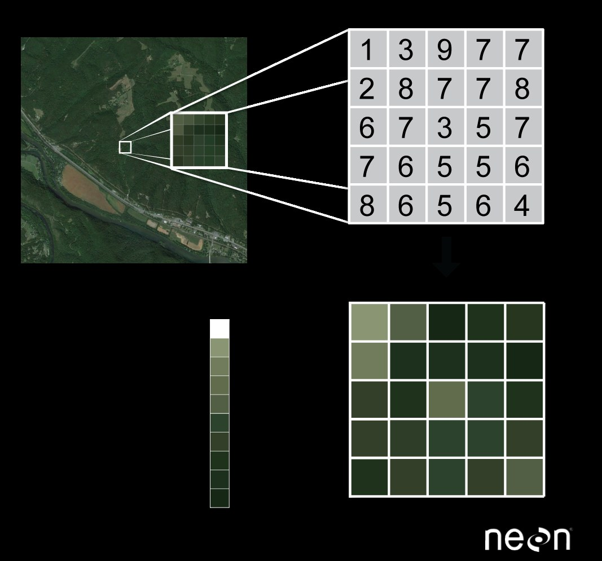

By the end of class you should be able to:

- Describe a raster by its **cells, resolution, extent, and no-data value**
- Tell a **discrete** raster from a **continuous** one, and say which fits a given phenomenon
- Perform **map algebra** by hand: combine grids cell by cell to answer a question
- Explain what a **DEM** is and name surfaces derived from one
- Say why raster is a poor fit for some data and the obvious fit for others

<!-- Reading is GIS Fundamentals: the raster sections of Chapter 2 and all of Chapter 10, Raster Analysis. This lecture follows the same ground. -->

---

<!-- _class: lead -->

# First we do it by hand

## Then we name what we did

<!-- Same pattern as Day 2: see it first, then name it. Students spend the next 25 to 30 minutes doing a full raster suitability analysis on engineering paper with a pencil. Every term in the second half of the lecture (cell, resolution, reclassify, map algebra, weighted overlay) will point back at what they drew. -->

---

<!-- _class: activity -->

# Engineering Paper Raster Analysis

- We are building a new **Raging Waters** water park in Utah
- We want a **"heat map" of the whole state** showing how suitable each location is
- Not a single answer: a *value everywhere*
- You have a pencil, engineering paper, and about 25 minutes

<!-- Frame it as a real siting problem. Ask: how would you answer "where should it go?" with the vector tools from last week? You would end up intersecting a lot of polygons. Raster lets you score every location in the state at once. -->

---

<!-- _class: activity -->

# What the analysis needs

**Data needs**

- **State of Utah** — must be *within* the state
- **Major roads** — must be *near* a major freeway
- **Cities** — *further away* is better (cheaper land)
- **Temperature** — *warmer* is better for year-round fun

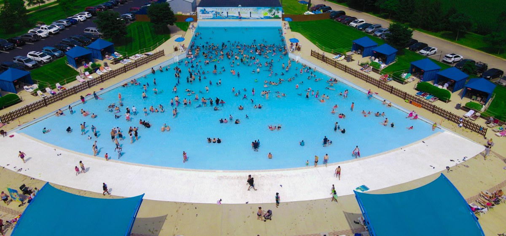

Four criteria → **four grids** → one combined score.

<!-- Point out that these are exactly four map layers, and that each one has to be turned into a number in every cell before they can be combined. That conversion is called reclassification, and we name it later. -->

---

<!-- _class: activity -->

# Layer 1: the state

- Take a sheet of engineering paper and **rip it into quarters**
- On the first piece, draw the outline of **Utah** (check Google Maps)
- Fill the interior with **1**, everything outside with **0**
- Every square on the paper is a **cell**; every cell gets a value

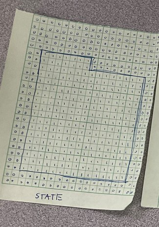

<!-- Walk the room. The common mistake is leaving cells blank; insist that every cell gets a number. That is the whole point of a raster: it is completely filled in. -->

---

<!-- _class: activity -->

# Layer 2: freeways

- On the second piece, draw the **major freeways** through the state
- Draw a **buffer of one cell** around each freeway
- Write **1** inside the buffer, **0** everywhere else
- Read 1 as *acceptable*, 0 as *unacceptable*

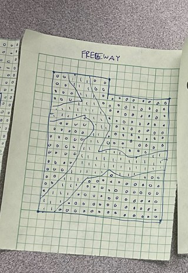

<!-- A one-cell buffer on this grid is a real distance: ask them what one cell is worth in miles given that the sheet covers all of Utah. That number is the cell size, or resolution, and it decides how good the answer can possibly be. -->

---

<!-- _class: activity -->

# Layer 3: cities

- On the third piece, mark points where the **big cities** are
- Buffer each city with **2 cells**, then again with **4 cells**
- Write **0** at the city, **1** in the first ring, **2** in the second, **3** outside
- We are ranking places *away* from cities higher

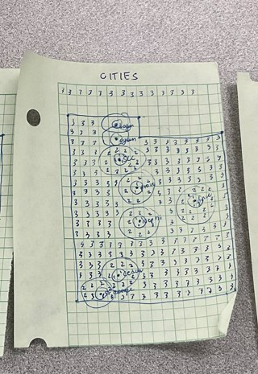

<!-- This is the first layer where the numbers are a ranking rather than a yes/no. Ask why land cost pushes the score up as you move away, and whether that is really true for every kind of development. -->

---

<!-- _class: activity -->

# Layer 4: temperature

- On the fourth piece, write values of **1 to 5** representing temperature from low to high across the state
- Warmer locations get **more weight**
- You are not measuring temperature, you are **scoring** it

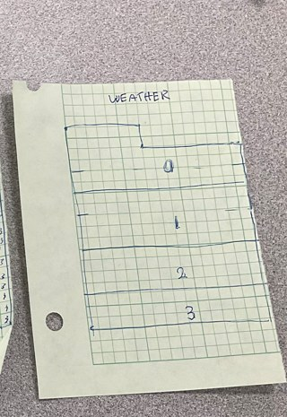

<!-- Note that temperature is a continuous surface in reality, and the students have just binned it into five classes. That is reclassification of a continuous raster into a discrete one, done with a pencil. -->

---

<!-- _class: activity -->

# Combine them into a suitability map

- Combine your four grids into **one** heat map of suitability
- You can **add**, **multiply**, or invent your own rule
- Color the cells by their combined value, or just write the totals onto one of your sheets
- Be ready to defend the rule you chose

<!-- Credit for this example map: Rachel Partington, Winter 2025. Ask two groups who chose different rules to compare results. Multiplying makes any zero fatal, which is exactly right for "must be in the state" and "must be near a freeway"; adding lets a strong score on one criterion rescue a zero somewhere else. There is no single correct answer, and that is the lesson. -->

---

<!-- _class: activity -->

# Turn it in

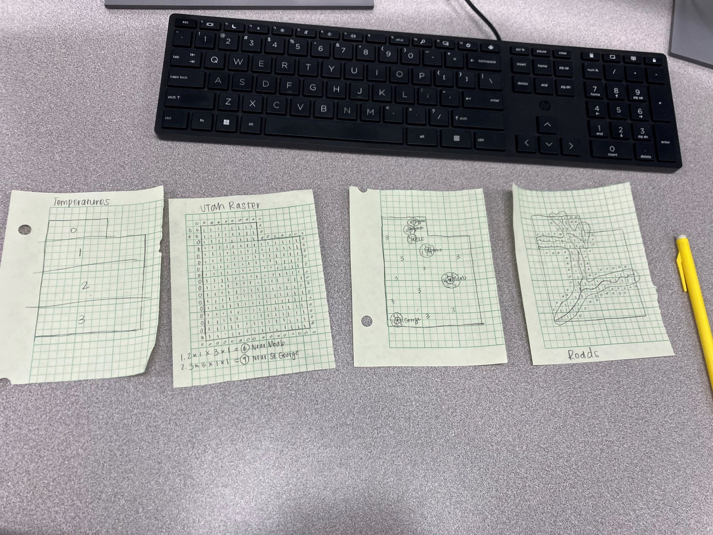

- **Take a photo** of your four layers and your combined map
- Upload it to **Learning Suite** before you leave
- Keep the sheets: we refer back to them for the rest of the hour

<!-- Collect this today. It is quick credit and it gives you a record of who was in class and who understood the combination step. -->

---

<!-- _class: lead -->

# You just did raster analysis

## Every term for the rest of the hour is a name for something you already drew

<!-- Recap out loud before moving on: the squares are cells, the sheet is the extent, the width of one square is the resolution, "outside the state" was your no-data area, turning temperature into 1 to 5 was reclassification, and adding or multiplying the four sheets was map algebra. -->

---

# What is raster data?

- A **regularly spaced grid of numeric values**
- Grid **cells** are also called **pixels**
- Each cell holds **one** number
- That number can be:
  - **Continuous** — elevation, temperature, rainfall
  - **Categorical** — land use, soil type, county

<a href="https://datacarpentry.org/organization-geospatial/01-intro-raster-data/" target="_blank">datacarpentry.org/organization-geospatial/01-intro-raster-data/</a>

<!-- Figure from the Data Carpentry geospatial lesson. Zoom in far enough on any aerial image and it stops being a picture and becomes a table of numbers. That is all a raster ever is. -->

---

# The four things that define a raster

- **Cell size (resolution)** — how wide one cell is on the ground: 1 m, 30 m, 1 km. Nothing smaller than a cell exists in the data.
- **Extent** — the rectangle the grid covers: min x, min y, max x, max y
- **Rows and columns** — extent ÷ cell size
- **No-data value** — the flag for "no measurement here", often −9999

← 6 columns × 30 m = 180 m extent →

4 rows × 30 m

<table style="border-collapse:collapse;">
<tr><td style="border:1px solid #7a8698;width:52px;height:40px;">12</td><td style="border:1px solid #7a8698;width:52px;height:40px;">14</td><td style="border:1px solid #7a8698;width:52px;height:40px;">15</td><td style="border:1px solid #7a8698;width:52px;height:40px;">15</td><td style="border:1px solid #7a8698;width:52px;height:40px;background:#e6e9ee;color:#9aa3b0;">−9999</td><td style="border:1px solid #7a8698;width:52px;height:40px;background:#e6e9ee;color:#9aa3b0;">−9999</td></tr>
<tr><td style="border:1px solid #7a8698;height:40px;">13</td><td style="border:1px solid #7a8698;">16</td><td style="border:1px solid #7a8698;">18</td><td style="border:1px solid #7a8698;">17</td><td style="border:1px solid #7a8698;">16</td><td style="border:1px solid #7a8698;background:#e6e9ee;color:#9aa3b0;">−9999</td></tr>
<tr><td style="border:1px solid #7a8698;height:40px;">14</td><td style="border:1px solid #7a8698;">17</td><td style="border:2px solid #0062b8;background:#dbeafe;">21</td><td style="border:1px solid #7a8698;">19</td><td style="border:1px solid #7a8698;">17</td><td style="border:1px solid #7a8698;">15</td></tr>
<tr><td style="border:1px solid #7a8698;height:40px;">14</td><td style="border:1px solid #7a8698;">15</td><td style="border:1px solid #7a8698;">18</td><td style="border:1px solid #7a8698;">18</td><td style="border:1px solid #7a8698;">16</td><td style="border:1px solid #7a8698;">14</td></tr>
</table>

one cell = 30 m × 30 m · gray cells are no-data

<!-- Insist on the difference between a no-data cell and a cell whose value is zero. On the engineering paper, cells outside Utah were given a real 0 that means "unsuitable", which is a value; a no-data cell means the software should not compute with it at all. Mixing the two is the single most common raster bug students hit in the lab. In QGIS you can see all four of these on the Information tab of the layer properties, which is the first thing we look at on Thursday. -->

---

# Discrete versus continuous

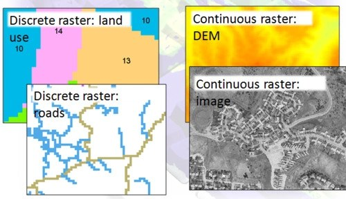

<!-- Four panels: land use and roads are discrete, meaning the number is a code for a category and the boundaries between classes are real edges. The DEM and the aerial image are continuous: the value changes a little from every cell to its neighbor and there is no edge. -->

---

# Discrete versus continuous

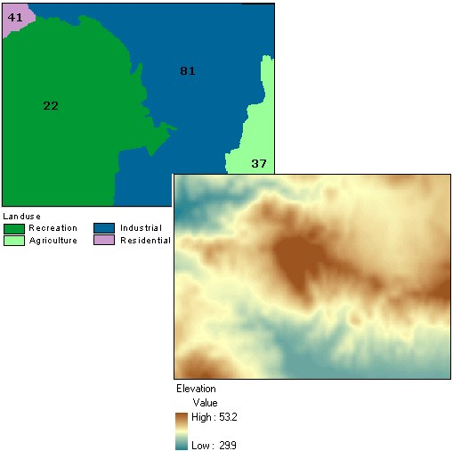

<!-- Left: a land use raster, where 22, 41, 81 and 91 are codes, not quantities. Averaging them would be meaningless. Right: an elevation surface, where averaging neighboring cells is a perfectly sensible thing to do. The test is whether arithmetic on the values means anything. -->

---

<!-- _class: quiz -->

# Discrete or continuous?

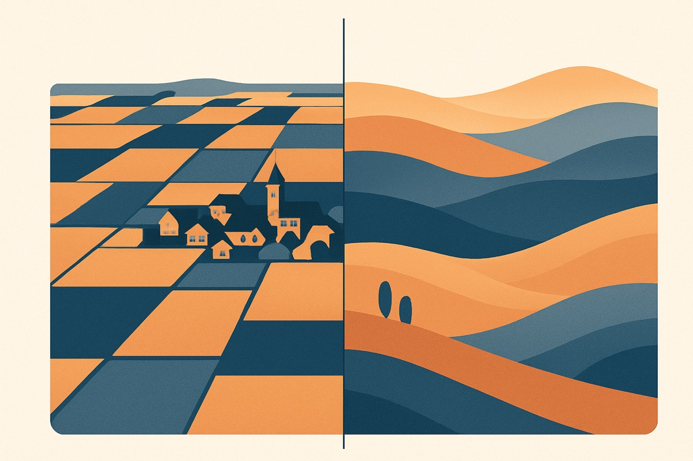

Which of these would you store as a **continuous** raster, and which as a **discrete** one?

<ol type="A">
<li>Soil type</li>
<li>Annual rainfall</li>
<li>County boundaries</li>
</ol>

<ol type="A" start="4">
<li>Ground surface elevation</li>
<li>Land cover class</li>
</ol>

Then: which one of them is **not** a good candidate for a raster at all?

<!-- Continuous: B and D. Discrete: A, C and E. The one that does not really belong in a raster is C, county boundaries: it is a small number of large, crisply bounded areas with sharp legal edges, which is exactly the case vector handles better. Storing a county as a grid gives you a stair-stepped border and a lot of wasted cells, which is the Colorado raster from Day 2 all over again. -->

---

# Example continuous raster data

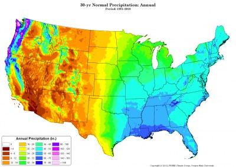
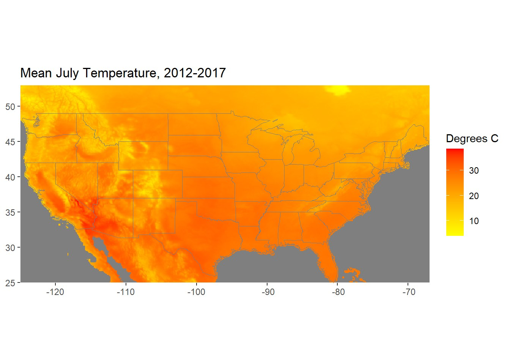
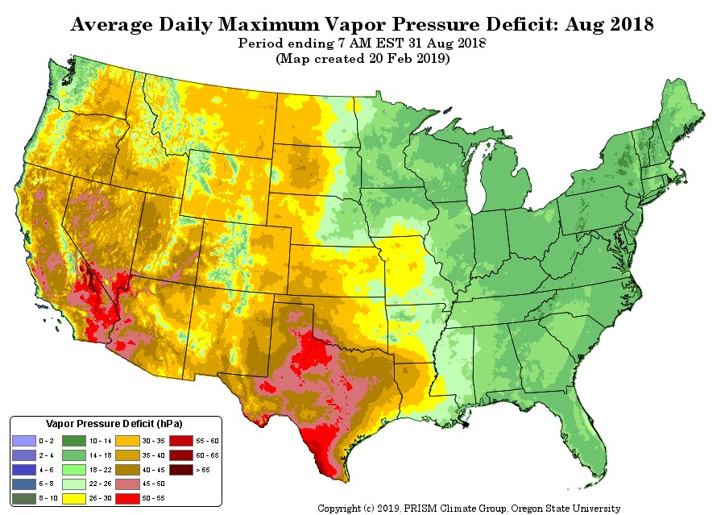
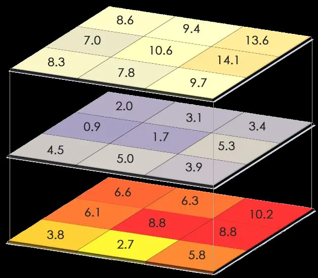

Annual precipitation

Mean July temperature

Vapour pressure deficit

Stacked, coincident grids

<!-- Precipitation, mean July temperature, and vapour pressure deficit, all from PRISM at Oregon State. Bottom right is the mental model: several coincident grids stacked, each cell of one lining up exactly with a cell of the others. Ask what else is continuous. pH, air pressure, salinity, population density, travel time, noise. -->

---

# Example discrete raster data

- Political boundaries
- Things on the land
- Land cover types
- Soil types
- What else?

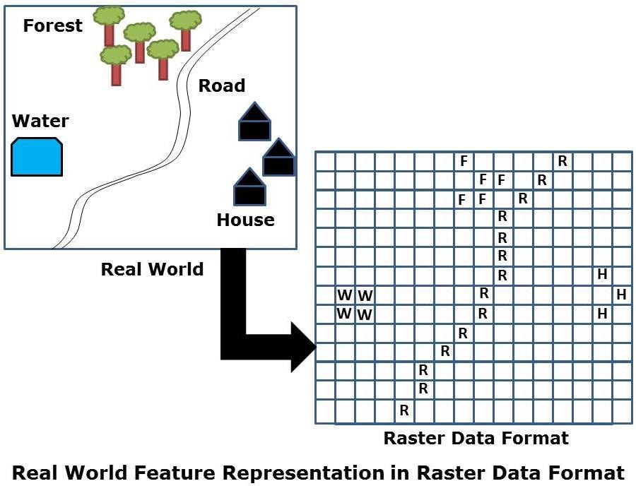

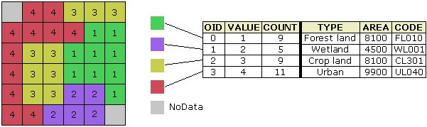

<!-- The right-hand figure is the key one: real world features, forest, road, water, house, get burned into a grid where every cell takes the code of whatever dominates it. Notice how much is lost. The road becomes a staircase, the house becomes a single cell. The small table shows that a discrete raster can carry an attribute table just like a vector layer: one row per value, with a count of cells and a code. -->

---

# Why we use raster GIS

- Better suited to spatially **continuous** data such as elevation
- Better for **visualization** and for modeling environmental phenomena
- Other continuous data: pH, air pressure, temperature, salinity
- A **simplified realisation** of the world, so processing is fast and efficient
- Geoprocessing becomes **array arithmetic** on a grid

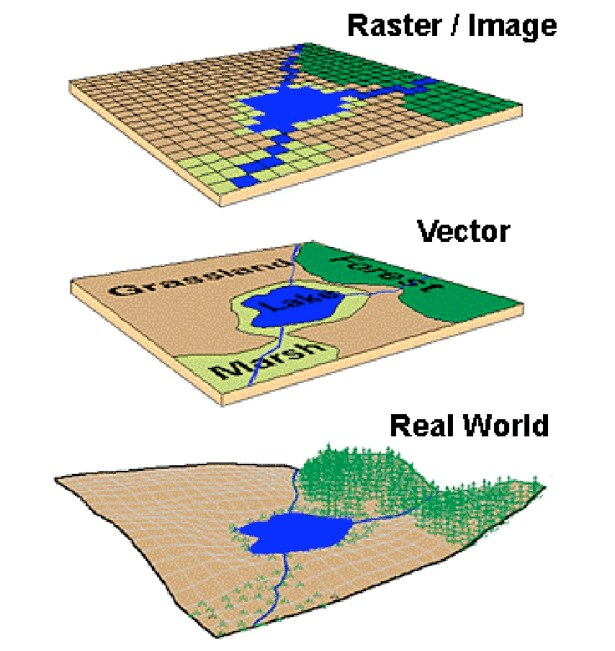

<!-- The figure shows the same landscape three ways: real world at the bottom, vector in the middle, raster on top. The raster version is the crudest and the fastest. Point out that the whole grid is just a 2D array in memory, so every operation is a loop over an array, which is why raster analysis scales to continent-sized problems. -->

---

<!-- _class: quiz -->

# A spatial data mantra?

## "Raster is faster, but vector is better"

Is it true?

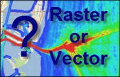

<!-- Half true and out of date. Raster really is faster, because it is array arithmetic with no topology to maintain. "Vector is better" only holds for discrete features with crisp boundaries: parcels, pipes, roads, wells. For a continuous surface, vector is not better, it is close to unusable. The honest version is that the data model should match the phenomenon, which is the Day 2 lesson again. -->

---

<!-- _class: lead -->

# Part 2

## Raster manipulation and map algebra

---

# Basic raster grid manipulation

- **Reclassify** — replace values with new values or classes
- **Convert** — raster to vector, or vector to raster
- **Prepare for analysis**
  - Set the **extent**
  - **Mask** or **clip** to a boundary
- **Watch out for coordinate systems!**

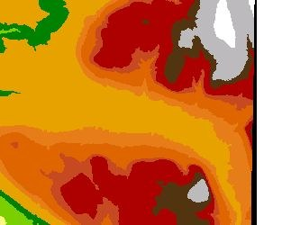

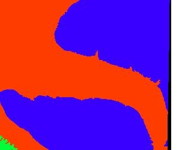

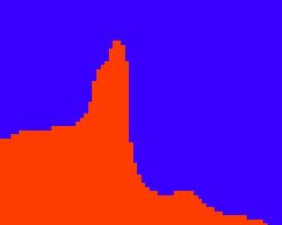

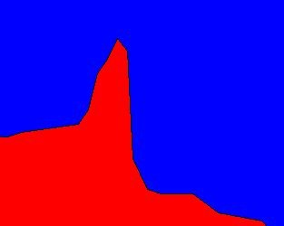

<!-- The four panels are one continuous surface being reclassified progressively down to a two-class mask. In QGIS these live in the Processing Toolbox under Raster analysis: Reclassify by table, Reclassify by layer, and under Raster extraction: Clip raster by mask layer. Masking is the raster cousin of the CLIP tool you used on vector data. On coordinate systems: two rasters in different CRSs will still line up on screen because QGIS reprojects for display, but map algebra between them gives garbage. Reproject first with Warp (Reproject). -->

---

# Map algebra

- A **cell by cell** combination of raster layers using mathematical operations
- **Unary** — one input layer
- **Binary** — two or more input layers
- Addition, subtraction, multiplication, division, max, min: essentially any operation you would use in a spreadsheet

© Paul Bolstad, <em>GIS Fundamentals</em>

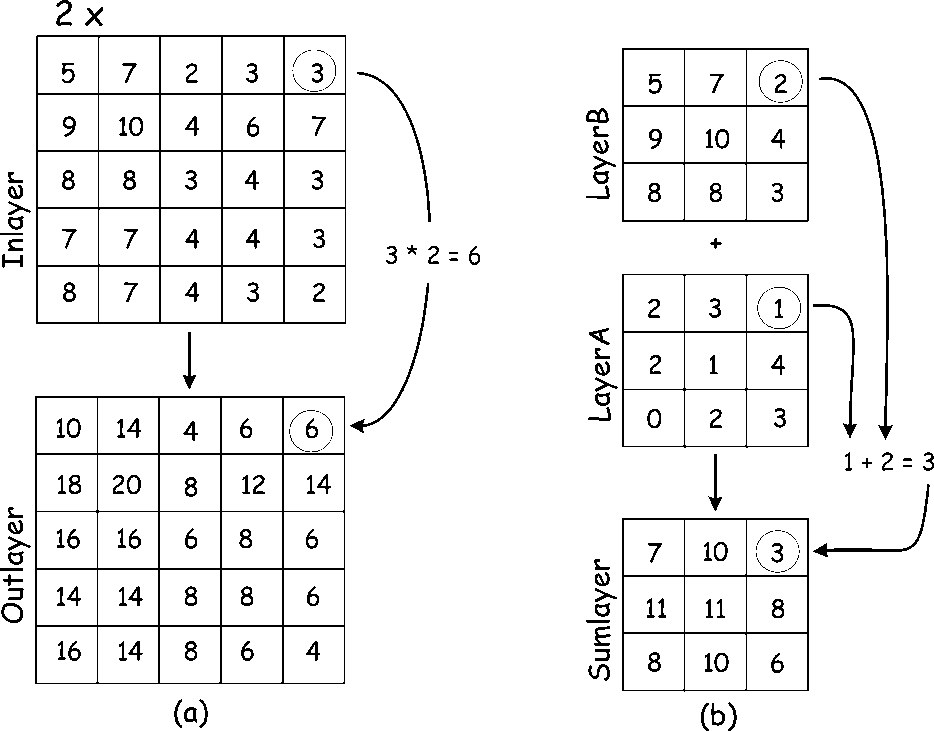

<!-- Left panel (a) is unary: multiply every cell of one layer by 2. Right panel (b) is binary: add layer A to layer B, cell by cell, to get a sum layer. This is precisely what the class did when they stacked the four engineering-paper sheets. In QGIS the tool is the Raster Calculator, on the Raster menu, and there is a Processing-Toolbox version too. -->

---

<!-- _class: quiz -->

# Work one cell

What is the value of the **top-right cell** of the output?

<table style="border-collapse:collapse;font-size:0.85em;text-align:center;margin:0 auto;">
<tr><td colspan="3" style="border:none;font-weight:700;color:#002e5d;">State</td><td style="border:none;"></td><td colspan="3" style="border:none;font-weight:700;color:#002e5d;">Freeway</td></tr>
<tr>
<td style="border:1px solid #888;padding:6px 12px;">1</td><td style="border:1px solid #888;padding:6px 12px;">1</td><td style="border:1px solid #888;padding:6px 12px;">0</td>
<td style="border:none;padding:0 10px;">+</td>
<td style="border:1px solid #888;padding:6px 12px;">0</td><td style="border:1px solid #888;padding:6px 12px;">1</td><td style="border:1px solid #888;padding:6px 12px;">1</td>
</tr>
<tr>
<td style="border:1px solid #888;padding:6px 12px;">1</td><td style="border:1px solid #888;padding:6px 12px;">1</td><td style="border:1px solid #888;padding:6px 12px;">1</td>
<td style="border:none;"></td>
<td style="border:1px solid #888;padding:6px 12px;">1</td><td style="border:1px solid #888;padding:6px 12px;">1</td><td style="border:1px solid #888;padding:6px 12px;">0</td>
</tr>
</table>

If the rule is `State + Freeway`:

<ol type="A">
<li>0</li>
<li>1</li>
<li>2</li>
<li>Cannot tell</li>
</ol>

Now answer again for `State * Freeway`.

<!-- Addition gives B, 1. Multiplication gives A, 0. That difference is the whole design decision: multiplying treats "outside the state" as a veto that nothing can overcome, while adding treats it as one lost point. Ask which one they would actually want for the water park, and whether any of them noticed this while combining their sheets. -->

---

# Be careful what you add

A raster is just an **array**, which is why map algebra is fast. But the arrays have to line up. Watch out for:

- Layers that are **not coincident** — different origins, so cell A and cell B are not the same place
- **Different cell sizes** — a 30 m grid and a 10 m grid
- **Different coordinate systems**
- **No-data**: anything plus no-data is no-data

© Paul Bolstad, <em>GIS Fundamentals</em>

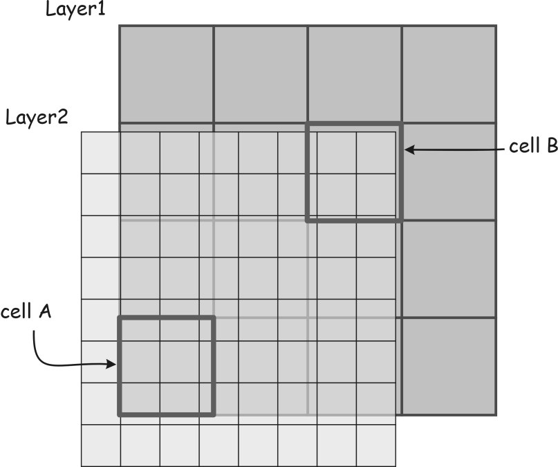

<!-- The figure shows two grids with different origins and different cell sizes; cell A and cell B overlap partly, so there is no clean cell-to-cell correspondence. QGIS will resample for you if you let it, but it will pick the resampling rule, and nearest neighbor on a land-cover raster is right while nearest neighbor on elevation throws away accuracy. Fix it deliberately: reproject and align the grids before the Raster Calculator, not after. The engineering-paper analogue is holding two sheets up to the light and finding the squares do not line up. -->

---

<!-- _class: lead -->

# Part 3

## Digital elevation models and derived surfaces

---

# The digital elevation model

- A **DEM** is a raster where every cell holds a **ground elevation**: the classic continuous surface, and the raster civil engineers use most
- Where they come from:
  - **Lidar** — 1 m or finer, from aircraft or drone
  - **USGS 3DEP** — 1/3 arc-second, roughly 10 m, US-wide
  - **SRTM / Copernicus** — roughly 30 m, near-global
- A **DEM** is bare earth; a **DSM** includes buildings and trees

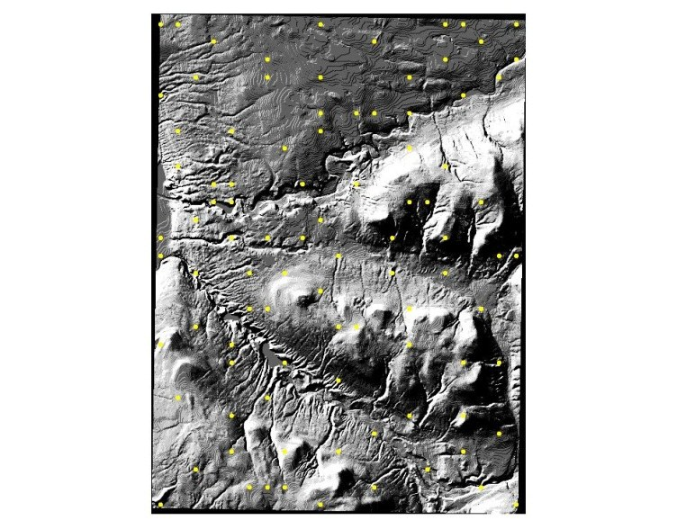

<!-- The image is a shaded relief, which is itself a derived product, not the DEM. Make the DEM vs DSM distinction concrete: for a drainage study you want bare earth, for a viewshed or a solar study you want the surface with buildings on it. If they download the wrong one their culverts will drain through the trees. -->

---

# Surfaces derived from a DEM

Each is **map algebra on a neighborhood** of cells:

- **Slope** — rate of change of elevation, in degrees or percent
- **Aspect** — the compass direction the slope faces
- **Hillshade** — shaded relief, for looking at, not measuring
- **Contours** — the vector product, drawn from the grid
- **Flow direction** and **flow accumulation** — which give **stream networks** and **watersheds**

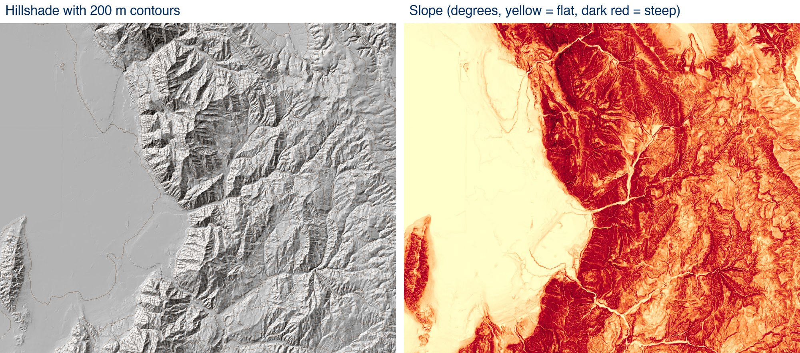

<!-- The neighborhood is usually the eight cells surrounding each cell: slope and aspect are fitted to that 3x3 window. Emphasise that the input to every one of these is a single DEM: no extra data is collected, the information was already in the grid. This is the payoff of the raster model and the reason hydrology is done in raster. The right-hand figure is the Utah County DEM from Week 2 run through two of these tools in QGIS: a hillshade with 200 m contours on the left, slope in degrees on the right, both over the Wasatch Front east of Provo. In QGIS these are all in the Processing Toolbox: Raster analysis gives you Slope, Aspect and Hillshade, Raster extraction gives you Contour, and the GDAL and SAGA providers give the hydrology tools. -->

---

# Where this goes in engineering

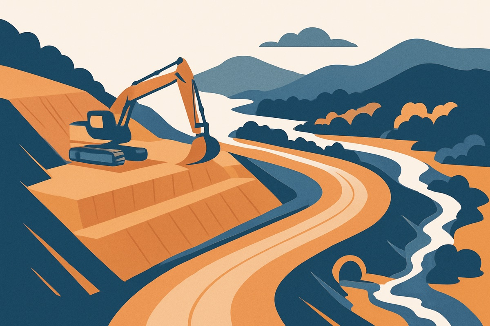

- **Site suitability** — exactly what you drew on paper: score every criterion, combine, rank
- **Drainage and hydrology** — watershed delineation, time of concentration, flood extent
- **Earthwork** — cut and fill is one raster subtracted from another
- **Corridor and route selection** — a cost surface plus a least-cost path
- **Hazard mapping** — landslide susceptibility, wildfire risk, inundation

<!-- Cut and fill is the cleanest example of binary map algebra a civil student will ever see: proposed grade minus existing grade, times the cell area, summed over the site, gives you a volume. If time is short, this is the slide to spend it on. -->

---

<!-- _class: activity -->

# Thursday: hands-on in QGIS

- Load a **GeoTIFF** in QGIS and read the **Information** and **Source** tabs: data type, rows and columns, cell size, units, projection
- **Raster symbology**: render types, singleband pseudocolor, color ramps, classification
- **Elevation surfaces** and **cross-section profiles**: *View > Elevation Profile*, or the **Profile Tool** plugin
- Bring your laptop with QGIS installed

<!-- Preview of Thursday. The Thursday session The Information tab is where today's four defining properties, cell size, extent, rows and columns, and no-data, stop being abstract. -->

---

# Before Next Class

- Read the **raster sections of Chapter 2** and **Chapter 10, *Raster Analysis***, in *GIS Fundamentals* (Bolstad & Manson)
- Take **Quiz 5 — Getting Started with Raster Data**, open book, on Learning Suite
- **Lab 5 — Working with Raster Data**: [assignments/lab-05](https://byu-hydroinformatics.github.io/cce114-geomatics/assignments/lab-05/)
- Complete the **BYU Belonging Map** experience this week
- Upload your **engineering paper raster analysis** photo to Learning Suite
- Questions? Office hours: [calendly.com/dan-ames/office-hours](https://calendly.com/dan-ames/office-hours)

<!-- Confirm the Quiz 5 and Lab 5 due dates on Learning Suite before class. The Belonging Map experience is also due this week. -->

<!-- Conversion notes (2026-09-02): source deck "114 - Raster Analysis and Map Algebra.pptx" (Feb 2025), 19 slides, none hidden. All 19 source slides are represented. Dropped media: the BYU logo EMF from the title slide (the theme carries the branding), the two dated ArcView 3.x screenshots on the "Why we use raster GIS" slide (a 3D terrain view and a 3D Seattle view), and the Excel 97 screenshot on the second Map Algebra slide (illegible and badly dated; the spreadsheet analogy is kept in the speaker notes). ArcGIS screenshot that needs a QGIS re-shoot: images/ras-dem-3d-arcview.jpg on the "Surfaces derived from a DEM" slide, an ArcView 3D Analyst window; replace with a QGIS 3D map view or a slope/hillshade pair. Software wording updated for QGIS: ArcToolbox becomes the Processing Toolbox, CLIP becomes Clip raster by mask layer, and the Raster Calculator is named on the Raster menu. Slides added beyond the source: Today's Goals; "The four things that define a raster" (cells, resolution, extent, no-data); the discrete-or-continuous quiz; the work-one-cell map algebra quiz; the DEM and derived-surfaces section; "Where this goes in engineering"; the Thursday preview; and Before Next Class. The stray ModelBuilder workshop abstract in the source title slide's speaker notes was left over from a different deck and was not carried across. -->

<!-- Update 2026-09-02: ArcGIS-era screenshots replaced with QGIS 3.44 captures made by tools/qgis_reshoot_screens.py: ras-dem-derived-surfaces.jpg (hillshade + contours, slope) replaces the ArcView 3D screenshot. -->
