<!-- _class: lead -->
<!-- _paginate: skip -->

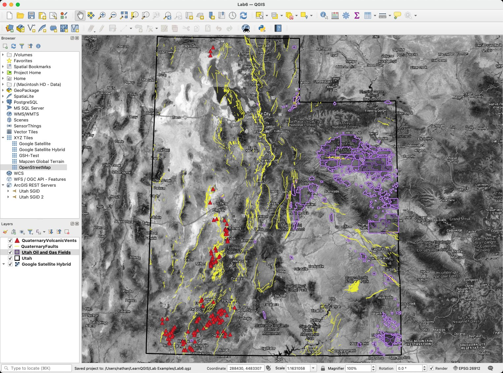

# Finding Spatial Data and Web Services

CCE 114 Geomatics
Dr. Dan Ames and Dr. James Halgren

<!-- Tuesday concept lecture. Today is about where spatial data comes from and how to pull it straight off a server into QGIS. Thursday in the Thursday hands-on session is the hands-on session where students connect QGIS to live services and build a layout. The map on the right was made entirely from web services: no downloads, no unzipping. -->

---

# Today's Goals

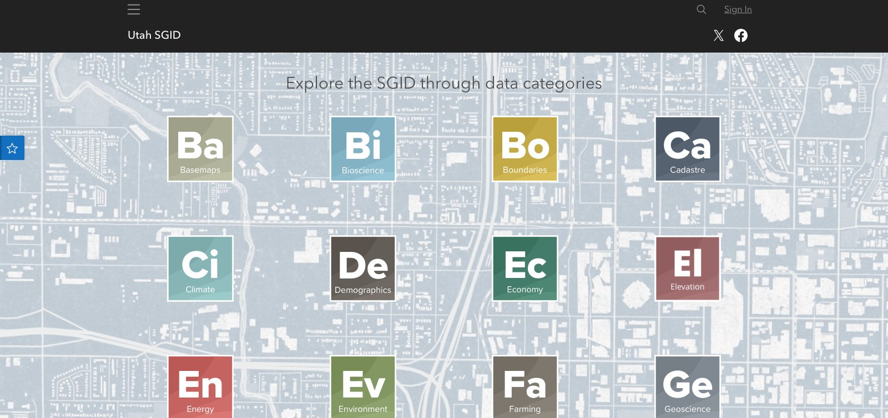

- By the end of class you should be able to:
  - Name the main **public repositories** for spatial data, national and state
  - Search for data effectively, and judge whether what you found is usable
  - Explain what the **UGRC** and the **SGID** are, and find a dataset in them
  - Tell **WMS, WMTS, WFS, WCS, XYZ** and **ArcGIS REST** apart, and say what each returns
  - Connect **QGIS** to a live web service instead of downloading a file
- Thursday, in the hands-on session, you connect QGIS to these services and build a layout

<!-- Set expectations. Reading for this week is GIS Fundamentals Chapter 7, Digital Data, which surveys the major public data sources. Everything on this slide shows up again in Lab 6. -->

---

<!-- _class: quiz -->

# What is the value of today's lecture?


<ol type="A">
<li>$100</li>
<li>$10,000</li>
<li>$1,000,000</li>
<li>$1,000,000,000</li>
<li>More</li>
</ol>

<!-- Original hook from the older version of this lecture. The point: the datasets you will learn to find today were collected with public money at enormous cost, and they are free to you. A single statewide lidar collection runs into the millions of dollars. Knowing where the data lives, and how to pull it in without downloading it, is one of the most immediately employable things in this course. -->

---

<!-- _class: lead -->

# Is there any data out there?

<!-- The framing question for the first half. Before you collect anything yourself, with a total station, a GPS unit, or a drone, ask whether someone has already collected it and published it. For most of the United States, someone has. -->

---

# Yes. Rather a lot of it.

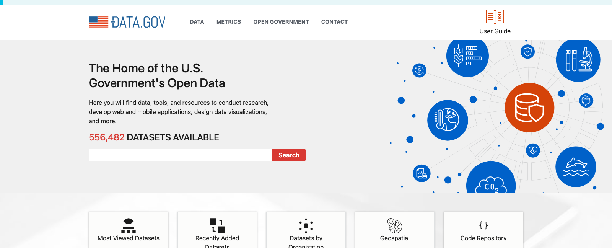

[data.gov](https://data.gov/) — the U.S. government's open data catalog: **over 550,000 datasets**, with a **Geospatial** category

<!-- data.gov is the front door to federal open data. It is a catalog, not a warehouse: it indexes datasets that live on agency servers and links out to them. Good for discovery, sometimes frustrating for download, because you land on whatever the agency built. -->

---

# Who actually makes spatial data?

<div class="columns">
<div>

- **Federal agencies** — USGS, NOAA, FEMA, Census, USDA, EPA
- **State agencies** — in Utah, **UGRC**, UDOT, DWR, UGS
- **Counties and cities** — parcels, zoning, utilities, addresses
- **Universities and research groups**
- **Private companies** — imagery, road networks, LiDAR
- **Crowdsourced** — OpenStreetMap

</div>
<div>

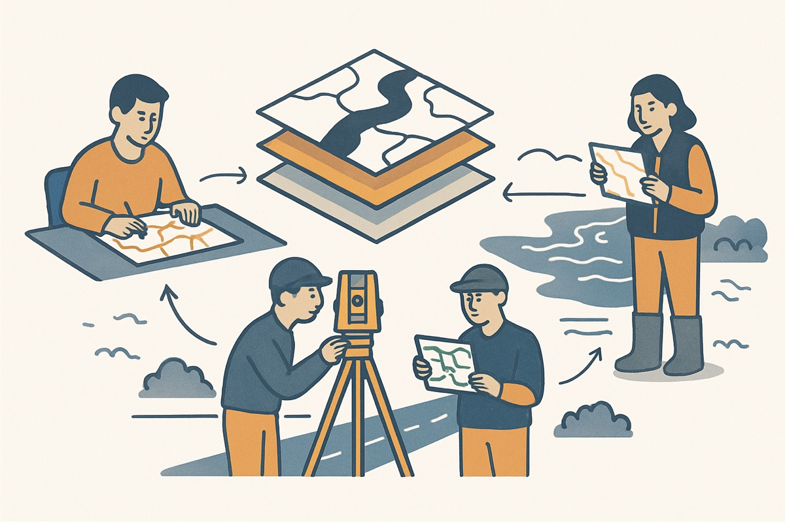

- The rule of thumb: **data is created by whoever needs it for their own job**
- Parcels come from the county assessor because taxes depend on them
- Ask *who would care about this?* and then go to that organization's site

</div>
</div>

<!-- Second example, if it helps: streamflow comes from USGS because someone has to run the gages. The single most useful search heuristic in this lecture: don't search for the data, search for the agency whose job depends on that data. If you want culverts, you want a DOT. If you want soils, you want USDA. If you want a floodplain, you want FEMA. -->

---

<!-- _class: lead -->

# National sources

---

# The National Map (USGS)

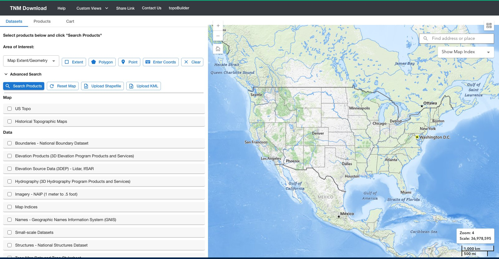

<p style="text-align:center;font-size:0.75em;margin-top:0.2em;"><a href="https://apps.nationalmap.gov/downloader/" target="_blank">apps.nationalmap.gov/downloader</a></p>

<!-- The National Map Downloader is the USGS one-stop shop: elevation (3DEP), hydrography (NHD), boundaries, structures, transportation, imagery, and topo maps. Draw a box or pick a state, tick the products you want, search, and it gives you download links. Note for the instructor: the old viewer.nationalmap.gov links from the 2017 and 2021 versions of this deck are dead; this is the current address. -->

---

# USGS EarthExplorer: imagery and remote sensing

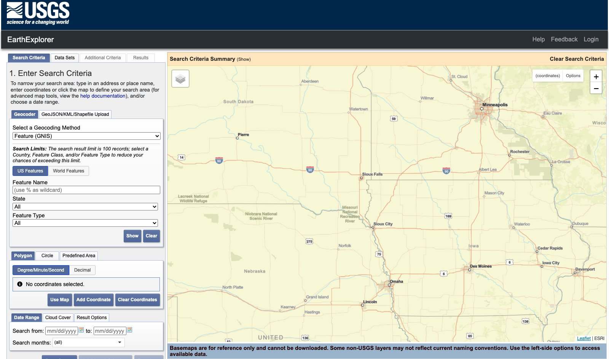

<p style="text-align:center;font-size:0.75em;margin-top:0.2em;"><a href="https://earthexplorer.usgs.gov/" target="_blank">earthexplorer.usgs.gov</a></p>

<!-- EarthExplorer is where you go for satellite and aerial imagery: Landsat back to 1972, Sentinel, aerial photography, declassified spy imagery. You define an area, a date range, and a cloud-cover limit, then download scenes. It requires a free account. Worth mentioning that the time dimension is the interesting part: this is how you show a reservoir shrinking or a city sprawling. -->

---

# Other federal sources worth knowing

<div class="columns">
<div>

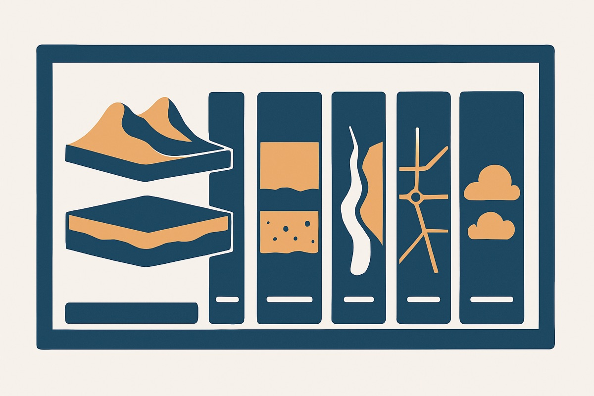

- **USGS GIS data** — [usgs.gov](https://www.usgs.gov/products/data-and-tools/gis-data)
- **USDA Web Soil Survey** — soils, anywhere in the U.S.
  [websoilsurvey.nrcs.usda.gov](https://websoilsurvey.nrcs.usda.gov/app/)
- **FEMA Flood Map Service Center** — floodplains, FIRMs
  [msc.fema.gov](https://msc.fema.gov/portal/home)

</div>
<div>

- **Census TIGER/Line** — boundaries, roads, demographics
- **NOAA** — weather, climate, coastal, bathymetry
- **EPA** — permits, impaired waters, facilities
- **OpenStreetMap** — global, crowdsourced, free to use with attribution

</div>
</div>

<!-- Do not try to memorise this list; recognize the names so you know one exists when you need it. For an engineering project in the U.S. you can usually assemble elevation, hydrography, soils, floodplain, and parcels from these five sources in an afternoon, at no cost. -->

---

# What are useful search terms for finding spatial data?

<div class="columns">
<div>

- Name of the **region of interest**
- "Department of transportation"
- "Water resources"
- "GIS data"
- "Shapefile" &nbsp;·&nbsp; "Raster data"
- "Download spatial data"
- "Repository" &nbsp;·&nbsp; "Portal" &nbsp;·&nbsp; "Open data"
- "Free data"

</div>
<div>

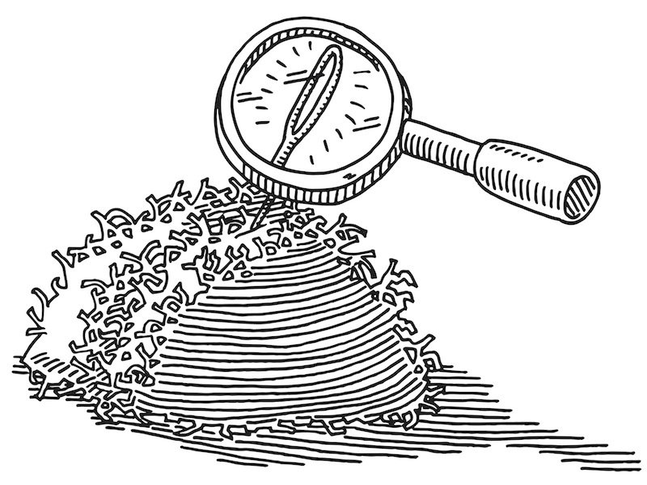

<div style="border:2px solid #c1272d;border-radius:8px;padding:0.4em 0.8em;text-align:center;">
<code>site:.gov</code> &nbsp;&nbsp; <code>site:.us</code><br>
<strong style="color:#c1272d;">VERY USEFUL!</strong>
</div>

</div>
</div>

<!-- The site: operator is the trick worth remembering: "utah county parcels site:.gov" cuts out every data-reseller site trying to sell you public data. Also try adding a format word: adding "shapefile" or "geojson" to a search often surfaces the download page instead of a web map. -->

---

<!-- _class: activity -->

# Data Source Scavenger Hunt

<div class="columns">
<div>

- Get into groups of **two or three**
- Pick a **state or country** someone in your group has a connection to
- In **five minutes**, find:
  1. That place's **statewide GIS portal**
  2. A **transportation** dataset (roads, rail, or trails)
  3. A **water** dataset (streams, lakes, or wells)

</div>
<div>


- For each, note:
  - The **direct download or service URL**
  - The **format** (shapefile, GeoPackage, GeoTIFF, feature service)
  - Whether it is **free** and what **license** it carries
- Be ready to report one thing that surprised you

</div>
</div>

<!-- Five minutes of searching, then five minutes of reporting out. The original version of this activity used a shared Google Doc; the link in the old deck is dead, so either collect answers verbally or set up a fresh shared sheet before class. Ask groups whether the data was easy to find, what format it came in, and whether they hit a login wall or a paywall. -->
<!-- TODO: if you want the shared-document version of this activity back, create a new class Google Doc and drop the link into this slide. The old tiny.cc link no longer resolves. -->

---

<!-- _class: lead -->

# Utah's data: the UGRC

---

# Utah Geospatial Resource Center

<div class="columns" style="grid-template-columns: 1.05fr 1fr;">
<div>

- **UGRC**, at [gis.utah.gov](https://gis.utah.gov/)
- The state's central GIS office: it collects, standardises, and publishes Utah's spatial data
- You may see it called the **AGRC** (Automated Geographic Reference Center) in older documents and lecture slides — **same organization, renamed**
- Nearly everything it publishes is **free and public**

</div>
<div>

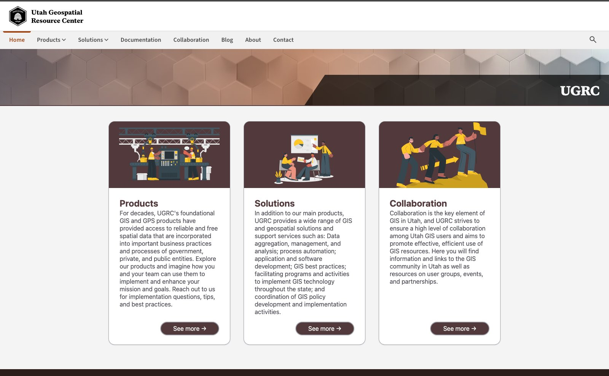

</div>
</div>

<!-- Say the name change out loud, because half the material online, including the older version of this very lecture, still says AGRC. UGRC is small, responsive, and genuinely helpful; their staff answer email. Many of you will end up using their data in senior design. -->

---

# The SGID: Utah's data, in one place

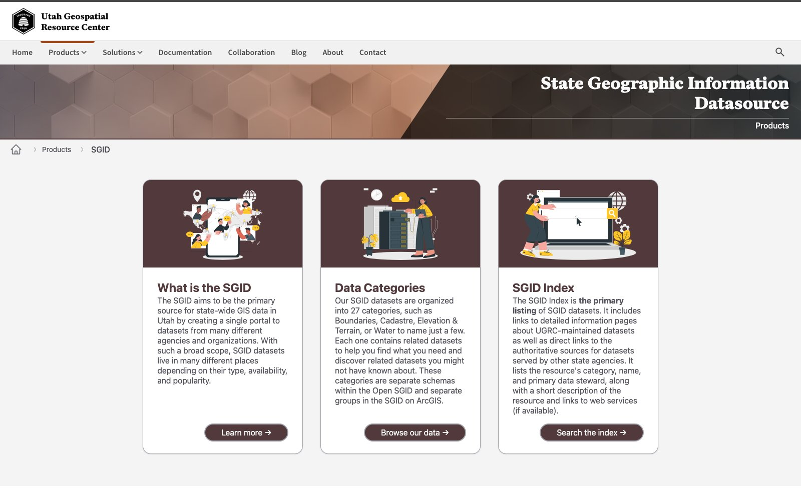

**State Geographic Information Datasource** — [gis.utah.gov/products/sgid](https://gis.utah.gov/products/sgid/)

<!-- The SGID is the catalog behind UGRC. Three doors on the homepage: What is the SGID, Data Categories (browse), and SGID Index (search). The open portion is public and needs no account. This is the site Lab 6 sends you to. -->

---

# Browse by category


27 categories: Boundaries, Cadastre, Elevation, Water, Transportation, Health, Energy…

<!-- The periodic-table layout is charming and genuinely useful for browsing when you don't yet know what you want. Click a category and you get every dataset in it, each with a description, a steward, a download link, and usually a web service link. -->

---

# Or search the index

<div class="columns" style="grid-template-columns: 1.1fr 1fr;">
<div>

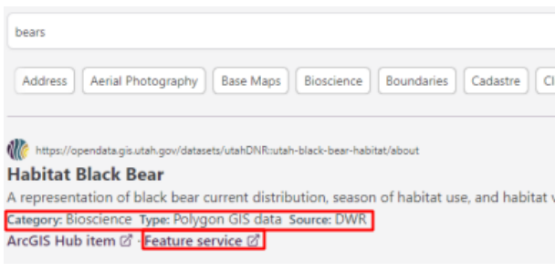

</div>
<div>

- The **SGID Index** searches a larger collection, including data stewarded by **DWR, UDOT, UGS** and others
- Each result gives you the **category**, the **data type**, the **source agency**, and a **feature service** link
- Try `bears`, `trails`, `faults`, `parcels`

</div>
</div>

<!-- Live-search something in class; "bears" is the example in Lab 6 and gets a laugh. Point out the metadata on each result: category, type, source. Knowing the source agency tells you how much to trust it, which is the whole point of the metadata week later in the course. -->

---

# Two ways to get any of it

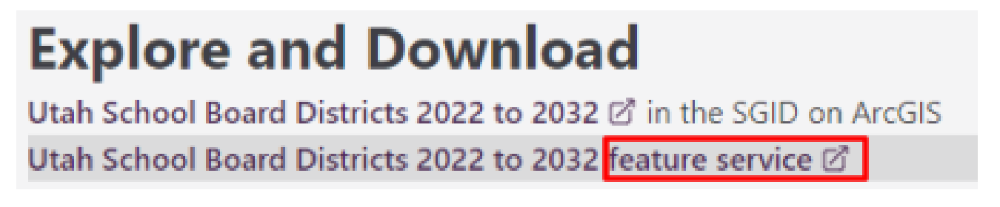

<div class="columns">
<div>

**Download**
- A file lands on your disk
- Yours forever, works offline
- Frozen the moment you downloaded it
- Big files, and you manage them

</div>
<div>

**Web service**
- QGIS reads it from the server, live
- Always current
- Nothing to unzip, nothing to store
- Needs a network, and the server must be up

</div>
</div>

<!-- Almost every SGID dataset offers both. The rest of this lecture is about the right-hand column, which is what Lab 6 asks you to use. Point out the "feature service" link in the screenshot: that is the URL QGIS wants. -->

---

<!-- _class: lead -->

# Web services

## Getting data without downloading it

---

# Three ways to put data in a map

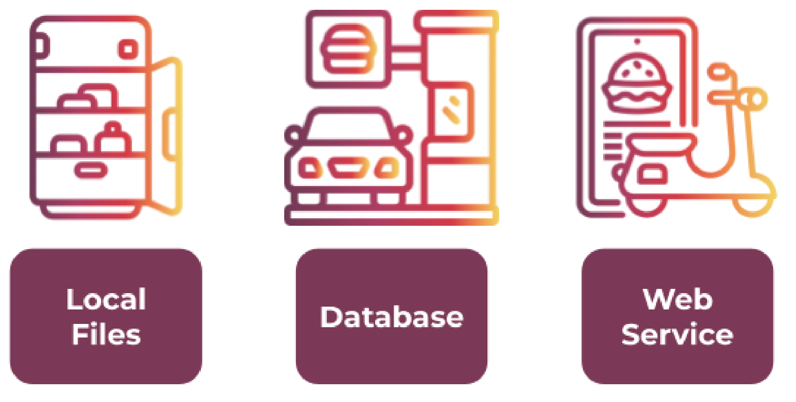

<div class="columns">
<div>

- A **local file** is the food already in your fridge
- A **database** is takeout you go and pick up

</div>
<div>

- A **web service** is delivery: someone else stores it, keeps it fresh, and brings you exactly the portion you asked for

</div>
</div>

<!-- This analogy is from Lab 6, so students will see it again. The engineering point behind the joke: with a web service you are not responsible for storage, updates, or backups, and you always get the current version. The cost is that you are dependent on someone else's server being up. -->

---

# Why bother? Because data moves.

<div class="columns" style="grid-template-columns: 1fr 1.15fr;">
<div>

- **Live data**: wildfire perimeters, streamflow, road closures, air quality
- **Big data**: statewide imagery you would never want on your laptop
- **Shared data**: everyone on the project sees the same layer, updated at the source
- **No version confusion**: no `roads_final_v3_REALLY_final.shp`

</div>
<div>

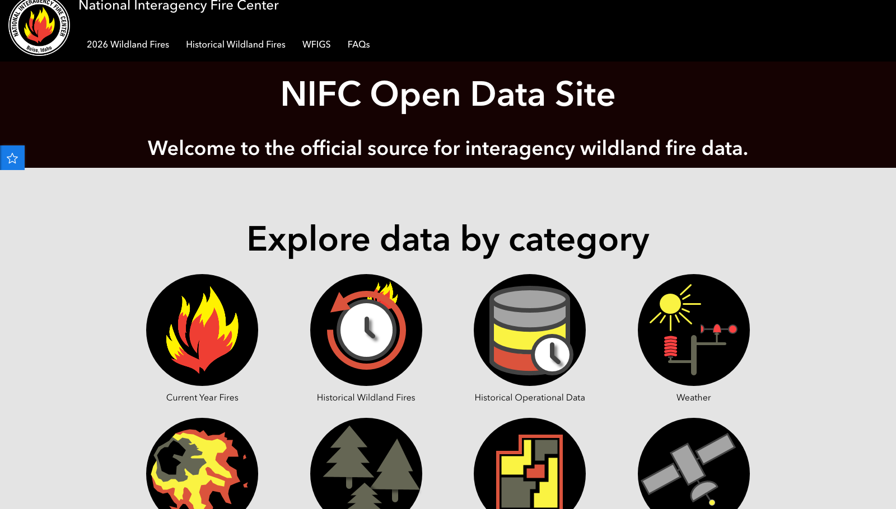

</div>
</div>

<!-- The National Interagency Fire Center publishes live fire perimeters as a public feature service that refreshes as often as every five minutes; it is the same feed behind the fire maps on the news. Nobody downloads and unzips a shapefile while the fire is still moving. https://data-nifc.opendata.arcgis.com/ -->

---

# The OGC standards

<div class="columns" style="grid-template-columns: 1fr 1.15fr;">
<div>


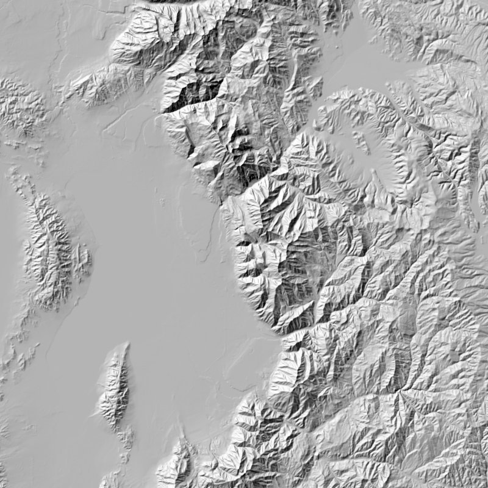

</div>
<div>

- The **Open Geospatial Consortium** publishes the standards that let any GIS talk to any server — like a standard USB connector
- **WMS** (Web Map Service): the server draws the map and sends back a **picture**
- **WMTS** (Web Map Tile Service): the same idea, but pre-drawn **tiles**, so it is much faster
- You see the map; you cannot query the underlying features

</div>
</div>

<!-- The hillshade on the left is a real WMS response: it came from the USGS 3DEP elevation service, and that is the Wasatch Front with Utah Lake on the left. The server rendered it and sent back a PNG. Nothing about the elevation values came with it, just the picture. -->

---

# WFS and WCS: the raw ingredients

<div class="columns" style="grid-template-columns: 1.35fr 1fr;">
<div>


- **Web Feature Service**: returns actual **vector features**, with their attributes
- Slower than a picture, but you can query, select, and **analyse** it
- Successor: **OGC API - Features**, rebuilt on plain URLs and GeoJSON


- **Web Coverage Service**: the raster equivalent — **cell values**, not a picture

</div>
<div>

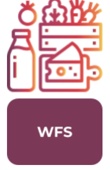

</div>
</div>

<!-- WFS is a Web Feature Service; WCS is a Web Coverage Service. Back to the food analogy: WMS is a cooked meal, WFS is raw ingredients. If you only need to look at it, take the picture, it is faster. If you need to run a buffer, a clip, or an attribute query, you need the features. This distinction is worth a quiz question. -->

---

# Outside the OGC standards

<div class="columns">
<div>


- **XYZ tiles**: a looser, wildly popular version of WMTS. A URL template with `{z}/{x}/{y}` in it. This is how Google, OpenStreetMap, and almost every basemap works


- **Vector Tile**: tiles, but containing features instead of pictures, so you can restyle them

</div>
<div>


- **ArcGIS REST Server**: Esri's own web service. Serves vector *or* raster
- A **feature service** on an Esri server is reached this way
- Not an open standard, but so widely deployed that QGIS supports it natively — and it is what **UGRC uses**

</div>
</div>

<!-- All six of these buttons live at the bottom of the QGIS Data Source Manager list. The takeaway is not the acronyms but the question they answer: am I getting a picture, or am I getting features? -->

---

<!-- _class: quiz -->

# You need to buffer a stream network by 100 m. Which service?

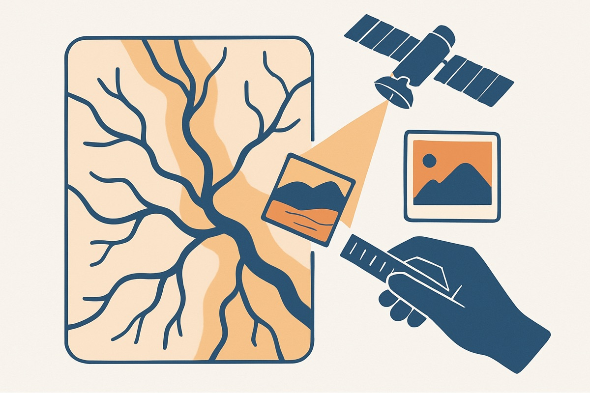

<div class="columns" style="grid-template-columns: 1fr 1fr;">
<div>

<ol type="A">
<li>WMS</li>
<li>WMTS</li>
<li>WFS or an ArcGIS feature service</li>
<li>XYZ tiles</li>
</ol>

</div>
<div>

- And a follow-up: you want a **satellite basemap** behind your map. Which one now?

</div>
</div>

<!-- Answer: C. A buffer is a geometry operation, so you need the geometry, which means features, not a rendered image. The follow-up answer is XYZ or WMTS: for a basemap you only need it to look right, and tiles are far faster. -->

---

# A web service is just a URL


<div style="font-size:0.72em;">

**A WMS request** — asks the server to draw a picture:

```
https://elevation.nationalmap.gov/arcgis/services/3DEPElevation/ImageServer/WMSServer
  ?SERVICE=WMS&REQUEST=GetMap&LAYERS=3DEPElevation
  &CRS=EPSG:3857&BBOX=-12470000,4860000,-12380000,4950000
  &WIDTH=800&HEIGHT=800&FORMAT=image/png
```

**An ArcGIS REST query** — asks the server for features:

```
https://services1.arcgis.com/99lidPhWCzftIe9K/ArcGIS/rest/services
  /QuaternaryFaults/FeatureServer/0/query?where=1=1&outFields=*&f=json
```

</div>

- Every service also answers **`?request=GetCapabilities`**: *what layers do you have?*

<!-- Paste one of these into a browser during class. The first returns the hillshade image from two slides ago; the second returns a wall of JSON with fault geometry and attributes. That is all QGIS is doing when you add a web layer: building URLs like these and drawing what comes back. GetCapabilities is what QGIS calls first when you hit Connect. -->

---

# What a REST services directory looks like

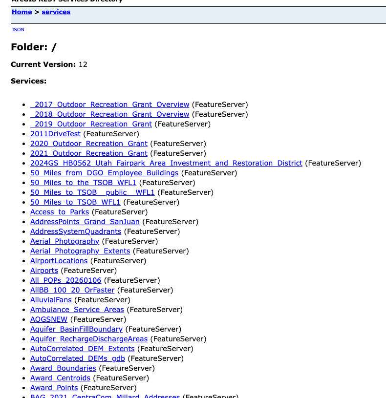

<p style="text-align:center;font-size:0.7em;margin-top:0;">services1.arcgis.com/99lidPhWCzftIe9K/ArcGIS/rest/services — <strong>891 services</strong></p>

<!-- This is UGRC's ArcGIS REST endpoint, opened in a browser. Every one of those links is a dataset you can add to QGIS. It is a directory, in the plain old web sense; you can click your way down it. This exact URL is the one Lab 6 asks you to paste into QGIS. -->

---

# And one service inside it

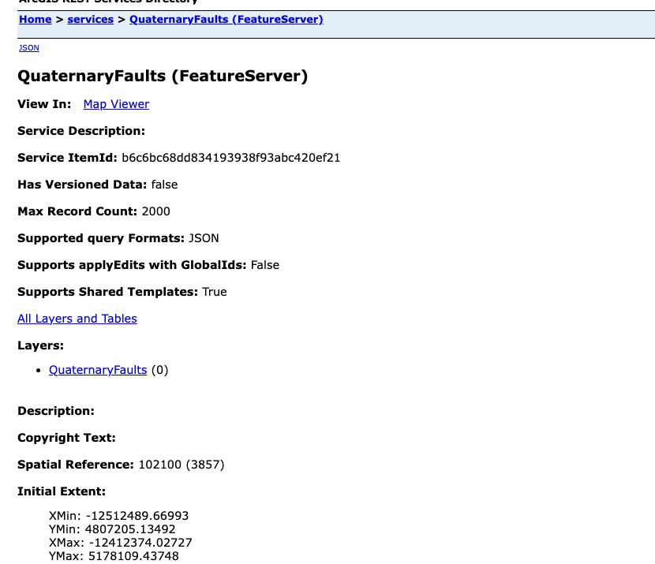

<!-- Drill into QuaternaryFaults and the server tells you everything QGIS needs: the geometry type, the spatial reference (102100 / EPSG:3857 Web Mercator), the extent, the layers, the max record count, and the supported operations. This page is metadata, which is exactly what we spend a whole week on later. -->

---

# Connecting QGIS to a service

<div class="columns" style="grid-template-columns: 1fr 1.1fr;">
<div>

1. **Data Source Manager** (the toolbar button, or `Ctrl`/`Cmd` + `L`)
2. Pick the service type in the left-hand list — for UGRC, **ArcGIS REST Server**
3. Click **New**, name the connection, paste the service URL
4. **OK**, then **Connect**
5. Expand the connection, find your layer, click **Add**

</div>
<div>

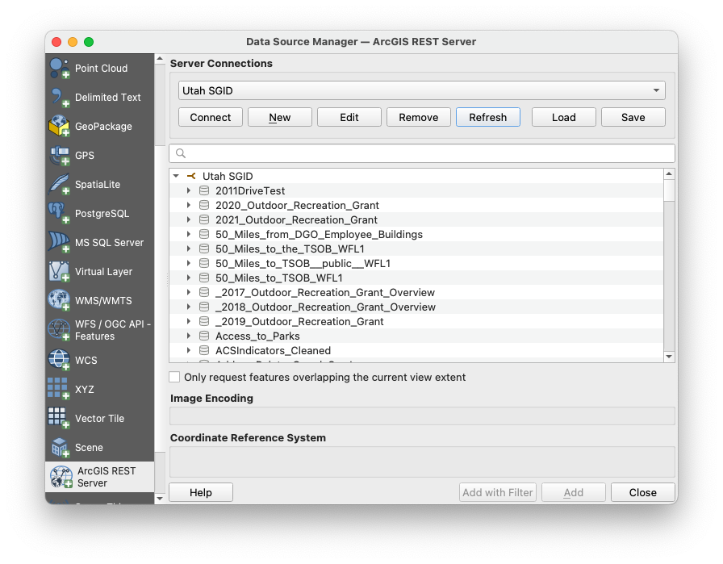

</div>
</div>

<!-- Walk through this on screen if the projector allows. Two things that trip students up every year: the Data Source Manager window likes to hide behind the main QGIS window, and the connection is saved in your QGIS profile, so you only set it up once. Lab 6 gives the exact UGRC URL and authentication settings. -->

---

# Finding your layer among 891 of them

<div class="columns" style="grid-template-columns: 1fr 1.2fr;">
<div>

- Use the **search box** in the Data Source Manager, not your eyes
- Layer names are the **database names**, not the friendly ones: `QuaternaryFaults`, not "Quaternary Faults"
- Not everything lives under one endpoint — UGRC has more than one server
- Nothing showing up? Check the connection URL first, then ask a TA

</div>
<div>

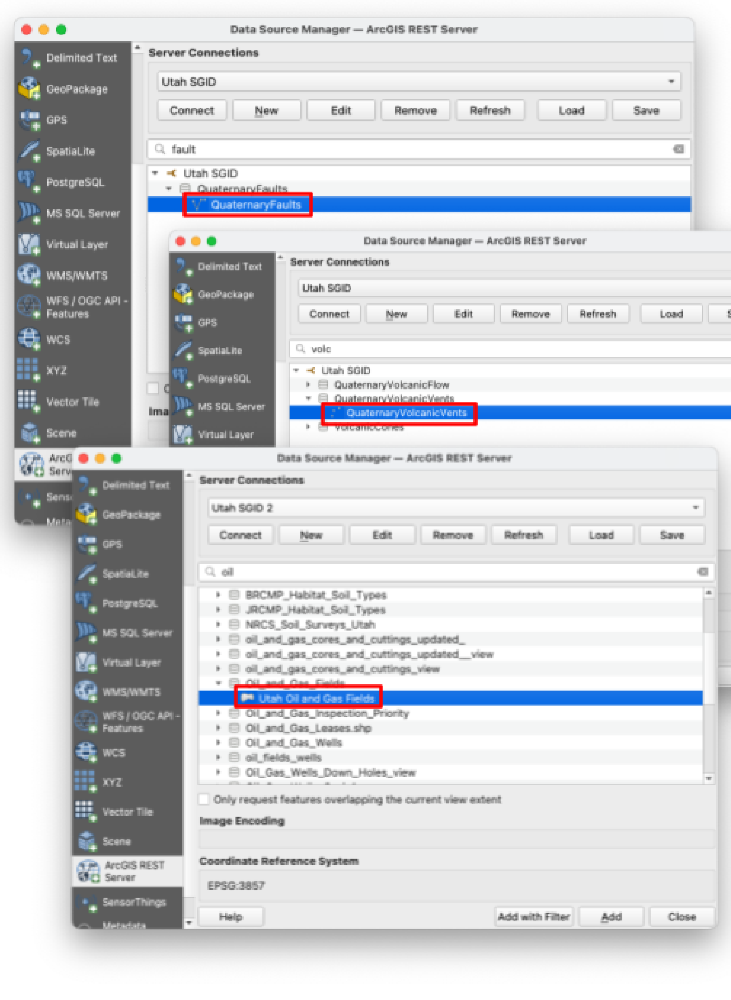

</div>
</div>

<!-- The searching is the real skill here. Tell students to search a fragment: "fault", "bound", "oil". If a dataset they found in the SGID Index does not appear, it is probably on a different UGRC endpoint; Lab 6 gives a second URL for exactly this case. -->

---

# They behave like any other layer


<!-- Once added, a web-service layer sits in the Layers panel like a shapefile: you style it, label it, open its attribute table, and run analysis on it. Here: red volcanic vent triangles, yellow Quaternary faults, and purple oil and gas fields over a satellite basemap. Not one of these was downloaded. -->

---

# From live layers to a finished map

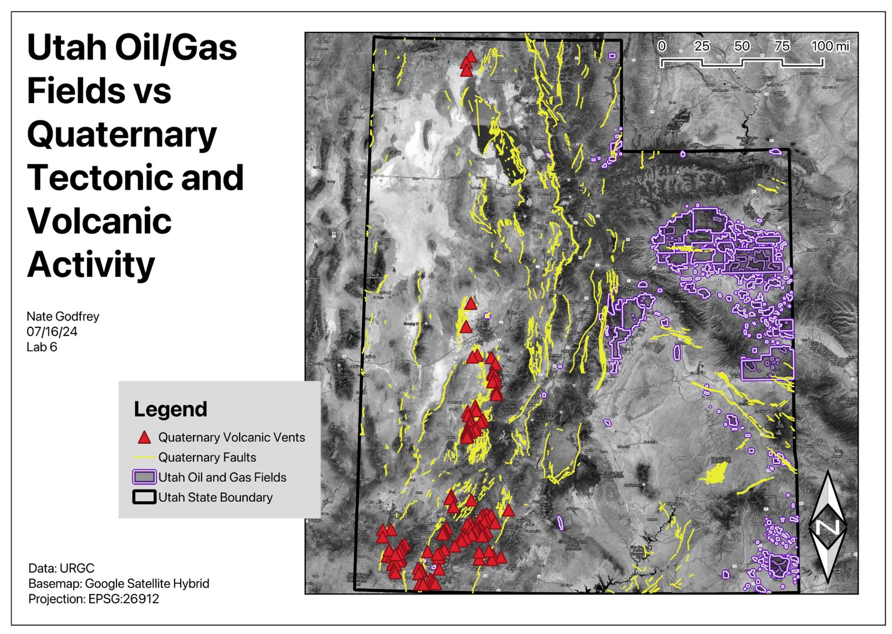

<!-- The Lab 6 example layout: three web-service datasets, a basemap, and every cartographic element you learned in Lab 2 — title, legend, scale bar, north arrow, and a data citation. Note the citation block at the bottom left: when you use someone else's service you credit them. -->

---

# Cautions when you build on someone else's server

<div class="columns">
<div>

- **The server can go down**, or be slow, or change its URL. Download a copy before a deadline or a field trip
- **You need a network.** Web layers are blank when you are offline
- **Projections**: services publish in a fixed CRS, often Web Mercator. QGIS reprojects on the fly, but check before you measure anything

</div>
<div>


- **A picture is not data.** You cannot analyse a WMS layer, only look at it
- **License and attribution**: public agency data is usually free to use with credit. Read the terms, and cite the source on your map

</div>
</div>

<!-- One more caution worth saying aloud: rendering can be slow with big vector services, so limit the extent. The professional point: a live service is a dependency. On a real project you decide deliberately which layers are live, because they change, and which are cached locally, because you cannot afford them to vanish the night before a submittal. -->

---

<!-- _class: activity -->

# Thursday: hands-on in QGIS


- Connect QGIS to the [**Utah ArcGIS REST services**](https://services1.arcgis.com/99lidPhWCzftIe9K/ArcGIS/rest/services/) — the same endpoint Lab 6 uses
- **In-class activity**: build a map using **three or more layers** from those services
- Style them, add the required map elements, and **upload a nice layout**
- Bring your laptop with **QGIS** installed, and a working network connection

<!-- Preview of Thursday. This is deliberately the same workflow as Lab 6, so Thursday's activity is a running start on the lab. Tell them to come with QGIS already open and updated. -->

---

# Before Next Class


- Read **Chapter 7, *Digital Data***, in *GIS Fundamentals* (Bolstad & Manson)
- Take the open-book quiz on **Learning Suite**
- **Concepts Exam 1** is this week in the **Testing Center** — check the closing time and do not leave it to the last hour
- **Lab 6: [Spatial Data Web Services](https://byu-hydroinformatics.github.io/cce114-geomatics/assignments/lab-06/)** is due **Saturday**
- All assignments: the [Assignments page](https://byu-hydroinformatics.github.io/cce114-geomatics/assignments/)
- Questions? Office hours: [calendly.com/dan-ames/office-hours](https://calendly.com/dan-ames/office-hours)

<!-- Confirm the Testing Center closing time and the quiz due date before class. Lab 6 builds directly on Thursday's activity, so students who do Thursday's map well are most of the way through the lab. -->

<!-- Conversion notes (2026-09-02): sources were "Finding Spatial Data and Web Services.pptx" (2021, 5 slides) and "10 - Finding Spatial Data Part 2 - National Sources.pptx" (2017, 7 slides); the two overlap almost completely, and between them contained only a title slide, a meme, a national-sources link list, a scavenger-hunt activity, a search-terms slide, and the "value of today's lecture" hook. Everything about UGRC/SGID and web services is new material for this deck, built from the Lab 6 assignment, from live captures of the current sites, and from the topic list for Day 12.
Dropped: both title slides (replaced); the "Is there any data out there?" minion meme (image1.png in both sources) — the meme art carries a Pink Floyd lyric, so the slide is kept as a section-break question with no image; the duplicate second scavenger-hunt slide in the 2017 deck (merged into one activity slide).
Stale URLs found and fixed: viewer.nationalmap.gov/basic and /advanced-viewer are dead (DNS failure) and were replaced with apps.nationalmap.gov/downloader, verified live; websoilsurvey.sc.egov.usda.gov still resolves but was updated to the current websoilsurvey.nrcs.usda.gov/app; the scavenger-hunt Google Doc links (tiny.cc/214minidevo and goo.gl/MkPk1a) both 404, so the activity was rewritten to work without a shared document — see the TODO on that slide if you want the shared-doc version back.
ArcGIS screenshots: none of the QGIS screenshots need re-shooting; images/web-qgis-*.png and web-qgis-styled-layers.jpg are genuine QGIS 3.x captures reused from Lab 6. The ArcGIS-branded images that remain are web-rest-directory.png and web-rest-featureserver.png (Esri's REST services directory as served by UGRC, viewed in a browser, not the ArcGIS desktop application) and the "ArcGIS REST Server" button chip from the QGIS Data Source Manager — all three are correct as they stand, because UGRC really does serve its data from Esri infrastructure.
Live captures taken 2026-09-02 (headless Chrome): gis.utah.gov, gis.utah.gov/products/sgid, opendata.gis.utah.gov, data.gov, apps.nationalmap.gov/downloader, earthexplorer.usgs.gov, data-nifc.opendata.arcgis.com, and the UGRC REST directory. The data.gov dataset count (556,482 on the day of capture) and the UGRC service count (891, counted from the REST endpoint) will drift; re-check before quoting them.
The WMS hillshade on the "OGC standards" slide is a real GetMap response from the USGS 3DEP elevation service for the Wasatch Front, fetched with the URL shown on the "A web service is just a URL" slide. -->
