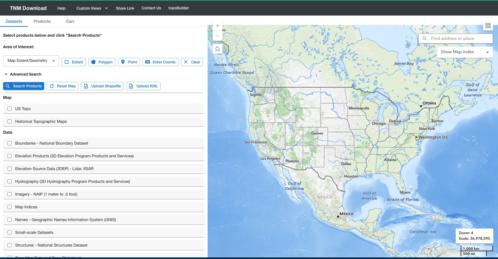
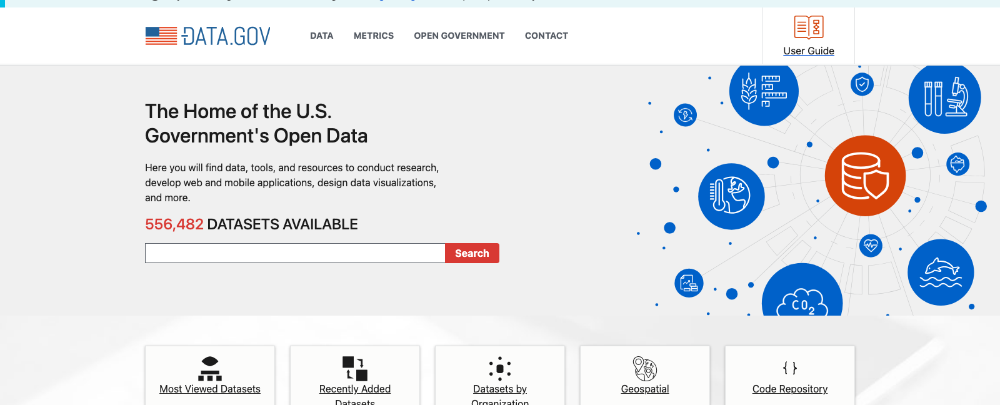
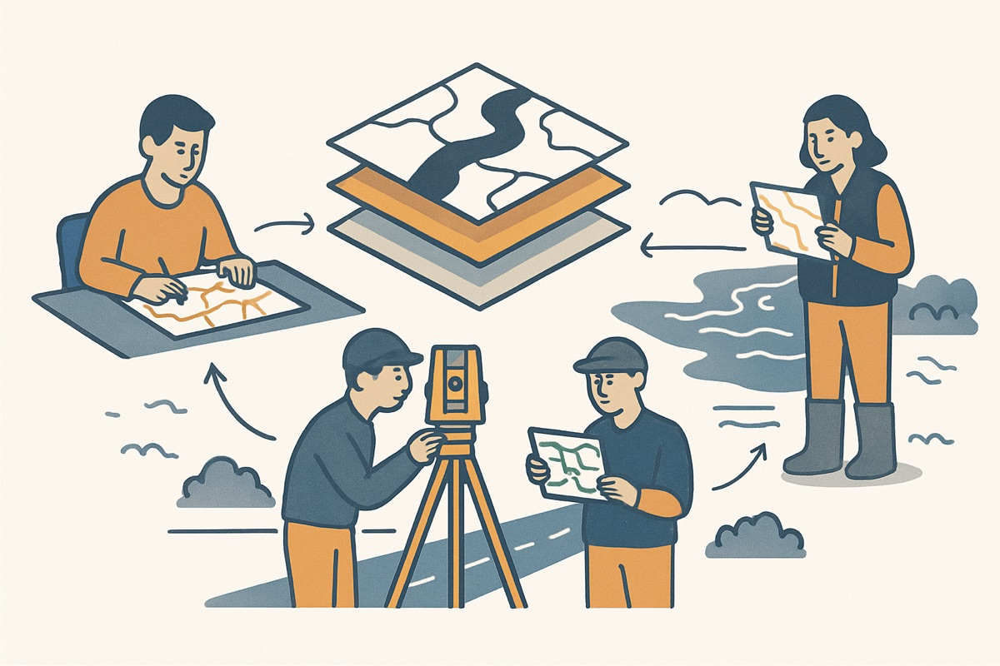
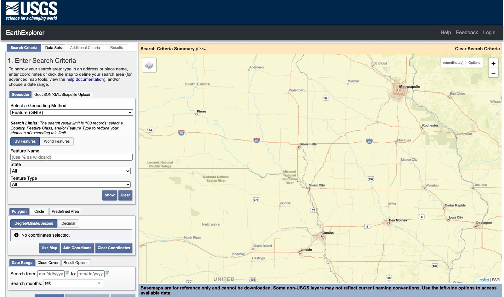
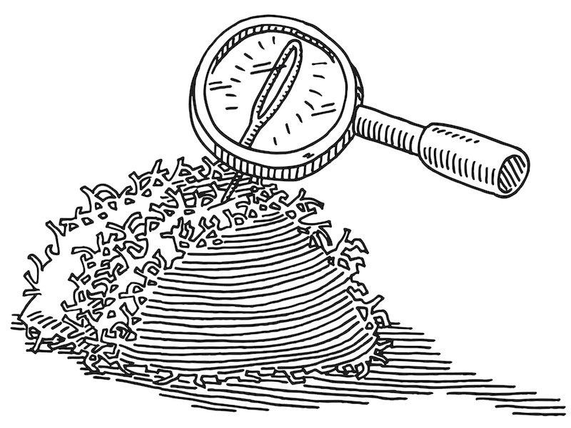
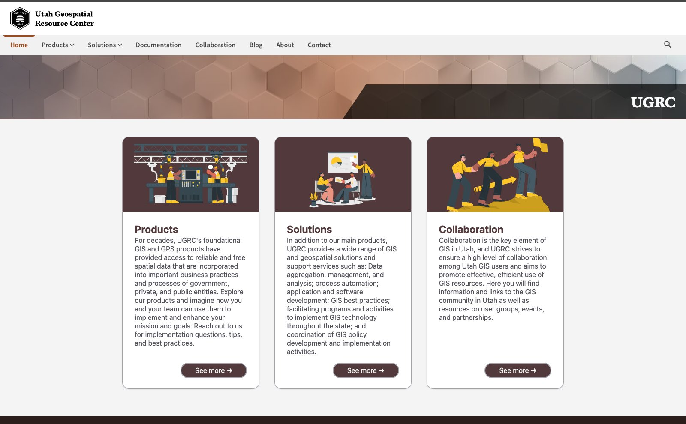
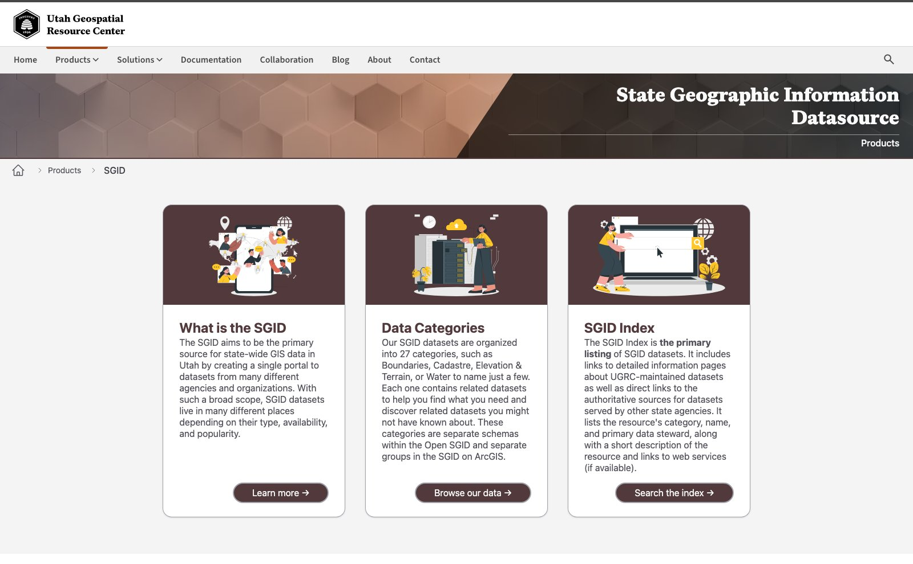
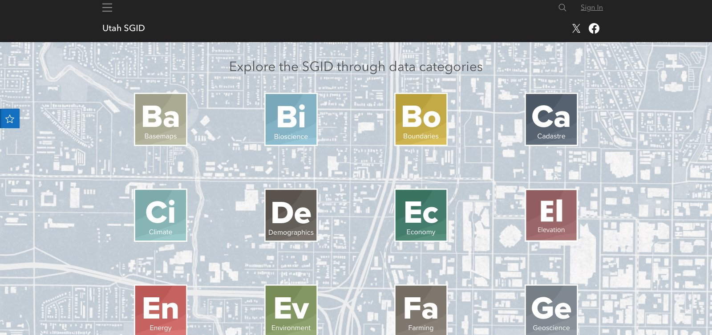
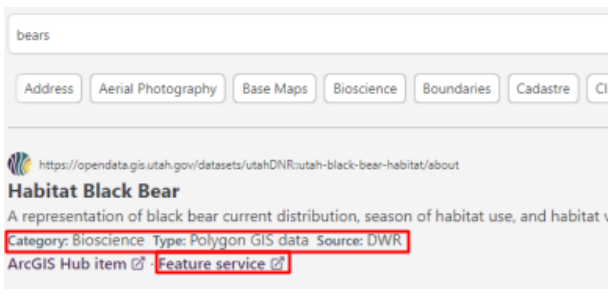

<!-- _class: lead -->
<!-- _paginate: skip -->

# Finding Spatial Data

## Who already has it, and how to find it

CCE 114 Geomatics
Brigham Young University
Civil & Construction Engineering

Dr. Dan Ames and Dr. James Halgren

<!-- Tuesday concept lecture. Today is about where spatial data comes from and how to find it: the national sources, Utah's UGRC and SGID, and how to search well. Thursday is a second, shorter lecture on web services, the way to pull that data straight off a server into QGIS without downloading it, followed by a short follow-along in QGIS that students upload as the in-class activity. -->

---

# This Week's Goals

Today, Thursday, and Lab 6 all build toward these. By the end of the week you should be able to:

- **Name** the main public repositories for spatial data, national and state
- **Search** for data well, starting with *who needs it for their own job?*
- **Explain** what the **UGRC** and the **SGID** are, and find a dataset in them
- **Tell apart** WMS, WMTS, WFS, WCS, XYZ and ArcGIS REST, and say what each sends back *(Thursday)*
- **Connect** QGIS to a live web service instead of downloading a file *(Thursday and Lab 6)*

<!-- Set expectations. The first three are today; the last two are Thursday's lecture, and Lab 6 is where students actually connect QGIS to a service. Reading for this week is GIS Fundamentals Chapter 7, Digital Data, which surveys the major public data sources. Concepts Exam 1 is open in the Testing Center Monday through Wednesday, so some students will be tired; keep the pace easy. -->

---

<!-- _class: quiz -->

# What is the value of today's lecture?

<ol type="A">
<li>$100</li>
<li>$10,000</li>
<li>$1,000,000</li>
<li>$1,000,000,000</li>
<li>More</li>
</ol>

<!-- Original hook from the older version of this lecture. The point: the datasets you will learn to find today were collected with public money at enormous cost, and they are free to you. A single statewide lidar collection runs into the millions of dollars. Knowing where the data lives, and how to pull it in without downloading it, is one of the most immediately employable things in this course. -->

---

<!-- _class: lead -->

# Is there any data out there?

<!-- The framing question for the first half. Before you collect anything yourself, with a total station, a GPS unit, or a drone, ask whether someone has already collected it and published it. For most of the United States, someone has. -->

---

# Yes. Rather a lot of it.

[data.gov](https://data.gov/) — the U.S. government's open data catalog: **over 550,000 datasets**, with a **Geospatial** category

<!-- data.gov is the front door to federal open data. It is a catalog, not a warehouse: it indexes datasets that live on agency servers and links out to them. Good for discovery, sometimes frustrating for download, because you land on whatever the agency built. -->

---

# Who actually makes spatial data?

- **Federal agencies** — USGS, NOAA, FEMA, Census, USDA, EPA
- **State agencies** — in Utah, **UGRC**, UDOT, DWR, UGS
- **Counties and cities** — parcels, zoning, utilities, addresses
- **Universities and research groups**
- **Private companies** — imagery, road networks, LiDAR
- **Crowdsourced** — OpenStreetMap

- The rule of thumb: **data is created by whoever needs it for their own job**
- Parcels come from the county assessor because taxes depend on them
- Ask *who would care about this?* and then go to that organization's site

<!-- Second example, if it helps: streamflow comes from USGS because someone has to run the gages. The single most useful search heuristic in this lecture: don't search for the data, search for the agency whose job depends on that data. If you want culverts, you want a DOT. If you want soils, you want USDA. If you want a floodplain, you want FEMA. -->

---

<!-- _class: lead -->

# National sources

---

# The National Map (USGS)

<a href="https://apps.nationalmap.gov/downloader/" target="_blank">apps.nationalmap.gov/downloader</a>

<!-- The National Map Downloader is the USGS one-stop shop: elevation (3DEP), hydrography (NHD), boundaries, structures, transportation, imagery, and topo maps. Draw a box or pick a state, tick the products you want, search, and it gives you download links. Note for the instructor: the old viewer.nationalmap.gov links from the 2017 and 2021 versions of this deck are dead; this is the current address. -->

---

# USGS EarthExplorer: imagery and remote sensing

<a href="https://earthexplorer.usgs.gov/" target="_blank">earthexplorer.usgs.gov</a>

<!-- EarthExplorer is where you go for satellite and aerial imagery: Landsat back to 1972, Sentinel, aerial photography, declassified spy imagery. You define an area, a date range, and a cloud-cover limit, then download scenes. It requires a free account. Worth mentioning that the time dimension is the interesting part: this is how you show a reservoir shrinking or a city sprawling. -->

---

# Other federal sources worth knowing

- **USGS GIS data** — [usgs.gov](https://www.usgs.gov/products/data-and-tools/gis-data)
- **USDA Web Soil Survey** — soils, anywhere in the U.S.
  [websoilsurvey.nrcs.usda.gov](https://websoilsurvey.nrcs.usda.gov/app/)
- **FEMA Flood Map Service Center** — floodplains, FIRMs
  [msc.fema.gov](https://msc.fema.gov/portal/home)

- **Census TIGER/Line** — boundaries, roads, demographics
- **NOAA** — weather, climate, coastal, bathymetry
- **EPA** — permits, impaired waters, facilities
- **OpenStreetMap** — global, crowdsourced, free to use with attribution

<!-- Do not try to memorize this list; recognize the names so you know one exists when you need it. For an engineering project in the U.S. you can usually assemble elevation, hydrography, soils, floodplain, and parcels from these five sources in an afternoon, at no cost. -->

---

# What are useful search terms for finding spatial data?

- Name of the **region of interest**
- "Department of transportation"
- "Water resources"
- "GIS data"
- "Shapefile" &nbsp;·&nbsp; "Raster data"
- "Download spatial data"
- "Repository" &nbsp;·&nbsp; "Portal" &nbsp;·&nbsp; "Open data"
- "Free data"

<code>site:.gov</code> &nbsp;&nbsp; <code>site:.us</code> 
<strong style="color:#c1272d;">VERY USEFUL!</strong>

<!-- The site: operator is the trick worth remembering: "utah county parcels site:.gov" cuts out every data-reseller site trying to sell you public data. Also try adding a format word: adding "shapefile" or "geojson" to a search often surfaces the download page instead of a web map. -->

---

<!-- _class: activity -->

# Data Source Scavenger Hunt

- Get into groups of **two or three**
- Pick a **U.S. state** someone in your group has a connection to
- In **five minutes**, find that state's **statewide GIS portal**
- On the class sheet, enter your **names**, the **state**, and the portal's **URL**
- Then tick off every dataset you can find there: boundaries, counties, cities, highways, rivers, lakes, elevation…

Class sheet: <a href="https://docs.google.com/spreadsheets/d/10iZbtJUzaYkuCjv5yFtgScF_5OhBdTR1zj0nerKwEVg/edit#gid=343004808" target="_blank">CCE 114 Geomatics Master Spreadsheet</a>, tab <strong>Data Source Scavenger Hunt</strong>

- While you look, notice:
  - The **format** each one comes in (shapefile, GeoPackage, GeoTIFF, feature service)
  - Whether it is **free**, and what **license** it carries
- Be ready to report **one thing that surprised you**

<!-- Five minutes of searching, then five minutes of reporting out. The sheet is the "Data Source Scavenger Hunt" tab of the CCE 114 Geomatics Master Spreadsheet, the same workbook as the devotional sign-up, with one row per group: Name, U.S. State Name, Repository URL, then a column per dataset type to tick. Clear last semester's rows before class. Ask groups whether the data was easy to find, what format it came in, and whether they hit a login wall or a paywall. Not graded. -->

---

<!-- _class: lead -->

# Utah's data: the UGRC

---

# Utah Geospatial Resource Center

- **UGRC**, at [gis.utah.gov](https://gis.utah.gov/)
- The state's central GIS office: it collects, standardizes, and publishes Utah's spatial data
- You may see it called the **AGRC** (Automated Geographic Reference Center) in older documents and lecture slides — **same organization, renamed**
- Nearly everything it publishes is **free and public**

<!-- Say the name change out loud, because half the material online, including the older version of this very lecture, still says AGRC. UGRC is small, responsive, and genuinely helpful; their staff answer email. Many of you will end up using their data in senior design. -->

---

# The SGID: Utah's data, in one place

**State Geographic Information Datasource** — [gis.utah.gov/products/sgid](https://gis.utah.gov/products/sgid/)

<!-- The SGID is the catalog behind UGRC. Three doors on the homepage: What is the SGID, Data Categories (browse), and SGID Index (search). The open portion is public and needs no account. This is the site Lab 6 sends you to. -->

---

# Browse by category

27 categories: Boundaries, Cadastre, Elevation, Water, Transportation, Health, Energy…

<!-- The periodic-table layout is charming and genuinely useful for browsing when you don't yet know what you want. Click a category and you get every dataset in it, each with a description, a steward, a download link, and usually a web service link. -->

---

# Or search the index

- The **SGID Index** searches a larger collection, including data stewarded by **DWR, UDOT, UGS** and others
- Each result gives you the **category**, the **data type**, the **source agency**, and a **feature service** link
- Try `bears`, `trails`, `faults`, `parcels`

<!-- Live-search something in class; "bears" is the example in Lab 6 and gets a laugh. Point out the metadata on each result: category, type, source. Knowing the source agency tells you how much to trust it, which is the whole point of the metadata week later in the course. -->

---

# Two ways to get any of it

**Download**
- A file lands on your disk
- Yours forever, works offline
- Frozen the moment you downloaded it
- Big files, and you manage them

**Web service**
- QGIS reads it from the server, live
- Always current
- Nothing to unzip, nothing to store
- Needs a network, and the server must be up

<!-- Almost every SGID dataset offers both. Thursday's lecture is about the right-hand column, which is what Lab 6 asks you to use. Point out the "feature service" link in the SGID Index screenshot two slides back: that is the URL QGIS wants. -->

---

# Thursday: web services

- A **short lecture**, then a **follow-along in QGIS**: bring your laptop
- The right-hand column from today: **getting data without downloading it**
- **WMS, WMTS, WFS, WCS, XYZ, ArcGIS REST**: which ones send you a *picture*, and which send the *features*
- You will connect QGIS to UGRC's services, add three live layers, and upload a quick map: a running start on **Lab 6**

<!-- Preview of Thursday. Tell students to bring a laptop with QGIS 3.44: the in-class activity is a follow-along map built from three UGRC service layers, uploaded before they leave. The image is a real WMS response: the server drew that hillshade and sent back a picture. That distinction, picture against features, is the heart of Thursday. -->

---

# Before Next Class

- Read **Chapter 7, *Digital Data***, in *GIS Fundamentals* (Bolstad & Manson)
- **No reading quiz this week**
- **Concepts Exam 1** is in the **Testing Center** and closes **Wednesday**. Check the closing time and do not leave it to the last hour
- **Lab 6: [Spatial Data Web Services](https://byu-hydroinformatics.github.io/cce114-geomatics/assignments/lab-06/)** is due **Saturday**. Steps 1 and 2, exploring the SGID and choosing your three datasets, use only what we did today, so start now
- Questions? Office hours: [calendly.com/dan-ames/office-hours](https://calendly.com/dan-ames/office-hours)

<!-- Confirm the Testing Center closing time before class. Lab 6 Steps 1 and 2 are browsing the SGID, picking three datasets, writing a question, and filling in a table; nothing in them needs Thursday's lecture. Steps 3 onward connect QGIS to the services, which Thursday demonstrates. -->

<!-- Conversion notes (2026-09-02): sources were "Finding Spatial Data and Web Services.pptx" (2021, 5 slides) and "10 - Finding Spatial Data Part 2 - National Sources.pptx" (2017, 7 slides); the two overlap almost completely, and between them contained only a title slide, a meme, a national-sources link list, a scavenger-hunt activity, a search-terms slide, and the "value of today's lecture" hook. Everything about UGRC/SGID is new material for this deck, built from the Lab 6 assignment, from live captures of the current sites, and from the topic list for Day 12.
Dropped: both title slides (replaced); the "Is there any data out there?" minion meme (image1.png in both sources) — the meme art carries a Pink Floyd lyric, so the slide is kept as a section-break question with no image; the duplicate second scavenger-hunt slide in the 2017 deck (merged into one activity slide).
Stale URLs found and fixed: viewer.nationalmap.gov/basic and /advanced-viewer are dead (DNS failure) and were replaced with apps.nationalmap.gov/downloader, verified live; websoilsurvey.sc.egov.usda.gov still resolves but was updated to the current websoilsurvey.nrcs.usda.gov/app; the scavenger-hunt Google Doc links (tiny.cc/214minidevo and goo.gl/MkPk1a) both 404. On 2026-10-09 the activity was pointed at the "Data Source Scavenger Hunt" tab of the CCE 114 Geomatics Master Spreadsheet, which already existed with the right columns.
Split 2026-10-09: this deck used to run straight on into web services. That half is now its own Thursday lecture, slides/day-13/web-services.md, because Week 7's Thursday became a lecture with a short follow-along activity instead of a full hands-on session. Live captures taken 2026-09-02 (headless Chrome): gis.utah.gov, gis.utah.gov/products/sgid, opendata.gis.utah.gov, data.gov, apps.nationalmap.gov/downloader, earthexplorer.usgs.gov. The data.gov dataset count (556,482 on the day of capture) will drift; re-check before quoting it. -->

---

<!-- _class: activity -->

# Your Turn — Who Already Has This Data?

Eight questions on your phone:

- Where the **data** comes from
- The **national** front doors
- **Utah's** data

Not graded, and every answer explains itself.

byu-hydroinformatics.github.io/cce114-geomatics/quizzes/find-data/

<!-- Five minutes, in pairs, then a show of hands on the two worth arguing about: where you would go for culverts, and when you would rather download a file than connect to a service. If the room has no signal, put the URL on the board. The page is linked from the Week 7 page too. -->
