<!-- _class: lead -->
<!-- _paginate: skip -->

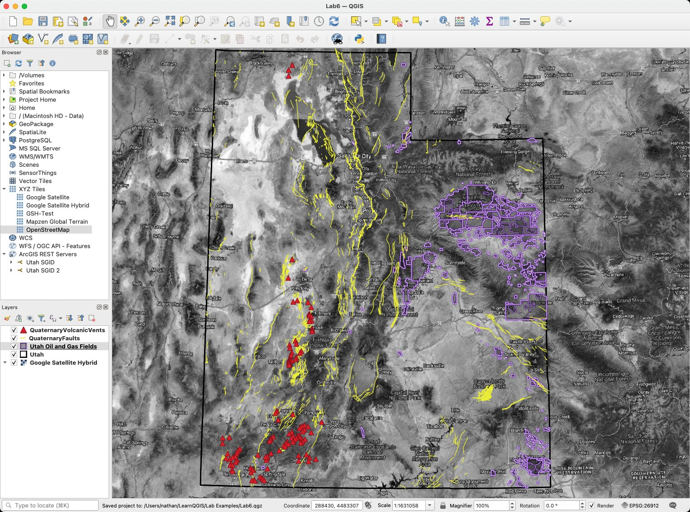


# Web Services

## Getting data without downloading it

CCE 114 Geomatics
Brigham Young University
Civil & Construction Engineering

Dr. Dan Ames and Dr. James Halgren

<!-- Thursday lecture. This week has no hands-on session: today is a short, light introduction to web services, and in particular the OGC standards, ending with a live demo of connecting QGIS to UGRC's services. Lab 6, due Saturday, is where students do that themselves. The map on the right was made entirely from web services: no downloads, no unzipping. Concepts Exam 1 closed yesterday, so expect a tired room. -->

---

# Today's Goals


By the end of class you should be able to:

- Say what a **web service** is, and when you would use one instead of a download
- Tell **WMS, WMTS, WFS, WCS, XYZ** and **ArcGIS REST** apart
- Answer the one question that matters for each: *do I get a **picture**, or the **features**?*
- Read a service **URL** and a **REST services directory**
- Connect **QGIS** to UGRC's services: everything **Lab 6** asks you to do

<!-- No laptops needed today. The last third of the hour is a live QGIS demo of the Lab 6 workflow, so students who watch closely will find Lab 6 Step 3 familiar. -->

---

# On Tuesday: two ways to get any of it

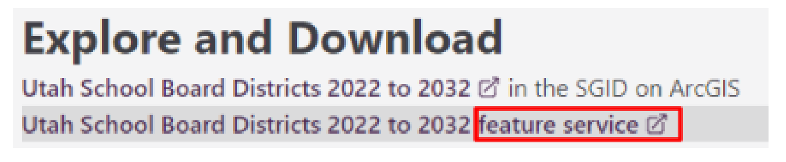

<div class="columns">
<div>

**Download**
- A file lands on your disk
- Yours forever, works offline
- Frozen the moment you downloaded it

</div>
<div>

**Web service** ← *today*
- QGIS reads it from the server, live
- Always current, nothing to store
- Needs a network, and the server must be up

</div>
</div>

<!-- A one-minute recap of Tuesday's last slide. Almost every SGID dataset offers both a download and a feature service link; today is entirely about the right-hand column. -->

---

# Three ways to put data in a map

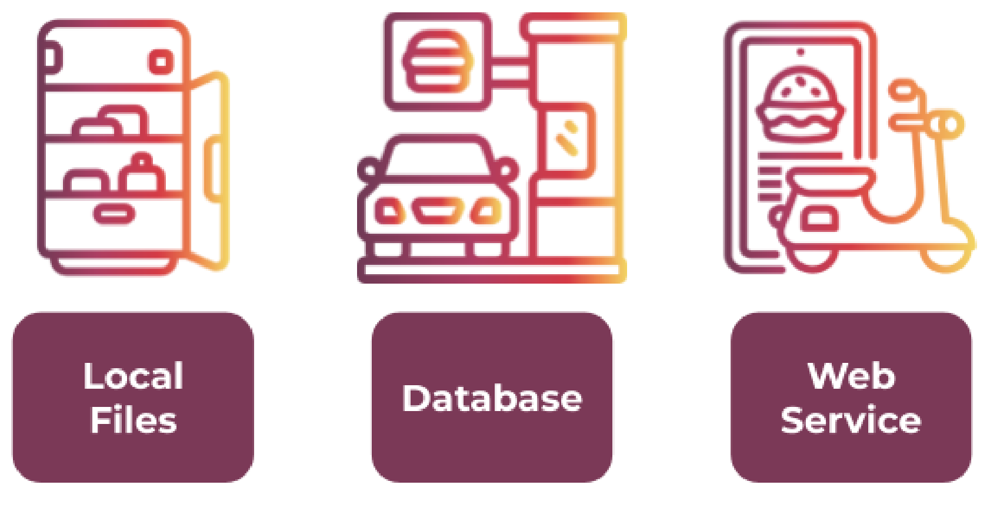

<div class="columns">
<div>

- A **local file** is the food already in your fridge
- A **database** is takeout you go and pick up

</div>
<div>

- A **web service** is delivery: someone else stores it, keeps it fresh, and brings you exactly the portion you asked for

</div>
</div>

<!-- This analogy is from Lab 6, so students will see it again. The engineering point behind the joke: with a web service you are not responsible for storage, updates, or backups, and you always get the current version. The cost is that you are dependent on someone else's server being up. -->

---

# Why bother? Because data moves.

<div class="columns" style="grid-template-columns: 1fr 1.15fr;">
<div>

- **Live data**: wildfire perimeters, streamflow, road closures, air quality
- **Big data**: statewide imagery you would never want on your laptop
- **Shared data**: everyone on the project sees the same layer, updated at the source
- **No version confusion**: no `roads_final_v3_REALLY_final.shp`

</div>
<div>

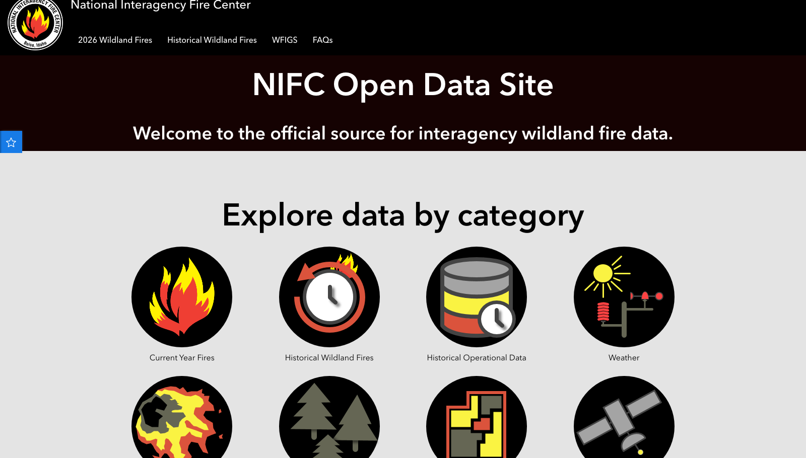

</div>
</div>

<!-- The National Interagency Fire Center publishes live fire perimeters as a public feature service that refreshes as often as every five minutes; it is the same feed behind the fire maps on the news. Nobody downloads and unzips a shapefile while the fire is still moving. https://data-nifc.opendata.arcgis.com/ -->

---

# The OGC standards

<div class="columns" style="grid-template-columns: 1fr 1.15fr;">
<div>


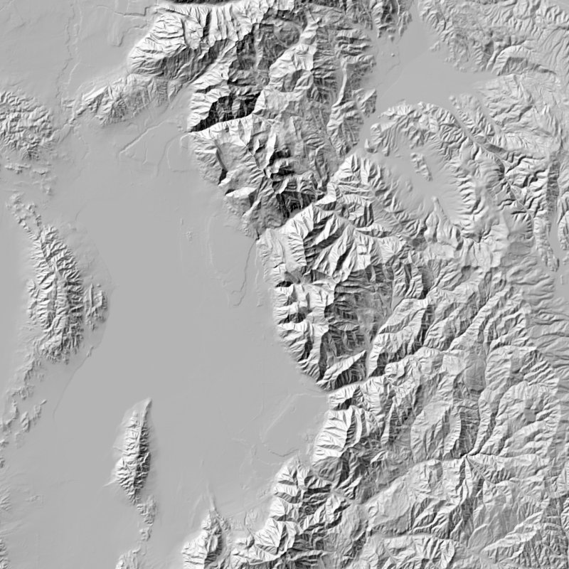

</div>
<div>

- The **Open Geospatial Consortium** publishes the standards that let any GIS talk to any server — like a standard USB connector
- **WMS** (Web Map Service): the server draws the map and sends back a **picture**
- **WMTS** (Web Map Tile Service): the same idea, but pre-drawn **tiles**, so it is much faster
- You see the map; you cannot query the underlying features

</div>
</div>

<!-- The hillshade on the left is a real WMS response: it came from the USGS 3DEP elevation service, and that is the Wasatch Front with Utah Lake on the left. The server rendered it and sent back a PNG. Nothing about the elevation values came with it, just the picture. -->

---

# WFS and WCS: the raw ingredients

<div class="columns" style="grid-template-columns: 1.35fr 1fr;">
<div>


- **Web Feature Service**: returns actual **vector features**, with their attributes
- Slower than a picture, but you can query, select, and **analyze** it
- Successor: **OGC API - Features**, rebuilt on plain URLs and GeoJSON


- **Web Coverage Service**: the raster equivalent — **cell values**, not a picture

</div>
<div>

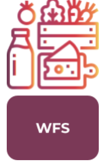

</div>
</div>

<!-- WFS is a Web Feature Service; WCS is a Web Coverage Service. Back to the food analogy: WMS is a cooked meal, WFS is raw ingredients. If you only need to look at it, take the picture, it is faster. If you need to run a buffer, a clip, or an attribute query, you need the features. This distinction is worth a quiz question. -->

---

# Outside the OGC standards

<div class="columns">
<div>


- **XYZ tiles**: a looser, wildly popular version of WMTS. A URL template with `{z}/{x}/{y}` in it. This is how Google, OpenStreetMap, and almost every basemap works


- **Vector Tile**: tiles, but containing features instead of pictures, so you can restyle them

</div>
<div>


- **ArcGIS REST Server**: Esri's own web service. Serves vector *or* raster
- A **feature service** on an Esri server is reached this way
- Not an open standard, but so widely deployed that QGIS supports it natively — and it is what **UGRC uses**

</div>
</div>

<!-- All six of these buttons live at the bottom of the QGIS Data Source Manager list. The takeaway is not the acronyms but the question they answer: am I getting a picture, or am I getting features? -->

---

<!-- _class: quiz -->

# You need to buffer a stream network by 100 m. Which service?

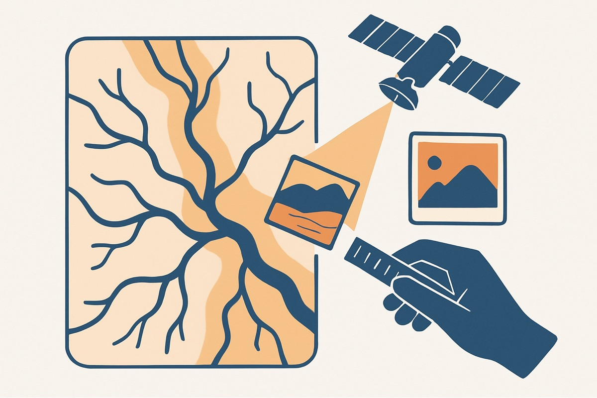

<div class="columns" style="grid-template-columns: 1fr 1fr;">
<div>

<ol type="A">
<li>WMS</li>
<li>WMTS</li>
<li>WFS or an ArcGIS feature service</li>
<li>XYZ tiles</li>
</ol>

</div>
<div>

- And a follow-up: you want a **satellite basemap** behind your map. Which one now?

</div>
</div>

<!-- Answer: C. A buffer is a geometry operation, so you need the geometry, which means features, not a rendered image. The follow-up answer is XYZ or WMTS: for a basemap you only need it to look right, and tiles are far faster. -->

---

# A web service is just a URL


<div style="font-size:0.72em;">

**A WMS request** — asks the server to draw a picture:

```
https://elevation.nationalmap.gov/arcgis/services/3DEPElevation/ImageServer/WMSServer
  ?SERVICE=WMS&REQUEST=GetMap&LAYERS=3DEPElevation
  &CRS=EPSG:3857&BBOX=-12470000,4860000,-12380000,4950000
  &WIDTH=800&HEIGHT=800&FORMAT=image/png
```

**An ArcGIS REST query** — asks the server for features:

```
https://services1.arcgis.com/99lidPhWCzftIe9K/ArcGIS/rest/services
  /QuaternaryFaults/FeatureServer/0/query?where=1=1&outFields=*&f=json
```

</div>

- Every service also answers **`?request=GetCapabilities`**: *what layers do you have?*

<!-- Paste one of these into a browser during class. The first returns the hillshade image from two slides ago; the second returns a wall of JSON with fault geometry and attributes. That is all QGIS is doing when you add a web layer: building URLs like these and drawing what comes back. GetCapabilities is what QGIS calls first when you hit Connect. -->

---

# What a REST services directory looks like

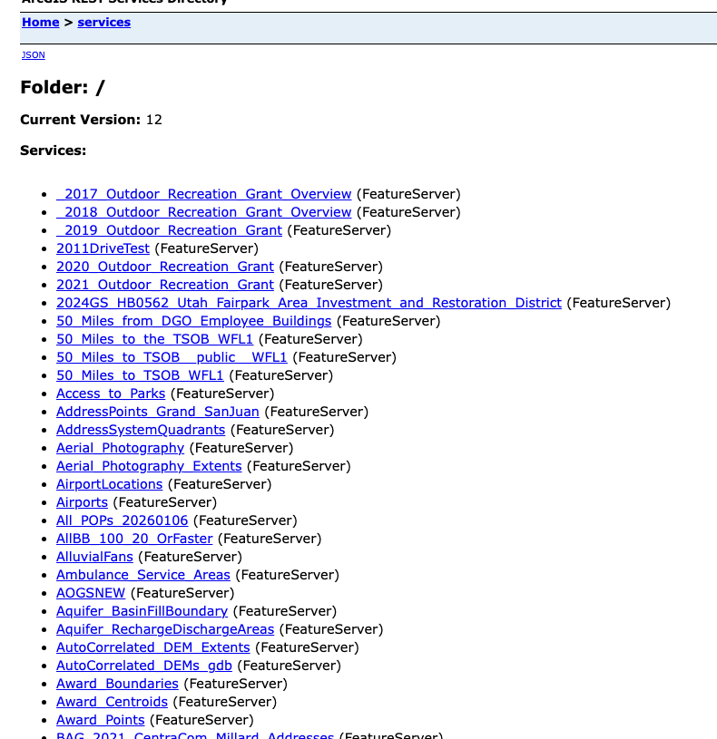

<p style="text-align:center;font-size:0.7em;margin-top:0;">services1.arcgis.com/99lidPhWCzftIe9K/ArcGIS/rest/services — <strong>more than 900 services</strong></p>

<!-- This is UGRC's ArcGIS REST endpoint, opened in a browser. Every one of those links is a dataset you can add to QGIS. It is a directory, in the plain old web sense; you can click your way down it. This exact URL is the one Lab 6 asks you to paste into QGIS. -->

---

# And one service inside it

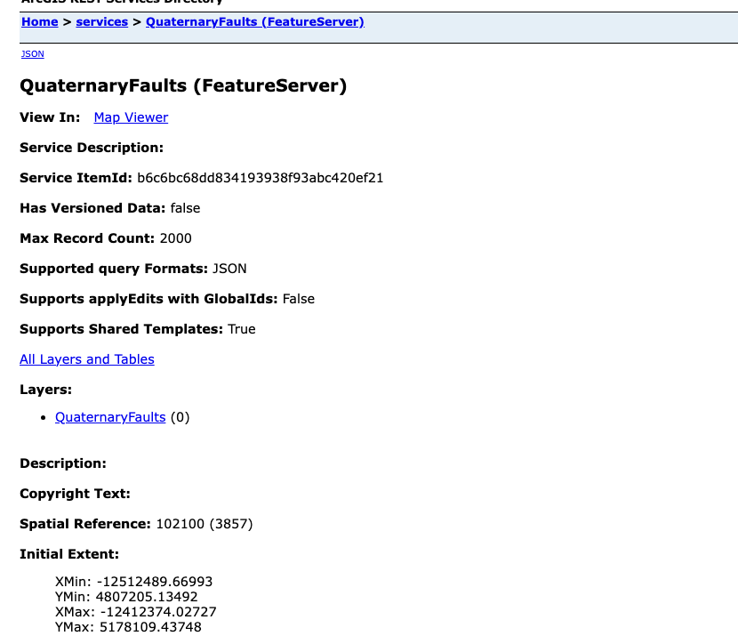

<!-- Drill into QuaternaryFaults and the server tells you everything QGIS needs: the geometry type, the spatial reference (102100 / EPSG:3857 Web Mercator), the extent, the layers, the max record count, and the supported operations. This page is metadata, which is exactly what we spend a whole week on later. -->

---

<!-- _class: lead -->

# Into QGIS

## A live demo of Lab 6, Step 3

<!-- Switch to QGIS here and do the next four slides live if the projector and network allow; the slides are the fallback. Connect to the UGRC endpoint, search for QuaternaryFaults, add it, add two more layers, and open the attribute table to show the features really came across. -->

---

# Connecting QGIS to a service

<div class="columns" style="grid-template-columns: 1fr 1.1fr;">
<div>

1. **Data Source Manager** (the toolbar button, or `Ctrl`/`Cmd` + `L`)
2. Pick the service type in the left-hand list — for UGRC, **ArcGIS REST Server**
3. Click **New**, name the connection, paste the service URL
4. **OK**, then **Connect**
5. Expand the connection, find your layer, click **Add**

</div>
<div>

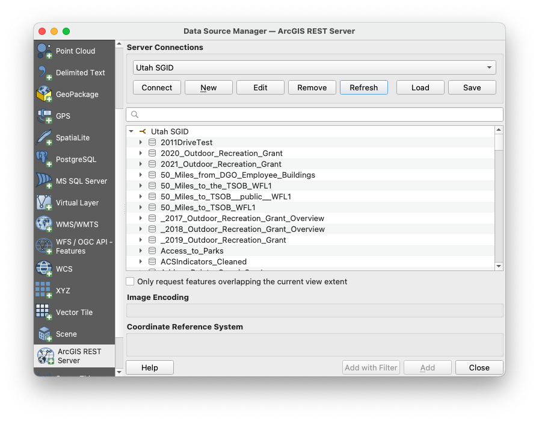

</div>
</div>

<!-- Walk through this on screen if the projector allows. Two things that trip students up every year: the Data Source Manager window likes to hide behind the main QGIS window, and the connection is saved in your QGIS profile, so you only set it up once. Lab 6 gives the exact UGRC URL and authentication settings. -->

---

# Finding your layer among 900-plus

<div class="columns" style="grid-template-columns: 1fr 1.2fr;">
<div>

- Use the **search box** in the Data Source Manager, not your eyes
- Layer names are the **database names**, not the friendly ones: `QuaternaryFaults`, not "Quaternary Faults"
- Not everything lives under one endpoint — UGRC has more than one server
- Nothing showing up? Check the connection URL first, then ask a TA

</div>
<div>

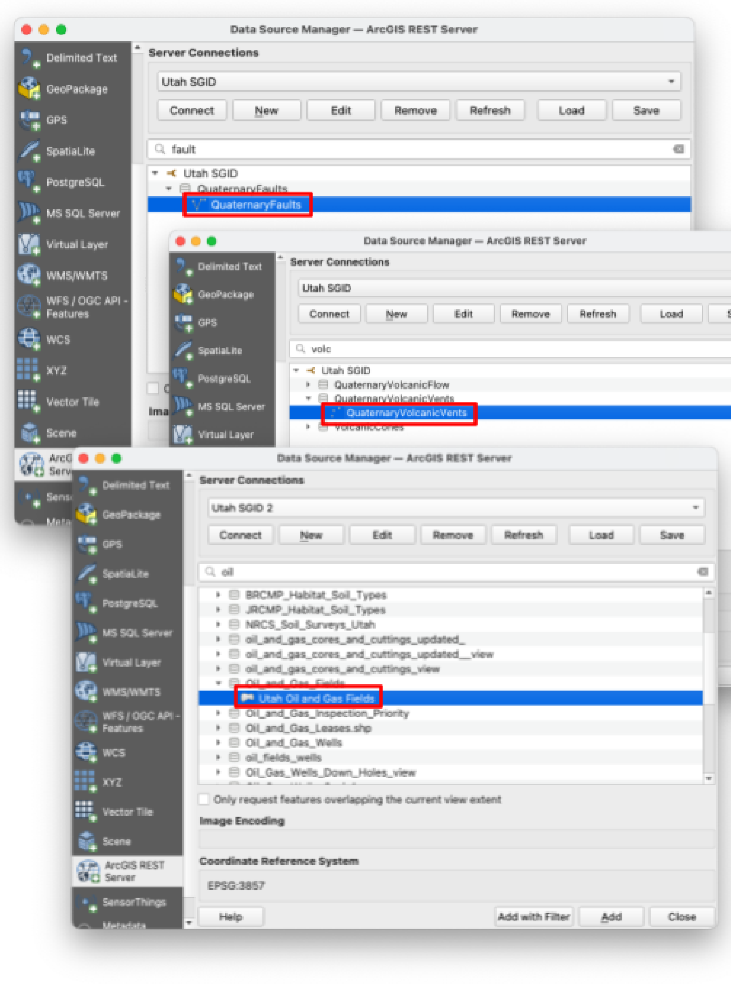

</div>
</div>

<!-- The searching is the real skill here. Tell students to search a fragment: "fault", "bound", "oil". If a dataset they found in the SGID Index does not appear, it is probably on a different UGRC endpoint; Lab 6 gives a second URL for exactly this case. -->

---

# They behave like any other layer


<!-- Once added, a web-service layer sits in the Layers panel like a shapefile: you style it, label it, open its attribute table, and run analysis on it. Here: red volcanic vent triangles, yellow Quaternary faults, and purple oil and gas fields over a satellite basemap. Not one of these was downloaded. -->

---

# From live layers to a finished map

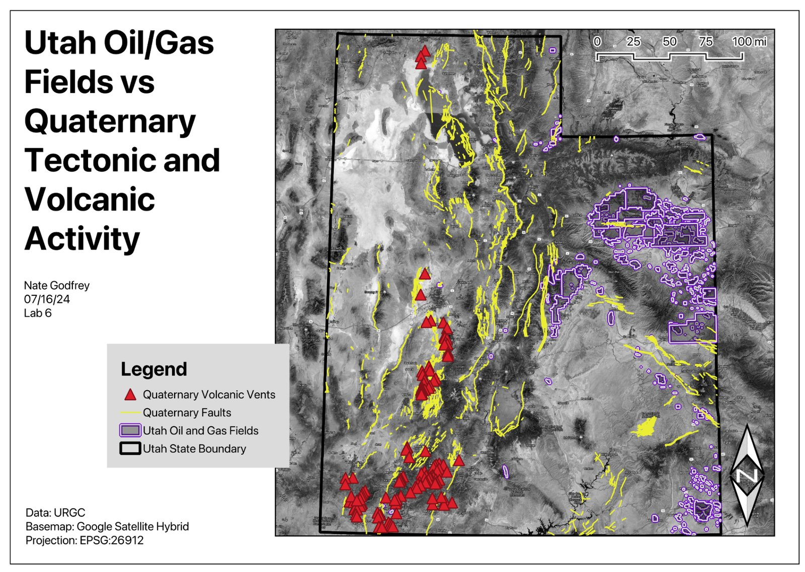

<!-- The Lab 6 example layout: three web-service datasets, a basemap, and every cartographic element you learned in Lab 2 — title, legend, scale bar, north arrow, and a data citation. Note the citation block at the bottom left: when you use someone else's service you credit them. -->

---

# Cautions when you build on someone else's server

<div class="columns">
<div>

- **The server can go down**, or be slow, or change its URL. Download a copy before a deadline or a field trip
- **You need a network.** Web layers are blank when you are offline
- **Projections**: services publish in a fixed CRS, often Web Mercator. QGIS reprojects on the fly, but check before you measure anything

</div>
<div>


- **A picture is not data.** You cannot analyze a WMS layer, only look at it
- **License and attribution**: public agency data is usually free to use with credit. Read the terms, and cite the source on your map

</div>
</div>

<!-- One more caution worth saying aloud: rendering can be slow with big vector services, so limit the extent. The professional point: a live service is a dependency. On a real project you decide deliberately which layers are live, because they change, and which are cached locally, because you cannot afford them to vanish the night before a submittal. -->

---

<!-- _class: activity -->

# Lab 6: your turn

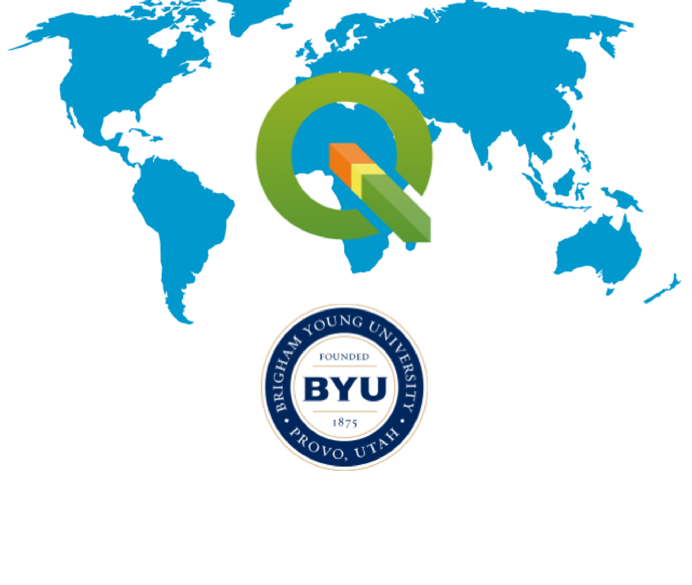

- No hands-on session this week, so **Lab 6** is where you do this yourself
- Write **one question** you can answer with **three** SGID datasets
- Add all three to QGIS **as web services**, not downloads
- Style them, build a **layout** with every required map element, and write a short conclusion
- Due **Saturday at 11:59 pm**: [Lab 6 instructions](https://byu-hydroinformatics.github.io/cce114-geomatics/assignments/lab-06/)

<!-- Steps 1 and 2 (explore the SGID, choose the datasets, write the question) were possible after Tuesday; Step 3 is what today's demo showed. Remind students that the Clyde 234 lab machines have QGIS 3.44 and a wired network if their laptop or the Wi-Fi gives them trouble. -->

---

# Map Experience: due Week 10


The **Community and Professional Map Experience**, due **Wednesday of Week 10**:

- Attend a **real** event: a city council or planning commission meeting, a UDOT open house, an ASCE or AGC chapter speaker
- Photograph the event, and any **map** that was shown
- Map where it was held in **QGIS**, plus what the agenda item was about, from UGRC's services
- Write it up: **what data, what analysis, what decision**

<!-- A ten-minute pitch. The easy option is a city council meeting: Provo and Orem post agendas online, and most have a public-works or land-use item every week. Meetings are usually Tuesday evenings, so there are only three or so chances left; tell students to pick one tonight. Full details are on the Assignments page of the course site. -->

---

# Before Next Class


- **Lab 6: [Spatial Data Web Services](https://byu-hydroinformatics.github.io/cce114-geomatics/assignments/lab-06/)** is due **Saturday at 11:59 pm**
- Next week: **Geodesy, Projections, and Coordinate Systems**
- Read **Chapter 3** of *GIS Fundamentals* (Bolstad & Manson) before Tuesday
- **Quiz 6** opens Tuesday on Learning Suite; open book, due **Saturday** of next week
- Pick your **Community and Professional Map Experience** event
- Questions? Office hours: [calendly.com/dan-ames/office-hours](https://calendly.com/dan-ames/office-hours)

<!-- Confirm the Quiz 6 dates on Learning Suite before class. -->

<!-- Deck notes (2026-10-09): split out of the Day 12 deck "Finding Spatial Data and Web Services" when Week 7's Thursday became a short lecture with no hands-on session. Every slide from "Three ways to put data in a map" through "Cautions" is the second half of that deck, unchanged except for American spelling and the UGRC service count. New: the title and goals slides, the Tuesday recap, the "Into QGIS" divider, the Lab 6 slide, the Community and Professional Map Experience pitch (from the Week 7 hands-on run sheet), and Before Next Class. The QGIS screenshots are genuine QGIS 3.x captures reused from Lab 6. web-rest-directory.png and web-rest-featureserver.png show Esri's REST services directory as served by UGRC, in a browser; they are correct as they stand. The WMS hillshade on the OGC slide is a real GetMap response from the USGS 3DEP elevation service for the Wasatch Front, fetched with the URL on the "A web service is just a URL" slide. UGRC's REST endpoint listed 905 services on 2026-10-09 (891 on 2026-09-02); the slides say "more than 900", which will drift. -->

---

<!-- _class: activity -->

# Your Turn — A Picture, or the Features?

<div class="columns">
<div>

Seven questions on your phone:

- A **picture**, or the features?
- A service is just a **URL**
- Utah's data, **into QGIS**

Not graded, and every answer explains itself. Good practice for Lab 6.

<span style="font-size: 0.5em; color: #4a5568; white-space: nowrap;">byu-hydroinformatics.github.io/cce114-geomatics/quizzes/services/</span>

</div>
<div>


</div>
</div>

<!-- Five minutes, in pairs, then a show of hands on the two worth arguing about: what a WMS actually sends back, and which service you need before you can buffer anything. Those are the two that decide whether a Lab 6 map works. If the room has no signal, put the URL on the board. The page is linked from the Week 7 page too. -->
