<!-- _class: lead -->
<!-- _paginate: skip -->

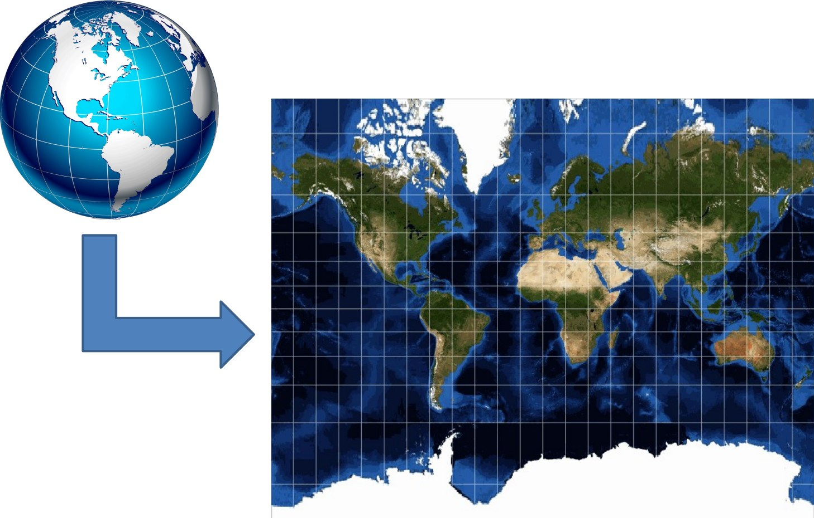

# Geodesy, Projections, and Coordinate Systems

Part 1

CCE 114 Geomatics
Dr. Dan Ames and Dr. James Halgren

<!-- Tuesday concept lecture, week 8. Thursday is the hands-on session, where students set project and layer CRSs in QGIS and reproject data. This is the lecture that Quiz 6 and Lab 7 are built on, so flag both early. -->

---

# Today's Goals

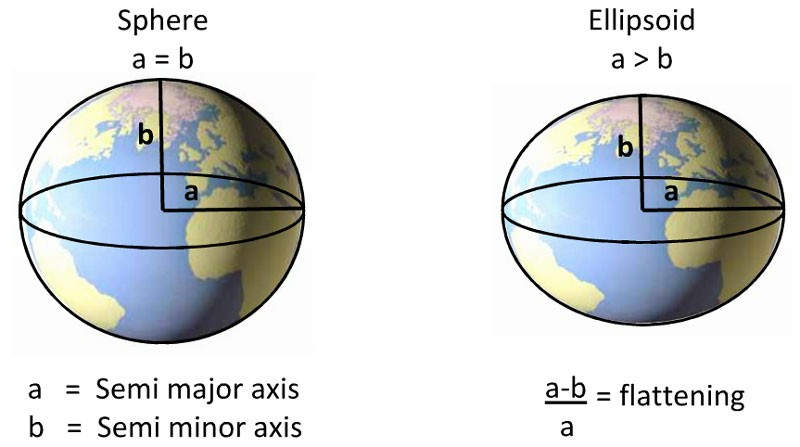

- By the end of class you should be able to:
  - Say what **geodesy** is, and why the shape of the Earth is a hard problem
  - Distinguish the **geoid**, the **ellipsoid**, and a **datum**
  - Explain why every flat map **distorts** something, and name what a given projection preserves
  - Tell a **geographic** coordinate system from a **projected** one
  - Choose between **UTM** and **State Plane** for an engineering project, and defend the choice
- Thursday, in the hands-on session, you do all of this in QGIS

<!-- Set expectations. Today is concepts; Thursday is the software. Reading is GIS Fundamentals chapter 3, which this lecture follows. -->

---

# Things to play with

- **Map projection transitions** — one projection morphs into another:
  [jasondavies.com/maps/transition](https://www.jasondavies.com/maps/transition/)
- **The True Size Of…** — drag a country and watch it grow:
  [thetruesize.com](https://www.thetruesize.com/)
- **XKCD 977, "Map Projections"** — what your favorite says about you:
  [xkcd.com/977](https://xkcd.com/977/)
- **Interactive Album of Map Projections** (Penn State):
  [projections.mgis.psu.edu](https://projections.mgis.psu.edu/)
- **Compare Map Projections**, with distortion circles:
  [map-projections.net/imglist.php](https://map-projections.net/imglist.php)

<!-- Open at least the Jason Davies transitions page live: sliding from Mercator to Mollweide to orthographic does more in ten seconds than a slide can. Come back to The True Size at the Greenland question. XKCD 977 is a good end-of-class laugh. -->

<!-- The 2021 deck demonstrated Tissot circles live in ArcGIS Pro. In this version use map-projections.net (last link above), which draws Tissot indicatrices for every projection; the QGIS Indicatrix plugin is an alternative if you want it live in QGIS. -->

---

<!-- _class: activity -->

# Globe Activity: The Great Circle

- Choose a country or city in **Europe** — you are flying there from **Salt Lake City**
- Which states and other countries will you pass over? Write your list down **before** you touch a globe

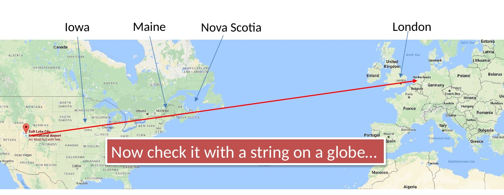

<!-- Do this first, before they look at the globes. On a flat wall map the straight line from Salt Lake to London runs over Iowa, Maine, Nova Scotia. Everyone will give some version of that answer, because that is what the map in their head looks like. -->

---

# Now check it with a string on a globe

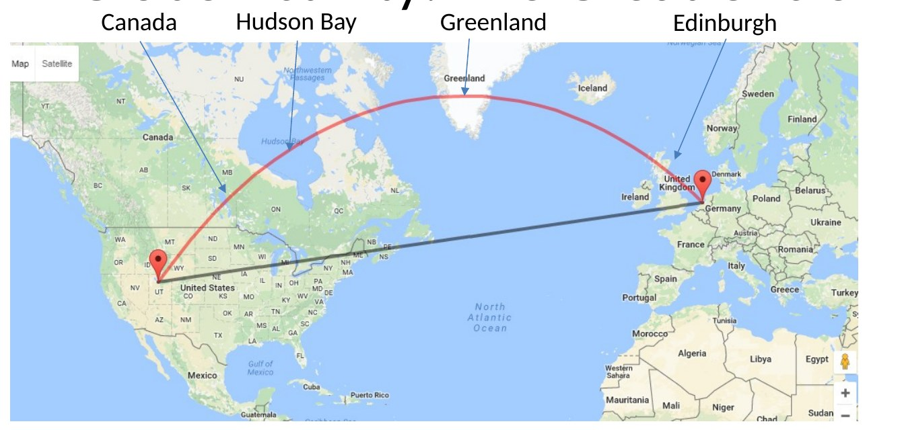

<!-- Hand out globes, one per three students, and a piece of string. The shortest path from Salt Lake City to Edinburgh runs up over Canada, Hudson Bay, and Greenland. Ask them to explain why. The shortest path on a sphere is a great circle, and the flat map turned that curve into something that looked wrong. This is the whole course in one activity: the map is not the Earth. -->

---

<!-- _class: quiz -->

# What is Geodesy?

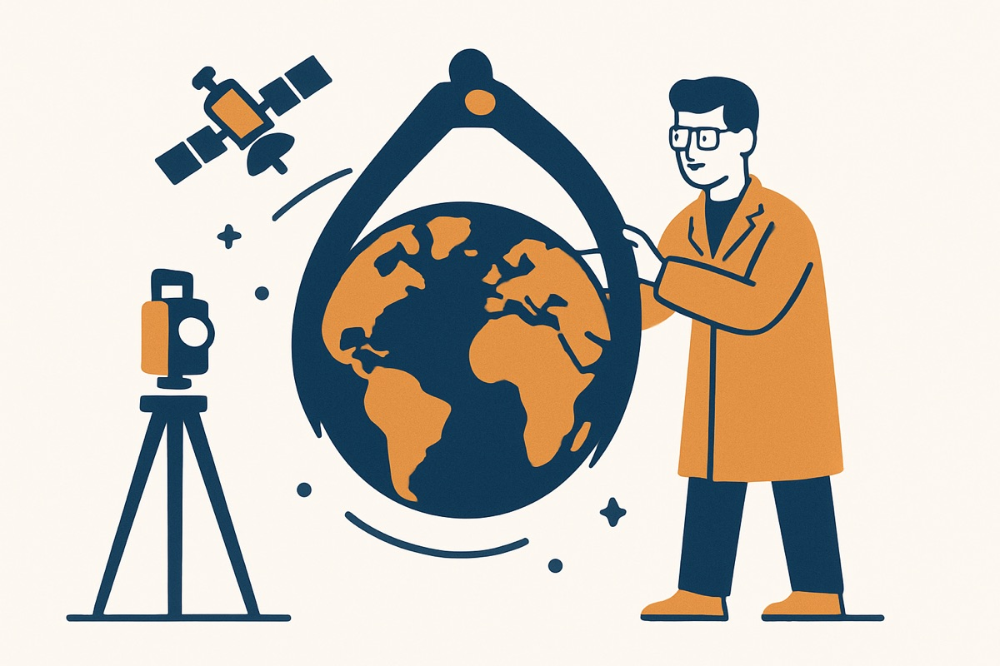

<ol type="A">
<li>The science of measuring the shape of the Earth</li>
<li>The science of studying rocks and minerals</li>
<li>The science of finding positions based on satellites</li>
<li>The science of the distributions of populations and resources on the Earth</li>
</ol>

<!-- Answer: A. Geodesy is the science of measuring the shape of the Earth, and the positions of points on it. B is geology, C is roughly GNSS/surveying, D is closer to geography. Everything today follows from the fact that this is genuinely hard. -->

---

# Problem 1: humans perceive the Earth's surface as flat

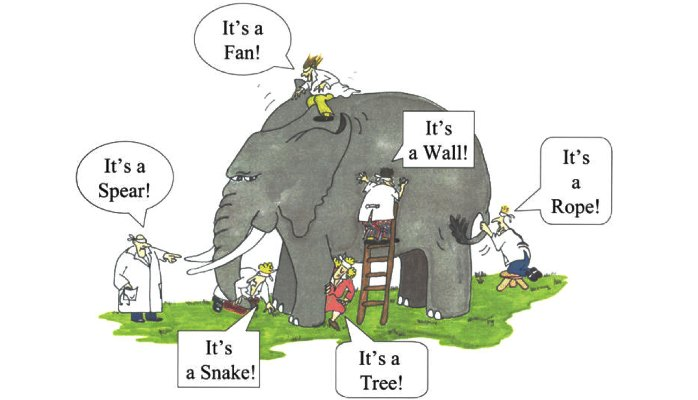

- At our scale, we don't see the curve of the Earth
- Each of us measures a small patch and reports what we felt
- Every local measurement is *correct*, and none of them is the whole shape

<!-- The blind men and the elephant. A surveyor working a half-mile site can treat the Earth as a plane and be right to within their instrument's precision. Stitch enough of those flat patches together across a continent and they no longer fit. -->

---

# It's a very old idea, and a persistent one

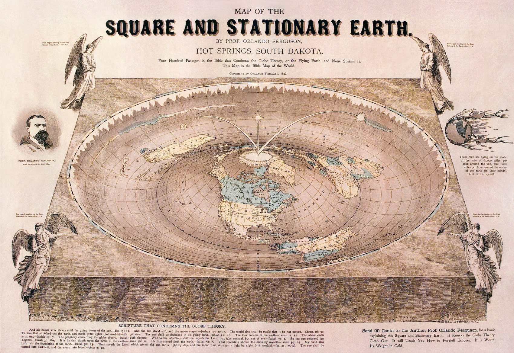

- Orlando Ferguson's *Square and Stationary Earth* (1893), sold as scriptural proof
- And it is still a thing: the Flat Earth Society has an active social-media following

<!-- Fun fact: some have argued the Earth is flat to validate biblical language such as "the four corners of the earth." The point for us is not to mock it, it is that flatness is the intuitive model, and geodesy is the work of getting past intuition. -->

---

# A round Earth on flat paper

<!-- You cannot flatten a sphere without tearing or stretching it. Try it with an orange peel. Every world map you have ever seen is the result of a decision about where to put the stretching. -->

---

<!-- _class: lead -->

# Part 2

## Map projections and distortion

---

# Projections

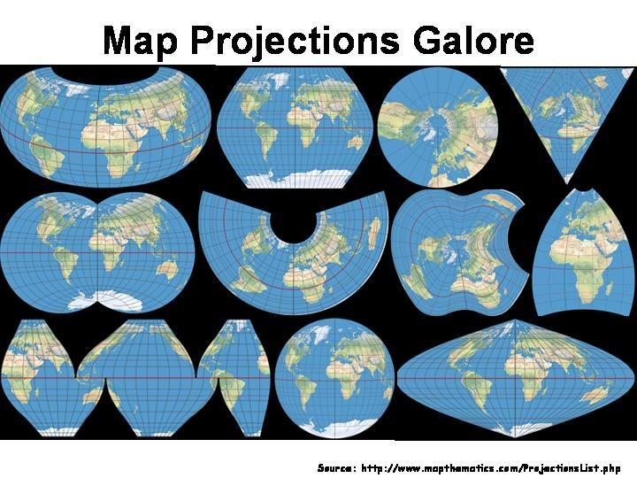

- **Question:** how do we represent the curved Earth on a flat map?
- A **map projection** is a mathematical rule that turns latitude and longitude into flat *x, y*
- There are hundreds of them, and none is "correct"
- Watch one become another: [jasondavies.com/maps/transition](https://www.jasondavies.com/maps/transition/)

<!-- Run the Jason Davies transitions page here for a minute. The point is that these are all the same data; the differences are all choices about distortion. -->

---

# Geographic vs. projected coordinate systems

**Geographic (GCS)**

- Coordinates are **angles**: latitude and longitude
- Measured on an ellipsoid, from a **datum**
- Degrees, not meters — a degree of longitude is 111 km at the equator and 0 km at the pole
- Example: WGS 84 (EPSG:4326)

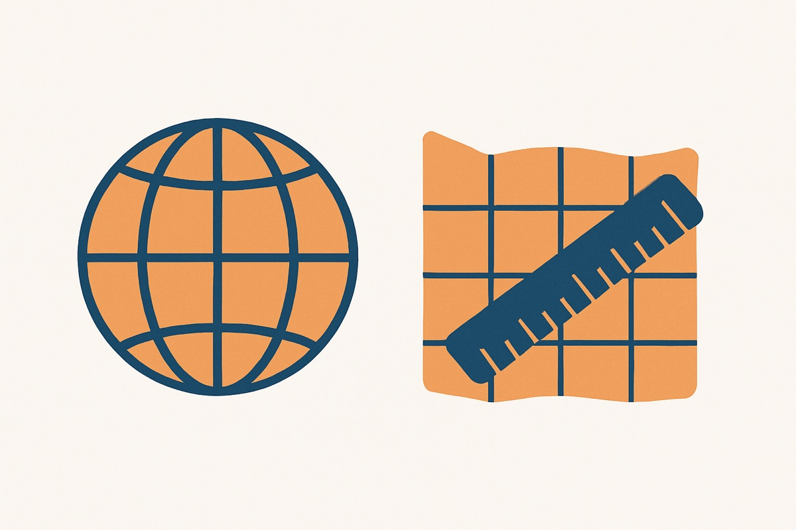

**Projected (PCS)**

- Coordinates are **distances**: easting and northing
- A GCS **plus** a projection
- Meters or feet, so you can compute length and area directly
- Example: UTM Zone 12N, NAD 83 (EPSG:26912)

<!-- Every projected coordinate system is built on a geographic one; you need both halves to place a point. This is the slide students should photograph. In QGIS the CRS chooser shows both kinds in one list, which is exactly why people mix them up. If you ask QGIS for the area of a polygon while the project is in EPSG:4326, you get square degrees, which mean nothing. -->

---

# Every projection distorts something

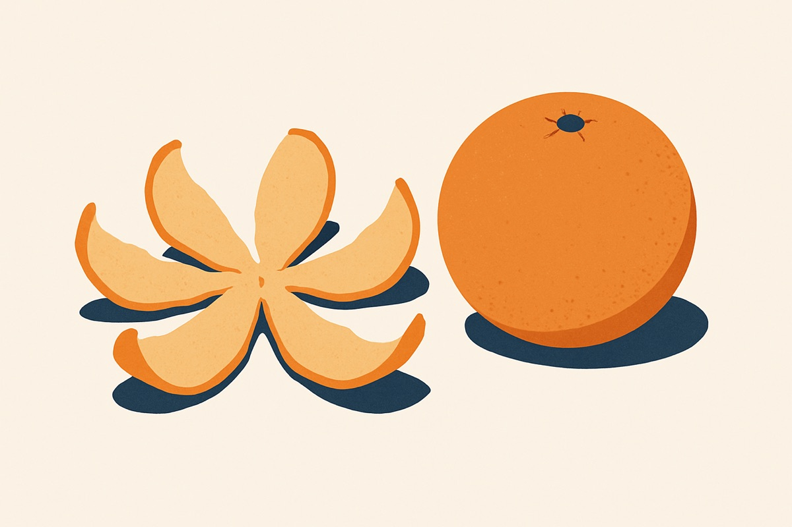

- A flat map cannot preserve all four of these at once:
  - **Shape** (angles) — a *conformal* projection preserves it locally
  - **Area** — an *equal-area* projection preserves it
  - **Distance** — an *equidistant* projection preserves it, but only from certain points or along certain lines
  - **Direction** — an *azimuthal* projection preserves it from the center
- So the real question is never "which projection is right?" but **"what am I willing to distort?"**
- Distortion is smallest near where the projection surface touches the globe, and grows with distance from it

<!-- Write the four words on the board and leave them up. Every quiz question for the rest of the hour is an application of the last bullet: find where the surface touches, and ask how far your area of interest is from it. -->

---

# The world you have been looking at

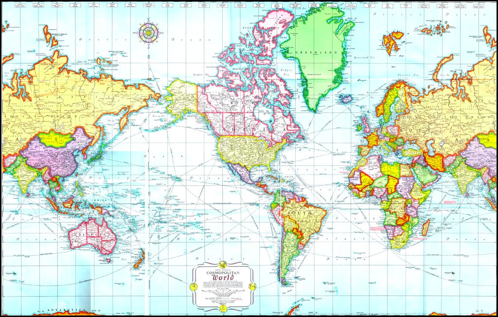

<!-- Here is a typical classroom map of the world. What is the dominant feature? Why is Greenland so huge? Look at your globes. This map makes Russia, Canada, and Greenland look like the dominant countries on Earth. -->

---

<!-- _class: quiz -->

# Greenland is approximately the same size as…

<ol type="A">
<li>Africa</li>
<li>Delaware</li>
<li>Russia</li>
<li>Mexico</li>
</ol>

Let's compare some place sizes: [thetruesize.com](https://www.thetruesize.com/)

<!-- Answer: D, Mexico. Greenland is about 2.2 million km2, Mexico about 2.0 million. On a Mercator map Greenland looks the size of Africa, which is fourteen times larger. Open thetruesize.com and drag Greenland down to the equator; then drag Africa up to the Arctic. -->

---

# The Peters map: equal area, not equal shape

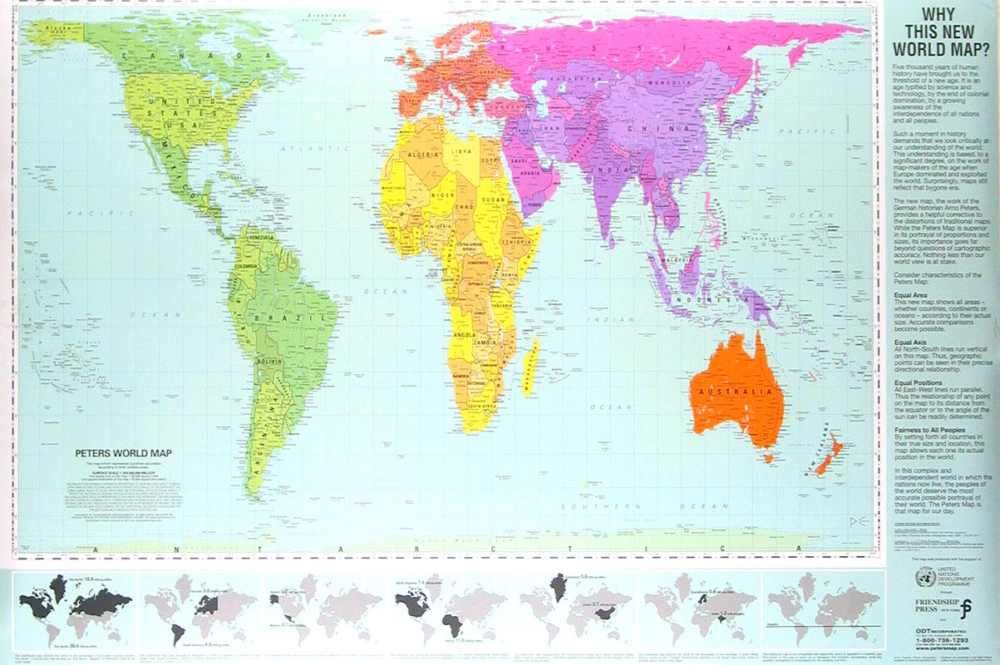

<!-- This is the Peters map. It is not conic and it is not Mercator: it is a cylindrical equal-area projection. The north-south spacing of the parallels is compressed so that every country keeps its correct relative area. North-south and east-west directions are maintained and area is maintained; shape is squashed, so it is not conformal. It was promoted for political reasons, to communicate the relative importance of countries by their true size. -->

---

# The Mercator projection

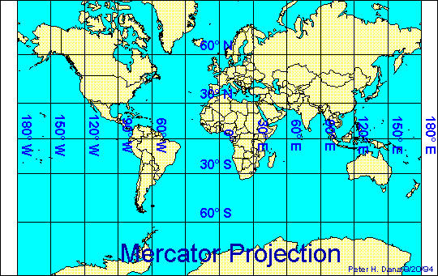

<!-- This is a Mercator projection, not a Transverse Mercator. How would you make it? Wrap the projection surface into a cylinder around the equator and project outward from a light source at the center of the Earth. Mercator's virtue is that a line of constant compass bearing is a straight line, which is why it won the age of sail and why it is still the default for web maps. -->

---

# How do we get a map like that? A projection surface

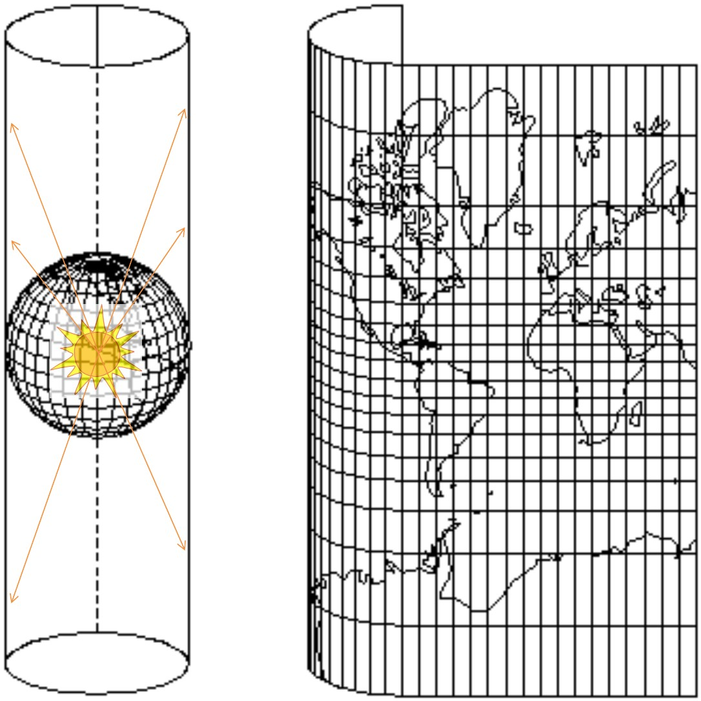

<!-- Put a light at the center of the globe, wrap a sheet of paper into a cylinder around it, and trace where the graticule falls on the paper. Unroll the cylinder and you have a flat map. Everything that follows is a variation on the shape of that sheet and where it touches the globe. -->

---

# Tangent or secant?

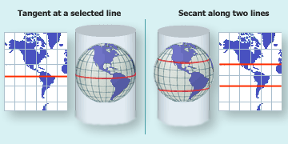

- **Tangent**: touches the globe along **one** line — zero distortion there
- **Secant**: cuts through, touching along **two** lines — distortion spread over a wider band

<!-- The red lines are the lines of true scale. Secant is the usual engineering choice: you accept a small error over a wide area instead of no error in one place and a large error everywhere else. -->

---

# Transverse and oblique Mercator

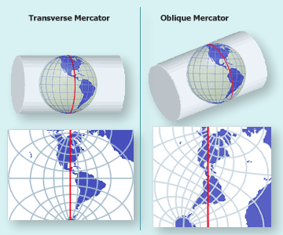

<!-- Two other cylindrical variants: transverse (the cylinder is rotated 90 degrees, so it touches along a meridian) and oblique (rotated to any angle). In each case there is a ring around the globe where distortion is minimised. Now ask the key question: what if you could re-center that line over your area of interest? What if you rotated the transverse cylinder all the way around, stopping every 6 degrees? -->

---

# Universal Transverse Mercator projection zones

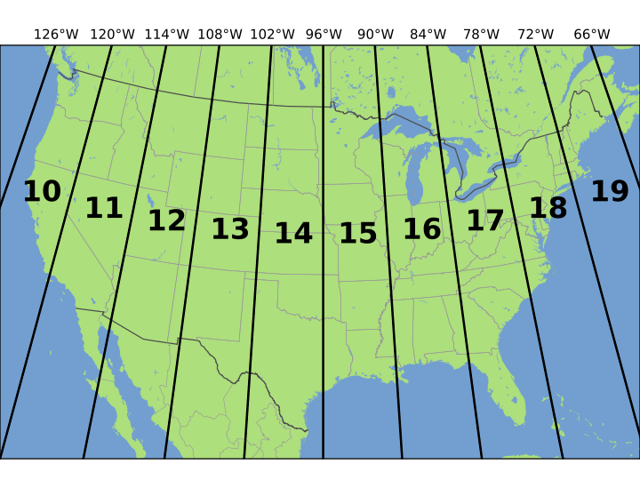

<!-- That is exactly what UTM is. Each zone is 6 degrees of longitude wide, with the cylinder tangent (technically secant) along the zone's central meridian. How many zones go around the globe? Sixty. These are the zones over the continental United States; Utah is mostly Zone 12. -->

---

# Conic surfaces: tangent and secant

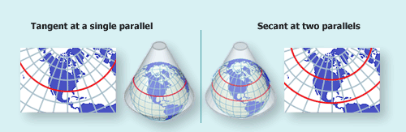

<!-- Same idea with a cone instead of a cylinder. Tangent at a single parallel, or secant at two parallels. Cones fit mid-latitude regions that are wider east-west than north-south, which describes most of the United States. -->

---

# Standard parallels and the central meridian

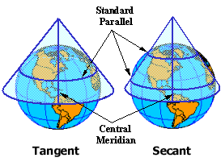

<!-- The parallels where the cone touches are the standard parallels: those are the lines of true scale. The central meridian is the line of symmetry. When you pick a conic CRS in QGIS these are the numbers in its definition, and they are chosen to bracket the area you care about. -->

---

# Lambert conformal conic (tangent)

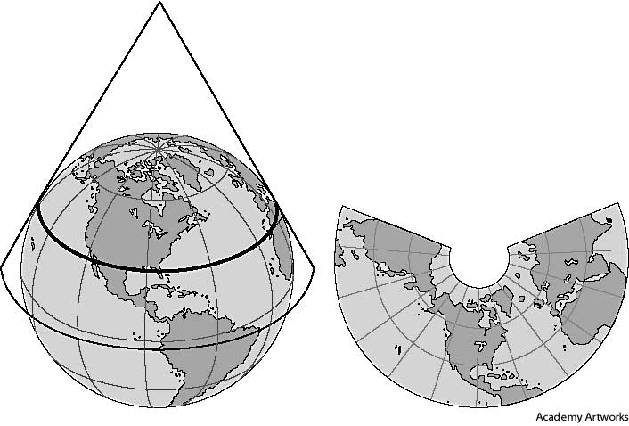

<!-- Lambert conformal conic, tangent or secant, is the other big family you will meet. Ask: which parts of the globe have distortion minimised here? The band along the standard parallel. Conformal means shape and angle are preserved locally, which is what you want for surveying and engineering drawings. -->

---

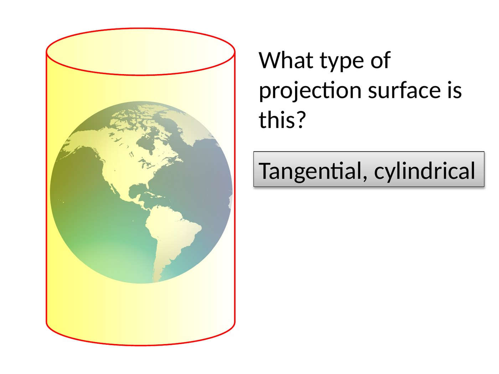

<!-- Tangential, cylindrical. Ask before revealing: is the surface a cylinder or a cone, is it upright or rotated, does it touch along one line or cut through along two? -->

---

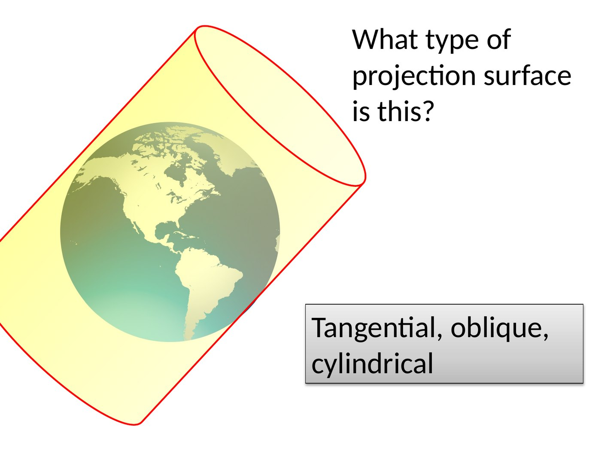

<!-- Tangential, oblique, cylindrical. Still a cylinder, still touching one line, but rotated off the poles. -->

---

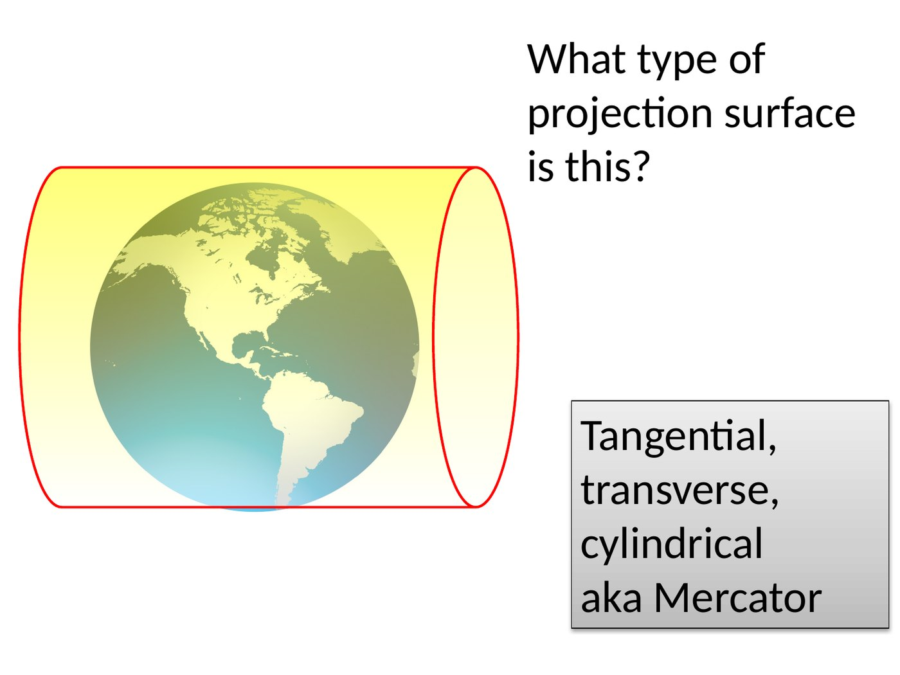

<!-- Tangential, transverse, cylindrical, also known as Transverse Mercator. The cylinder has been rotated a full 90 degrees so it touches along a meridian. This is the parent of every UTM zone. -->

---

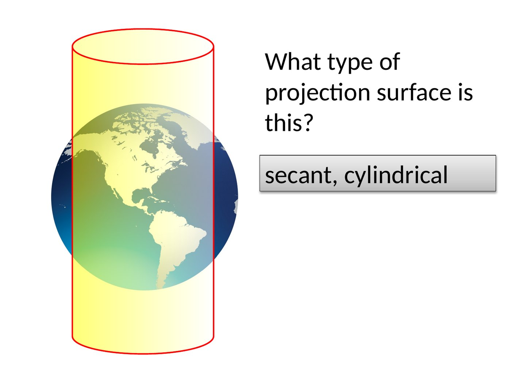

<!-- Secant, cylindrical. The cylinder is smaller than the globe now: it cuts through and touches along two lines. -->

---

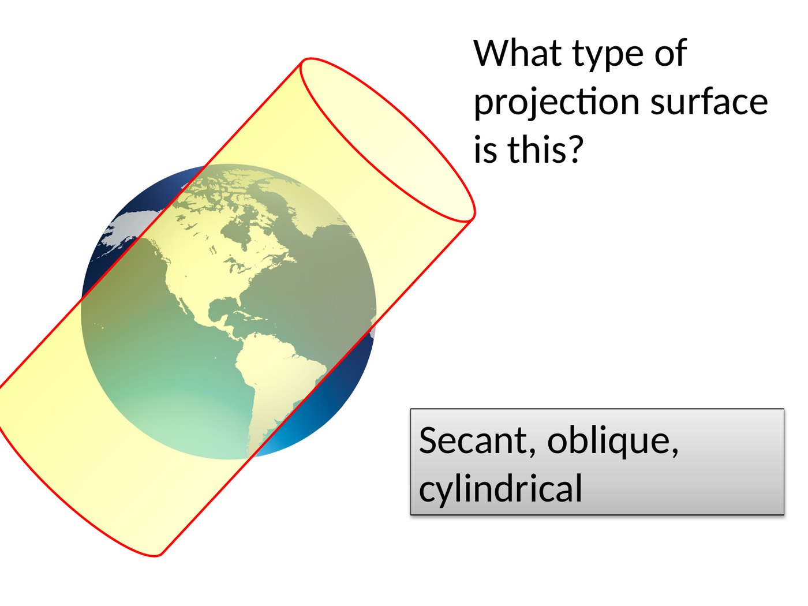

<!-- Secant, oblique, cylindrical. -->

---

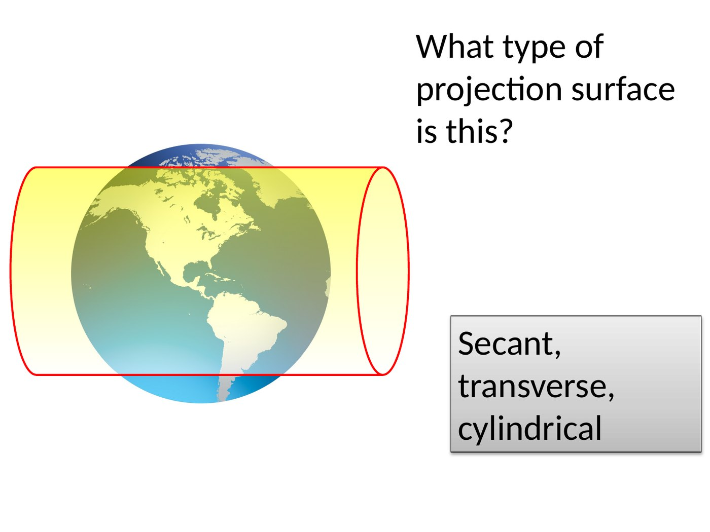

<!-- Secant, transverse, cylindrical. This is what UTM actually is: a secant transverse cylinder with a scale factor of 0.9996 on the central meridian, so the two lines of true scale sit either side of it. -->

---

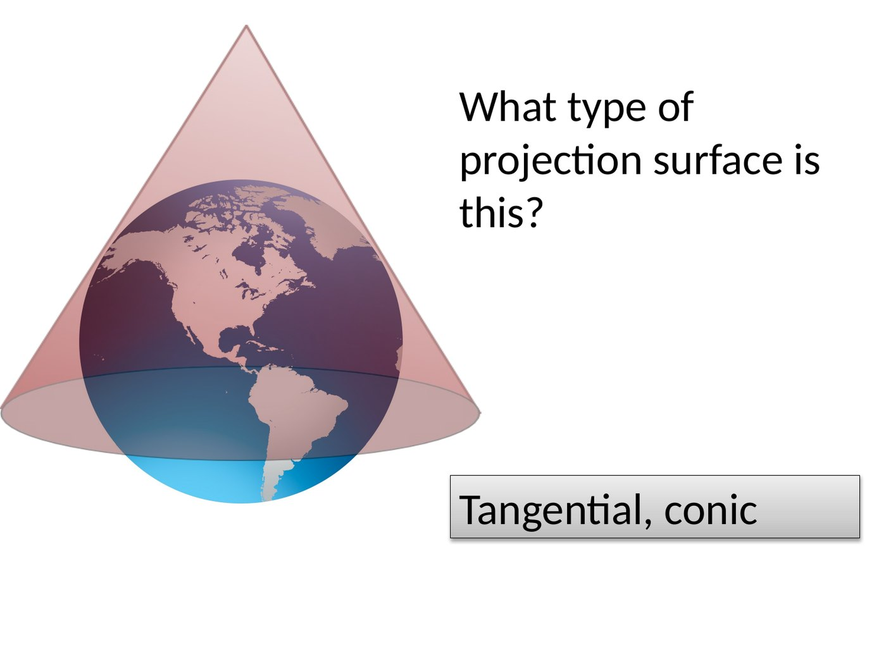

<!-- Tangential, conic. -->

---

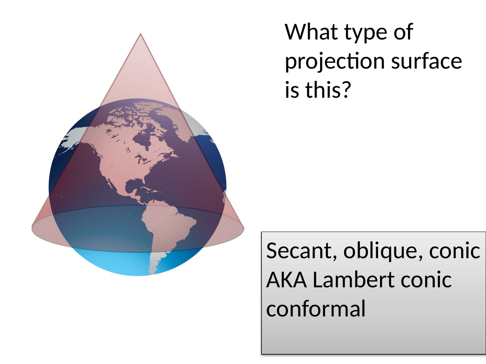

<!-- Secant, oblique, conic, also known as Lambert conformal conic. By now they should be reading these off automatically: shape of the surface, orientation, tangent or secant. -->

---

<!-- _class: quiz -->

# Which statement is most accurate?

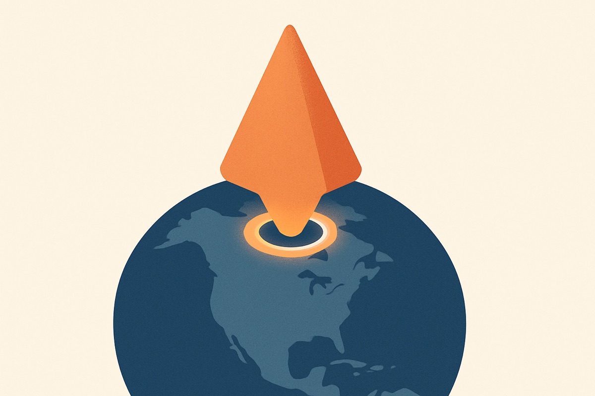

<ol type="A">
<li>Considering map distortion, this projection is equally suitable for every state in a straight line between Utah and Kentucky</li>
<li>Considering map distortion, this projection is equally suitable for southeastern Florida and northeastern Washington state</li>
<li>Considering map distortion, this projection is equally suitable for north, central, and south Texas</li>
</ol>

<!-- Do not answer yet. Show them the scale-error map on the next slide and let them reason from it. The projection here is a conic centered on the continental United States. -->

---

# Scale error on a conic projection

<!-- The solid circle is the standard circle, the line of true scale. The dashed contours are 0.5%, 1%, and 2% scale error. Distortion depends only on distance from that circle, so any two places sitting on the same contour are equally distorted, no matter which direction they lie in. -->

---

<!-- _class: quiz -->

# Answer: B

- **Southeastern Florida and northeastern Washington state** sit at roughly the **same distance from the line of true scale**, so they carry roughly the same distortion
- A: Utah to Kentucky crosses the standard circle, so the error varies a lot along that line
- C: north and south Texas are at very different distances from the standard circle

<!-- Drive the general rule home: with a projection, what matters is not the compass direction from the center, it is the distance from the line or lines of true scale. -->

---

<!-- _class: quiz -->

# Which statement is most accurate?

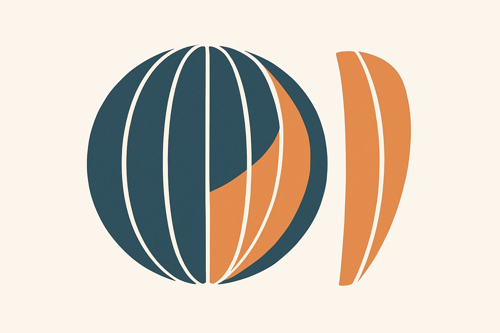

<ol type="A">
<li>UTM projections minimize distortion in distance, shape, and area equally well for all areas within a single UTM zone</li>
<li>UTM projections minimize distortion in distance, shape, and area along the equator</li>
<li>UTM projections minimize distortion in distance, shape, and area along a line of longitude at the middle of a particular UTM zone</li>
<li>UTM projections minimize distortion in distance, shape, and area in the northern hemisphere but not in the southern hemisphere</li>
</ol>

<!-- Again, hold the answer. Look at the next two slides first. -->

---

# UTM zones: 60 of them, 6° wide

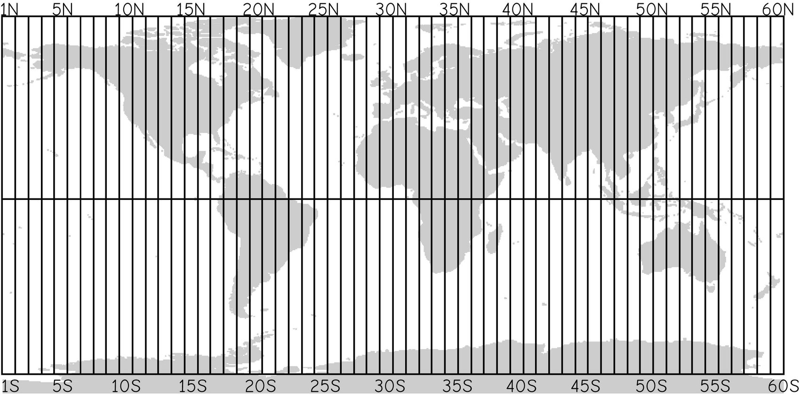

<!-- Sixty zones, each 6 degrees of longitude wide, numbered eastward from the antimeridian. Each zone is its own projection with its own central meridian, which is why UTM coordinates are meaningless until you say which zone. -->

---

# Line of least distortion for UTM Zone 12

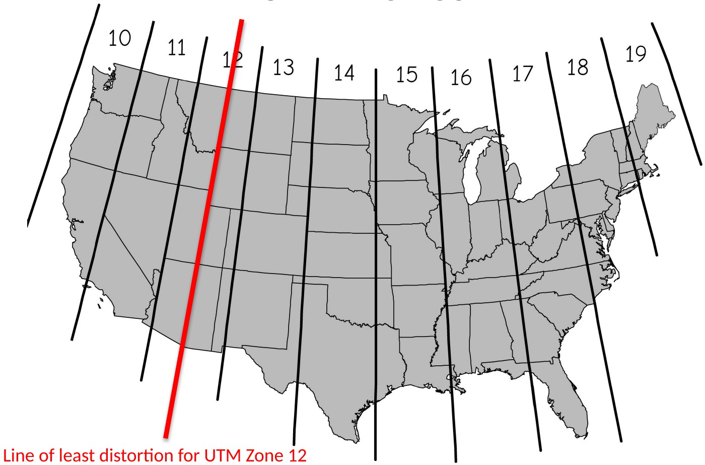

<!-- The red line is the central meridian of Zone 12, at 111 degrees west. That is the line of least distortion, and it runs right down the middle of Utah, which is why UTM Zone 12N is a perfectly good working CRS for most of this state. -->

---

<!-- _class: quiz -->

# Answer: C

- UTM minimises distortion **along a line of longitude at the middle of a particular zone** — the zone's **central meridian**
- Distortion grows toward the **edges** of the zone, so a project straddling a zone boundary is a problem
- Nothing about UTM favours one hemisphere; the equator is not special except in Zone-specific false northings

<!-- If a site spans two zones you either pick one zone and accept the error at the far edge, or move to a State Plane zone or a custom projection. This comes up on real projects, particularly along the Utah-Colorado line. -->

---

<!-- _class: quiz -->

# Which projection best minimizes distortion in the state of Tennessee?

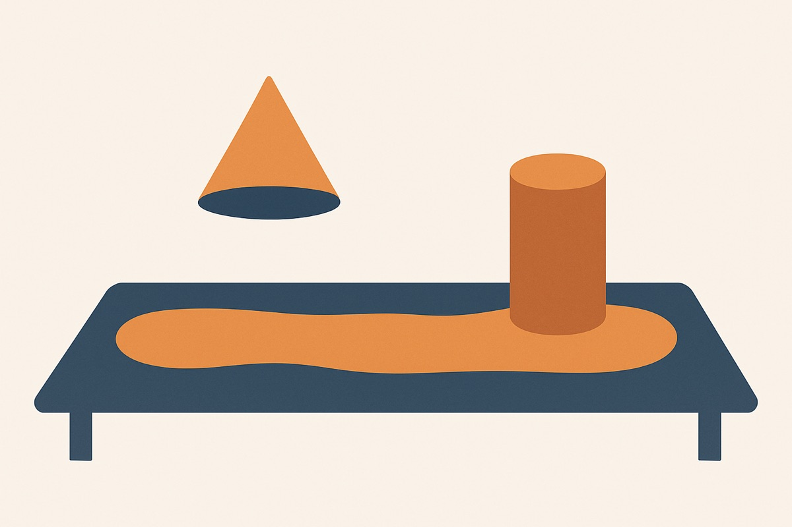

<ol type="A">
<li>Lambert Conformal Conic</li>
<li>Universal Transverse Mercator</li>
</ol>

<!-- Tennessee is a long, thin, east-west state. Hold the answer and show them the two maps. -->

---

# UTM Zone 16 across Tennessee

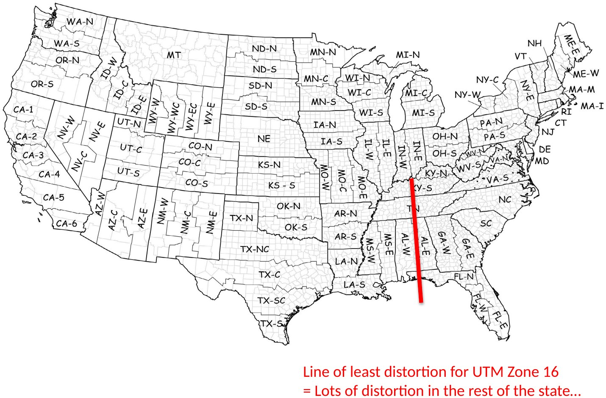

<!-- The line of least distortion for UTM Zone 16 runs north-south straight through the middle of the state, so it touches Tennessee for about eighty miles and leaves the rest of that long east-west state a long way from true scale. -->

---

# A Lambert conformal conic line… much better

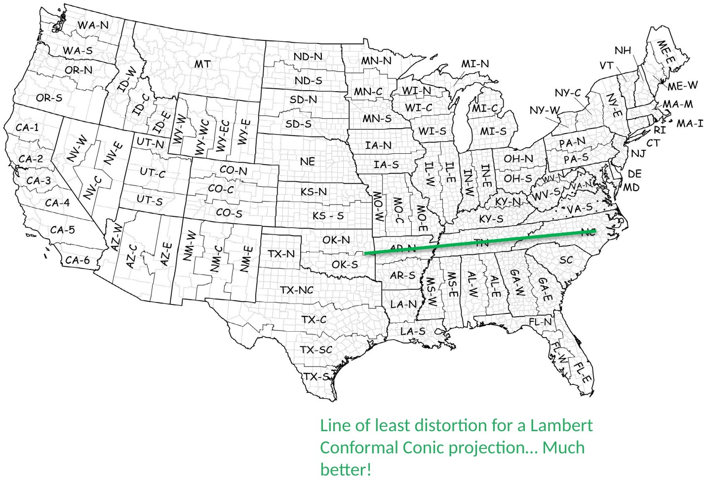

<!-- A conic projection with standard parallels chosen to run east-west puts the line of least distortion along the long axis of the state. That is exactly what the Tennessee State Plane zone does, and why the background of these two slides is the State Plane zone map. -->

---

<!-- _class: quiz -->

# Answer: A — Lambert Conformal Conic

- Match the **shape of the projection surface to the shape of the area**
- Long **east-west** regions → **conic**, with standard parallels along the long axis
- Long **north-south** regions → **transverse cylindrical**, such as a UTM zone
- This is exactly the reasoning behind the **State Plane** zones

<!-- The state plane zone map on the previous two slides is the punchline: someone already did this analysis for every state, and the answer is baked into the zone definitions. -->

---

# State Plane Coordinate System (SPCS)

- One or more zones **per state**, each with its own projection
- **East-west** states get **Lambert conformal conic**; **north-south** states get **Transverse Mercator**
- Zones are kept small so scale error stays under about **1 part in 10,000**
- Traditionally in **survey feet**; check the units before you compute anything
- Utah has three zones: **North, Central, South**

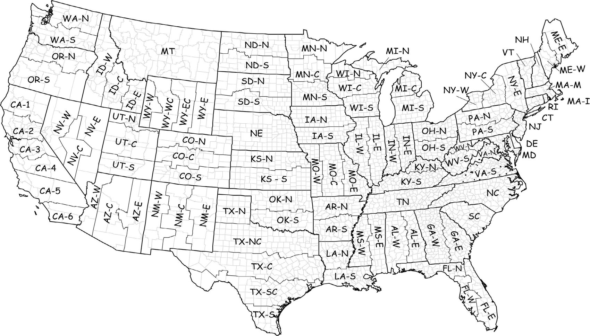

<!-- The trade: UTM is one system for the whole world with moderate accuracy, State Plane is a patchwork tuned for high accuracy inside each state. Civil and survey work in the U.S. is usually specified in State Plane; regional and environmental work is usually UTM. Utah Central, NAD 83, is what most Utah County engineering data arrives in. -->

---

<!-- _class: quiz -->

# Why is coordinate transformation also referred to as *registration*?

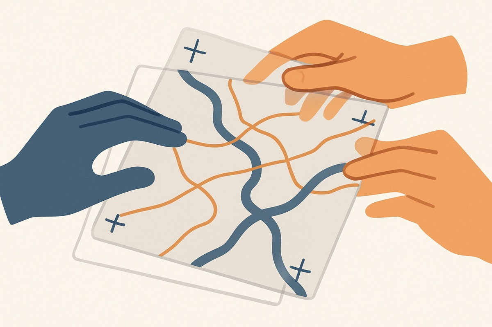

<ol type="A">
<li>Because it is necessary to register your map online before it can be published</li>
<li>Because it registers the layers to a map coordinate system</li>
<li>Because one must register to obtain coordinate information</li>
</ol>

<!-- Answer: B. Registration lines layers up with each other and with a known coordinate system, the same sense as registration marks in printing. Georeferencing a scanned plan sheet is the case they will meet in the lab. -->

---

<!-- _class: lead -->

# Part 3

## The shape of the Earth: geoid, ellipsoid, datum

---

# Problem: the Earth has an irregular shape

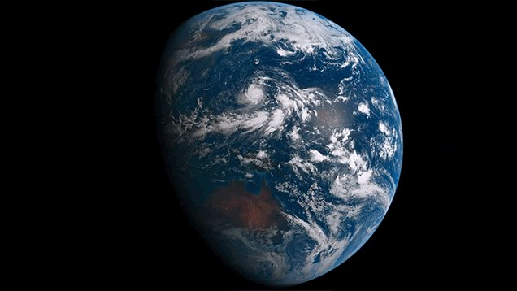

<!-- We have been drawing the Earth as a perfect sphere all hour. It is not one. It is not even a perfect ellipsoid. Every projection is built on a mathematical figure that only approximates the real thing. -->

---

<!-- _class: quiz -->

# Which of the following is the closest mathematical approximation of the shape of the Earth?

<ol type="A">
<li>Geoid</li>
<li>Ellipsoid</li>
<li>Spheroid</li>
<li>Tetraploid</li>
</ol>

<!-- Answer: B, ellipsoid. Careful with the wording: the geoid is the closest description of the physical Earth, but it is not a mathematical figure you can compute coordinates on. Of the mathematical approximations, an ellipsoid (semi-major axis a, semi-minor axis b, flattening (a-b)/a) fits better than a sphere. "Tetraploid" is a genetics term and is there as a joke. -->

---

# So then… what is the "geoid"?

- An **equigravitational surface**
- An imaginary surface of the Earth based on the **expected sea surface level everywhere**
- Sea surface level varies because **gravity** varies
- Gravity varies because **earth density** varies

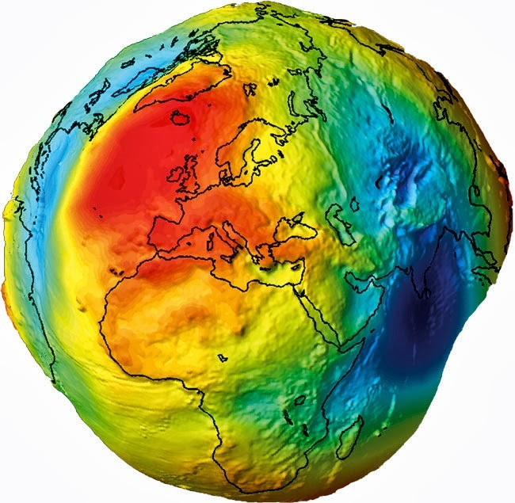

<!-- The Earth is not really shaped like this: the relief in the picture is exaggerated enormously to make the geoid visible. The real departures from an ellipsoid are on the order of a hundred meters. This is the surface your elevations are measured from, which is why orthometric height and ellipsoid height are different numbers for the same point. -->

---

# Problem: our ability to measure shape and position is… not great

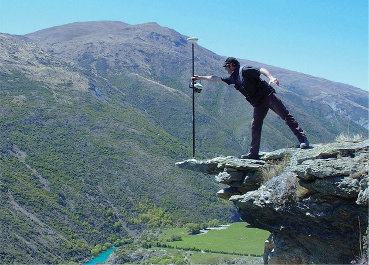

<!-- Even with good instruments in good hands, positions carry error, and the reference surfaces themselves get revised as measurements improve. -->

---

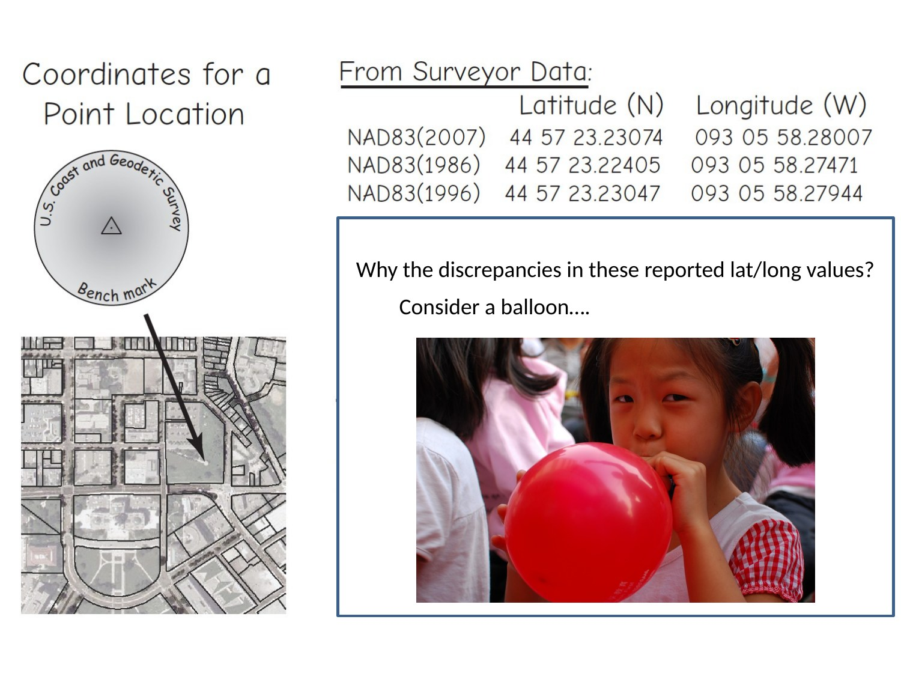

<!-- Why the discrepancies in these reported lat/long values? The same physical benchmark has three different NAD 83 coordinates, one per realisation. Think of a balloon: as you reshape it into slightly different ellipsoids, some points on the surface move closer together and some move further apart. The monument did not move; the reference surface did. A datum is an ellipsoid plus the anchoring that ties it to the actual Earth. -->

---

# NAD 83 (2007) versus NAD 83 (2011): horizontal

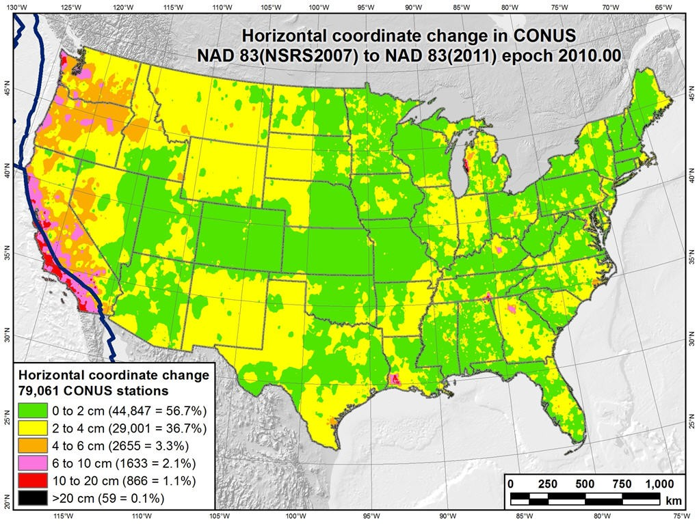

<!-- Horizontal coordinate change across 79,061 CONUS stations between the two realisations. Most of the country moved 0 to 4 cm; the west coast moved much more. Same datum name, different numbers. -->

---

# NAD 83 (2007) versus NAD 83 (2011): ellipsoid height

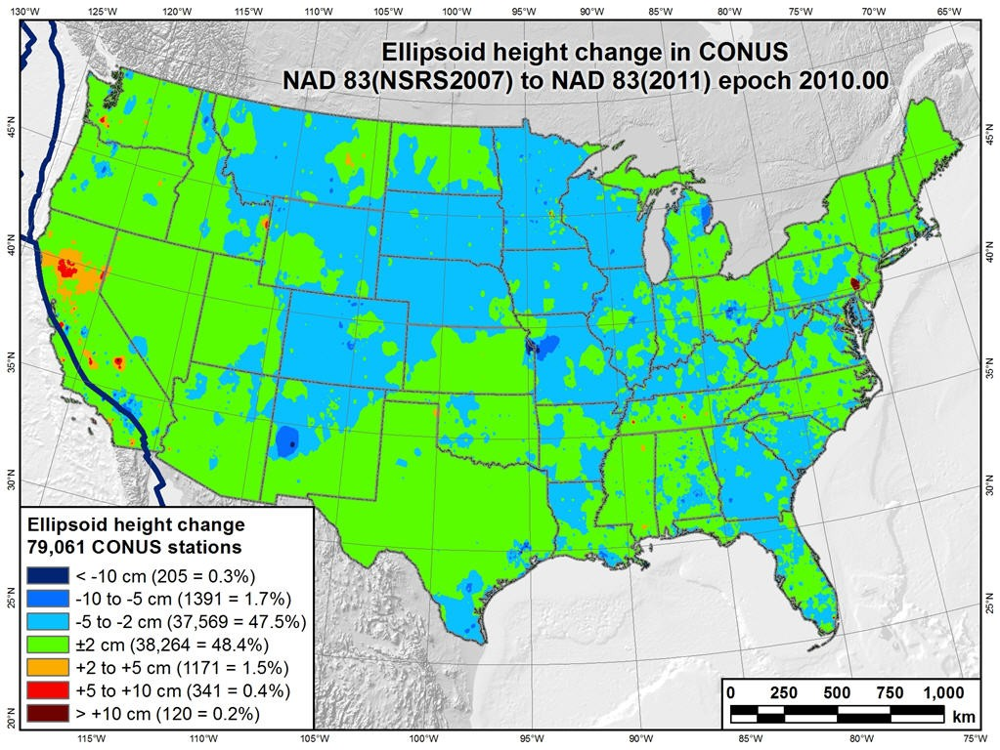

<!-- The same comparison for ellipsoid height. If your survey control is on one realisation and your GIS data is on another, you have a systematic offset that no amount of careful drafting will fix. Ask which realisation before you accept a control point. -->

---

# How to deal with it? Let the GIS handle it

In **QGIS**:

- **Project → Properties → CRS** sets the project CRS
- Layers keep their own CRS; QGIS reprojects **on the fly** for display
- **Layer → Set CRS** only *declares* a CRS — it does not move the data
- **Processing Toolbox → Reproject Layer** actually writes reprojected data
- If a layer is *declared* wrong, no transformation will save it

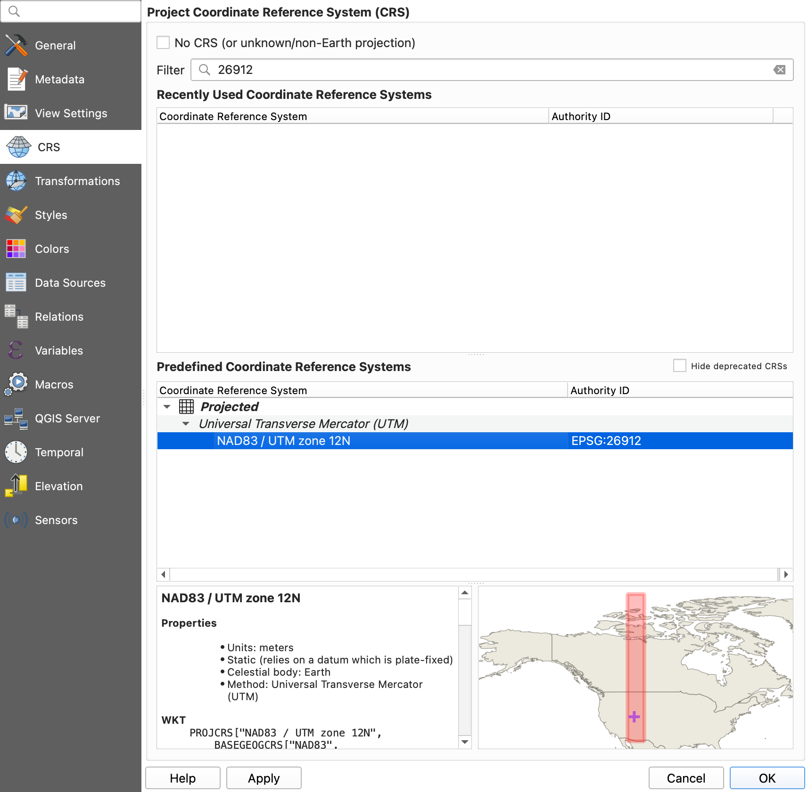

<!-- The screenshot is the QGIS 3.44 Project Properties, CRS page, filtered to 26912 with NAD83 / UTM zone 12N selected, the same dialog students use in Lab 4. Datum transformation choices live on the Transformations page just below it. Emphasise the distinction between declaring a CRS and reprojecting, because it is the single most common student mistake in Lab 7. -->

---

# Public Land Survey System (PLSS)

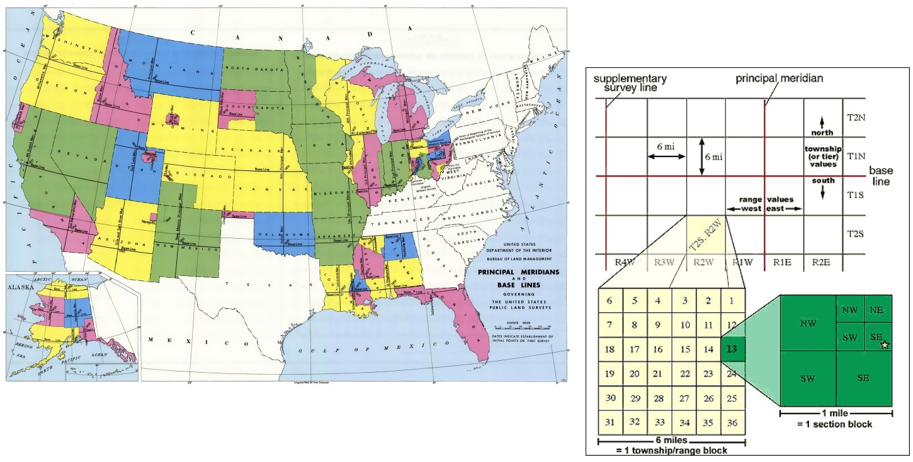

<!-- A lot of western U.S. civil engineering happens at the local scale using the PLSS: township, range, and section, measured from a principal meridian and base line. A section is one square mile and a township is 36 sections. It is not a coordinate system in the projected sense, but legal descriptions and parcel data are written in it, so you will meet it. -->

---

# Choosing a coordinate system

- Ask, in order:
  1. **Where** is the project, and how big is it?
  2. What am I going to **measure** — lengths, areas, angles?
  3. What CRS is my **incoming data** already in, and what does the client require?
- Rules of thumb:
  - Global or web display → **Web Mercator** (EPSG:3857); never compute area in it
  - Regional, a few hundred km → **UTM** zone, NAD 83 or WGS 84
  - A single U.S. state, survey-grade → **State Plane**, in that state's zone and units

<!-- Fourth rule of thumb, say it aloud: anything with lat/long in degrees is a geographic CRS, fine for storage and wrong for measurement. This is the slide that answers "what do I put in the QGIS box?" It is also, more or less, the rubric for the Lab 7 write-up. -->

---

<!-- _class: activity -->

# Thursday: hands-on in QGIS

- Explore projections in **QGIS**:
  - Set the **project CRS**, and see what changes
  - Inspect each **layer's CRS**, and see what does not change
  - Watch **on-the-fly reprojection** line up layers that are stored differently
  - **Reproject** a layer for real, and compare measured lengths and areas before and after
- Then **choose a projection for an engineering problem** and justify it

<!-- Preview of Thursday. Bring a laptop with QGIS. The choose-a-projection exercise is the bridge into Lab 7. -->

---

# Before Next Class

- Read **Chapter 3, *Geodesy, Datums, Map Projections, and Coordinate Systems***, in *GIS Fundamentals*
- Take **Quiz 6, Map Projections and Coordinate Systems**, open book, on Learning Suite — **due Saturday**
- **Lab 7: Projections and Coordinate Systems** — also **due Saturday**:
  [Lab 7 instructions](https://byu-hydroinformatics.github.io/cce114-geomatics/assignments/lab-07/)
- Bring your laptop with QGIS on Thursday
- Questions? Office hours: [calendly.com/dan-ames/office-hours](https://calendly.com/dan-ames/office-hours)

<!-- Confirm the Saturday due dates against Learning Suite before class. Point students at The True Size and the Jason Davies transitions page again; they are the fastest way to build intuition before the lab. -->

<!-- Conversion notes (2026-09-02): converted from "Coordinate Systems and Projections.pptx" (2021 archive, 51 slides). Dropped: source slide 8, a screenshot of the Flat Earth Society Facebook page showing the presenter's logged-in account, folded into a bullet on the Ferguson map slide; source slide 11, hidden in the original, an equal-area globe-drawing activity that could be restored if there is time. Added, not in the source: Today's Goals, geographic vs. projected coordinate systems, "every projection distorts something", the State Plane summary slide, "choosing a coordinate system", the Thursday preview, and Before Next Class. Software wording updated from ArcGIS to QGIS throughout. ArcGIS screenshots still in the deck: images/crs-arcgis-transformation-dialog.png on the "How to deal with it" slide, which needs a QGIS re-shoot. Open TODO: find a QGIS equivalent for the ArcGIS Pro Tissot-circle demo referenced on the "Things to play with" slide. -->

<!-- Update 2026-09-02: ArcGIS-era screenshots replaced with QGIS 3.44 captures made by tools/qgis_reshoot_screens.py: crs-qgis-project-crs-dialog.png replaces the ArcMap transformation dialog; Tissot TODO resolved via map-projections.net. -->
