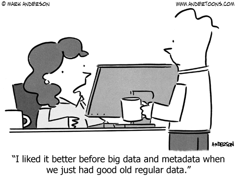
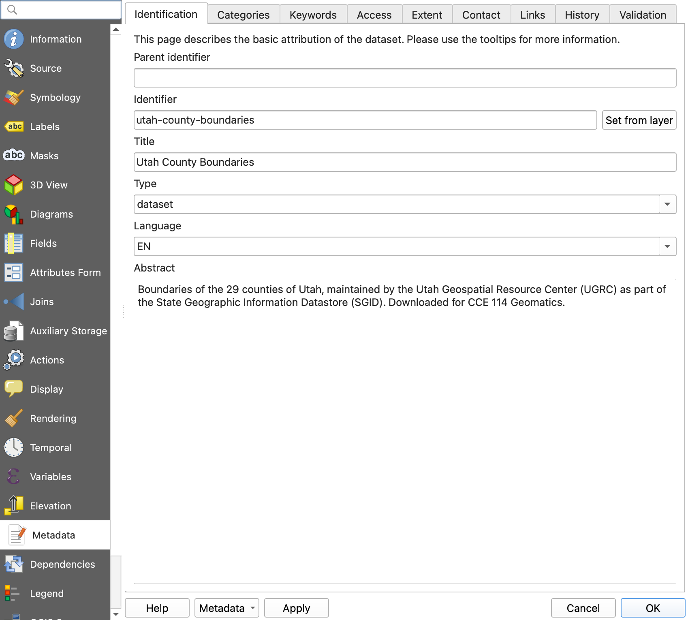

<!-- _class: lead -->
<!-- _paginate: skip -->


# Spatial Metadata

CCE 114 Geomatics
Dr. Dan Ames and Dr. James Halgren

<!-- Tuesday concept lecture, Week 9. Today is the "what and why" of metadata: what it is, what standards exist, and how to read a metadata record well enough to decide whether a dataset is safe to use. Thursday with Dr. Halgren is the hands-on version: creating and editing metadata in QGIS and evaluating real datasets on gis.utah.gov and data.gov. -->

---

# Today's Goals



By the end of class you should be able to:

- Say what **metadata** is, and why data without it is nearly useless
- Answer the six metadata questions: *what, where, when, why, how, who*
- Name the main metadata **standards**: FGDC CSDGM and ISO 19115
- Find where metadata **lives** in a download: `.xml`, `.qmd`, GeoPackage, `.prj`
- Read a metadata record and judge whether the data are **fit for your use**

<!-- Set expectations. This is the concepts day. Quiz 7 Part 1 covers the linked readings on what metadata is and on metadata standards, so much of today maps directly onto the quiz. -->

---

# Where does your spatial data come from?

<div class="columns" style="align-items:start;">
<div>

- **Digitize** — click on the map to draw your own features
  - How good can it be?
- **Download** — take someone else's data
  - Where do you get it?
  - **What *is* it?**
- **DGPS** — differential GPS field collection
  - Why differential?

</div>
<div>

- The first and third options, you did yourself, so you know how they were made
- The middle one is a stranger's work
- Today is about answering **"what is it?"** before you build anything on top of it

</div>
</div>

<!-- The three D's of acquiring vector data. Point out that when you digitize or survey, you carry the knowledge of how the data were made in your head. The moment you download somebody else's file, that knowledge has to travel with the file, and metadata is how it travels. -->

---

# Metadata: data about the data


<!-- Cartoon: "I liked it better before big data and metadata when we just had good old regular data." The joke works because metadata feels like paperwork right up until you need it. Andertoons cartoon from the original deck. -->

---

<!-- _class: quiz -->

# Would you drink it?


Poll:

<ol type="A">
<li>Yes</li>
<li>No</li>
</ol>

<!-- Show the unlabeled brown bottle. Take a quick show of hands. Almost nobody says yes. Ask why not - it might be perfectly good. You have no way to know. -->

---

# Would you drink it *now*?

<div class="columns">
<div>

- What's different?
- **Metadata!**
- Same liquid. The label tells you what is in it, who brewed it, what is *not* in it, and how to serve it

</div>
<div>


</div>
</div>

<!-- Same bottle, now with a label. The label is metadata: brand, ingredients, contents, serving instructions. The bottle did not change; your ability to decide about it did. The original speaker note quoted the manufacturer's marketing copy at length; the short version is that the label lists the ingredients, the brewing method, and how to serve it, which is exactly what a metadata record does for a dataset. -->

---

# A label is a metadata record

<div class="columns" style="align-items:start;">
<div>

**On the bottle**

- Brand and brewer
- Ingredients
- Volume and units
- "Serve chilled"
- Best-by date

</div>
<div>

**On a dataset**

- Title and originating agency
- Attributes and their meanings
- Coordinate system and units
- Use constraints and license
- Publication and revision dates

</div>
</div>

<!-- Draw the parallel line by line. Every field on the right exists for the same reason as the field on the left: so a stranger can decide whether to consume it. Ask which of the right-hand items would worry them most if it were missing. -->

---

# Why metadata?

<a href="https://youtu.be/N2zK3sAtr-4" target="_blank">


</a>

<p style="text-align:center;font-size:0.7em;margin-top:0;"><a href="https://youtu.be/N2zK3sAtr-4" target="_blank">youtu.be/N2zK3sAtr-4</a></p>

<!-- Short animated video, about 4:40. Click the thumbnail to open it in a new tab. A researcher asks a colleague for data and gets a file that nobody can interpret. -->

---

<!-- _class: quiz -->

# Discussion


- Why can't the panda use the data?
- What kind of metadata would make the file useful?
- Why do scientists, researchers, students, and engineers so often *not* write metadata?

<!-- Let the third question run. Usual answers: no time, the project is over, "I know what it means," nobody asked, it was never budgeted. Then point out that in every one of those cases the person who suffers is the next engineer, who is often you six months later. -->

---

# When metadata is missing: Mars Climate Orbiter

<div class="columns" style="align-items:start;">
<div>

- 1999: NASA lost a **$125 million** spacecraft
- Ground software delivered thruster data in **English units**
- The onboard software expected **metric**
- Nobody wrote down which

</div>
<div>

- The numbers were not wrong
- The numbers were **undocumented**
- One missing line of metadata, one lost mission
- Your freeway alignment has the same failure mode

</div>
</div>

<!-- This example also appears in the Lab 8 background reading. The point is not that engineers are careless; the point is that units, datums, and coordinate systems are exactly the kind of thing that is obvious to the person who made the file and invisible to everyone else. -->

---

<!-- _class: lead -->

# What goes into a metadata record?

---

# A brief metadata melodrama

<div class="columns">
<div>

- A short, silly story about what happens when data has no documentation
- Read it here: <a href="http://t.ly/rPYx" target="_blank">t.ly/rPYx</a>
- Then we will name the six questions every metadata record answers

</div>
<div>


</div>
</div>

<!-- "A brief metadata melodrama" is linked from the Day 16 page on the course site: http://t.ly/rPYx. Walk through a few slides of it live if there is time, or assign it as a two-minute read. The illustration is the hero, Metadata, tied to the tracks by the villain. -->

---

# The six questions: what, where, when

<div class="columns" style="align-items:start;">
<div>

**What?**

- What do the data represent?
- What is the file format?
- What do the attribute columns mean?

**Where?**

- Where were the data collected?
- What area do they cover?
- What coordinate system and units?

</div>
<div>

**When?**

- When were the data collected?
- When were they last updated?
- How often are they revised?

</div>
</div>

<!-- Have students call out a dataset from Lab 7 and answer these three for it out loud. Most will stall on "what do the attribute columns mean," which is the single most common gap in real-world metadata. -->

---

# The six questions: why, how, who

<div class="columns" style="align-items:start;">
<div>

**Why?**

- What was the intended purpose?
- Why was the dataset created in the first place?

**How?**

- How were the data created?
- What collection method?
- What geoprocessing steps came after?

</div>
<div>

**Who?**

- Which organization collected the data?
- Which individuals?
- Who do you email when something looks wrong?

</div>
</div>

<!-- "Why" is the field students skip and professionals read first: data collected for a statewide overview map is not automatically valid for a site-scale design. "How" is the lineage, and it is what lets you decide whether you trust the numbers. -->

---

# Fit for *its* purpose is not fit for *yours*

- A parcel layer digitized for **tax assessment** is not a survey boundary
- A statewide roads layer at **1:100,000** will not place a curb
- A land-cover raster from **2011** will not show last year's subdivision
- Nothing here is wrong data. It is **right data, wrong job**
- The metadata is what lets you catch that before you design against it

<!-- This is the sentence to repeat all semester. Almost no engineering GIS disaster comes from data that was wrong; most come from good data used outside its intended purpose, scale, or era. -->

---

<!-- _class: lead -->

# Metadata standards and styles

---

# Why standardize metadata at all?

<div class="columns" style="align-items:start;">
<div>

- If everyone invents their own fields, nothing is **searchable**
- A standard fixes the **field names**, so software can index them
- It fixes the **expected content**, so a "date" is a date
- It makes records **portable** between agencies and software

</div>
<div>

- A **standard** says what has to be there
- A **style** or **profile** says how one organization fills it in
- Same idea as a survey report template: fixed headings, local content

</div>
</div>

<!-- The library-catalog analogy works well: a card catalog is only useful because every card has the same fields in the same places. A metadata standard is a card catalog for data. -->

---

# FGDC CSDGM: the U.S. federal standard

- **Content Standard for Digital Geospatial Metadata**, from the Federal Geographic Data Committee
- Executive Order 12906 (1994) told federal agencies to document geospatial data this way as part of the National Spatial Data Infrastructure
- Current version is FGDC-STD-001-1998
- Usually travels as a sidecar **`.xml`** file next to the shapefile
- Still everywhere: most Utah and federal downloads you open this semester are FGDC

<!-- This is the standard the students will actually meet in Lab 8: the Utah County Boundaries download ships an FGDC XML file alongside the shapefile. Since 2010 the FGDC has endorsed the ISO standards and encouraged agencies to migrate, but the installed base of FGDC records is enormous, so you still have to be able to read one. -->

---

# The seven sections of an FGDC record

<div class="columns" style="align-items:start;">
<div>

1. **Identification** — title, abstract, purpose, keywords, bounding coordinates
2. **Data Quality** — accuracy, completeness, **lineage**
3. **Spatial Data Organization** — points, vectors, or raster cells
4. **Spatial Reference** — projection, datum, units

</div>
<div>

5. **Entity and Attribute** — what each column and code means
6. **Distribution** — where to get it, format, constraints
7. **Metadata Reference** — who wrote *the metadata*, and when

</div>
</div>

<!-- Section 5 is the one nobody fills in and everybody needs. Section 7 matters more than it looks: a 1998 metadata record attached to a 2024 dataset is a warning sign. -->

---

# What an FGDC record looks like inside

```xml
<metadata>
  <idinfo>
    <citation><citeinfo>
      <origin>Utah Geospatial Resource Center</origin>
      <pubdate>20240115</pubdate>
      <title>Utah County Boundaries</title>
    </citeinfo></citation>
    <descript><abstract>...</abstract><purpose>...</purpose></descript>
    <spdom><bounding><westbc>...</westbc><eastbc>...</eastbc></bounding></spdom>
  </idinfo>
  <metainfo><metd>20240115</metd></metainfo>
</metadata>
```

<!-- Generic skeleton, not a real record: the point is the shape, not the values. Tell students the search terms from Lab 8: Ctrl+F for "metd" to find the metadata date, and "bounding" to find the extent. XML is verbose but it is plain text, so you can always read it in a browser or a text editor. -->

---

# ISO 19115: the international standard

- **ISO 19115, *Geographic information — Metadata***, is the international equivalent
- Revised as **ISO 19115-1**; the XML encodings are ISO 19139 and ISO 19115-3
- Richer and more structured than FGDC, and organized in a similar way: identification, quality, spatial representation, reference system, distribution
- Used across Europe, Australia, Canada, and increasingly by U.S. federal agencies
- **QGIS layer metadata follows the ISO 19115 model**, which is why the panel you will use Thursday has fields like *Identification, Extent, Access, Fields, History*

<!-- The practical takeaway for this class: FGDC and ISO ask the same six questions with different tag names. If you can read one you can read the other. QGIS chose ISO, which is one reason FGDC .xml files do not import cleanly into QGIS. -->

---

# Other styles you will meet

<div class="columns" style="align-items:start;">
<div>

- **Dublin Core** — 15 general-purpose elements (title, creator, date, rights…). Not spatial, but it underlies a lot of catalogs
- **DCAT / Project Open Data** — the schema behind [data.gov](https://www.data.gov)

</div>
<div>

- **STAC** — SpatioTemporal Asset Catalog, used for satellite and drone imagery collections
- **Esri metadata styles** — ArcGIS can write FGDC, ISO, or its own style; the same record, different export

</div>
</div>

<!-- Do not memorize this list. Recognize the names so that when a download says "ISO 19139 metadata" or "STAC catalog" you know it is the same six questions in a different wrapper. -->

---

# Where does the metadata actually live?

<div class="columns" style="align-items:start;">
<div>

- **Shapefile** — sidecar `.xml` beside the `.shp`, plus the `.prj` that holds the coordinate system
- **GeoPackage** — stored *inside* the `.gpkg` file
- **QGIS layer** — a `.qmd` sidecar file, or inside the project file

</div>
<div>

- **Web service** — returned in the service's `GetCapabilities` or item page
- **Data portal** — on the download page itself
- If you unzip a download and never open anything but the `.shp`, you threw the metadata away

</div>
</div>

<!-- Practical and worth emphasizing: the metadata is usually already in the folder they downloaded. Lab 8 has them open the XML in a browser. Also flag the format mismatch: an FGDC .xml from Utah's portal does not import automatically into QGIS the way it does into ArcGIS Pro, which is why Lab 8 has them create metadata by hand. -->

---

# Metadata in QGIS: Layer Properties > Metadata



<!-- QGIS 3.44 Layer Properties, Metadata page, for the UGRC Utah County Boundaries layer with the identification fields filled in. Right-click a layer, Properties, Metadata, and you get the ISO-style tabs: identification, categories, keywords, access, extent, contact, links, history, validation. Dr. Halgren walks through it on Thursday. -->

---

<!-- _class: lead -->

# Reading metadata: is this data fit for use?

---

# A fitness-for-use checklist

<div class="columns" style="align-items:start;">
<div>

1. **Scale / resolution** — what is the smallest thing this can represent?
2. **Date** — when collected, when updated?
3. **CRS and units** — projection, datum, feet or meters?
4. **Completeness** — is anything missing or unmapped?

</div>
<div>

5. **Accuracy and lineage** — how was it made, and from what?
6. **Attributes** — is every column defined?
7. **Constraints** — license, restrictions, required credit
8. **Contact** — who answers questions?

</div>
</div>

<!-- Tell them to run this list on the datasets in Lab 8 and again on every dataset in the site-selection project later in the semester. Anything you cannot answer from the metadata is a risk you are carrying into your design. -->

---

<!-- _class: quiz -->

# Which dataset would you use?

You are laying out a new road west of Lehi and you need building footprints.

<div class="columns" style="align-items:start;">
<div>

**Dataset A**
Collected 2013, 1:24,000, no lineage given, no contact

</div>
<div>

**Dataset B**
Collected 2024, from 6-inch imagery, lineage documented, county GIS contact listed

</div>
</div>

<ol type="A">
<li>A</li><li>B</li><li>Either</li><li>Neither, until you check something else</li>
</ol>

<!-- Hypothetical example. B is the obvious answer, but push on D: you still do not know either dataset's coordinate system or use constraints from what is printed here, and a 2024 footprint layer digitized for planning purposes is still not a survey. The habit to build is "what did the metadata not tell me?" -->

---

# Worked example: Utah County Boundaries

<div class="columns" style="align-items:start;">
<div>

- Download the shapefile from the Utah portal
- Unzip it and open the `.xml` in a browser: it is plain text
- Search for **`UGRC`** to find *who*
- Search for **`metd`** to find *when* — the metadata date, written `YYYYMMDD`

</div>
<div>

- Search for **`bounding`** to find *where*
- Read the abstract and keywords for *what*
- Read the purpose for *why*
- The coordinate system is **not** in the XML — it is in the `.prj` file in the same folder

</div>
</div>

<!-- This is Part 1 of Lab 8, so treat it as a preview and let them follow along if they have laptops open. The .prj point catches almost everyone: the CRS lives in a separate file from the rest of the metadata. -->

---

# Where to find data *with* metadata

<div class="columns" style="align-items:start;">
<div>

**[gis.utah.gov/data](https://gis.utah.gov/data/)**

- Utah Geospatial Resource Center (UGRC, formerly AGRC)
- The state's official clearinghouse for spatial data, and one of the oldest in the country
- Nearly everything ships with a metadata record

</div>
<div>

**[data.gov](https://www.data.gov)**

- The U.S. federal open-data catalog
- Hundreds of thousands of datasets, wildly varying metadata quality
- Great practice at deciding what you cannot trust

</div>
</div>

<!-- Browse one dataset on each site live if there is time. Quiz 7 Part 2 sends students to both of these, so it is worth two minutes of screen time each. -->

---

<!-- _class: activity -->

# In-class activity: What I learned about metadata

<div class="columns" style="align-items:start;">
<div>

- Write down **a couple of things you learned about metadata today**
- One of them should be something you will actually check the next time you download data
- Record your completion on **Learning Suite**

</div>
<div>

- Prompts if you are stuck:
  - Which of the six questions do you most often skip?
  - What is the difference between FGDC and ISO 19115?
  - Where would you look for the CRS?

</div>
</div>

<!-- Give five minutes. Collect two or three answers out loud before the Thursday preview. Completion is recorded on Learning Suite. -->

---

# Thursday with Dr. Halgren

- **Creating and editing metadata in QGIS**: Layer Properties > Metadata
- Filling in identification, extent, contacts, and history for a layer you made
- Saving metadata as a `.qmd` file so it travels with the data
- **Finding and evaluating datasets** on [gis.utah.gov](https://gis.utah.gov/data/) and [data.gov](https://www.data.gov)
- Bring your laptop with QGIS 3.44 LTR installed

<!-- Preview of Day 17. Dr. Halgren runs the hands-on session; students write metadata rather than just read it. -->

---

# Before Next Class

- Do the linked readings for **Quiz 7: Metadata** — Part 1 is what metadata is and metadata standards; Part 2 sends you to [gis.utah.gov/data](https://gis.utah.gov/data/) and [data.gov](https://www.data.gov)
- **Quiz 7** and **[Lab 8: Metadata](https://byu-hydroinformatics.github.io/cce114-geomatics/assignments/lab-08/)** are due **Saturday, 11:59 pm**
- **Quiz 8** opens Thursday — start it early
- Record today's activity on Learning Suite
- Questions? Office hours: [calendly.com/dan-ames/office-hours](https://calendly.com/dan-ames/office-hours)

<!-- Confirm the exact Saturday date before class. Remind them that Lab 8 Part 1 is the Utah County Boundaries XML we just previewed, so it should go quickly if they were paying attention. -->

<!-- Conversion notes (2026-09-02): built from Metadata.pptx (2025, 9 slides), supplemented by "9 - Finding Spatial Data Part 1 - Metadata.pptx" (2017) for the UGRC/gis.utah.gov material. Dropped from the source: nothing substantive; the 2017 deck's AGRC logo image and its Google-Docs class-activity slide were dropped (dead goo.gl link, replaced by the current Learning Suite activity), and the 2025 deck's "Day 2 – But How?" slide became the Thursday preview. The FGDC/ISO 19115 standards section, the Mars Climate Orbiter slide, the fitness-for-use checklist, and the Utah County Boundaries worked example are new material written for this deck, drawn from the Day 16 topic list and the Lab 8 background. No ArcGIS screenshots in this deck: the one software screenshot (images/md-qgis-metadata-panel.jpg) is QGIS, but from an older 2.x-era release, so it is worth re-shooting in QGIS 3.44 LTR when convenient. TODO: confirm the Saturday due date and the Quiz 7 reading links before class. -->

<!-- Update 2026-09-02: ArcGIS-era screenshots replaced with QGIS 3.44 captures made by tools/qgis_reshoot_screens.py: md-qgis-metadata-panel.png re-shot in QGIS 3.44. -->
