<!-- _class: lead -->
<!-- _paginate: skip -->

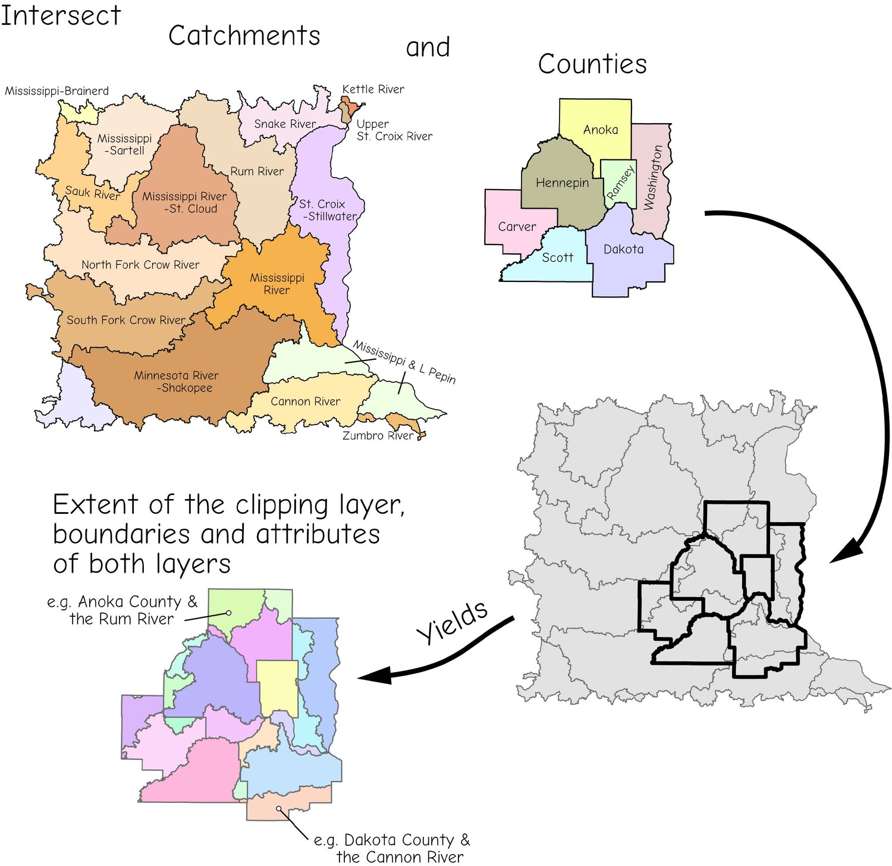

# Solving Spatial Problems with Geoprocessing

CCE 114 Geomatics
Dr. Dan Ames and Dr. James Halgren

<!-- Tuesday concept lecture, Week 10. Today is the vocabulary and the logic of geoprocessing: what the common tools do and how you chain them together. Thursday, Dr. Halgren runs the same ideas as a hands-on QGIS session, and Lab 9 (The Yellowstone Disaster) is the graded version. -->

---

# Today's Goals

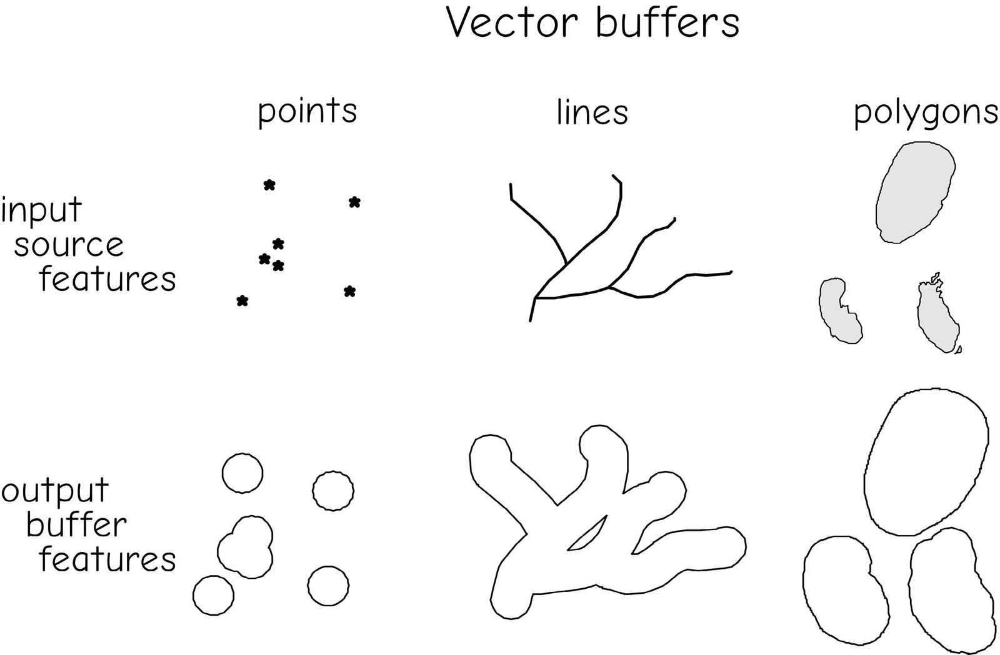

By the end of class you should be able to:

- Describe the **geographic approach** to solving a problem, from question to action
- Say what **geoprocessing** is: input data in, a tool, new data out
- Explain what **buffer**, **clip**, **intersect**, **union**, **difference** and **select by location** each do
- Match each overlay tool to its **Boolean operation** (AND, OR, NOT)
- Chain three tools into a **workflow** that answers a real question
- Find these tools in the QGIS **Processing Toolbox**

<!-- Set expectations. This is the concepts day. The tools are simple one at a time; the skill we are after is choosing the right one and putting them in the right order. -->

---

# Where We Are So Far…

- Basic GIS data types
- Cartography
- Coordinate systems and map projections
- Creating data
  - Survey / GPS
  - Discover and download

But what can you do with it?

<!-- Everything so far has been about getting data into the GIS and drawing it correctly. Ten weeks of building a map library. Today we finally ask the payoff question: now that you have the data, what can you actually compute with it? -->

---

<!-- _class: lead -->

# Map it. Query it. **Analyze it.**

## Geoprocessing is the third one

<!-- The source deck used three logos here: "Map it", "query-it" and "Analyze It". Making a map is display. Querying is asking about what is already in the table. Geoprocessing is analysis: it makes brand new data that did not exist before you ran the tool. -->

---

<!-- _class: lead -->

# Part 1

## The geographic approach to problem solving

---

# The Geographic Approach

<table style="font-size:0.62em;">
<tr style="background:#002e5d;color:#fff;"><th style="width:20%;">Step</th><th>What it means</th><th style="width:32%;">Example</th></tr>
<tr><td><strong>1. Ask</strong> a geographic question</td><td>Frame the problem from a location-based perspective: how does where something is affect its relationship to other features?</td><td>Where is the best location for a new store? Which facilities are at risk from storm surge?</td></tr>
<tr><td><strong>2. Acquire</strong> geographic data</td><td>Get the data you need to support the analysis.</td><td>Capture with GPS, buy it, download it, or digitize new data yourself in QGIS.</td></tr>
<tr><td><strong>3. Examine</strong> the data</td><td>Decide whether the data you found will actually support the analysis.</td><td>Is the CRS right for this area and this measurement? Are the attributes you need in the table?</td></tr>
<tr><td><strong>4. Analyze</strong> the information</td><td>Choose an approach and run it. Geoprocessing tools read data and create <em>new</em> data.</td><td>Select by location, buffer, clip, intersect.</td></tr>
<tr><td><strong>5. Act</strong> on the knowledge</td><td>Present or share the result. Acting often raises the next question.</td><td>Build a map layout, export a PDF, share the layers, refine the criteria and run it again.</td></tr>
</table>

<!-- Rebuilt from the Esri "geographic approach" table in the source deck, with the ArcGIS/ArcMap references changed to QGIS. Walk the five steps quickly; the next four slides are one worked example of steps 1 through 4. Notice step 3 is the one students skip, and it is the one that wastes their afternoon when the CRS is in degrees and the buffer tool wants meters. -->

---

# Step 1: Ask a Geographic Question

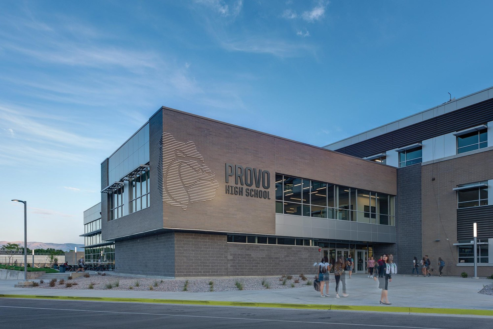

## How many schools are in Utah County?

- Simple to say, and it has a **location** in it: *in Utah County*
- That phrase is the whole analysis. A computer cannot read "in"
- We have to turn "in Utah County" into an operation on geometry

<!-- Provo High School. Start with a question a normal person would ask. The GIS work is entirely about translating the little preposition "in" into something a computer can execute, which turns out to be select by location. -->

---

# Step 2: Acquire Geographic Data

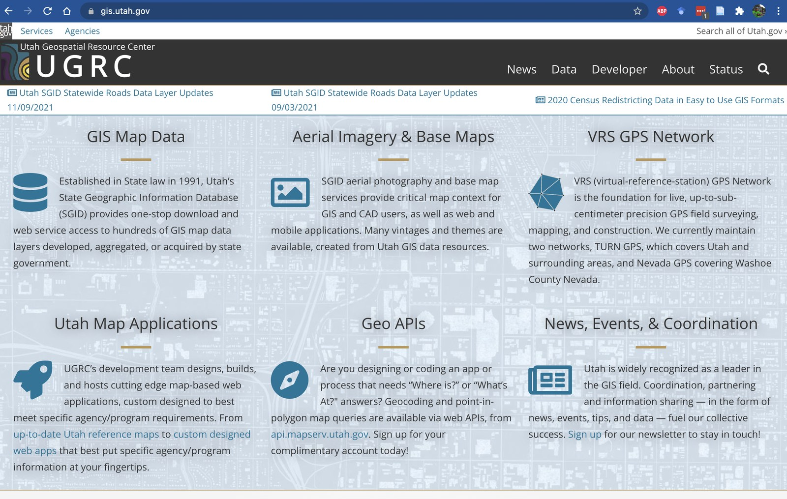

What datasets should we be looking for?

- **Utah schools** — points
- **Utah counties** — polygons
- Anything else?

Utah's data lives at the **Utah Geospatial Resource Center** (gis.utah.gov), the same portal you used in earlier labs.

<!-- Ask the class to name the layers before you show them. Two layers is the whole answer here: the things you are counting, and the area you are counting them inside. Nearly every spatial question decomposes that way. -->

---

# Step 3: Will the Data Support the Analysis?

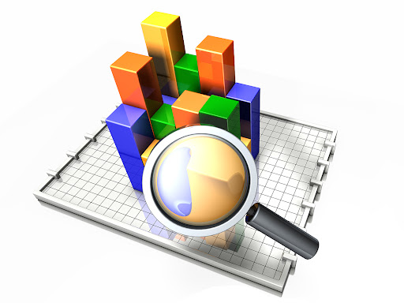

- Read the **metadata**
- View the **attribute table**
- Check the **extents** — does it cover your study area?
- Are there **data use limits**?
- Is the dataset **current**?
- What else?

<!-- This is the step everyone wants to skip. Add one more to the list out loud: what coordinate reference system is it in? A layer in geographic coordinates is measured in degrees, and you cannot buffer degrees by 10 kilometers. Lab 9 makes students reproject a road layer for exactly this reason. -->

---

# View the Attribute Table

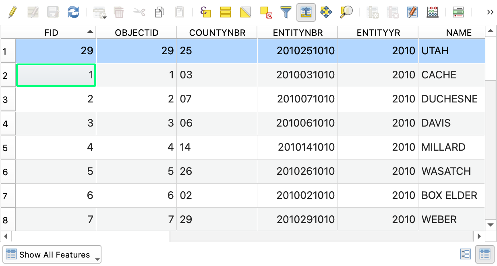

Every polygon is a row. To find Utah County, we need the row where the county name is `UTAH`.

<!-- The UGRC Utah county boundaries attribute table in QGIS 3.44, with the Utah row selected and moved to the top. The point of the screenshot is that the geometry and the table are the same object seen two ways: highlight a row and the polygon lights up. -->

---

# Select by Attribute: Find Utah County

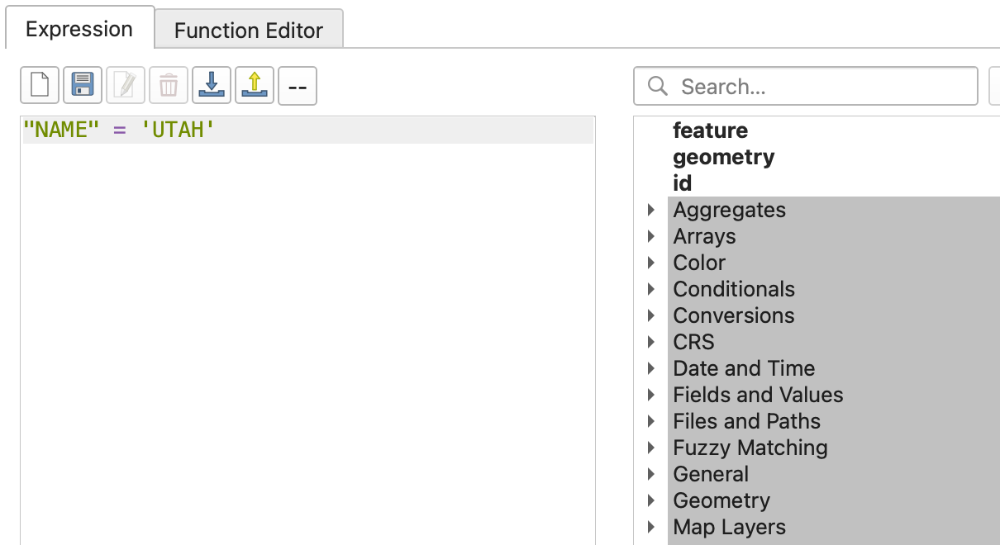

- A query on the **table**, not on the map: `"NAME" = 'UTAH'`
- In QGIS: **Select by Expression**, or *Processing Toolbox ▸ Vector selection ▸ Select by attribute*
- The result is one selected polygon

<!-- An attribute query knows nothing about geography; it is a database WHERE clause that happens to select shapes. This is the QGIS 3.44 Select by Expression dialog with "NAME" = 'UTAH' typed in; Select Features at the bottom right runs it. -->

---

# Select by Location: Schools in Utah County

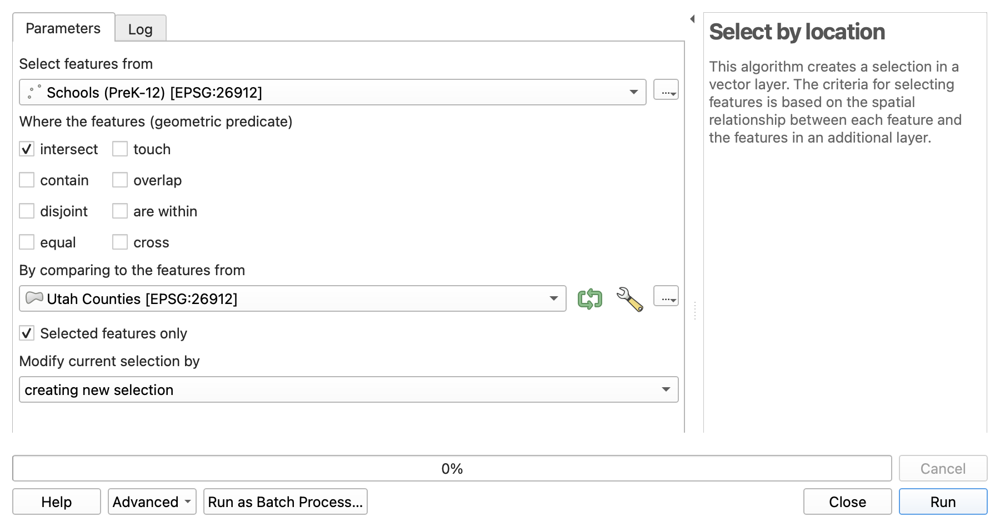

**Select by location** uses geometry, not attributes: give it a target layer, a source layer, and a spatial relationship — *intersects*, *within*, *touches*, *contains*.

<!-- Here is the answer to "how many schools are in Utah County": select the schools whose points fall within the selected county polygon, then read the count at the bottom of the attribute table. This is the first genuinely spatial operation of the day. This is the QGIS 3.44 Select by Location dialog (Vector ▸ Research Tools), set to select the PreK-12 schools that intersect the selected Utah County feature; point out the Selected features only checkbox. -->

---

<!-- _class: lead -->

# Part 2

## Common spatial analyses and Boolean operations

---

# Reclassify: Continuous Values to Classes

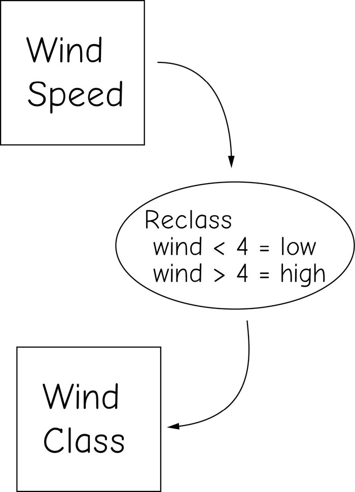

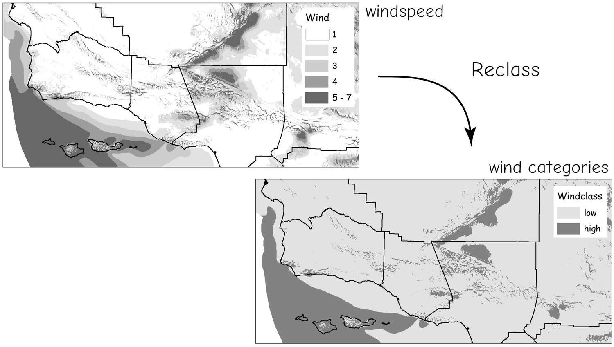

Windspeed values 1–7 become two classes: **low** (< 4) and **high** (≥ 4).

<!-- Reclassify takes one input layer and a rule table and writes a new layer. Nothing moves; only the values change. It throws information away on purpose, because "high wind" is the thing you can act on and "4.7 m/s" is not. In QGIS: Processing Toolbox ▸ Raster analysis ▸ Reclassify by table. Lab 9 opens with exactly this tool. -->

---

# Reclassify: Population Density

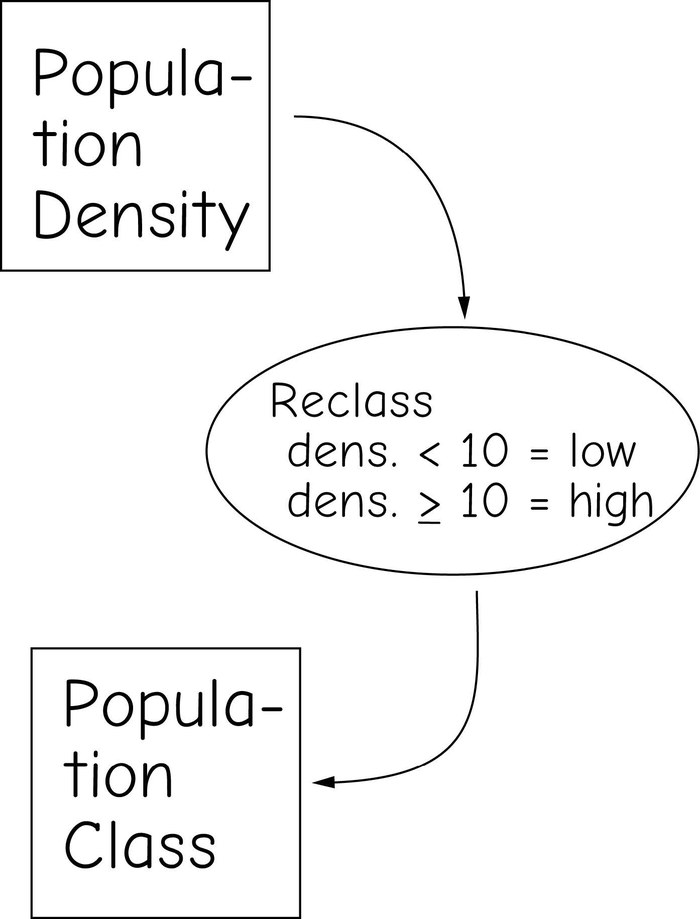

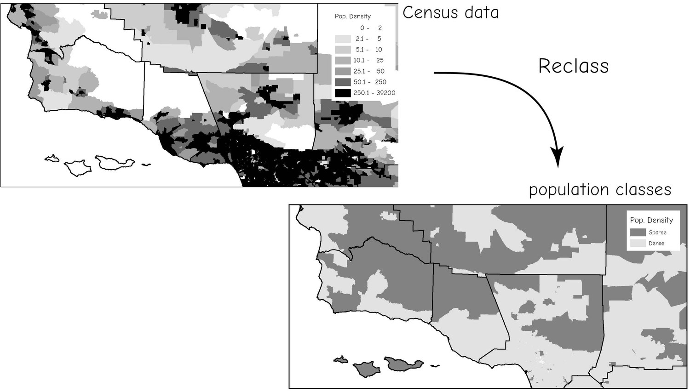

Census population density becomes **sparse** and **dense**, using a threshold of 10 people per unit area.

<!-- Same tool, different data. Ask the class where the threshold came from. Somebody chose 10. Every reclassification embeds a judgement call, and it belongs in your metadata and your map's text box. -->

---

# Buffer: A Zone of Influence

A buffer takes **points, lines or polygons** and returns **polygons**: everything within a given distance of the input.

<!-- Buffer is the workhorse. Points give circles, lines give ribbons, polygons give fattened polygons. Two things to stress: the output is always polygons, and the distance is in the units of the layer's CRS, so a layer in degrees has to be reprojected first. Also mention Dissolve: overlapping buffers stay as separate features unless you check "Dissolve result", which merges them into one. -->

---

<!-- _class: quiz -->

# Boolean Operations

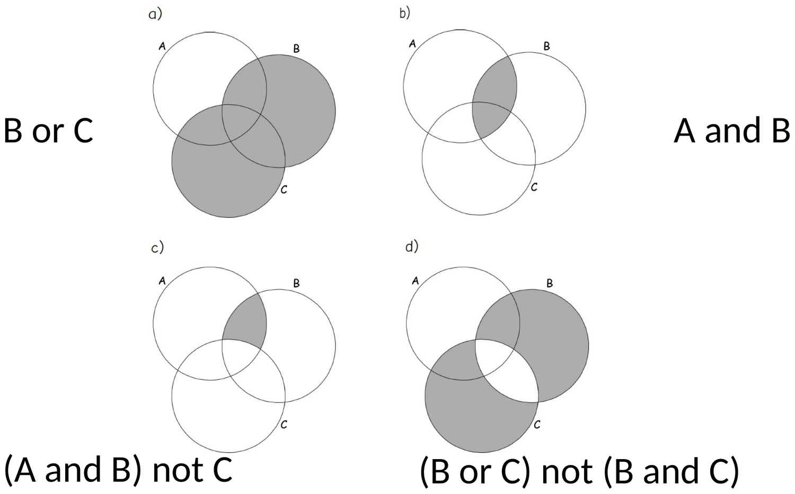

Four shaded regions, four Boolean expressions. Match them up:

<ol type="A">
<li>B or C</li>
<li>A and B</li>
<li>(A and B) not C</li>
<li>(B or C) not (B and C)</li>
</ol>

<!-- Work left to right across the panels and let the class call out the expressions. Answers, clockwise from top left: a) B or C, b) A and B, d) (B or C) not (B and C), c) (A and B) not C. The vocabulary matters because the overlay tools are these operations with geometry attached. -->

---

<!-- _class: quiz -->

# Boolean Operations, Continued

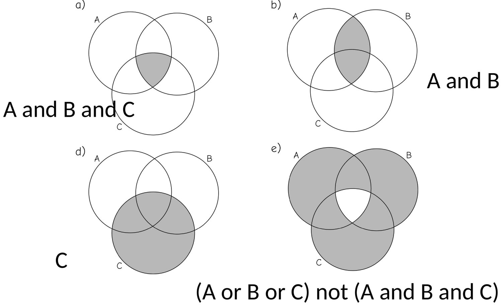

Five panels this time. Which expression goes with which shaded region?

<ol type="A">
<li>A and B and C</li>
<li>A and B</li>
<li>C</li>
<li>(A or B or C) not (A and B and C)</li>
</ol>

<!-- Same drill, harder set. Note that "C" on its own is a legitimate answer: not every operation involves two layers. Keep this diagram in mind; we come back to it at the end of Part 2 with the tool names written on top. -->

---

<!-- _class: quiz -->

# Erase

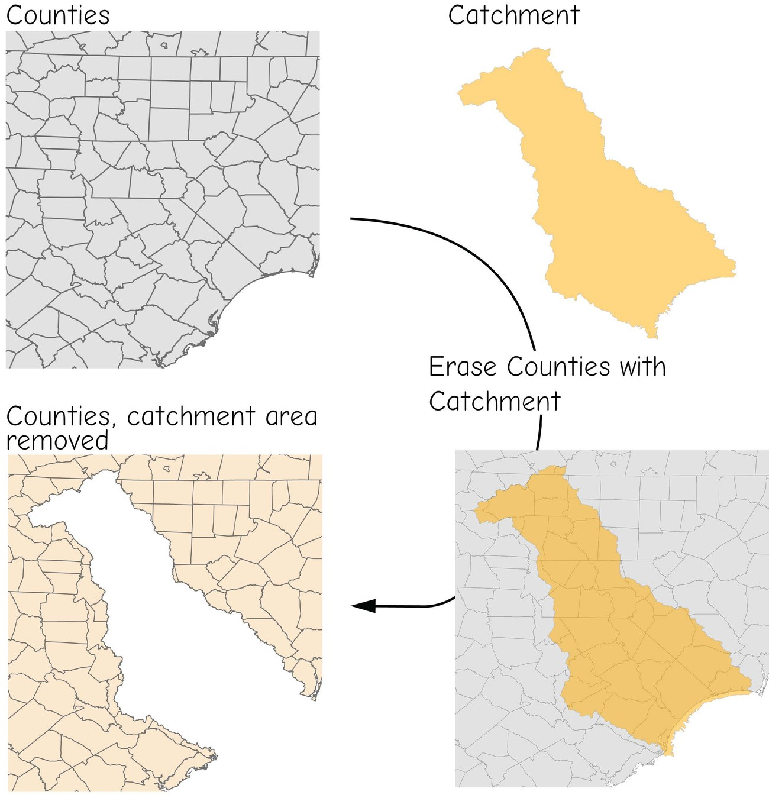

Erase the catchment from the counties layer: keep everything that is **NOT** in the overlay.

**Which Boolean operation is like "Erase"?**

*(Counties NOT Catchment)*

<!-- Answer: NOT. The counties layer comes out with a hole in it exactly the shape of the catchment. In QGIS this tool is called Difference, not Erase: Processing Toolbox ▸ Vector overlay ▸ Difference. Lab 9 Part 3 uses it to cut the ground crew's 5 km road buffer out of the park polygon, leaving the helicopter search area. -->

---

# Intersect: Keep Only the Overlap

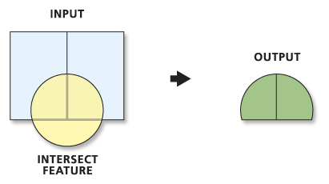

Two input layers in, one output layer of just the shared area — carrying the **attributes of both** inputs.

<!-- The classic picture: a rectangle and a circle in, the lens-shaped overlap out. Notice the vertical line through the middle survives in the output, because the rectangle was two features. Intersect preserves the boundaries and the attribute columns of both layers. -->

---

<!-- _class: quiz -->

# Intersect

Intersect the catchments with the counties: every output polygon knows **which county** and **which catchment** it belongs to.

**Which Boolean operation is like "Intersect"?**

*(Counties AND Catchments)*

<!-- Answer: AND. Point at the output: Anoka County and the Rum River watershed becomes its own polygon, and the table has both names on that row. That is what makes intersect useful for "how much of this is in that" questions. -->

---

# Clip vs. Intersect

**Clip** — a cookie cutter

- Keeps the geometry of the **input** layer
- Keeps only the **input's** attributes
- The overlay layer is just a shape to cut with

**Intersect** — a true overlay

- Keeps the geometry of the **overlap**
- Keeps the attributes of **both** layers
- Use it when you need to know what came from where

Same picture, different table. Ask yourself: *do I need the second layer's attributes, or just its outline?*

<!-- This is the distinction students get wrong most often, and it is worth two minutes. If you only want "the roads inside the park", clip. If you want "the roads inside the park, tagged with which park", intersect. Both live in Processing Toolbox ▸ Vector overlay. Lab 9 uses Clip to trim the national park boundaries down to the state of Idaho. -->

---

# Union: Keep Everything

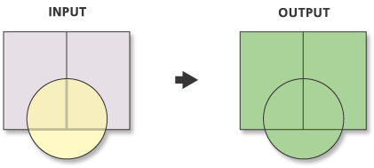

Both layers in, and **everything** comes out — the overlap and both non-overlapping remainders, split along every boundary.

<!-- Union is the greedy one: no geometry is thrown away, but every input is cut wherever the other layer's boundary crosses it. Output attribute rows have empty cells where a feature only existed in one of the two inputs. Note QGIS calls it Union too, in Vector overlay. -->

---

<!-- _class: quiz -->

# Union

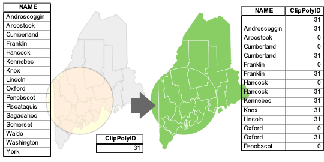

**Which Boolean operation is like "Union"?**

*(Circle OR Counties)*

<!-- Answer: OR. Look at the output table on the right: every county is there, plus a ClipPolyID column that is 31 where the circle overlapped and 0 where it did not. Nothing was deleted; the layers were merged and the boundaries were cut into each other. -->

---

# The Three Operations, Named

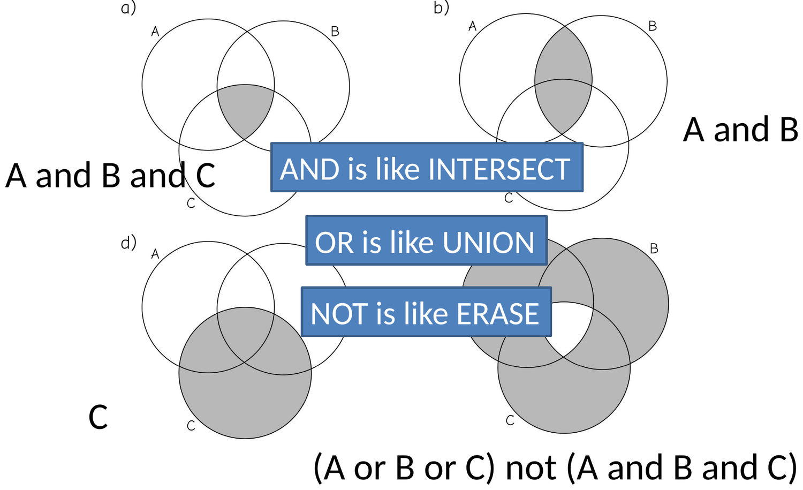

<!-- The payoff slide for Part 2. AND is intersect, OR is union, NOT is erase (called Difference in QGIS). If students remember only one slide from today, this is a good candidate. Everything in Part 3 is these three plus buffer, run in the right order. -->

---

# Finding the Tools in QGIS

Open the **Processing Toolbox**
*(View ▸ Panels ▸ Processing Toolbox)*, then type the tool name in the search box.

The old ArcGIS name is on the left; what QGIS calls it is on the right.

| ArcGIS | QGIS |
| --- | --- |
| ArcToolbox | **Processing Toolbox** |
| Buffer | Buffer *(Vector geometry)* |
| Clip | Clip *(Vector overlay)* |
| Intersect | **Intersection** *(Vector overlay)* |
| Union | Union *(Vector overlay)* |
| **Erase** | **Difference** *(Vector overlay)* |
| Dissolve | Dissolve *(Vector geometry)* |
| Select by Location | Select by Location *(Vector selection)* |
| Reclassify | Reclassify by Table *(Raster analysis)* |

<!-- Added for the QGIS version of the course. Two gotchas worth saying out loud: Erase is called Difference, and Intersect is called Intersection. Also mention that "Select by location" only highlights features, while "Extract by location" writes them to a new layer, which is usually what you actually want. -->

---

<!-- _class: lead -->

# Part 3

## Geoprocessing workflows

---

# Geoprocessing Workflows

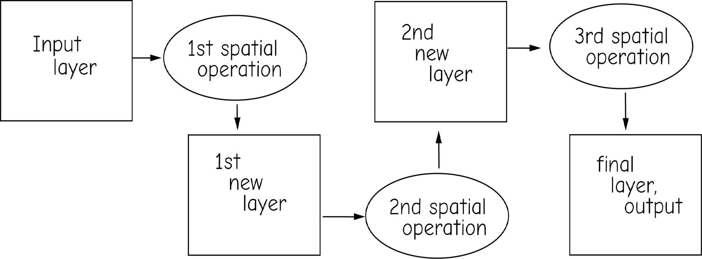

One tool rarely answers a real question. The **output of one tool becomes the input of the next**.

<!-- Rectangles are layers, ovals are operations. Every intermediate layer is real data you can open, inspect and throw away. Encourage students to save the intermediate layers to files rather than leaving them as temporary scratch layers, which is exactly what Lab 9 warns about. -->

---

<!-- _class: activity -->

# Find All U.S. Cities Within 10 km of a Major River

**What input data do we need?**

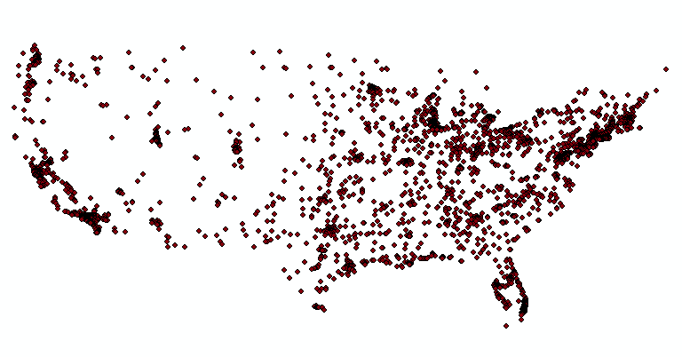

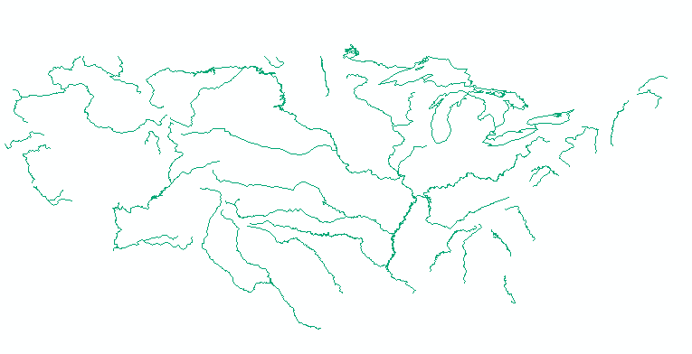

**What tools do we need?**

- **Select** — get just the "major" rivers
- **Buffer** — a 10 km zone around them
- **Intersect** — the cities inside that zone

**What is the workflow?**

Sketch the boxes and ovals before you look at the next slide.

<!-- Give the class three or four minutes in pairs to draw the flowchart on paper. The hard part is not knowing the tools, it is ordering them and noticing that the cities layer does not enter until the last step. Watch for groups who buffer all the rivers before selecting: it works, but it takes far longer to run. -->

---

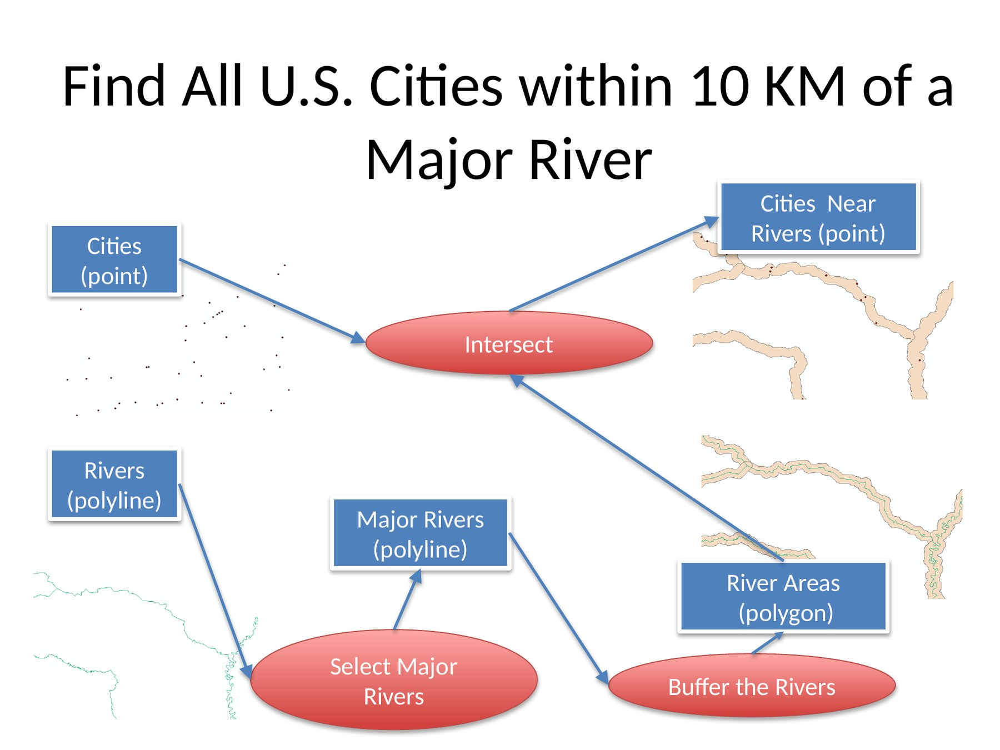

<!-- The answer. Rivers (polyline) go into Select Major Rivers, producing Major Rivers (polyline). Those go into Buffer the Rivers, producing River Areas (polygon). Those, plus the Cities (point) layer, go into Intersect, producing Cities Near Rivers (point). Three tools, two intermediate layers, one answer. Point out that the data model changes at every step: polyline, polyline, polygon, point. -->

---

# Lab 9: The Yellowstone Disaster

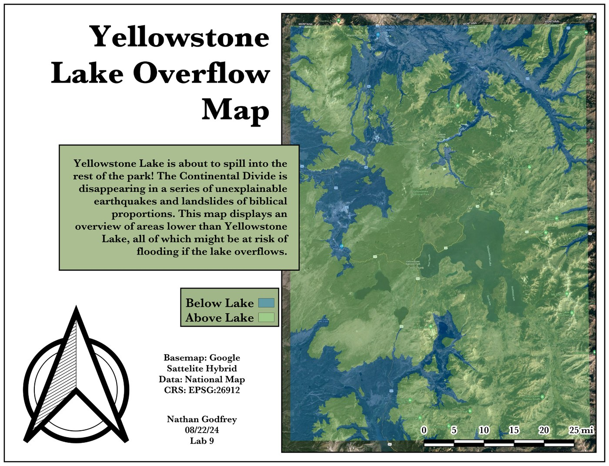

- **Unprecedented climate change and natural disasters have destabilized Yellowstone.** The Park Service has asked you to find the areas that need attention first
- Three scenarios, seven tools, **no data provided** — you find it on the National Map yourself
- Not as far-fetched as it sounds: in June 2022 record flooding closed every park entrance and forced about 10,000 visitors out in a single day

<!-- Lab 9 is the graded version of today's lecture. The scenario is deliberately over the top, but every step is a real geoprocessing workflow, and the 2022 flood really did happen (nps.gov/articles/000/yell-flooding.htm). Emphasise the "no data provided" part: finding and vetting the data is half the assignment, and it is step 2 and step 3 of the geographic approach. -->

---

# Yellowstone: Set the Scene

Before you start the lab, watch the clip:

<a href="https://www.youtube.com/watch?v=JGEgTXsGOPk&t=346s" target="_blank"><strong>▶ Yellowstone movie clip</strong></a>

<a href="https://www.youtube.com/watch?v=JGEgTXsGOPk&t=346s" target="_blank">youtube.com/watch?v=JGEgTXsGOPk&amp;t=346s</a> (starts at 5:46)

Then ask the engineer's version of the question:

- Who is **inside** the hazard zone?
- How far is **far enough**?
- Which roads still get you **out**?

Every one of those is a buffer, a select by location, or a difference.

<!-- Play the clip as the hook, then immediately turn it into geoprocessing questions so it does not feel like a break from class. Opens in a new tab; nothing is embedded. TODO: confirm the clip title and the stop point before class. -->

---

# Three Scenarios, One Toolbox

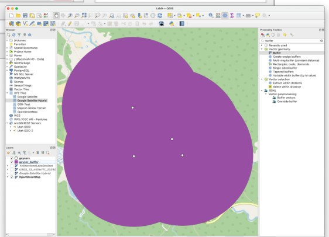

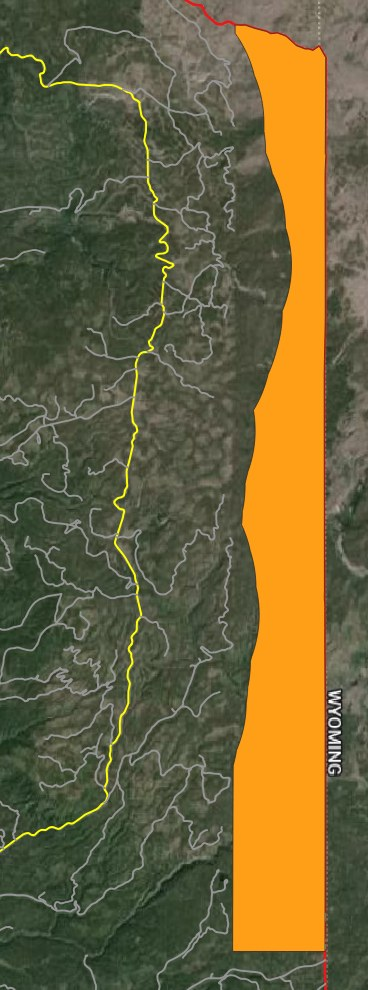

<strong>1. Floods</strong> What is lower than the lake? <em>Reclassify by table</em>

<strong>2. Noxious gas</strong> What is within 1 km of the geysers? <em>Buffer + Dissolve</em>

<strong>3. Search and rescue</strong> What is in the park, in Idaho, and more than 5 km from the road? <em>Reproject, Select, Buffer, Clip, Fix Geometries, Difference</em>

<!-- Walk the three parts in one minute each so nobody is surprised on Saturday. Part 3 is the long one and the one where QGIS throws an "invalid geometry" error on purpose; the fix is the Fix Geometries tool. Full instructions and the rubric are on the assignments page. -->

---

<!-- _class: activity -->

# Thursday: hands-on in QGIS

- We build the **cities near rivers** analysis for real, in QGIS
- Chaining tools into a workflow: the output of each tool is a layer you save to disk and feed to the next one
- The U.S. cities and rivers data is posted on **Learning Suite**
- **In-class activity — Cities Near Rivers:** upload a screenshot of your map showing all U.S. cities within 10 km of a major river, and record completion on Learning Suite

<!-- Preview of Thursday. The Thursday session Tell students to bring the same laptop and QGIS install they have been using; the activity is a screenshot upload, so nobody leaves without a finished map. The next slide is the version of the workflow diagram to walk through before they start. -->

---

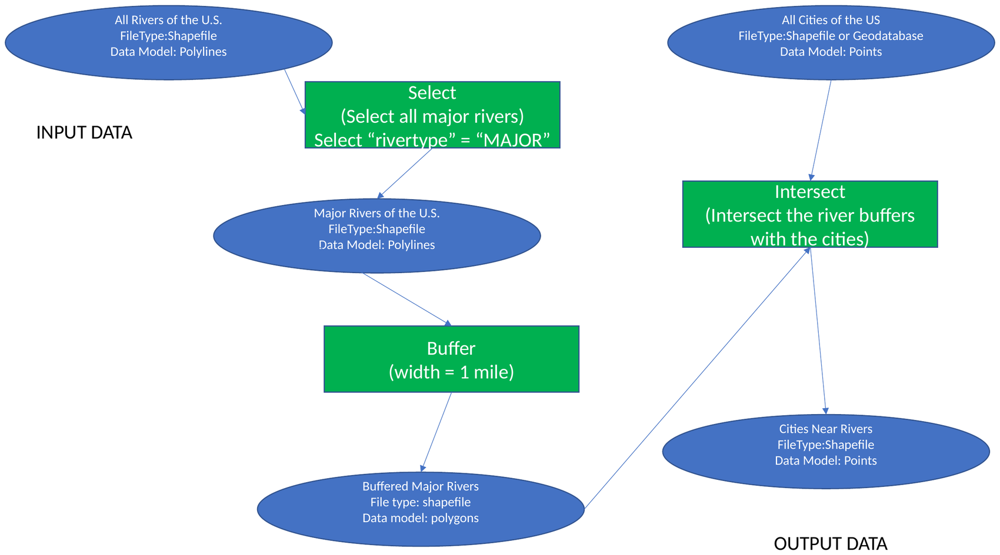

<!-- The Thursday workflow, annotated. Green boxes are tools, blue ellipses are layers, and every layer is labelled with its file type and its data model: rivers come in as polyline shapefiles, Select keeps a subset of polylines, Buffer turns those into polygons, and Intersect combines the polygons with the cities points to give points back out. That bookkeeping is what students lose track of once they have five layers in the panel. Note this example buffers by 1 mile; Thursday's activity uses 10 km. -->

---

# Before Next Class

- Read **Chapter 9, *Basic Spatial Analysis***, in *GIS Fundamentals* (Bolstad & Manson)
- Take **Quiz 8: Geoprocessing and Spatial Data Analysis** (open book, on Learning Suite)
- Start [**Lab 9: The Yellowstone Disaster**](https://byu-hydroinformatics.github.io/cce114-geomatics/assignments/lab-09/) — due Saturday, 11:59 pm
- The **Community and Professional Map Experience** is due Wednesday
- Bring your laptop with QGIS on Thursday
- Questions? Office hours: [calendly.com/dan-ames/office-hours](https://calendly.com/dan-ames/office-hours)

<!-- Lab 9 is long and involves three large downloads, one of them nearly 200 MB. Tell students to start it before Thursday so they arrive with questions. -->

<!-- Conversion notes (2026-09-02): source deck "Introduction to geoprocessing.pptx" (2021, 27 slides), plus "example cities near rivers workflow diagram.pptx" for the Thursday preview slide (rendered at 200 dpi from shapes). No slides were dropped for content; source slide 3 (the "Map it / query-it / Analyze It" logo slide) became a text-only section break because the three vendor logos added nothing at slide size. Source slide 5 (the Esri "geographic approach" table image) was rebuilt as HTML so the ArcGIS/ArcMap wording could be changed to QGIS. Seven slides are new: "Clip vs. Intersect", "Finding the Tools in QGIS", the three Yellowstone/Lab 9 slides, and the two Thursday preview slides. 36 slides total. ArcGIS screenshots that still need a QGIS re-shoot: gp-attribute-table-arcmap.jpg (attribute table), gp-select-by-query-arcmap.jpg + gp-select-by-query-sql.png (select by attribute), gp-select-by-location-arcmap.jpg (select by location) — all four are ArcMap 10.x and are flagged in their speaker notes. TODO: confirm the title of the Yellowstone movie clip and where to stop playing it. The three Yellowstone images are reused from docs/assignments/lab-09/images. -->

<!-- Update 2026-09-02: ArcGIS-era screenshots replaced with QGIS 3.44 captures made by tools/qgis_reshoot_screens.py: gp-attribute-table-qgis.png, gp-select-by-expression-qgis.png, gp-select-by-location-qgis.png replace the four ArcMap screenshots. -->
