<!-- _class: lead -->
<!-- _paginate: skip -->

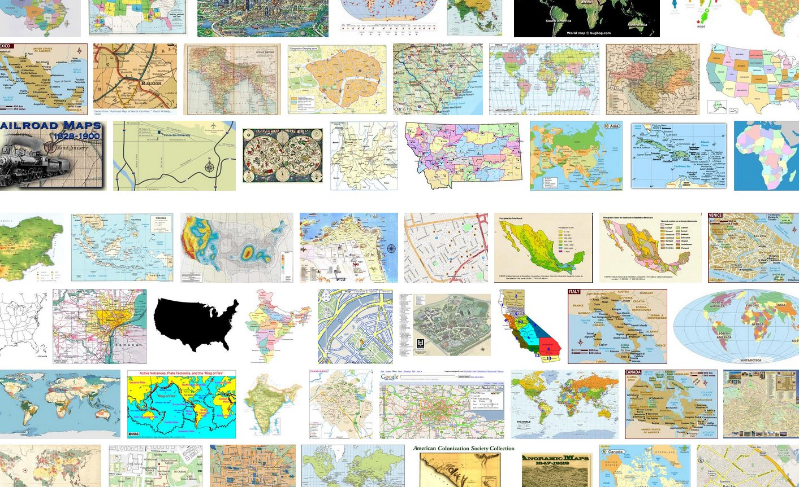

# Introduction to CCE 414

## Engineering Applications of GIS

CCE 114 Geomatics
Dr. Dan Ames

<!-- This is a preview lecture, not a hands-on session: no laptop needed today. The whole hour is a tour of the follow-on course, CCE 414, and of the engineering problems it solves with GIS. Lab 10, Domes for Mozambique, is still due Saturday. -->

---

# Today's Goals

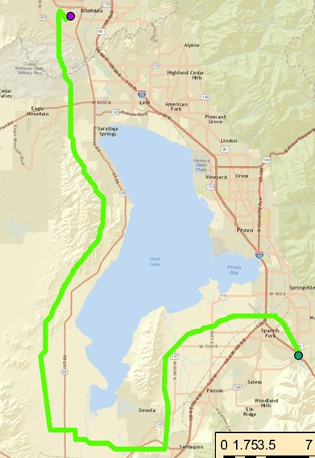

- By the end of class you should be able to:
  - Say what **CCE 414: Engineering Applications of GIS** covers and when it is taught
  - Name engineering problems GIS is used to solve: **siting**, **routing**, **terrain**, **hydrology**, **remote sensing**
  - Explain why engineers build **repeatable models** instead of clicking tools one at a time
  - Decide whether CCE 414 belongs in your plan of study

<!-- Frame the hour: everything you have done in CCE 114 has been one map, one analysis, one lab. CCE 414 is where those pieces are chained into engineering workflows that answer a design question. -->

---

# CCE 414 at a Glance

- **CCE 414 — Engineering Applications of GIS**
- Offered **every Fall semester**
- Taught by **Dr. Dan Ames**
- Builds directly on this class: same spatial data, harder questions
- **Take it sooner rather than later** if you liked CCE 114, or if you are headed toward **water**, **environment**, or **transportation**
- It opens doors for internships and research projects

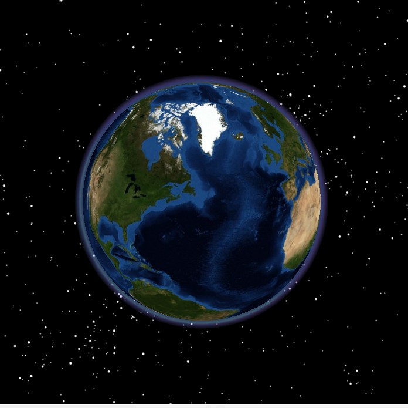

<!-- The 2021 version of this slide said "take it sooner than later if you liked 214" — 214 was the old number for this Geomatics course, now CCE 114. Point out that CCE 414 is listed in the course catalog every Fall, so plan around that. Students who take it early can use GIS in internships and in their capstone. -->

---

<!-- _class: lead -->

# The rest of today

## A tour of what you would actually build in CCE 414

<!-- Everything that follows is real student work or a real lab from CCE 414. Move quickly: the point is breadth, not detail. Invite questions as you go. -->

---

# Cartography and Map Making

<!-- CCE 414 goes much deeper into cartography than CCE 114 does: projections chosen on purpose, symbology, classification schemes, layout, and map series. You have made a handful of maps this semester; in 414 you make a lot of them, and they get critiqued. -->

---

# GPS

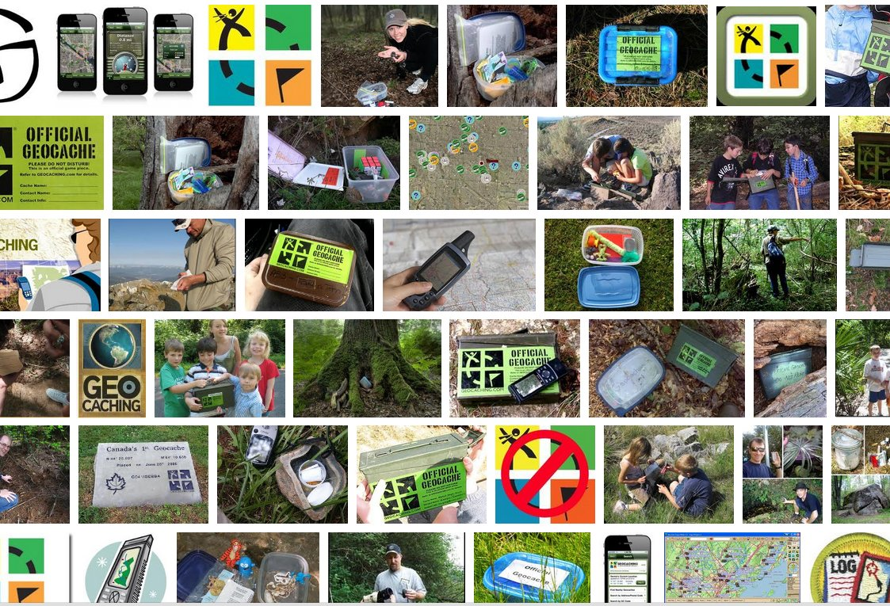

<!-- Handheld GPS, phone GPS, and survey-grade receivers. In CCE 414 you collect your own field data with GPS and bring it into the GIS, rather than always downloading someone else's layer. -->

---

# Lab: Geocaching and GPS

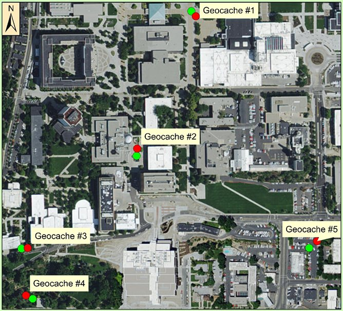

**Purpose**

- Select several real geocaching sites around campus
- Compare the published online coordinates with the coordinates you measure with a GPS unit
- Calculate the error (**RMSE**)

<!-- A field lab. Geocaches are real, published coordinates hidden all over campus and the city. Students walk to them with a GPS receiver, record what the receiver says, and compare against the published location. The deliverable is an error statistic, not just a map: this is where accuracy stops being an abstraction. -->

---

# Infrastructure Siting

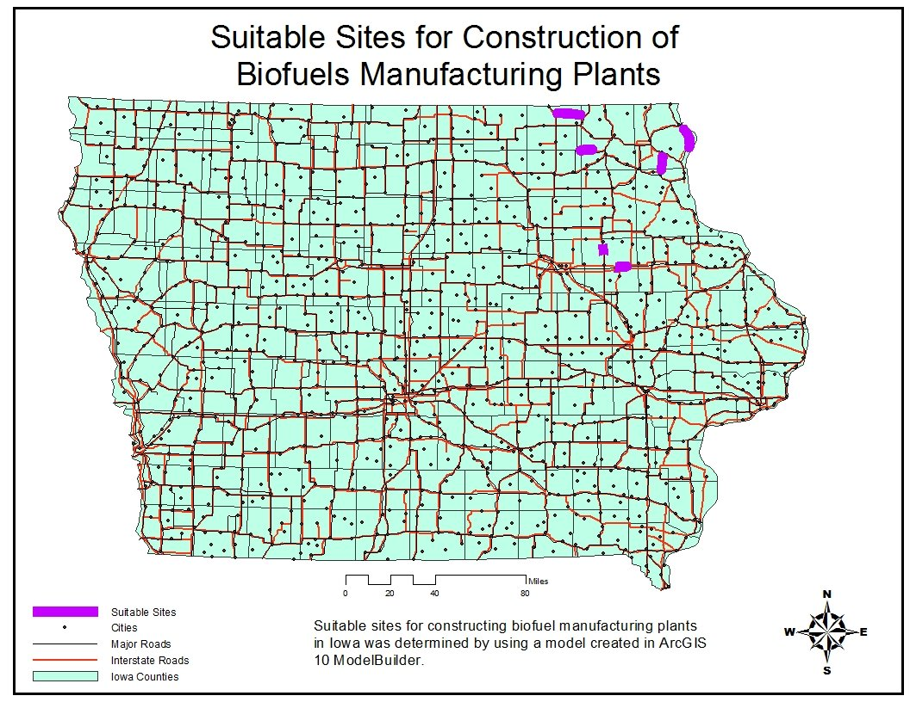

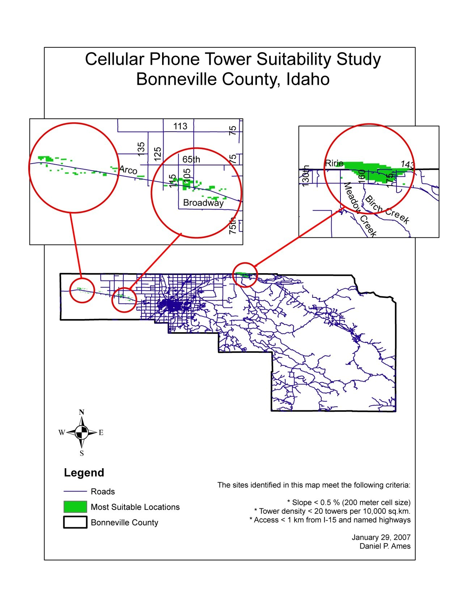

<!-- Two examples of the same question: given a set of criteria, where should we put the thing? On the left, suitable sites for biofuel manufacturing plants in Iowa. On the right, a cellular tower suitability study for Bonneville County, Idaho. Both were produced by chaining together the same geoprocessing tools you have been using this semester. The original slide title read "Infrastructure Citing"; the word is siting. -->

---

# Cell Tower Site Optimization

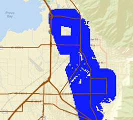

**Purpose**

- Find areas **suitable for placing cell towers**, combining **raster and vector** data
- Criteria such as slope, distance to highways, and existing tower density
- You build this once as a model, then build it again as code, and compare

<!-- The blue area is the suitable zone that falls out of the analysis. Note the ingredients: a DEM (raster) for slope, roads (vector) for access, existing towers (vector) for density. This lab comes back twice more in this deck: once as a ModelBuilder diagram, once as a Python script. -->

---

# Power Line Least Cost Path

**Purpose**

- Determine a **least cost path** for a transmission line, based on several factors at once:
  - Distance from cities
  - Distance to roads
  - Crossings of bodies of water
  - Elevation and slope

<!-- A routing problem rather than a siting problem. Every cell in the study area gets a cost, the costs are combined into one surface, and the software finds the cheapest route from A to B across it. The green line is the answer. Ask the class what should be expensive: steep ground, water crossings, private land, sensitive habitat. Same method is used for pipelines, canals, and highway corridors. -->

---

<!-- _class: lead -->

# Modeling

## Doing the analysis once, then doing it a hundred times

<!-- Transition slide. Up to now in CCE 114 you have run tools one at a time. The next few slides are about capturing the whole chain so it can be re-run, audited, and handed to someone else. -->

---

# What a geoprocessing model is

- A **flow chart of tools**: inputs go in, operations run, new information comes out
- Change one input, re-run, get a new answer, without redoing the clicking
- It is a **record** of your analysis: someone else can see exactly what you did
- ESRI calls theirs **ModelBuilder**; in QGIS the same idea is the **Graphical Modeler**

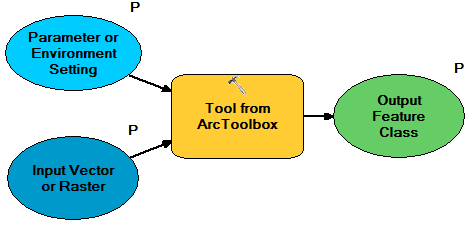

<!-- Blue = your input data. Yellow = a tool. Green = the output that tool creates, which is often the input to the next tool. The little "P" markers are exposed parameters, so the model can be re-run with different inputs. Emphasise reproducibility: an engineering analysis nobody can repeat is not much of an analysis. -->

---

# A small model: Bear River

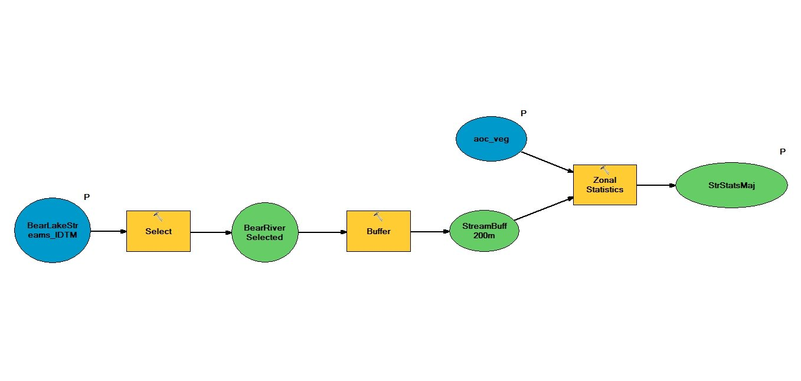

Select the river → buffer it 200 m → run zonal statistics on a vegetation raster

<!-- Read it left to right. Five boxes, one question: how much vegetation is there within 200 m of the river? Every one of those boxes is a tool you could also run by hand, one at a time, exactly as you have been doing in lab. -->

---

# A bigger model: Iowa siting

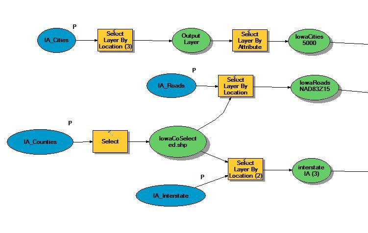

The front half of the biofuel siting analysis — and this is only half of it

<!-- This is the same idea at the scale of a real project, and it is only the first half of the model. Nobody keeps this straight in their head, and nobody wants to click through it twice. That is the argument for modeling. -->

---

# Every box is a tool dialog

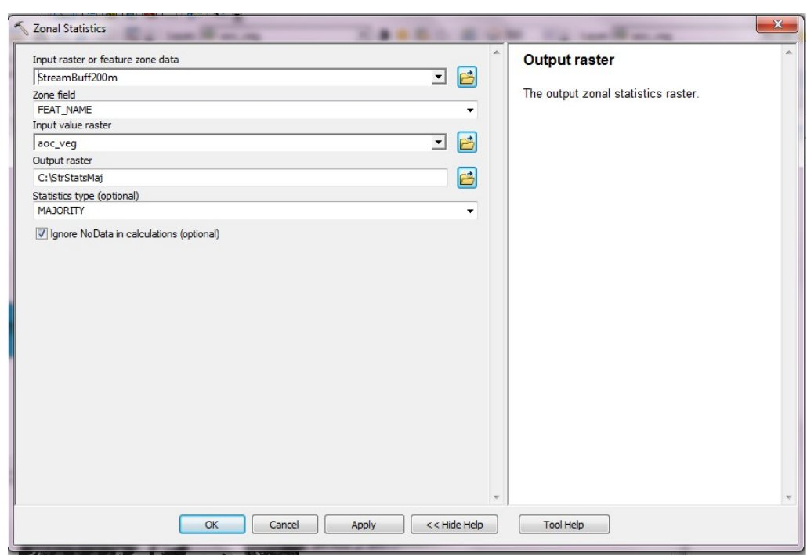

<!-- The Zonal Statistics tool from the Bear River model, opened up. Nothing mysterious: a zone layer, a value raster, a statistic, an output. The model just remembers the settings for you and passes the output to the next tool. QGIS has the same tool in the Processing Toolbox. -->

---

<!-- _class: lead -->

# GIS Programming

## When the flow chart is not enough

<!-- Second half of the automation story. Models are great until you need a loop, a condition, or a report — then you write code. -->

---

# Python and the GIS

- **Python**: high-level, general-purpose, object-oriented — the language of GIS automation
- A GIS **library** gives Python tools, functions, and environments for working with spatial data
- ESRI's library is **ArcPy**; the open-source equivalent is **PyQGIS**
- Lets you automate spatial data analysis: loops, conditions, batch runs, custom tools

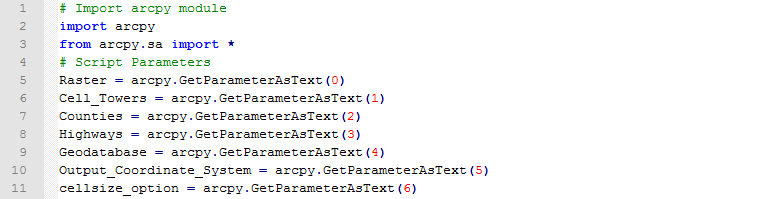

<!-- You already know Python from CCE 170. The new part is that a few import lines give you the entire geoprocessing toolbox as callable functions. The bottom image is the payoff: a script with exposed parameters shows up as an ordinary tool dialog that anyone can run. Screenshots here are ArcGIS/ArcPy from the 2021 deck; the same pattern works in QGIS with PyQGIS and the Processing framework. -->

---

# A real script becomes a real tool

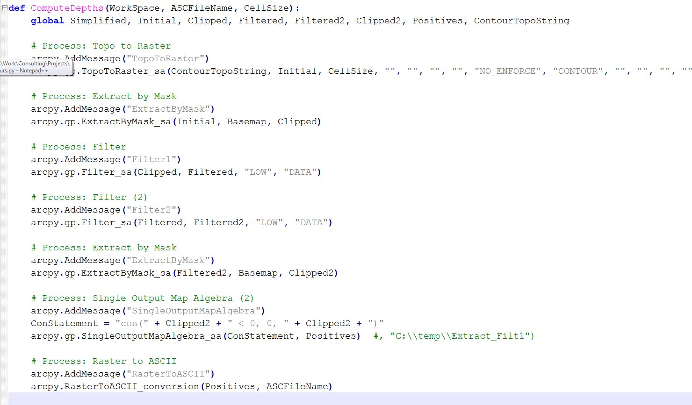

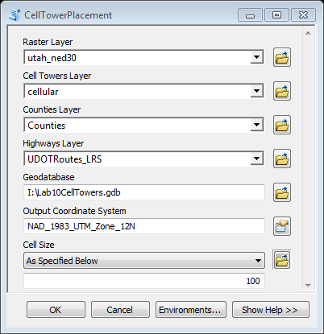

<!-- Left: one function out of a lab script — convert contours to a raster, extract by mask, filter, run map algebra, write out an ASCII grid. Do not read it line by line; the point is that it is a few dozen lines of ordinary Python that run the same analysis every time without a single click. Right: expose the script's inputs as parameters and it shows up as an ordinary tool dialog that a colleague can run without reading any code. -->

---

# Same job, two ways

**Model**

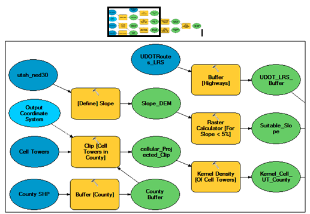

**Python script**

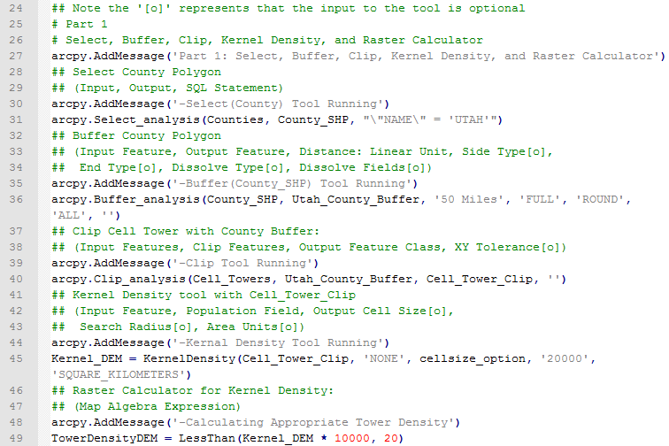

<!-- The cell tower siting lab from earlier, built both ways. Students do the model version first, then reproduce it in code, and compare. Ask which one you would rather hand to a client, and which one you would rather change at 11 pm the night before a deadline. Neither answer is wrong: the model is readable, the script is flexible. -->

---

# Atlas Creation with Python

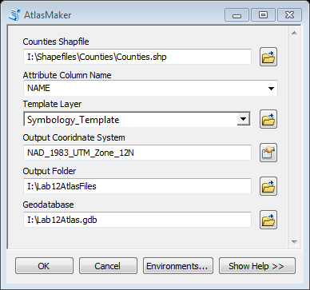

**Purpose**

- Use Python to automate a **repetitive** GIS process
- Produce a PDF map for **every county** in a polygon shapefile, from one template
- One script, 29 maps, consistent symbology on all of them

<!-- The classic argument for scripting. Making one county map is a five-minute job; making one for every county in Utah by hand is a lost afternoon and an inconsistent product. The script takes a shapefile, an attribute column for the names, and a template layer, and loops. -->

---

<!-- _class: lead -->

# Imagery and Remote Sensing

<!-- Third theme: getting information out of pictures of the earth. -->

---

# Satellite and Airplane Imagery

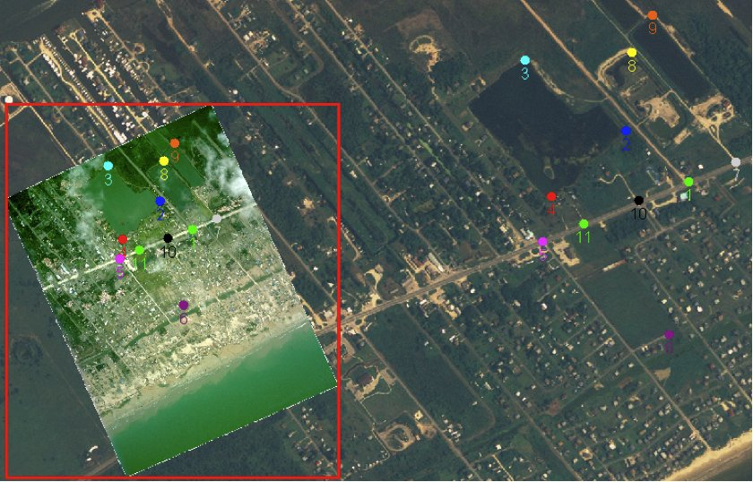

<!-- Aerial imagery flown for a project, with survey control points marked, being fitted onto a satellite basemap. In CCE 414 you work with imagery as data: resolution, bands, control points, and accuracy, not just a pretty backdrop. -->

---

# Lab: Fun with Old Maps

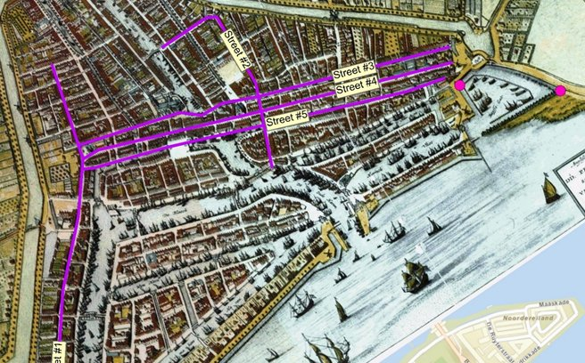

**Purpose**

- Research **old maps** of a place and identify what has changed since
- Learn to **georeference** an image that has no spatial location of its own
- Stretch a historical map onto real-world coordinates and digitize from it

<!-- A favorite lab. You pick a historical map — a city plan, a fire insurance map, an old survey — and pin it to the modern world by matching identifiable points. Then you can digitize the old street grid, the old shoreline, the old channel, and measure how much has moved. Engineers do this for real when tracking channel migration, buried infrastructure, and historical land use. -->

---

# Lab: Remote Sensing NDVI Calculator

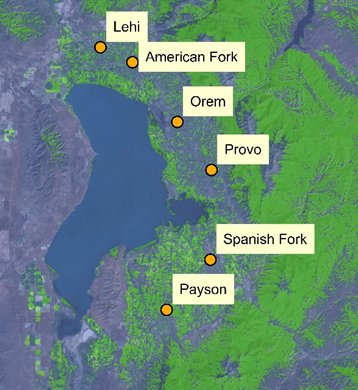

**Purpose**

- Determine where the **vegetation and farmland** is in Utah County
- Combine satellite bands with map algebra to compute **NDVI**
- The first lab that treats a raster image as **numbers**, not a picture

<!-- NDVI, the Normalized Difference Vegetation Index, is computed from the red and near-infrared bands: healthy vegetation reflects near-infrared strongly. Green in this image is vegetation. It is a good first taste of band math, and it leads straight into agriculture, drought, and land cover change work. -->

---

<!-- _class: lead -->

# Terrain Analysis

## Everything you can get from a DEM

<!-- Fourth theme, and the one closest to civil engineering practice: elevation data, and the derived surfaces that come out of it. -->

---

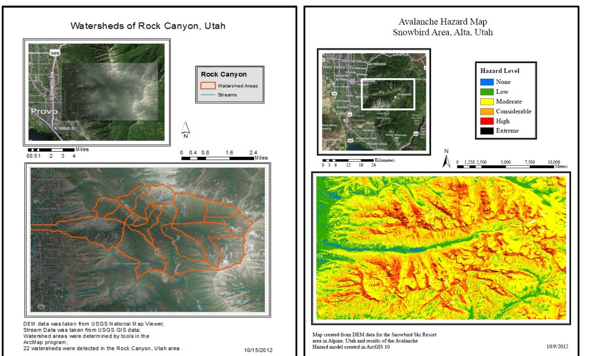

<!-- Two finished student maps. Left: 22 watersheds delineated for Rock Canyon in Provo, from USGS DEM data and USGS stream data. Right: an avalanche hazard map for the Snowbird area in Alta, built from slope, aspect, and elevation. Both started as a bare grid of elevation values. -->

---

# Lab: Calculating Butte Volume

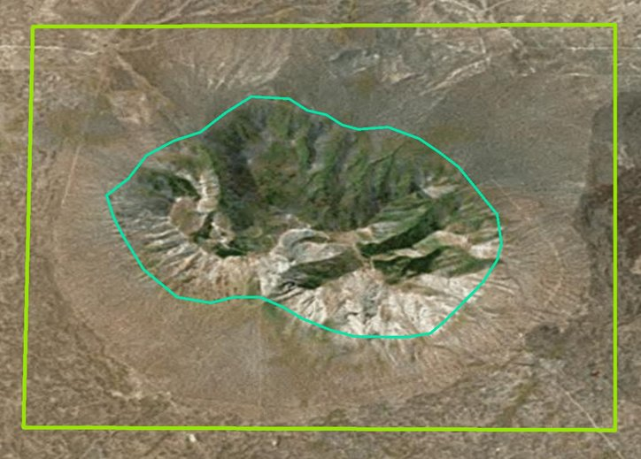

**Purpose**

- Using **elevation data** and a geoprocessing model, determine the **volume** of this land formation
- Define a base surface, subtract, and sum the difference over every cell
- The same arithmetic as a cut-and-fill estimate

<!-- This is an earthwork problem wearing a geology hat. Pick a base elevation, subtract the DEM from it inside the outlined boundary, multiply by cell area, and sum. If you can do it for a butte, you can do it for a stockpile, a landfill, a reservoir, or a road cut. -->

---

# Lab: Avalanche Risk Management

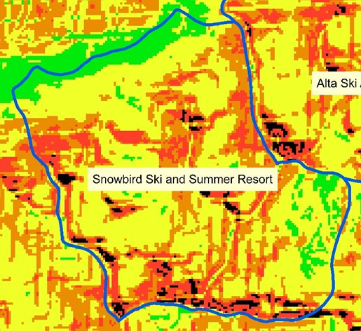

**Purpose**

- Analyze **avalanche risk** using elevation data
- Run **three different analyses** on the same DEM: slope, aspect, and elevation band
- **Recombine** the three results into a single risk classification

<!-- Snowbird and Alta. Avalanches release on particular slopes, at particular aspects, above particular elevations. Each criterion is easy on its own; the interesting engineering is in reclassifying each one to a common scale and combining them. This is exactly the same overlay logic as the siting labs, applied to a hazard. -->

---

# Lab: Watershed Hydrology

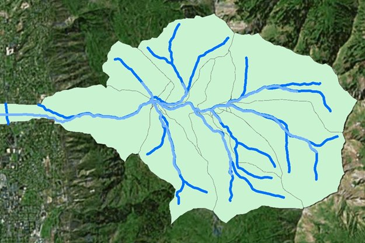

**Purpose**

- Derive **watershed boundaries** and **stream networks** from elevation data
- The first lab whose model produces **two** output datasets at once
- Rock Canyon, Provo: the streams and the basin, both from a bare grid of elevations

<!-- The map on the right is the output: the Rock Canyon basin outline and the stream network inside it, neither of which was in the input data. Everything came out of the DEM. This is the workflow behind almost every hydrologic model you will ever run. The next slide shows the model that produced it. -->

---

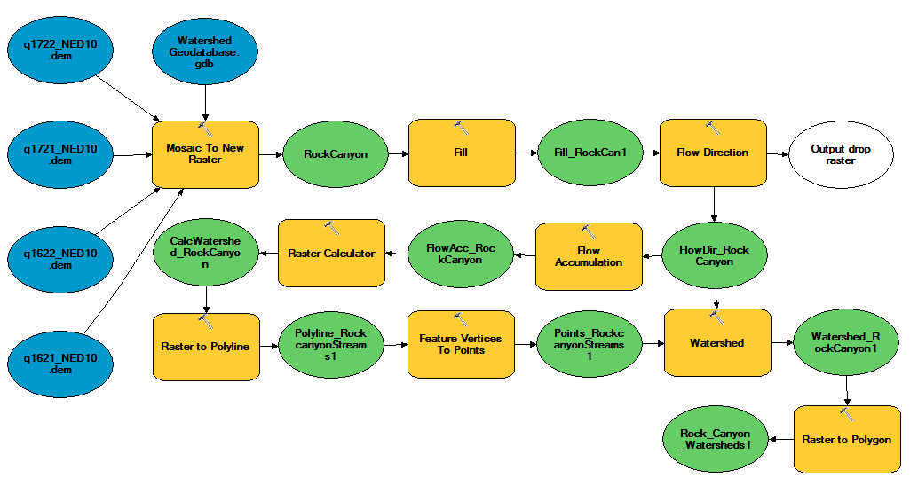

<!-- The watershed model, left to right: mosaic the four DEM tiles, fill the sinks, compute flow direction, compute flow accumulation, threshold the accumulation with the raster calculator to get streams, convert those to a polyline, turn vertices into points, and delineate watersheds. The two outputs are the stream network (Polyline_RockcanyonStreams1) and the watershed polygons (Rock_Canyon_Watersheds1). Point out how many steps there are, and ask how anyone would repeat this by hand next semester on a different canyon. -->

---

# 3D Analysis and Visualization

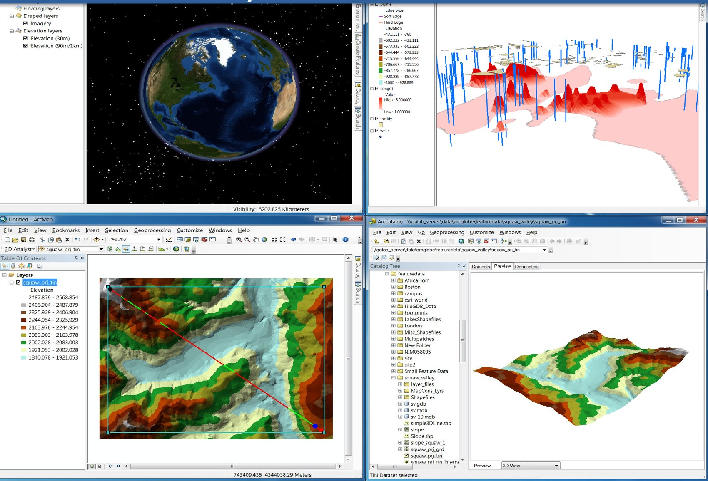

<!-- Draping imagery on a globe, profiling a TIN surface along a line, a contaminant plume rendered in three dimensions with well logs, and a TIN previewed as a 3D surface. CCE 414 spends time on the third dimension: surfaces, profiles, line of sight, and volumes. These are ArcGIS screenshots from the 2021 deck. -->

---

# Should you take CCE 414?

**Take it if you**

- Enjoyed the analysis half of CCE 114
- Are headed toward **water resources**, **environmental**, or **transportation**
- Want a skill that shows up on internship postings
- Like the idea of automating work with Python

**What you get out of it**

- Siting, routing, terrain, hydrology, and remote sensing workflows
- Modeling and scripting, so your analysis is repeatable
- A portfolio of maps and models to show an employer

<!-- Land the plane. This is the course that turns "I have used GIS" into "I can build a GIS analysis". Encourage students to talk to you in office hours if they are unsure how it fits their plan of study. -->

---

# Missed class, or want it again?

- Last year's recording of this same lecture: <a href="https://youtu.be/RIzy0JRB8VI" target="_blank">youtu.be/RIzy0JRB8VI</a>
- Course description and prerequisites: the BYU course catalog entry for **CCE 414**
- Still not sure? Bring your plan of study to office hours: [calendly.com/dan-ames/office-hours](https://calendly.com/dan-ames/office-hours)

<!-- Post the recording link on Learning Suite as well for anyone who is out sick. It is the prior-year version of this lecture and covers the same material. -->

---

# Before Next Class

- **Lab 10: [Domes for Mozambique](https://byu-hydroinformatics.github.io/cce114-geomatics/assignments/lab-10/)** is due **Saturday at 11:59 pm**
- Next week is **Week 12: Project Site Selection** — Tuesday and Thursday both
- The **Final Project** is introduced next week; start thinking about a study area and a question you care about
- Check Learning Suite for the reading and the open-book quiz
- Questions? Office hours: [calendly.com/dan-ames/office-hours](https://calendly.com/dan-ames/office-hours)

<!-- Week 12 is site selection — the Walmart lab — plus the launch of the final project, and Concepts Exam 2 opens in the Testing Center. Tell students that the site selection lectures are the closest model for what the final project asks them to do. -->

<!-- Conversion notes (2026-09-02): source "14 - Intro to Engineering Applications of GIS CEEn 414.pptx" (2021), 21 slides, no hidden slides, no speaker notes in the source (all notes here are new). CEEn 414 renamed to CCE 414 throughout; the source's "if you liked 214" now reads "if you liked CCE 114". Source slide 9 ("ArcGIS ModelBuilder") and slide 10-11 ("ArcPy and Python") were kept as descriptions of CCE 414 content but reworded to name the QGIS equivalents (Graphical Modeler, PyQGIS) alongside the ESRI ones. Source slide title "Infrastructure Citing" corrected to "Siting". ArcGIS screenshots kept and flagged for a possible re-shoot: ce414-zonal-statistics-dialog.jpg, ce414-celltower-tool-dialog.png, ce414-arcpy-snippet.png, ce414-arcpy-script.jpg, ce414-celltower-model.png, ce414-celltower-code.png, ce414-atlasmaker-dialog.png, ce414-model-concept.png, ce414-model-iowa-siting.jpg, ce414-model-bear-river.jpg, ce414-watershed-model.png, ce414-3d-visualization.jpg (ArcMap/ArcCatalog/ArcGlobe windows), ce414-arcglobe-earth.jpg (cropped from an ArcGlobe view), and the ArcGIS credit lines inside ce414-terrain-analysis-maps.jpg. No source slide was dropped: all 21 became slides here, with the source "Modeling" slide split into three (concept, Bear River model, Iowa model) and the source "Watershed Hydrology" slide split into two (purpose + map, then the full model diagram); new slides added for goals, course facts, section leads, "Should you take CCE 414?", the prior-year recording, and Before Next Class. TODO: confirm which software CCE 414 uses this year (the 2021 screenshots are ArcGIS 10 / ArcMap, not ArcGIS Pro) and whether the geocaching, old maps, NDVI, butte volume, avalanche, and atlas labs are still in the syllabus. TODO: confirm the Learning Suite reading and quiz for this week; this deck has no textbook chapter of its own. -->
