<!-- _class: lead -->
<!-- _paginate: skip -->

# Project Site Selection, Part 1

## Geoprocessing and the Walmart problem

CCE 114 Geomatics
Dr. Dan Ames and Dr. James Halgren

<!-- Tuesday concept lecture, Week 12. This is the lecture behind Lab 11 and the pattern students will reuse in the final project. Thursday, we walk through the workflow diagrams and the final project description. -->

---

# Today's Goals

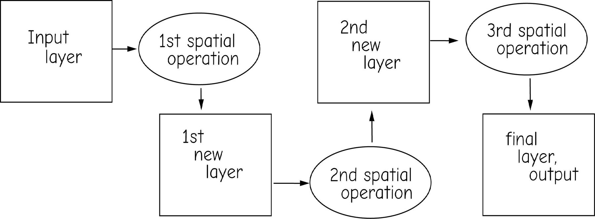

- By the end of class you should be able to:
  - Explain site selection as a **process of elimination**
  - Name the geoprocessing tools that do the eliminating: **Buffer, Clip, Intersection, Difference, Select by Location**
  - Turn a written **criterion** into a specific tool with specific settings
  - Chain those tools into a **workflow**: input layer → operation → new layer → operation → output
  - Sketch the workflow for the Walmart problem before touching QGIS

<!-- Set expectations. Today is the thinking, not the clicking. Lab 11 is where they click. Tell them the exam is this week and that this material is on it. -->

---

# Site selection is a process of elimination

- You are almost never asked "where is the best spot?"
- You are asked: **which places satisfy all of these conditions?**
- So you start with **everything** — the whole county — and take away what fails
- Each criterion is one bite out of the map
- What survives every bite is your answer: a **candidate set**, not a single answer
- The GIS does not pick the site. It narrows the field for the human who does.

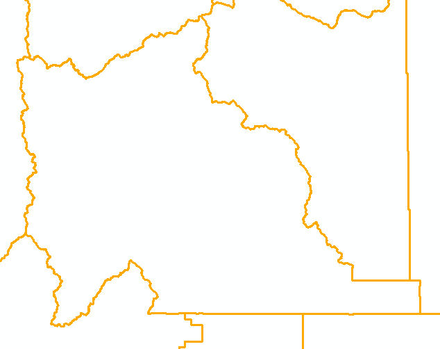

<!-- This is the framing for the whole day. Start with all of Utah County. Every criterion removes area. The output is a set of candidate polygons, and a person still has to choose among them using cost, zoning, ownership, and politics that are not in the data. -->

---

<!-- _class: lead -->

# Part 1

## Review: the common spatial analyses

---

<!-- _class: quiz -->

# Which of the following are geoprocessing tools?

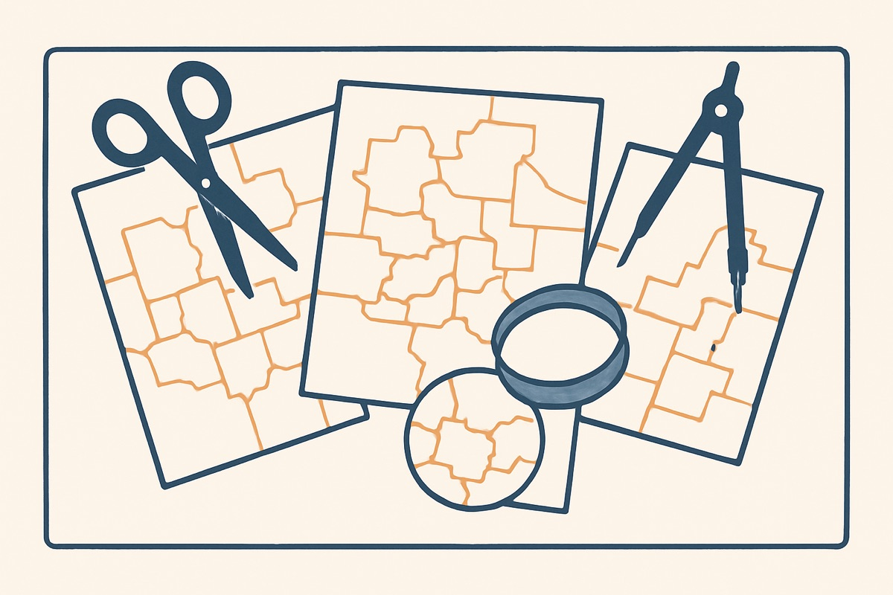

<ol type="A">
<li>Buffer</li>
<li>Union</li>
<li>Intersection</li>
<li>Difference (called Erase in ArcGIS)</li>
<li>All of the above</li>
</ol>

<!-- Answer: E. All four are in the QGIS Processing Toolbox under Vector overlay and Vector geometry. Point out the naming difference now so it does not trip them up in the lab: what the textbook and older ArcGIS material call Erase is called Difference in QGIS. -->

---

<!-- _class: quiz -->

# Finding all the area that is *near* a school is done with which tool?

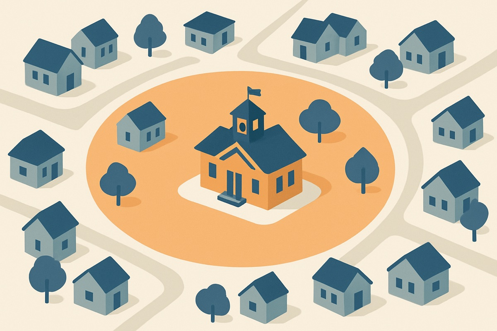

<ol type="A">
<li>Intersection</li>
<li>Union</li>
<li>Buffer</li>
<li>Difference</li>
<li>Clip</li>
</ol>

<!-- Answer: C, Buffer. "Near" is always a distance, and a distance from a feature is always a buffer. Ask them what the buffer distance should be and watch them realize the criterion has to be written down as a number before the tool can run. -->

---

<!-- _class: quiz -->

# Eliminating an area that does *not* satisfy your query is done with…

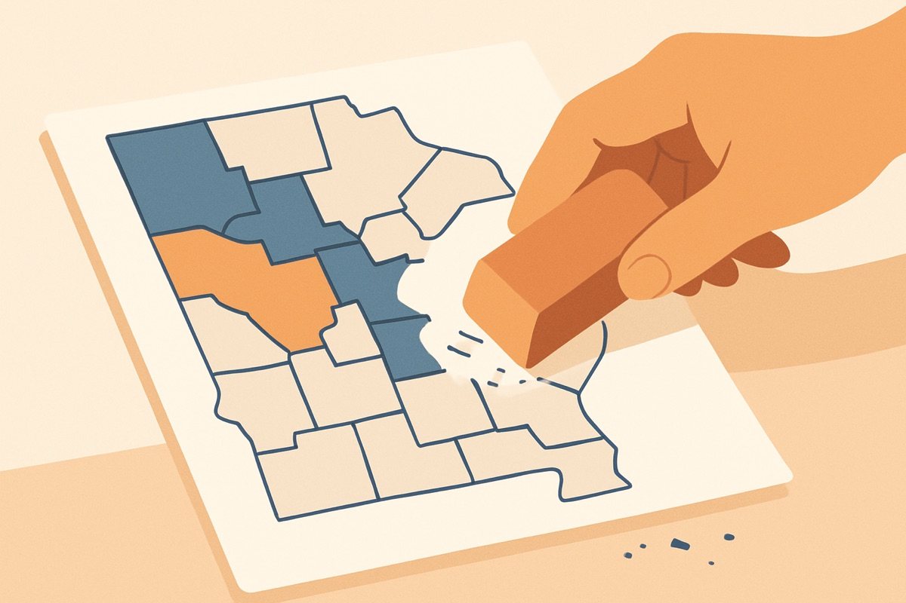

<ol type="A">
<li>Union</li>
<li>Clip</li>
<li>Difference</li>
<li>Buffer</li>
<li>Intersection</li>
</ol>

<!-- Answer: C, Difference (Erase). Clip is defensible as a partial answer: Clip keeps what is inside the cutter, Difference keeps what is outside it. Both eliminate; they just eliminate opposite halves. This is the heart of the elimination idea, so spend a minute here. -->

---

<!-- _class: quiz -->

# Intersection and Union

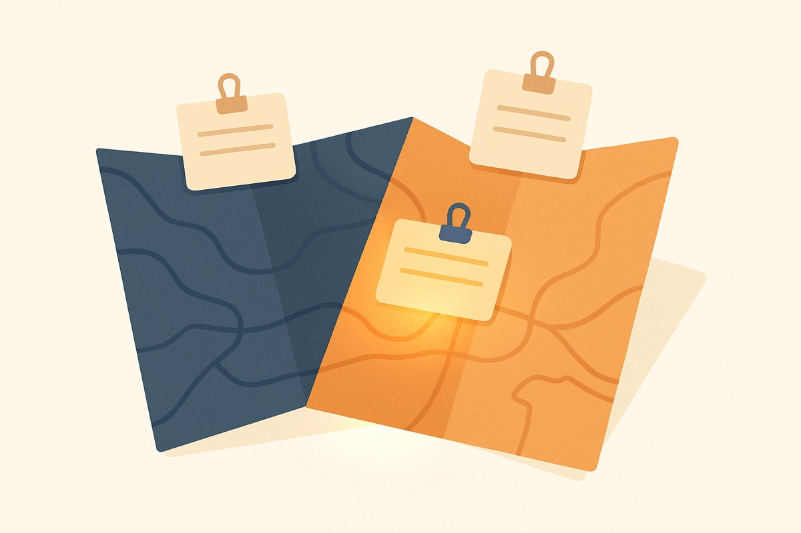

When you run an **Intersection** or a **Union**, the attribute tables of both layers are joined together for…

<ol type="A">
<li>Union only</li>
<li>Intersection only</li>
<li>Neither</li>
<li>Both</li>
</ol>

<!-- Answer: D, Both. Overlay tools carry the attributes of every input layer into the output. That is what makes them different from Clip, which keeps only the input layer's attributes and uses the second layer purely as a cookie cutter. -->

---

# Reclassify: turn values into classes

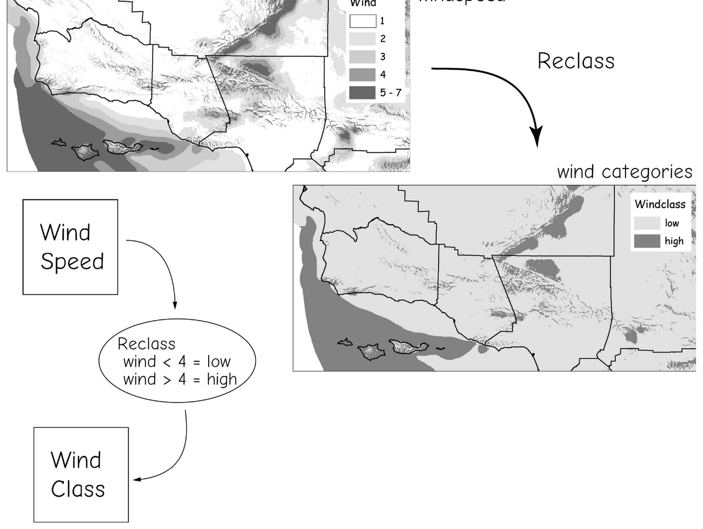

<!-- Reclassify is the raster version of elimination. Continuous wind speed becomes two classes, low and high, using a rule: wind < 4 is low, wind > 4 is high. In QGIS this is Raster analysis, Reclassify by table. The lesson is that a criterion is a threshold, and a threshold turns a measurement into a yes or no. -->

---

# Reclassify: population density

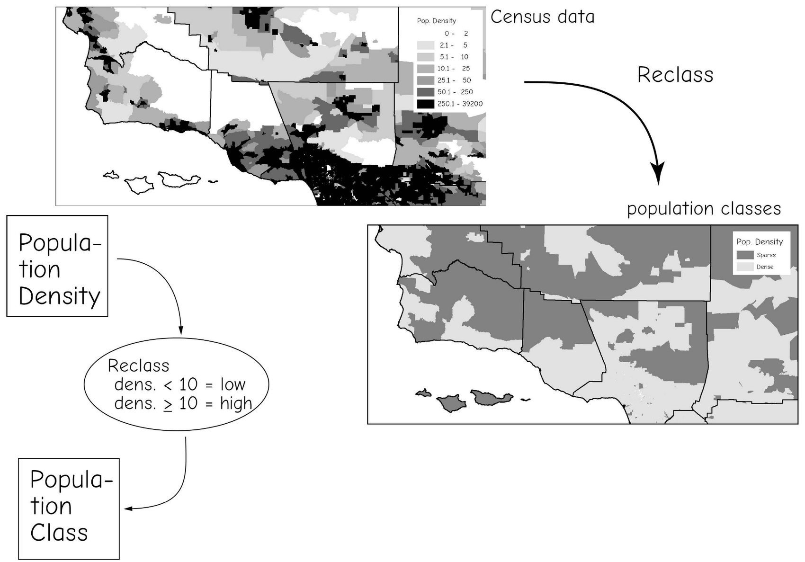

<!-- Same operation on census data: population density becomes population classes. This is exactly the criterion we will use for the Walmart problem, over 2000 people per square kilometer. Note that here we will do it with an attribute query on polygons rather than on a raster, but the thinking is identical. -->

---

# Buffer: everything within a distance

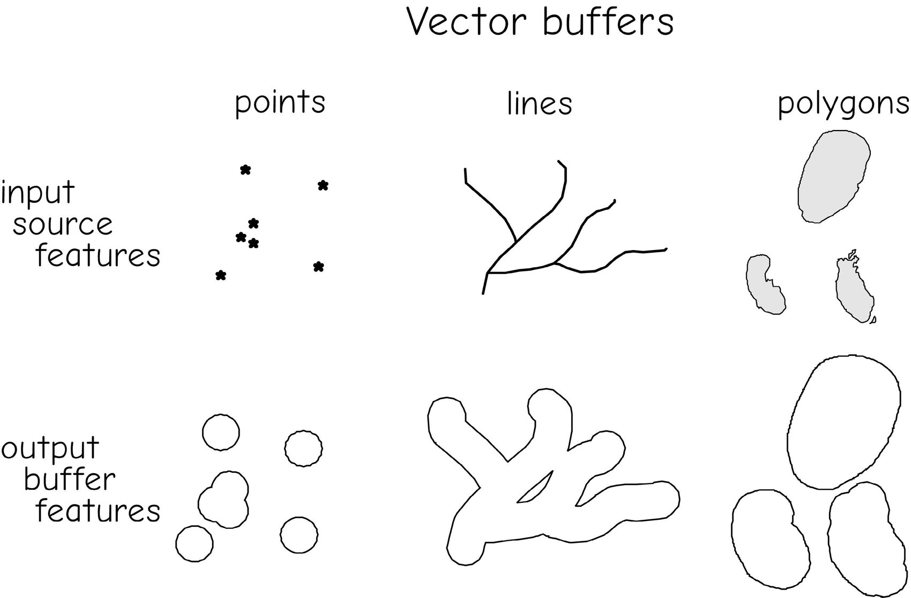

<!-- Buffer works on points, lines and polygons, and always returns polygons. Ask what a buffer of a polygon looks like: the polygon plus a collar around it. In QGIS: Processing Toolbox, Vector geometry, Buffer. Watch the units, which come from the layer's CRS, so a projected CRS in meters or feet, never degrees. -->

---

# Difference (Erase): cut a hole in a layer

- **Difference** removes the target features wherever the erase layer covers them
- Which Boolean operation is like Difference?
  - *(Counties **NOT** Catchment)*
- QGIS: **Vector overlay → Difference**
- ArcGIS calls this same tool **Erase**

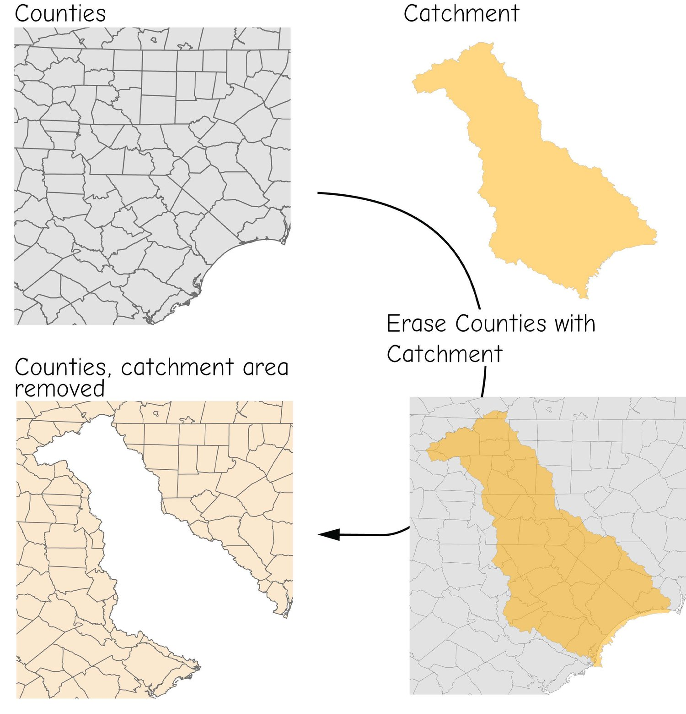

<!-- Answer to the Boolean question: NOT. Counties NOT Catchment. Every overlay tool has a Boolean twin: Intersection is AND, Union is OR, Difference is NOT. If students can hold onto that, they can pick the right tool from the criterion wording alone. -->

---

# Intersection: keep only the overlap

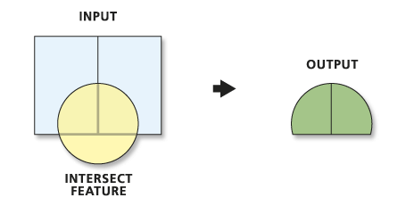

<!-- Intersection is AND. Only the area covered by both inputs survives, and the output carries the attributes of both. This is the workhorse for combining criteria: near a highway AND in a dense census block AND in Utah County. -->

---

# Intersection with real layers

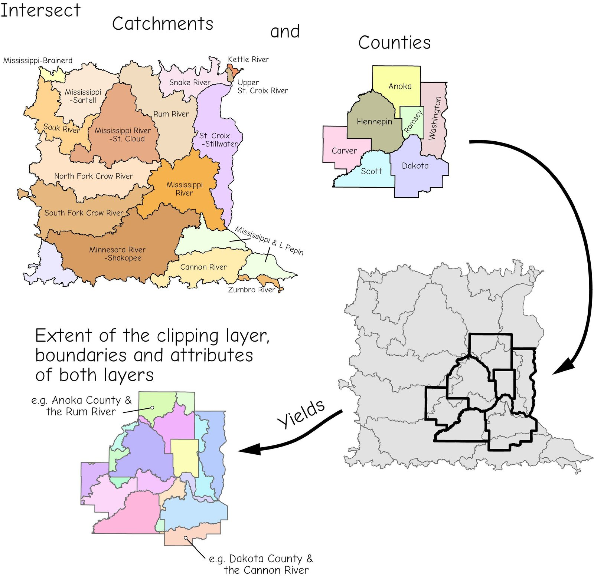

<!-- Catchments intersected with counties. The output has one polygon for every place a catchment and a county overlap, and its table carries both sets of attributes, for example Anoka County and the Rum River. Point out how many more features come out than went in: overlay tools split geometry. -->

---

<!-- _class: lead -->

# Part 2

## The Walmart problem

---

# Where to put a new Walmart in Utah County?

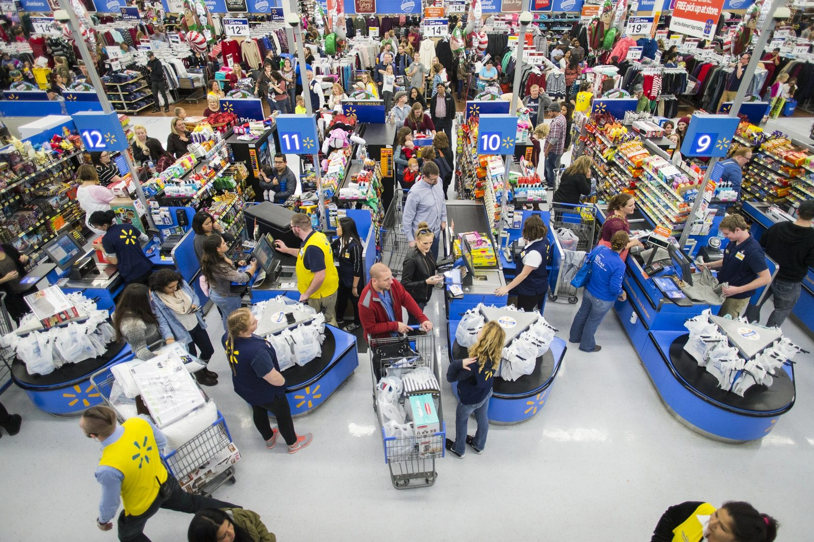

- Let's use geoprocessing tools to solve a real **site selection** problem
- Walmart really does this: a store is a nine-figure decision driven by drive time, competition, and density
- We will do a simplified version with data you can download today
- Store locations: [Walmart open data portal](https://walmart-open-data-walmarttech.opendata.arcgis.com/)

<!-- This is the problem for the rest of the hour and for Lab 11. Walmart publishes its own store locations as open data, so students no longer have to digitize points off Google Maps the way the old version of this lab did. -->

---

# What are the conditions?

- **Not near** an existing Walmart
- **Near** a high density of family residences
- **Within 2 miles** of a highway
- **In** Utah County

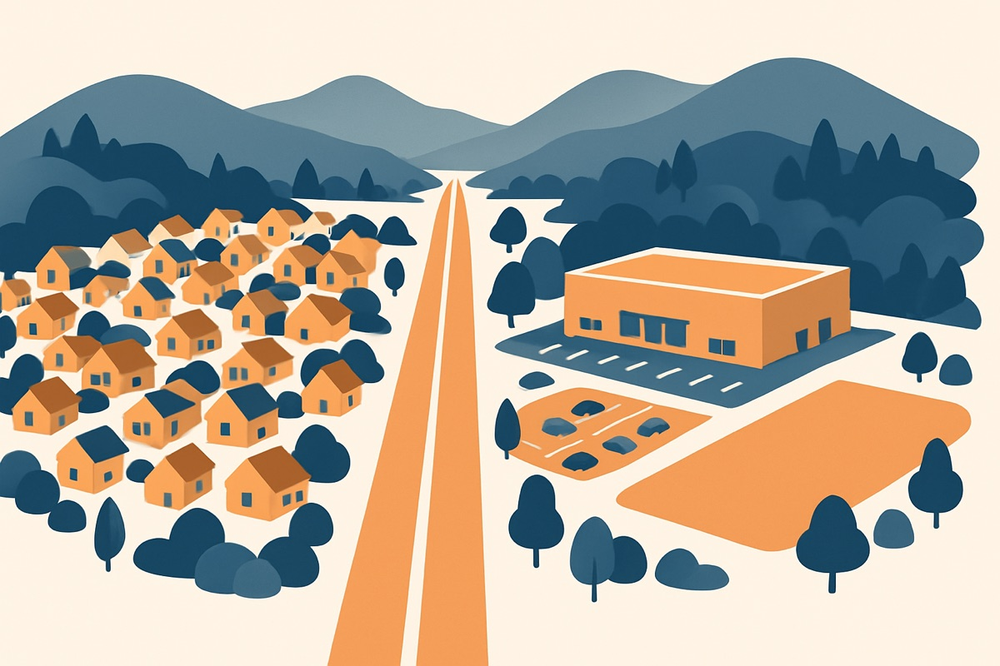

**Which tool does each one?**

- "not near" → ?
- "near a high density of…" → ?
- "within 2 miles of" → ?
- "in" → ?

<!-- Read these out as ordinary English first, then ask the class to translate each one into a tool. "Not near" is a buffer plus a Difference. "Near a highway" is a buffer plus an Intersection. "In Utah County" is a Clip or an Intersection. "High density" is an attribute query. Every criterion is a tool. -->

---

# From criteria to a plan

**What are the criteria?**

- Not too close to existing Walmarts
- Close to roads
- Close to families

**What is the workflow?**

- Select, Intersection, Buffer, Difference, …

**What input data do we need?**

- Existing Walmart locations
- Utah County boundary
- Census blocks
- Major roads

**What tools do we need?**

- QGIS **Processing Toolbox**

<!-- Three questions, always in this order: what are the criteria, what data answers each criterion, what tool turns that data into a yes or no. Students who skip straight to the tools get lost. Make them fill in the data column before they name a single tool. -->

---

# Criteria, written precisely

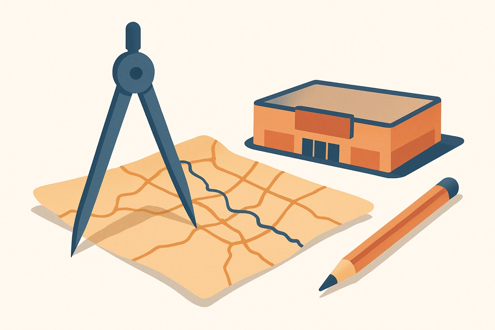

- **Proximity to other Walmarts:** find locations at least **2 miles** from any existing Walmart
- **Proximity to major roads:** find locations **within 2 miles** of I-15 or a highway
- **Population density:** using 2010 Census data, find areas with over **2000 people per square kilometer**
- **Adequate space:** Walmart stores run 51,000–224,000 ft², averaging about **102,000 ft²**. Find locations where an average store would fit without demolishing large areas of existing buildings.

<!-- This is the difference between a wish and a criterion: a number and a unit. "Not near a Walmart" is a wish; "at least 2 miles from any existing Walmart" is something Buffer can execute. The last criterion, adequate space, is the hard one, and it is where students have to make and defend a judgement call. -->

---

# Data

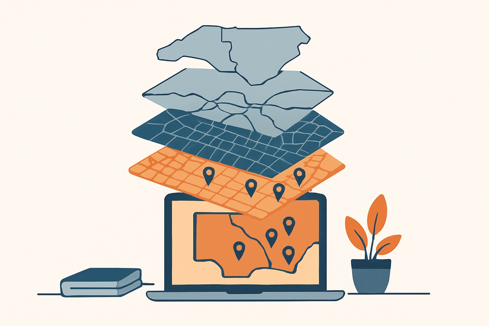

- **Utah County boundary** and **roads and freeways**: [Utah Geospatial Resource Center (UGRC)](https://gis.utah.gov/), formerly AGRC
- **Census blocks:** the Utah Census Block 2010 demographic data package from UGRC
  - Download the Census redistricting file README too — it explains the column headers
- **Existing Walmart locations:** the [Walmart open data portal](https://walmart-open-data-walmarttech.opendata.arcgis.com/) publishes store locations as a downloadable point layer
- Everything lands in QGIS as a **layer**: a shapefile, a GeoPackage, or a downloaded GeoJSON

<!-- The 2021 version of this lab had students digitize Walmart locations by eye off Google Maps. They can still do that as a fallback, but the open data portal is faster and more defensible. Remind them to check the CRS of every layer before running a buffer: distances need a projected CRS. -->

---

# Tools: the QGIS Processing Toolbox

- **Select by Expression** — features that match a rule
- **Buffer** — everything within a distance. Proximity.
- **Clip** — cut the input to an overlay's shape. Cookie cutter.
- **Intersection** — keep only the overlap, with both tables
- **Difference** *(Erase in ArcGIS)* — remove the overlay's area
- **Select / Extract by Location** — features by where they sit
- **Dissolve** — merge features that share a value
- **Field Calculator** — a new column, e.g. a density field

<!-- Fuller versions of each line: Select by Expression finds features matching a rule, e.g. all roads where RT_NAME = '0015', or all census blocks above a density threshold. Buffer is the area within a given distance of a feature. Clip cuts the input layer to the shape of an overlay layer. Intersection keeps only where two layers overlap and carries both attribute tables. Difference removes the input wherever the overlay covers it. Select by Location / Extract by Location picks features by how they sit relative to another layer. Dissolve merges features that share an attribute value into one. Field Calculator computes a new column, e.g. density = population / area. These are the tools for Lab 11 and the final project. Every one of them is in the Processing Toolbox; teach them the search box at the top of the toolbox rather than memorizing menu paths. Difference vs Erase is the naming trap; say it twice. -->

---

# Geoprocessing workflows

<!-- This is the shape of every geoprocessing job. A rectangle is a layer, an oval is an operation. An operation eats layers and produces a new layer, which the next operation eats. Nothing else happens. Have them draw this shape on paper before they open QGIS: it is the single most useful habit in the course. -->

---

# Utah County

<!-- Start here: the whole county, everything still in play. Selected from a statewide counties layer with Select by Expression, then exported as its own layer. -->

---

# UDOT routes

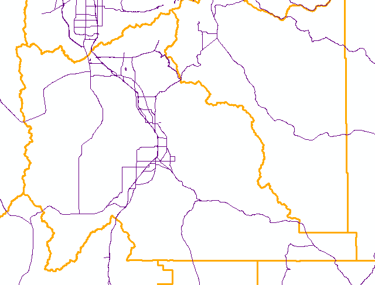

<!-- Every UDOT route in and around the county. Too much: we only want I-15 and the highways. The next two slides show how to narrow it. -->

---

# The attribute table tells you how to select

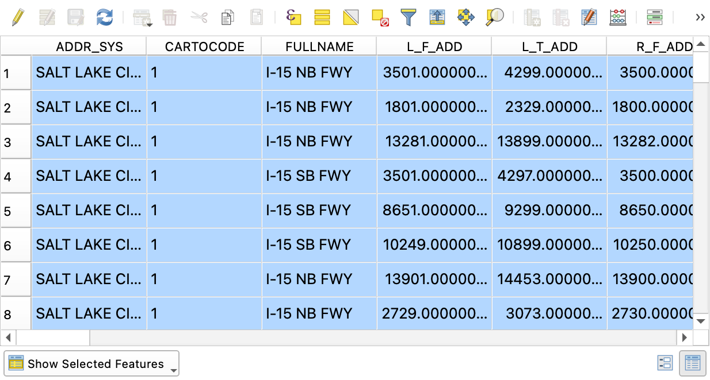

<!-- Open the attribute table before you write any query. HWYNAME, DOT_RTNAME, FULLNAME: the column that separates interstates from local roads is right there. This is the QGIS 3.44 attribute table for the UGRC major roads layer, switched to Show Selected Features after selecting HWYNAME = 'I-15': every row is one piece of the interstate. -->

---

# Just I-15 and the highways

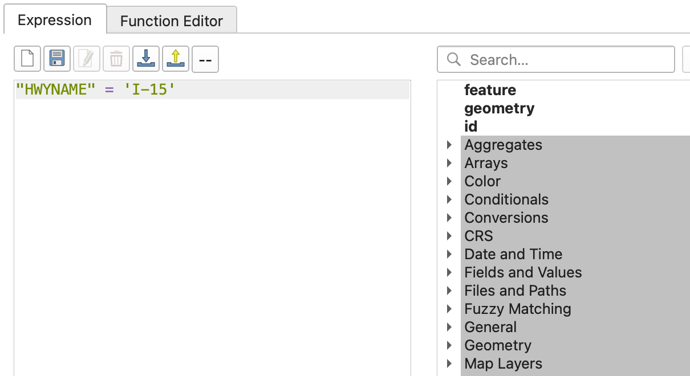

<!-- An attribute query, "HWYNAME" = 'I-15', selects I-15 out of the full roads layer. This is the QGIS Select by Expression dialog; Extract by Expression from the Processing Toolbox gives the same result as a new layer in one step. Note that I-15 comes out as many separate line features, which is why we Dissolve before buffering. -->

---

# Buffer I-15: what does it look like?

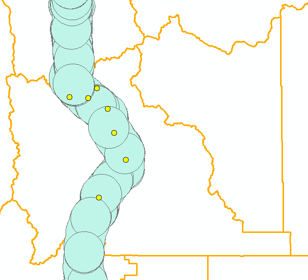

<!-- Two miles either side of the interstate. Ask what went wrong here: the buffer is drawn around each road segment separately, so the overlapping circles show the segments. Dissolve the buffer, or check "dissolve result" in the Buffer dialog, and you get one clean corridor polygon. Also check the units: 2 miles is about 3219 meters. -->

---

# Current Walmarts

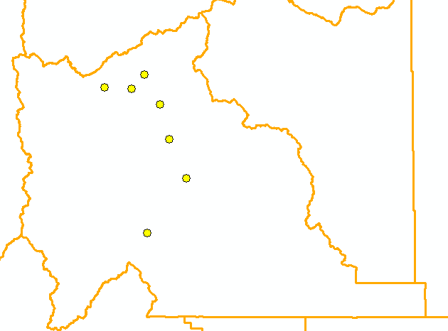

<!-- Nine existing stores, strung along the I-15 corridor because that is where the people are. Ask why the stores are already clustered where our "close to roads" criterion says to build: the criteria are not independent, and the competitor layer will be doing most of the eliminating. -->

---

<!-- _class: activity -->

# Buffer? What next?

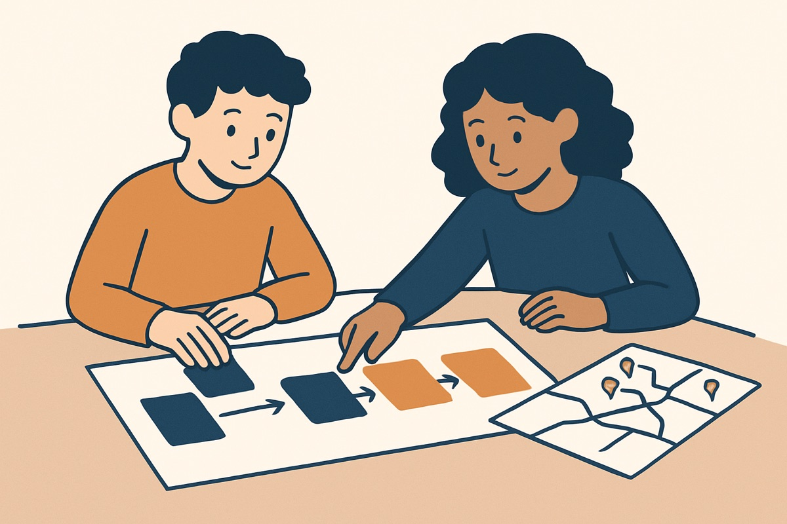

- We have the Walmart points. **Buffer them 2 miles.** Then what?
- In pairs, put the remaining steps in order and name the tool for each:
  - Keep only what is inside Utah County
  - Remove everything within 2 miles of an existing store
  - Keep only what is within 2 miles of I-15 or a highway
  - Keep only the census blocks over 2000 people per km²
- **Does the order matter?** Where would you put the slowest step?

<!-- Five minutes in pairs, then take answers. The order does not change the final geometry, because intersection and difference commute here, but it changes the run time a lot: clip to the county first and every later step works on a fraction of the data. That is a real lesson for the final project. -->

---

# Census blocks

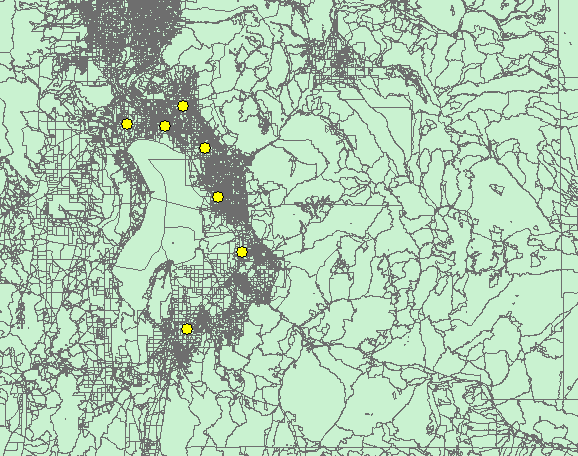

<!-- 2010 census blocks clipped to Utah County, with the Walmart points on top. Blocks are tiny downtown and huge in the mountains, which is exactly why we need density, population divided by area, rather than raw population counts. That is a Field Calculator job. -->

---

# Putting it all together

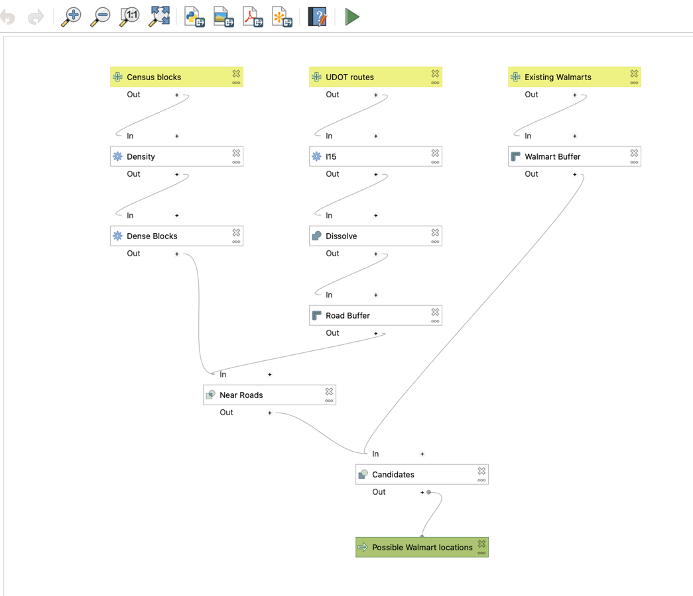

<!-- The full workflow in the QGIS Model Designer (Processing ▸ Model Designer): yellow boxes are the three inputs, white boxes are algorithms, the green box is the output. Trace the three branches with them: census blocks to a density field and an extract by expression, roads to I-15 then Dissolve then Buffer, Walmarts to a Buffer. Intersection keeps the dense blocks near roads, Difference removes the existing-Walmart buffers, and out comes Possible Walmart locations. -->

---

# The answer: a candidate set

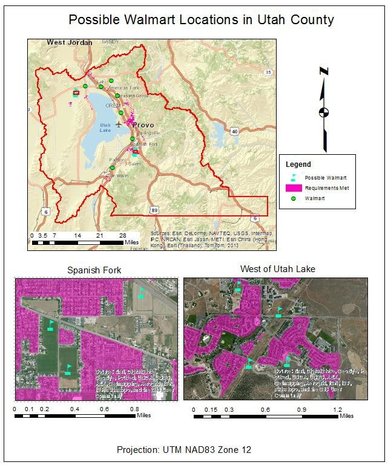

- Everything that survived every criterion
- Two clusters: **Spanish Fork** and **west of Utah Lake**
- Not "the site" — a shortlist for a human to argue about
- Now go back and ask: which criterion did the most eliminating? What would change if 2 miles became 3?

<!-- The payoff. Magenta is "requirements met," and the two insets zoom into the surviving clusters. Push the sensitivity question: a site selection result is only as good as the thresholds, and a good analyst reports how sensitive the answer is to them. This is the standard the final project maps will be graded against. -->

---

# What to carry into the final project

- Write the criteria down as **numbers with units** before you open QGIS
- Draw the **workflow diagram** on paper: layers as rectangles, tools as ovals
- Check the **CRS** of every layer before any distance-based tool
- **Clip to your study area early** so later steps run on less data
- Name intermediate layers so you can retrace your steps
- Report your **assumptions and thresholds** on the map, not just the result

<!-- The transferable part. Every final project is some version of this workflow with different criteria. Tell them the workflow diagram is a required deliverable for the project so they draw it now rather than reverse-engineering it later. -->

---

<!-- _class: activity -->

# Thursday: hands-on in QGIS

- Review of **workflow diagrams**: how to draw one and how to read someone else's
- The **final mapping project** description, walked through in detail
  - [Final project page](https://byu-hydroinformatics.github.io/cce114-geomatics/assignments/final-project/)
- **Study session for Concepts Exam 2** — bring your questions

<!-- Preview of Thursday. The Thursday session is the workflow diagram review and the final project introduction, then opens the floor for exam review. -->

---

# Before Next Class

- **Lab 11: Walmart Site Selection** is due **Saturday** — [Lab 11](https://byu-hydroinformatics.github.io/cce114-geomatics/assignments/lab-11/)
  - Store locations: [Walmart open data portal](https://walmart-open-data-walmarttech.opendata.arcgis.com/)
- **Concepts Exam 2** is in the **Testing Center this week** — check the closing time and do not leave it to the last day
- Read the geoprocessing and spatial analysis chapter in *GIS Fundamentals* (Bolstad & Manson) and take the open-book quiz on Learning Suite
- Start reading the [final project description](https://byu-hydroinformatics.github.io/cce114-geomatics/assignments/final-project/) — it is introduced this week
- Questions? Office hours: [calendly.com/dan-ames/office-hours](https://calendly.com/dan-ames/office-hours)

<!-- Confirm the Testing Center closing time and the exact reading chapter before class. Remind students that the exam covers the geoprocessing tools from today, including the QGIS names. -->

<!-- Conversion notes (2026-09-02): source deck "Geoprocessing - Walmart Site Selection.pptx" (2021, 30 slides, no speaker notes in the original; all notes here are new). Dropped: source slide 26 "Buffer? What next?" reused the identical Current Walmarts image, so it became a text-only class activity; source slide 28 repeated the same generic workflow diagram already shown on slide 19, so it was replaced with the "what to carry into the final project" summary. Software wording updated to QGIS throughout (Erase renamed Difference, ArcToolbox renamed Processing Toolbox, Select By Attributes renamed Select by Expression, ModelBuilder noted as the QGIS Graphical Modeler). Data sources updated: AGRC renamed UGRC, and the "digitize Walmart locations off Google Maps" step replaced with the Walmart open data portal. ArcGIS screenshots kept and flagged for a QGIS re-shoot: images/ws-udot-routes-table.png (ArcMap attribute table), images/ws-select-i15.png (ArcMap Select By Attributes dialog), images/ws-model-builder.png (ArcGIS ModelBuilder diagram); the small Utah County, buffer, Walmart-points and census-block maps are plain map renders with no visible ArcGIS chrome. TODO for the instructor: confirm the Bolstad & Manson chapter number and the Testing Center closing time on the Before Next Class slide, and confirm the Lab 11 Saturday due date. -->

<!-- Update 2026-09-02: ArcGIS-era screenshots replaced with QGIS 3.44 captures made by tools/qgis_reshoot_screens.py: ws-roads-attribute-table-qgis.png, ws-select-i15-qgis.png, ws-graphical-modeler-qgis.png replace the ArcMap table, dialog, and ModelBuilder diagram. -->
