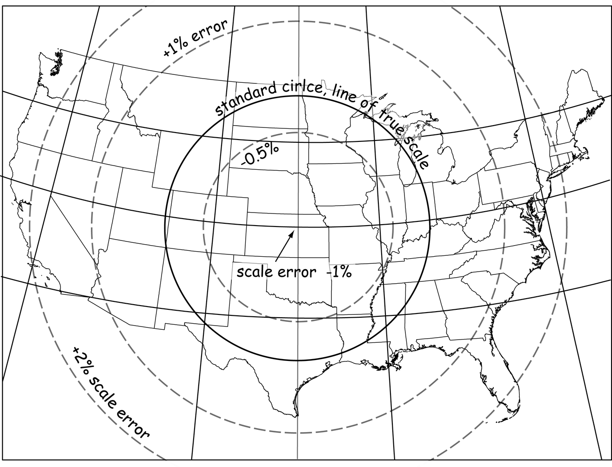
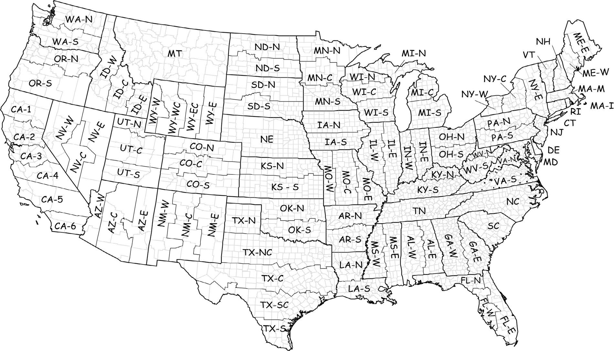

<!-- _class: lead -->
<!-- _paginate: skip -->

# Concepts Review

## Studying for Concepts Exam 2

CCE 114 Geomatics
Dr. James Halgren and Dr. Dan Ames

<!-- Second half of Thursday. This is a study session, not new material: we work through questions in the same style as the textbook quizzes, and the answers are in these speaker notes. Put a question up, let the room answer, then reveal. Do not rush; the discussion after a wrong answer is where the learning happens. -->

---

# Today's Goals

By the end of this session you should be able to:

- Say what **Concepts Exam 2 covers** and how it is administered
- Answer questions in the **style of the textbook quizzes** without your notes
- Spot the topics you are shaky on **while there is still time to fix them**
- Leave with a **study plan** for the rest of the week

<!-- Ask for a show of hands at the end on which sections felt worst; that tells you what to send out as follow-up. -->

---

# Concepts Exam 2: how it works

- Taken in the **Testing Center**
- **Closed book, closed notes** — and **no AI tools**
- Drawn from the **textbook quizzes** and the **lecture concepts** covered so far
- Same question styles you have already seen: multiple choice, true/false, and a few "mark all that apply"

<!-- Be explicit about the AI rule: no chatbot, no assistant, no phone. Also remind them of the Testing Center's closing time on the last day of the exam window; that catches somebody every semester. -->

---

# What is on it

**New since Exam 1**

- Web services and finding data
- Geodesy and projections
- Metadata
- Geoprocessing
- Site selection

**Still fair game, from Exam 1**

- Intro to GIS
- Data models
- Cartography
- GPS
- Vector data
- Raster data

**Everything from the first half of the course is still on the table.**

<!-- Exam 2 is cumulative. Students who only review the new chapters get burned on the data model and cartography questions, which are the easy points. -->

---

<!-- _class: lead -->

# Part 1

## Carried over from Exam 1

---

<!-- _class: quiz -->

# Intro to GIS

**1. What functions can a GIS perform?**

<ol type="A">
<li>Collection and storage of spatial data and information</li>
<li>Maintenance and analysis of spatial data and information</li>
<li>Output and distribution of spatial data and information</li>
<li>All of the above</li>
</ol>

<!-- Answer: D. Collection, storage, maintenance, analysis, output and distribution — the whole chain. If a piece of software only draws maps, it is a mapping program, not a GIS. -->

---

<!-- _class: quiz -->

# Intro to GIS

**2. Which of the following is NOT a reason given in the textbook for the use of GIS by businesses?**

<ol type="A">
<li>Finding potential customers</li>
<li>Looking at the distribution of competitors</li>
<li>Understanding traffic flow</li>
<li>Selling real estate</li>
<li>Guiding advertising campaigns</li>
</ol>

<ol type="A" start="6">
<li>Routing delivery vehicles</li>
<li>Construction planning</li>
<li>Selling stocks and bonds</li>
<li>Designing parking</li>
</ol>

<!-- Answer: H, selling stocks and bonds. Every other option is about something with a location. Stocks and bonds are the one business activity in the list with no geography in it. -->

---

<!-- _class: quiz -->

# Intro to GIS

**3. The selection and purchase of hardware and software is the easiest step in the development of a GIS.**

<ol type="A">
<li>True</li>
<li>False</li>
</ol>

**4. In an institutional context, several iterations through the collection, organization, analysis, output and assessment steps are often required before a final decision is reached.**

<ol type="A">
<li>True</li>
<li>False</li>
</ol>

<!-- Answers: 3 True, 4 True. Buying the software is the easy part; the hard parts are the needs assessment, the data, the people and the procedures. And real GIS work loops — you rarely get to a decision on the first pass through the workflow. -->

---

<!-- _class: quiz -->

# Intro to GIS

**5. Which of the following is a free / open-source GIS software?**

<ol type="A">
<li>ArcGIS</li>
<li>GRASS</li>
<li>MapInfo</li>
<li>Manifold</li>
<li>ERDAS</li>
</ol>

<!-- Answer: B, GRASS. The textbook's list predates QGIS being the obvious answer — QGIS is also free and open source, and GRASS ships inside QGIS as a processing provider. If a question like this appears, look for the name that is not a commercial product. -->

---

<!-- _class: quiz -->

# Data models

**1. What is the meaning of the saying "raster is faster but vector is better"?**

<ol type="A">
<li>Raster analysis is more accurate because it captures point, line and polygon shaped data with exactness</li>
<li>It is more efficient to store and analyse data in a raster format, but vector data can capture more feature detail</li>
<li>Raster files are larger and hence faster for the computer to open and close than vector files</li>
</ol>

<!-- Answer: B. Raster operations are simple cell-by-cell arithmetic, so they are fast; vector geometry follows the real boundary, so it is more faithful. The trade-off is the whole reason both data models still exist. -->

---

<!-- _class: quiz -->

# Data models

**2. Which of these map layers is most likely to contain polygon data?**

<ol type="A">
<li>"Rivers of the United States"</li>
<li>"The U.S. – Mexico Border"</li>
<li>"Provo Airport Runway Configuration"</li>
<li>"Walmart Locations Around the World"</li>
</ol>

<!-- Answer: C. Rivers and a border are lines; store locations at global scale are points; runways drawn at airport scale have real width and area, so they are polygons. This is a question about scale: the same feature is a point at one scale and a polygon at another. -->

---

<!-- _class: quiz -->

# Data models

**3. Which of the following is NOT an example of raster data?**

<ol type="A">
<li>A map displayed on the Google Maps web site</li>
<li>A photo of you posted on the internet</li>
<li>A photo of your dog posted on the internet</li>
</ol>

<ol type="A" start="4">
<li>A regular grid of elevation values depicting mountain heights</li>
<li>A digital scan of an old map</li>
<li>None of the above</li>
</ol>

<!-- Answer: F, none of the above — every one of them is raster. Photos, scans, DEMs and rendered map tiles are all grids of cells. The trap is thinking a "map" must be vector. -->

---

<!-- _class: quiz -->

# Data models

**4. Which spatial phenomenon is best represented by a vector data model?**

<ol type="A">
<li>A planting plan for the vegetable garden at the White House</li>
<li>A map of subsurface groundwater pressure throughout Washington, D.C.</li>
<li>A terrain map of Washington, D.C.</li>
<li>A photo of the White House</li>
</ol>

**5. Why is there typically a one-to-one relationship between features in a vector data model and rows in an attribute table?**

<!-- Answers: 4 is A. Garden beds are discrete objects with crisp edges, so vector. Groundwater pressure and terrain vary continuously, so raster; a photo is already a raster. 5: each row holds the descriptive information for a single feature — one county polygon, one county row, with its own name and population. -->

---

<!-- _class: quiz -->

# Cartography

**1. Which of the following are components of maps?**

<ol type="A">
<li>Data area, neatline, insets</li>
<li>Scale bar, legend, north arrow</li>
<li>Graticules, grids</li>
<li>All of the above</li>
</ol>

**2. What are isopleth maps commonly called, and what do they show?**

<!-- Answers: 1 is D, all of the above. 2: contour maps — lines of equal value, used for elevation, temperature and rainfall. Do not confuse them with choropleth maps, which shade whole polygons by a value like population density. -->

---

<!-- _class: quiz -->

# Cartography

**3. What should happen if generalization results in the omission or degradation of data beyond what is acceptable?**

<ol type="A">
<li>Use it anyway</li>
<li>Switch to a larger-scale map</li>
<li>Return to the source and collect the data with the required precision</li>
<li>B and C</li>
</ol>

**4. What best describes the phrase "exhaustive legend"?**

<!-- Answers: 3 is D, B and C. Either zoom in to a larger scale, or go back and get better data; never publish something you know is too generalized for its purpose. 4: all map symbology is included — every symbol on the map appears in the legend. -->

---

<!-- _class: quiz -->

# Metadata

**What do metadata describe?**

<ol type="A">
<li>Content and form</li>
<li>Origin and coordinate system</li>
<li>Spatial and attribute data characteristics</li>
<li>All of the above</li>
</ol>

<!-- Answer: D. Metadata is data about the data: what is in it, where it came from, when it was collected, what projection it is in, how accurate it is, who to contact, and what you are allowed to do with it. If you cannot answer "what projection is this layer in" without opening it, you needed metadata. -->

---

<!-- _class: quiz -->

# Vector data, digitizing and editing

**1. On-screen digitizing can be used for recording information from which of the following?**

<ol type="A">
<li>Digital photographs</li>
<li>Satellite images</li>
<li>Scanned aerial images</li>
<li>All of the above</li>
<li>Both A and C</li>
</ol>

**2. According to the book, a line consists of what 3 pieces?**

<!-- Answers: 1 is D — anything you can display underneath the canvas can be traced. 2: a starting node, vertices in between, and an ending node. "A beginning, a middle and an end" is the joke answer. -->

---

<!-- _class: quiz -->

# Vector data, digitizing and editing

**3. What does a spline function do?**

<ol type="A">
<li>Smoothly interpolates curves between points</li>
<li>Cuts and removes sections of a line</li>
<li>Stores line data, which can be pasted into a text file</li>
<li>Splices a line into multiple segments</li>
</ol>

**4. What is skeletonizing used for?**

<!-- Answers: 3 is A — a spline fits a smooth curve through your digitized vertices instead of joining them with straight segments. 4: both line thinning and reducing the width of lines or points to a single pixel — it is how a scanned, raster line gets turned into a one-cell-wide line ready for vectorizing. -->

---

<!-- _class: quiz -->

# Vector data, digitizing and editing

**5. In which situation would rubbersheeting be appropriate?**

<ol type="A">
<li>Finding the number of plant species in northern Tibet</li>
<li>Identifying crime locations across the United States</li>
<li>Overlaying an 1880 map of Paris on a modern map</li>
<li>Finding the best place to open a wildlife reserve</li>
</ol>

<!-- Answer: C. Rubbersheeting stretches a layer non-uniformly so that known control points line up with their true positions — exactly what an old, distorted map needs before it can sit on a modern basemap. -->

---

<!-- _class: quiz -->

# GPS and GNSS

**1. What are the three main components of any GNSS?**

<ol type="A">
<li>Satellite, control and user segments</li>
<li>Inexpensive, accurate and easy to use</li>
<li>Antenna, receiver and computer</li>
<li>Antenna, receiver and user</li>
</ol>

**2. How does using a base station help correct for positional error?**

<!-- Answers: 1 is A — the space segment, the ground control segment, and the user segment. 2: a receiver at a known location can estimate the timing and range errors in the signal right now, and that correction is applied to your rover. -->

---

<!-- _class: quiz -->

# GPS and GNSS

**3. What is the range in GNSS accuracy?**

<ol type="A">
<li>Centimeters to meters</li>
<li>Centimeters to 100+ meters</li>
<li>Millimeters to centimeters</li>
<li>One meter to ten meters</li>
</ol>

**4. A high RMSE value is considered good.**

<!-- Answers: 3 is B. Survey-grade equipment with corrections gets centimeters; a phone under tree cover or between tall buildings can be off by a hundred meters or more. 4 is False — RMSE is an error measure, so lower is better. -->

---

<!-- _class: quiz -->

# Raster data and imagery

**1. What makes a sensor passive?**

<ol type="A">
<li>It uses very little energy</li>
<li>It detects only energy that is reflected off objects</li>
<li>It is meant for collecting data over a long period of time</li>
<li>The sensor is in constant motion</li>
</ol>

**2. What is photogrammetry?**

<!-- Answers: 1 is B — a passive sensor collects energy that came from somewhere else, usually the sun. An active sensor, like radar or LiDAR, sends out its own pulse. 2: the science of measuring geometry from images. -->

---

<!-- _class: quiz -->

# Raster data and imagery

**3. Select the characteristics indicative of satellite imagery. *(mark all that apply)***

<ol type="A">
<li>Less expensive when used in small areas</li>
<li>Pointing direction very precise</li>
<li>May require specialized image processing software</li>
<li>Decreases terrain-caused distortion</li>
<li>Available at reduced cost from government sources</li>
</ol>

**4. LiDAR sensors are considered to be passive.**

<!-- Answers: 3 is B, C and D. Satellites have very precise pointing, their imagery often needs specialist processing, and their high altitude and near-vertical view reduce terrain distortion compared with an aircraft. They are not cheaper for a small area — that is when you hire a plane or fly a drone. 4 is False: LiDAR emits its own laser pulse, so it is active. -->

---

<!-- _class: lead -->

# Part 2

## New since Exam 1

---

<!-- _class: quiz -->

# Geodesy

**1. What is geodesy?**

<ol type="A">
<li>The study of the shape of the earth</li>
<li>The study of rocks in the earth</li>
<li>A voyage taken by early Greek scientists to measure points across the surface of the earth</li>
<li>None of the above</li>
</ol>

**2. Which assumption by early Greek scientists underlies most geodetic observations of the past two millennia?**

<!-- Answers: 1 is A — the measurement of the earth's shape, size and gravity field. 2: that the sun and stars provide a stable reference frame. Every classical measurement of the earth is really an angle measured against something in the sky. -->

---

<!-- _class: quiz -->

# Geodesy

**3. Which is the closest mathematical approximation of the shape of the earth?**

<ol type="A">
<li>Geoid</li>
<li>Ellipsoid</li>
<li>Spheroid</li>
<li>Terrain</li>
</ol>

**4. The geoid is a mathematically defined surface.**

<!-- Answers: 3 is B, the ellipsoid — the key word is *mathematical*. The geoid is closer to the real earth but it is measured, not defined by an equation, so 4 is False. Order to remember: terrain (real, bumpy) → geoid (gravity, measured) → ellipsoid (smooth, mathematical) → sphere (simple). Question 4 in the geoid set also asks what shapes the "imaginary sea": the answer is the earth's gravity. -->

---

<!-- _class: quiz -->

# Projections and datums

**1. What is a datum?**

<ol type="A">
<li>A specified reference surface</li>
<li>A type of coordinate system</li>
<li>A point on a line of longitude</li>
<li>A point on a line of latitude</li>
</ol>

**2. Why is coordinate transformation also called registration?**

<!-- Answers: 1 is A — a datum ties an ellipsoid to the actual earth, so coordinates mean something. NAD83 and WGS84 are datums; UTM is a projected coordinate system built on one. 2: because it registers the layers to a map coordinate system, that is, puts them in the same frame so they line up. -->

---

<!-- _class: quiz -->

# Projections: reading a distortion diagram

Which statement is most accurate?

<ol type="A">
<li>Equally suitable for every state in a straight line between Utah and Kentucky</li>
<li>Equally suitable for southeastern Florida and northeastern Washington state</li>
<li>Equally suitable for north, central and south Texas</li>
</ol>

<!-- Answer: B. Distortion in this projection depends only on distance from the standard circle, so any two places on the same ring have the same scale error, however far apart they are. Southeastern Florida and northeastern Washington sit on the same ring. A straight line between Utah and Kentucky crosses several rings, and so does Texas from north to south. This is textbook figure 3-33. -->

---

<!-- _class: quiz -->

# Projections: UTM

**Which statement about a transverse Mercator projection is most accurate?**

<ol type="A">
<li>UTM minimizes distortion equally well for all areas within a single UTM zone</li>
<li>UTM minimizes distortion along the equator</li>
<li>UTM minimizes distortion along a line of longitude at the middle of a particular UTM zone</li>
<li>UTM minimizes distortion in the northern hemisphere but not the southern</li>
</ol>

<!-- Answer: C. The cylinder is turned on its side and touches the globe along a central meridian, so distortion is smallest there and grows toward the edges of the zone. That is exactly why the zones are only six degrees wide, and why Utah is split across zones 12 and 11. -->

---

<!-- _class: quiz -->

# Projections: choosing one

**Which projection best minimizes distortion in distance, shape and area throughout the state of Tennessee?**

<ol type="A">
<li>Lambert Conformal Conic</li>
<li>Universal Transverse Mercator</li>
</ol>

<!-- Answer: A, Lambert Conformal Conic. Tennessee is wide east-to-west and narrow north-to-south, so a conic with two standard parallels running along its length fits it well; a UTM zone is tall and narrow and would need several zones to cover the state. The rule of thumb: east-west states get Lambert Conformal Conic, north-south states get transverse Mercator. This is textbook figure 3-40, the State Plane zones. -->

---

<!-- _class: quiz -->

# Finding data

**1. What are the benefits of using a uniform global data source?**

<ol type="A">
<li>Units are consistent among different datasets</li>
<li>Avoid having to reconcile differences among disparately collected datasets</li>
<li>Increases the number and type of available global datasets</li>
<li>All of the above</li>
</ol>

**2. Which information is NOT contained in the National Hydrography Dataset?**

<!-- Answers: 1 is B. A uniform global source does not add datasets or fix your units for you; what it buys you is that you are not stitching together data collected by a hundred different agencies to different standards. 2: swimming pools. The NHD holds rivers, streams, lakes, wells and pipelines — the nation's surface water network. -->

---

<!-- _class: quiz -->

# Finding data

**3. What is the minimum mapping unit?**

<ol type="A">
<li>Target size of the smallest feature captured</li>
<li>The smallest mappable pixel size</li>
<li>The smallest wetland boundary visible in an aerial image</li>
<li>Both A and C</li>
</ol>

**4. According to the text, what is a chief purpose for using a floodplain map?**

<!-- Answers: 3 is A — the minimum mapping unit is a decision made before collection about how small a feature is worth recording, not a property of the imagery. 4: to set flood insurance rates. That is what FEMA's flood insurance rate maps are for. -->

---

<!-- _class: quiz -->

# Finding data and web services

**5. The TIGER system is a key government tool in the collection of census data.**

<ol type="A">
<li>True</li>
<li>False</li>
</ol>

**6. When you add a layer to QGIS from a WMS, what actually arrives over the network?**

<!-- Answers: 5 is True — TIGER is the Census Bureau's geographic database of roads, boundaries and address ranges, and it is a free download. 6: a rendered map image. A WMS serves pictures; a WFS serves the features themselves, so you can query and edit them; an XYZ tile service serves pre-rendered image tiles. If you can open the attribute table, you have vector features, not a picture. Question 6 was written for this review, not taken from the textbook quizzes. -->

---

<!-- _class: quiz -->

# Geoprocessing

**1. The textbook author uses "spatial operation" and "spatial function" to mean the same thing.**

**2. In a single chain of operations like this one, the order of the 1st, 2nd and 3rd spatial operations does not matter — you get the same final layer either way.**

<!-- Answers: 1 True; 2 False. The order matters. Each operation consumes the layer the one before it produced, so changing the order changes what the later operations are even looking at. This is textbook figure 9-1, and it is the same point we made this morning with the cookie cutter. -->

---

<!-- _class: quiz -->

# Geoprocessing: spatial scope

**3. Spatial scope is the extent or area of the input data used in determining the values at output locations, and is generally characterized as local, neighborhood or global.**

**4. Reclassifying every county in Utah as high, middle or low income from its own per-capita income is an example of what?**

**5. Determining the wealthiest county in Utah from those same values is an example of what?**

<!-- Answers: 3 True. 4 is a local operation: the output for each county depends only on that county's own value. 5 is a global operation: to know which county is the wealthiest you have to look at every county in the dataset. A neighborhood operation sits in between — a moving window, or "each county and the ones touching it". -->

---

<!-- _class: quiz -->

# Geoprocessing: buffers

**1. Buffers may be determined for both vector and raster data.**

<ol type="A">
<li>True</li>
<li>False</li>
</ol>

**2. A multi-ring buffer is also known as what?**

<ol type="A">
<li>A simple buffer</li>
<li>A compound buffer</li>
<li>A nested buffer</li>
</ol>

<!-- Answers: 1 True — a raster buffer is a distance calculation over cells; a vector buffer builds a new polygon. 2 is C, nested: rings at 1, 2 and 5 miles, each one inside the next. -->

---

<!-- _class: quiz -->

# Geoprocessing: overlays

**3. An overlay operation combines the features from two or more spatial data layers into a single data layer.** *(True / False)*

**4. Point-on-line overlay is common because point features often intersect line features, e.g. accident locations.** *(True / False)*

**5. Combining a layer of addresses with a layer of school district boundaries is an example of what?**

<!-- Answers: 3 True. 4 False — this is the one people miss. Points almost never fall exactly on a line, because a coordinate has to match to full precision; in practice you snap points to lines or buffer the line first, which is why point-on-line overlay is uncommon. 5: point-on-polygon overlay, the most common overlay of all — "which district is this address in?" -->

---

<!-- _class: quiz -->

# Site selection

**Which sequence finds land inside Utah County that is at least 2 miles from an existing Walmart?**

<ol type="A">
<li>Buffer the county by 2 miles, then Intersect with the Walmart points</li>
<li>Buffer the Walmart points by 2 miles, then Difference those buffers out of the county</li>
<li>Clip the Walmart points to the county, then Dissolve</li>
<li>Select the Walmart points by expression, then Buffer the county</li>
</ol>

<!-- Answer: B. "At least 2 miles away from" is always a buffer followed by a difference: build the exclusion zone, then cut it out of your candidate area. "Within 2 miles of" is the opposite — buffer, then intersect or clip. These two site-selection questions were written for this review; the exam's site-selection questions come from the geoprocessing chapter and from Lab 11. -->

---

<!-- _class: quiz -->

# Site selection

**In a site-selection workflow, what are the "intermediate layers" for?**

<ol type="A">
<li>Nothing — delete them to save disk space</li>
<li>They are the evidence of your processing steps, and they let you check each criterion separately</li>
<li>They are required by the software and cannot be deleted</li>
<li>They store the map's cartographic elements</li>
</ol>

<!-- Answer: B. Each intermediate layer is one criterion applied. If your final answer looks wrong, the intermediates tell you which step broke it — and in the final project they are a graded part of the report. -->

---

# How to study this week

- Redo every **textbook quiz** — the exam questions are in the same style, and several are the same questions
- Re-read the **figures** the quizzes point at: the distortion diagram, the State Plane zone map, the workflow chain
- For each lecture topic, write **one sentence** explaining it from memory, then check it
- Practise the vocabulary pairs that get confused: geoid vs ellipsoid, isopleth vs choropleth, active vs passive, local vs global, WMS vs WFS
- Go to the **Testing Center early** in the window, not on the last afternoon

<!-- Encourage them to study in pairs and quiz each other out loud; it exposes the topics they only recognize rather than know. -->

---

# Before Next Class

- Take **Concepts Exam 2** in the Testing Center — closed book, closed notes, **no AI tools**
- **Week 13 and Week 14 classes are final project work sessions** — bring your laptop, your data, and a specific question
- **Web Mapping with AI Experience** is due in **Week 14**
- The **final project PDF** is due the **Saturday of Week 14**
- Questions? Office hours: [calendly.com/dan-ames/office-hours](https://calendly.com/dan-ames/office-hours)

<!-- Fill in the exam window dates before class. -->

<!-- Conversion notes (2026-09-02): source "15 - Concepts Review.pptx" (2018, 33 slides), which is entirely screenshots of textbook quiz questions with a blue arrow marking each answer. Every question was transcribed to text and rebuilt as a quiz slide with the answer in the speaker notes, so none of the original screenshots are used as images; only three figures were carried over (the projection distortion diagram, the State Plane zone map, and the chapter 9 workflow chain). Dropped: the two Surveying sections, source slides 18-21 (surveying intro and surveying traverses, 10 questions on chains, bearings, azimuth formulas and traverse closure) because surveying is not in this course's Exam 2 scope; the azimuth-measurement question from the GPS section for the same reason; and the "Landsat satellites previous to Landsat-8 carried how many primary imaging scanners" trivia question. Added, not from the source: one web-services question (WMS vs WFS) and two site-selection questions, both flagged as instructor-written in their speaker notes, because those topics are in the Exam 2 scope but were not in the 2018 deck. The free/open-source-software question keeps the textbook's answer (GRASS) with a note that QGIS is also free and open source. No ArcGIS screenshots in this deck. Presenter titles updated from "Dr. Dan Ames and Dr. Jim Nelson" to the current instructors. -->
