<!-- _class: lead -->
<!-- _paginate: skip -->

# Final Mapping Project

CCE 114 Geomatics
Dr. James Halgren and Dr. Dan Ames

<!-- Thursday working session. Today has two halves: this deck, where we walk the site-selection workflow one more time and hand out the final project, and the concepts review deck for Exam 2. Have the final project instructions open on Learning Suite before class so students can follow along. -->

---

# Today's Goals

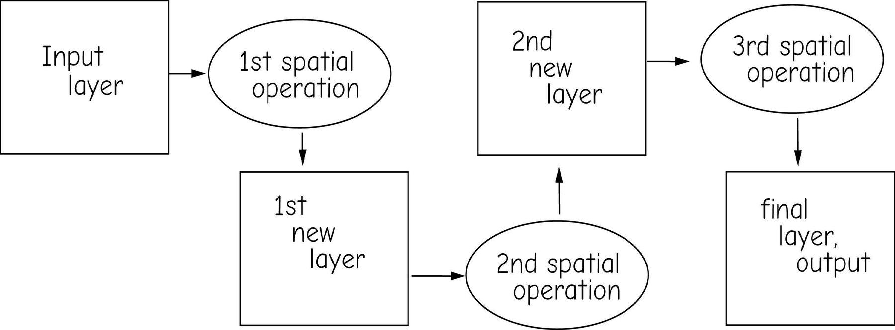

By the end of class you should be able to:

- Read a **workflow diagram** and say what each box and oval holds
- Rebuild the **Lab 11 site-selection workflow** from criteria to final map
- Name the **QGIS tool** that does each step
- Choose your final project **problem and county**, and sketch its workflow
- Say exactly what you have to hand in, and when

<!-- Working session, not a lecture. The goal is that everyone leaves with a chosen project, a chosen county, and a first draft of their processing steps written down. -->

---

<!-- _class: lead -->

# Warm-up: the Lab 11 workflow

## What are the criteria? What data? What tools? In what order?

<!-- Lab 11 (Walmart Site Selection) is the closest model for what the final project asks for. Walk it once more, out loud, before handing out the project. -->

---

# Where to put a new Walmart in Utah County?

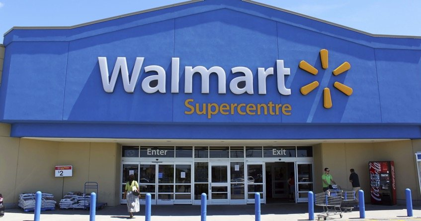

**What are the conditions?**

- Not near an existing Walmart
- Near a high density of family residences
- Within 2 miles of a highway
- In Utah County

<!-- Start with the plain-English conditions. Do not let anyone name a tool yet: first the conditions, then the data, then the tools. This is the same order the final project report has to follow. -->

---

# Criteria, written so a computer can check them

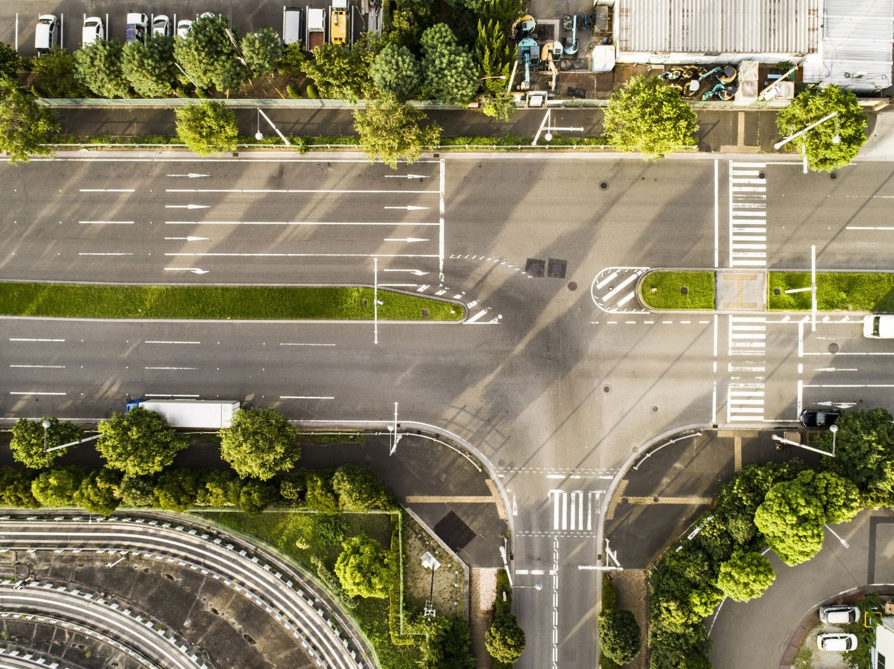

- **Proximity to other Walmarts:** at least **2 miles** from any existing store
- **Proximity to major roads:** within **2 miles** of I-15 or a highway
- **Population density:** over **2000 people per km²** (Census block data)
- **Adequate space:** stores run 51,000–224,000 ft², average about **102,000 ft²** — find places where that fits without demolishing a neighbourhood

<!-- The jump from "near a highway" to "within 2 miles of I-15 or a highway" is the whole trick. Every criterion needs a number and a layer before you can run a single tool. Their final project criteria have to be written this way too. -->

---

# Data: four layers, all free

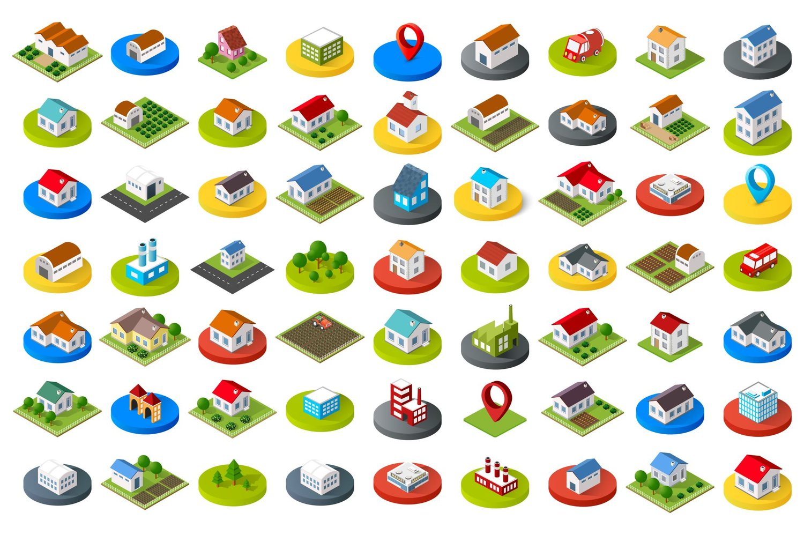

- **Utah County boundary** — Utah Geospatial Resource Center (UGRC, formerly AGRC), [gis.utah.gov](https://gis.utah.gov)
- **Roads and freeways** — UGRC
- **Census blocks with demographics** — UGRC Census block package, plus the redistricting README that explains the column names
- **Existing Walmart locations** — find them in a web map, then **digitize** them into a new point layer of your own

<!-- Point out that three of the four are downloads and the fourth they make themselves. Digitizing your own layer is a legitimate data source as long as you say so in the report. Note the agency renamed from AGRC to UGRC; older lab handouts and slides still say AGRC. -->

---

# Tools: what each one is for

- **Select by Expression / Extract by Attribute** — pull out the features that match a rule, e.g. roads named "I-15", or blocks over a density threshold
- **Buffer** — the area within a set distance of a feature
- **Intersect / Clip** — the cookie-cutter: keep only what falls inside the other layer

- **Difference** (ArcGIS calls it *Erase*) — cut the input features out of the target
- **Dissolve** — merge like features into one
- **Digitize** — build a new layer by drawing features yourself
- **Field Calculator** — compute a new attribute column, e.g. density = population ÷ area

<!-- These all live in the QGIS Processing Toolbox under Vector overlay and Vector geometry. Erase is the one name that changes: in QGIS it is Difference. Field Calculator is in the attribute table window. -->

---

# What is a workflow?

**Rectangles are layers. Ovals are operations. Every arrow makes a new layer.**

<!-- This is the figure from chapter 9 of the textbook and it is the single most useful picture in the course. The order matters: a different order gives a different final layer. Their report has to contain a diagram like this one, drawn for their own project. -->

---

<!-- _class: quiz -->

# In what order would you run these?

To find land at least 2 miles from an existing Walmart, inside Utah County, and within 2 miles of a highway:

<ol type="A">
<li>Buffer roads → Buffer Walmarts → Clip to county → Difference</li>
<li>Difference → Clip to county → Buffer roads → Buffer Walmarts</li>
<li>Clip to county → Buffer roads → Buffer Walmarts → Difference</li>
<li>Any order works — you get the same answer</li>
</ol>

<!-- A and C both work and give the same result; D is the trap. Order matters whenever an operation changes the extent that a later operation sees, and clipping early is usually faster because every later step runs on less data. Ask them to defend an answer before you say which. This is the same idea as the Figure 9-1 true/false question that shows up on the concepts exam. -->

---

<!-- _class: lead -->

# Geoprocessing is cookie cutting

<!-- The next seven slides are one long analogy. Run them quickly, one click each. Students remember this. -->

---

# Start with "everywhere"

<!-- Rolled dough is the whole world. Before any criterion is applied, every location is still a candidate. -->

---

# Find the State of Utah

<!-- Line up the cutter: choose the layer that defines your study area. -->

---

# One cut, and you have a study area

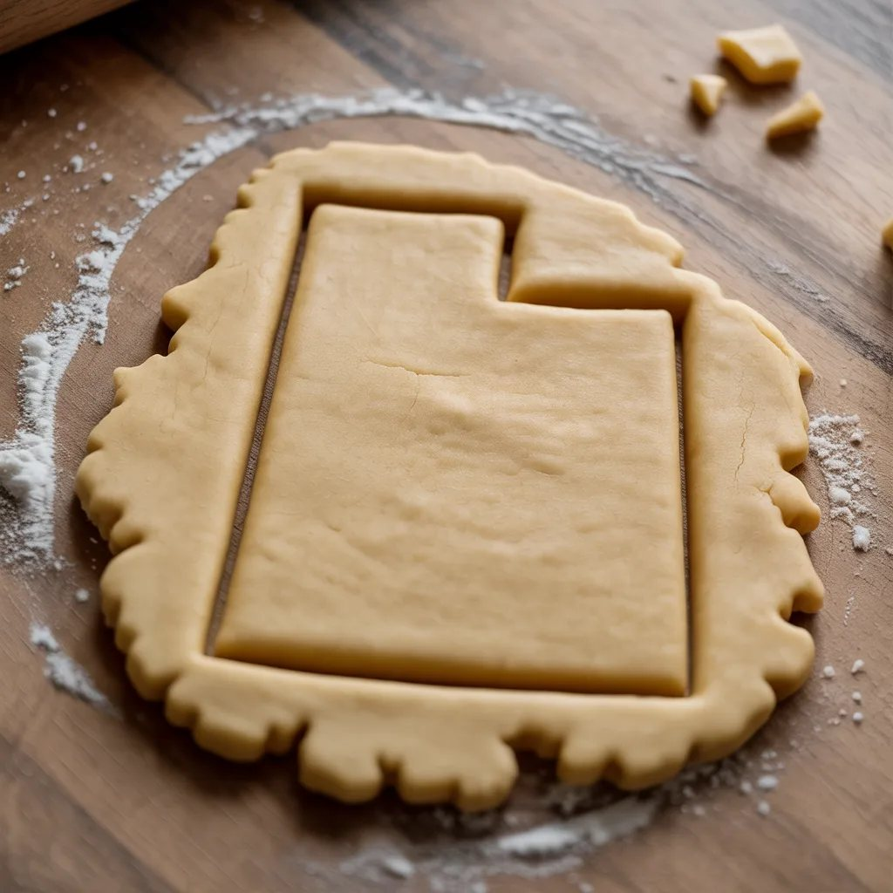

<!-- The cut shape is a new layer. The dough that is left over is discarded. That is a Clip. -->

---

# Intersect Utah with Utah County

<!-- Now a second, smaller cutter: intersect the state with the county so only the county remains. Each cut narrows the candidate area. -->

---

# Now cut out Utah Lake

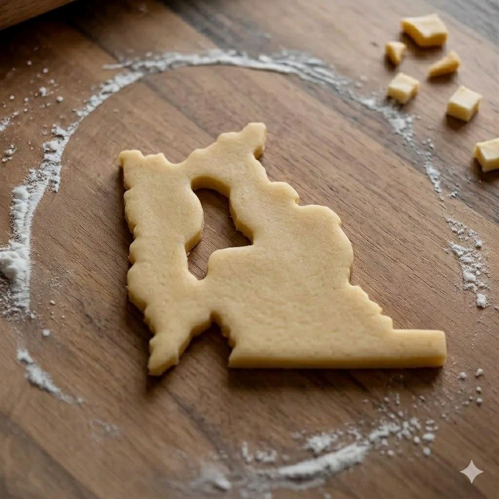

<!-- Difference (Erase in ArcGIS): remove the water. You cannot build a store in the lake, so the lake polygon is cut out of the candidate area. -->

---

# Cut out everything too close to an existing Walmart

<!-- Buffer the existing stores by 2 miles, then Difference those buffers out. What is left is every location that satisfies all the criteria at once. Each hole is one store's exclusion zone. -->

---

# A new dataset, ready to share

<!-- The output is a brand new layer that did not exist before. That layer, symbolised and put on a map with the required elements, is the deliverable. -->

---

# The analogy, in QGIS names

| Cookie step | QGIS tool |
| --- | --- |
| Rolled dough | your input layers |
| Line up the cutter | **Select by Expression** |
| Cut the shape | **Clip** |
| Cut with a second shape | **Intersect** |
| Punch out a hole | **Difference** |
| Ring around a feature | **Buffer** |
| Merge crumbs | **Dissolve** |

Every cut writes a **new layer**.

Keep them. Those intermediate layers are what you screenshot for the report, and they are the only way to check one criterion at a time when the answer looks wrong.

Name them as you go: `step1_clip`, `step2_buffer`, `step3_difference`.

<!-- Emphasise the last line. Students routinely overwrite their intermediates and then have nothing to show for the processing steps, which is a graded part of the report. Tell them to name layers step1_clip, step2_buffer, and so on. -->

---

# The finished product

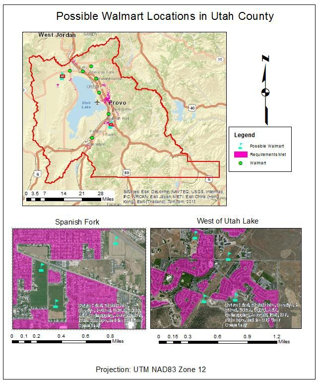

What to notice:

- A **title** that says what the map shows
- **Legend, scale bar, north arrow, data sources, projection**
- Two **inset maps** zoomed to the best candidate sites
- Candidate areas symbolised so they read at a glance
- Nothing on the page that is not doing a job

<!-- A past student's final map: an overview with the candidate areas in magenta, two inset maps zoomed to the best sites, legend, scale bars, north arrow, and the projection named at the bottom. This is the standard. Note this example was made in ArcMap, so the layout furniture looks a little different from QGIS Print Layout, but the required elements are identical. -->

---

<!-- _class: lead -->

# Your Final Mapping Project

## Same workflow, your problem, your county

---

# What the project asks for

- Work **alone or in pairs**; choose one of the five projects and one **Utah county**
- Sign up so no two teams take the same county
- Find at least **four** appropriate datasets
- Decide which spatial analyses solve your problem, and **write the steps down first**
- Run the analyses in QGIS, then build the final map
- Report the data, the analyses, and the result — with **intermediate maps** along the way

<!-- Read the full instructions document on Learning Suite with them; this slide is the summary, not the specification. The "write the steps down first" line is the one that saves them the most time. -->

---

# Choose your problem

Find a suitable location for:

1. A **solar panel farm**
2. A **landfill**
3. An **airport**

4. An **LDS temple**
5. An **irrigation reservoir**

For whichever you pick: **What are the criteria? What data are required? What tools and analyses are needed? In what order?**

<!-- Give them two minutes to pick before you walk the five option slides. Any of the five works with the same tool set they used in Lab 11. -->

---

# Site selection: solar panel farm

<a href="https://www.youtube.com/watch?v=QmHzP-i-mm4" target="_blank">

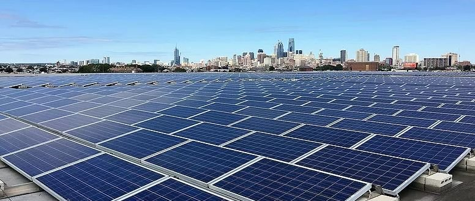

</a>

<a href="https://www.youtube.com/watch?v=QmHzP-i-mm4" target="_blank">youtube.com/watch?v=QmHzP-i-mm4</a>

- What are the criteria?
- What are the data?
- What are the tools?
- What is the workflow?

<!-- Solar farms want flat ground, high solar radiation, a nearby transmission line and a road, and land that is not already built on or protected. Slope from a DEM, land cover, and transmission lines are the obvious layers. The linked video is a short piece on utility-scale solar siting; click the image to open it in a new tab. -->

---

# Site selection: landfill

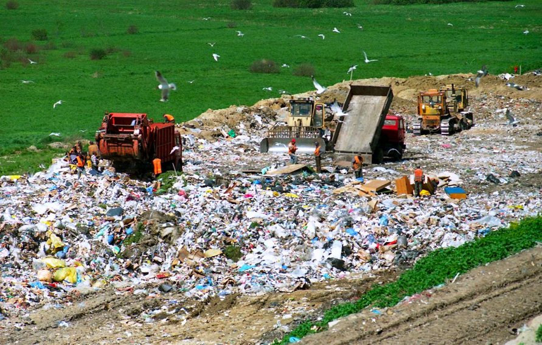

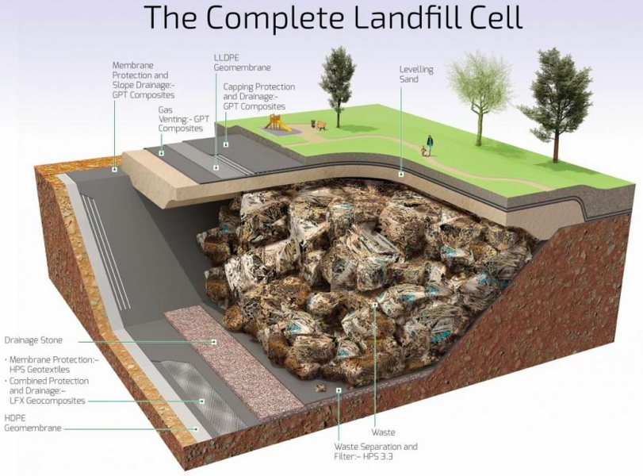

- What are the criteria?
- What are the data?
- What are the tools?
- What is the workflow?

<!-- Landfills are the classic exclusion problem: away from housing, away from streams and wells, away from floodplains, off steep slopes, on the right soils, but still within a reasonable haul distance of the population it serves. Almost all Difference and Buffer. -->

---

# Site selection: airport

- What are the criteria?
- What are the data?
- What are the tools?
- What is the workflow?

<!-- Airports need a long flat run of land, clear approach paths, distance from dense housing because of noise, and road access. Slope and land cover from raster data, plus population from Census blocks. -->

---

# Site selection: irrigation reservoir

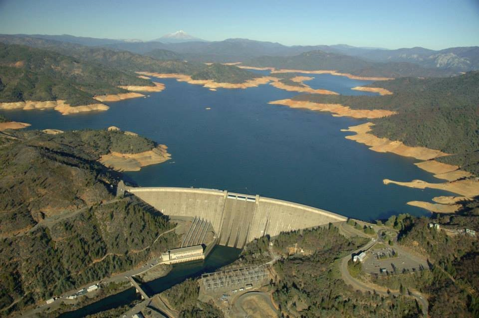

- What are the criteria?
- What are the data?
- What are the tools?
- What is the workflow?

<!-- Reservoirs want a narrow valley with a large upstream drainage area, close to the farmland being served, and not on top of existing development. This one leans hardest on terrain data. -->

---

# Site selection: temple

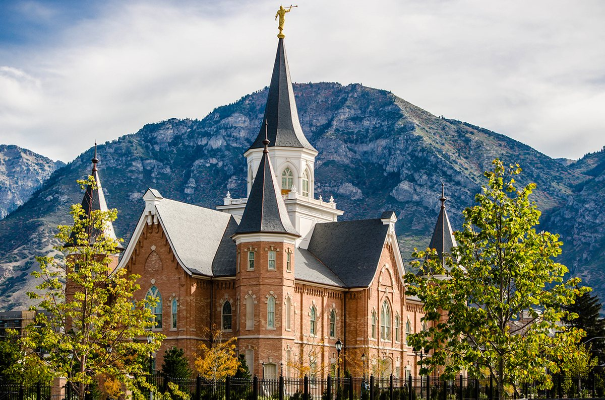

- What are the criteria?
- What are the data?
- What are the tools?
- What is the workflow?

<!-- Temple siting is a membership-density and drive-time problem: far enough from existing temples, close to a large membership, visible, and on a parcel large enough to hold the building and its grounds. -->

---

# What to include in your written report

- **Introduce the problem** — what are you siting, where, and why
- **Describe the data** — every layer, where it came from, its projection
- **Describe the tools** — each analysis step, with the workflow diagram
- **Describe your result** — the sites you selected and why they won

<!-- The report is a short technical document, not an essay. Two to three pages of text is enough; the maps carry the rest. Anything they downloaded needs a source named. -->

---

# What to include in your map

- All **required cartographic elements**: title, legend, scale bar, north arrow, neatline, data sources, projection
- At least one **inset map** zoomed to the selected sites
- A **point marker** on each selected site
- **IMPORTANT:** also include maps of your **intermediate results** — the data you worked on to get to the final map

<!-- The intermediate maps are where most of the grade separation happens. A single beautiful final map with no evidence of the processing is not a complete submission. Screenshots from the QGIS map canvas are fine for the intermediates; the final map goes through Print Layout. -->

---

# The deliverable

- **One PDF report**, submitted online
- Due the **Saturday of Week 14**
- The PDF holds the write-up, the **intermediate maps and data** that show your processing steps, and the **final results map**
- Full instructions: **Learning Suite**
- Also on the course site: [Final Project page](https://byu-hydroinformatics.github.io/cce114-geomatics/assignments/final-project/)
- Closest model for the workflow: [Lab 11 — Walmart Site Selection](https://byu-hydroinformatics.github.io/cce114-geomatics/assignments/lab-11/)

<!-- One PDF. Not a folder of images, not a QGIS project file. Point them at the instructions document on Learning Suite for the grading breakdown. -->

---

<!-- _class: activity -->

# Get started right now

- Enter your **name**, your **selected project**, and your **selected county** in the class sign-up sheet
- Only **one or two people per county** — first come, first served
- Then, on paper: list your **criteria**, the **layers** you will need, and a first **workflow diagram**
- Bring that sketch to the Week 13 work session

<!-- TODO: the sign-up sheet link lives on Learning Suite; the 2018 deck linked a Google Sheet that is no longer current. Paste this term's sheet link here or drop it in the Learning Suite announcement before class. -->

<!-- Spend the last fifteen minutes of class on this. Walk the room; the students who leave without a county chosen are the ones who fall behind. -->

---

# The next two weeks

- **Week 13 and Week 14 class sessions are work sessions.** Bring your laptop and your data; both instructors are in the room to help
- Come with a specific question: a tool that will not run, a projection mismatch, a layer you cannot find
- Use the work sessions for the hard parts and do the writing and map layout on your own time

<!-- Set the expectation that work sessions are for getting unstuck, not for starting from zero. -->

---

# Before Next Class

- Choose your **project and county** and sign up
- Download at least **two** of your four datasets and open them in QGIS
- **Web Mapping with AI Experience** is due in **Week 14**
- Final project PDF is due the **Saturday of Week 14**
- Study for **Concepts Exam 2** — see the review deck from today's second half
- Questions? Office hours: [calendly.com/dan-ames/office-hours](https://calendly.com/dan-ames/office-hours)

<!-- Remind them the Testing Center has its own closing hours and that the exam is not open book. -->

<!-- Conversion notes (2026-09-02): source "Final Project Discussion.pptx" (2026, 25 slides). Nothing dropped outright; source slides 14 and 15 both used the same cookie photo and were merged into one slide, and the "Get Started" Google Sheet link was replaced with a pointer to Learning Suite because the 2018 sheet URL is stale (marked TODO). Software wording updated to QGIS throughout: ArcMap digitizing to QGIS digitizing, Erase noted as QGIS "Difference", ArcToolbox implied tools mapped to the Processing Toolbox, AGRC updated to UGRC. ArcGIS-era artwork kept and flagged: images/fp-example-map.jpg is a student final map produced in ArcMap (map output rather than a software screenshot, so it is still a fair example, but a QGIS Print Layout example would be better). The tool-order quiz slide and the QGIS name table are new, written for this session. -->
